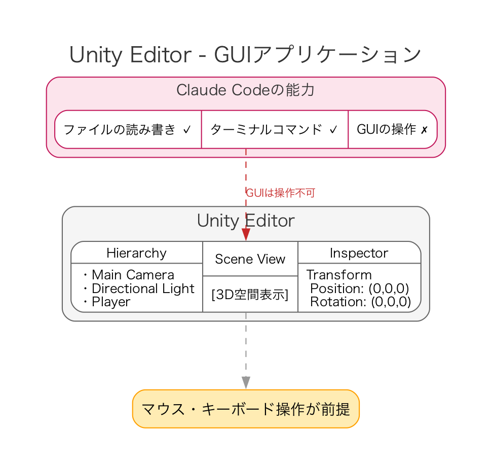
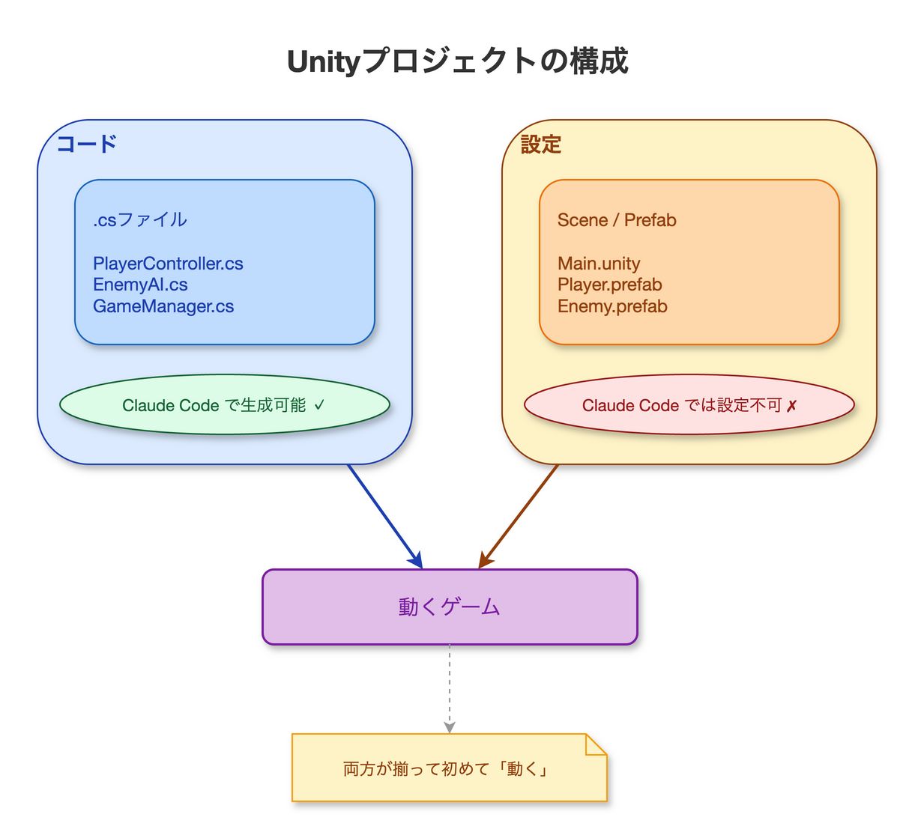

# AIとUnityだけでどこまでできるか

「AIでゲーム開発が自動化できる」——そう期待してClaude Codeを使い始めました。
しかし、Unity開発の現実は甘くありませんでした。

スクリプトは30秒で生成されるのに、Sceneへの配置で10分かかる。
この非対称性こそが、AI時代のUnity開発の本質的な課題です。

本記事では、Claude Code単体でUnity開発をした場合の限界を明確にします。
「どこまでできるか」を知ることで、適切なツール選択ができるようになります。

:::message
**この問題を解決するツールがあります**

本記事で説明する「Claude CodeでUnity Editorを操作できない」という問題は、**UniMCP4CC**（Unity MCP Server for Claude Code）で解決できます。

UniMCP4CCは、Claude CodeとUnity Editorを接続するMCPサーバーです。700以上のAPIを提供し、GameObject作成、コンポーネント追加、プロパティ設定、Timeline編集などをAIから直接実行できます。

- GitHub: [dsgarage/UniMCP4CC](https://github.com/dsgarage/UniMCP4CC)
- 対応Unity: 2021.3 LTS以降
- ライセンス: MIT

本記事を読んで「この問題を解決したい」と思った方は、ぜひUniMCP4CCをお試しください。
:::

---

## Claude Codeができること

まず、Claude Codeが得意とする領域を確認しましょう。

### 1. C#スクリプトの生成

これはClaude Codeの最も得意とする領域です。

```
あなた: 「プレイヤーの移動処理を書いて」

Claude Code:
「Assets/Scripts/PlayerController.cs を作成しました」
```

```csharp
// Claude Codeが生成したスクリプト
public class PlayerController : MonoBehaviour
{
    [SerializeField] private float moveSpeed = 5f;
    [SerializeField] private float jumpForce = 10f;

    private Rigidbody _rb;

    void Start()
    {
        _rb = GetComponent<Rigidbody>();
    }

    void Update()
    {
        float h = Input.GetAxis("Horizontal");
        float v = Input.GetAxis("Vertical");
        Vector3 movement = new Vector3(h, 0, v) * moveSpeed;
        _rb.velocity = new Vector3(movement.x, _rb.velocity.y, movement.z);
    }
}
```

このコードは問題なく動作します。Claude Codeはファイルシステムを操作できるため、`.cs`ファイルの生成・編集は完璧にこなせます。

### 2. ScriptableObjectの定義

データ構造の定義も得意です。

```csharp
// これも生成できます
[CreateAssetMenu(fileName = "EnemyData", menuName = "Game/EnemyData")]
public class EnemyData : ScriptableObject
{
    public string enemyName;
    public int health;
    public float moveSpeed;
    public GameObject prefab;
}
```

### 3. Editorスクリプトの生成

カスタムインスペクターやエディタ拡張も書けます。

```csharp
// カスタムインスペクターも書けます
[CustomEditor(typeof(EnemyData))]
public class EnemyDataEditor : Editor
{
    public override void OnInspectorGUI()
    {
        // カスタムUI...
    }
}
```

### 4. .metaファイルの確認

アセットのGUIDを調べることもできます。

```
あなた: 「このPrefabのGUIDを教えて」

Claude Code:
「Assets/Prefabs/Player.prefab.meta を確認しました。
  GUID: a1b2c3d4e5f6...」
```

---

## Claude Codeができないこと

ここからが本題です。Claude Codeには「見えない壁」があります。

### 1. Sceneへのオブジェクト配置

```
あなた: 「HierarchyにPlayerオブジェクトを作成して」

Claude Code:
「申し訳ありませんが、Unity Editorを直接操作することはできません。
  以下の手順で手動で作成してください：
  1. Hierarchyウィンドウで右クリック
  2. Create Empty を選択
  3. 名前を "Player" に変更」
```

**スクリプトは書けても、Sceneに配置できません。**

これが最も大きな制約です。ゲームを動かすには、オブジェクトがScene上に存在しなければなりません。

### 2. コンポーネントの追加

```
あなた: 「PlayerにRigidbodyを追加して」

Claude Code:
「Unity Editorの操作はできません。
  Inspectorで Add Component > Rigidbody を選択してください。」
```

スクリプトで`GetComponent<Rigidbody>()`を書いても、Rigidbodyがアタッチされていなければ動きません。

### 3. Inspectorでの値設定

ゲームの挙動を調整するには、コンポーネントのプロパティを細かく設定する必要があります。例えば、キャラクターの動きを物理的にリアルにするには、Rigidbodyの質量や抵抗値を調整します。

```
あなた: 「Rigidbodyのmassを5に設定して」

Claude Code:
「直接設定することはできません。
  Inspectorで Rigidbody コンポーネントの Mass フィールドに
  5 と入力してください。」
```

スクリプトでデフォルト値を設定することはできますが、実行時の挙動を見ながら「もう少し重くしたい」「もっと滑らかに動かしたい」といった調整は、Inspectorで行うのが一般的です。この試行錯誤の作業は、すべて手動になります。

### 4. SerializeFieldへの参照設定

Unityのスクリプトでは、`[SerializeField]`属性を使って他のオブジェクトへの参照をInspectorから設定できます。これは非常に便利な機能ですが、設定作業自体はドラッグ＆ドロップが必要です。

```
あなた: 「PlayerControllerのtargetにEnemyをドラッグして設定して」

Claude Code:
「ドラッグ＆ドロップ操作はできません。
  Inspectorでフィールドにオブジェクトをドラッグしてください。」
```

**これが最も面倒な作業の一つです。**

例えば、UIシステムを構築する場合を考えてみましょう：

```csharp
public class UIManager : MonoBehaviour
{
    [SerializeField] private Button startButton;
    [SerializeField] private Button settingsButton;
    [SerializeField] private Button quitButton;
    [SerializeField] private Text scoreText;
    [SerializeField] private Text timerText;
    [SerializeField] private Image healthBar;
    [SerializeField] private Image staminaBar;
    [SerializeField] private GameObject pausePanel;
    [SerializeField] private GameObject gameOverPanel;
    [SerializeField] private AudioSource bgmSource;
}
```

このスクリプトを書くのは30秒で終わりますが、10個の参照をすべて手動で設定する必要があります。1つ1つHierarchyからドラッグして、正しいフィールドにドロップする——この作業に5分以上かかることも珍しくありません。

### 5. AnimatorControllerの設定

キャラクターアニメーションは、ゲームの品質を大きく左右します。AnimatorControllerでは、ステート（状態）間の遷移条件を視覚的に設定しますが、これはGUI専用の作業です。

```
あなた: 「Idle→Walkのトランジションを作成して、
        Speedパラメータが0.1以上で遷移するようにして」

Claude Code:
「Animator Controllerの編集はできません。
  以下の手順で設定してください：
  1. Animatorウィンドウを開く
  2. Idle ステートを右クリック
  3. Make Transition を選択
  4. Walk ステートをクリック
  5. Transitionを選択
  6. Conditions に Speed > 0.1 を追加」
```

手順は教えてくれますが、実行はすべて人間の仕事です。

実際のゲームでは、以下のような複雑な遷移が必要になります：

- Idle ↔ Walk ↔ Run（移動速度による遷移）
- Any State → Jump（ジャンプは任意の状態から可能）
- Any State → Damage（被ダメージ）
- Attack → Idle（攻撃終了後の復帰）
- 各トランジションのブレンド時間調整
- 遷移条件の優先順位設定

これらをすべてAnimatorウィンドウで手作業で設定する必要があります。1キャラクターあたり30分〜1時間かかることも珍しくありません。

### 6. Prefabの作成・編集

Prefabは、Unityの再利用可能なアセットの基本です。敵キャラクター、アイテム、UI要素など、同じ構造のオブジェクトを複数配置する場合に必須の機能です。

```
あなた: 「このGameObjectをPrefab化して」

Claude Code:
「Prefabの作成はできません。
  HierarchyからProjectウィンドウにドラッグしてください。」
```

Prefabの作成自体は簡単ですが、問題は**Prefabの編集**です。Prefabを開いて、子オブジェクトを追加したり、コンポーネントの値を変更したり、Prefab Variantを作成したり——これらはすべてGUI操作が必要です。

また、Prefabの変更を「Apply」するか「Revert」するかの判断も、人間がInspector上で行う必要があります。

### 7. Timelineの編集

カットシーンやイベント演出には、Timelineが使われます。カメラワーク、キャラクターの動き、音声、エフェクトを時間軸で管理する強力なツールですが、完全にGUIベースです。

```
あなた: 「Timelineに新しいトラックを追加して」

Claude Code:
「Timeline編集はできません。
  Timelineウィンドウで + ボタンをクリックしてください。」
```

Timelineでの典型的な作業：

- Activation Track: オブジェクトの表示/非表示切り替え
- Animation Track: キャラクターアニメーションの配置
- Audio Track: BGMや効果音のタイミング調整
- Cinemachine Track: カメラワークの設定
- Signal Track: イベント発火ポイントの設定

これらのトラック追加、クリップの配置、タイミングの微調整は、すべてTimelineウィンドウ上でのマウス操作になります。1分のカットシーンを作るのに数時間かかることもあります。

### 8. Materialのプロパティ変更

ゲームのビジュアルを決定するのがMaterialです。色、テクスチャ、光沢、透明度など、見た目に関わるすべての設定がここで行われます。

```
あなた: 「このマテリアルの色を赤にして」

Claude Code:
「Materialの編集はできません。
  InspectorでAlbedo色を変更してください。」
```

Materialの設定は、見た目を確認しながらの調整が基本です：

- 「もう少し暗い赤にしたい」
- 「金属感を強くしたい」
- 「透明度を上げたい」

これらの調整は、Inspectorでスライダーを動かしながらScene Viewで結果を確認する作業です。コードで数値を書いても、実際に見るまで正解かどうかわかりません。結局、GUIでの試行錯誤が必要になります。

---

## なぜできないのか

技術的な背景を理解しておきましょう。

### Unity EditorはGUIアプリケーション



Unity Editorの操作はすべてGUIベースのため、Claude Codeからは操作できません。

### コードと設定の分離

Unityの設計は「コード」と「設定」が分離されています。



つまり、Claude Codeがいくら優秀でも、**半分しかカバーできない構造になっています。**

---

## 具体的な作業フロー比較

実際の作業で何が起きるか見てみましょう。

### ケース1：プレイヤーキャラクターのセットアップ

```
Step 1: スクリプト生成（AIができる）
├── PlayerController.cs を生成
└── 所要時間: 30秒

Step 2: Unity Editorでの設定（人間がやる）
├── Hierarchyで Create Empty
├── 名前を "Player" に変更
├── PlayerController.cs をアタッチ
├── Add Component > Rigidbody
├── Rigidbody の設定
│   ├── Mass: 1
│   ├── Drag: 0.5
│   └── Use Gravity: true
├── Add Component > Capsule Collider
├── Collider の設定
│   ├── Height: 2
│   └── Radius: 0.5
├── Transform の設定
│   └── Position: (0, 1, 0)
├── Tag を "Player" に設定
├── Layer を "Character" に設定
└── 所要時間: 3-5分

合計: 約5分（ほとんどが手作業）
```

**AIが手伝えるのは最初の30秒だけです。**

### ケース2：敵キャラクターを10体配置

Claude Codeはエディタスクリプトを生成できます：

```csharp
// EnemyPlacer.cs（エディタスクリプト）
[MenuItem("Tools/Place Enemies")]
public static void PlaceEnemies()
{
    for (int i = 0; i < 10; i++)
    {
        Vector3 pos = new Vector3(
            Random.Range(-10f, 10f),
            0,
            Random.Range(-10f, 10f)
        );
        // Prefabを読み込んでインスタンス化
        // ...
    }
}
```

**しかし問題があります：**

```
1. スクリプトを書く → コンパイル待ち（30秒〜1分）
2. メニューから実行 → 結果確認
3. 位置が気に入らない → スクリプト修正 → 再コンパイル
4. この往復が何度も発生
```

手動でドラッグ＆ドロップした方が速いケースも多いです。

---

## AnimatorControllerの設定例

最も手間がかかる作業の一つを詳しく見てみましょう。

### 要件

```
Idle ←→ Walk ←→ Run
  ↓
Attack（Triggerで遷移）
```

### Claude Codeができること

```csharp
// AnimatorControllerをスクリプトで生成するコードは書けます
using UnityEditor.Animations;

public class AnimatorSetup
{
    [MenuItem("Tools/Setup Animator")]
    public static void Setup()
    {
        var controller = AnimatorController.CreateAnimatorControllerAtPath(
            "Assets/Animations/PlayerAnimator.controller");

        var rootStateMachine = controller.layers[0].stateMachine;

        // ステート追加
        var idle = rootStateMachine.AddState("Idle");
        var walk = rootStateMachine.AddState("Walk");
        var run = rootStateMachine.AddState("Run");
        var attack = rootStateMachine.AddState("Attack");

        // パラメータ追加
        controller.AddParameter("Speed", AnimatorControllerParameterType.Float);
        controller.AddParameter("Attack", AnimatorControllerParameterType.Trigger);

        // トランジション追加
        var idleToWalk = idle.AddTransition(walk);
        idleToWalk.AddCondition(AnimatorConditionMode.Greater, 0.1f, "Speed");

        // ... 50行以上続きます
    }
}
```

### 問題点

| 項目 | 手間 |
|:---|:---|
| コード量 | 50行以上 |
| コンパイル待ち | 30秒〜1分 |
| 結果確認 | 実行してみないと分からない |
| 修正時 | 再コンパイルが必要 |

### 本来やりたいこと

```
あなた: 「Idle、Walk、Run、Attackのステートを作って、
        SpeedパラメータでIdle↔Walk↔Runを遷移、
        AttackトリガーでAttackに遷移するようにして」

AI: 「完了しました。Animatorウィンドウで確認してください。」
```

**これを一言で実現したいのですが、** Claude Code単体ではできません。

---

## 結局どうなるか

### 典型的な開発フロー

```
1. Claude Codeにスクリプト生成を依頼
   └── 30秒で完了

2. Unity Editorを開いて手動設定
   ├── オブジェクト配置: 2分
   ├── コンポーネント追加: 3分
   ├── プロパティ設定: 5分
   ├── 参照の設定: 3分
   └── 合計: 13分

3. 動作確認
   └── 問題発見

4. 修正
   ├── スクリプト修正はClaude Codeで: 30秒
   └── 設定修正は手動で: 5分

5. 2-4を繰り返し...
```

**AIが手伝えるのは全体の10%程度です。**

---

## まとめ

### Claude Code単体でできること

| できること | 詳細 |
|:---|:---|
| C#スクリプト生成 | 完璧に動作 |
| エディタスクリプト生成 | 書ける（実行は手動） |
| .metaファイルの読み取り | GUID等の確認 |

### Claude Code単体でできないこと

| できないこと | 理由 |
|:---|:---|
| Sceneへのオブジェクト配置 | GUI操作が必要 |
| コンポーネントの追加 | Inspector操作が必要 |
| プロパティの設定 | Inspector操作が必要 |
| 参照の設定 | ドラッグ&ドロップが必要 |
| AnimatorControllerの編集 | 専用ウィンドウ操作が必要 |
| Timelineの編集 | 専用ウィンドウ操作が必要 |
| Prefabの作成・編集 | GUI操作が必要 |

### 結論

```
Claude Code単体では、Unity開発の約10%しかカバーできません。
残り90%は依然として手作業です。
```

**コードを書く部分はAIが得意です。**
**しかし、Unity開発の大部分は「設定」であり、それはGUI操作なのです。**

---

## 次のステップ

この問題を解決する方法として、**MCP（Model Context Protocol）** が必要になるのです。

MCPを使えば、AIとUnity Editorを直接接続できます。

```
あなた: 「Playerを作成して、Rigidbodyを追加して、massを5にして」

Claude Code (MCP経由):
「完了しました。HierarchyにPlayerが表示されています。」
```

**これが本来あるべき姿になります。**

---

## 参考リンク

- [Claude Code 公式](https://claude.ai/code)
- [Unity Editor スクリプティング](https://docs.unity3d.com/Manual/editor-EditorWindows.html)

---
