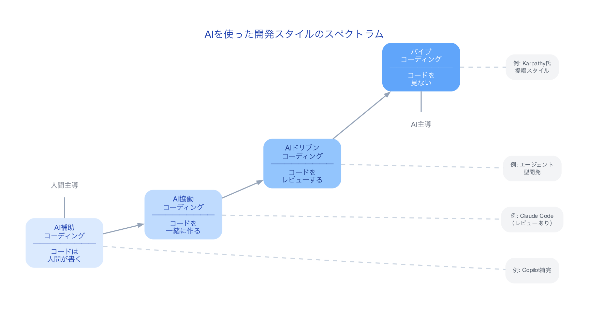

# バイブコーディングとは何か

皆様、あけましておめでとうございます。
いやはや年末から風邪を引いてしまい、派手に更新が遅れました。
申し訳ないです…(毎年年の瀬ラストスパートで体調を壊す)

本年もよろしくお願いします‼️

:::message
**Unity開発者の方へ**

本シリーズで紹介するAI×Unity開発を実践するためのツール**UniMCP4CC**を公開しています。
Claude CodeからUnity Editorを直接操作できるようになります。

- GitHub: [dsgarage/UniMCP4CC](https://github.com/dsgarage/UniMCP4CC)
- 対応Unity: 2021.3 LTS以降
- ライセンス: MIT
:::

---

## 私の誤解

本題に入る前に、一つ告白させてください。めちゃめちゃ恥ずかしいです。

私は「バイブコーディング」という言葉を、**AIを使ったプログラミング全般を指す表現**だと思っていました…

「AIにコードを書かせる = バイブコーディング」——そう理解していました。多少の齟齬はあっても、間違いではないとは思っていましたが。

しかし、これは誤りでした。

バイブコーディングには、もっと具体的で、ある意味**過激な定義**があります。

本記事では、この誤解を正しながら、バイブコーディングの本当の意味と、私たちがどう向き合うべきかに理解を深めるための記事として書かせていただきました。

---

## バイブコーディングの本当の定義

### 提唱者の言葉

**バイブコーディング（Vibe Coding）**は、2025年初頭に**[Andrej Karpathy氏](https://x.com/karpathy)**によって提唱されました。
Karpathy氏は元Tesla AI責任者であり、OpenAI創設メンバー、深層学習分野の第一人者です。

彼の[原文](https://x.com/karpathy/status/1886192184808149383)を引用します：


ここで重要なのは**「コードが存在することすら忘れる」**という部分です。

### 私の誤解との違い

```
私が思っていた「バイブコーディング」:
├── AIにコードを書かせる
├── 生成されたコードを確認する    ← ここをやっていた
├── 必要に応じて修正を指示する    ← ここもやっていた
└── 最終的に動くコードを得る

Karpathy氏が提唱した「バイブコーディング」:
├── AIにやりたいことを伝える
├── コードは見ない                ← 「忘れる」
├── 動くかどうかだけ確認する
└── 動かなければ「直して」と言うだけ
```

つまり、バイブコーディングとは：

> **AIを使ったプログラミング全般ではなく、「コードを一切読まずにAIに丸投げする」という極端なスタイル**

これが本来の定義です。

---

## なぜこの区別が重要か

### AIを使った開発スタイルの分類

AIを使ったプログラミングには、実際には複数のスタイルがあります：



| スタイル | 人間の関与 | 例 |
|:---|:---|:---|
| **AI補助** | AIは補完・提案のみ。コードは人間が書く | GitHub Copilot の Tab 補完 |
| **AI協働** | AIと対話しながら、一緒にコードを作る | Claude Code でレビューしながら開発 |
| **AIドリブン** | AIが主導。人間はレビューと方向修正 | エージェント型開発 |
| **バイブコーディング** | AIに丸投げ。コードは見ない | Karpathy氏の提唱するスタイル |

**私がやっていたのは「AI協働」や「AIドリブン」であり、バイブコーディングではなかったんです。**

---

## バイブコーディングの実態

### Karpathy氏の続きの言葉

同じ投稿の中で、Karpathy氏はこうも述べています：

> "I ask for the dumbest things like 'decrease the padding on the sidebar by half' because I'm too lazy to find it. I 'Accept All' always, I don't read the diffs anymore."
>
> 「サイドバーのパディングを半分にして」みたいな馬鹿げた指示を出す。探すのが面倒だから。差分も読まない。常に「すべて承認」だ。

これがバイブコーディングの実態です。

### 適用範囲

Karpathy氏自身も、これが全てのプロジェクトに適用できるとは言っていません：

> "It's not really for serious stuff. More for throwaway weekend projects where I just want to get something working."
>
> 「重要なものには向かない。週末に何か動くものを作りたいだけの使い捨てプロジェクト向けだ」

つまり：

```
バイブコーディングが向いている:
├── 個人の週末プロジェクト
├── プロトタイプ・実験
├── 使い捨てのツール
└── 学習目的のプロジェクト

バイブコーディングが向いていない:
├── 本番環境のプロダクト
├── チーム開発
├── セキュリティが重要なシステム
└── 長期保守が必要なコード
```

---

## 私たちはどう向き合うべきか

### 言葉の使い分け

「バイブコーディング」という言葉がバズワード化している今、正確な理解が重要です。

```
❌ 誤った使い方:
「最近バイブコーディングしてるよ」（Claude Code で普通に開発している場合）

✅ 正しい使い方:
「最近バイブコーディングしてるよ」（本当にコードを見ずに開発している場合）

✅ より正確な表現:
「最近 AI と協働でコーディングしてるよ」
「AIドリブンで開発してるよ」
```

### 現実的な開発スタイル

多くの開発者にとって、現実的なのは**AI協働**や**AIドリブン**のスタイルでしょう。

これらのスタイルでは：

- AIにコードを生成させる
- 生成されたコードを**レビューする**
- 問題があれば**修正を指示する**
- 必要に応じて**自分でも編集する**

これは立派なAI活用であり、決して「バイブコーディングもどき」ではありません。

---

## 戦略と戦術——開発スタイルの本質的な違い

### 従来の開発体制は「戦略」重視

従来のソフトウェア開発では、コードを書く前から多くのことを考えます：

```
従来の開発体制（戦略重視）:
├── 完成後のメンテナンスをどうするか
├── リリース後のバグ対応体制は？
├── ユーザーの反応をどう収集するか
├── スケールした時のアーキテクチャは？
├── チームメンバーが引き継げる設計か？
└── 技術的負債をどこまで許容するか
```

これは正しいアプローチです。特に大規模なプロダクトや長期運用を前提としたサービスでは、この「戦略」がなければ破綻します。

### バイブコーディングは「戦術」のみ

一方、バイブコーディングは**完成をゴールとする戦術**です：

```
バイブコーディング（戦術のみ）:
├── 今、動くものを作る
├── 完成したら終わり
└── その先は考えない
```

リリース後のことは考えない。ユーザーの反応も考えない。
とにかく「動くもの」を最速で作ることだけに集中する。

これを聞くと「無責任だ」と感じるかもしれません。しかし、これが有効な場面は確実にあります。

### 私の場合：経験値で戦術に振り切る

私自身は、**経験値を元に戦術へリソースを振り切る**スタイルを取っています。

なぜそれが可能かというと：

```
経験値がもたらすもの:
├── 「この設計は後で破綻する」が事前に分かる
├── 「このプラットフォームではこうすべき」が身体に染みついている
├── 「この規模なら問題ない」の判断ができる
└── 「やり直しになっても、このくらいの時間で済む」が見積もれる
```

つまり、**戦略を意識的に考えなくても、経験が無意識にガードレールになっている**状態です。

これにより、開発のスピード感とプラットフォームに対する最適化を同時並行で進められます。

### 戦略なき戦術は危険、戦術なき戦略は遅い

| アプローチ | メリット | リスク |
|:---|:---|:---|
| 戦略重視 | 長期的な品質・保守性 | 開発速度が遅い |
| 戦術のみ | 圧倒的なスピード | 破綻のリスク |
| 経験値で戦術特化 | スピードと品質の両立 | 経験がないと再現不可 |

バイブコーディングが「週末プロジェクト向け」と言われる理由はここにあります。
経験のない人が戦術だけで突っ走ると、本当に破綻するからです。

しかし、経験を積んだ開発者にとっては、**戦略を内在化した状態で戦術に振り切る**ことで、驚異的な開発速度を実現できる可能性がある——それがバイブコーディングの本当のポテンシャルだと私は考えています。
逆に、優秀な経営者が戦略だけをつらつら語るだけでは、戦術を主とする現場との温度差が生まれ、意識の乖離が広がるばかりです。

---

## バイブコーディングの功罪

### 功：開発の民主化

バイブコーディングの概念は、プログラミングの敷居を下げました。

- 非エンジニアでもアプリを作れる可能性
- アイデアを素早く形にできる
- 技術的負債を気にせず実験できる

### 罪：誤解と過信

一方で、この言葉が広まったことで：

- 「AIに任せておけば大丈夫」という過信
- コードを理解することの価値の軽視
- 品質や保守性の軽視

といった問題も生まれています。

---

## まとめ

### バイブコーディングとは

| 項目 | 内容 |
|:---|:---|
| **定義** | コードを見ずにAIに丸投げする開発スタイル |
| **提唱者** | Andrej Karpathy（2025年） |
| **特徴** | 「コードが存在することすら忘れる」 |
| **適用範囲** | プロトタイプ・個人プロジェクト向け |

### 私の誤解

| 誤解 | 正解 |
|:---|:---|
| AIを使ったプログラミング全般 | コードを見ないで丸投げするスタイル |
| 広い概念 | かなり限定的・極端なスタイル |

### AIを使った開発スタイルの選択

```
あなたのスタイルは？
├── コードを補完してもらう → AI補助コーディング
├── 対話しながら作る → AI協働コーディング
├── AIに任せてレビューする → AIドリブンコーディング
└── コードは見ない → バイブコーディング
```

どのスタイルが正解というわけではありません。
プロジェクトの性質、リスク許容度、チームの状況に応じて使い分けることが重要です。

---

## 参考リンク

- [Andrej Karpathy's original post on X](https://x.com/karpathy/status/1886192184808149383)
- [Wikipedia: Vibe coding](https://en.wikipedia.org/wiki/Vibe_coding)
- [InfoWorld: Vibe coding with Claude Code](https://www.infoworld.com/article/3853805/vibe-coding-with-claude-code.html)

---
