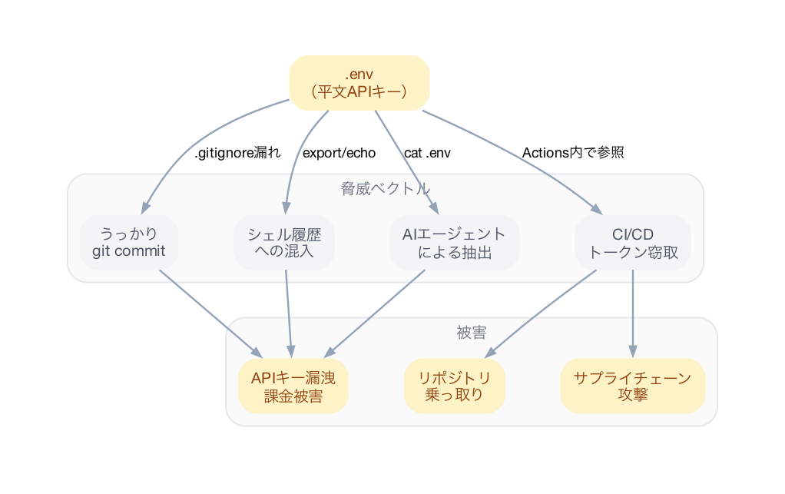
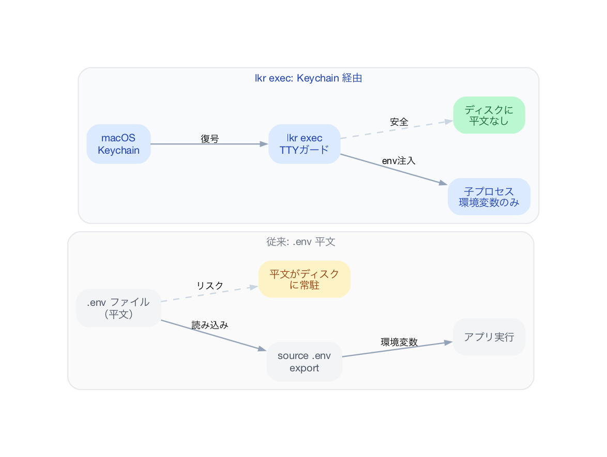
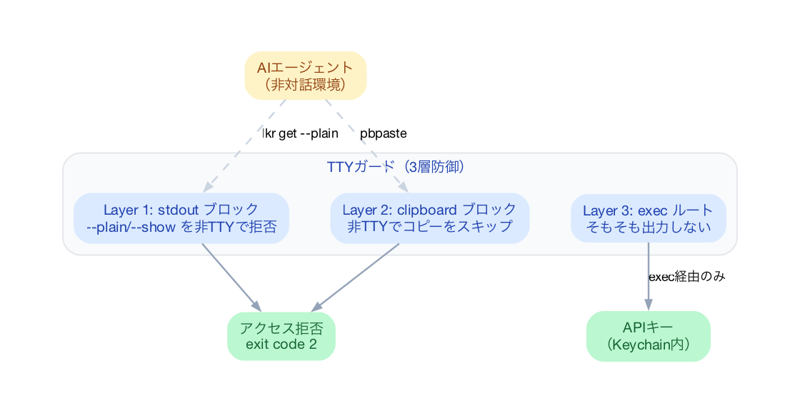

# Unity開発者が知るべき.envリスク — AIエージェント時代のAPIキー管理

「APIキーを `.env` に書いておけばOK」——Web開発の世界では常識的な運用です。しかし、Unity開発者にとって `.env` は馴染みのないファイルです。

Claude CodeやMCPを導入すると、Anthropic APIキー、X APIキー、各種MCPサーバーの認証情報など、**複数のAPIキーをローカル環境に置く必要**が出てきます。Webの慣習に従って `.env` に平文で書き始める。これが、AIエージェント時代の新しいセキュリティリスクです。

本記事では、Unity開発者が `.env` 平文保管のリスクを理解し、**macOS Keychain を使った安全なAPIキー管理**（LLM Key Ring）に移行するまでの具体的な手順を解説します。

---

## .envファイルとは何か

`.env` は、環境変数をキー=値の形式で記述するテキストファイルです。

```bash
# .env の例
ANTHROPIC_API_KEY=sk-ant-xxxxxxxxxxxxx
X_API_KEY=xxxxxxxxxxxxxxxx
X_API_SECRET=xxxxxxxxxxxxxxxx
MCP_SERVER_TOKEN=xxxxxxxxxxxxxxxx
```

Node.js の `dotenv` パッケージや、シェルの `source .env` で読み込んで使います。Webのバックエンド開発では極めて一般的な仕組みです。

### Unity開発者にとっての対比

Unity開発では、設定値の保管に別の仕組みを使ってきました。

| 用途 | Unity の仕組み | Web の仕組み |
|:---|:---|:---|
| ゲーム設定値 | `PlayerPrefs`（レジストリ/plist） | `.env` / 環境変数 |
| 開発用パラメータ | `ScriptableObject`（アセット） | `.env` / 設定ファイル |
| 秘密情報 | そもそも扱わない | `.env`（平文） |

**ポイントは3行目です**。Unity開発では、APIキーのような秘密情報をローカルに保管する場面がほぼありませんでした。Asset Storeのライセンスキーも Unity Hub が管理し、開発者が直接ファイルに書くことはありません。

---

## なぜ今Unity開発者に関係するのか

Claude Code + MCP の導入により、Unity開発者のローカル環境にAPIキーが出現するようになりました。

### 典型的なセットアップ

Claude Codeを使い始めると、以下のようなAPIキーが必要になります。

```bash
# Claude Code 本体
ANTHROPIC_API_KEY=sk-ant-xxxxxxxxxxxxx

# MCP サーバー（UniMCP4CC等）
# → claude_desktop_config.json に記載

# X API（ブログ投稿の自動化等）
X_API_KEY=xxxxxxxxxxxxxxxx
X_API_SECRET=xxxxxxxxxxxxxxxx
X_ACCESS_TOKEN=xxxxxxxxxxxxxxxx
X_ACCESS_TOKEN_SECRET=xxxxxxxxxxxxxxxx
```

これらを「とりあえず `.env` に書いておこう」と始める。Web開発者なら `.gitignore` に追加するのが習慣ですが、Unity開発者にはその習慣がありません。

### 脅威モデル



`.env` に平文で置いたAPIキーは、**4つの経路**で漏洩する可能性があります。

---

## .env平文保管の3つの脅威

### 脅威1: うっかり git commit

**最も多い事故**です。`.gitignore` に `.env` を追加していても、以下のケースで漏洩します。

```bash
# ケース1: .gitignore の追加を忘れた
git add -A
git commit -m "初期コミット"
# → .env がそのままプッシュされる

# ケース2: ファイル名を間違えた
# .env.production を .gitignore に書いたが
# 実際のファイルは .env.prod だった

# ケース3: AIエージェントが追加した
# Claude Code が git add -A を実行
```

GitHubには過去のコミットも残ります。一度プッシュしたAPIキーは、コミットを削除しても `git reflog` やフォークから復元可能です。

**実例**: GitGuardianの報告によると、2024年にGitHub上で**1,280万件**の秘密情報が新たに検出されています。

### 脅威2: シェル履歴への混入

APIキーをコマンドライン引数で渡すと、シェル履歴に平文で残ります。

```bash
# 履歴に残る
export ANTHROPIC_API_KEY=sk-ant-xxxxxxxxxxxxx
curl -H "x-api-key: sk-ant-xxxxxxxxxxxxx" https://api.anthropic.com/...

# ~/.zsh_history に永続保存される
```

`~/.zsh_history` や `~/.bash_history` はプレーンテキストです。マルウェアや不正アクセス時に真っ先に狙われるファイルの1つです。

### 脅威3: AIエージェントによる抽出

これが**AIエージェント時代の新しいリスク**です。

Claude Codeのようなエージェントは、ローカルファイルの読み取りとシェルコマンドの実行が可能です。悪意あるプロンプトインジェクション（たとえば、依存パッケージの README に仕込まれた指示）により、エージェントが以下を実行する可能性があります。

```bash
# エージェントが実行しうるコマンド
cat .env
echo $ANTHROPIC_API_KEY
env | grep API
```

2026年2月には、**hackerbot-claw** と呼ばれるAI自動攻撃ボットが、Microsoft、DataDog、CNCF等のOSSリポジトリのGitHub Actions設定ミスを自動スキャンし、CI/CDトークンを窃取する事件が発生しました。AIが自動でセキュリティ脆弱性を突く時代はすでに始まっています。

---

## 解決策 — LLM Key Ring（lkr）

[LLM Key Ring](https://github.com/yottayoshida/llm-key-ring)（`lkr`）は、yotta氏（[@yottayoshida](https://zenn.dev/yottayoshida)）が開発したRust製CLIツールです。APIキーを**macOS Keychainに暗号化保存**し、`.env` に平文で置く必要をゼロにします。

### 基本コンセプト

```
従来: .env → source → 環境変数 → アプリ
         ↑
      平文がディスクに常駐（危険）

lkr:  Keychain → lkr exec → 環境変数 → アプリ
         ↑
      暗号化保管（安全）
```

### インストールと初期設定

```bash
# Homebrew でインストール
brew install yottayoshida/tap/lkr

# APIキーを登録（対話的にプロンプトで入力）
lkr set ANTHROPIC_API_KEY --kind runtime
# → macOS Keychain に暗号化保存される

# 確認
lkr list
# ANTHROPIC_API_KEY  runtime  2026-03-03
```

### lkr exec ワークフロー

`lkr exec` は、Keychainからキーを復号し、**子プロセスの環境変数としてのみ**注入します。ディスクに平文を書き出しません。



```bash
# Claude Code を安全に起動
lkr exec -- claude

# 任意のコマンドを安全に実行
lkr exec -- python my_script.py
lkr exec -- node server.js
```

### 3層TTYガード

lkr の特徴は、**AIエージェントからの秘密抽出を防ぐ3層のガード**を備えている点です。



| レイヤー | 防御内容 | 攻撃例 |
|:---|:---|:---|
| Layer 1: stdout ブロック | 非対話環境で `--plain`/`--show` を拒否 | `lkr get KEY --plain` |
| Layer 2: clipboard ブロック | 非TTYでクリップボードコピーをスキップ | `pbpaste` での取得 |
| Layer 3: exec デフォルト | 「出力しない」が最強の防御 | そもそも値が表示されない |

つまり、AIエージェントが `lkr get ANTHROPIC_API_KEY --plain` を実行しても、非TTY環境では拒否されます。キーを取得する唯一の方法は `lkr exec` で子プロセスとして起動することです。

### 種別管理（runtime / admin）

```bash
# runtime: 日常的なAPI呼び出し用
lkr set ANTHROPIC_API_KEY --kind runtime

# admin: 強権限（使用量確認等）
lkr set ANTHROPIC_ADMIN_KEY --kind admin

# exec/gen は runtime のみ注入 → 権限混在を防止
lkr exec -- claude  # runtime キーのみ注入
```

---

## Unity開発での実践

### Claude Code を lkr exec で起動する

```bash
# ① APIキーを登録（初回のみ）
lkr set ANTHROPIC_API_KEY --kind runtime

# ② Claude Code を安全に起動
lkr exec -- claude

# これだけ。.env は不要。
```

### MCP設定での活用

Claude Codeの MCP設定（`claude_desktop_config.json`）で外部APIキーが必要な場合も、`lkr exec` 経由で起動すれば、環境変数として自動的に渡されます。

```bash
# X API キーも登録
lkr set X_API_KEY --kind runtime
lkr set X_API_SECRET --kind runtime
lkr set X_ACCESS_TOKEN --kind runtime
lkr set X_ACCESS_TOKEN_SECRET --kind runtime

# まとめて起動
lkr exec -- claude
# → ANTHROPIC_API_KEY, X_API_KEY 等がすべて環境変数として注入
```

### プロジェクトの .gitignore 確認

lkr を導入しても、既存の `.env` ファイルが残っていないか確認しましょう。

```bash
# .env が git 追跡対象になっていないか確認
git ls-files --cached | grep -i env

# .gitignore に .env が含まれているか確認
grep -n "\.env" .gitignore
```

---

## まとめ

### 従来 vs lkr 比較

| 項目 | 従来（.env） | lkr（Keychain） |
|:---|:---|:---|
| 保管場所 | プレーンテキストファイル | macOS Keychain（暗号化） |
| git 漏洩リスク | `.gitignore` 依存（人的ミス） | ファイルが存在しない |
| シェル履歴 | `export` で残る | `lkr exec` で残らない |
| AIエージェント耐性 | `cat .env` で読める | TTYガードで拒否 |
| セットアップ | 簡単 | `brew install` + `lkr set` |

### 最低限やるべき3つのこと

1. **`.env` をやめる** — `lkr set` でKeychainに移行し、`.env` ファイルを削除する
2. **`lkr exec -- claude` で起動する** — これだけで全APIキーが安全に注入される
3. **`.gitignore` を確認する** — 過去に `.env` をコミットしていないか `git log` で確認する

---

:::message
**Unity開発者の方へ**

Claude Codeは強力なツールですが、Unity Editorを直接操作することはできません。
この問題を解決するのが**UniMCP4CC**（Unity MCP Server for Claude Code）です。

- GitHub: [dsgarage/UniMCP4CC](https://github.com/dsgarage/UniMCP4CC)
- 対応Unity: 2021.3 LTS以降
- ライセンス: MIT
:::

---

## 参考リンク

- [もう.envにAPIキーを平文で置くのはやめた — macOS Keychain管理CLI「LLM Key Ring」（yotta氏）](https://zenn.dev/yottayoshida/articles/llm-key-ring-secure-api-key-management)
- [LLM Key Ring GitHub](https://github.com/yottayoshida/llm-key-ring)
- [hackerbot-claw: GitHub Actions Exploitation（StepSecurity）](https://www.stepsecurity.io/blog/hackerbot-claw-github-actions-exploitation)
- [Claude Code ステータスページ](https://status.anthropic.com)
