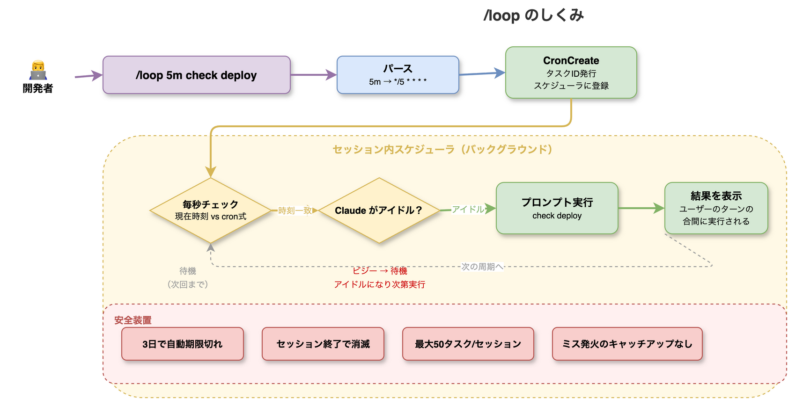

# Claude Codeの新機能 /loop でタスクを自動化する

「デプロイ後の動作確認、毎回手動で `/check` を打つのが面倒」「PRレビューを定期的にかけたいが、つい忘れてしまう」——Claude Codeを日常的に使っていると、**繰り返しのプロンプト実行**を自動化したくなる場面が増えてきます。

v2.1.71で追加された `/loop` コマンドは、まさにこの課題を解決します。`/loop 5m check deploy` と打つだけで、5分ごとにプロンプトが自動実行されます。cron式ベースのセッション内スケジューラが、あなたの代わりに定期タスクを回し続けます。

本記事では、`/loop` の内部アーキテクチャから実践的なユースケースまでを解説します。「何ができて、何に注意が必要か」を理解することで、開発ワークフローを一段階自動化できるようになります。

---

## /loop の基本構文

`/loop` の構文はシンプルです。

```bash
# 基本形: /loop <間隔> <実行するプロンプト>
/loop 5m check the deploy

# スキルの定期実行
/loop 20m /review-pr 1234

# 1回だけのリマインダー（自然言語）
/loop remind me at 3pm to push
```

### インターバル記法

| 記法 | 意味 | 例 | 変換後のcron式 |
|:---|:---|:---|:---|
| `s` | 秒（最小1分に丸め） | `30s` | `*/1 * * * *` |
| `m` | 分 | `5m` | `*/5 * * * *` |
| `h` | 時間 | `2h` | `0 */2 * * *` |
| `d` | 日 | `1d` | `0 0 */1 * *` |
| 省略 | デフォルト10分 | `/loop check` | `*/10 * * * *` |

インターバルを省略した場合、デフォルトは**10分間隔**になります。秒単位の指定（`30s`）は最小1分に丸められるため、実質的に最短間隔は1分です。

---

## 内部アーキテクチャ

`/loop` はセッション内に cron ベースのスケジューラを構築します。以下の図が全体の流れです。



### 処理の流れ

1. **パース**: `/loop 5m check deploy` → インターバル `5m` を cron式 `*/5 * * * *` に変換
2. **CronCreate**: タスクIDを発行し、セッション内スケジューラに登録
3. **毎秒チェック**: 現在時刻と cron式を照合
4. **アイドル判定**: Claudeがビジー（ユーザーの質問に応答中）なら待機、アイドルなら実行
5. **プロンプト実行**: 登録されたプロンプトを自動実行
6. **結果表示**: ユーザーのターンの合間に結果を表示
7. **次の周期へ**: 再び毎秒チェックに戻る

重要なのは**ステップ4のアイドル判定**です。ユーザーがClaude と対話中の場合、スケジュールされたタスクは割り込まず、アイドルになるまで待機します。これにより、作業が中断される心配がありません。

---

## 管理ツール: CronCreate / CronList / CronDelete

`/loop` の裏側では、3つの cron 管理ツールが動作しています。

### CronCreate

タスクを新規登録します。`/loop` コマンドから自動的に呼ばれますが、Claudeが直接使うこともあります。

```
入力:
  - schedule: "*/5 * * * *"  (cron式)
  - prompt: "check deploy"   (実行するプロンプト)

出力:
  - taskId: "abc123"         (管理用ID)
```

### CronList

登録済みタスクの一覧を表示します。

```bash
# Claude に頼む
「今のスケジュールタスクを見せて」
```

### CronDelete

タスクを削除します。

```bash
# Claude に頼む
「デプロイチェックのタスクを止めて」
```

---

## cron式リファレンス

`/loop` が内部で使う cron式は標準的な5フィールド形式です。

```
┌───── 分 (0-59)
│ ┌───── 時 (0-23)
│ │ ┌───── 日 (1-31)
│ │ │ ┌───── 月 (1-12)
│ │ │ │ ┌───── 曜日 (0-6, 日曜=0)
│ │ │ │ │
* * * * *
```

| 式 | 意味 |
|:---|:---|
| `*/5 * * * *` | 5分ごと |
| `0 */2 * * *` | 2時間ごと（毎時0分） |
| `0 9 * * 1-5` | 平日9:00 |
| `30 14 * * *` | 毎日14:30 |

タイムゾーンは**ローカル時刻**が使われます。

---

## 実践的なユースケース

### 1. デプロイ後の定期監視

```bash
/loop 5m check the deploy status and alert me if anything looks wrong
```

デプロイ直後に設定しておけば、5分ごとに状態を確認してくれます。異常があればClaude が報告します。

### 2. PRレビューの定期実行

```bash
/loop 20m /review-pr 1234
```

スキル（`/review-pr`）を定期的に実行できます。PRに新しいコミットが追加されるたびに自動レビューが走ります。

### 3. テスト結果の監視

```bash
/loop 10m run the test suite and summarize failures
```

CI が不安定なプロジェクトで、テスト結果を定期的にサマリーしてもらえます。

### 4. ワンタイムリマインダー

```bash
/loop remind me at 3pm to push the changes
/loop remind me in 30 minutes to check the PR
```

自然言語でリマインダーを設定できます。1回実行されたら自動的に消えます。

---

## 安全装置: 4つのガードレール

`/loop` には暴走を防ぐ安全装置が組み込まれています。

| 安全装置 | 説明 |
|:---|:---|
| **3日で自動期限切れ** | 長期間放置しても無限に動き続けない |
| **セッション終了で消滅** | ターミナルを閉じれば全タスクが消える |
| **最大50タスク/セッション** | 過剰な登録を防止 |
| **ミス発火のキャッチアップなし** | 未実行のスケジュールは遡って実行されない |

### セッションスコープの意味

最も重要なのは「**セッション終了で消滅**」です。`/loop` で作成したタスクは永続化されません。Claude Codeのセッション（ターミナルウィンドウ）を閉じると、すべてのスケジュールタスクが消えます。

これは意図的な設計です。永続的なスケジューラが必要な場合は、OS の crontab や CI/CD パイプラインを使うべきです。`/loop` はあくまで**開発中の一時的な自動化**に特化しています。

### ジッター

タイミングの正確性には若干のジッター（揺らぎ）があります。「5分ごと」と設定しても、実行タイミングは±数秒ずれる可能性があります。秒単位の精度が必要な用途には向きません。

---

## 無効化する方法

チームやプロジェクトで `/loop` を使わせたくない場合、環境変数で無効化できます。

```bash
export CLAUDE_CODE_DISABLE_CRON=1
```

この環境変数を設定すると、`/loop` コマンドと CronCreate/CronList/CronDelete ツールが無効になります。

---

## /loop vs 従来のアプローチ

| 項目 | `/loop` | OS crontab | CI/CDスケジュール |
|:---|:---|:---|:---|
| セットアップ | 1行 | crontab 編集 | YAML設定 |
| 永続性 | セッション内のみ | OS再起動まで | 永続 |
| AIコンテキスト | あり（会話を理解） | なし | なし |
| 最小間隔 | 1分 | 1分 | 通常5分〜 |
| 用途 | 開発中の一時監視 | 定期バッチ処理 | CI/CD自動化 |

`/loop` の最大の強みは**AIコンテキストの保持**です。単にコマンドを実行するだけでなく、Claudeがプロジェクトの文脈を理解した上で結果を判断・報告してくれます。

---

## まとめ

- `/loop` は Claude Code v2.1.71 で追加されたセッション内スケジューラ
- `/loop 5m <プロンプト>` で5分ごとの自動実行が1行で完結
- 内部では cron式ベースのスケジューラが毎秒チェック→アイドル時に実行
- セッション終了で消滅する一時的な自動化ツール（永続化はしない）
- 4つの安全装置（3日期限、セッションスコープ、50タスク上限、キャッチアップなし）
- `CLAUDE_CODE_DISABLE_CRON=1` で無効化可能

開発中の「5分ごとに確認したい」「30分後にリマインドしてほしい」——そんな小さな自動化ニーズに、`/loop` は最適な解答です。

---

## 参考リンク

- [Claude Code v2.1.71 リリースノート](https://github.com/anthropics/claude-code/releases/tag/%40anthropic-ai%2Fclaude-code%402.1.71)
- [Claude Code 公式ドキュメント: Scheduled Tasks](https://code.claude.com/docs/en/scheduled-tasks)
- [Claude Code 公式サイト](https://code.claude.com)

---

:::message
**Claude Code をもっと活用したい方へ**

Claude Code の `/loop` のようなスケジューラ機能は、Unity開発でも威力を発揮します。
**UniMCP4CC**（Unity MCP Server for Claude Code）を使えば、Claude Code から Unity Editor を直接操作できます。

- GitHub: [dsgarage/UniMCP4CC](https://github.com/dsgarage/UniMCP4CC)
- 対応Unity: 2021.3 LTS以降
- ライセンス: MIT
:::
