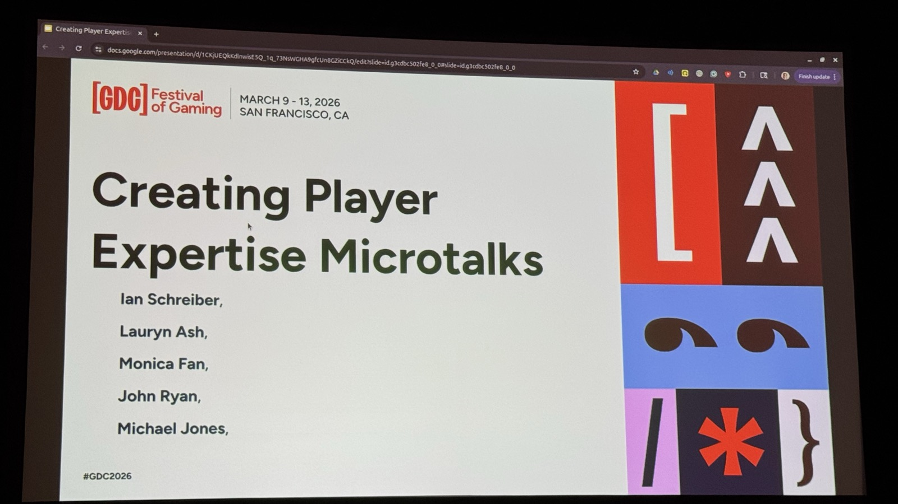
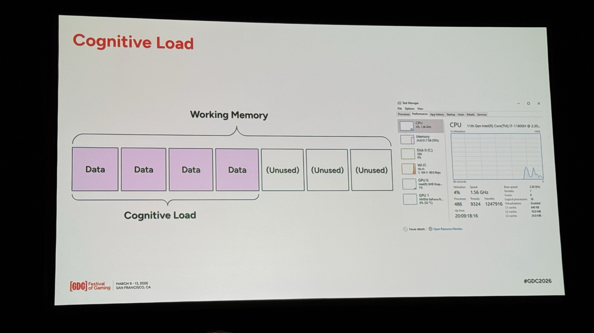
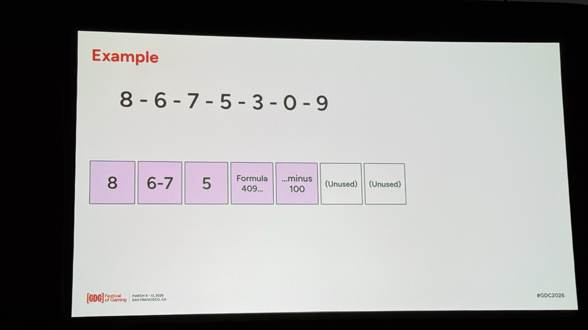
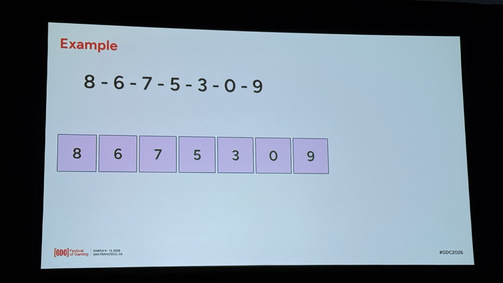
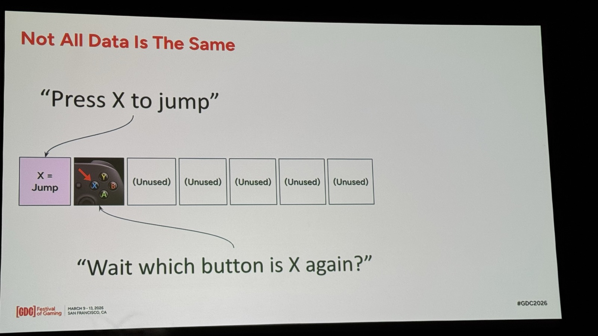
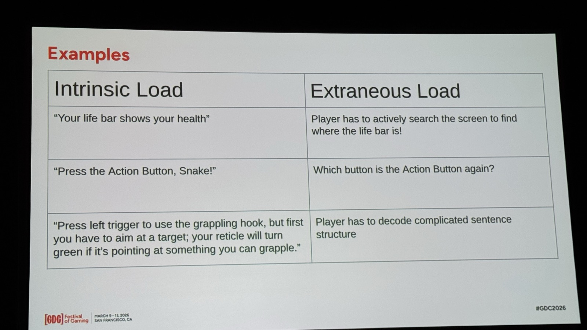
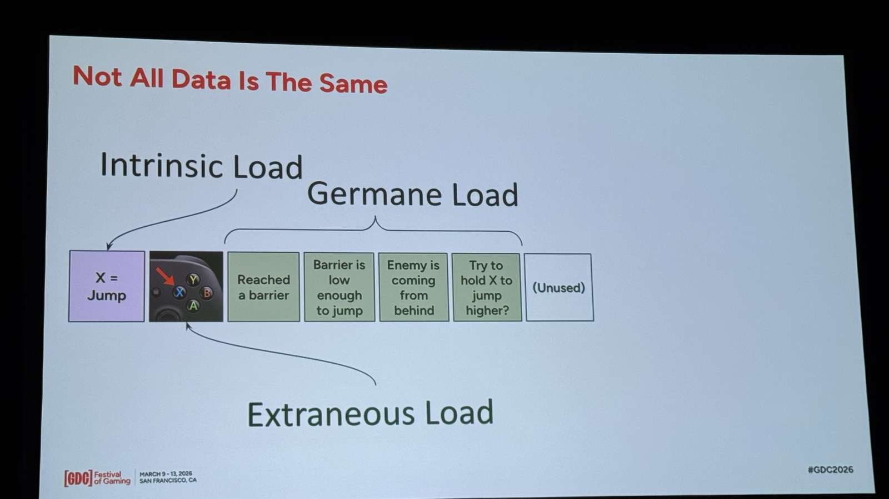
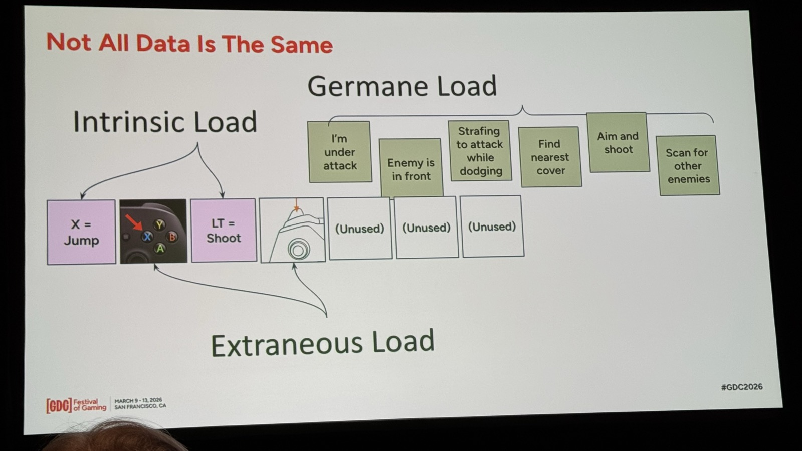

# GDC 2026: プレイヤーの上達を設計する——認知負荷理論からのアプローチ

「このゲーム、操作が多すぎて何をしていいか分からない」——チュートリアルを丁寧に作ったはずなのに、プレイテストでこう言われた経験はないでしょうか。

問題はコンテンツの量ではなく、**プレイヤーの脳が一度に処理できる情報量を超えている**ことにあります。認知心理学では、人間のワーキングメモリ（作業記憶）は約7スロットしかないことが知られています。このスロットをどう使わせるかが、上達体験の設計そのものです。

GDC 2026のDesignトラックで行われた **"Creating Player Expertise Microtalks"** で、Ian Schreiberはまさにこの**認知負荷理論（Cognitive Load Theory）**をゲームデザインに応用するアプローチを発表しました。

本記事では、現地で撮影したスライドとトランスクリプトをもとに、Schreiberの講演内容を詳しく解説します。



---

## セッション概要

| 項目 | 内容 |
|:---|:---|
| **タイトル** | Creating Player Expertise Microtalks |
| **トラック** | Design（Player Engagement） |
| **形式** | Microtalks（5人のショートトーク） |
| **日時** | 2026年3月10日（火）15:10–16:10 |
| **場所** | Room 2016, West Hall |
| **対象** | All Levels |

### スピーカー一覧

| スピーカー | 所属 | 専門領域 |
|:---|:---|:---|
| **Ian Schreiber** | Independent | ゲームバランス、学習曲線設計、教育 |
| **Lauryn Ash** | Stealth Startup | レベルデザイン、ナラティブデザイン |
| **Monica Fan** | Pipework Studio | ゲームプレイ＆システムデザイン、アクセシビリティ |
| **John Ryan** | Independent | ゲームデザイン |
| **Michael Jones** | Independent | ゲームデザイン |

---

## ワーキングメモリ = 脳のRAM

Schreiberはまず、人間のワーキングメモリをPCの**タスクマネージャー**に例えるところから始めました。



ワーキングメモリには約7つのスロットがあり、データを格納するとスロットが埋まっていきます。CPUの使用率が上がるとPCが重くなるように、**認知負荷が高まるとプレイヤーの脳も「ラグ」を起こす**。

ここで重要なのは、「タスクの難しさ」はタスクそのものではなく、**ワーキングメモリのスロットをいくつ消費するか**で決まるという点です。

---

## チャンキング: 7桁を5スロットに圧縮する

Schreiberは具体例として「**8-6-7-5-3-0-9**」という7桁の数字を挙げました。



何の前提知識もなければ、各桁がそれぞれ1スロットを占有し、7スロットすべてが埋まります。他のことは何もできません。

しかし、**既知のパターンを使ってまとめる（チャンキング）**と状況は変わります：



- 「8」→ 1スロット
- 「6-7」→ 連番として1スロット
- 「5」→ 1スロット
- 「Formula 409...」→ 洗剤ブランドの番号として1スロット
- 「...minus 100」→ 演算として1スロット

7スロット → 5スロットに圧縮され、**2スロットが空く**。この「空きスロット」が、より高度な思考に使えるリソースになります。

> この歌を知っていれば（"867-5309/Jenny"）、たった1スロットで済む。知らなければ7スロットすべてを使う。

**ゲームにおけるエキスパティーズとは、まさにこのチャンキングが進んだ状態のことです。**

---

## 3種類の認知負荷

Schreiberの講演の核心は、認知心理学の**3種類の認知負荷**をゲームチュートリアル設計に適用する部分です。

### Intrinsic Load（内在的負荷）: 覚えるべきデータそのもの

「Xボタンでジャンプ」——この情報自体が内在的負荷です。



しかし、「Xボタン」と言われたとき、プレイヤーは追加で考えなければなりません。Xbox コントローラーの左側のX？PlayStationの下のX？**どのXかを思い出す作業**は、本来覚えるべきデータとは別の負荷です。

### Extraneous Load（外在的負荷）: 本題以外に消費される無駄な負荷

Schreiberは3つの具体例を示しました：



| Intrinsic Load（本来のデータ） | Extraneous Load（余計な負荷） |
|:---|:---|
| 「ライフバーが体力を表す」 | 画面のどこにライフバーがあるか**探す** |
| 「アクションボタンでドアを開ける」 | アクションボタンが**どれか思い出す** |
| 「左トリガーでグラップリングフック。ただし先にターゲットにエイムする必要があり、レティクルが緑になったらグラップル可能」 | **複雑な文章構造を解読する** |

3つ目の例は特に重要です。**説明が複雑すぎると、その文章を理解すること自体がExtraneous Loadになる**。

> Extraneous Loadは「一時的なデバフ」のようなものだ。ワーキングメモリの使用可能スロットを減らしてしまう。チュートリアル設計では、これを可能な限り減らすべきだ。

### Germane Load（学習的負荷）: 学びと戦略に使われる「良い」負荷

3つ目の負荷が最も重要です。Germane Loadは、**プレイヤーが実際にスキルを習得するために使う認知リソース**です。



ジャンプを学んだばかりのプレイヤーの脳内：

| スロット | 種類 | 内容 |
|:---|:---|:---|
| 1 | Intrinsic | X = Jump |
| 2 | Extraneous | コントローラーのどのボタン？ |
| 3 | **Germane** | バリアに到達した |
| 4 | **Germane** | このバリアはジャンプで越えられる高さか？ |
| 5 | **Germane** | 後ろから敵が来ている |
| 6 | **Germane** | Xを長押しすればもっと高く跳べる？ |
| 7 | (Unused) | — |

Germane Loadは**Sid Meierの「興味深い決断の連続」そのもの**です。ワーキングメモリを適度に使わせることで、挑戦的だが過負荷にはならない。**この状態がフロー**です。

そしてGermane Loadを通じて練習されたスキルは、**長期記憶に転送**されます。一度長期記憶に入れば、ワーキングメモリのスロットは不要になります。「Xボタンはジャンプ」がもう考えなくても分かるようになれば、そのスロットはもっと面白い判断に使えるようになる。

---

## 認知過負荷: 脳がラグる瞬間



しかし、Germane Loadであっても**多すぎれば過負荷**になります。Schreiberは戦闘シーンの例を挙げました：

- 攻撃を受けている
- 敵が正面にいる
- ストレイフしながら攻撃＆回避
- 最寄りのカバーを探す
- エイムして射撃
- 他の敵もスキャン

これらが同時に押し寄せると、7スロットを超え、**脳が「ラグ」を起こします**。

> コンピュータのCPUが限界に達してRAMが足りなくなったときと同じことが起きる。プレイヤーの脳がラグを起こす。プレイテストでは、プレイヤーが立ち止まって撃たれ続ける。高次の戦略・戦術機能が一時的にブロックされるからだ。

### 脳のオーバークロック

人間の脳にはコンピュータにない能力がひとつあります。**一時的にワーキングメモリのスロットを増やせる**のです。ハードドライブを仮想RAMとして使い、CPUをオーバークロックするようなものです。

しかし、これには**コスト**が伴います：

> 脳はこの状態を好まない。ストレス、不安、緊張、フラストレーションを引き起こす。フロー状態の**完全な逆**だ。

短時間なら「パニック → 安全な場所に逃げる → 体勢を立て直す」というゲームプレイとして機能します。シューターで部屋に入ったら予想以上の敵がいた——数秒のパニックは許容範囲です。

しかし**長時間続くと「認知疲労（Cognitive Fatigue）」**になります：

```
認知過負荷の悪循環
──────────────────

情報過多 → 脳のオーバークロック → ストレス・不安
    ↓
長時間継続 → 認知疲労（Cognitive Fatigue）
    ↓
ワーキングメモリのスロットが一時的に減少（デバフ）
    ↓
過負荷がさらに悪化 → スパイラル
    ↓
闘争・逃走の生存モードに突入 → ゲームデザインとしては失敗
```

> プレイヤーに一度に大量のコントロールを学ばせるような場面が、プレイセッション全体にわたって続くと、認知疲労が起きる。脳をオーバークロックし続けると、ワーキングメモリのスロット数が一時的に**減少**する。これが過負荷をさらに悪化させ、スパイラルに陥り、最終的に闘争・逃走の生存モードに入る。デザイン的には、これは失敗状態だ。

---

## プレイテストで見える認知過負荷の兆候

Schreiberはプレイテストでの具体的な症状を列挙しました：

- 同じミスを**繰り返す**（コントロールやメカニクスを忘れている）
- UIと「**戦っている**」（操作が目的ではなく障害になっている）
- 「上手くなれない」という**無力感**
- ゲームから**弾かれる**感覚（「分からない、分かりたくもない」）
- **レイジクイット**

---

## ゲームデザイナーのためのテイクアウェイ

Schreiberの認知負荷理論から導かれるチュートリアル設計の指針：

### 1. Extraneous Load を最小化する

| やってしまいがちなこと | 改善策 |
|:---|:---|
| UIの位置を説明せずにデータを伝える | **ハイライト**で対象を示してからデータを伝える |
| 「アクションボタン」と抽象的に指示 | **実際のボタン名やアイコン**で指示する |
| 複雑な文章で一度に多くを説明 | **1つのアクション = 1つの指示**に分解する |

### 2. Germane Load を適切にコントロールする

- **少なすぎる**: 退屈。プレイヤーは学ばない
- **ちょうど良い**: フロー状態。スキルが長期記憶に転送される
- **多すぎる**: パニック → 認知疲労 → 離脱

### 3. Intrinsic Load の長期記憶化を促す

- メカニクスを**段階的に導入**し、各メカニクスが長期記憶に定着してから次を追加
- 定着したスキルはワーキングメモリを消費しなくなる → 空いたスロットで新しいスキルを学べる
- **これがPlayer Expertiseの正体**: チャンキングと長期記憶化によるワーキングメモリの効率化

### 4. 不要な情報を早く与えすぎるな

Schreiberが特に強調した実践的ポイントです：

> しゃがみを教えたのに、その後10時間使わないFPSのチュートリアル。ボードゲームのルールブックが「1ターンに3アクションポイント」と言いながら、アクションポイントの説明は3ページ後。文脈なしの情報は脳の中で遊休在庫になるだけだ。

### 5. Simplification Pass を行え

> デザイナーは設計を進めるうちに複雑さを追加しがちだ。武器と防具で別画面が本当に必要か？グレネードと射撃で別ボタンが必要か、グレネードを武器として扱えないか？

追加した複雑さの**正当性を厳しく検証**すること。コントロールが固まったら、認知負荷の増加がゲーム体験の向上に見合うか確認する。

### 6. ワーキングメモリスロットを実際に数えろ

> 客観的になれる。座って、プレイヤーが必要とするデータスロット数を実際にカウントすればいい。

ただし、プレイヤーの前提知識によってスロット消費は変わります。「Haloコントロール」と分かれば1スロットで済む人もいれば、初めてのゲームで12コントロールすべてが個別スロットになる人もいる。**特に注意すべきジャンル**：教育ゲーム、ジャンル入門作、ジャンルハイブリッド。

---

## なぜ「Player Expertise」が今重要なのか

このセッションがDesignトラックのPlayer Engagementカテゴリに分類されていることには意味があります。

ゲーム業界がF2Pやライブサービスにシフトする中、**プレイヤーの継続率**はビジネスの生命線です。外的報酬（ガチャ、シーズンパス）による継続はコストが高く、疲弊も早い。対して、**上達そのものが楽しい**というフロー体験は、最もコスト効率の良い継続装置です。

| 継続の駆動力 | コスト | 持続性 |
|:---|:---|:---|
| 新コンテンツ追加 | 高い（開発コスト） | コンテンツ消費で減衰 |
| 外的報酬（ガチャ等） | 中（企画コスト） | 報酬インフレで減衰 |
| **上達体験** | **低い（設計コスト）** | **自己強化ループで持続** |

認知負荷理論は、この上達体験を**科学的に設計するフレームワーク**を提供します。

---

## まとめ

Ian Schreiberの講演は、「プレイヤーの上達」を**認知心理学の言葉で精密に記述**したものでした。

1. **ワーキングメモリは約7スロット** — タスクの難しさはスロット消費量で決まる
2. **チャンキングがExpertise** — 既知のパターンにまとめることでスロットを節約できる
3. **3種類の認知負荷** — Extraneous（減らせ）、Germane（適切に使え）、Intrinsic（長期記憶に移せ）
4. **過負荷は認知疲労を引き起こす** — 短期のパニックはOK、長期は離脱の原因
5. **長期記憶化 = スロットの解放** — 基礎スキルが自動化されることで、より高度な判断が可能になる

プレイヤーが「自分は上手くなっている」と実感するとき、脳の中では**Intrinsic Loadが長期記憶に移行し、空いたスロットでGermane Loadを楽しんでいる**。この神経科学的プロセスを意図的に設計することが、Player Expertiseの本質です。

---

## 次のステップ

本記事ではIan Schreiberのトークを中心に解説しました。同セッションでは Lauryn Ash、Monica Fan、John Ryan、Michael Jones もそれぞれ異なる視点からPlayer Expertiseを語っています。トランスクリプトが揃い次第、続編として各スピーカーの知見もまとめる予定です。

:::message
**Unity開発者の方へ**

プレイヤーの認知負荷を考慮したチュートリアル設計をUnityで実装する際、AIによるプロトタイピングが有効です。
**UniMCP4CC**（Unity MCP Server for Claude Code）を使えば、AIがUnity Editorを直接操作してチュートリアルシーケンスを素早く構築できます。

- GitHub: [dsgarage/UniMCP4CC](https://github.com/dsgarage/UniMCP4CC)
- 対応Unity: 2021.3 LTS以降
- ライセンス: MIT
:::

---

## 参考リンク

- [GDC 2026 公式スケジュール](https://schedule.gdconf.com/)
- [Ian Schreiber — Game Design Concepts](https://gamedesignconcepts.wordpress.com/)
- [Ian Schreiber & Brenda Romero — Game Balance（Routledge）](https://www.routledge.com/Game-Balance/Schreiber-Romero/p/book/9781498799577)
- [Lauryn Ash — ポートフォリオ](https://laurynash.com/)
- [Monica Fan — GDC Speaker Profile](https://schedule.gdconf.com/speaker/fan-monica/58841)
- [7 Games with Great Learning Curves（Gamedeveloper.com）](https://www.gamedeveloper.com/design/7-games-with-great-learning-curves-that-all-developers-should-study)
