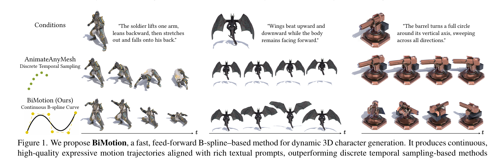
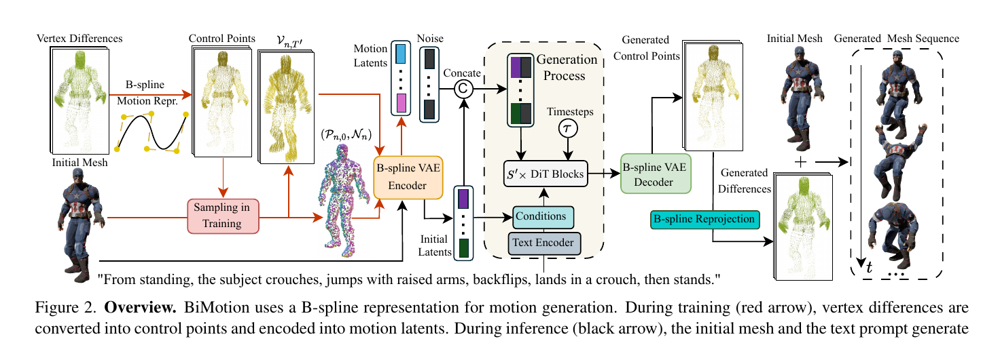
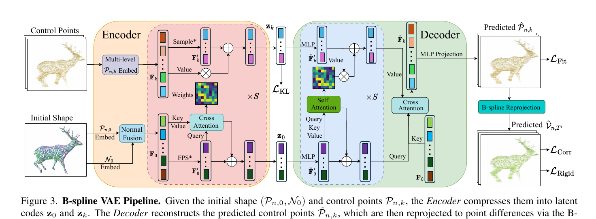
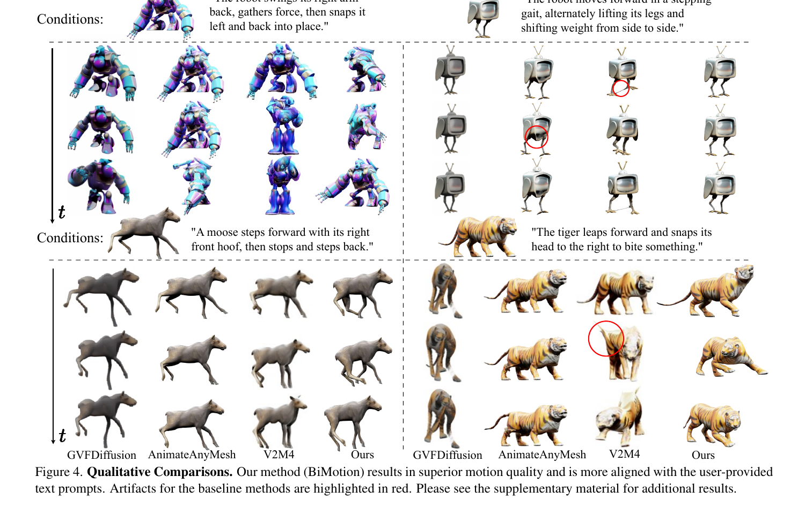
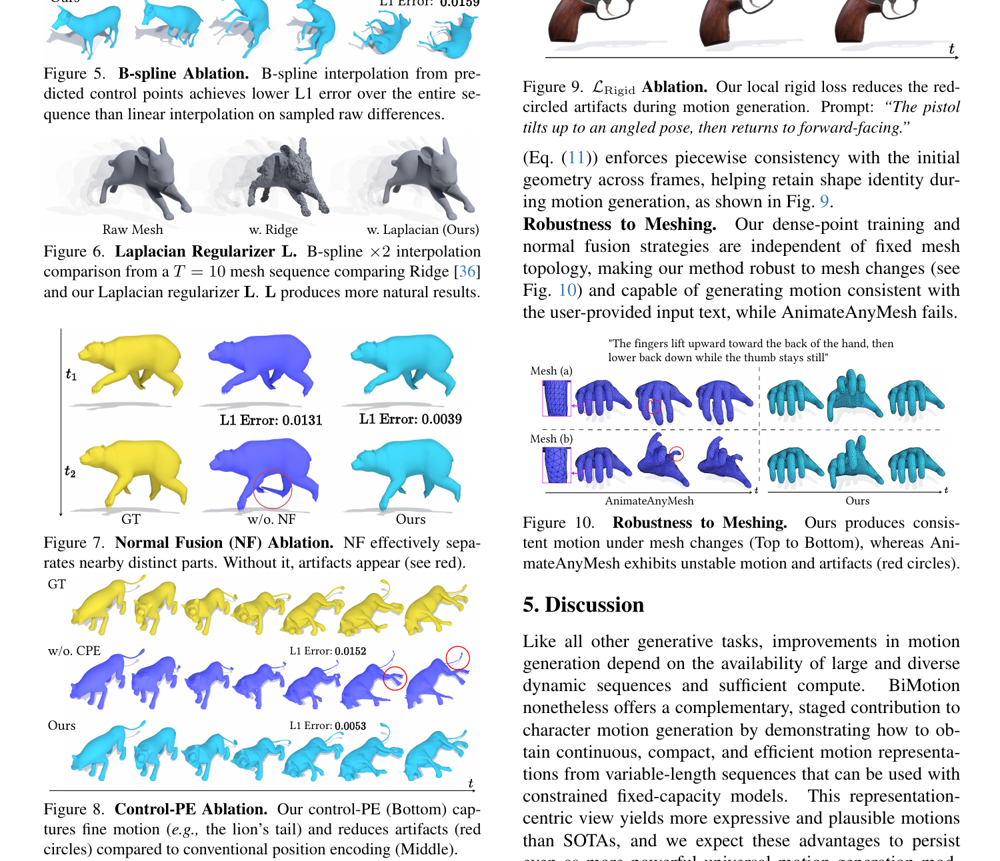

# BiMotion論文解説: B-splineでテキストから3Dキャラを自然に動かす

この論文は、University of Michigan の **Jason J. Corso 教授**が著者として参加し、Xでも紹介していた研究です。Corso 氏はコンピュータビジョン分野の研究者であり、同時に Voxel51 の共同創業者でもあります。そのため、この論文も「純粋な理論研究」だけでなく、実際の3D生成ワークフローにどう効くかという視点で読むと理解しやすいです。

この論文がやろうとしているのは、**長くて複雑な動作指示を、既存の3Dメッシュに対して自然なアニメーションとして成立させること**です。

たとえば「しゃがむ、跳ぶ、回る、着地する」のような複数段階の動きは、従来法だと途中で切れたり、動きが弱くなったり、カクついたりしやすい。BiMotion はこの問題に対して、フレームをそのまま並べて扱うのではなく、**動きそのものを滑らかな曲線として圧縮して持つ**ことで対応します。

著者側の一文要約をそのまま言い換えれば、これは**テキスト条件の動的3D生成において、フレームごとに個別処理していたことによるボトルネックを、B-spline ベースのモーション表現で乗り越えようとする研究**です。

「翼を上下に羽ばたかせながら前を向いたまま飛ぶ」「兵士が腕を上げて後ろに倒れ込む」。

こうした**複数の意味を含む長い動作指示**を、既存の text-to-motion 系 3D アニメーション手法はうまく扱えません。理由は単純で、多くの手法が内部的には**固定長のフレーム列**しか扱えないからです。長い動作は切り詰められ、短い動作は間引かれ、結果として「一部しか再現しない」「不自然にカクつく」になります。

2026年3月2日に arXiv v2 が公開された **BiMotion** は、この問題を「生成モデルを大型化する」のではなく、**モーション表現そのものを変える**ことで解こうとしています。フレーム列ではなく、頂点運動を **B-spline の連続曲線**として持つ。ここでいう B-spline は、点をたくさん並べて動きを記録する代わりに、**少数の基準点から滑らかな軌跡を作る曲線表現**です。これが論文の核です。

本記事では、論文 `BiMotion: B-spline Motion for Text-guided Dynamic 3D Character Generation` を、ゲーム・3D生成・アニメーション用途の観点から整理して解説します。

---

## 論文情報

| 項目 | 内容 |
|:---|:---|
| タイトル | BiMotion: B-spline Motion for Text-guided Dynamic 3D Character Generation |
| 著者 | Miaowei Wang, Qingxuan Yan, Zhi Cao, Yayuan Li, Oisin Mac Aodha, Jason J. Corso, Amir Vaxman |
| 公開 | arXiv:2602.18873v2, 2026年3月2日 |
| URL | https://arxiv.org/abs/2602.18873 |
| ひとことで言うと | 可変長の3Dモーションを B-spline 制御点に圧縮して、固定容量の生成モデルでも長く意味の通った動作を生成できるようにした手法 |

---

## 先に用語を軽く整理

読み進めやすくするために、この論文で頻出する単語を先に短く置いておきます。

| 用語 | この記事での意味 |
|:---|:---|
| B-spline | 少数の点から滑らかな曲線を作る表現。ここでは「動きの軌跡をコンパクトに持つ方法」 |
| 制御点 | 曲線の形を決める基準点。動画でいう各フレームそのものではない |
| feed-forward | 1回の推論で結果を出すタイプ。逐次最適化より速いが、表現力に制約が出やすい |
| VAE | データをいったん小さな表現に圧縮して、そこから復元する学習器 |
| 潜在表現 / latent | 圧縮後の内部表現。人間向けの画像や文章ではなく、モデルが扱いやすい要約ベクトル |
| diffusion / flow | ノイズから少しずつ望む結果へ近づける生成のやり方 |
| トポロジー | メッシュのつながり方。頂点数や面の構成が変わるとトポロジーが変わる |

---

## まず何が問題だったのか

既存の **feed-forward 型** 3D モーション生成は高速ですが、構造的な弱点があります。ここでいう feed-forward 型とは、1回の推論でまとめて答えを出す方式です。時間は短く済む一方で、扱える入力形式に強い制約が入りやすいです。

| 既存手法の前提 | そこで起きる問題 |
|:---|:---|
| 入力長が固定 | 長い動作をそのまま入れられない |
| フレーム単位で離散表現する | 時間的に滑らかさが失われやすい |
| 学習時に切り出しや間引きを使う | 動作の意味が途中で切れる |
| メッシュ依存の処理が重い | 頂点数が増えると計算とメモリが増える |

たとえば「しゃがむ → ジャンプ → バク転 → 着地 → 立ち上がる」のような一連の動作は、固定16フレームの断片だけでは持ちきれません。論文の主張ははっきりしていて、**ボトルネックは生成器の能力不足だけではなく、モーションをフレーム列で持っていること自体にある**というものです。

---

## BiMotionのコアアイデア

BiMotion は、各頂点の時間方向の変位をフレーム列で持つ代わりに、**少数の B-spline 制御点**で持ちます。制御点は「各フレームの位置そのもの」ではなく、「その間をどう動くかを決める基準点」です。

### B-spline を使うと何がうれしいのか

論文では、モーション表現として B-spline が向く理由を3つ挙げています。

1. **連続で微分可能**なので、軌跡が自然になる
2. **局所制御**できるので、1つの制御点の変更が全体を壊しにくい
3. **時間再パラメータ化**できるので、任意の長さに再サンプリングできる

ここが重要です。BiMotion は「16フレームしか出せないモデル」を「200フレーム出せるモデル」に変えたわけではありません。  
**16個前後の制御点で運動の意味を持たせ、必要な長さにあとから連続再生する**設計に変えています。

---

## 全体パイプライン

学習時と生成時の流れはかなり整理されています。

### 学習時

1. 初期メッシュから各頂点の変位系列を得る
2. その変位系列を B-spline で近似して制御点へ圧縮する
3. 制御点を B-spline 専用 VAE に入れてモーション潜在へ落とす
4. 初期形状とテキストを条件に、その潜在分布を生成器に学習させる

### 推論時

1. 入力は `初期メッシュ + テキスト`
2. 生成器がモーション潜在を出す
3. VAE デコーダが制御点を復元する
4. B-spline から任意長の頂点軌跡を再構成してメッシュ列を出す

この流れの肝は、**可変長データをいったん固定長の制御点に圧縮してから学習する**ことです。  
VAE は「いったん小さく要約してから戻す装置」、潜在は「その要約された内部表現」と考えると追いやすいです。

---

## B-spline VAEは何を工夫しているのか

論文の新規性は B-spline 表現だけではありません。VAE 側にも専用設計が入っています。

### 1. Laplacian 正則化付き B-spline フィッティング

短い系列に対して制御点数が相対的に多いと、単純な最小二乗では軌跡が不安定になります。そこで BiMotion は、隣接制御点の変化を滑らかにする **Laplacian regularization** を入れた閉形式解を使います。難しく見えますが、やっていることは「制御点がギザギザ暴れないように、自然なつながりを優先する」調整です。

これにより、

- 短い系列でも不自然なうねりを抑えられる
- 制御点への圧縮が速い
- CPU 上でも比較的軽く前処理できる

という利点があります。

### 2. Normal Fusion

頂点位置だけでは、空間的には近いがメッシュ上では別部位、というケースを見分けにくいです。そこで法線を別経路で埋め込み、位置特徴と融合しています。法線は「その面がどちらを向いているか」を表す情報です。これで、翼・腕・脚のような近接部位の動きを分離しやすくしています。

### 3. Multi-level Control-Point Embedding

制御点をそのまま周波数エンコーディングするのではなく、粗い運動から細かい残差へ分解する階層的埋め込みを使っています。要するに「全体の流れ」と「細部の揺れ」を別レイヤーで持つイメージです。これにより、**大まかな動作の流れと、末端の細かい動き**を同時に表現しやすくしています。

### 4. Correspondence Loss と Local Rigidity Loss

制御点だけを再構成して終わりではなく、B-spline で元の時系列へ再投影したあとで損失をかけています。損失というのは「どれくらい正解からズレているか」を数値化したものです。

- `Correspondence Loss`: 再投影された軌跡がGTの差分系列に合っているかを見る
- `Local Rigidity Loss`: 動かしても局所的な形の崩れを抑える

つまり、**制御点空間でうまく見えるだけでなく、最終的なメッシュ運動として破綻しないようにしている**わけです。

---

## データセット BIMO も実は大きい

BiMotion は手法だけでなく、学習データとして **BIMO** も用意しています。

| 項目 | 内容 |
|:---|:---|
| シーケンス数 | 38,944 |
| 総フレーム数 | 3,682,790 |
| 由来 | DeformingThings4D Animals, ObjaverseV1, ObjaverseXL |
| 特徴 | 可変長のメッシュモーション + 高品質テキスト注釈 |

ここも見逃せません。可変長モーションを扱うには表現だけでなく、**可変長で意味のある注釈付きデータ**が必要です。BiMotion の性能は、B-spline 表現と BIMO の両輪で成立しています。

---

## 結果はどうだったか

論文では、AnimateAnyMesh、GVFDiffusion、V2M4 と比較しています。

定性的には、BiMotion のほうが

- 動きが大きい
- テキスト条件に忠実
- 形状破綻が少ない

という傾向が見えます。論文中の定量評価もそれを裏付けています。

### 定量結果

| 手法 | OC ↑ | SC ↑ | TF ↑ | AQ ↑ | DD ↑ | Time ↓ | Peak GPU ↓ |
|:---|---:|---:|---:|---:|---:|---:|---:|
| GVFDiffusion | 0.167 | 0.920 | 0.986 | 0.505 | 0.650 | 2.141m | 14.057GB |
| AnimateAnyMesh | 0.155 | 0.951 | 0.993 | 0.514 | 0.100 | 16.847s | 3.102GB |
| V2M4 | 0.175 | 0.876 | 0.986 | 0.478 | 0.750 | 1.672h | 48.416GB |
| **BiMotion** | **0.187** | 0.948 | **0.995** | **0.529** | **0.800** | **4.383s** | **1.246GB** |

### ユーザ評価

| 手法 | Text-to-Motion Agreement ↑ | Motion Plausibility ↑ | Motion Expressiveness ↑ |
|:---|---:|---:|---:|
| GVFDiffusion | 2.343 | 2.300 | 2.443 |
| AnimateAnyMesh | 2.314 | 2.686 | 2.443 |
| V2M4 | 2.876 | 2.714 | 3.048 |
| **BiMotion** | **4.095** | **4.062** | **4.048** |

特に面白いのは、BiMotion が **高速なのに品質も高い** ことです。ここは production 観点でも価値があります。高品質化のために最適化ベースに寄せると遅くなりがちですが、BiMotion は表現を変えることで feed-forward のまま性能を押し上げています。

ここでの評価指標も少し補足しておくと、`OC` は「テキストと全体として合っているか」、`SC` は「見た目の主体が途中で別物になっていないか」、`TF` は「時間方向のちらつきの少なさ」、`AQ` は「見た目の品質」、`DD` は「ちゃんと動いているかの強さ」です。略称だけだと読みづらいので、ざっくりこの理解で十分です。

---

## アブレーションで分かること

論文の説得力は、どの部品が効いているかを丁寧に分解している点にもあります。

### B-spline 自体が効いている

単純な線形補間ベースより、B-spline 制御点からの再構成のほうが明確に誤差が低いです。つまり「B-spline は見た目の演出ではなく、表現としてちゃんと効いている」ことが確認されています。

### Laplacian 正則化が効いている

Ridge より自然な補間になり、短い系列を扱うときの破綻を減らしています。

### Normal Fusion が効いている

近接しているが別部位、というケースで部位の分離が改善します。これは生き物系メッシュや装飾の多いモデルで効きやすいはずです。

### Control-PE が効いている

末端の細かい動き、たとえば尻尾や羽のような細部の再現が改善します。

### Local Rigidity が効いている

動きながらも局所形状が崩れにくくなり、銃や機械部品のような剛体に近い対象でも安定しやすくなります。

---

## この論文が実務にとって面白い理由

BiMotion は「もっと大きいモデルで殴る」方向ではありません。  
**表現を変えることで、固定容量モデルの制約を迂回する**という、かなり工学的に筋の良いアプローチです。

実務で見ると、次の含意があります。

### 1. 長い動作を固定長モデルで扱う設計パターンになる

これは 3D モーションに限りません。可変長時系列を固定サイズに圧縮して生成する設計は、カメラ軌道、物体変形、VFX パラメータ列にも応用余地があります。

### 2. 生成器の前に「よい表現」を置く重要性を再確認させる

最近の生成研究はすぐに backbone の性能競争へ流れがちですが、この論文は**representation engineering がまだ強い**ことを示しています。backbone はモデル本体の中心部分、representation engineering は「何をどういう形でモデルに渡すかを設計すること」です。

### 3. 既存の3Dアセット資産と相性がいい

初期メッシュを与えて動かす設計なので、ゲームや映像の既存アセットライブラリとつなぎやすいです。ゼロから形状と動作を同時生成するより、ワークフローに乗せやすい可能性があります。

---

## 限界もある

論文自身も限界をはっきり書いています。

- 高周波で複雑な動きは、制御点数が少ないと表現しきれない
- 固定メッシュ前提なので、トポロジー変化には対応しない
- 大規模データと計算資源への依存は依然ある

つまり、BiMotion は「万能な4D生成」ではありません。  
ただし、**既存の固定容量生成器に対して、モーション表現の側から性能を押し上げる**という点で、かなり再利用価値の高い貢献です。

---

## まとめ

BiMotion の価値は次の3点に集約できます。

1. **フレーム列ではなく B-spline 制御点でモーションを持つ**ことで、可変長の意味ある動作を固定容量モデルへ載せた
2. **Normal Fusion、Control-PE、Correspondence / Local Rigidity Loss** で、制御点表現を実際のメッシュ運動へ落とし込んだ
3. **品質・速度・メモリ効率のバランス**で既存手法を上回った

3Dキャラクタ生成で「もっと長く、もっと意味のある動き」を出したいなら、モデルを大きくする前に**モーションを何で表現するか**を見直すべきだ。BiMotion はその好例です。

---

## 参考リンク

- [arXiv: BiMotion: B-spline Motion for Text-guided Dynamic 3D Character Generation](https://arxiv.org/abs/2602.18873)
- [Project Page: BiMotion](https://wangmiaowei.github.io/BiMotion.github.io/)
- [日本語要約PDF](PDF/bimotion_summary_ja.pdf)
