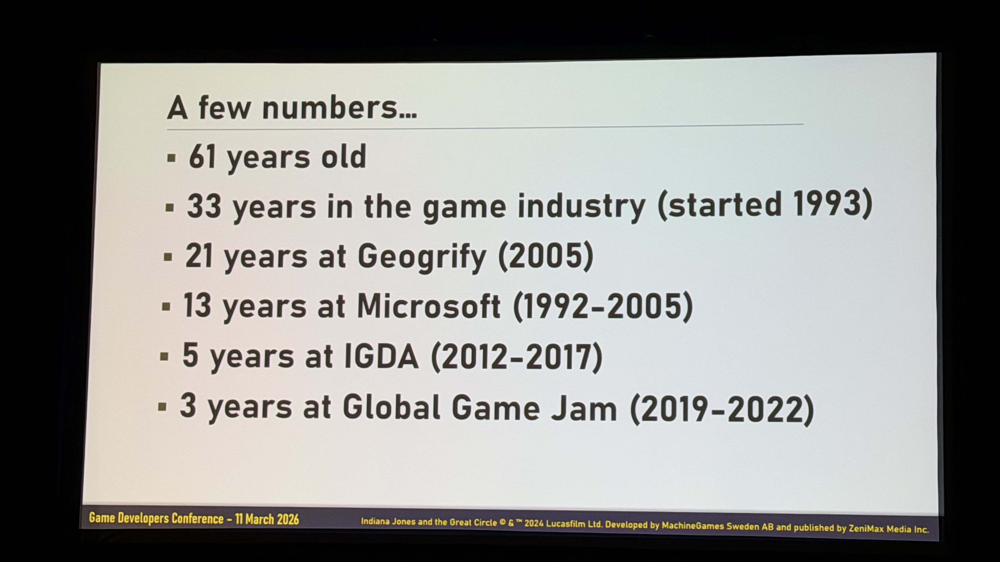
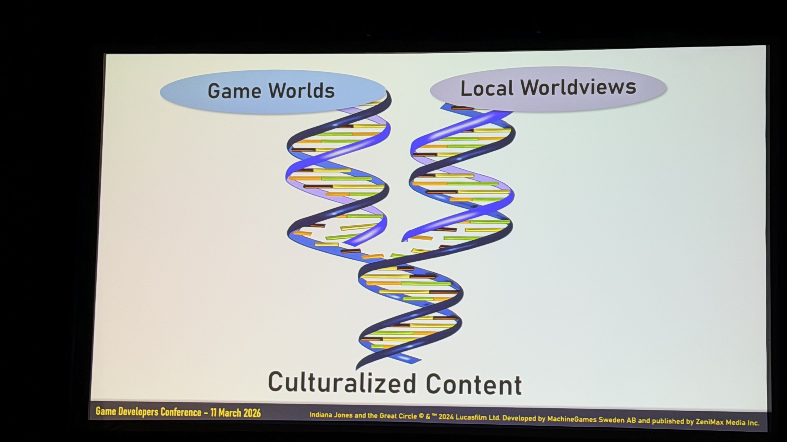
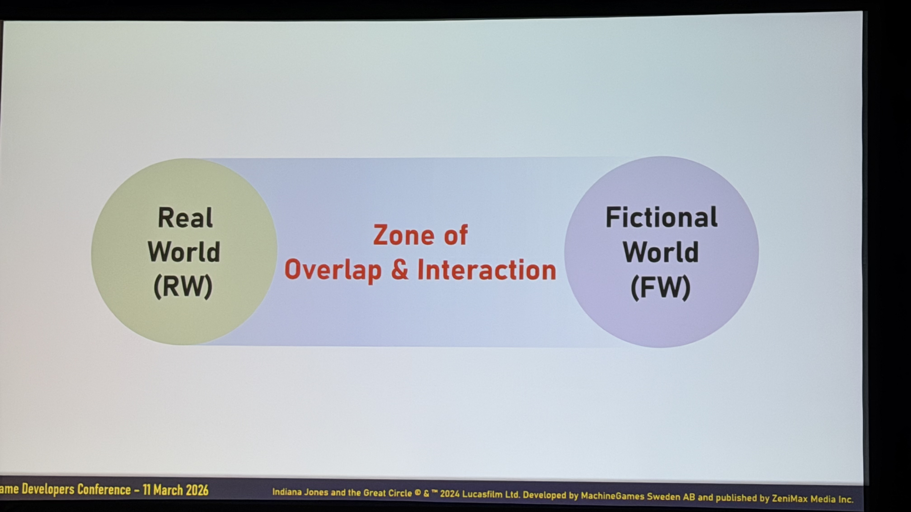
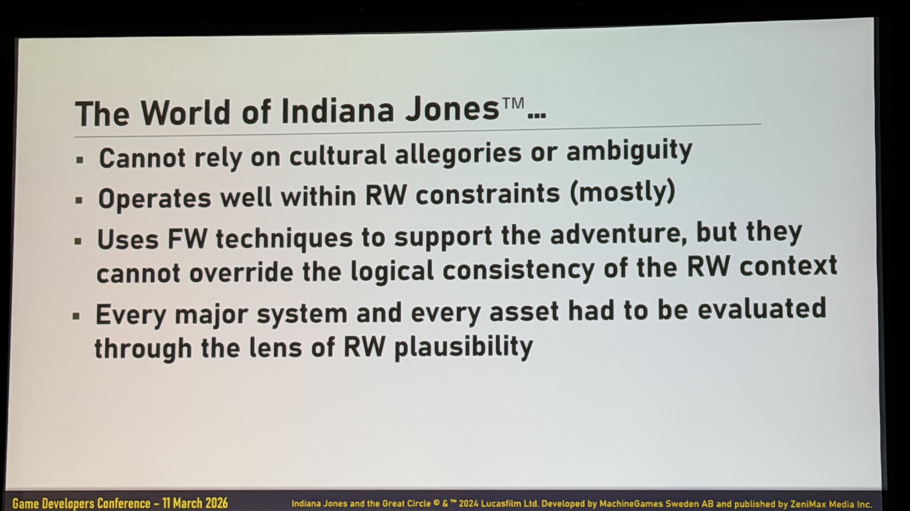
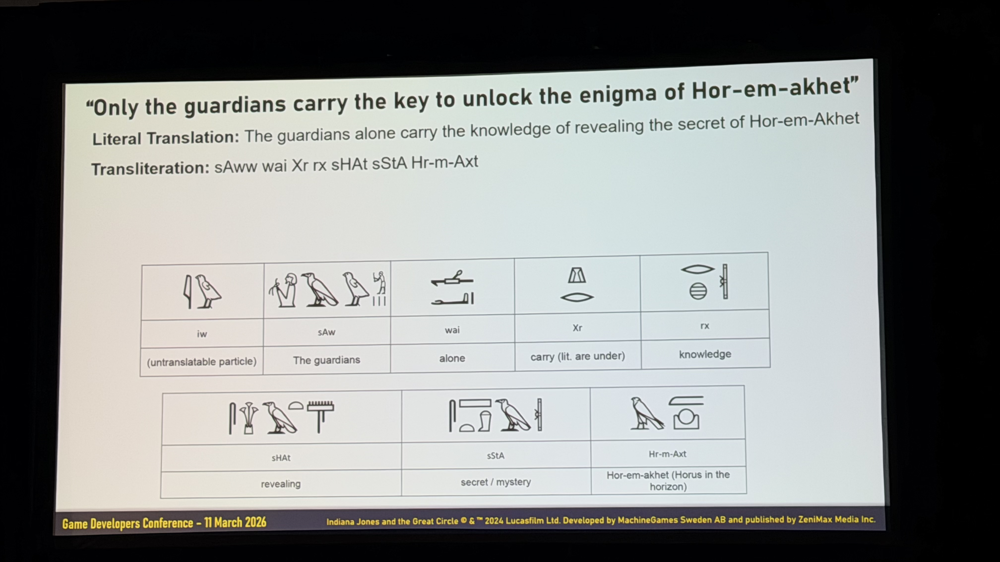
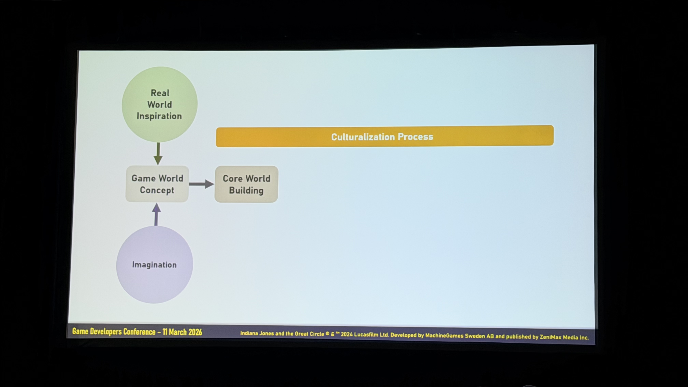
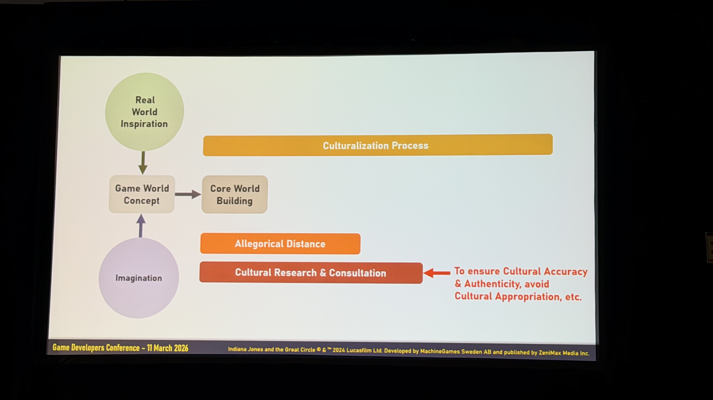
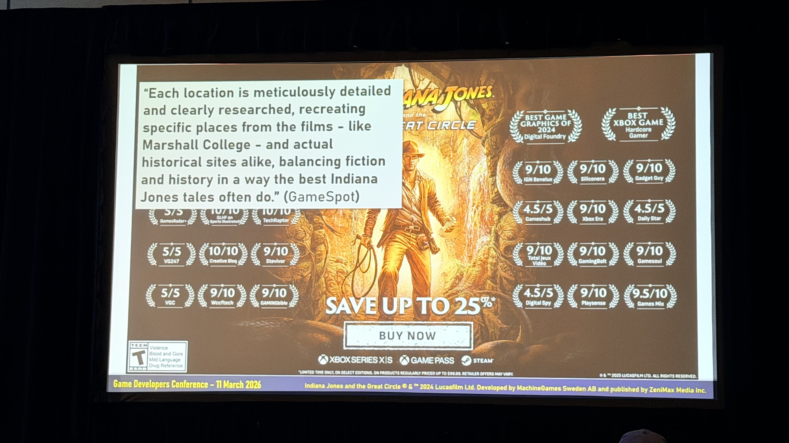
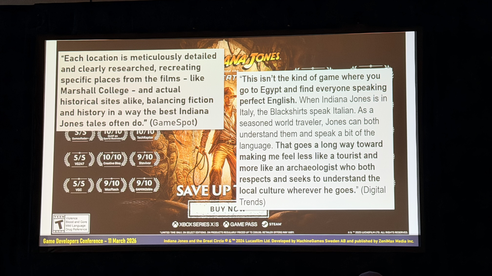
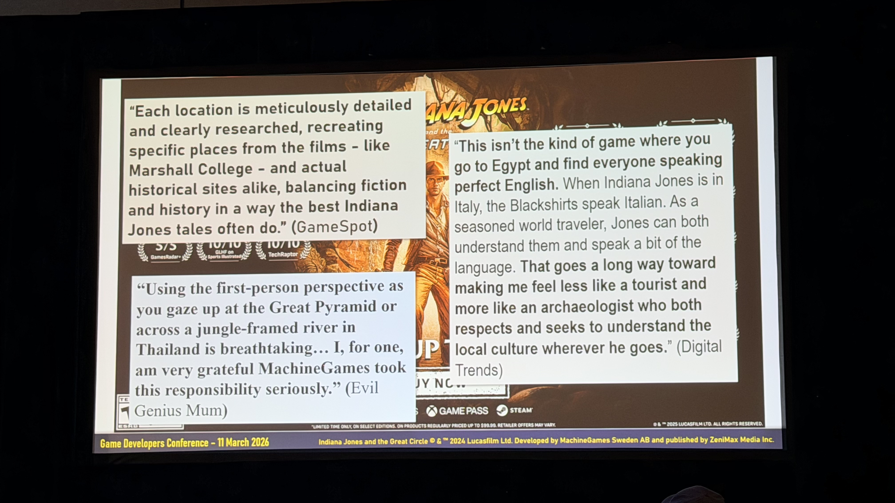

# GDC 2026: Kate Edwards が語る「文化化」— インディ・ジョーンズの世界を本物にする技術

「ゲームの世界に置いたオブジェクトは、ただそこに置くだけでいい」——そう思っていませんか。

環境アーティストが雰囲気を出すために地図を壁に貼る。キャラクターの衣装をそれっぽく作る。背景の装飾品を"それらしく"散りばめる。しかしその「それらしく」の基準が曖昧なとき、文化的誤表現という見えないリスクが積み上がっていきます。

GDC 2026で、地理学者であり「カルチャライゼーション（文化化）」のパイオニアであるKate Edwards（Geogrify CEO）が登壇し、**「インディ・ジョーンズ and the Great Circle」** における世界構築の裏側を語りました。33年・317本のゲームキャリアで磨き上げた「意図的な世界構築」の哲学を、スライドとともにレポートします。

---

## セッション概要

| 項目 | 内容 |
|:---|:---|
| **セッションタイトル** | Building the Cultural World of Indiana Jones and the Great Circle |
| **スピーカー** | Kate Edwards（Geographer & CEO, Geogrify / Former Executive Director, IGDA & Global Game Jam） |
| **日時** | 2026年3月11日（水）PDT |
| **会場** | Metreon（GDC 2026 サテライト会場、San Francisco） |
| **ゲームタイトル** | Indiana Jones and the Great Circle（MachineGames / Bethesda Softworks / Xbox Game Studios） |


---

## Kate Edwards とは何者か


Kate Edwardsは地理学者であり、ゲーム業界歴33年の「カルチャライゼーション」のパイオニアです。




| キャリア項目 | 年数 |
|:---|:---|
| ゲーム業界歴 | 33年（1993年〜） |
| Geogrify（自社） | 21年 |
| Microsoft | 13年 |
| IGDA 事務局長 | 5年 |
| Global Game Jam 代表 | 3年 |
| 携わったゲーム本数 | **317本** |

代表タイトルには Age of Empires（29年来の関係）、Halo、Dragon Age、Fallout シリーズ、Mass Effect、Assassin's Creed、Horizon Forbidden West など多数。


---

## セッションのテーマ


> *Exploring the interaction between what is real, what is represented, and what is perceived.*
>（現実にあるもの、表現されるもの、そして知覚されるもの——その相互作用を探る）

これが Kate Edwards の仕事の核心です。地理学者として、現実の地理とゲーム内で表現される世界を照合し、プレイヤーがその世界をどう「読む」かに意図を持たせる。

---

## 「カルチャライゼーション」とは何か




カルチャライゼーション（文化化）とは、ローカライゼーション（言語翻訳）の一歩先にある概念です。「Game Worlds（ゲームの世界観）」と「Local Worldviews（現地の世界観）」の二重らせんが交差することで、「Culturalized Content（文化化されたコンテンツ）」が生まれます。

この交差点の中に **Zone of In/Compatibility of Content Assets（コンテンツ資産の互換性ゾーン）** があり、Edwards の仕事はここを精査することです。

Edwards はこれを「遺伝子スプライシング（gene splicing）」に例えます。

> ゴールはゲームのクリエイティブビジョンを守り抜くこと。しかし、世界に届けるために必要な変更は外科的に行う。

---

## The Challenge：インディ・ジョーンズという難題


インディ・ジョーンズというIPは文化化において特別な難しさを持ちます。なぜなら——

- アドベンチャー・謎・世界旅行ファンタジーとして定義されている
- **実在する歴史・文化・場所に深く根ざしている**
- そのため「アレゴリー距離（Allegorical Distance）」が小さく、文化的表現への要求が非常に厳しい

---

## 「アレゴリー距離」という概念


> *Allegory: A fictional narrative that conveys a non-obvious meaning. Meaning exists on multiple levels, interpreted by the player through their interaction with the media.*
>（アレゴリー：非明示的な意味を伝える架空の物語。意味は複数のレベルで存在し、プレイヤーがメディアとのインタラクションを通じて解釈する）

Edwards が提唱する **「アレゴリー距離（Allegory Distance）」** とは、**現実世界のインスピレーションとゲーム内の架空実装との"距離"** です。

### 小さな距離：GTA V


Los Santos がロサンゼルスであることは誰の目にも明らかです。LA 出身の Edwards は「彼らは LA の本質を本当によく捉えている」と評価。**距離が小さいほど、精度へのハードルは高くなります。**

### 中程度の距離：Detroit: Become Human


アンドロイドを用いた物語は、**「奴隷制度」** と「社会で人間扱いされない存在の権利」のアレゴリーです。物語を進むにつれてアレゴリーが明確になる——距離は「スタート時は広く、進むにつれて縮まる」構造です。

### 大きな距離：Horizon Zero Dawn


Edwards 自身が携わったタイトル。「億万長者の欲望、企業的な強欲、環境破壊」というアレゴリーが世界観の奥深くに刻まれていますが、ゲームプレイの表面には強く出てきません。「なぜロボット獣が闊歩し、なぜ都市が廃墟となっているか」は設定の奥にある——**距離が大きいほど、創作の自由度が高くなります。**

---

## リアル世界 vs 架空世界




Indiana Jones は Real World（RW）寄り、ただし少しだけ Fictional World（FW）に足を踏み入れています。

### 文化表現の目標の違い


| | Real World（RW） | Fictional World（FW） |
|:---|:---|:---|
| **文化表現の主眼** | Replication and accuracy（複製と正確性） | Uniqueness and imagination（独自性と想像力） |
| **プレイヤー体験の主眼** | Realism and an experience that feels authentic（リアリズムと真正性の感覚） | Escapism and an experience that enables discovery（現実逃避と発見の体験） |


---

## Real World における3つの課題


現実世界を舞台にするゲームには3つの主要課題があります。

### 1. Replication（複製）


Edwards 自身がギザ高原で撮影した写真と、ゲーム内の同じ場所の再現。「非常によく再現できている」と評価しています。

ただし、複製においても配慮が必要です——宗教的なアーティファクトや文化的に重要な物体は、たとえ正確に複製できても「ゲーム内でプレイヤーが破壊できる」状態には置かない、という判断が求められます。

### 2. Accuracy（正確性）


バチカンレベルには**ベニト・ムッソリーニが実際に登場**します。1930年代の実在する写真資料をもとに、ゲーム内の外見を設計しました。

> 歴史上の実在する人物をゲームに登場させるときは、正確に再現しなければならない。ムッソリーニは今日のイタリアでは数十年前のような扱いはされていないが、他の国には今でも「崇拝される人物」が存在する。そういうケースでは、遺族からの許諾が必要になることもある。

エッフェル塔のような有名ランドマークも同様で、フランス政府は塔の「炎上・破壊」表現に非常にセンシティブです。

### 3. Interpretation（解釈）


現実のものをゲームに落とし込む「解釈」の仕方は、文化・国によって異なります。ゲームをある国でリリースするために歴史的事実を変更しなければならないケースもあります——国によって歴史の解釈が異なるためです。

### Indiana Jones の世界観の制約



> - *Cannot rely on cultural allegories or ambiguity*（文化的アレゴリーや曖昧さに頼れない）
> - *Operates well within RW constraints (mostly)*（ほぼ RW の制約の中で動く）
> - *Uses FW techniques to support the adventure, but they cannot override the logical consistency of the RW context*（FW の技法でアドベンチャーを支えるが、それは RW の論理的一貫性を覆せない）
> - *Every major system and every asset had to be evaluated through the lens of RW plausibility*（すべての主要システム・アセットを「RW における現実妥当性」のレンズで評価しなければならなかった）


---

## The Maps


Edwards がこのプロジェクトに招かれた最初のきっかけが**フライオーバーマップの制作**でした。

### Great Circle = Orthodrome


タイトルの核となる「グレート・サークル」は**実在する地理学的概念**です。地球を最大の円周で切ったときにできる弧——すべての経線はグレートサークルで、赤道もグレートサークルです。カートグラフィーの技術用語では **Orthodrome（正距圏）** と呼ばれます。

> 「インディ・ジョーンズと正距圏」はさすがに……。「グレート・サークル」の方がかっこいい。

世界中の古代遺跡を結ぶグレートサークルが存在するという設定は**フィクション**ですが、地理学的概念そのものは本物です。

### フライオーバーマップのデザイン方針


初期に届いたベースマップにはすでに正しいフォントが使われていました——「これはちゃんとわかってるチームだ」と確信した瞬間でした。

映画版フライオーバーマップの特徴：

| 要素 | 内容 |
|:---|:---|
| **スタイル** | Minimalist Map with Boundaries（境界線付きミニマリスト） |
| **境界線** | Bold Boundaries with Bleed（太い境界線にブリード） |
| **感触** | Faux Antique Style（フォークアンティーク風） |
| **物理的特徴** | Minimal Physical Features（最小限） |
| **フォント** | **ITC Serif Gothic** |

### 1937年の世界地図の再現


1937年はナチス・ドイツが急速に拡大し、欧州の国境が年単位・月単位で変動していた時期。Deutschland、Sovyetskii Soyuz、España など、当時の国名表記で精確な地図を調査しました。

### 歴史的航空路線の調査


1930年代の実際の航空路線（Imperial Airways など）を発掘・研究。当時の航空機は航続距離が非常に短く、実際には大量の経由地が必要でした——しかしゲームのフライオーバーマップで全経由地を表示するわけにはいかない。

> Raiders of the Lost Ark で China Clipper 機に乗るシーンで橋が完成した状態で描かれていますが、1936年には未完成でした。Golden Gate Bridge の完成は1937年末。私たちはその間違いを繰り返さないようにしました。

また、境界線については——**最終的に表示しない**という判断がなされました。1937年の境界線を正確に再現すると、現在の政治的センシティビティに抵触するためです。

### ゲーム内ワールドマップ（完成版）


ゲーム内の主要ロケーションは以下の通りです：

| ロケーション | 進行率 |
|:---|:---|
| Marshall College | 100% |
| The Vatican | 65% |
| Iraq | 65% |
| Gizeh（ギザ） | 65% |
| Himalayas（ヒマラヤ） | 65% |
| Shanghai（上海） | 65% |
| Sukhothai（スコータイ） | 25% |


各都市のローカルマップも同様のアンティーク風スタイルで統一されています。


オフィスの壁に掛けられた地図まで、1937年当時の精度で作成しました。チリ・ボリビア周辺のアンティーク風地図も、当時の地図製作法に基づいて再現しています。


---

## The Environments


### タイ（スコータイ）


### エジプト：考古学的研究をもとにした地下環境


「Hidden Underworld of the Giza Plateau」や「Mythical Benben Stone」に関する実際の考古学的記事を参考資料として使用しました。


あるパズルの機構をめぐって、考古学者コンサルタントからの重要な提案がありました。「エジプト南部で実際に発見されたが仕組みがまだ解明されていないもの——それをモチーフにしてはどうか」。実在する未解明の考古学的発見を起点にフィクションを構築しました。

---

## ヒエログリフ：壁のテキストは本物


インディ・ジョーンズのファンなら必ずやること——**壁に書かれた文字を解読しようとする**。チームはそれを最初から想定しました。


> **English**: *Only the guardians carry the key to unlock the enigma of Hor-em-akhet*
>（守護者のみが Hor-em-akhet の謎を解く鍵を持つ）
>
> **Transliteration**: *sAww wai Xr rx sHAt sStA Hr-m-Axt*




プロセス：
1. ナラティブチームが英語テキストを決定
2. エジプト語専門家がヒエログリフに翻訳
3. 音声転写（Transliteration）に変換
4. 個々のヒエログリフに分解
5. 壁面デザインに落とし込む

> プレイヤーがスクリーンショットを撮って解読しようとする——それは当然起きる。だから意味のあるものにした。

---

## NPC デザイン：実写資料から設計する


1937年のカイロで出会う NPC たちの外見は、**当時の実際の写真資料**をもとにデザインされました。衣装だけでなく、アクセント・語り口も同様の精度で調査されています。「その時代・その場所にいた人物の再現」を目指しています。

---

## The Artifacts


### カノポス壺（エジプト）


エジプトレベルのキーアーティファクトは、カノポス壺にインスパイアされたデザインです。しかし実物の正確な複製は避けました。

> 一部の国には、実在する文化財の複製に関する法律があります。「誰が見てもカノポス壺だとわかるが、ユニークなデザイン」——真正性と独自性を両立させました。

### タイのアーティファクト（スコータイ）


タイ・スコータイ地域のナーガ像、ライオン像、仏陀像などの参考写真を多数調査。ゲーム内のアーティファクトデザインに反映しています。

### エジプトのアーティファクト参考資料


### 世界各地の参考資料


---

## The Relics：17種の架空のレリックと地質学的考証


ゲームの中心的な収集要素は **17種類の架空のレリック**。プレイヤーはグレートサークル上の各考古学的サイトで集めていきます。The Giant's Pendant、The Giant's Key など——すべて「その時代・その場所に由来しそう」に見えるよう設計されています。


ナラティブチームは各レリックに鉱石の種類を割り当てていました。Diatomite、Dolomite、Blue Sapphire、Chert、Granite、Amazonite、Moonstone、Obsidian、Red Jasper、Green Jade、Marble、Smoky Quartz など多様な鉱物が対応付けられました。

しかし、あるとき誰かがこう尋ねました——「これらの鉱石は、ゲームで見つかる場所に**実際に産出する可能性**があるのか？」

### 古代交易路の調査


シルクロード、スパイスルート、Trans-Saharan Routes、Amber Road、Viking Trade Routes、Grand Trunk Road——各鉱石が古代においてその地域に届く可能性があるか、歴史的交易路線をもとに精査しました。

結果：いくつかの鉱石は **「可能性ゼロ」** と判定され変更。「でも黄色くないといけない」というナラティブ側の制約のもと、その地域で産出する黄色い鉱石を再調査しました。

> 実は私の父は地質学者として数十年教鞭を取っていました。このプロジェクトで最初に電話したのは父でした。**父は現在88歳で、ゲームのクレジットに名前が載っています（Randy Edwards）。** 一緒に架空のストーンの歴史的整合性について長電話で議論した——最高でした。

---

## プロジェクトクレジット


| 役割 | 担当者 |
|:---|:---|
| Culturalization Specialist & CEO | Kate Edwards |
| Thai Archaeology Consultant | Amornrat Jingwaja |
| Egyptology Consultants | Kara Cooney, Brandon Keith, Charles Rhodes, Hong Yu Chen |
| Geologist | Jason Titus |
| Geology Consultant | Randy Edwards（Kate の父、88歳） |

---

## The Power of Intentional Creation


> *When representing real-world history and cultures, every decision must be conscious, deliberate and intentional.*
>（現実の歴史と文化を表現するとき、すべての決定は意識的で、意図的で、故意でなければならない）

**Key Recommendations（スライドより）：**

1. **Be very mindful of your creative and narrative goals**（創作・ナラティブのゴールを常に意識する）
2. **Closely manage the creation of cultural evidence**（「文化的証拠」の創出を緻密に管理する）
3. **Seek input and validation from experts/cultural groups**（専門家・文化グループからのインプットと検証を求める）

**「文化的証拠（Cultural Evidence）」** とは、建物・遺物・アーティファクトなど「その文化がここに存在する」という説得力を与えるあらゆる要素のこと。架空の世界でも、この「証拠」が積み重なって初めて世界に説得力が生まれます。

避けるべきこととして **Cultural Appropriation（文化的流用）** も明示的に挙げています。

---

## カルチャライゼーション・プロセス






```
Real World Inspiration
        +
    Imagination
        ↓
  Game World Concept ←──── Allegorical Distance
        ↓
  Core World Building ←─── Cultural Research & Consultation
        ↓                  （Cultural Accuracy & Authenticity、
  Create Assets             Cultural Appropriation 回避）
        ↓
 Implement Assets
        ↓
  World Created
```

**最重要ポイント**: カルチャライゼーションは**最初から始める**。

> ローカライゼーションは「テキストが完成してから翻訳者に渡す」という誤解がいまだに多い。でも本来は最初から参加すべき。私も同じ——「どんな世界を作るのか、誰が登場するのか、プレイヤーのエージェンシーは何か」、そこから始める。早い段階での修正は安い。

---

## Is All This Effort Worth It?




> *"Each location is meticulously detailed and clearly researched, recreating specific places from the films – like Marshall College – and actual historical sites alike, balancing fiction and history…"*
> — **GameSpot**



> *"This isn't the kind of game where you go to Egypt and find everyone speaking perfect English. When Indiana Jones is in Italy, the Blackshirts speak Italian…"*
> — **Digital Trends**



> *"Using the first-person perspective as you gaze up at the Great Pyramid or across a jungle-framed river in Thailand is breathtaking…"*
> — **Evil Genius Mum**

そして Edwards が最も誇りに思うフィードバックが——


> *"offers one of the most accurate and respectful portrayals of Egyptian Arabic ever seen in gaming or film with authentic voice acting, dialect, and cultural detail."*
> — Mohamed Khairat（2025年5月13日、エジプト国内メディア）

ゲームが発売されて数ヶ月後、エジプト国内のメディアがエジプトレベルの表現を「ゲームや映画でこれまで見た中で最も正確で敬意に満ちたエジプトアラビア語の表現のひとつ」と評しました。

> **それが私たちの仕事の意味です。**
> たとえほとんどのプレイヤーがその文化の出身でなくても——あなたが表現している文化の人たちは必ずプレイする。そして彼らはわかる。

---

## まとめ

| テーマ | 具体的なアプローチ |
|:---|:---|
| **アレゴリー距離** | 現実とフィクションの「距離」を意識し、距離が近いほど精度を上げる |
| **マップ精度** | 1937年の境界線・ITC Serif Gothic フォント・航路を歴史考証 |
| **Orthodrome** | Great Circle の正式カートグラフィー用語。ゲームタイトルとして使用 |
| **ムッソリーニ** | 実在の歴史的人物は写真資料からの精確な再現。許諾の検討も必要 |
| **環境の真正性** | 考古学者を招聘し、パズル機構・トンネル構造を実発掘知識で設計 |
| **ヒエログリフ** | 壁の文字は実際に解読可能（sAww wai Xr rx sHAt sStA Hr-m-Axt） |
| **アーティファクト** | 実在の文化財を参照しつつ複製は避け、文化的流用を回避 |
| **地質学的整合性** | 17種のレリック鉱石が古代交易路で地域に届く可能性を地質学者と確認 |
| **プロセス** | カルチャライゼーションは最初から。早期修正は安い |
| **成果** | エジプト国内メディアが「ゲーム・映画史上最高水準のエジプトアラビア語表現」と評価 |

> **Everything was intentional. Everything was thought through. Even almost over-thought through.**
> すべては意図的だった。すべては考え抜かれた。考えすぎなくらいに。


---

:::message
**Unity開発者の方へ**

ゲームの世界構築において、AIがUnity Editorを直接操作してシーンを組み立てる **UniMCP4CC**（Unity MCP Server for Claude Code）が役立ちます。文化的・地理的精度が求められる環境オブジェクトの配置や、プロトタイピングを大幅に効率化できます。

- GitHub: [dsgarage/UniMCP4CC](https://github.com/dsgarage/UniMCP4CC)
- 対応Unity: 2021.3 LTS以降
- ライセンス: MIT
:::

---

## 参考リンク

- [GDC 2026 公式スケジュール](https://schedule.gdconf.com/)
- [Kate Edwards — Geogrify](https://www.geogrify.com/)
- [Indiana Jones and the Great Circle — MachineGames](https://www.machinegames.com/games/indiana-jones-and-the-great-circle)
- [IGDA — International Game Developers Association](https://igda.org/)
