# GDC 2026: Rules of the Game — 百戦錬磨の6人が語る「設計の掟」

「ゲームをうまく作るための法則などない」——そう感じたことはありませんか。

しかし、何百本ものゲームを世に送り出してきたデザイナーたちは、失敗と試行錯誤の末に**自分だけの掟（ルール）**を見つけています。それは教科書に載っていない、現場で血を流して得た知恵です。

GDC 2026のDesignトラックで毎年恒例となっているマイクロトーク形式のセッション **"Rules of the Game 2026: Revealing Techniques from Resourceful Designers"** が、2026年3月11日（水）10:30〜11:30にRoom 3005 West Hallで開催されました。

今年のテーマは **「Resourceful（機転の利く）デザイナー」**。6名のスピーカーがそれぞれ約10分ずつ、自身のキャリアから導き出した設計の掟を披露しました。

本記事では、現地のトランスクリプトをもとに各スピーカーの「掟」を解説します。

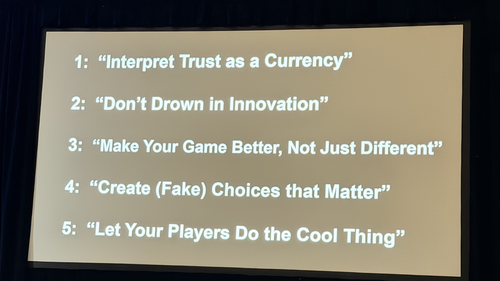

---

## セッション概要

| 項目 | 内容 |
|:---|:---|
| **タイトル** | Rules of the Game 2026: Revealing Techniques from Resourceful Designers |
| **トラック** | Design |
| **形式** | Microtalks（6名、各約10分） |
| **日時** | 2026年3月11日（水）10:30–11:30 |
| **場所** | Room 3005, West Hall |
| **対象レベル** | Intermediate |
| **パスタイプ** | Festival Pass / Game Changer Pass |

---

## 「Rules of the Game」とは何か

"Rules of the Game" は、GDCで20年以上続く人気マイクロトークセッションです。複数のゲームデザイナーが登壇し、それぞれ **「自分がゲームを作るうえで信じているルール」** を短く鋭く語ります。

このセッションの特徴は3つあります：

1. **個人の掟**: 一般論ではなく、そのデザイナー固有のルール
2. **圧縮された知恵**: 10分という制約が、余分な説明を削ぎ落とす
3. **多様性**: 異なるジャンル・キャリアの人物が集まることで、対比が生まれる

「Resourceful」というサブテーマは、限られたリソース（時間、予算、人員、技術）の中でいかに創意工夫するかという姿勢を指します。インディから大手まで、全員に共通するサバイバルスキルです。

---

## セッション詳報

### イントロ（10:33〜）

セッション冒頭、進行役（Richard Rouse III）がこのセッションの趣旨を語りました。

「弱いプレイヤーと、強すぎるプレイヤーとでは、苦しみの種類がまったく異なる」という切り口から始まり、ゲームデザイナーに向けてこう問いかけました。

> プレイヤーの手の中でルールが壊れていく瞬間を考えたことがあるか。ルールが消去される場面はどこか。そしてどこまで革新的になれば、それが裏目に出るか。

今年のテーマは**「反直感的なルール」**。教科書どおりにやることが正解ではない場面を、各スピーカーが掘り下げます。

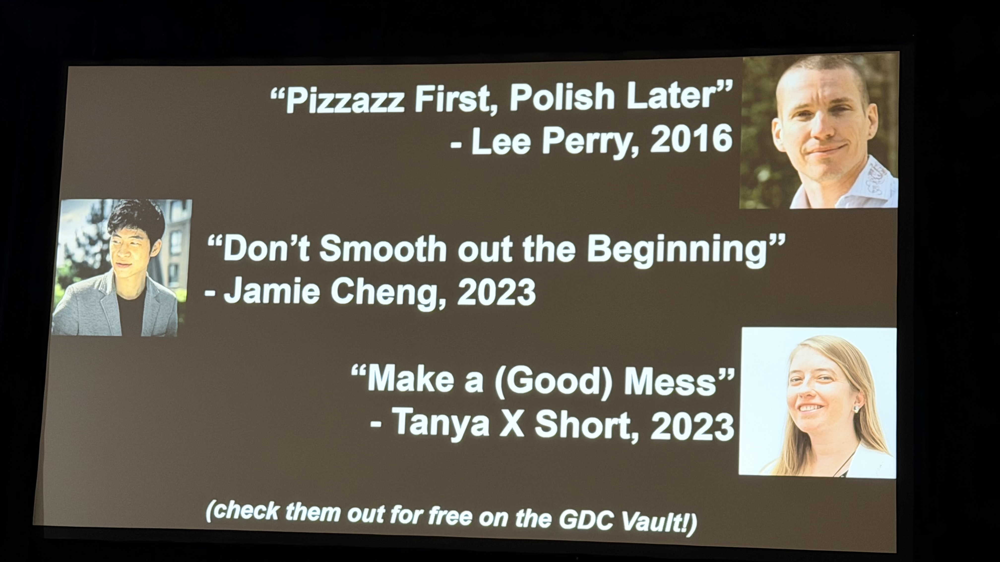

---

### 「信頼は通貨だ」— Trust as a Currency

最初のスピーカーが語ったのは、ゲームデザインにおける**「信頼（Trust）」の経済学**でした。

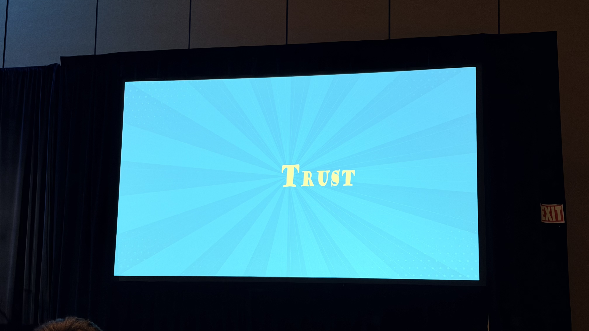

#### 信頼は稼ぎ、使い、失う

> 信頼は通貨だ。稼いで、投資して、使って、燃やすこともできる。

最も基本的な信頼の稼ぎ方は、**プレイヤーの期待に応えること**です。ジャンルの慣習に従い、アクセシビリティを整備する。これだけで信頼の残高は積み上がっていきます。

一方、チェーンの中の小さなミスひとつで信頼は崩壊します。そして「信頼破産（Trust Bankruptcy）」に陥れば、プレイヤーはゲームを去ります。

#### UIこそが信頼の最前線

「ターン制ゲームにおけるUndoボタンとPauseボタン」を具体例に挙げました。

| UIの要素 | 信頼への効果 |
|:---|:---|
| **Undoボタン** | 「やり直せる」安心感がプレイヤーを大胆にする |
| **Pauseボタン** | 自分のペースでプレイできる自律性を保証する |
| **ヘルプ・メニュー** | 慣習に沿った案内が迷子を作らない |
| **セーブ / チェックポイント** | 失敗からのリカバリーを支援し、挑戦を促す |

Undoがあるだけで、プレイヤーはより早く、より積極的にプレイするようになります。「安全網がある」と知っているから、リスクを取れる。

#### ハードコア向けだけでは不十分

「ハードコアプレイヤーはそんなもの必要ない」という声があります。しかし、**安全網のないゲームは、多くのプレイヤーを最初から切り捨てている**。

#### テイクアウェイ: 早く渡せ、遅らせるな

> 「それは後半の報酬として取っておこう」という発想は捨てろ。信頼を築くツールを遅らせることに意味はない。早い段階で渡せ。

慣習に従い、安全網を整備し、プレイヤーに信頼の残高を積ませること。そうすれば、誰も取り残されない。

#### 信頼は一貫性から積み上がる

> 信頼は期待に応え続けることで積まれる。一度ではなく、何度も何度も繰り返すことで。

システムを「見える化」することも重要です。たとえばターン制ゲームにおける**ダメージ予告サークル**（攻撃が当たる範囲を事前に表示するUI）は、「このゲームはちゃんと教えてくれる」という信頼を生みます。メカニクスの可読性そのものが信頼の素材になります。

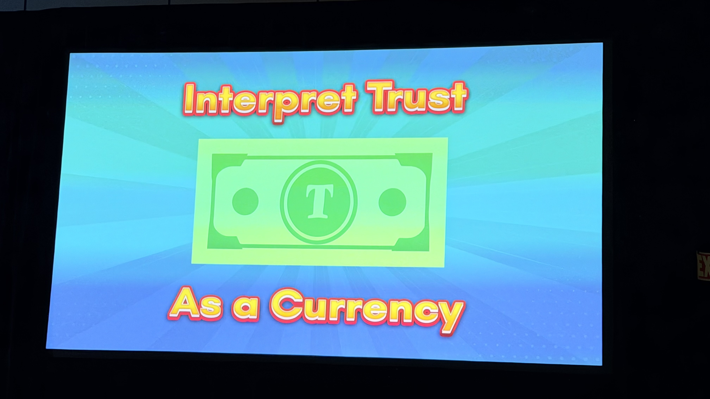

#### 積んだ信頼は「使う」もの

ここが本セッションの核心です。

> 信頼を積んだら、何に使えるか？

慣習どおりに積み上げた期待を、意図的に**裏切る**。それがパンチラインになります。

> 慣習で期待を積み上げ、それを覆すパンチラインを打て。
> 使われた信頼が、あなたのゲームで最も記憶に残る瞬間を作る。それがプレイヤーがプレイし続ける本当の理由だ。

これを彼女は **「献身のレシピ（a recipe for devotion）」** と表現しました。信頼を賢く使うことがプレイヤーの熱狂的な愛着を生む。

#### 信頼には予算がある

| フェーズ | 何をするか | 結果 |
|:---|:---|:---|
| 稼ぐ | 慣習を守る、期待に応える、UIを整備する | 信頼残高が増える |
| 使う | 期待を覆す、驚きを与える、ドラマを作る | 残高は減るが、記憶に残る瞬間が生まれる |
| 破産 | 使いすぎる、稼がずに使う | プレイヤーが去る |

> 信頼支出は投資だ。使うたびに見返りがある。しかし予算には限りがある。ドラマチックな瞬間のために取っておけ。

#### 罰則的なターンタイマーは信頼を燃やす

ターン制ゲームにおける反例として、**罰則的なターンタイマー**が挙げられました。

Undoボタンが信頼を積むのに対し、ターンタイマーは逆の効果をもたらします。プレイヤーに常時プレッシャーをかけ、「考える余裕」を奪い、不安を生みます。特にマルチプレイヤーゲームでは、チーム全体に緊張が伝播します。信頼を稼ぐ設計と、燃やす設計の典型的な対比です。

#### 外部要因も信頼残高に影響する

> あなたのゲームは孤立して存在しているわけではない。ジャンル全体の評判、業界への先入観——あなたがコントロールできない外部要因があなたの信頼予算に影響している。

F2Pゲーム、モバイルゲームなど、プレイヤーが最初から警戒心を持つジャンルでは、**信頼残高がマイナスからのスタート**になることがあります。しかし克服はできる。

> 信頼マイナスから始まるのは覚悟のうえだ。それを取り戻すために懸命に稼げ。できる。

#### 締めの言葉

> Go earn your players' trust, and then spend it to make something glorious.
> プレイヤーの信頼を稼いで、それを使って、素晴らしいものを作れ。

---

### 「イノベーション・スペクトラム」— 革新の最適地点を探す

2番目のスピーカー（Steve Meretzkyと思われる）は、40年以上のキャリアから得た問いを投げかけました。

> 私が新しいゲームの制作を始めるとき、最初に考えるのはひとつのことだ。このゲームは、私が頭の中に持っている**イノベーション・スペクトラム**のどこに位置するか。

#### スペクトラムの両端

| 位置 | 内容 | リスク | リターン |
|:---|:---|:---|:---|
| クローン側 | 既存の成功作を強く参照する | 低い | 低め |
| 中間 | 馴染みやすさを残しつつ一部を新しくする | 中程度 | 中程度 |
| 前例なし側 | 誰も見たことがない体験を狙う | 高い | 高い |

Meretzkyの問いは単純です。新作がこのスペクトラムのどこを狙うのかを、最初に明確にしておくべきだということです。

「誰も見たことがないもの」の例として、自身のキャリア（おそらく *The Hitchhiker's Guide to the Galaxy* など）を挙げました。

> 大成功を収めた。なぜなら誰も見たことがなかったから。

しかし——

> 本当のことを言えば、私たちは両極端の間のどこかを狙いたい。では、**正確にどこ**なのか？

#### 革新には利点がある

革新的であることの価値は2つ。**「話題になる」**（マーケティング力）と**「長期的な影響力を持てる」**こと。しかし、当然リスクも高い。

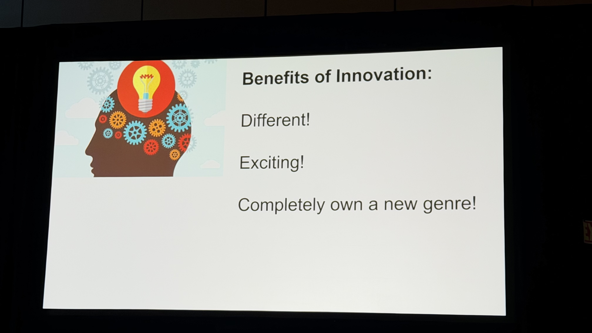

#### クローンにも合理性がある——3つのケース

では、クローン側に振り切るのが合理的な場面はあるのか。Meretzkyは具体例を3つ挙げました。

| ケース | 事例 | 結果 |
|:---|:---|:---|
| ① プラットフォーム関係を活かす | Zynga + Facebook → FarmVille、その後クローンを量産（FrontierVilleなど） | Facebookとの関係が参入障壁に |
| ② ジャンル適応 | Epic/Fortnite → バトルロイヤル（PUBG）を模倣・改良 | 大成功したが「安っぽい」と批判も |
| ③ 成熟市場への参入 | 既存の大ヒットジャンルへの後追い | 中程度の成功にとどまることが多い |

ただし、いずれのケースも「安っぽく見える」というリスクを抱えています。

#### 革新は「ゲームデザイン」だけじゃない

ここが最も重要な洞察です。

> 革新はゲームデザインだけに当てはまるわけではない。**ビジネスモデル**、**プラットフォーム**、**配信方法**——これらも革新の軸になりえる。

Meretzkyの自身の経験から：

- **2000年頃**: LANカフェ・トーナメント型ゲーム配信のスタートアップに参加。ゲームは馴染みのあるものでも、**遊び方**が革新だった
- **2016〜2018年**: Facebook Messenger Instant Gamesにゲームを提供。マルチプレイヤーを作ったが、大半がソロでプレイ。「ソーシャル性」が革新軸と思っていたが、**プラットフォーム自体**が革新だった

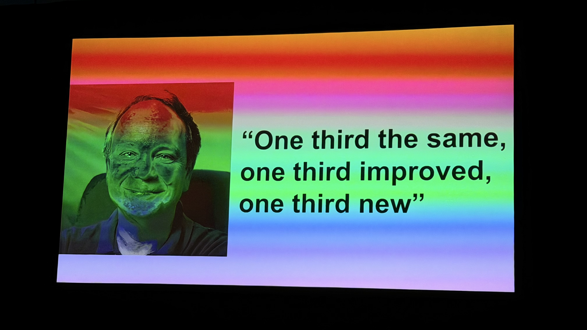

#### Meretzkyが現在試みているバランス

> 私が今試みているのはこうだ——**入りやすい**（既存に馴染みやすい）、しかし**何か新しいものを感じる**。

これがイノベーション・スペクトラムにおける彼の現在地です。40年以上の実験の末に辿り着いた仮説は、シンプルながら深い。

#### 締めの言葉（笑いありの正直な結論）

> 何十年もやってきたが、答えは出せていない。カジュアルなグローバルパズルゲームの場合、正解は23.7%だ。

もちろんこれはジョークです。「正確な数字などない」というオチで締めくくりました。結論は明快です——**イノベーションの正解量は文脈次第。自分のゲームと対象プレイヤーに合わせて考えるしかない。**

---

### 「問いを立てることが掟だ」— Joel Burgess（Soft Rains）

3番目のスピーカーはJoel Burgess（Soft Rains）。Bethesda時代に *Skyrim* と *Fallout 4* のレベルデザインを率いた後、独立したデザイナーです。

> 今日、みなさんと共有したいのはこれだけです。それは問いです。

**掟は問いを立てること**——これがBurgessのルールです。

#### 核心の問い

> ゲームを反復改善しているとき、大きな変更を加えようとしているとき、問え。**「自分はその必要性を本当に信じているか？（Do you believe the need?）」**

この問いが彼のマントラになりました。変えたいという衝動に、ブレーキをかけるための問いです。

#### キャリア初期の体験

駆け出しの頃、あるレベルに不満を感じて何度も何度も変更を加え続けました。夜遅くまで作業しながら、フラストレーションの中で同じ場所を繰り返し直し続けた。

その経験が教えてくれたのは、**自分の変更したい衝動に懐疑的になること**の重要性でした。

> なぜ自分はこれを変えたいのか。なぜ自分はこのバブルの中にいるのか。

#### 核心の問い：「より良くなるのか、それとも"ただ違う"だけか？」

衝動を感じるたびに、Burgessはこう自問するようになりました。

> **"Better, or just different?"**（より良くなるのか、それともただ変わるだけか？）

これが彼のマントラです。「変える」ことと「改善する」ことは別物です。変更を重ねるほどゲームが不安定になることもある。「止める」選択が正解なこともある。

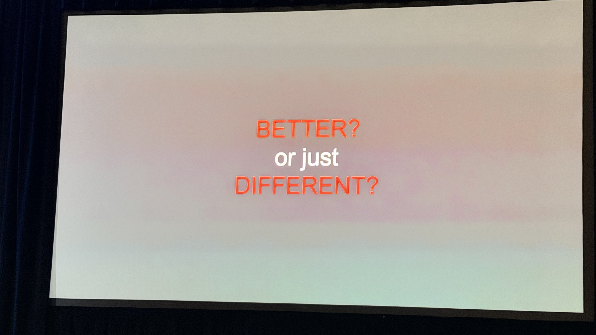

#### 新鮮な目を使え

本当に問題があるのかどうかを確かめる最善の方法は、**初めてプレイする人に見せること**です。自分では問題に見えていたものが、実は問題ではなかったと気づく——逆もある。自分のバブルの外に出ることで、問いへの答えが見えてきます。

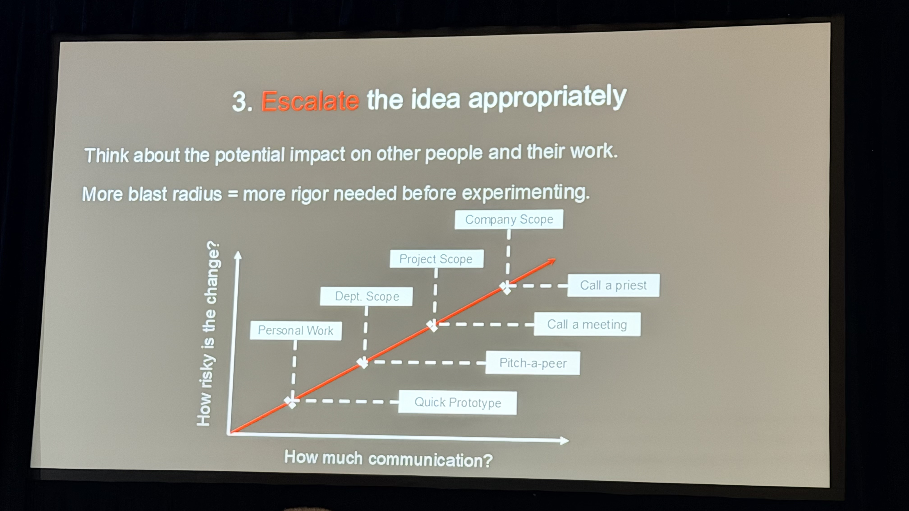

#### 問いを立てることが質を上げる

> 「Better, or just different?」を習慣にすることで、自分の作業プロセスが良くなる。チームの時間が守られる。プレイヤーにより良いものが届く。

---

### 「コンテンツなしで意味のある選択を作る」— Ashley Ruhl（Broadsword Online Games）

4番目のスピーカーはAshley Ruhl。Broadsword Online Gamesで15年、*Ultima Online* などの長寿MMOのコンテンツデザインを担ってきた実践者です。

> 今日話したいのは、**意味のある選択**についてです。ただし——コンテンツを追加しなくても、プレイヤーの体験を表面上大きく変えなくても、意味のある選択は作れる。

MMOの長期運営では、常に新コンテンツを追加できるわけではありません。限られたリソースの中で、プレイヤーに「自分が選んでいる」という感覚を与えることが、Ruhlの専門領域です。

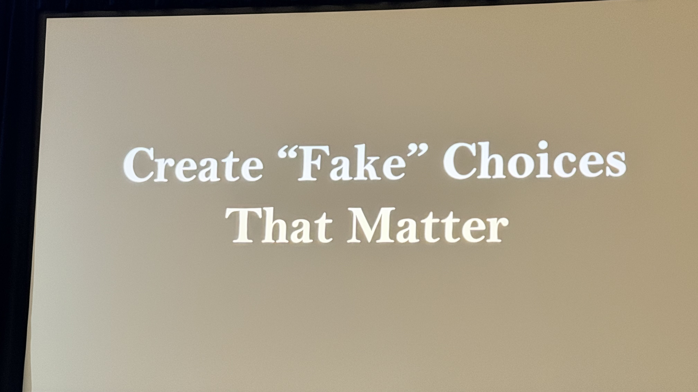

#### 「意味のある選択」の伝統的定義

ゲームデザインにおいて「意味のある選択」の一般的な定義はこうです。

> 異なる選択をしたとき、ゲームが大きく変わること。

しかしRuhlはこの定義に疑問を呈します。

#### 2種類の選択とそのコスト

| 種類 | 特徴 | コスト |
|:---|:---|:---|
| **分岐選択**（Diverging choice） | 選択によってゲームの内容が実際に分かれる | 指数的に増大（全パスのコンテンツが必要） |
| **幻の選択**（Illusion choice） | 見た目は選択肢だが、結果はほぼ同じ | 最小限 |

分岐選択はコンテンツ量が指数的に増えます。長期運営のMMOでは現実的に維持できません。

#### 幻の選択でも、感情的な深みは持てる

> 選択が意味を持つのは、**その瞬間に意味があると感じたとき**だ。ゲームが実際に変わることではない。

「幻の選択」であっても、適切に設計すれば分岐選択と同等の感情的インパクトを持てます。なぜなら、**変わるのはゲームの内容ではなく、プレイヤーの頭の中のストーリー**だからです。プレイヤーの想像力が空白を埋める。

典型的な例が「このキャラクターはこの選択を覚えている」というテキスト通知（Telltaleスタイル）です。ゲームが実際に変わらなくても、「ここは重要な場面だ」というシグナルを送るだけで、プレイヤーは選択に意味を感じます。

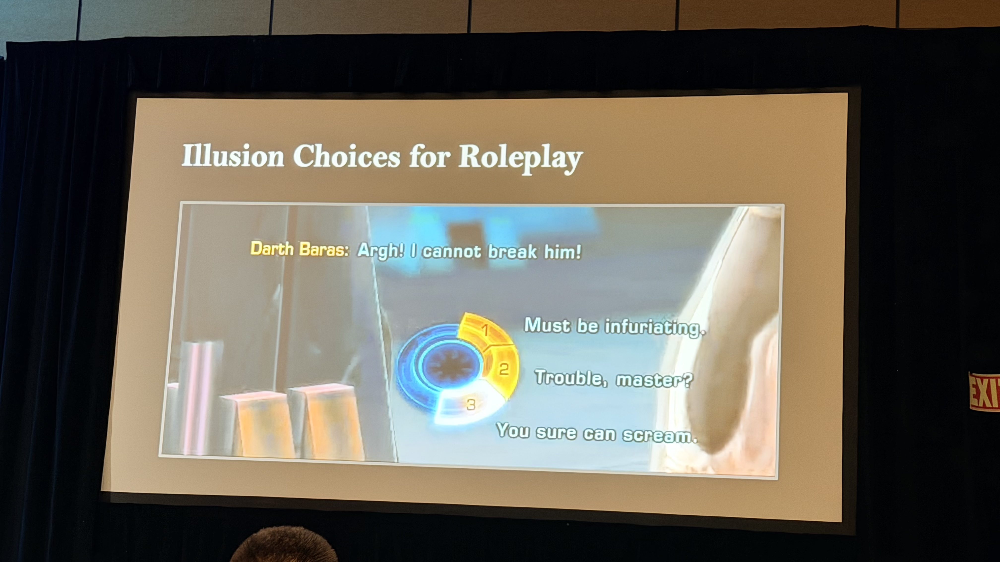

#### 幻の選択が特に機能する場面

プレイヤーが「これは幻の選択だ」と知っていても機能します。それどころか、そのことがロールプレイの**自由**を生みます。「間違いの選択はない」と知っているから、キャラクターとして自由に投資できる。

> 選択はコンテンツの分岐についてではない。**プレイヤーがストーリーをどう認識するか**に接続することについてだ。

#### 選択ライティングの視点転換

選択肢を書くとき、多くのデザイナーは「この選択は何を変えるか」を考えます。Ruhlが提案するのは別の問いです。

> **「このドラマのこの瞬間に、私のキャラクターはなぜこの選択をするのか？」**

機械的な結果ではなく、キャラクターの動機から選択を設計する。これが、コンテンツなしで意味を生み出す方法です。

> 選択は、プレイヤーが感情的に完結したと感じれば意味を持つ。

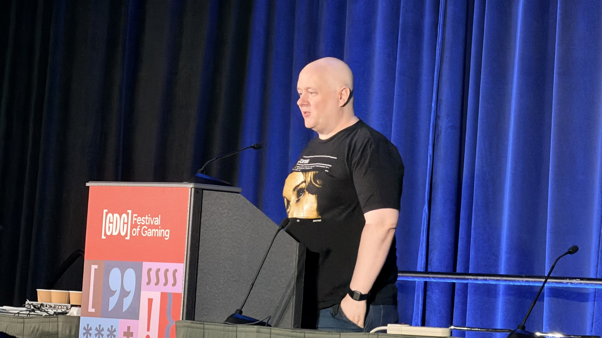

---

### 「プレイヤーの時間は戦場だ」— Xalavier Nelson Jr（Strange Scaffold）

最後のスピーカーはXalavier Nelson Jr（Strange Scaffold）。*El Paso, Elsewhere*、*Space Warlord Organ Trading Simulator* などの異色作で知られるインディデザイナーです。

> 私の掟はひとつだ。

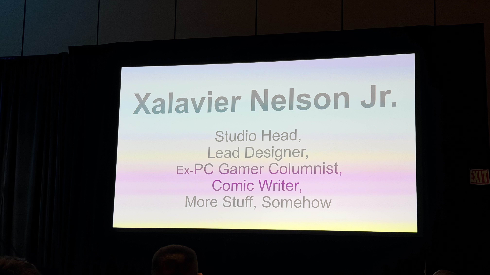

#### 私たちは「時間」と「お金」を奪い合っている

Nelsonが出発点に置くのは、ゲーム業界の現実への冷徹な認識です。

> 私たちはプレイヤーの注意だけでなく、時間と、お金を奪い合っている。

競合はゲームだけではありません。InstagramもYouTubeも、あらゆるコンテンツが同じ時間とお金を争っています。そして過去10年でこの競争は急速に激化しています。

#### 新しい情報は「敵対的」に処理される

ここが彼のトークの核心です。

> 新しい情報はニュートラルに処理されるのではない。**敵対的**なものとして処理される。

プレイヤーが新しいゲームを開いたとき、脳は「このゲームを学ぶコスト」を無意識に計算します。そのコストが高いと判断されると、拒絶反応が起きる。新しいゲームは「面白そう」な前に「めんどくさい」と感じられる。

> もしあなたのゲームの最初の体験がこの前提に基づいて設計されていなければ、プロジェクトに壊滅的な影響を与えうる。

#### Atlas Design — すべてを「語れるもの」にする

> 私はこれを **「Atlas Design」** と呼んでいる。プロジェクトのあらゆる要素について問え：「これは開発の**前・中・後**に、話題にして共有できるか？」

ゲームの機能だけでなく、使っているツール、カットした機能、なぜそう作ったかの理由——すべてがコミュニケーションの素材になります。Strange Scaffoldは実際に、開発のあらゆる場面でこのアプローチを実践しています。

#### デザインは通信である

> デザインとは通信だ。人々が気にかける理由を作ることだ。

プレイヤーはゲームの「意図」を感じ取ります。たとえ気に入らなかったとしても、「このチームは意図を持って作っている」と分かれば、それ自体が信頼になる。

#### 2万本の現実

> Steamでは昨年、2万本のゲームがリリースされた。

あなたのゲームに素晴らしい瞬間があっても、誰もそれを知らなければ存在しないも同然です。Metroidvaniaというジャンル名を誰もが知っていても、あなたのゲームのその瞬間を誰も知らない——それが現実です。

#### 締めの言葉

> **Give your players reasons to give a shit.**
> **そうすれば来てくれる、留まってくれる、もっと気にかける理由を自ら探してくれる。**

---

## スピーカー紹介と設計哲学

### Richard Rouse III（FarBridge）

**専門**: ナラティブデザイン、ステルスゲーム、ホラー

FarBridgeの共同創業者。代表作に *The Church in the Darkness*（2019年）、*The Suffering*（2004年）。Ubisoft、Midway を経て独立。著書 *Game Design: Theory and Practice* はゲームデザイン教育の定番テキストです。

Rouseの設計哲学で一貫しているのは **「プレイヤーに選択肢を与えるが、結果に責任を持たせる」** という姿勢です。*The Church in the Darkness* ではプレイヤーのプレイスタイルによってエンディングが分岐し、正解のない道徳的判断を迫ります。

> 設計者は神ではなく、庭師だ。植物が育つ空間を作るのが仕事であり、花の形を決めるのはプレイヤー自身だ。

---

### Xalavier Nelson Jr（Strange Scaffold）

**専門**: インディゲーム、実験的ナラティブ、持続可能な開発プロセス

Strange Scaffold の創業者。*El Paso, Elsewhere*、*An Airport for Aliens Currently Run by Dogs*、*Space Warlord Organ Trading Simulator* など、コンセプトの尖った作品群で知られます。

Nelsonが強調するのは **「チームの持続可能性と創作の誠実さ」**。ゲームジャムのような短期開発と長期プロジェクトを組み合わせたスタジオ運営を実践し、クランチ文化を拒否する姿勢でも注目されています。

「Resourceful」という観点では、大規模予算なしで感情的インパクトを出す手法——テキスト演出、音の使い方、スコープの選択——を磨き上げてきたデザイナーです。

---

### Ashley Ruhl（Broadsword Online Games）

**専門**: MMORPG、ライブサービス、ロングテール運営

Broadsword Online Games は、*Ultima Online* と *Dark Age of Camelot* を現在も運営する老舗スタジオです。両タイトルは20年以上稼働を続けており、Ruhlはその現役コンテンツデザイナーです。

「Resourceful」なMMO運営の現実は過酷です。小規模チームで数十万行のレガシーコードと戦いながら、アクティブなプレイヤーコミュニティを満足させ続けなければなりません。

Ruhlの掟は、こうした **「終わりなきメンテナンス」** の中で学んだ優先順位付けと、コミュニティとの信頼構築の手法にあると考えられます。

---

### Theresa Duringer（Temple Gates）

**専門**: ボードゲームのデジタル化、モバイルゲームデザイン

Temple Gates Gamesの共同創業者。*Pandemic* のデジタル版、EA/Zoinkと協業した *Lost in Random* のカードシステムデザインに携わりました。

Duringerの専門は **「アナログゲームの本質を損なわずにデジタルに変換する」** こと。ボードゲームはルールが透明で、プレイヤーはシステム全体を把握できます。対してデジタルゲームは裏側を隠せる。この違いをどう活かすか——それが彼女の設計軸です。

> ボードゲームのプレイヤーはルールブックを読む。デジタルゲームのプレイヤーは読まない。この前提で設計を逆算しなければならない。

---

### Joel Burgess（Soft Rains）

**専門**: レベルデザイン、オープンワールド、システムデザイン

Bethesda Game Studios で *The Elder Scrolls V: Skyrim* と *Fallout 4* のレベルデザインリードを務めた後、独立してSoft Rainsを設立。

Burgessがキャリアを通じて探求してきたのは **「プレイヤーが世界を発見する瞬間の設計」** です。Skyrimの山の稜線から見える遺跡、Falloutの廃墟に残された物語——それらは偶然の産物ではなく、精緻な意図の産物です。

インディ移行後のSoft Rainsでは、大スタジオとは異なる制約の中で同様の体験をどう生み出すかという問いに向き合っています。「Resourceful」という言葉が最も似合うスピーカーのひとりです。

---

### Steve Meretzky（PeopleFun）

**専門**: インタラクティブフィクション、ワードゲーム、ゲームデザイン史

Infocom時代（1980年代）に *The Hitchhiker's Guide to the Galaxy*（ダグラス・アダムスとの共作）、*Planetfall* などのテキストアドベンチャーを手がけた伝説的ゲームデザイナー。現在はPeopleFun（ワードゲームスタジオ）に在籍。

Meretzkyが体現するのは **「時代を超える設計原則」** です。UIもグラフィックもなく、テキストだけで何百万人を熱中させたInformコムの手法は、現代のゲームデザインにも通じる本質を持っています。

40年以上のキャリアを持つ彼が語る「掟」は、最新技術に依存しない普遍的な知恵であることが期待されます。

---

## 「Resourceful」とは何か——6名に共通するもの

6名のバックグラウンドは大きく異なりますが、**「Resourceful（機転が利く）」** という共通テーマで結ばれています。

| 条件 | 具体例 |
|:---|:---|
| 制約を言い訳にしない | 予算がないならスコープを絞る。人員が少ないなら優先順位を徹底する。技術が古いなら得意な設計で補う。 |
| 失敗から抽出する | うまくいかなかった体験を掟に変換する。プレイテストの失敗から設計原則を見つける。 |
| 本質を見抜く | 流行ではなくプレイヤーの本質的欲求を見る。最新技術ではなく体験の核心を押さえる。 |

Infocomのテキストゲームから現代のMMO運営まで、時代とジャンルを越えて生き残っているデザイナーたちに共通するのは「手段を選ばない創意工夫」ではなく、**「目的に対する一貫したこだわり」** です。

---

## Microtalks形式の設計的価値

このセッションがMicrotalks形式を採用していること自体、設計上の意図があります。

| 通常の講演（60分） | Microtalks（10分 × 6名） |
|:---|:---|
| 1つのテーマを深掘り | 6つの視点を横断 |
| 文脈の積み上げが可能 | 圧縮された核心のみ |
| 1名のキャリアに集中 | 多様なバックグラウンドを比較 |
| 体系的な学習 | 直感的な洞察の刺激 |

Microtalksは、設計的にも「認知負荷の分散」をうまく使っています。10分ごとに話者と視点が変わることで、聴衆の注意力がリセットされ、集中力が維持されます。6人分の知恵を1時間で吸収できる、密度の高い形式です。

---

## まとめ

"Rules of the Game" セッションが毎年GDCで愛される理由は明快です。**「自分の掟」を持つデザイナーの言葉には、再現性があるからです。**

方法論ではなく姿勢。ツールではなく判断基準。それを6名のベテランが凝縮して語る1時間は、キャリアを問わずすべてのゲームデザイナーにとって刺激になります。

今年の6名の掟をまとめます。

| スピーカー | 掟 | 核心メッセージ |
|:---|:---|:---|
| **Richard Rouse III** | 反直感的ルールを問い続けよ | どこまで革新的になれば裏目に出るか。ルールが壊れる瞬間を設計者は知れ |
| **スピーカー1（Theresa Duringer）** | 信頼は通貨 | 慣習・Undo・可読性で積み上げ、期待を覆すパンチラインで使え。破産を避けよ |
| **Steve Meretzky** | イノベーション・スペクトラムを持て | クローンと前例なしの間のどこを狙うか。革新はデザインだけでなく、ビジネスモデル・プラットフォームでも起きる |
| **Joel Burgess** | Better, or just different? | 変えたい衝動に懐疑的になれ。それは「より良く」なるのか、ただ「違う」だけか |
| **Ashley Ruhl** | 幻の選択でも意味を持てる | 選択は分岐しなくていい。プレイヤーの感情と認識の中で意味が生まれれば十分 |
| **Xalavier Nelson Jr** | プレイヤーに気にかける理由を与えよ | 新情報は敵対的に処理される。Atlas Designで開発の全瞬間を語れるものにせよ |

**「掟」は制約ではなく、自由の源泉です。** ルールを自ら決めているデザイナーだけが、迷わず次の一手を打てる。

---

## 次のステップ

Rules of the Game シリーズの過去の回はGDC Vaultで視聴可能です（一部無料公開）。各スピーカーの掟を自分のプロジェクトに当てはめてみることが、最も実践的な活用方法です。

:::message
**Unity開発者の方へ**

ゲームデザインの「掟」をプロトタイプで素早く検証したい場合、**UniMCP4CC**（Unity MCP Server for Claude Code）が役立ちます。AIがUnity Editorを直接操作してシーンを組み立てるため、アイデアを形にするまでの時間を大幅に短縮できます。

- GitHub: [dsgarage/UniMCP4CC](https://github.com/dsgarage/UniMCP4CC)
- 対応Unity: 2021.3 LTS以降
- ライセンス: MIT
:::

---

## 参考リンク

- [GDC 2026 公式スケジュール](https://schedule.gdconf.com/)
- [GDC Vault — Rules of the Game 過去セッション](https://gdcvault.com/)
- [Richard Rouse III — Game Design: Theory and Practice](https://www.routledge.com/)
- [Xalavier Nelson Jr — Strange Scaffold](https://strange-scaffold.itch.io/)
- [Joel Burgess — Soft Rains](https://www.softrains.com/)
- [Steve Meretzky — Infocom Archives](https://if-archive.org/)
