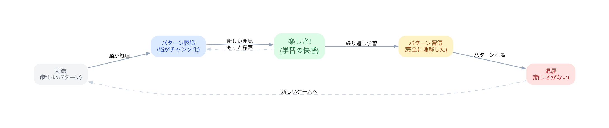
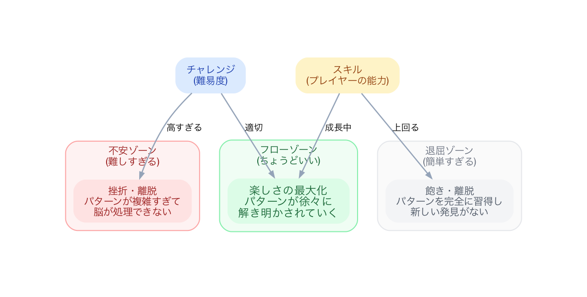
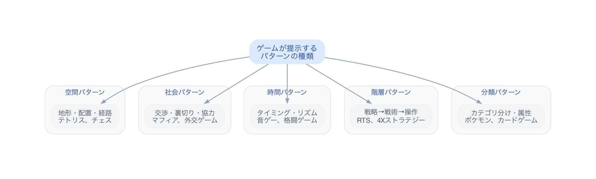
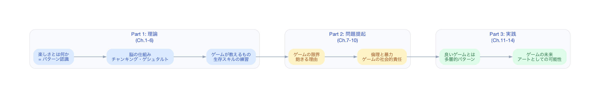

# 『A Theory of Fun for Game Design』— 楽しさの正体をパターン認識で解く

## サマリー

> この本を一言で言うと: 「楽しさ」の正体はパターン認識であり、脳が新しいパターンを学習している最中にだけ「fun」が発生する——という仮説を、認知科学と進化心理学を使って論証する一冊。

| 項目 | 内容 |
|:---|:---|
| 著者 | Raph Koster（『Ultima Online』リードデザイナー、Sony Online Entertainment クリエイティブディレクター） |
| 対象 | ゲームデザイナー、ゲーム開発者、「なぜ人はゲームを遊ぶのか」を構造的に理解したい人 |
| 読後に得られるもの | 「楽しさ」と「飽き」のメカニズムを言語化し、自分のゲームの面白さを設計・診断する視点 |
| 読了目安 | 5〜8時間（約250ページ、見開きの片面がイラスト） |

本書は「ゲームはなぜ面白いのか」という根源的な問いに、脳科学の側から答えを出そうとする本だ。Raph Kosterはオンラインゲーム黎明期の最前線で設計を手がけた実務者であり、同時にゲームの社会的意義を真剣に問い続けてきた理論家でもある。見開きの右ページに漫画風イラスト、左ページにテキストという独特の構成で、薄い本ながら射程は驚くほど広い。

---

## この本が面白い5つの理由

1. **「楽しさ＝学習」という定義** — ゲームの面白さを「パターンを認識し、習得する脳の快感」と定義する。快楽の正体が神経科学的に説明される
2. **「飽き」のメカニズム** — パターンを完全に習得した瞬間、脳はもうそのゲームから学ぶものがないと判断する。飽きとは学習の完了通知である
3. **チャンキングという認知モデル** — 人間がパターンを「塊（チャンク）」として圧縮・記憶するプロセスが、ゲームの難易度設計と直結することを示す
4. **ゲームは「教育の最古の形態」だという主張** — 遊びは進化的に獲得された学習装置であり、ゲームデザインは本質的に教育設計だと論じる
5. **ゲームの倫理的責任への問い** — 「ゲームは芸術か」「ゲームは社会に何をもたらすか」という問いに、デザイナーとして正面から答えようとする

---

## 深掘り

### 1. 「楽しさ＝学習」という定義

Kosterの主張の核心はシンプルだ——**fun is the feedback the brain gives us when we are absorbing patterns**（楽しさとは、脳がパターンを吸収しているときに送るフィードバックだ）。

これはゲームに限った話ではない。パズルを解くとき、楽器の新しいフレーズを弾けるようになるとき、スポーツで新しい技を習得するとき、私たちが感じる快感はすべて同じ神経回路から来ている。脳はパターンを見つけ、それを処理し、次の行動に活かすことに報酬を出す。進化的に、これは生存に直結する能力だったからだ。

Kosterはこの仮説を「ゲームは脳にとっての噛みごたえのある問題である」と表現する。噛みごたえがある——つまり、簡単すぎず、難しすぎず、脳が「もう少しで分かりそうだ」と感じる領域にあるとき、楽しさが最大化する。これはCsikszentmihalyiのフロー理論と完全に一致するが、Kosterはそれを「パターン認識」というより具体的なメカニズムで説明する。

**これが使える場面:** レベルデザインの設計時。「プレイヤーが今、何のパターンを学習しているのか」を明確にすると、チュートリアルから高難度コンテンツまでの導線が論理的に設計できるようになる。

---

### 2. 「飽き」のメカニズム——学習の完了通知

Kosterが提示する「飽き」の説明は冷徹だ。パターンが完全にgrokされた（=腹の底から理解された）瞬間、脳はそのゲームに報酬を出すのをやめる。学ぶべきものがもう残っていないからだ。

> ゲームがつまらなくなるのは、ゲームが悪くなったからではない。プレイヤーが賢くなったからだ。

この視点から見ると、「飽きられない」ゲームを作る方法は論理的に導かれる。プレイヤーに常に新しいパターンを提示し続けるか、パターンの複雑さを底なしにするか、あるいはパターンの組み合わせが天文学的になる仕組み（対人戦、創造系）を用意するかだ。『チェス』が何千年も遊ばれているのは、ルールが美しいからではない。盤面のパターン空間が事実上無限だからだ。

逆に、パターンが見え切った瞬間に終わるゲーム——いわゆる「一発ネタ」のゲーム——が短命なのも、この理論で説明がつく。ゲームの寿命は「パターンの深さ」で決まる。

**これが使える場面:** 運営型ゲームのコンテンツ計画。「新しいステージを追加する」のではなく「新しいパターンを追加する」という問いに変えると、本当に必要なアップデートが何かが見えてくる。

---

### 3. チャンキング——脳がパターンを圧縮する仕組み

Kosterは認知心理学の「チャンキング（chunking）」という概念をゲームデザインに接続する。チャンキングとは、複数の情報をひとつの「塊」として記憶する脳の仕組みだ。

初心者のチェスプレイヤーは、盤上の駒を一つずつ認識する。しかし熟練者は「キングサイドのフィアンケット」「クイーンズギャンビット」といったパターンの塊で盤面を認識する。同じ盤面を見ていても、脳が処理している情報量がまるで違う。これがチャンキングだ。

ゲームにおけるスキル上達とは、チャンキングの進行にほかならない。格闘ゲームの初心者はボタン入力を一つずつ意識するが、上級者は「波動拳」を一つのチャンクとして処理し、その上位に「波動拳をフェイントに使った牽制パターン」というさらに大きなチャンクを積み上げる。

Kosterの洞察はここからさらに進む。ゲームの難易度曲線が正しく設計されていれば、プレイヤーは小さなチャンクから大きなチャンクへと自然に移行し、常に「もう少しで分かりそうだ」という快感の中にいられる。これが「フロー状態」の正体であり、Kosterはそれをチャンキングの連鎖として図式化してみせる。

**これが使える場面:** チュートリアル設計。「操作を教える」のではなく「最初のチャンクを作らせる」と考えると、何を最初に体験させるべきかが明確になる。

---

### 4. ゲームは「教育の最古の形態」である

Kosterの議論は、ゲームを「娯楽」の枠から引き出す。動物の子供がじゃれ合うのは遊びだが、同時に狩りの訓練でもある。人間の子供が鬼ごっこをするのは、空間認知と社会的駆け引きの学習だ。進化は「学習を楽しいと感じる脳」を選択的に残してきた。ゲームとは、その学習本能を構造化したものにほかならない。

この視点に立つと、ゲームのジャンル分類も変わってくる。FPSは空間認識と反射のパターン、RTSは資源配分と意思決定のパターン、RPGは成長曲線と物語のパターン、パズルは論理推論のパターン——ジャンルとは「どの種類のパターン認識を訓練するか」の違いだとKosterは言う。

この主張がラディカルなのは、「エデュテインメント」という概念を逆転させるからだ。通常、エデュテインメントは「教育にゲーム要素を足したもの」と理解される。しかしKosterに従えば、すべてのゲームはそもそも教育装置であり、「教育的でないゲーム」など存在しない。問題は「何を教えているか」が意識されていないだけだ。

**これが使える場面:** 企画書の「面白さの根拠」を書くとき。「このゲームは何のパターン認識を訓練するのか」と問い直すと、メカニクスの核心が言語化できる。

---

### 5. ゲームの倫理的責任——「芸術」への道

本書の後半は、予想外の方向に展開する。Kosterは「ゲームは芸術になれるか」という問いに踏み込む。そして彼の答えは条件付きの「まだなっていないが、なるべきだ」だ。

Kosterの論理はこうだ。文学は言語のパターンを使って人間の条件を照射する。音楽は聴覚パターンで感情を揺さぶる。映画は視覚と聴覚と物語のパターンを組み合わせる。ゲームは**行動と意思決定のパターン**を使う。これは他のどのメディアにもない固有の表現領域だ。

しかし、当時のゲーム産業は（そして今もある程度は）この可能性を十分に活かしていないとKosterは嘆く。暴力のパターン、支配のパターン、蓄積のパターンばかりが繰り返され、人間の条件をより深く問うようなゲームが少なすぎる。「ゲームは人間について何を語っているか?」——この問いに答えられないなら、ゲームはまだ芸術の域に達していない。

この章は2004年の初版から存在するが、2013年の第2版でさらに加筆された。インディーゲームの台頭、『Journey』や『Papers, Please』のようなタイトルの出現を受けて、Kosterは慎重な楽観を示している。

**これが使える場面:** ゲームの社会的価値を問われたとき。「ゲームは人間の意思決定パターンを扱う唯一のメディアだ」という定義は、ゲームの存在意義を説明する強力なフレームワークになる。

---

## 読む前の自分に伝えたいこと

この本は薄い。250ページ、しかも半分がイラストだ。1日で読める。だからこそ油断する。以下のアドバイスを過去の自分に送りたい。

**イラストを飛ばすな。** 右ページの漫画風イラストは「挿絵」ではない。テキストとは独立した別の論証だ。テキストが論理で語ることを、イラストが直感で見せている。両方読んで初めて一つの議論が完成する。

**第2版を読め。** 初版（2004年）と第2版（2013年）では、後半の議論がかなり違う。初版はゲームの現状への不満が強いが、第2版ではインディーゲームの台頭を受けた前向きな加筆がある。可能なら第2版を選ぶこと。

**「パターン認識」を自分のゲームに当てはめてみろ。** 読み終わったら、今自分が遊んでいるゲーム（あるいは作っているゲーム）について「このゲームのパターンは何か」「そのパターンの深さはどれくらいか」と問いかけてみる。本書の理論が実感に変わる瞬間がある。

**Schellの『The Art of Game Design』と一緒に読め。** Schellが「体験をデザインする方法」を112のレンズで語るのに対し、Kosterは「なぜその体験が楽しいのか」を脳の仕組みで説明する。片方だけでは不完全だ。「何を作るか」と「なぜ面白いか」の両輪が揃って初めて、ゲームデザインの全体像が見える。

---

## 合わせて読みたい

- 『The Art of Game Design』（Jesse Schell） — 「体験をどうデザインするか」を112のレンズで体系化した実践書。Kosterの「なぜ楽しいか」に対して「どう楽しくするか」を補完する
- 『Flow: The Psychology of Optimal Experience』（Mihaly Csikszentmihalyi） — Kosterが依拠する「フロー理論」の原典。挑戦とスキルのバランスが没入を生むメカニズムを、ゲーム以外の領域も含めて理解できる
- 『Rules of Play』（Katie Salen & Eric Zimmerman） — ゲームの形式的・文化的・体験的側面を学術的に分析する大著。Kosterの直感的な理論を、より厳密なフレームワークで検証したいときに
