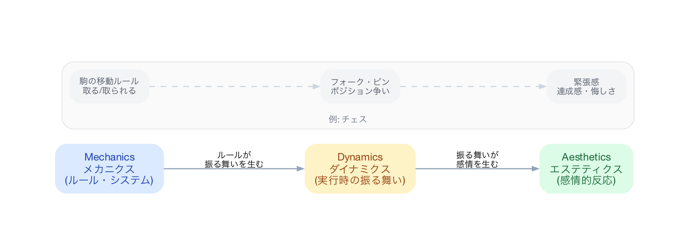
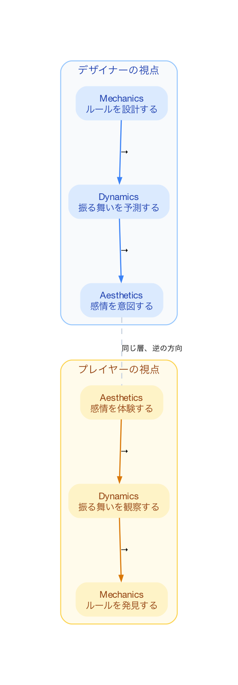
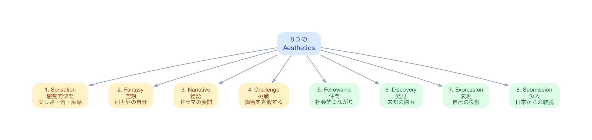
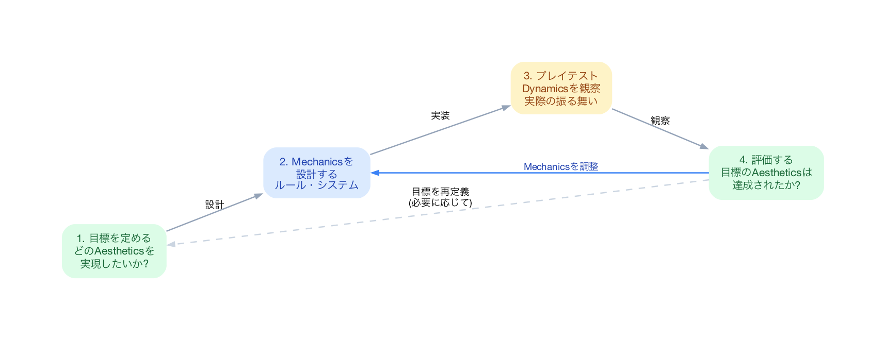

# MDAフレームワークでゲーム体験を設計する技術

「このゲーム、なんか面白くないんだよね」――プレイテストでこのフィードバックをもらったとき、あなたはどこを直すだろうか。敵のHPを下げる？ レベルデザインを変える？ エフェクトを派手にする？ 問題は、**何を直せば「面白さ」が改善するのか、判断する枠組みがない**ことだ。

2004年、Hunicke、LeBlanc、Zubekの3人が発表したMDA（Mechanics, Dynamics, Aesthetics）フレームワークは、この問いに対する構造的な回答を提示した。「面白さ」を3つの層に分解し、デザイナーの操作とプレイヤーの体験をつなぐレンズを与えるものだ。

読み終えた後、あなたはゲーム体験を「メカニクス→ダイナミクス→エステティクス」の三層で分析し、**どの層に問題があるかを特定して改善する**技術を手にしている。

---

## 背景: なぜこれが問題なのか

ゲームデザインの議論はしばしば曖昧になる。「手触りが良い」「テンポが悪い」「世界観に没入できる」――これらの言葉は感覚としては正しいが、エンジニアリングの言語に翻訳できない。結果として、デザイナーとプログラマの間に認識のズレが生まれる。

さらに深刻なのは、**メカニクス（ルール）をいじればプレイヤー体験が直接変わるという思い込み**だ。ジャンプの高さを20%上げたら、プレイヤーは20%楽しくなるだろうか。当然、そんな単純な話ではない。ルールの変更は「ランタイムでの振る舞い」を経由して初めて体験に到達する。この中間層の存在を無視したデザインは、意図しない結果を生み続ける。

> MDAフレームワークは、ゲームを消費可能なアーティファクトとして形式化する試みである。ルール（Mechanics）、システム（Dynamics）、「楽しさ」（Aesthetics）の区別を明確にすることで、デザインと開発の反復プロセスに対する分析的アプローチを可能にする。
> ――Hunicke, LeBlanc, & Zubek (2004)

---

## 理論: MDAの三層構造を理解する

### 核心概念1: 三つの層

MDAフレームワークは、ゲームを3つの層に分解する。

| 層 | 定義 | 具体例（チェス） |
|:---|:---|:---|
| **Mechanics（メカニクス）** | ゲームのルール、データ、アルゴリズム | 駒の動き方、盤面のサイズ、勝利条件 |
| **Dynamics（ダイナミクス）** | メカニクスがプレイヤーの入力と作用して生まれるランタイム行動 | フォーク、ピン、犠牲による罠 |
| **Aesthetics（エステティクス）** | プレイヤーが体験する感情的反応 | 知的緊張、戦略的満足感、相手を出し抜く快感 |

重要なのは、この3層が**因果関係で結ばれている**ことだ。メカニクスがダイナミクスを生み、ダイナミクスがエステティクスを生む。チェスの「ナイトはL字に動く」というルール（メカニクス）が、「フォーク」という戦術（ダイナミクス）を可能にし、「相手を出し抜く快感」（エステティクス）につながる。

### 核心概念2: デザイナー視点 vs プレイヤー視点

MDAフレームワークの最も鋭い洞察は、**デザイナーとプレイヤーが反対方向からゲームを見ている**という指摘だ。

- **デザイナーの視点: M → D → A**
  「私はルールを設計する。それがプレイ中の行動パターンを生み、最終的にプレイヤーの感情体験を形作る」

- **プレイヤーの視点: A → D → M**
  「私はまず何かを感じる。次にゲーム内の振る舞いに気づく。そしてルールを理解する」

この非対称性が、多くのデザイン上の問題を説明する。デザイナーは自分がメカニクスの「中」にいるため、そこからエステティクスが見えにくい。一方、プレイヤーはエステティクスしか直接体験できず、メカニクスは推測でしかない。**プレイテストが機能するのは、この視点の逆転を強制するからだ**。

### 核心概念3: 8つのエステティクス

Hunickeらは、ゲームが生み出す感情体験を8つのカテゴリに分類した。

| # | エステティクス | 説明 | 代表的ゲーム |
|:---|:---|:---|:---|
| 1 | **Sensation（感覚的快楽）** | 視覚・聴覚・触覚の刺激による快楽 | Rez Infinite, Tetris Effect |
| 2 | **Fantasy（空想）** | 現実では不可能な役割や世界への没入 | Skyrim, Animal Crossing |
| 3 | **Narrative（物語）** | ドラマ、展開、結末への期待 | The Last of Us, Disco Elysium |
| 4 | **Challenge（挑戦）** | 障害を克服する達成感 | Dark Souls, Celeste |
| 5 | **Fellowship（社交）** | 協力・共有・コミュニティ | Among Us, Monster Hunter |
| 6 | **Discovery（発見）** | 未知の領域やシステムの発見 | Outer Wilds, Breath of the Wild |
| 7 | **Expression（表現）** | 自己表現、創造性の発揮 | Minecraft, Dreams |
| 8 | **Submission（従順）** | 思考を停止して没頭する心地よさ | Stardew Valley, Cookie Clicker |

ここで重要なのは、どのエステティクスが「正しい」かという議論ではない。**自分のゲームがどのエステティクスを目指しているか**を明確にすることだ。すべてを同時に達成しようとするゲームは、たいてい何も達成できない。

---

## 分析: 実際のケースで見る

### ケース1: Monopoly ―― Challenge + Fellowship の衝突

Monopolyは興味深い事例だ。メカニクス（ダイス、資産購入、家賃徴収）はChallenge（戦略的判断）とFellowship（家族や友人との交流）の両方を狙っている。しかしダイナミクスとして実際に起きるのは、「序盤で優位に立ったプレイヤーが雪だるま式に勝つ」というポジティブフィードバックループだ。このダイナミクスは、敗者にとってChallengeもFellowshipも破壊する。**メカニクスの意図とダイナミクスの現実が乖離した典型例**である。

### ケース2: Journey ―― Discovery + Narrative + Sensation の統合

thatgamecompanyのJourneyは、MDAフレームワークの理想的な実装だ。メカニクスは極めてシンプル（移動、ジャンプ、発声）。しかし、匿名のプレイヤーとの協力メカニクスが、「言葉なしで心が通じた」というダイナミクスを生む。結果として、Discovery（未知の世界を進む）、Narrative（旅という物語構造）、Sensation（音楽と映像美）が一体となったエステティクスが生まれる。**少ないメカニクスで豊かなエステティクスを生んだ**成功例だ。

### ケース3: Dark Souls ―― Challenge + Discovery の設計

Dark Soulsが「難しいだけのゲーム」でないのは、ChallengeとDiscoveryが巧みに結合しているからだ。高い難易度（メカニクス）が「死んで学ぶ」サイクル（ダイナミクス）を生み、敵の攻撃パターンやレベルの捷径を「発見」するエステティクスにつながる。もし難易度だけを上げてDiscoveryの要素がなければ、単なるストレスになる。**二つのエステティクスが相互に強化し合う設計**がDark Soulsの核心だ。

---

## 実践: あなたのプロジェクトに適用する

### ステップ1: エステティクスから逆設計する

まず、ゲームが目指すエステティクスを**2つまで**絞る。8つのリストから選び、優先順位をつける。

| ゲームのジャンル | 主エステティクス | 副エステティクス |
|:---|:---|:---|
| ローグライク | Challenge | Discovery |
| オープンワールドRPG | Discovery | Fantasy |
| パーティーゲーム | Fellowship | Submission |
| リズムゲーム | Sensation | Challenge |
| サンドボックス | Expression | Discovery |

**原則: メカニクスから始めるのではなく、「プレイヤーに何を感じてほしいか」から始める。**

### ステップ2: ダイナミクスを予測・観察する

メカニクスを設計したら、それが生むダイナミクスを予測する。そしてプレイテストで実際のダイナミクスを観察する。

チューニングの手順は以下の通りだ。

1. **目標エステティクスを定義する**（例: Challenge + Discovery）
2. **メカニクスを設計する**（例: 敵の行動パターンのバリエーション）
3. **プレイテストでダイナミクスを観察する**（プレイヤーは実際に何をしているか？）
4. **エステティクスを検証する**（プレイヤーは目標の感情を体験しているか？）
5. **ギャップがあればメカニクスを調整する**

重要なのは、**ステップ4でエステティクスを直接検証する**ことだ。「バグがないか」「バランスは取れているか」ではなく、「プレイヤーは何を感じたか」を聞く。

### ステップ3: MDA分析シートを作る

プロジェクト内で以下のシートを共有し、デザイン判断のたびに参照する。

| 項目 | 内容 |
|:---|:---|
| **目標エステティクス** | Challenge + Discovery |
| **主要メカニクス** | スタミナ管理、敵のAIパターン、マップ構造 |
| **予測ダイナミクス** | 慎重な探索、死から学ぶ反復、捷径の発見 |
| **実測ダイナミクス**（テスト後） | （プレイテストで記入） |
| **エステティクスの達成度** | （プレイヤーフィードバックで記入） |
| **次の調整** | （ギャップに基づいて記入） |

---

## よくある落とし穴

### 1. メカニクスだけを見て調整する

最も多い失敗パターンだ。「ボスが強すぎる」というフィードバックに対してHPを下げる前に、**プレイヤーが本当に求めているエステティクスは何か**を考える。Challengeを求めているなら、HPを下げるのではなく攻撃パターンの予見性を上げる（Discoveryを加える）方が正しいかもしれない。

### 2. エステティクスを言語化しない

「面白いゲームを作る」は目標ではない。チームメンバーがそれぞれ異なるエステティクスを想像していると、メカニクスの方向性がバラバラになる。**8つのエステティクスの語彙を共有する**だけで、デザインの議論の精度は劇的に上がる。

### 3. ダイナミクス層の存在を忘れる

メカニクスを直接エステティクスに結びつけようとする設計は、ダイナミクスという「翻訳層」を無視している。同じメカニクスでも、プレイヤーの行動によって異なるダイナミクスが生まれ、異なるエステティクスに到達する。**ダイナミクスの多様性を許容しつつ、目標エステティクスへ収束させるのがデザイナーの技術だ**。

### 4. プレイテストでメカニクスを聞いてしまう

「この武器は強すぎると思いますか？」はメカニクス層の質問だ。プレイヤーはメカニクスの専門家ではない。代わりに「ボス戦で何を感じましたか？」とエステティクス層で聞くべきだ。プレイヤーが「理不尽だった」と言ったとき、それはChallenge設計の失敗であり、何を調整すべきかはデザイナーがMDAの枠組みで判断する。

---

## まとめ

MDAフレームワークの本質は、「面白さ」を分解可能にしたことにある。メカニクス→ダイナミクス→エステティクスという因果の連鎖を認識し、デザイナーとプレイヤーが逆方向からゲームを見ているという事実を受け入れること。それだけで、**「なんか面白くない」を「エステティクスのギャップがダイナミクス層に起因する」と言い換えることができる**。言い換えられれば、直せる。

### この記事のエッセンス

| 観点 | 要点 |
|:---|:---|
| 理論 | ゲームはMechanics→Dynamics→Aestheticsの三層構造であり、デザイナーとプレイヤーは逆方向からこの構造を見ている |
| 実践 | エステティクスを2つに絞って逆設計し、プレイテストではエステティクス層で検証する |
| 注意点 | メカニクスの調整だけでは体験は変わらない。ダイナミクスという中間層の存在を常に意識する |

## 参考文献

- Hunicke, R., LeBlanc, M., & Zubek, R. (2004). MDA: A Formal Approach to Game Design and Game Research. *Proceedings of the AAAI Workshop on Challenges in Game AI*.
- LeBlanc, M. (2004). Mechanics, Dynamics, Aesthetics: A Formal Approach to Game Design. Lecture at Northwestern University.
- Schell, J. (2019). *The Art of Game Design: A Book of Lenses* (3rd ed.). CRC Press.
- Fullerton, T. (2018). *Game Design Workshop: A Playcentric Approach to Creating Innovative Games* (4th ed.). CRC Press.
