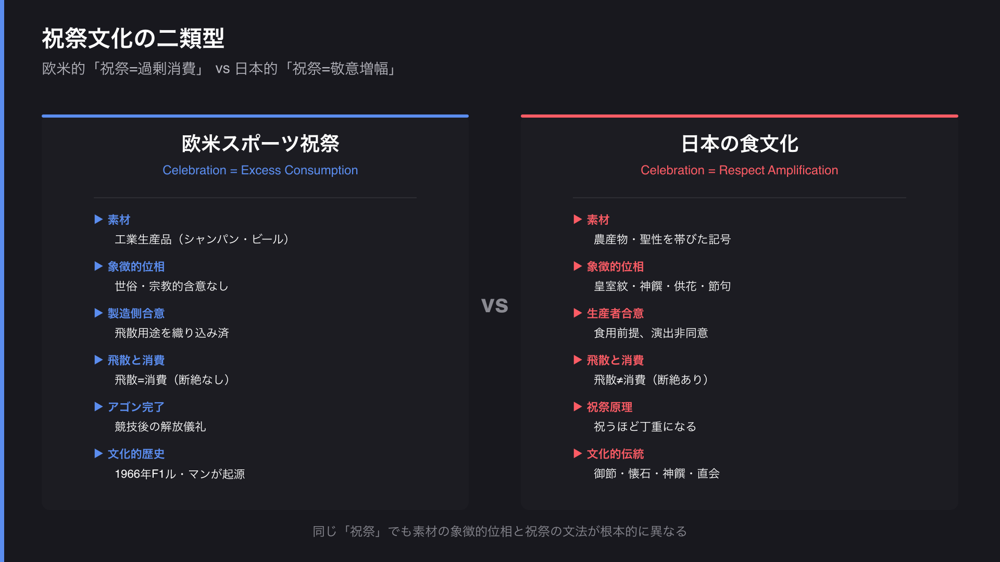
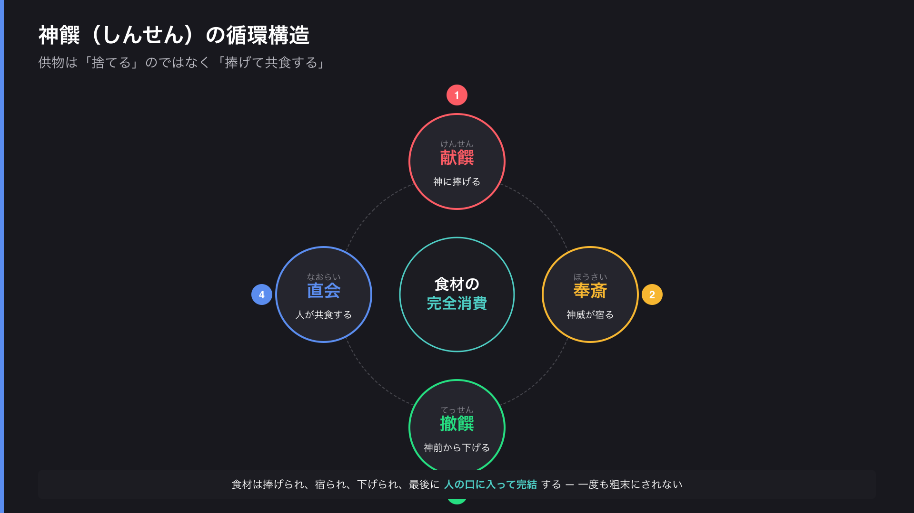
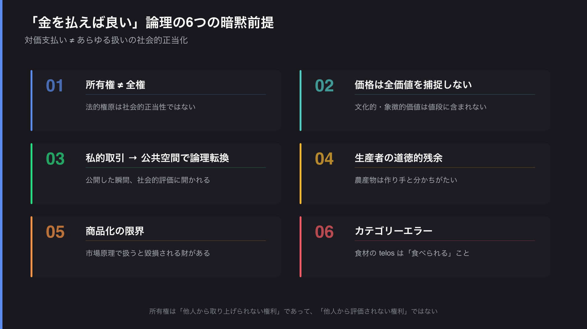
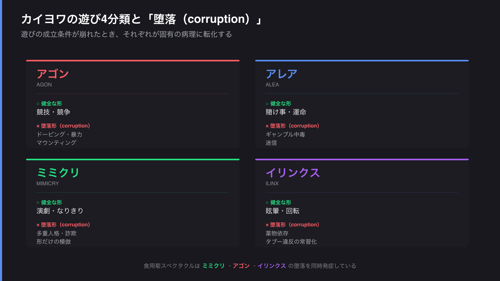
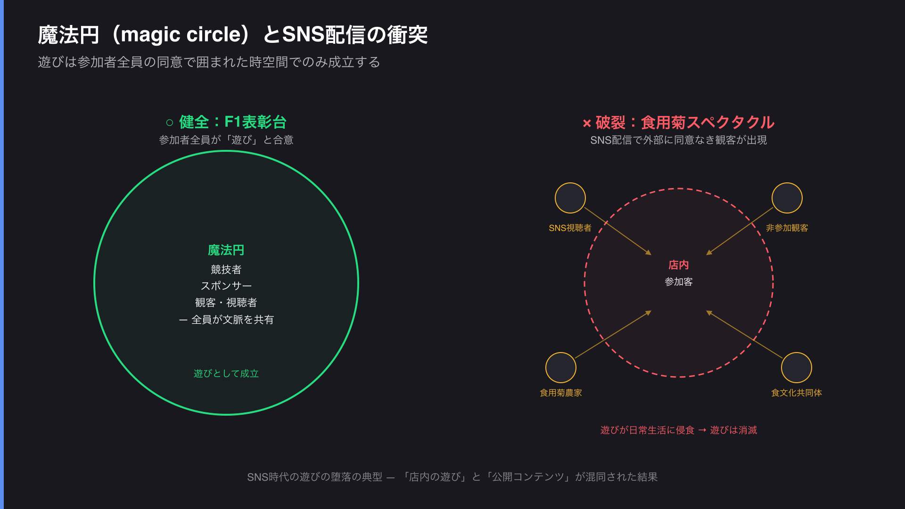

# 食用菊を撒く演出はなぜ「遊び」になり損ねたのか

— 祝祭・食材・カイヨワで読み解く炎上の構造

---

## 謝辞 — 本稿の位置づけ

本稿は WAGYUMAFIA およびホリエモン氏個人への批判を目的としたものではない。

むしろ、この一件は **「遊びとは何か」「祝祭とは何か」「食材の象徴とは何か」** という抽象的な問いに、極めて具体的な題材を与えてくれた出来事であった。カイヨワとホイジンガを再読し、神饌の循環構造を整理し、所有権の前提を分解するという作業を、生きた事例に沿って進められたのは、本件が議論の出発点を提供してくれたからにほかならない。

固有名詞は議論の起点として登場するが、関心の中心はあくまで **「遊びの設計」の一般原理** にある。「遊び」という極めて掴みにくい概念に対して、具体的な考察の機会を与えてくれた当事者の方々に、**思考の触媒として** 感謝の念を記しておきたい。

---

## はじめに

WAGYUMAFIA の食用菊を使ったイベント演出が炎上した。オーナーのホリエモン氏は「F1 のシャンパンファイトや野球のビールかけと同じ」と擁護したが、批判は収束していない。

本稿は、この一件を **「遊びの設計（design of play）」** の問題として読み解く試みである。表面の「食材を粗末にした」という論点の下に、

- 祝祭文化の文法の違い
- 食材の浪費と象徴の取り扱い
- 「金を払えば良い」論理の前提
- カイヨワが定義した **遊びの堕落（corruption of play）** の典型例

という複数の層が積み重なっている。順に剥がしていく。

---

## 第1章 シャンパンファイトと食用菊は同列か

ホリエモン氏の擁護論の核は「**祝い事で食材を浪費するのは古今東西ある**」という抽象化された普遍主張にある。これは一見もっともらしいが、**素材の象徴的位相**を見落としている。

### シャンパン・ビールの位相

- 工業生産された嗜好品で、宗教的・象徴的な含意をほぼ持たない
- F1 シャンパンファイトは1966年ル・マンが起源、ビールかけは戦後プロ野球の慣習 — どちらも **世俗の祝祭として歴史的に確立** したコード
- 「観客もチームメイトもびしょ濡れになる」ことが演出の核で、**飛散すること自体が消費**（飲むのと等価な使い切り）
- モエ・エ・シャンドン等は F1 公式パートナーとして「ふりかける用」マグナムを供給しており、**製造者・流通者・使用者の全員が合意した用途**

### 菊（食用菊を含む）の位相

日本文化において菊は **多義的な聖性を帯びた記号** である。

- 皇室の紋章（菊花紋章）
- 葬儀・仏事の供花、墓前・仏壇の定番
- 神饌（神への供物）の代表的な花
- 重陽の節句（菊の節句）— 不老長寿を祈る神事

「食用菊」と銘打って分離しても、菊という記号そのものが背負う文脈は剥がれない。山形「もってのほか」、新潟「かきのもと」など、農家が **「食べてもらうために」** 栽培している農産物でもある。

### 神饌の構造との対比

神事における供物は、単なる「食べ物の浪費」ではなく明確な循環構造を持つ。

**直会（なおらい）** がポイントで、神饌は最終的に人の口に入って完結する。「捧げる → 共食する」までがワンセットで、食材は一度も粗末にされていない。むしろ食材を最も丁重に扱う様式が神饌である。

シャンパンファイトは消費=飛散が一致するので浪費感が薄いが、菊を撒く演出は「食材として供されるはずだったものが、口に入らずに踏まれる/捨てられる」工程を可視化してしまう。**神饌の真逆のベクトル**になる。

---

## 第2章 食材を無駄にしているという観点での違い

「食材の無駄」という単一軸に絞っても、複数のサブ軸で違いが出る。

### 製造意図 — その素材は何のために作られたか

| | シャンパン | 食用菊 |
|:--|:--|:--|
| 想定用途 | 飛散使用を織り込み済み | 食用前提 |
| 製造側合意 | 製造者・流通者・使用者全員 | 農家の同意なし |

### 代替消費可能性 — 食物連鎖から抜き取ったか

シャンパンは表彰台用マグナムが販売市場と別ルートで流通している（プロモーション枠）。これがなくても消費者向けの供給は減らない。

食用菊は出荷市場から仕入れている場合、**食卓に並ぶはずだった分**を演出に転用したことになる。食料供給チェーンから抜き取られた量がそのまま機会損失になる。

### 規模の非対称性 — 生産者にとっての比率

| | シャンパン | 食用菊 |
|:--|:--|:--|
| 世界生産規模 | 年間 約3億本 | 限られた農家・季節 |
| 演出での使用量 | 年間数十本オーダー | 一農家の数日分の出荷量 |
| 一生産者比率 | ほぼゼロ | 大きい |

### 消費の完結性 — 飛散=消費か、飛散=破棄か

- **シャンパン**: 液体が霧状に拡散 → 体・服に付着 → 揮発・吸収。「飲む」と「浴びる」が連続スペクトル上にある。物理的に回収できないので「使い切り」と一致
- **食用菊**: 固形の花弁を撒く → 床・服に落ちる → **回収すれば食べられる状態のまま**廃棄に回る。「食べる」と「撒く」の間に明確な断絶がある

**シャンパンは「捨てた」と言えない構造、食用菊は「捨てた」と言える構造**。廃棄の可視性が違う。

---

## 第3章 「金を払っているから良い」のズレを言語化する

擁護側がよく持ち出す「対価を払ったのだから何をしても良い」論には、**6つの暗黙前提**が滑り込んでいる。これを一つずつ剥がす。

### 1. 所有権 ≠ 全権

所有権は「使用・収益・処分」の法的権原であって、**あらゆる扱い方が社会的に正当という意味ではない**。法律上できることと、しても咎められないことは別レイヤーである。

### 2. 価格は全価値を捕捉しない

価格は市場で売買されうる側面だけを切り取った数字。食材が背負う栽培者の労働・気候・文化・象徴は値段に含まれていない。**値段を払ってもそれらの扱いまで購入したことにはならない**。経済学でも non-market value として確立した概念だ。

### 3. 私的取引と公共空間の区別

取引が私的でも、**公衆に見せる演出（イベント・SNS 配信）にした瞬間、行為は公共空間に出ている**。「俺の金で買ったんだから関係ないだろ」は、自分が公共の場で発言した事実を都合よく忘れている。

### 4. 生産者の道徳的残余

工業製品なら売った後の用途に作り手は関心を持たないが、農作物は **作り手の顔・労働・季節・土地が分かちがたく結びついている**。販売は所有権の移転であって、道徳的関心の消滅ではない。

### 5. 商品化の限界（Moral Limits of Markets）

マイケル・サンデルの議論に従えば、**市場で扱った瞬間に価値が損なわれる財**が存在する。食用菊のような文化的に意味を負った素材は、純粋な商品として扱えばその文化的層を毀損する。

### 6. カテゴリーエラー — 食材の telos

アリストテレス的に言えば、各々の物には固有の目的（telos）がある。食材の telos は「食べられて生命に変わること」。これを破棄演出に使うのは、**素材のカテゴリそのものを誤用している**。

### 一行に圧縮するなら

> 「金を払う」のは法的所有権の取得であって、文化的・倫理的・社会的な扱いの正当化ではない。価格は全価値を映さず、公共空間に持ち出した瞬間、私的所有の論理は社会的評価に開かれる。

---

## 第4章 炎上の根源はどこにあるか

ここまでの議論を踏まえると、炎上の根源は表層の「食材を粗末にした」より深い場所にある。

### 表層 — 行為そのもの

食用菊を演出として撒いた事実。これだけなら一日の話題で終わる規模。

### 中層 — 弁明が火に油

炎上を本格化させたのは行為より弁明の方だと考えられる。「F1 と同じ」という反論は、批判者から見れば次の三重の侮辱を含む：

1. 「お前らは祝祭文化を知らない」という暗黙のマウント
2. 批判の論点をすり替えた議論の不誠実さ
3. 謝らないどころか、批判者を啓蒙対象として扱った態度

### 深層 — 日本の食文化の「祝祭=敬意増幅」公式

ここが本丸である。日本の食文化では、**祝祭と敬意は対立せず、むしろ強く結びついている**。

- 御節料理：祝祭の最高峰だが、食材一つ一つに意味と扱いの作法がある
- 懐石・会席：もてなしの場ほど、素材への敬意が増す
- 神饌・直会：神事の供物は最も丁重に扱われ、最後に共食される
- 「いただきます」：日常の食でさえ、生命への敬意が儀礼化されている

**「祝うほど丁重になる」**が日本の食文化のデフォルトである。

ところが食用菊を撒く演出は、この公式を反転させた：**祝うために食材を粗末にする**。これは単なるマナー違反ではなく、食文化の文法そのものを壊す行為として認識される。

一方、シャンパンファイトの世界（欧米スポーツ文化）では、**祝祭と素材敬意はそもそも結びついていない**。だから飛沫として消費することが文化的に許容される。

ホリエモン氏は **欧米的な「祝祭=過剰消費」の文法**を、**日本の「祝祭=敬意増幅」の文法**が支配する場所に持ち込んで、両者を等価扱いした。

### 構造的背景 — 生産者の不可視化

「金を払えば良い」論理が成立してしまうのは、消費者と生産者の距離が極端に開いた現代だからこそ。WAGYUMAFIA の顧客・ホリエモン氏は生産現場から最も遠い位置にいる。食材が「貨幣で取得した記号」になり、生産者の顔が見えなくなる。値段以外の価値が認知から落ちる。

### 文化的フォルトライン

この炎上はもう一つの層も触れている：**コスモポリタン富裕層の文化** vs **国内伝統食文化** の対立。食用菊は山形・新潟の郷土食という、後者の象徴的素材。「都市富裕層が、地方の食文化を、自分たちの祝祭演出のために消費した」という構図に読み替えられる物語回路が、炎上を加速した。

### 根源を一行で

> 日本の食文化が暗黙に持つ「祝祭=敬意増幅」の文法を、欧米的な「祝祭=過剰消費」の文法で上書きしようとしたことへの、文化的拒絶反応。

そして、これを行為そのものではなく弁明によって明示化してしまったことが、炎上を「ただの失敗」から「文化対立の象徴」に格上げした。

---

## 第5章 遊びの設計として読み解く — カイヨワの「堕落」

ここからが本稿の中心である。カイヨワとホイジンガの線で読むと、この一件は **「遊びの堕落」のほぼ全形態を同時に発症している教科書的事例**に見える。

### 前提 — 遊びの成立条件

ホイジンガとカイヨワの理論から、遊びの成立条件を抽出する：

- **魔法円（magic circle）**：日常から切り離された時空間の枠
- **自発性**：参加者全員が遊びとして同意している
- **非生産性**：富を生まず、ただし富を破壊もしない方向で完結
- **規則性 / 境界性**：何を持ち込み何を持ち込まないかが定まっている
- **聖と遊びの近接性**：両者は構造が似ているが、混ぜると両方が壊れる

これらが満たされる範囲で、遊びは遊びとして成立する。**この条件のいずれかが破れた状態をカイヨワは「堕落（corruption）」と呼んだ**。

### カイヨワの4分類と、それぞれの堕落形態

| 分類 | 健全な形 | 堕落形 |
|:--|:--|:--|
| **アゴン** | 競技・スポーツ | 暴力・ドーピング・マウンティング |
| **アレア** | 賭け事・運命 | ギャンブル中毒・迷信 |
| **ミミクリ** | 演劇・なりきり | 多重人格・詐欺・形だけの模倣 |
| **イリンクス** | 眩暈・回転遊び | 薬物・タブー違反の常習化 |

### この一件への適用

#### 1. ミミクリの堕落 — 形だけの輸入

F1 シャンパンファイトには構造的条件が揃っている：
- 競技者の身体的限界の解放（agon の終了儀礼）
- シャンパンメゾンとの公式合意
- 表彰台という閉じた魔法円

これらを全部スキップして「飛沫を撒く」絵だけ輸入したのが食用菊の演出。カイヨワが警告した「外形的模倣」そのもの — **遊びの substance（実質）が抜け落ちて、シニフィアン（記号）だけが残った状態**。

#### 2. アゴンの堕落 — マウンティングへの転化

スポーツ祝祭は競技後の解放儀礼であって、競技そのものではない。アゴンの完了印として機能する。

食用菊を撒く演出には、**何のアゴンも完了していない**。にもかかわらず祝祭儀礼の外形を借りているので、観客から見ると「金を持っていることのマウンティング」に見える。アゴンが純粋競争から権力誇示に堕落した形。

#### 3. イリンクスの堕落 — 違反そのものの快感

イリンクスは「眩暈・酩酊・秩序の一時停止」による解放。これが堕落するとタブー違反そのものが目的化する。

「やってはいけないとされていることを、やる爽快感」「批判されることを織り込んで、それでもやる」というポーズ。ホリエモン氏のキャラクター（タブーを破る快感の供給者として消費される）と一致する。**イリンクスがアルコール・薬物依存に堕落するのと同じ構造**で、刺激の供給源が物質からタブー違反に置き換わっている。

#### 4. 魔法円の崩壊 — 観客の非同意

最も根本的な失敗だと思う層。

遊びは、参加者全員が「これは遊びである」と合意した時空間でのみ成立する（ホイジンガ）。

- F1 表彰台：観客もテレビ視聴者も「これは祝祭儀礼」と合意している魔法円の中
- レストラン店内：客が同意の上で参加するなら、店内は魔法円
- **しかし SNS で配信した瞬間、魔法円の壁は破れる**：視聴者は同意していない、生産者は同意していない、通りすがりの観客に参加が強制された状態

「店内の遊び」と「公開コンテンツ」が混同された結果、魔法円がない場所で遊びが起きてしまった。これは遊びではなく、**遊びの形をした自己顕示**になる。カイヨワ風に言えば：**遊びが日常生活に侵食したとき、遊びは消滅する**。SNS 時代の遊びの堕落の典型例。

#### 5. 遊びと聖の混同

カイヨワが繰り返し強調した点：**遊びと聖は同じ構造（隔離された時空間）を持つが、混ぜてはならない**。混ぜると両方が壊れる。

食用菊は前述の通り、菊という記号で聖性のレジスタに片足を入れている素材。これを遊びの素材として扱った瞬間、聖の側からは「聖の娯楽化＝冒涜」、遊びの側からは「聖の重さで遊びが息苦しくなる」となり、**両方の制度が同時に毀損される**。

#### 6. 非生産性原則の踏み越え

カイヨワは「遊びは富を生まないし、富を消費するだけ」とした。**ただしこれは「破壊を含意していない」**ことが暗黙の前提。

食用菊を撒く演出は食物連鎖から食材を抜き取って破壊した。これは「非生産」ではなく **「反生産」**。バタイユ的に言えば「**消尽（dépense）**」の領域だが、消尽には伝統的に儀礼の容器が伴っていた（ポトラッチ、犠牲、祭礼）。容器なしの消尽は、ただの破壊である。

#### 7. パイディアとルドゥスのバランス崩壊

- **パイディア**：自発的・無秩序な遊び
- **ルドゥス**：規則・洗練・修練に向かう遊び

健全な遊びは両者のバランスで成立する。食用菊演出は **パイディア過剰、ルドゥス欠如** の状態：「楽しいから撒く」奔放さだけがあり、「いつ・誰が・何を・どう撒くか」のルドゥス的洗練がない。F1 シャンパンファイトは強固なルドゥス（プロトコル）の上で成立している、その対比が露わになる。

### 診断 — 遊びの設計として何が壊れているか

| 遊びの成立条件 | この一件での状態 |
|:--|:--|
| 魔法円 | SNS 配信で破裂 |
| 自発性・全員同意 | 観客・生産者が非同意 |
| 非生産性 | 反生産（食物連鎖から抜取） |
| 規則性・境界性 | パイディア過剰、ルドゥス欠如 |
| 聖との分離 | 菊の聖性レジスタを取り込んで混合 |
| ミミクリの内面化 | 形だけ模倣、構造的条件不在 |
| アゴンの完了印 | 完了すべきアゴン不在 → マウンティング |
| イリンクスの容器 | 違反そのものが快感源に転化 |

**ほぼ全項目で堕落している**。これは「ちょっと配慮が足りなかった」レベルではなく、遊びの設計として複合的に失敗している事例である。

---

## 第6章 設計者にとっての教訓

遊びの設計者の視点で抽出すると、応用可能な原則がいくつか見える。

1. **形式の輸入は構造的条件の輸入とセット** — ミミクリの罠を避ける
2. **魔法円の境界を明示** — 特にメディア時代は配信境界を意識する
3. **素材の象徴的レジスタを事前に評価** — 聖性の混入を避ける
4. **アゴン完了印としての祝祭か、裸の誇示か** を区別する
5. **非生産（容器あり）と反生産（容器なし）の境** を踏み越えない
6. **パイディアにはルドゥスの容器が必要** — 即興だけの祝祭は暴発する

ホリエモン氏の演出は、**遊びの自由度を最大化したつもりが、遊びの成立条件を逆に削ぎ落としていた**、というのが「遊びの設計」観点からの診断になる。

> 遊びの自由は、遊びの容器の堅牢さに支えられている

この逆説が見落とされた事例として、本件は記憶される価値があると思う。

---

## おわりに

「祝い事で食材を浪費するのは古今東西ある」という抽象化は、確かに一定の真理を含んでいる。しかしその抽象は、**素材ごとに異なる象徴・生産・流通・聖俗の構造**を均してしまう。「食材の浪費」というラベルだけ見て同列にするのは粒度が粗すぎる。

そして、こうした文化の暗黙文法を踏み越えるとき、必要なのは「炎上覚悟の挑発」ではなく **「文法を踏まえた上での再構築」** である。新しい祝祭の形式を作りたいのであれば、生産者と組み、素材の象徴を引き受け、観客と魔法円の合意形成をするという、**遊びの設計の作法**が要る。

「遊び」は最も自由な行為のように見えて、実は最も繊細な制度である。

---

## 参考文献

- ロジェ・カイヨワ『遊びと人間』（多田道太郎・塚崎幹夫訳、講談社学術文庫）
- ヨハン・ホイジンガ『ホモ・ルーデンス』（高橋英夫訳、中公文庫）
- ジョルジュ・バタイユ『呪われた部分』（生田耕作訳、二見書房）
- マイケル・サンデル『それをお金で買いますか — 市場主義の限界』（鬼澤忍訳、ハヤカワ・ノンフィクション文庫）
