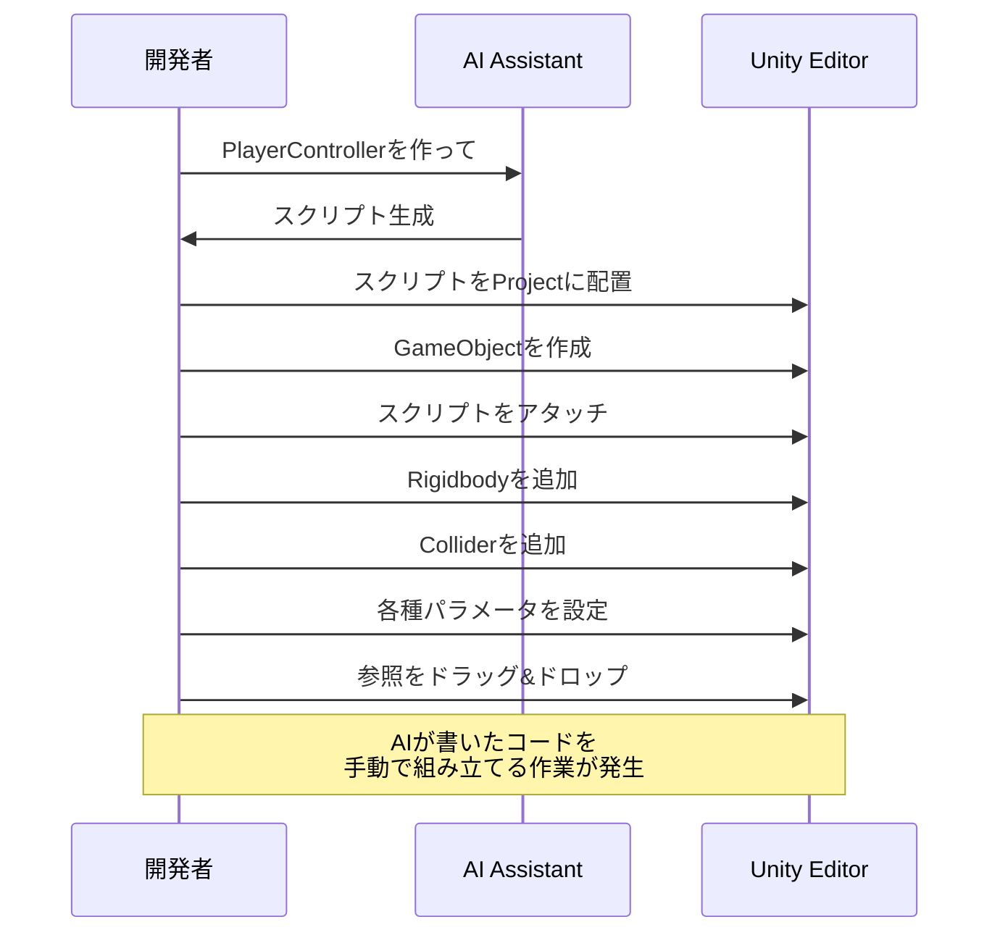
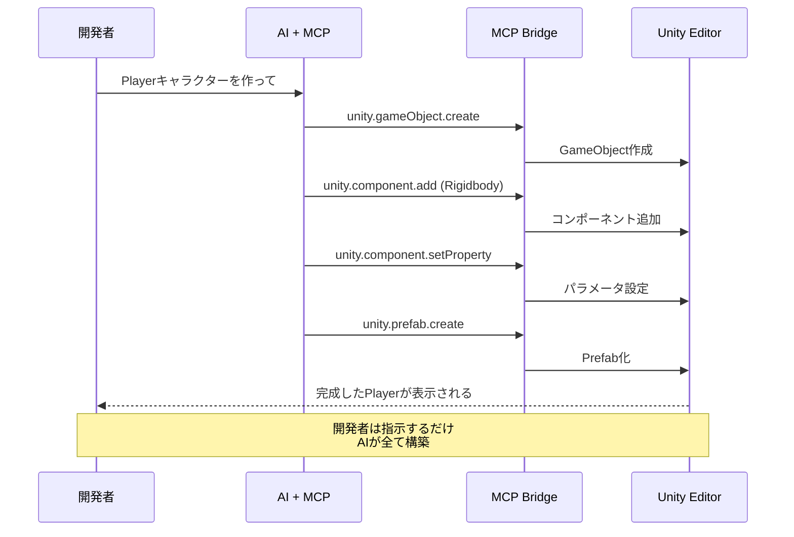
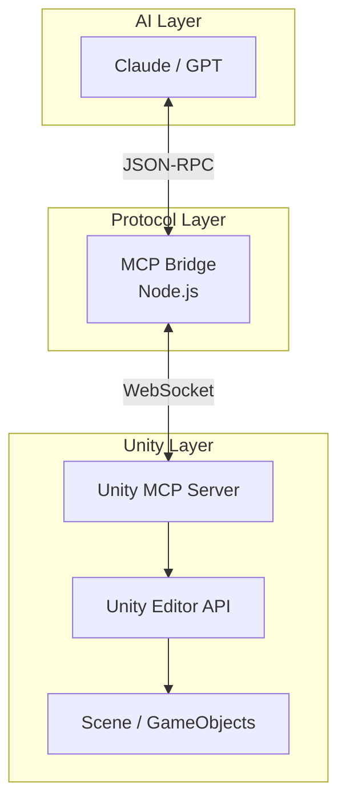

# UnityでなぜMCPが必要なのか - AIコーディング時代のUnity開発インフラ

## はじめに

AIコーディングアシスタントの進化によって、C#スクリプトを書くこと自体は、もはや特別な行為ではなくなりつつあります。
頭の中にあるイメージを言葉にすれば、数秒後にはそれなりに動きそうなコードが目の前に現れます。

それは間違いなく革命です。
しかし、Unityでゲームを作っている方なら、きっとこう感じたことがあるはずです。

> 「……ここからが本番なんだよな」

本記事では、**なぜUnity開発においてMCP（Model Context Protocol）が必要なのか**を、単なる効率化の話ではなく、「もっと早く試したい」「もっと雑に作って、もっと磨きたい」という開発者の衝動の視点から掘り下げていきます。

## 対象読者

- Unity開発者
- AIアシスタント（Claude、GPT等）を開発に活用している方
- ゲーム開発のイテレーション速度を上げたい方

## AIができること・できないこと

### AIが得意なこと：スクリプト生成

```csharp
// AIはこのようなコードをいくらでも生成できます
public class PlayerController : MonoBehaviour
{
    [SerializeField] private float moveSpeed = 5f;
    [SerializeField] private float jumpForce = 10f;

    private Rigidbody rb;

    void Start()
    {
        rb = GetComponent<Rigidbody>();
    }

    void Update()
    {
        float horizontal = Input.GetAxis("Horizontal");
        float vertical = Input.GetAxis("Vertical");
        Vector3 movement = new Vector3(horizontal, 0, vertical) * moveSpeed;
        rb.velocity = new Vector3(movement.x, rb.velocity.y, movement.z);
    }
}
```

この程度のコードであれば、もはや「書いてもらう」という感覚すら薄れてきました。
設計意図を伝えれば、AIはそれなりに整った構造で、破綻の少ないコードを返してくれます。

アイデアを思いついた瞬間に、**とりあえず動く形**が手に入ります。
これは間違いなく、創作のスピードを押し上げる力を持っています。

### AIができないこと：Unityエディタ操作

一方で、Unity開発の現場に戻ると、現実が立ちはだかります。

| 作業 | 内容 | AIの限界 |
|:---|:---|:---|
| **Scene構築** | Hierarchy内のオブジェクト配置 | ファイル操作不可 |
| **GameObject操作** | 作成・削除・親子関係設定 | エディタAPI呼び出し不可 |
| **Component参照** | SerializeFieldへの参照設定 | Inspector操作不可 |
| **数値設定** | Transform、物理パラメータ調整 | 実行時の値変更不可 |
| **Prefab化** | アセット作成・管理 | AssetDatabase操作不可 |

ここにあるのは、**ゲームを「触れる状態」にするための作業**です。
そして皮肉なことに、この工程こそが、試行錯誤のテンポを最も鈍らせます。

## 問題の本質：コードと設定の分離

Unityの設計思想は、とても健全です。
**コード（ロジック）** と **設定（データ）** を分離することで、柔軟で安全な開発を可能にしています。


AIがいくら優れたコードを書いても、それを「動く状態」にするにはUnity Editorの操作が必要です。
この**壁**が、アイデアを試すスピードを鈍らせます。

スクリプトが完成しても、

- Sceneに置き
- 参照を繋ぎ
- 値を調整し

ようやく「試せる」状態になります。

この「試すまでの距離」が長いほど、人はアイデアを削り、妥協し、最終的には諦めてしまいます。

## 従来のワークフローの問題点



この流れは、一つ一つ見れば大したことはありません。
しかし、**毎回これを繰り返す**とどうなるでしょうか。

- 試行回数が減る
- 「あとでやろう」が増える
- 面白くなりそうな分岐を切り捨てる

つまり、**可能性を自分で狭めてしまう**のです。

## MCPによる解決

MCPを導入すると、状況は一変します。



これは「自動化」の話ではありません。
**思考と結果の距離を縮める**ための仕組みです。

頭の中にあったイメージが、UnityのScene上にそのまま立ち上がります。
その瞬間、人はまた次のアイデアを思いつきます。

## MCPで可能になること

### 1. Scene構築の自動化

```
「3Dプラットフォーマーの基本ステージを作って」
```

AIがMCPを通じて：

- 地面（Plane）を作成
- プラットフォームを配置
- ライトを設定
- カメラを配置

「まずは雰囲気を見る」という行為が、ほぼ思考と同時に行えるようになります。

### 2. GameObject操作

```
「Playerの子オブジェクトとしてWeaponHolderを作成して」
```

AIがMCPを通じて：

- 親子関係を設定
- 適切な位置に配置
- 必要なコンポーネントを追加

構造を考えることに集中でき、「作業」に意識を奪われません。

### 3. Component参照の設定

```
「PlayerControllerのtargetにEnemyを設定して」
```

AIがMCPを通じて：

- SerializeFieldの参照を解決
- 適切なオブジェクトを検索
- 参照を設定

ドラッグ＆ドロップの迷いが消え、設計の意図だけが残ります。

### 4. 数値の調整

```
「移動速度を10に、ジャンプ力を15に設定して」
```

AIがMCPを通じて：

- Inspector上の値を変更
- 複数のパラメータを一括設定

「ちょっと速すぎるな」と感じたら、すぐ次の値を試せます。

## アーキテクチャ



MCPは、AIとUnityの間に立つ**翻訳者**です。
言葉になりきらない意図を、Unityが理解できる操作に変換し、その結果をまたAIへ返します。

この往復が速いほど、人はもっと大胆に、もっと自由に試せます。

## まとめ

| ポイント | 説明 |
|:---|:---|
| AIの限界 | コードは書けるが、Unityエディタは触れない |
| Unity開発の特性 | コード + 設定が揃って初めて成立する |
| MCPの役割 | その断絶を埋める |
| 効果 | 試行回数そのものが増える |

MCPは「楽をするため」の道具ではありません。
**思い描いたゲームを、諦める前に形にするためのインフラ**です。

作るスピードが上がれば、人はもっと多くのアイデアを信じられます。

## 参考リンク

- [UnityMCP GitHub](https://github.com/dsgarage/UnityMCP)
- [Model Context Protocol](https://modelcontextprotocol.io/)

## 関連記事

（ここに関連記事のリンクを追加）
