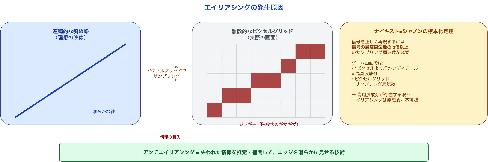
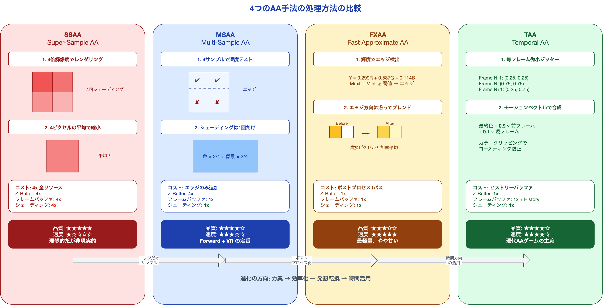
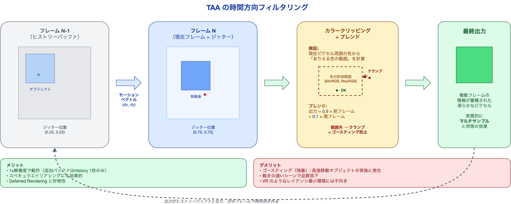

# アンチエイリアシング完全ガイド ― ジャギーとの10年戦争

ゲーム画面をよく見ると、キャラクターの輪郭や建物の斜めの線にギザギザ（ジャギー）が見えることがある。4K時代になった今でも、このジャギーは完全には消えていない。なぜなら、**どんなに解像度を上げても、ピクセルは四角い**からだ。

プロジェクトのグラフィックス設定を見れば、MSAA、FXAA、TAA……と並ぶアンチエイリアシングの選択肢。しかし「とりあえずTAAにしておけばいい」で選んでいないだろうか。VRプロジェクトでTAAを選べばレイテンシとゴースティングに悩まされ、モバイルでMSAAを4xにすればフレームレートが崩壊する。**選択を間違えれば、描画負荷が2〜4倍に跳ね上がる。**

本記事では、GAMES104の講義資料をベースに、SSAA / MSAA / FXAA / TAAの4手法を「なぜそうなるのか」から解説する。読み終えた後、あなたはプロジェクトの制約に合わせて**根拠を持ってAA手法を選べる**ようになる。

---

## エイリアシングはなぜ発生するのか

### ピクセルグリッドという制約

3Dシーンには連続的な曲線や斜線がある。しかし、画面は離散的なピクセルの格子（グリッド）で構成されている。連続的な信号を離散的なサンプルで表現するとき、**原理的に情報が失われる**。これがエイリアシングだ。



信号処理の世界では、これを**ナイキスト=シャノンの標本化定理**で説明する。ある信号を正しく再現するには、信号の最高周波数の**2倍以上のサンプリング周波数**が必要だ。ゲーム画面では、1ピクセルより細かいディテール（高周波成分）が存在する限り、ピクセルグリッドのサンプリングでは情報を正しく捉えられない。

### エイリアシングの3つのタイプ

ゲーム画面で発生するエイリアシングは、大きく3種類に分類できる。

| タイプ | 原因 | 見え方 |
|:---|:---|:---|
| **テクスチャエイリアシング** | テクスチャの解像度がピクセルに対して高すぎる | 遠くの模様がチラつく（モアレ） |
| **ジオメトリエイリアシング** | ポリゴンのエッジが斜めにピクセルを横切る | キャラクターの輪郭がギザギザ |
| **スペキュラエイリアシング** | 光沢面の反射が1ピクセル未満の模様を生む | 金属表面のチラつき |

テクスチャエイリアシングには**ミップマップ**（テクスチャの縮小版を事前生成する手法）が有効で、これは別の仕組みで対処される。本記事で扱うアンチエイリアシング手法は、主に**ジオメトリエイリアシング**と**スペキュラエイリアシング**を対象とする。

---

## SSAA ― 力業で全ピクセルを超解像する

### 仕組み

SSAA（Super-Sample Anti-Aliasing）は、最もシンプルで最も正確なアンチエイリアシング手法だ。考え方は単純で、**画面解像度の4倍（2x2）でレンダリングし、その結果を元の解像度に縮小する**。

```
1920×1080 の画面を SSAA 4x で処理する場合:

1. 3840×2160（4倍のピクセル数）でシーン全体をレンダリング
2. 4ピクセルの平均色を計算
3. 1920×1080 に縮小
```

4つのサンプルが異なる色を持つエッジ部分では、平均化によって自然なグラデーションが生まれ、ジャギーが滑らかになる。

### コスト

SSAAの品質は最高だが、コストも最高だ。

| リソース | 通常レンダリング | SSAA 4x |
|:---|:---|:---|
| フレームバッファ | 1x | **4x** |
| Z-Buffer | 1x | **4x** |
| シェーディング回数 | 1x | **4x** |
| 帯域幅 | 1x | **4x** |

すべてが4倍になる。1920×1080をSSAA 4xで処理すれば、実質4K解像度のレンダリングコストがかかる。現代のAAAゲームでは、通常レンダリングですらGPUがフル稼働しているため、SSAAを適用する余裕はほぼない。

SSAAは「理想的だが非現実的」な手法であり、他の手法の品質を測る**基準値（ゴールドスタンダード）**として存在する。

---

## MSAA ― エッジだけを賢くサンプルする

### SSAAの無駄を削る発想

SSAAが重い理由は、**ポリゴンの内部**という、色が均一でエイリアシングが起きない場所まで複数回サンプルしている点にある。ジャギーが発生するのはエッジ（境界線）だけだ。ならば、**エッジだけを複数サンプルすればよい**。

これがMSAA（Multi-Sample Anti-Aliasing）の設計思想だ。

### 仕組み

MSAAでは、各ピクセルに対して複数のサンプルポイント（4xなら4点）を配置する。ただし、SSAAとは異なり、**シェーディング（色の計算）は1回だけ**行い、各サンプルポイントでは**深度テスト（カバレッジテスト）のみ**を実行する。



```
MSAA 4x の処理（1ピクセルあたり）:

1. ピクセル内の4つのサンプルポイントで深度テスト
   → サンプルA: 三角形に含まれる ✓
   → サンプルB: 三角形に含まれる ✓
   → サンプルC: 三角形に含まれない ✗
   → サンプルD: 三角形に含まれない ✗

2. シェーディングは1回だけ実行（ピクセル中心で計算）
   → 色 = (0.8, 0.2, 0.1)

3. 最終色 = 色 × (含まれるサンプル数 / 全サンプル数)
   → (0.8, 0.2, 0.1) × (2/4) = (0.4, 0.1, 0.05) + 背景色 × (2/4)
```

エッジ上のピクセルでは複数のカバレッジ値が混在するため、結果的にエッジが滑らかに見える。ポリゴン内部のピクセルでは全サンプルが同じ三角形に含まれるため、通常のレンダリングと変わらない。

### コスト比較

| リソース | 通常 | SSAA 4x | MSAA 4x |
|:---|:---|:---|:---|
| フレームバッファ | 1x | 4x | **4x** |
| Z-Buffer | 1x | 4x | **4x** |
| シェーディング回数 | 1x | 4x | **1x〜** |
| 実効コスト | 1x | 4x | **1.2〜2x** |

フレームバッファとZ-Bufferは4倍だが、最も重いシェーディングが1回で済むため、実効コストはSSAAの半分以下になる。

### MSAAの限界

MSAAにはForward Renderingとの相性が良いという特長がある一方、**Deferred Renderingとは相性が悪い**。Deferred RenderingではG-Buffer（法線、アルベド、深度など複数のバッファ）を使用するため、MSAAを適用するとG-Bufferも4倍に膨れ上がる。G-Bufferのサイズが数十〜数百MBになるゲームでは、これは致命的だ。

また、MSAAは**ジオメトリのエッジ**には効果的だが、シェーディングで生まれるエイリアシング（スペキュラのチラつきなど）には**効果がない**。シェーディングは1回しか行わないため、シェーディング起因のエイリアシングはそのまま残る。

---

## FXAA ― ポストプロセスで画像を滑らかにする

### 発想の転換

SSAA と MSAA は、レンダリングの過程でエイリアシングを減らす。これに対して FXAA（Fast Approximate Anti-Aliasing）は、**完成した画像に対して後処理（ポストプロセス）としてエイリアシングを除去する**。

この発想転換により、FXAA は以下の利点を持つ。

- **追加のバッファ不要**: 1x解像度の画像だけで動作する
- **パイプライン非依存**: Forward でも Deferred でも適用できる
- **極めて軽い**: フルスクリーンのポストプロセス1パスで完了

### 仕組み

FXAA のアルゴリズムは以下のステップで動作する。

**ステップ1: 輝度（Luma）への変換**

人間の目は色の違いよりも明るさの違いに敏感だ。そこで、各ピクセルのRGBを輝度値に変換する。

```
Y = 0.299 × R + 0.587 × G + 0.114 × B
```

この係数は人間の視覚特性に基づいている。緑に対する感度が最も高く（0.587）、青が最も低い（0.114）。

**ステップ2: エッジ検出**

対象ピクセルとその上下左右のピクセルの輝度を比較する。

```
MaxLuma = max(上, 下, 左, 右, 中央)
MinLuma = min(上, 下, 左, 右, 中央)
コントラスト = MaxLuma - MinLuma

if コントラスト >= 閾値:
    → このピクセルはエッジ上にある
```

閾値を調整することで、エッジ検出の感度を制御できる。閾値を下げれば多くのピクセルがエッジとして検出されるが、処理が重くなり、テクスチャのディテールも失われやすくなる。

**ステップ3: エッジ方向の判定**

エッジが水平か垂直かを判定する。上下の輝度差の合計と、左右の輝度差の合計を比較し、大きい方がエッジの方向となる。

**ステップ4: エッジに沿ったブレンド**

エッジ方向に直交する方向で、隣接ピクセルとの加重平均を計算する。これにより、ハードなエッジが滑らかなグラデーションに置き換わる。

### FXAAの弱点

FXAA は「画像全体にスマートなぼかしをかける」手法と言える。そのため、**エッジだけでなくテクスチャのディテールも甘くなる**という根本的な弱点がある。文字やUIが微妙にぼやける、テクスチャの細かい模様が潰れる、といった現象が起きる。

FXAA はジオメトリ情報を持たないため、「ここはポリゴンのエッジ」「ここはテクスチャの模様」を区別できない。輝度のコントラストが高い場所はすべて同じように処理されてしまう。

---

## TAA ― 時間を味方にするアンチエイリアシング

### 時間方向のサンプリング

TAA（Temporal Anti-Aliasing）は、空間的に追加サンプルを取る代わりに、**複数フレームにわたって情報を蓄積する**アプローチを取る。毎フレーム微小にカメラのサンプリング位置をずらし（ジッター）、過去フレームの結果と合成することで、実質的に複数サンプルと同等の効果を得る。



```
フレーム N-1: サンプル位置が (0.25, 0.25) にずれている
フレーム N  : サンプル位置が (0.75, 0.75) にずれている
フレーム N+1: サンプル位置が (0.25, 0.75) にずれている
...

→ 複数フレームの結果を合成すると、1ピクセルあたり複数サンプルの効果
```

### 仕組みの詳細

TAAの処理は以下の3ステップで構成される。

**ステップ1: ジッター付きレンダリング**

プロジェクション行列に微小なオフセット（ジッター）を加える。これにより、毎フレームわずかに異なる位置でピクセルがサンプルされる。ジッターのパターンには Halton 列などの準乱数列が使われ、均等にサンプル位置が分布するようになっている。

**ステップ2: モーションベクトルによるリプロジェクション**

前フレームの結果を使うためには、「今のピクセルが前のフレームではどこにあったか」を知る必要がある。これを**モーションベクトル**で計算する。

```
現在のピクセル位置: (x, y)
モーションベクトル: (dx, dy)
前フレームでの対応位置: (x - dx, y - dy)

→ 前フレームのヒストリーバッファから色をサンプル
```

モーションベクトルは、カメラの動きとオブジェクトの動きの両方を含む。Deferred Rendering の G-Buffer から深度情報を利用して計算するため、**TAA は Deferred Rendering と非常に相性が良い**。

**ステップ3: ヒストリーの検証とブレンド**

前フレームの色をそのまま使うと、シーンが大きく変化したとき（新しいオブジェクトが出現した、爆発が起きた、など）に**ゴースティング（残像）**が発生する。これを防ぐため、前フレームの色が妥当かどうかを検証する。

代表的な検証手法が**カラークリッピング**だ。現在のピクセルとその周囲のピクセルの色から、「ありえる色の範囲」（バウンディングボックスまたは矩形範囲）を計算し、前フレームの色がその範囲外にあれば、範囲内に修正（クリッピング）する。

```
現在の周囲ピクセルの色から:
  MinColor = 周囲の最小RGB
  MaxColor = 周囲の最大RGB

前フレームの色が [MinColor, MaxColor] の範囲外なら:
  → 範囲内にクランプ（ゴースティング防止）

最終色 = α × クランプ済み前フレーム色 + (1 - α) × 現在フレーム色
```

ブレンド比率αは通常 0.9〜0.95 程度（前フレームの比率が高い）。これにより、静止シーンでは多くのフレームの情報が蓄積されて高品質なAAが実現し、動きの速いシーンではクリッピングが効いて残像を抑制する。

### TAAのメリットと弱点

**メリット:**
- 追加のレンダリング解像度が不要（1xのまま動作）
- ジオメトリエイリアシングだけでなく、**スペキュラエイリアシングにも効果的**
- Deferred Rendering と相性が良い
- 現代のAAAゲームで最も広く採用されている

**弱点:**
- **ゴースティング**: カラークリッピングで軽減するが、完全には防げない。高速に動くオブジェクトの背後に残像が見えることがある
- **ブラー**: ジッターと時間的ブレンドにより、静止画でも微かなぼやけ感が生じる
- **動きの速いシーン**: モーションベクトルの精度限界やオクルージョン変化で品質が低下する
- **入力遅延**: VRのように低レイテンシが必須の環境では、前フレーム依存がフレームレート要件と矛盾する

---

## 4手法の比較と選択指針

### 総合比較表

| 手法 | 品質 | コスト | ジオメトリAA | スペキュラAA | Deferred対応 | ポストプロセス |
|:---|:---|:---|:---|:---|:---|:---|
| **SSAA** | 最高 | 非常に高い | 最高 | 最高 | 可能 | 不要 |
| **MSAA** | 高い | 中〜高 | 高い | 効果なし | 非推奨 | 不要 |
| **FXAA** | 中程度 | 非常に低い | 中程度 | 中程度 | 可能 | ポストプロセス |
| **TAA** | 高い | 低〜中 | 高い | 高い | 推奨 | 半ポストプロセス |

### Unity URP / HDRP での設定

**URP（Universal Render Pipeline）:**

```
URP Asset → Quality → Anti Aliasing:
  - None
  - FXAA（デフォルト推奨）
  - SMAA（FXAAの上位版、やや重い）

Camera → Rendering → Anti-aliasing (MSAA):
  - Disabled / 2x / 4x / 8x

※ URP では TAA は Unity 6 以降でサポート
```

**HDRP（High Definition Render Pipeline）:**

```
HDRP Asset → Rendering → Anti Aliasing:
  - None
  - FXAA
  - TAA（デフォルト推奨）
  - SMAA

Camera → Anti-aliasing:
  - TAA の場合: Sharpness と History Sharpening を調整可能
```

### プラットフォーム別推奨

| プラットフォーム | 推奨手法 | 理由 |
|:---|:---|:---|
| **モバイル** | FXAA または MSAA 2x | GPU負荷を最小限に抑える必要がある。MSAA はモバイルGPUのタイルベースレンダリングと相性が良い |
| **PC / コンソール** | TAA（第一選択）、FXAA（軽量ゲーム） | Deferred Rendering が主流のため、TAA が最も効果的。FPSが重要なe-sportsタイトルでは FXAA |
| **VR** | MSAA 4x | レイテンシ最小が最優先。TAA の前フレーム依存はVRの快適性を損なう。Forward Rendering + MSAA が定番構成 |

### 判断フローチャート

```
Q1: レイテンシが最重要か？（VR / 競技ゲーム）
  → Yes: MSAA（Forward Rendering と組み合わせ）
  → No: Q2 へ

Q2: Deferred Rendering を使っているか？
  → Yes: TAA（HDRP デフォルト）
  → No: Q3 へ

Q3: GPU負荷に余裕があるか？
  → Yes: MSAA 4x + FXAA のハイブリッド
  → No: FXAA（最軽量）
```

---

## まとめ

| 観点 | 要点 |
|:---|:---|
| 本質 | エイリアシングは連続信号を離散サンプルで表現する限り避けられない。ナイキスト定理がその理論的根拠 |
| 進化の方向 | SSAA（力業）→ MSAA（エッジ特化）→ FXAA（ポストプロセス）→ TAA（時間蓄積）と、効率化の歴史 |
| 現代の主流 | PC/コンソールでは TAA がデファクト。モバイルは FXAA/MSAA、VR は MSAA が定番 |
| 選択基準 | レンダリングパイプライン（Forward/Deferred）、プラットフォーム（モバイル/PC/VR）、スペキュラの有無の3軸で判断する |
| 次の進化 | DLSS / FSR などのAI超解像が「アップスケール + AA」を統合する流れが加速している |

---

## シリーズ一覧

本記事は「ゲームエンジンのレンダリング技術」シリーズの第4回です。

| 回 | テーマ |
|:---|:---|
| 第1回 | レンダリングパイプラインの全体像 |
| 第2回 | ライティングとライトマップの技術 |
| 第3回 | シャドウとアンビエントオクルージョン |
| **第4回（本記事）** | アンチエイリアシング完全ガイド |
| 第5回 | ポストプロセスで画をつくる |

---

## 参考情報

| 資料 | 著者/出典 | 内容 |
|:---|:---|:---|
| GAMES104 Lecture 07: Rendering on Game Engine | Wang Xi | アンチエイリアシングのセクション（Page 20-32） |
| FXAA White Paper | Timothy Lottes, NVIDIA | FXAA 3.11 のアルゴリズム詳細 |
| A Survey of Temporal Antialiasing Techniques | Lei Yang et al. | TAA の各種手法の比較調査 |
| Real-Time Rendering, 4th Edition | Akenine-Moller et al. | Chapter 5: アンチエイリアシングの理論と実装 |

---

*本記事は [UniMCP4CC](https://github.com/dsgarage/UniMCP4CC) プロジェクトの技術知見を基に執筆しています。Unity × Claude Code でのゲーム開発に興味がある方はぜひご覧ください。*
