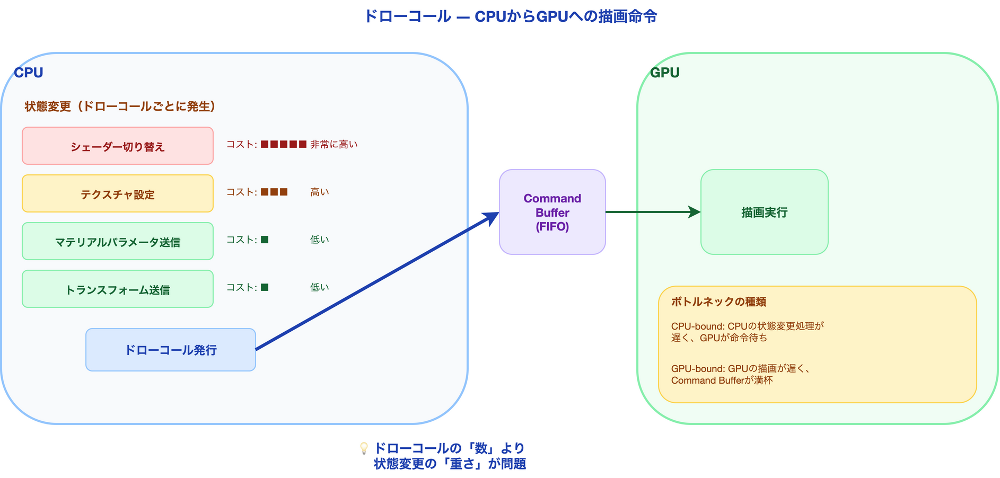
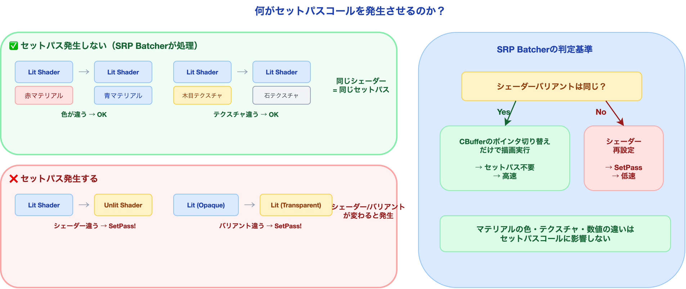
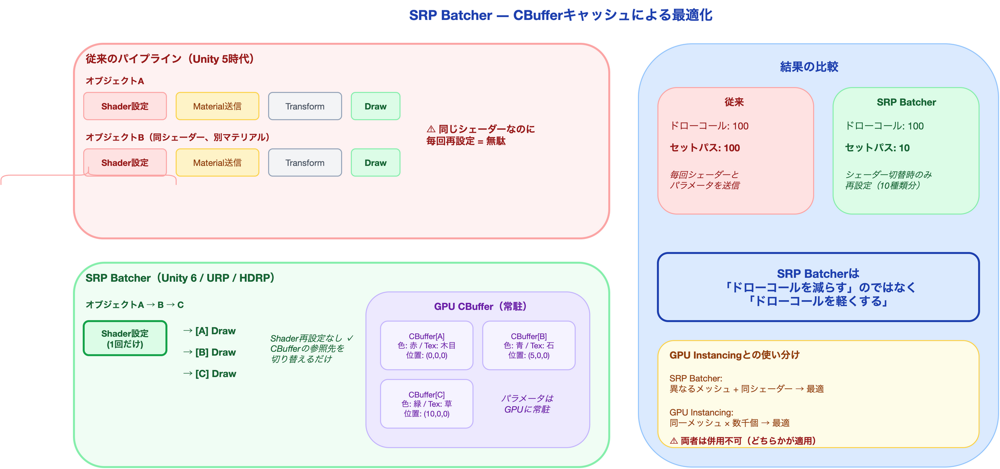
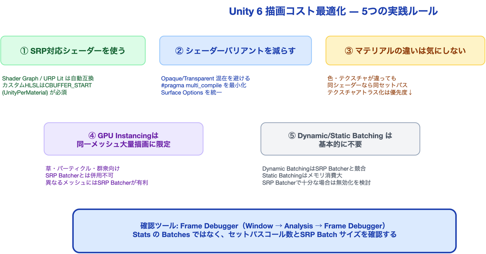
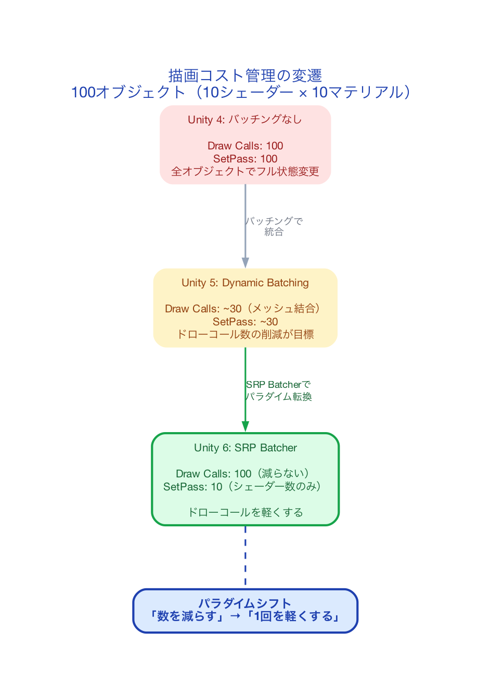

# ドローコールからセットパスへ ― 描画コスト管理の10年間の変遷

「ドローコールを減らせ」――Unity開発者なら一度は聞いたことがあるアドバイスだ。検索すれば、Dynamic Batching、Static Batching、アトラス化、メッシュ結合…… 無数の「ドローコール削減テクニック」がヒットする。

しかし、その記事はいつ書かれたものだろうか。

Unity 6（URP / HDRP）の時代、最も重要な描画コスト指標は**ドローコール数ではなく、セットパスコール数**に変わっている。SRP Batcherが標準搭載され、同じシェーダーを使うオブジェクトであれば、マテリアルのパラメータが異なっていても**自動的に描画コストが最適化される**。にもかかわらず、「ドローコールを減らそう」という古い情報が大量に残っているため、初学者は何を指標にすべきか分からない。

本記事では、描画コスト管理の歴史的変遷を辿り、「今、何を見て、何をすべきか」を明確にする。

---

## 描画の裏側: CPUとGPUの会話

### ドローコールとは何か

ゲーム画面の1フレームを描くために、CPUは「このメッシュを、このマテリアルで、この位置に描け」という命令をGPUに送る。この命令1回分が**ドローコール**だ。



問題は、ドローコールそのものではなく、**その前後に発生する状態変更**にある。GPUに新しいメッシュを描かせるたびに、CPUは以下を準備する必要がある。

| 準備作業 | 内容 | コスト |
|:---|:---|:---|
| テクスチャ設定 | 使用テクスチャをVRAMに配置 | 高い |
| シェーダー切り替え | GPUプログラムの変更 | 非常に高い |
| マテリアルパラメータ | 色・光沢度などの値を送信 | 低い |
| トランスフォーム | 位置・回転・スケール | 低い |

ここで注目すべきは**コストの差**だ。シェーダーやテクスチャの切り替えは重いが、マテリアルパラメータやトランスフォームの送信は軽い。この差が、後述するSRP Batcherの設計思想の根拠となる。

### 状態変更が本当のボトルネック

2000年代後半の計測データでは、状態変更なしなら1フレームで約6,000回のドローコールが可能だった。しかし、テクスチャを毎回変えると処理能力は1/3に落ち、シェーダーまで変えると**1,000〜2,000回が上限**になった。

```
状態変更なし:           ~6,000 ドローコール/フレーム
テクスチャ変更あり:      ~2,000 ドローコール/フレーム（3倍遅い）
シェーダー変更あり:      ~1,000 ドローコール/フレーム（6倍遅い）
```

つまり、**ドローコールの「数」が問題なのではなく、ドローコール間の「状態変更の重さ」が問題**だった。この事実が見落とされたまま「ドローコール数を減らせ」という簡略化されたアドバイスが広まった。

---

## Unity 5時代: バッチングの全盛期

### Dynamic Batching ― ランタイムでメッシュを結合

Unity 5以前の最適化の主役は Dynamic Batching だった。同じマテリアルを使う小さなメッシュを、ランタイムで1つのメッシュに結合して描画する。

```
結合前: 岩A(ドローコール) + 岩B(ドローコール) + 岩C(ドローコール) = 3ドローコール
結合後: [岩A+B+C](ドローコール) = 1ドローコール
```

しかし、制約が極めて多い。

| 制約 | 条件 |
|:---|:---|
| 頂点属性の合計 | 900以下（シンプルシェーダーで300頂点、複雑シェーダーで180頂点） |
| メッシュ数/バッチ | 最大300 |
| インデックス数 | 最大32,000 |
| マテリアル | 全オブジェクトが**完全に同一のマテリアル参照** |
| スケール | 均一 or 非均一で統一（混在不可） |
| シャドウ | リアルタイムシャドウ受け不可 |

さらに、バッチ結合の処理自体がCPU負荷を生む。バッチあたり数個しかメッシュがない場合、結合のオーバーヘッドが削減効果を上回るという本末転倒な状況も起きた。

### Static Batching ― ビルド時にメッシュを結合

Static Batchingは、ビルド時に動かないオブジェクトのメッシュを結合する。Dynamic Batchingの頂点数制限を回避できるが、別の問題がある。

**メモリの爆発**: 同じ木のメッシュを1,000本配置すると、1,000個分のメッシュデータがメモリに複製される。元メッシュが1MBなら、1GBのメモリを消費する。

**オクルージョンカリングとの相性**: バッチ内の1オブジェクトでも可視なら、バッチ全体が描画される。壁の向こうの見えないオブジェクトも含めて描画してしまう。

### この時代の指標: Statsウィンドウの「Batches」

Unity 5時代、開発者が見ていたのはGame ビューの Stats ウィンドウに表示される「Batches」の数だった。この数を減らすことが最適化の目標とされていた。

---

## 転換点: SRP Batcherの登場

### セットパスコールという新しい指標

2018年、Unity が Scriptable Render Pipeline（SRP）と共に導入した **SRP Batcher** は、描画コスト管理のパラダイムを根本から変えた。



SRP Batcherが変えたのは、**「何を削減対象とするか」** だ。

| 時代 | 削減対象 | 手段 |
|:---|:---|:---|
| Unity 5以前 | **ドローコール数** | メッシュ結合（バッチング） |
| SRP Batcher以降 | **セットパスコール数** | シェーダーバリアント単位の状態キャッシュ |

**セットパスコール（SetPass Call）** とは、GPUのシェーダープログラムを切り替える操作のことだ。前述の「状態変更のコスト」のうち、最も重い「シェーダー切り替え」に対応する。

### SRP Batcherの仕組み: CBufferによるキャッシュ

SRP Batcherの核心は、マテリアルのプロパティをGPU側の**Constant Buffer（CBuffer）** にキャッシュする仕組みだ。



従来のパイプライン:
```
オブジェクトA描画:
  → シェーダー設定 → マテリアルパラメータ送信 → トランスフォーム送信 → 描画

オブジェクトB描画（同シェーダー、別マテリアル）:
  → シェーダー設定 → マテリアルパラメータ送信 → トランスフォーム送信 → 描画
  ↑ シェーダーが同じでも毎回再設定していた
```

SRP Batcher:
```
オブジェクトA描画:
  → シェーダー設定（1回だけ）
  → CBuffer[A]のマテリアルパラメータ参照 → CBuffer[A]のトランスフォーム参照 → 描画

オブジェクトB描画（同シェーダー、別マテリアル）:
  → シェーダーはそのまま（セットパス不要）
  → CBuffer[B]のマテリアルパラメータ参照 → CBuffer[B]のトランスフォーム参照 → 描画
```

各マテリアルのプロパティはGPUメモリに常駐し、描画時はバッファのポインタを切り替えるだけで済む。**シェーダーを再設定する必要がないため、セットパスコールが発生しない**。

### 何がセットパスコールを発生させるのか

ここが初学者が最も混乱するポイントだ。整理しよう。

| 状況 | セットパス発生? | 理由 |
|:---|:---|:---|
| 同シェーダー、同マテリアル | **No** | 何も変わらない |
| 同シェーダー、**色が違うマテリアル** | **No** | パラメータはCBufferで管理。シェーダーは同じ |
| 同シェーダー、**テクスチャが違うマテリアル** | **No** | テクスチャもCBufferのリソース参照で管理 |
| **違うシェーダー**のマテリアル | **Yes** | GPUプログラムの切り替えが必要 |
| 同シェーダーだが**バリアント違い**（キーワード差分） | **Yes** | 内部的に別シェーダープログラム |
| Shader Graphの同グラフで**Surface Optionsが異なる** | **Yes** | Transparent / Opaque で別バリアント |

**核心: SRP Batcherが気にするのは「シェーダーバリアント」が同じかどうかだけだ。マテリアルのパラメータ（色、テクスチャ、数値）がいくら違っても、同じシェーダーバリアントなら追加コストは発生しない。**

---

## 今、何を見て、何をすべきか

### 指標: Frame Debuggerを使う

Stats ウィンドウの「Batches」はもう最重要指標ではない。代わりに**Frame Debugger**（Window → Analysis → Frame Debugger）を開き、以下を確認する。

| 確認項目 | 見るべき場所 | 目標 |
|:---|:---|:---|
| セットパスコール数 | Frame Debugger左パネルの階層 | シェーダー切り替え回数を最小化 |
| SRP Batcherの効果 | 各ドローコールの「SRP Batcher」表示 | 「SRP Batch: X draw calls」が大きいほど良い |
| バッチ破壊の原因 | ドローコール間の変更理由 | 「Different shader」が多い場合は改善余地あり |

### やるべきこと: 5つの実践ルール



**1. SRP対応シェーダーを使う**

SRP Batcherの恩恵を受けるには、シェーダーが SRP Batcher互換である必要がある。

- **Shader Graph**: 自動的にSRP互換。何もしなくてよい
- **URP Lit / Unlit**: SRP互換
- **カスタムHLSL**: `UnityPerMaterial` CBuffer にプロパティを正しく配置する必要がある

```hlsl
// SRP Batcher互換のカスタムシェーダー例
CBUFFER_START(UnityPerMaterial)
    float4 _BaseColor;
    float _Smoothness;
    float4 _BaseMap_ST;
CBUFFER_END
```

`UnityPerMaterial` CBuffer の外にプロパティを置くと、SRP Batcherが無効になる。

**2. シェーダーバリアントを減らす**

同じShader Graphでも、`#pragma multi_compile` や `#pragma shader_feature` で大量のバリアントが生成される。Shader Graphの Surface Options が異なるマテリアルは別バリアントになる。

```
悪い例: オブジェクトごとに Opaque / Transparent を混在
良い例: 不透明オブジェクトは全て同じ Lit シェーダー（Opaque）で統一
```

**3. マテリアルの違いは気にしない**

SRP Batcher時代において、「マテリアルを共有してメモリを節約する」旧来の最適化は**優先度が下がった**。色やテクスチャが異なる100個のマテリアルがあっても、同じシェーダーなら描画コストは変わらない。

```
旧時代: 赤い壁と青い壁 → 同じマテリアルに統合（テクスチャアトラス化）
現代:   赤い壁と青い壁 → 別マテリアルでOK（SRP Batcherが処理）
```

**4. GPU Instancingは「同一メッシュ大量描画」に限定**

GPU Instancingは、**同一メッシュ + 同一マテリアル**を大量に描画する場合にのみ有効だ（草、パーティクル、群衆など）。SRP Batcherと**併用はできない**（どちらか一方が適用される）。

| ケース | 推奨 |
|:---|:---|
| 異なるメッシュ、同じシェーダー | SRP Batcher |
| 同一メッシュを数千個配置 | GPU Instancing |
| 大量の草・木 | GPU Instancing + Indirect描画 |

**5. Dynamic / Static Batchingの位置づけ**

SRP Batcher有効時、Dynamic BatchingとStatic Batchingは基本的に不要だ。

- **Dynamic Batching**: URP設定でデフォルトOFF。ONにするとSRP Batcherと競合し、かえって遅くなる場合がある
- **Static Batching**: メモリ消費が大きいため、SRP Batcherで十分な場合は無効にすることを検討する

---

## 歴史の対比: 同じシーンで何が変わったか

100個のオブジェクト（10種類のシェーダー × 各10色のマテリアル）を描画する場合:



| 手法 | ドローコール | セットパスコール | 状態変更 |
|:---|:---|:---|:---|
| バッチングなし（Unity 4） | 100 | 100 | 毎回フル |
| Dynamic Batching（Unity 5） | ~30 | ~30 | バッチ単位 |
| SRP Batcher（Unity 6） | 100 | **10** | シェーダー単位 |

SRP Batcherでは**ドローコール数は減らない**（100のまま）。しかし、セットパスコールが10（シェーダー数）に激減する。ドローコール間の状態変更コストが消えるため、100回のドローコールが高速に連続実行される。

**SRP Batcherの本質は「ドローコールを減らす」のではなく「ドローコールを軽くする」ことだ。**

---

## まとめ

| 観点 | 要点 |
|:---|:---|
| 歴史 | ドローコール削減（Unity 5）→ セットパスコール削減（SRP Batcher）へパラダイムが移行した |
| 本質 | 描画コストの主因は「シェーダー切り替え」であり、マテリアルのパラメータ差異ではない |
| 指標 | Stats の Batches ではなく、Frame Debugger でセットパスコール数を確認する |
| 実践 | SRP互換シェーダーを使い、シェーダーバリアントを減らす。マテリアルの統合は優先度低 |
| 注意 | Dynamic Batching は SRP Batcher と競合する。GPU Instancing は同一メッシュ大量描画に限定 |

---

## シリーズ案内

本記事は「ゲームエンジンのレンダリング技術」シリーズの第1.5回です。

| 回 | テーマ |
|:---|:---|
| 第1回 | [レンダリングパイプラインの全体像](x_post_rendering_pipeline.md) |
| **第1.5回（本記事）** | **ドローコールからセットパスへ** |
| 第2回 | ライティングとライトマップの技術 |
| 第3回 | シャドウとアンビエントオクルージョン |
| 第4回 | アンチエイリアシング完全ガイド |
| 第5回 | ポストプロセスで画をつくる |

---

## 参考情報

| 資料 | 著者/出典 | 内容 |
|:---|:---|:---|
| Unity 5 Game Optimization | Chris Dickinson | Dynamic/Static Batchingの詳細制約 |
| Video Game Optimization | Eric Preisz | ドローコール計測とステート変更コストの実測 |
| SRP Batcher: Speed up your rendering | Unity Technologies | SRP Batcherの公式解説 |
| GAMES104 Lecture 07 | Wang Xi | レンダリングパイプラインの包括的講義 |

---

*本記事は [UniMCP4CC](https://github.com/dsgarage/UniMCP4CC) プロジェクトの技術知見を基に執筆しています。Unity × Claude Code でのゲーム開発に興味がある方はぜひご覧ください。*
