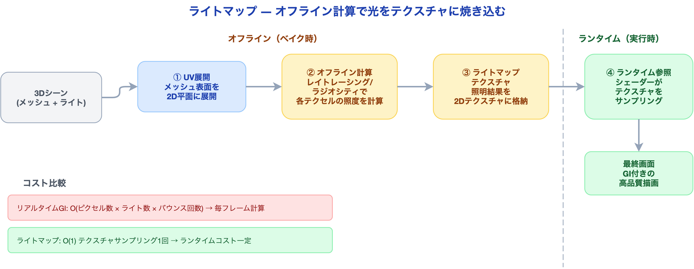
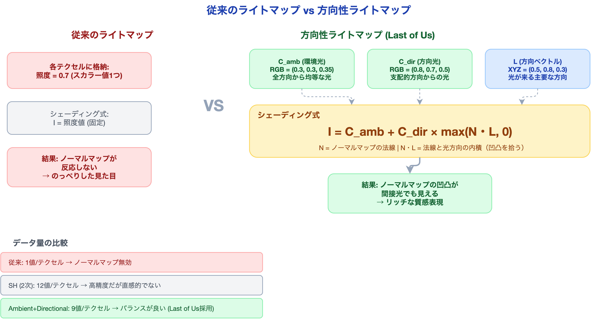
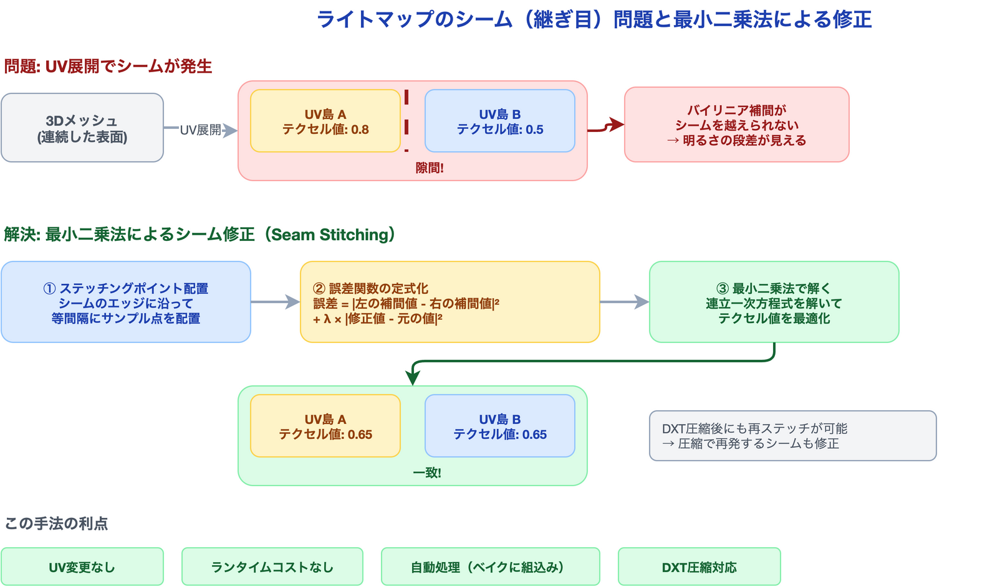

# ライティングとライトマップの技術 ― 静的な光で動的な世界を照らす

「ライトマップは古い技術だ」——そう思っていないだろうか。

リアルタイムレイトレーシングやLumenのような動的GI（グローバルイルミネーション）が注目を集める現在、ライトマップは「PS3時代の遺物」と見なされがちだ。しかし、2013年にNaughty Dogが『The Last of Us』で達成したAAAクオリティは、まさにライトマップ技術の極限だった。PS3という限られたハードウェアで、光が壁を伝い、凹凸のある表面に自然な陰影を落とす——その表現を支えたのが**方向性ライトマップ（Directional Lightmap）**と**シーム修正（Seam Stitching）**という2つの技術だ。

本記事では、SIGGRAPH 2013でMichal Iwanicki（Naughty Dog）が発表したライティング技術をベースに、ライトマップの基礎から応用まで「初学者でも追える粒度」で解説する。読み終えた後、あなたは「事前計算が古いのではなく、使い方が問われている」ことを理解できるようになる。

---

## ライトマップの基礎 ― 光を焼き込むという発想

### リアルタイム計算の限界

前回の記事で解説した通り、レンダリングパイプラインのライティング計算は**ピクセル数 x ライト数**に比例するコストが発生する。リアルタイムで間接光（GI）まで計算しようとすると、光の反射を何回も追跡する必要があり、コストは爆発的に増加する。

ここで発想を転換する。**シーンの中で動かないもの（静的オブジェクト）のライティングは、あらかじめ計算してテクスチャに保存しておけばよい**。

### ライトマップの仕組み

ライトマップとは、オフラインで計算したライティング結果を2Dテクスチャに焼き込み（ベイク）、ランタイムでそのテクスチャを参照するだけで照明を再現する技術だ。



具体的な流れは以下の通りだ。

1. **UV展開**: 3Dメッシュの表面を2D平面に展開する（ライトマップ専用のUV座標を用意する）
2. **オフライン計算**: レイトレーシングやラジオシティで、各テクセル（テクスチャのピクセル）が受ける光の量を計算する
3. **テクスチャに格納**: 計算結果をライトマップテクスチャとして保存する
4. **ランタイム参照**: シェーダーがライトマップをサンプリングし、サーフェスカラーに乗算する

### メリットとデメリット

| 項目 | リアルタイムライティング | ライトマップ |
|:---|:---|:---|
| GI表現 | コストが非常に高い | 事前計算で高品質なGIを表現可能 |
| ランタイムコスト | ライト数に比例して増加 | テクスチャサンプリング1回（一定） |
| 動的変更 | ライトの色・位置をいつでも変更可能 | 再ベイクが必要（数分〜数時間） |
| メモリ | 追加メモリ不要 | ライトマップテクスチャ分のメモリが必要 |
| 対応範囲 | すべてのオブジェクト | 静的オブジェクトのみ |

重要なのは、ライトマップは「全か無か」ではないという点だ。現代のゲームエンジンでは、**静的オブジェクトにはライトマップ、動的オブジェクトにはリアルタイムライティング**を組み合わせるのが標準的なアプローチだ。

---

## 方向性ライトマップ ― ノーマルマップを間接光で活かす

### 従来のライトマップの限界

従来のライトマップには致命的な問題がある。各テクセルに格納されるのは**1つの照度値（スカラー値）**だけだ。つまり「このテクセルにはこれだけの光が当たっている」という情報しかない。

これの何が問題なのか。ノーマルマップが機能しなくなるのだ。

ノーマルマップは表面の法線方向を変化させることで凹凸を表現する技術だ。リアルタイムライティングでは、光源の方向と法線の角度に応じてシェーディングが変わるため、凹凸がくっきり見える。しかし、ライトマップが「この場所の明るさは0.7」としか記録していなければ、法線がどちらを向いていようと同じ明るさになる。結果として、**表面がのっぺりとした見た目になる**。

### Last of Usのアプローチ: Ambient + Directional

Michal Iwanicki（Naughty Dog）はSIGGRAPH 2013で、この問題に対するエレガントな解決策を発表した。各テクセルに格納する情報を拡張し、以下の3つの要素を記録する。

| パラメータ | 意味 | データ型 |
|:---|:---|:---|
| **C_amb** | 環境光の色と強度 | RGB（3値） |
| **C_dir** | 支配的な方向からの光の色と強度 | RGB（3値） |
| **L** | 支配的な光の方向ベクトル | XYZ（3値） |



### シェーディング式

方向性ライトマップを使ったシェーディングは、以下の式で計算する。

```
I = C_amb + C_dir × max(N・L, 0)
```

- **I**: 最終的な照度（出力色）
- **C_amb**: 環境光成分（どの方向から見ても一定）
- **C_dir**: 方向光成分（方向に依存する光）
- **N**: サーフェスの法線ベクトル（ノーマルマップから取得）
- **L**: 支配的な光の方向ベクトル（ライトマップから取得）
- **N・L**: 法線と光方向の内積（-1〜1の値をとり、0以下はクランプ）

この式の意味を直感的に理解しよう。

1. **C_amb（環境光）** は全方向から均等に照らされる光だ。部屋の中の「なんとなく明るい」部分に相当する。
2. **C_dir × max(N・L, 0)** は特定の方向から来る光だ。N・Lが大きい（法線が光の方向を向いている）ほど明るく、小さい（背を向けている）ほど暗くなる。これがノーマルマップの凹凸を拾う。

### 球面調和関数からの変換

実際のベイク処理では、まず球面調和関数（SH: Spherical Harmonics）で各テクセルの入射光分布を記録する。SHはあらゆる方向からの光の分布を低次の関数で近似する数学的手法だ。

2次SH（L=1）は4つの係数で光の分布を表現する。

```
SH Band 0: c0         → 全方向の平均照度
SH Band 1: c1, c2, c3 → x, y, z 方向の偏り
```

ここからAmbient + Directional表現への変換は以下のように行う。

1. **方向Lの算出**: Band 1の係数ベクトル (c1, c2, c3) を正規化して支配的方向を得る
2. **C_dirの算出**: Band 1の係数の大きさから方向光の強度を算出する
3. **C_ambの算出**: Band 0の全方向平均から方向光成分を引いた残りが環境光となる

### なぜSHをそのまま使わないのか

SHをそのまま使えば、もっと正確な表現ができるのではないか？　その通りだが、以下の理由でAmbient + Directional表現が選ばれた。

| 比較項目 | SH（2次） | Ambient + Directional |
|:---|:---|:---|
| テクセルあたりのデータ量 | 12値（4係数 × RGB） | 9値（C_amb 3 + C_dir 3 + L 3） |
| アーティストの直感性 | 低い（SH係数は物理量に対応しない） | 高い（「どの方向から、どんな光」が直接見える） |
| フェイクスペキュラ | 追加処理が必要 | 方向Lを使って簡易的に可能 |
| 負の照度 | 発生しうる（リンギング） | 発生しない（clamp済み） |

特に「アーティストの直感性」は実制作において極めて重要だ。SHの係数をデバッグビューで確認しても何が起きているか分かりにくいが、「支配的な光の方向」と「環境光」は見た目から直感的に理解できる。

---

## ライトマップシーム修正 ― 見えない継ぎ目を消す

### 問題: UV展開が生むシーム（継ぎ目）

ライトマップのもう1つの課題は**シーム（継ぎ目）**だ。

3Dメッシュをライトマップ用に2Dに展開するとき、メッシュはUV空間で複数の「島（アイランド）」に分割される。この分割線（シーム）の両側では、テクスチャのテクセルが物理的に離れた場所に配置される。

なぜこれが問題なのか。テクスチャのフィルタリング（バイリニア補間）は、隣接するテクセルの値を混ぜて滑らかにする処理だ。しかし、シームの両側のテクセルはテクスチャ空間で隣接していないため、**別々のテクセルと補間されてしまう**。結果として、3D空間では連続しているはずの面に、明るさの段差が見える。



### 解決: 最小二乗法によるステッチング

Iwanickiが提案したシーム修正の手法は、数学的に洗練されたアプローチだ。

**基本的な考え方**: シームの両側で、補間された値が一致するようにテクセル値を調整する。ただし、元のライティング結果からの乖離は最小限に抑える。

#### ステップ1: ステッチングポイントの配置

シームのエッジに沿って等間隔にサンプル点（ステッチングポイント）を配置する。各ポイントには以下の情報がある。

- **3D空間での位置**: シームの左側と右側で同一（メッシュ上の同じ点）
- **UV空間での位置**: シームの左側と右側で異なる（別のテクセル群に属する）

#### ステップ2: 誤差関数の定式化

各ステッチングポイントで、左側と右側の補間値の差を誤差とする。

```
誤差 = Σ |左側の補間値(p_i) - 右側の補間値(p_i)|²
     + λ × Σ |修正後のテクセル値 - 元のテクセル値|²
```

第1項はシームの不連続性を最小化し、第2項は元のライティング結果からの乖離をペナルティとして課す。λ（ラムダ）はこの2つのバランスを調整する重みだ。

#### ステップ3: 最小二乗法で解く

この誤差関数を最小化する問題は、線形最小二乗法で解ける。つまり、連立一次方程式を解くだけでよい。テクセル数に対して線形の計算量で済むため、実用的な速度で処理できる。

### DXT圧縮後の再ステッチ

GPU向けのテクスチャは通常、DXT（BC）圧縮が適用される。この圧縮は4x4テクセルのブロック単位で行われるため、圧縮時に値が微妙に変化し、せっかく修正したシームが再び現れることがある。

Iwanickiはこの問題に対しても解決策を示している。DXT圧縮後にエンドポイント値に対して再度ステッチングを適用する。DXTの各ブロックは2つのエンドポイントカラーの補間で表現されるため、エンドポイントを調整するだけで圧縮後のシームも修正できる。

### この手法の優れた点

| 特性 | 効果 |
|:---|:---|
| UV変更なし | 既存のUV展開をそのまま使える。アーティストの作業をやり直す必要がない |
| ランタイムコストなし | テクスチャの値自体を修正するため、シェーダーに追加処理は不要 |
| 自動処理 | ベイクパイプラインに組み込むだけで自動的に適用される |
| 圧縮対応 | DXT圧縮後でも再ステッチが可能 |

---

## Unityでのライトマップ活用

ここまでの理論が、Unityではどのように実装されているかを確認しよう。

### Progressive Lightmapper

Unity 6では**Progressive Lightmapper**がライトマップのベイクを担当する。CPU版（Progressive CPU）とGPU版（Progressive GPU）の2つが選べる。

| 項目 | Progressive CPU | Progressive GPU |
|:---|:---|:---|
| 計算速度 | 遅い（CPUコア数に依存） | 速い（GPUの並列処理を活用） |
| メモリ制約 | システムRAMを使用 | VRAM容量に制限される |
| 対応OS | 全OS | Windows / macOS (Metal) |
| プレビュー | インクリメンタル更新 | インクリメンタル更新 |

設定場所は `Window > Rendering > Lighting` の `Lightmapping Settings` だ。

### Directional Mode

Unityのライトマップには2つのモードがある。

- **Non-Directional**: 各テクセルに照度値のみを格納する（従来方式）
- **Directional**: 各テクセルに照度＋支配的方向の情報を格納する（方向性ライトマップ）

Directionalモードを有効にすると、ライトマップのテクスチャが2枚になる。1枚目が色と強度、2枚目が方向情報だ。Last of Usの手法と同じ原理で、ノーマルマップが間接光に反応するようになる。

設定: `Lightmapping Settings > Directional Mode > Directional`

### ライトマップUVの注意点

ライトマップの品質はUV展開の品質に直結する。Unityでは以下の点に注意が必要だ。

1. **Generate Lightmap UVs**: メッシュのインポート設定で有効にすると、Unity が自動的にライトマップ用のUV（UV2）を生成する。手動でUV2を用意する場合はオフにする
2. **Pack Margin**: UV島の間に十分なマージンを確保する。マージンが小さいとブリーディング（隣接島のテクセルが漏れ込む）が発生する
3. **Lightmap Resolution**: テクセル密度（texels per unit）の設定。高すぎるとメモリを消費し、低すぎると光の境界がぼやける。一般的には10〜40 texels/unitが目安

### ライトプローブとの組み合わせ

静的オブジェクトはライトマップで照らし、動的オブジェクト（キャラクターなど）は**ライトプローブ（Light Probe）**で照らす。ライトプローブはシーン内の指定位置でSH係数をベイクし、動的オブジェクトが通過する際にその係数を補間してシェーディングに使用する。

```
静的オブジェクト → ライトマップ（テクスチャ参照）
動的オブジェクト → ライトプローブ（SH補間）
```

この組み合わせにより、シーン全体に一貫したGI表現を実現しつつ、動的オブジェクトも自然に溶け込む照明が得られる。

---

## まとめ ― 事前計算は「古い」のではなく「賢い」

本記事で解説した3つの技術を振り返ろう。

1. **ライトマップの基礎**: リアルタイム計算が高コストなGIを、オフラインで事前計算してテクスチャに焼き込む。ランタイムコストはテクスチャサンプリング1回のみ

2. **方向性ライトマップ**: 各テクセルにAmbient + Directional情報を格納することで、ノーマルマップが間接光でも凹凸を表現できる。Last of UsがPS3で実現したAAAクオリティの核心技術

3. **シーム修正**: UV展開で生じる継ぎ目を、最小二乗法で自動的に消す。UV変更なし、ランタイムコストなし、DXT圧縮後にも対応

リアルタイムGI技術（Lumen、RTGI、SSGI）が進化する現在でも、ライトマップの重要性は変わっていない。モバイルやVRではGPU予算が限られるため、事前計算は依然として最も効率的なGI表現手段だ。そして、AAA開発においても、リアルタイムGIとライトマップのハイブリッド構成が標準的なアプローチとなっている。

**事前計算は「古い」のではなく「賢い」**。リアルタイムと事前計算の適切な組み合わせこそが、限られたGPU予算で最大の視覚品質を引き出す現代の正解だ。

---

## 参考情報

| 項目 | 内容 |
|:---|:---|
| 発表 | SIGGRAPH 2013 "Lighting Technology of The Last of Us" |
| 発表者 | Michal Iwanicki, Naughty Dog |
| 対象タイトル | The Last of Us (PS3, 2013) |
| Unity公式 | [Lightmapping](https://docs.unity3d.com/Manual/Lightmappers.html) |
| シリーズ前回 | [レンダリングパイプラインの全体像](x_post_rendering_pipeline.md) |

---

*本記事は [UniMCP4CC](https://github.com/dsgarage/UniMCP4CC) プロジェクトの技術知見を基に執筆しています。Unity × Claude Code でのゲーム開発に興味がある方はぜひご覧ください。*
