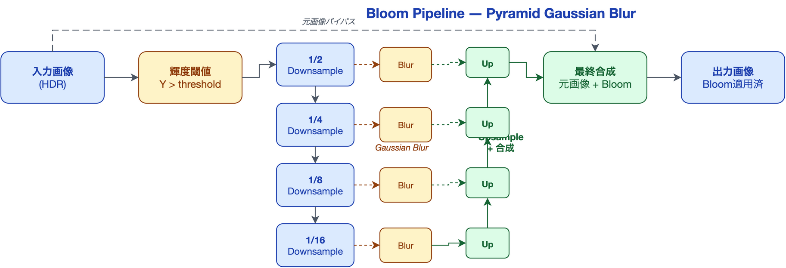
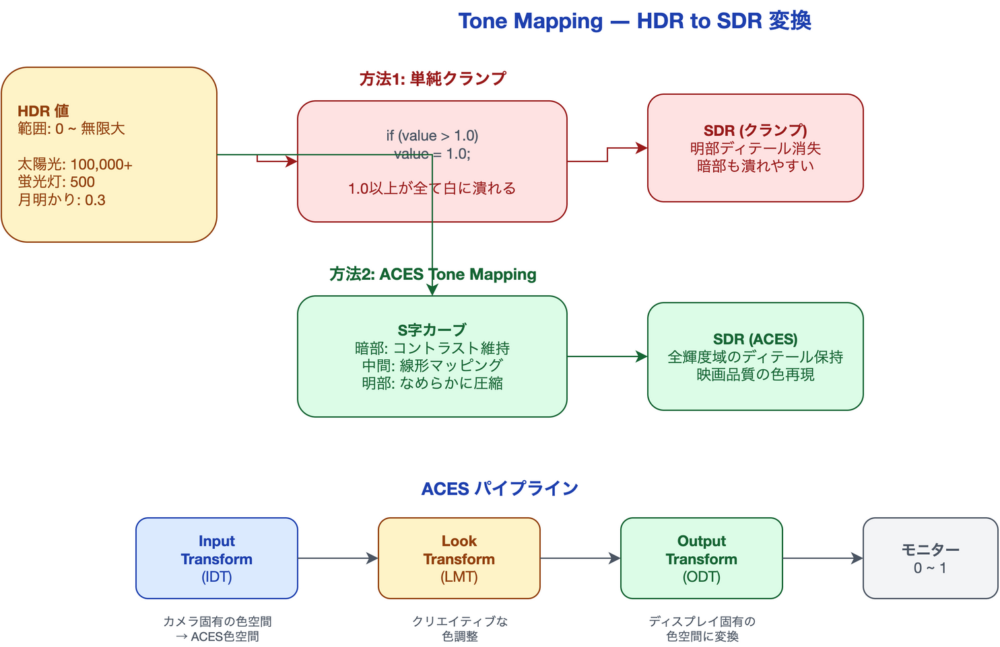
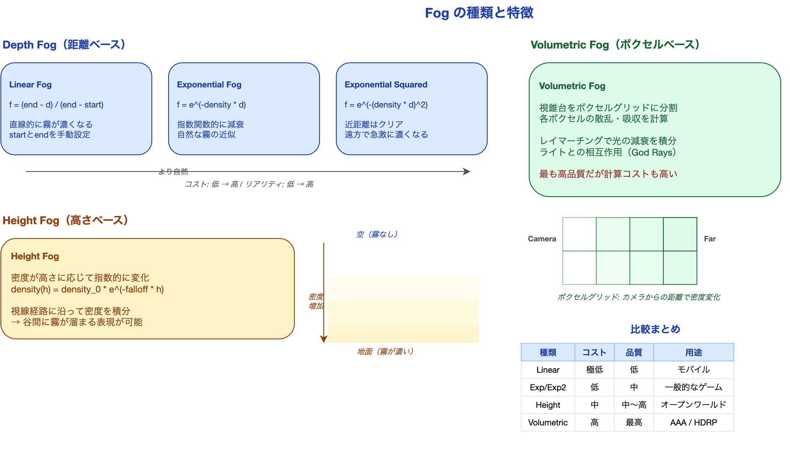

# ポストプロセスで画をつくる ― Bloom・Tone Mapping・Color Grading

ゲームのスクリーンショットを撮って、「なぜか自分のプロジェクトは同じアセットを使っているのにAAAタイトルほど綺麗に見えない」と感じたことはないだろうか。ライティングもマテリアルも整えたはずなのに、画面全体が「素材感」から抜け出せない。

その原因の大半は、ポストプロセスにある。試しにUnityのVolume設定でBloom、Tone Mapping、Color Gradingをすべて無効にしてみてほしい。画面は途端に「ゲーム画面」から「CG素材」に退化する。AAAタイトルの最終画像の仕上がりは、その50%以上がポストプロセスによって決まっている。

本記事では、GAMES104の講義資料をベースに、ポストプロセスの主要技術を「なぜそうなるのか」という物理的・知覚的な根拠から解説する。読み終えた後、あなたはBloomの閾値やTone Mappingのカーブを**根拠を持って設定できる**ようになる。

---

## Bloom ― 光のにじみの物理学

### なぜ光はにじむのか: Airy Disk理論

現実世界では、明るい光源を見るとその周囲に光のにじみ（グレア）が発生する。これは単にカメラや目の「不具合」ではない。物理的に避けられない現象だ。

光が円形の開口部（レンズの絞り）を通過すると、**回折**によって焦点は完璧な1点には集まらない。理想的なレンズであっても、焦点にはAiry Disk（エアリーディスク）と呼ばれる同心円状のパターンが形成される。これがBloomの物理的根拠だ。

人間の目も同じ原理で動作する。瞳孔という円形の開口部を通して光を取り込むため、明るい光源は必ずにじんで見える。ゲームでBloomを適用するのは「エフェクトを足す」のではなく、**人間の視覚体験を再現する**行為なのだ。

### Bloomの実装フロー

Bloomの処理は、概念的には以下の3ステップで構成される。



**ステップ1: ブライト領域の検出**

まず、画面内の「光っている部分」を抽出する。具体的には、各ピクセルの輝度を計算し、閾値を超えたピクセルだけを残す。

輝度の計算には、人間の目の感度特性を反映したsRGB標準の加重平均を使う。

```
Y = 0.2126 × R + 0.7152 × G + 0.0722 × B
```

緑の係数が最も大きいのは、人間の目が緑に最も敏感だからだ。この係数はCIE（国際照明委員会）が定めた標準規格に基づいている。

**ステップ2: ガウシアンブラーで光を拡散**

抽出したブライト領域に対して、ガウシアンブラー（ぼかし）を適用する。これがBloomの「にじみ」を作る工程だ。

ここで重要な最適化がある。ナイーブな5x5ガウシアンカーネルは25回のテクスチャサンプリングが必要だが、ガウシアン関数は**線形分離可能**という性質を持つ。

```
2Dガウシアン G(x, y) = G(x) × G(y)
```

この性質を利用すると、5x5の2Dフィルタを「水平5タップ + 垂直5タップ」の2パスに分離でき、サンプリング回数は**25回 → 10回**に削減される。計算量は O(n^2) から O(2n) に改善される。

**ステップ3: Pyramid Gaussian Blur ― 多段階のにじみ合成**

現実の光のにじみは、単一のぼかし半径では再現できない。強い光源は数百ピクセルにわたってにじむが、弱い光源のにじみは小さい。これを効率的に実現するのがPyramid Gaussian Blurだ。

1. 元画像を**段階的にダウンサンプリング**（1/2 → 1/4 → 1/8 → 1/16）
2. 各解像度でガウシアンブラーを適用（低解像度ほど広範囲のにじみに対応）
3. ブラー結果を**アップサンプリングしながら合成**
4. 最終的に元画像と合成

この手法の利点は、各レベルで同じサイズのカーネル（例: 5x5）を使いながら、実効的なぼかし範囲を指数的に拡大できることだ。1/16解像度での5x5ブラーは、元解像度での80x80ブラーに相当する——計算コストは25サンプルのままで。

---

## Tone Mapping ― HDRをSDRに変換する

### 問題: 無限の明るさを有限の画面に収める

ゲームエンジン内部の計算は**HDR（High Dynamic Range）**で行われる。太陽光の輝度値は100,000を超え、蛍光灯は500、月明かりは0.3——現実世界の明るさの範囲は事実上無限大だ。

しかし、プレイヤーのモニターは**SDR（Standard Dynamic Range）**で、表現できる値は0.0〜1.0の範囲しかない。HDRの値をSDRに変換しなければ、画面に表示できない。



### なぜ単純なクランプではダメか

最も単純な方法は、1.0を超える値をすべて1.0に切り捨てる（クランプする）ことだ。

```
// 単純クランプ
color = min(color, 1.0);
```

しかし、これでは太陽も蛍光灯も同じ「真っ白」になる。1.0以上の輝度情報がすべて失われ、明るい部分のディテールが完全に潰れる。夕焼けのグラデーション、爆発のコア部分と外縁の差、金属の反射ハイライトの階調——これらがすべて均一な白になってしまう。

暗部にも同じ問題が起きる。0に近い値は相対的に見ても暗すぎて、影の中のディテールが黒に潰れる。

### ACES ― 映画業界が作った標準

この問題を解決するのが**トーンマッピング**だ。HDRの値をSDRの範囲にマッピングする際に、S字カーブ（シグモイドカーブ）を使って明暗のディテールを保存する。

現在のゲームエンジンで最も広く採用されているトーンマッピングが**ACES（Academy Color Encoding System）**だ。ACESはアカデミー（米国映画芸術科学アカデミー）が策定した色管理の業界標準で、ハリウッド映画の大半がこの規格で制作されている。

ACESのトーンマッピングカーブは以下の特徴を持つ。

| 輝度域 | 処理 | 効果 |
|:---|:---|:---|
| 暗部（トー） | コントラストを維持 | 影の中のディテールが見える |
| 中間域 | ほぼ線形にマッピング | 自然な色再現 |
| 明部（ショルダー） | なめらかに圧縮 | ハイライトのグラデーションが保存される |

ゲーム内でよく使われるACESの近似式（Krzysztof Narkowicz, 2015）は以下の通りだ。

```hlsl
float3 ACESFilm(float3 x)
{
    float a = 2.51f;
    float b = 0.03f;
    float c = 2.43f;
    float d = 0.59f;
    float e = 0.14f;
    return saturate((x * (a * x + b)) / (x * (c * x + d) + e));
}
```

この数行のコードが、HDRの全輝度範囲をSDRの0〜1に映画品質でマッピングする。

### ACESパイプラインの3段構成

完全なACESパイプラインは3つのTransformで構成される。

1. **Input Device Transform（IDT）**: カメラ固有の色空間からACES色空間（AP0/AP1）に変換
2. **Look Modification Transform（LMT）**: クリエイティブな色調整（コントラスト、彩度など）を適用
3. **Output Device Transform（ODT）**: ACES色空間からディスプレイ固有の色空間（sRGB、Rec.709など）に変換

この設計の要点は、中間のLMTで行った色調整が**出力デバイスに依存しない**ことだ。同じLMTを使えば、SDRモニターでもHDRテレビでも、視覚的に一貫した見た目が得られる。

### HDR/SDR両対応の実際

現代のゲームはSDRとHDRの両方のディスプレイに対応する必要がある。ACESの設計が優れている理由は、この両対応を**ODTの切り替えだけで実現できる**点にある。

| 要件 | ACESの解決策 |
|:---|:---|
| 視覚的一貫性 | LMTが出力デバイスに依存しない |
| 高品質 | 映画業界で実証済みのカーブ |
| 高性能 | 近似式なら1回のシェーダー呼び出しで完了 |
| 最小オーバーヘッド | ODT切り替えのみで対応可能 |

---

## Color Grading ― LUTで世界の色を変える

### 3D LUT: 色変換のルックアップテーブル

Color Grading（カラーグレーディング）は、トーンマッピング後の画像に対して最終的な色調整を行う工程だ。GAMES104の講義では、これを**「最も費用対効果の高いポストプロセス機能」**と評価している。

その仕組みは驚くほどシンプルだ。入力のRGB値から出力のRGB値への変換を、**3D LUT（Look-Up Table）**として事前計算しておく。

3D LUTは立方体のボリュームテクスチャで、各軸がR・G・Bに対応する。例えば32x32x32のLUTなら、32,768通りの色変換が格納されている。ピクセルのRGB値をインデックスとしてテーブルを引くだけで、複雑な色変換が**1回のテクスチャフェッチ**で完了する。

### 2D LUTスライス: 実装上の工夫

3Dテクスチャはハードウェアによってはサポートが限定的なため、実際の実装ではB（青）軸でスライスして2Dテクスチャに格納することが多い。

例えば32x32x32の3D LUTは、32枚の32x32スライスを横に並べた**1024x32の2Dテクスチャ**として格納できる。各スライスはB値の異なるR-G平面を表す。

```
B = 0      B = 1      B = 2           B = 31
[R×G平面] [R×G平面] [R×G平面] ... [R×G平面]
← 1024px →
```

ルックアップ時は、ピクセルのB値から2枚のスライスを特定し、その間を線形補間する。

### 一瞬でムードを変える

Color Gradingの最大の魅力は、**LUTを差し替えるだけでゲーム全体の色調が変わる**ことだ。

| プリセット | 効果 | 用途 |
|:---|:---|:---|
| ティール＆オレンジ | 暗部を青緑、明部をオレンジに寄せる | 映画的な画作り |
| ブリーチバイパス | 彩度を下げてコントラストを上げる | ホラー、戦争表現 |
| クロスプロセス | 補色方向にシフト | レトロ・夢のシーン |
| ナイトビジョン | 全体を緑にシフト | 暗視装置の表現 |

これらの変換はすべて、1枚のLUTテクスチャのフェッチで実現できる。コストはほぼゼロでありながら、画面の印象を劇的に変える。「最も費用対効果が高い」という評価は的確だ。

---

## Fog ― 大気で空間を表現する

現実世界で遠くの山が青白く見えるのは、大気中の微粒子が光を散乱するからだ。Fog（霧）のレンダリングは、この大気散乱をシミュレーションする技術であり、ポストプロセスの一部として処理されることが多い。



### Depth Fog: 距離に基づく3つの関数

最もシンプルなFogは、カメラからの距離に応じてフォグカラーをブレンドする方式だ。距離 d に対するフォグ係数 f の計算には3つのバリエーションがある。

**Linear Fog**

```
f = (end - d) / (end - start)
```

startからendまで直線的にフォグが濃くなる。計算コストは最も低いが、自然界のフォグは直線的には減衰しないため、やや人工的に見える。

**Exponential Fog**

```
f = e^(-density × d)
```

指数関数的に減衰する。密度パラメータ1つで制御でき、自然なフォグの近似としてバランスが良い。

**Exponential Squared Fog**

```
f = e^(-(density × d)^2)
```

近距離ではほぼクリアで、遠方で急激にフォグが濃くなる。3つの中で最も自然な見た目を実現できるが、計算コストはわずかに高い。

### Height Fog: 高さベースの密度積分

Depth Fogは「距離だけ」でフォグを計算するため、山の頂上も谷底も同じ濃さになってしまう。現実の霧は重力の影響で低い場所に溜まる。これを再現するのがHeight Fogだ。

Height Fogでは、フォグの密度が高さに応じて指数的に変化する。

```
density(h) = density_0 × e^(-falloff × h)
```

カメラからオブジェクトまでの視線経路に沿って、この密度関数を積分する。結果として、谷間は濃い霧に包まれ、山の頂上は晴れた状態になる。オープンワールドゲームで広大な風景に奥行き感を出すには不可欠な技術だ。

### Volumetric Fog: 体積レンダリング

最も高品質なFog表現がVolumetric Fog（ボリュメトリックフォグ）だ。カメラの視錐台をボクセル（3Dピクセル）のグリッドに分割し、各ボクセルでの光の散乱と吸収を物理的に計算する。

処理フローは以下の通りだ。

1. 視錐台をボクセルグリッドに分割（例: 160x90x128）
2. 各ボクセルのフォグ密度と散乱係数を計算
3. 各光源からの寄与を計算（シャドウマップとの統合）
4. カメラからレイマーチングで光の減衰を積分

Volumetric Fogの最大の特徴は、**光源との相互作用**を物理的にシミュレーションできることだ。窓から差し込む光が霧の中で光の柱（God Rays / Light Shaft）として可視化される表現は、Volumetric Fogなしでは実現できない。

計算コストは高いが、HDRPのような高品質パイプラインではデフォルトで有効化されている。

---

## Unityでの実践

### Volume Systemの基本

Unity URP/HDRPでは、ポストプロセスは**Volume System**で管理される。Volumeコンポーネントを持つGameObjectをシーンに配置し、その中にOverrideを追加する構成だ。

```csharp
// スクリプトからVolumeを制御する例
using UnityEngine;
using UnityEngine.Rendering;
using UnityEngine.Rendering.Universal; // URPの場合

public class PostProcessController : MonoBehaviour
{
    [SerializeField] private Volume volume;

    void Start()
    {
        // BloomのIntensityを動的に変更
        if (volume.profile.TryGet<Bloom>(out var bloom))
        {
            bloom.intensity.value = 1.5f;
            bloom.threshold.value = 0.9f;
        }

        // Tone Mappingモードを切り替え
        if (volume.profile.TryGet<Tonemapping>(out var tonemap))
        {
            tonemap.mode.value = TonemappingMode.ACES;
        }
    }
}
```

### Bloom設定のベストプラクティス

| パラメータ | 推奨値 | 理由 |
|:---|:---|:---|
| Threshold | 0.9〜1.2 | 低すぎると画面全体が白っぽくなる。HDR値の明るい部分だけがBloomの対象になるよう調整する |
| Intensity | 0.5〜2.0 | 物理的な光のにじみは控えめ。過剰なBloomは「古いゲーム」に見える |
| Scatter | 0.6〜0.7（URP） | にじみの広がり具合。高すぎるとソフトフォーカスのように全体がぼける |
| High Quality Filtering | ON | ダウンサンプリング時のフリッカー（ちらつき）を抑制 |

### Tone Mapping: Neutral vs ACES

Unityでは主に2つのトーンマッピングモードが選択できる。

| モード | 特徴 | 適したジャンル |
|:---|:---|:---|
| **Neutral** | 色の偏りが少ない。原色を忠実に再現 | UI重視のゲーム、パズル、教育系 |
| **ACES** | 暖色寄り、コントラスト高め。映画的な画 | アクション、RPG、オープンワールド |

ACESは彩度とコントラストを自動的に引き上げるため、UIの色が意図と異なって見えることがある。UIレイヤーはトーンマッピング後に合成するか、UI用のカラー補正を入れることを推奨する。

### Color Grading LUTの作成手順

1. Unityでゲーム画面のスクリーンショットを撮影
2. Adobe Photoshop / DaVinci Resolveなどで色調補正を行う
3. **ニュートラルLUT画像**（Unity提供のテンプレート）に同じ色調補正を適用
4. 補正済みLUTをUnityにインポート
5. Color LookupのLUT Textureに設定

この手順で、Photoshopで「いい感じ」に調整した色味を、リアルタイムでゲーム全体に適用できる。

---

## まとめ

| 技術 | 本質 | 要点 |
|:---|:---|:---|
| **Bloom** | 光学現象の再現 | Airy Diskに基づく物理的なにじみ。Pyramid Gaussian Blurで効率的に実装 |
| **Tone Mapping** | 知覚科学の応用 | HDR→SDR変換。ACESのS字カーブが明暗のディテールを保存する |
| **Color Grading** | ルックアップテーブル | 1回のテクスチャフェッチで劇的な色変換。最も費用対効果が高い |
| **Fog** | 大気散乱のシミュレーション | Depth→Height→Volumetricと精度が上がり、光との相互作用も再現可能に |

ポストプロセスは「飾り」ではない。Bloomは光学現象、Tone Mappingは知覚科学、Fogは大気物理学——それぞれが物理的・科学的な根拠を持つ**シミュレーション**だ。

これらの仕組みを理解することで、パラメータを「なんとなく」調整するのではなく、「この閾値はこの物理現象を再現するためにこの値が適切だ」と根拠を持って設定できるようになる。

---

## シリーズ一覧

本記事は「ゲームエンジンのレンダリング技術」シリーズの第5回です。

| 回 | テーマ |
|:---|:---|
| 第1回 | レンダリングパイプラインの全体像 |
| 第2回 | ライティングとライトマップの技術 |
| 第3回 | シャドウとアンビエントオクルージョン |
| 第4回 | アンチエイリアシング完全ガイド |
| **第5回（本記事）** | ポストプロセスで画をつくる |

---

## 参考情報

| 資料 | 著者/出典 | 内容 |
|:---|:---|:---|
| GAMES104 Lecture 07: Rendering on Game Engine | Wang Xi | ポストプロセス・Fog の包括的講義（Page 16-19, 34-51） |
| ACES Central | Academy of Motion Picture Arts and Sciences | ACES 公式ドキュメント |
| Tone Mapping (Krzysztof Narkowicz, 2015) | Narkowicz | ACES Filmic 近似式の解説 |
| Real-Time Rendering, 4th Edition | Akenine-Moller et al. | ポストプロセス全般の教科書 |

---

*本記事は [UniMCP4CC](https://github.com/dsgarage/UniMCP4CC) プロジェクトの技術知見を基に執筆しています。Unity × Claude Code でのゲーム開発に興味がある方はぜひご覧ください。*
