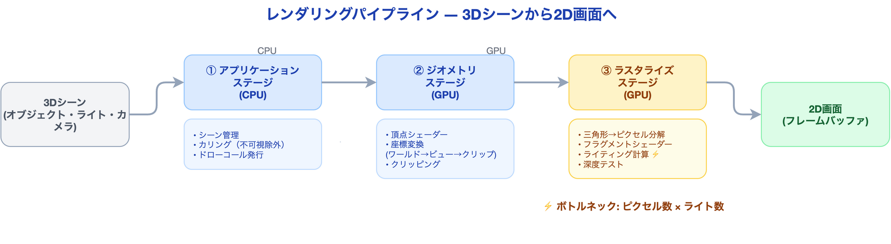
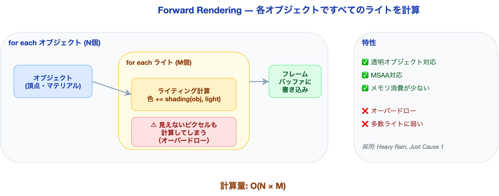
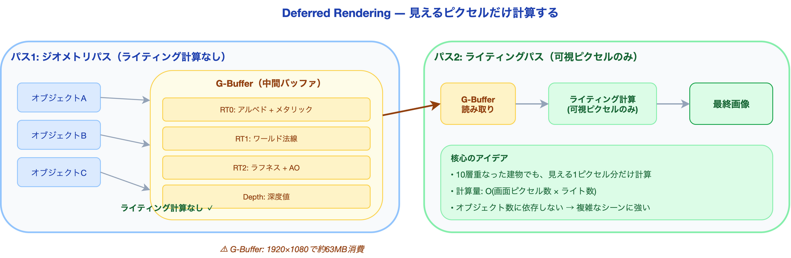
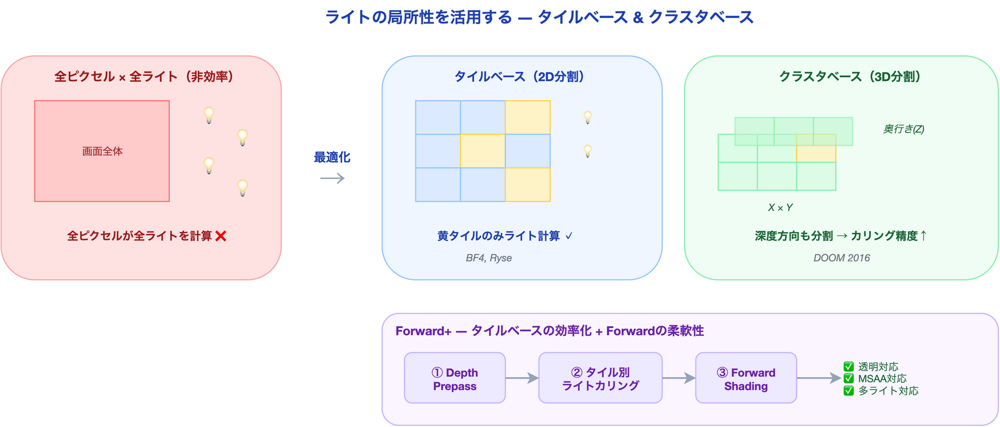
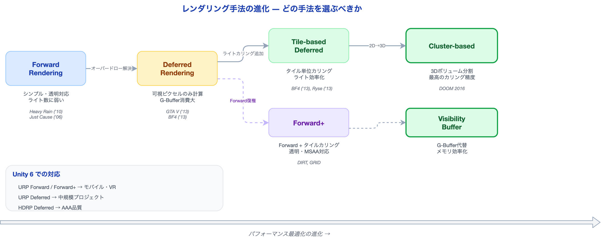

# レンダリングパイプラインの全体像 ― 1ピクセルの色が決まるまで

ゲームの画面を見たとき、「この1ピクセルの色は、どうやって決まったのか？」と考えたことがあるだろうか。キャラクターの肌の色、背景の空のグラデーション、武器の金属光沢——これらはすべて、レンダリングパイプラインという仕組みが1ピクセルずつ計算した結果だ。

Unreal Engine 5のNaniteが話題になり、Unityもデファードレンダリングを標準にした現在、「Forward」「Deferred」「Forward+」という言葉を聞いたことがある人は多いだろう。しかし、それぞれが**何を、なぜ、どう変えたのか**を体系的に理解している人は意外と少ない。

本記事では、GAMES104（中国トップのゲームエンジン教育プログラム）の講義資料をベースに、レンダリングパイプラインの進化を「初学者でも追える粒度」で解説する。読み終えた後、あなたはプロジェクトに最適なレンダリング手法を**根拠を持って選べる**ようになる。

---

## そもそもレンダリングパイプラインとは何か

### 3Dシーンから2D画面への変換

ゲームエンジンが画面を描画するとは、つまり「3D空間に配置されたオブジェクトを、カメラから見た2D画像に変換する」ことだ。この変換プロセス全体をレンダリングパイプラインと呼ぶ。

大まかな流れは以下の通りだ。



1. **アプリケーションステージ**: CPUがシーンのオブジェクトを整理し、描画対象を選別（カリング）する
2. **ジオメトリステージ**: 頂点の座標変換（ワールド → ビュー → クリップ空間）を行う
3. **ラスタライズステージ**: 三角形をピクセルに分解し、各ピクセルの色を計算する

問題はステップ3だ。各ピクセルの色を決めるには**ライティング計算**が必要で、この計算コストがゲーム全体のパフォーマンスを左右する。

### ライティング計算の本質

1ピクセルの色を決める計算は、概念的には以下の式で表現できる。

```
最終色 = Σ (各ライトからの寄与)
       = Σ (マテリアル × ライト色 × 減衰 × 影の有無)
```

ここで重要なのは、**ピクセル数 × ライト数**の組み合わせだけ計算が必要だということだ。1920×1080の画面に100個のライトがあれば、理論上は約2億回のライティング計算が発生する。

この「ピクセル × ライト」の爆発的な組み合わせをどう効率化するか——これがレンダリングパイプラインの設計思想を分ける根本的な問いである。

---

## Forward Rendering ― 愚直だが確実な方法

### 仕組み

最も直感的なアプローチが Forward Rendering だ。各オブジェクトを描画するとき、そのオブジェクトに影響するすべてのライトを同時に計算する。



```
for each オブジェクト:
    for each ライト:
        色 += シェーディング(オブジェクト, ライト)
    画面に書き込み
```

処理の計算量は **O(オブジェクト数 × ライト数)** となる。

### メリット

- **実装がシンプル**: パイプラインの構造が直感的で理解しやすい
- **透明オブジェクトに対応**: 半透明の描画が自然にできる（奥から手前の順に描画すればよい）
- **MSAA（マルチサンプルアンチエイリアシング）と相性が良い**: ハードウェアAAがそのまま使える
- **メモリ消費が少ない**: G-Bufferのような中間バッファが不要

### 問題点

**オーバードロー（過描画）** が最大の敵だ。画面の同じピクセルに複数のオブジェクトが重なる場合、手前のオブジェクトだけが最終的に見えるにもかかわらず、奥のオブジェクトのライティングも計算してしまう。

例えば、街の風景で建物が10層に重なる場所では、最終的に見える1ピクセルのために10回分のライティング計算が無駄になる。ライトが100個あれば、1ピクセルあたり1000回の無駄な計算だ。

### 採用事例

- **Heavy Rain** (2010) — 限定的なライト数で映画的表現を実現
- **Just Cause 1** (2006) — 屋外シーンで遠距離ライトを削減

Forward Renderingは、**ライト数が限定的で、透明オブジェクトが多いシーン**に適している。

---

## Deferred Rendering ― 「見えるピクセルだけ計算する」発想

### オーバードローの解決

Forward Renderingの無駄を根本から解消するのが Deferred Rendering（遅延レンダリング）だ。核心のアイデアは単純だ。**ライティング計算を「後回し」にする**。



### 2パス構成

**パス1: ジオメトリパス（G-Buffer生成）**

まず、すべてのオブジェクトを描画するが、**ライティング計算はしない**。代わりに、各ピクセルの「材料情報」を中間バッファ（G-Buffer）に書き込む。

G-Bufferに格納される情報:

| バッファ | 内容 | 用途 |
|:---|:---|:---|
| RT0 | アルベド（基本色）+ メタリック | 表面の色と金属度 |
| RT1 | ワールド法線 | 面の向き |
| RT2 | ラフネス + AO | 表面の粗さと環境遮蔽 |
| Depth | 深度値 | カメラからの距離 |

**パス2: ライティングパス**

G-Bufferから情報を読み取り、**最終的に画面に見えるピクセルだけ**にライティング計算を行う。

```
パス1: for each オブジェクト:
           G-Bufferに材料情報を書き込み（ライティングなし）

パス2: for each ピクセル:       ← 画面の可視ピクセルのみ
           for each ライト:
               色 += シェーディング(G-Bufferのデータ, ライト)
```

計算量は **O(画面ピクセル数 × ライト数)** となり、オブジェクト数に依存しなくなる。10層に重なった建物があっても、最終的に見える1ピクセル分だけ計算すれば済む。

### メリット

- **多数のライトを効率的に処理**: 可視ピクセルのみにライティングするため、ライト数が増えても性能劣化が少ない
- **G-Bufferの再利用**: 法線や深度をSSAO、SSR（スクリーンスペース反射）などのポストプロセスで活用できる

### 問題点

1. **メモリ消費が大きい**: 1920×1080で32bit×4チャンネルのG-Bufferは約63MBを消費する
2. **透明オブジェクトが描画できない**: G-Bufferは1ピクセルに1つの情報しか格納できないため、半透明の重なりを表現できない。透明オブジェクトは別途Forward Renderingで描画する必要がある
3. **MSAAとの相性が悪い**: G-Bufferのマルチサンプリングはメモリコストが4倍になる
4. **マテリアルの自由度が制限される**: G-Bufferのフォーマットが固定されるため、特殊なシェーディングモデルの追加が難しい

### 採用事例

- **Battlefield 4** — 大規模な屋内外シーンで数百のダイナミックライトを使用
- **GTA V** — 都市環境の無数の光源を効率的に処理

---

## タイルベースとクラスタベース ― さらなる最適化

### 問題: ライトの影響範囲

Deferred Renderingでも、すべてのピクセルに対してすべてのライトを計算するのは無駄だ。ポイントライトの光は距離とともに減衰するため、画面全体に影響するライトはほとんどない。

この「ライトの局所性」を活用するのが、タイルベースとクラスタベースのアプローチだ。

### Tile-based Deferred Rendering



画面を小さなタイル（例: 16×16ピクセル）に分割し、各タイルに影響するライトだけをリストアップする。

```
1. G-Bufferを生成（通常のDeferred同様）
2. 画面をタイルに分割
3. 各タイルの深度範囲を計算（最小/最大深度）
4. 各タイルに影響するライトをカリング → ライトリスト生成
5. 各タイルのピクセルは、そのタイルのライトリストだけで計算
```

タイル内のライト数が大幅に削減されるため、大規模シーンでの性能が向上する。Battlefield 4やRyseが採用した手法だ。

### Forward+ (Tile-based Forward Rendering)

Deferred Renderingの弱点（透明オブジェクト、MSAA）を避けつつ、タイルベースの効率化を取り入れたのが Forward+ だ。

```
1. Depth Prepass: 先に深度だけ描画（過描画を防ぐ）
2. Tiled Light Culling: タイルごとにライトリストを生成
3. Forward Shading: 各オブジェクトを描画するとき、タイルのライトリストを参照
```

Forward Renderingの利点（透明対応、MSAA対応、マテリアルの自由度）を保ちつつ、ライトカリングの恩恵を受けられる。DIRTやGRIDなどのレーシングゲームが採用している。

### Cluster-based Rendering

タイルベースの発展形として、画面を2Dタイルではなく**3Dボリューム（クラスタ）** に分割する手法がある。深度方向も考慮するため、奥行きのあるシーンでのライトカリング精度が向上する。

DOOM (2016) がこの手法を採用し、大量の動的ライトを高速に処理した。

---

## 比較: どの手法を選ぶべきか



| 特性 | Forward | Deferred | Tile-based Deferred | Forward+ | Cluster-based |
|:---|:---|:---|:---|:---|:---|
| **ライト数** | 少数向き | 多数OK | 多数OK | 多数OK | 多数OK |
| **オーバードロー** | 問題あり | 解決 | 解決 | Depth Prepassで軽減 | Depth Prepassで軽減 |
| **透明オブジェクト** | 対応 | 非対応 | 非対応 | 対応 | 対応 |
| **MSAA** | 対応 | 高コスト | 高コスト | 対応 | 対応 |
| **メモリ消費** | 低い | 高い（G-Buffer） | 高い（G-Buffer） | 低い | 低い |
| **マテリアル自由度** | 高い | 制限あり | 制限あり | 高い | 高い |
| **GPU帯域** | 低い | 高い | 中程度 | 低い | 低い |

### Unityエンジニア向けの選択指針

Unity 6（URP/HDRP）でのレンダリングパス選択に直接対応させると:

| シナリオ | 推奨パイプライン | Unity での設定 |
|:---|:---|:---|
| モバイル・VR（ライト数少、透明多） | Forward / Forward+ | URP Forward / Forward+ |
| 屋内シーン（ライト数多、反射多） | Deferred | URP Deferred / HDRP |
| AAA品質（SSAO、SSR、多数ライト） | Deferred | HDRP Deferred |
| スタイライズド（特殊シェーダー多） | Forward+ | URP Forward+ |

---

## 現場での実装: 『The Last of Us』の教訓

ここまでの理論を、実際のAAAタイトルの視点で補強しよう。

Naughty Dogの『The Last of Us』（2013）はPS3で動作するタイトルだった。PS3のGPU（RSX）は現代のGPUと比べると極めて非力で、Deferred Renderingをフルに使う余裕はなかった。

彼らが選んだのは、**事前計算ライトマップ + リアルタイム動的シャドウ**というハイブリッド戦略だ。

- 静的な環境照明はオフラインでライトマップに焼き込む（Forward的アプローチ）
- 動的キャラクターのシャドウだけリアルタイムで計算する
- PS3のCell SPU 6基を並列に使い、影の計算を分散処理

処理時間はキャラクター4〜5体で6〜7ms。PS3世代でこの品質を実現できたのは、「すべてをリアルタイムで計算する」のではなく、「何を事前計算し、何をリアルタイムにするか」を慎重に切り分けたからだ。

この教訓は現代でも有効だ。**パイプラインの選択は「最新だから良い」ではなく、「プロジェクトの制約に最も適合するか」で決まる。**

> 次回の記事では、Last of Usが採用した「方向性ライトマップ」の仕組みと、ライトマップの継ぎ目問題をどう解決したかを深掘りする。

---

## まとめ

| 観点 | 要点 |
|:---|:---|
| 本質 | レンダリングパイプラインの設計は「ピクセル × ライト」の計算量をどう管理するかに帰結する |
| 進化 | Forward → Deferred → タイル/クラスタと進化したが、Forward系も Forward+ として復権している |
| 選択基準 | ライト数、透明オブジェクト、メモリ制約、マテリアルの自由度の4軸で判断する |
| 実践 | 『The Last of Us』が示すように、最適解は「すべてリアルタイム」ではなく、事前計算とリアルタイムの適切な組み合わせにある |

---

## シリーズ予告

本記事は「ゲームエンジンのレンダリング技術」シリーズの第1回です。

| 回 | テーマ |
|:---|:---|
| **第1回（本記事）** | レンダリングパイプラインの全体像 |
| 第2回 | ライティングとライトマップの技術 |
| 第3回 | シャドウとアンビエントオクルージョン |
| 第4回 | アンチエイリアシング完全ガイド |
| 第5回 | ポストプロセスで画をつくる |

---

## 参考情報

| 資料 | 著者/出典 | 内容 |
|:---|:---|:---|
| GAMES104 Lecture 07: Rendering on Game Engine | Wang Xi | レンダリングパイプラインの包括的講義 |
| Lighting Technology of "The Last Of Us" | Michal Iwanicki, Naughty Dog | SIGGRAPH 2013, ライトマップ技術 |
| Real-Time Rendering, 4th Edition | Akenine-Möller et al. | レンダリング技術の教科書 |

---

*本記事は [UniMCP4CC](https://github.com/dsgarage/UniMCP4CC) プロジェクトの技術知見を基に執筆しています。Unity × Claude Code でのゲーム開発に興味がある方はぜひご覧ください。*
