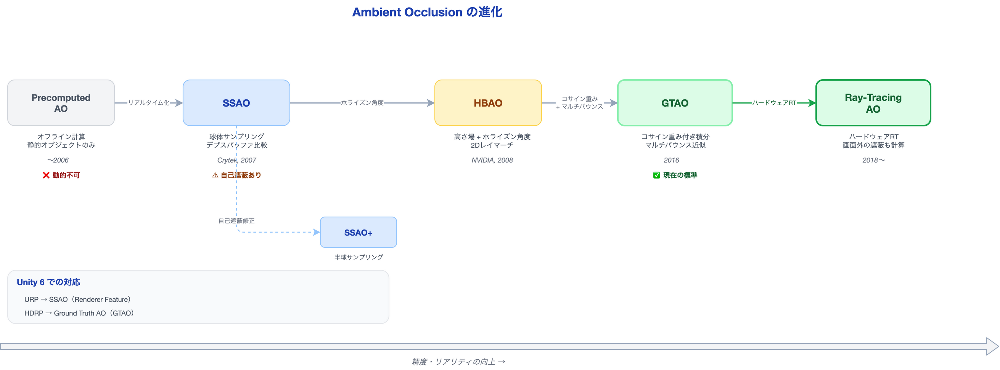
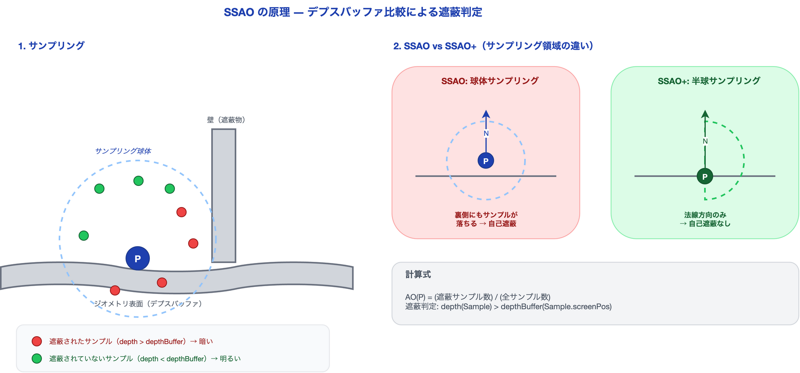
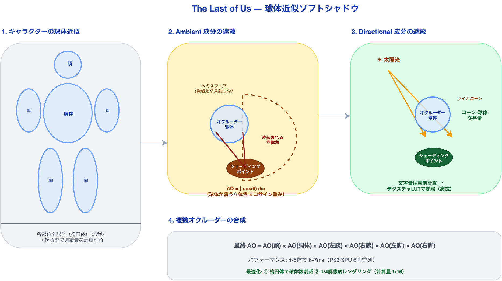

# シャドウとアンビエントオクルージョン ― 影が空間を「本物」にする

ゲームの画面から影を消してみたことがあるだろうか。キャラクターが地面に立っているのに、まるでシール貼り付けたように見える。家具が部屋に置かれているのに、空中に浮いているように感じる。影は「空間にモノが存在する」という情報を脳に伝える、最も基本的な視覚の手がかりだ。

GAMES104の講義では、リアルタイムレンダリングにおける影の表現技術が体系的に解説されている。そしてNaughty Dogの『The Last of Us』GDC講演では、限られたPS3のハードウェアで驚くほどリアルなソフトシャドウを実現した手法が公開されている。

本記事では、アンビエントオクルージョン（AO）の進化史と、ゲーム史に残るソフトシャドウ実装を初学者向けに解説する。読み終えた後、あなたは「なぜこの影がリアルに見えるのか」を技術的に説明できるようになる。

---

## なぜ影が必要か ― 接地感の正体

### 影がオブジェクトを「置く」

人間の視覚システムは、物体の影を見てその物体の位置を判断する。これは現実世界で何十年も訓練された結果だ。

影がない場合と影がある場合で、同じシーンでも受ける印象はまったく異なる。

| 状態 | 見え方 | 原因 |
|:---|:---|:---|
| 影なし | オブジェクトが浮いて見える | 地面との接点情報がない |
| 直接影のみ | 方向は分かるが硬い印象 | 環境光の遮蔽がない |
| AO + 直接影 | 自然で「そこにある」感覚 | 接触部の暗さが接地を表現 |

特に重要なのが**接触影（Contact Shadow）**だ。椅子の脚が床に触れる部分、本が机に置かれた部分、キャラクターの足元——こうした「接触点の暗さ」が、オブジェクトを環境に**接地**させる。

### 影の2つの成分

ゲームグラフィクスにおける影は、大きく2つの成分に分けられる。

1. **直接光の影（Direct Shadow）**: 太陽やポイントライトなど、特定の光源がオブジェクトに遮られてできる影。シャドウマップやレイトレーシングで計算する
2. **環境光の遮蔽（Ambient Occlusion）**: 空や間接光など、あらゆる方向から来る環境光が、周囲の形状によって遮られてできる暗さ。AOはこの成分を近似する

本記事の主役はこの2つ目、**Ambient Occlusion**の進化だ。

---

## アンビエントオクルージョン（AO）の進化

AO（Ambient Occlusion）とは、「ある点が周囲の形状によってどれだけ環境光を受けにくいか」を表す値だ。部屋の隅、棚の奥、キャラクターの脇の下——こうした「光が届きにくい場所」を暗くすることで、形状の立体感と接地感を大幅に向上させる。



### Precomputed AO ― オフライン事前計算

最初のAOは、ゲームの実行前にオフラインで計算していた。各頂点やテクセルについてレイを飛ばし、周囲にどれだけ遮蔽物があるかを計算してテクスチャやライトマップに焼き込む。

```
利点: 高品質（レイを大量に飛ばせる）
欠点: 静的オブジェクトのみ、ビルド時間が長い
用途: 建物の壁、地形、静的な背景
```

動的なオブジェクト（動くキャラクターや破壊される壁）にはAOが適用されない。キャラクターが壁に近づいても、壁との間に暗さが生まれない。これが「リアルタイムAO」を求める動機になった。

### SSAO ― スクリーンスペースの革命（Crytek, 2007）

**SSAO（Screen Space Ambient Occlusion）** は、CrytekがCrysis（2007）で発表した技術で、リアルタイムAOの歴史を切り開いた。



アイデアはシンプルだ。

1. デプスバッファ（画面の各ピクセルの奥行き情報）を利用する
2. 各ピクセルの周囲にランダムなサンプルポイントを配置する
3. 各サンプルポイントのデプスを、デプスバッファの値と比較する
4. サンプルポイントがデプスバッファより**奥**にある＝遮蔽されている → そのピクセルは暗い

```
計算の擬似コード:
for each ピクセル P:
    遮蔽カウント = 0
    for each サンプル S in 球体内のランダム点:
        if depth(S) > depthBuffer(S.screen):
            遮蔽カウント += 1
    AO(P) = 遮蔽カウント / サンプル総数
```

**利点**: デプスバッファさえあれば動的オブジェクトにも適用可能。シーンのジオメトリに依存しない
**欠点**: 球体サンプリングのため、平面でも自己遮蔽（Self-occlusion）が発生し、均一なグレーがかかる

### SSAO+ ― 法線指向ヘミスフィア

SSAOの自己遮蔽問題を解決するため、サンプリング領域を球体からヘミスフィア（半球）に変更したのがSSAO+だ。

法線方向に向かってヘミスフィアを配置し、その内部でのみサンプリングする。こうすることで、平面の裏側（地面の下）にサンプルが落ちることがなくなり、自己遮蔽のアーティファクトが大幅に減少する。

```
SSAO:   球体サンプリング → 平面の裏側にもサンプルが落ちる → 自己遮蔽
SSAO+:  半球サンプリング → 法線方向のみ → 自己遮蔽が解消
```

### HBAO ― ホライズンベースの精度向上（NVIDIA, 2008）

**HBAO（Horizon-Based Ambient Occlusion）** は、NVIDIAが2008年に発表した手法で、デプスバッファを**高さ場（Height Field）**として扱う点がSSAOと根本的に異なる。

SSAOがランダムな点をサンプリングするのに対し、HBAOは各方向への**2Dレイマーチ**を行い、**ホライズン角度（地平線角度）**を求める。

```
HBAOの原理:
1. ピクセルPから放射状に複数の方向を選ぶ
2. 各方向にデプスバッファ上をステップしながら進む（2Dレイマーチ）
3. 各ステップで「どこまで高い遮蔽物があるか」を記録
4. 遮蔽物の最高点が作る角度 = ホライズン角度
5. ホライズン角度が大きいほど、その方向からの光が遮蔽されている
```

この方法はSSAOより物理的に正確で、特に**段差やエッジ周辺**の遮蔽表現が優れている。

### GTAO ― Ground Truthへの到達（2016）

**GTAO（Ground Truth Ambient Occlusion）** は、リアルタイムAOの「正解」に最も近づいた手法だ。HBAOの枠組みを拡張し、2つの重要な改良を加えた。

**1. コサイン重み付き積分**

HBAOが単純にホライズン角度で遮蔽を判定するのに対し、GTAOは**コサイン重み付き**で積分する。物理的には、法線方向に近い光ほど寄与が大きく、水平方向に近い光ほど寄与が小さい。この重み付けを正確に行うことで、Ground Truth（レイトレーシングで計算した正解）との誤差が大幅に縮小する。

```
HBAO:  遮蔽 = Σ (ホライズン角度の比較) → 均一な重み
GTAO:  遮蔽 = ∫ cos(θ) dθ over 遮蔽されていない角度 → コサイン重み
```

**2. マルチバウンス近似**

現実世界では、遮蔽された領域にも間接光（バウンス光）が到達する。GTAOはマルチバウンスの効果を**立方多項式**で近似する。これにより、AOが濃すぎて不自然に暗くなる問題（AO特有の「汚れた」見え方）が解消される。

```
シングルバウンス: AO値をそのまま適用 → 遮蔽部分が真っ黒に近づく
マルチバウンス:   a + b*AO + c*AO² + d*AO³ → 暗部にも間接光の色が残る
```

GTAOは現在のゲームエンジンにおけるリアルタイムAOの標準的な実装となっている。UnityのHDRPにもGround Truth AOとして搭載されている。

### Ray-Tracing AO ― ハードウェア支援の最終形

RTX世代のGPUでは、ハードウェアレイトレーシングを利用してAOを計算できる。

```
仕組み:
- 各ピクセルから半球方向にレイを飛ばす
- レイが遮蔽物にヒットしたら → AO = 暗い
- レイが何にも当たらなかったら → AO = 明るい

パフォーマンスの工夫:
- 近距離: 2-4 spp（sample per pixel）→ 高精度
- 遠距離: 1 spp → 低コスト
- 結果にデノイザーを適用してノイズを除去
```

**利点**: スクリーンスペースの制約がない（画面外のオブジェクトによる遮蔽も計算できる）
**欠点**: RTハードウェアが必要、コストが高い

---

## Last of Usのソフトシャドウ ― 球体近似の妙技

ここまでAOの進化を追ってきた。では、実際のAAAタイトルではどのように影を実装しているのか。Naughty Dogの『The Last of Us』（2013, PS3）は、限られたハードウェアで見事なソフトシャドウを実現した。

### 課題: ライトマップの限界

PS3時代のThe Last of Usでは、環境光の表現に**ライトマップ**を使用していた。しかし、ライトマップには根本的な問題がある。

- ライトマップは**静的**。ビルド時に焼き込むため、動的なキャラクターには影が付かない
- キャラクターが壁に寄っても、棚の下に入っても、環境光の遮蔽が表現されない
- その結果、キャラクターが環境から「浮いて」見える



### アプローチ: 球体近似オクルーダー

Naughty Dogが採用したアプローチは、キャラクターの各部位を**球体（スフィア）で近似**するというものだ。頭、胴体、腕、脚——これらを数個の球体で表現し、この球体がどれだけ光を遮るかを解析的に計算する。

なぜ球体なのか。球体は数学的に扱いやすく、**遮蔽量を解析解（数式で直接計算）**で求められるからだ。レイトレーシングのような反復計算が不要で、PS3のSPUでも高速に処理できる。

### Ambient成分の遮蔽

環境光（Ambient）が球体によってどれだけ遮られるかを計算する。

あるシェーディングポイント（影の計算をしたい点）から見て、球体がヘミスフィア（上半球）上でどれだけの**立体角**を覆うかを計算する。さらに、その覆う領域に**コサイン重み**を付けて積分する（法線方向に近い光ほど寄与が大きいため）。

```
Ambient遮蔽 = (球体が覆う立体角) × cos(θ) の積分
```

この計算は球体という単純な形状だからこそ**解析解**で求められる。入力は3つだけだ。

- シェーディングポイントから球体中心への方向ベクトル
- シェーディングポイントから球体中心までの距離
- 球体の半径

### Directional成分の遮蔽

太陽光などの指向性ライト（Directional Light）に対する遮蔽も計算する。

ここでは「**コーン-球体交差判定**」を使う。光の方向を中心とした円錐（コーン）と球体の交差量を求め、交差が大きいほどその方向からの光が遮蔽されていると判定する。

この計算はやや複雑なため、結果を**テクスチャルックアップテーブル**に事前計算しておく。ランタイムでは角度と距離からテクスチャを引くだけで済む。

### 複数オクルーダーの合成

キャラクター1体は複数の球体で構成される（頭、胴体、腕×2、脚×2）。複数の球体による遮蔽をどう合成するか。

Naughty Dogは最もシンプルな方法を選んだ——**各球体のオクルージョン値を単純に乗算**する。

```
最終AO = AO(頭) × AO(胴体) × AO(左腕) × AO(右腕) × ...
```

物理的に完全に正確ではないが、視覚的に十分な結果が得られた。球体同士が大きく重なる場合に遮蔽が過剰になりうるが、実際のキャラクターの体格ではほとんど問題にならなかった。

### パフォーマンスと最適化

PS3（Cell プロセッサ、SPU 6基）での実測値は以下の通りだ。

| 条件 | 処理時間 |
|:---|:---|
| キャラクター 4-5体 | 6-7 ms |
| SPU 6基並列処理 | 約1 ms/SPU |

さらに2つの最適化を施している。

**1. スケールド球体（楕円体）**

球体だけでは人体の細長い部位（腕、脚）を表現するのに多くの球体が必要になる。そこで、球体を一方向に引き伸ばした**楕円体（スケールド球体）**を導入した。これにより、1キャラクターあたりの球体数を削減できた。

**2. 1/4解像度レンダリング**

AOの結果は空間的に低周波（なめらかに変化する）ため、フル解像度で計算する必要がない。画面の1/4解像度でAOを計算し、バイラテラルアップサンプリングで元の解像度に戻す。計算量は1/16になる。

---

## Unityでの実践

ここまでの知識を、Unityプロジェクトでどう活かすか。

### URP: SSAO

URPではポストプロセスとしてSSAOが提供されている。

```
設定手順:
1. URP Renderer Data → Add Renderer Feature → Screen Space Ambient Occlusion
2. Intensity: 遮蔽の強さ（0.5〜1.5が一般的）
3. Radius: サンプリング半径（大きいほど広範囲だがボケる）
4. Sample Count: サンプル数（Low/Medium/High/Ultra）
5. Direct Lighting Strength: 直接光への影響度（1.0で直接光にもAOがかかる）
```

| パラメータ | モバイル推奨 | PC推奨 |
|:---|:---|:---|
| Sample Count | Low (4) | High (12) |
| Radius | 0.1 | 0.25 |
| Intensity | 1.0 | 1.0 |
| Downsample | ON | OFF |

### HDRP: Ground Truth AO

HDRPでは、前述のGTAOが「Ambient Occlusion」としてデフォルトで利用可能だ。

```
設定手順:
1. Volume Profile → Add Override → Ambient Occlusion
2. Quality: Low / Medium / High / Ultra
3. Ray Length: AOレイの最大長（大きいほど広範囲の遮蔽を検出）
4. Intensity: 効果の強さ
5. Direct Lighting Strength: 直接光への適用度
6. Temporal Accumulation: ON推奨（フレーム間でノイズを低減）
```

HDRPのGTAOはマルチバウンス近似も内蔵しており、暗部が不自然に潰れることが少ない。

### ベイクドAOとリアルタイムAOの使い分け

| 項目 | ベイクドAO | リアルタイムAO (SSAO/GTAO) |
|:---|:---|:---|
| 計算タイミング | エディタで事前計算 | 毎フレーム計算 |
| 品質 | 非常に高い | 手法に依存 |
| 動的対応 | 不可 | 可能 |
| ランタイムコスト | ゼロ | 0.5〜2 ms |
| メモリ | ライトマップ分 | バッファ分 |

実務での指針は以下の通りだ。

- **静的な環境**: ベイクドAOでランタイムコストをゼロにする
- **動的なキャラクター**: リアルタイムAOで接地感を出す
- **高品質プロジェクト**: 両方を併用する（ベイクドAOで環境、リアルタイムAOでキャラクター周辺）

---

## まとめ

影はゲームグラフィクスにおいて「存在感」を作る最も基本的な要素だ。

1. **AOは空間の立体感を作る**: 部屋の隅、家具の接地面、キャラクターの脇の下——AOがないと全てが「平面に貼り付けた絵」になる
2. **SSAOからGTAOへの進化は「物理的正確さ」の追求**: ランダムサンプリング → ホライズンベース → コサイン重み付き積分と、Ground Truthに近づいてきた
3. **マルチバウンス近似が「汚い暗さ」を解消**: シングルバウンスAOの不自然な暗部を、立方多項式で補正する
4. **球体近似は「計算可能な影」の好例**: The Last of Usは、数学的に扱いやすい形状を選ぶことで、PS3で見事なソフトシャドウを実現した
5. **Unityでは目的に応じてAOを選択**: URP SSAO、HDRP GTAO、ベイクドAOを組み合わせて最適なバランスを探る

次回は「Global Illumination ― 間接光が空間に命を吹き込む」をテーマに、ライトプローブ、DDGI、Lumenの技術を解説する。

---

*本記事は [UniMCP4CC](https://github.com/dsgarage/UniMCP4CC) プロジェクトの技術知見を基に執筆しています。Unity × Claude Code でのゲーム開発に興味がある方はぜひご覧ください。*
