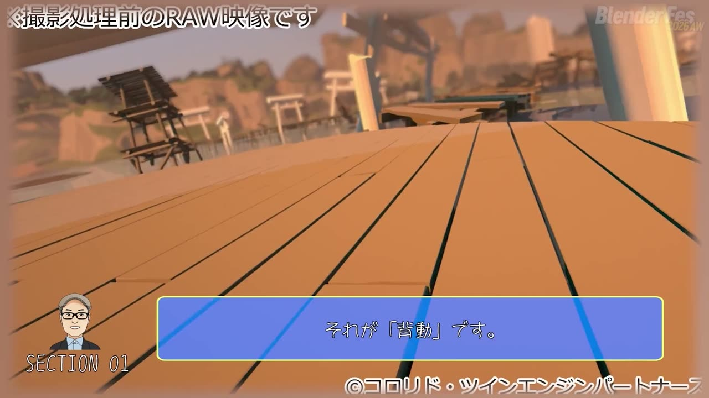
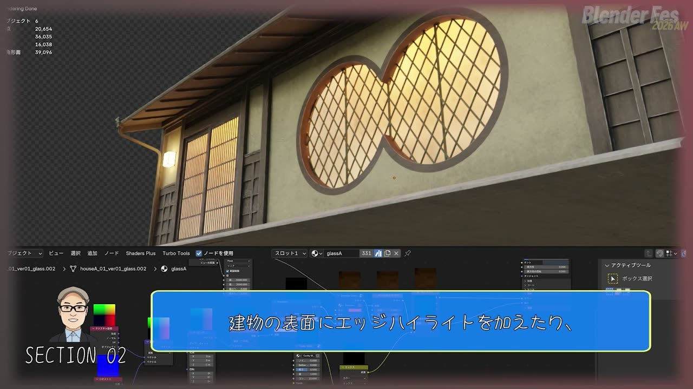
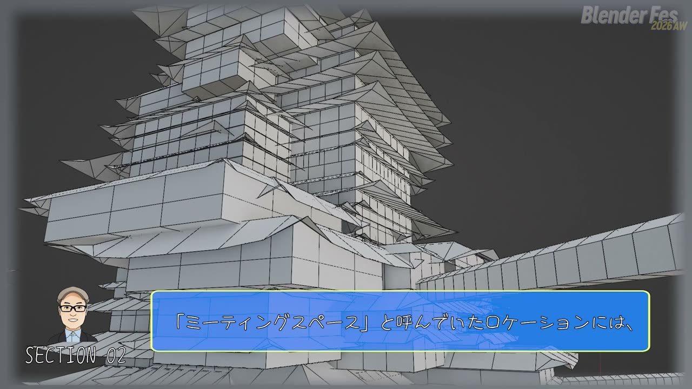
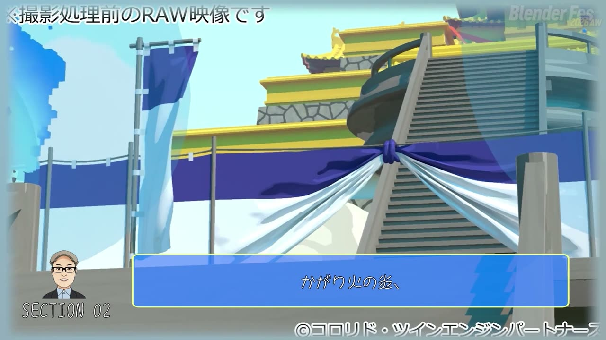
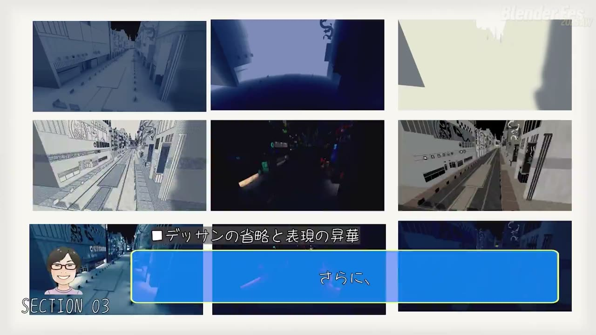
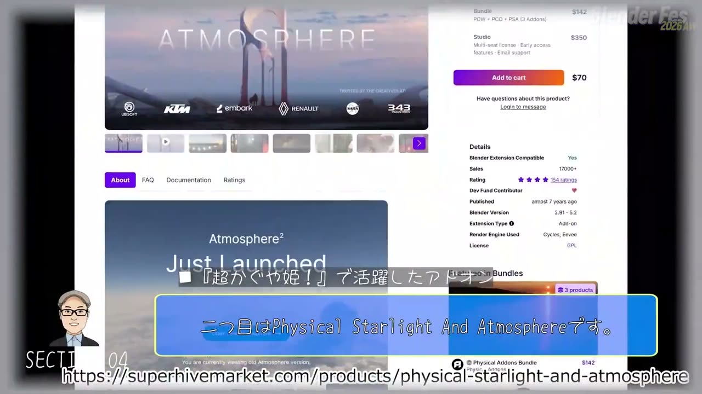
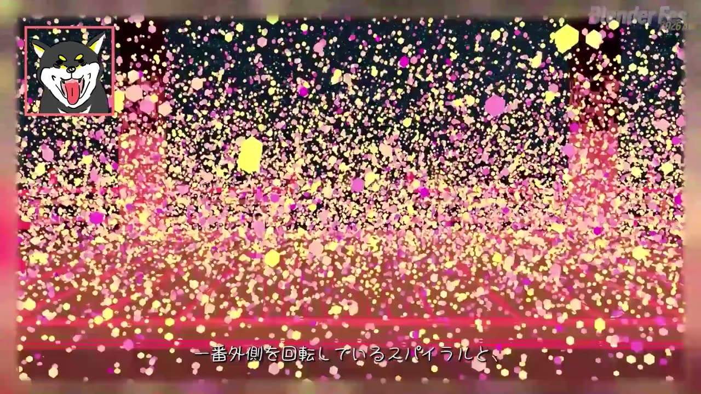
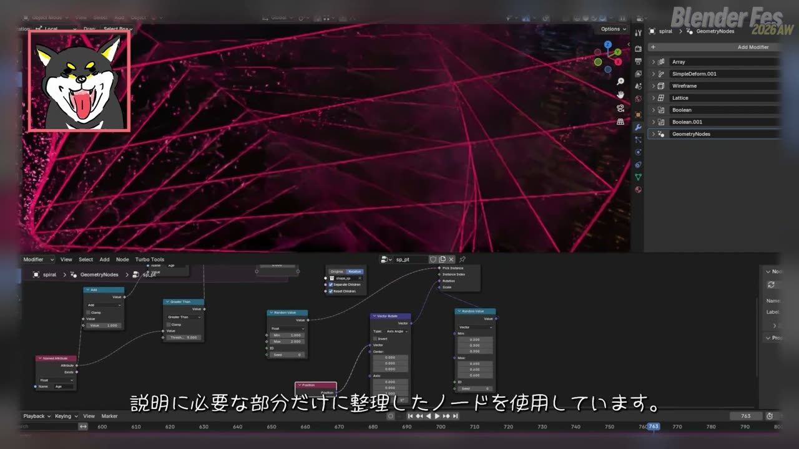
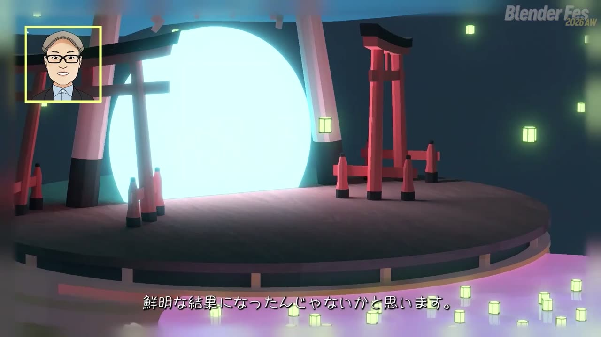
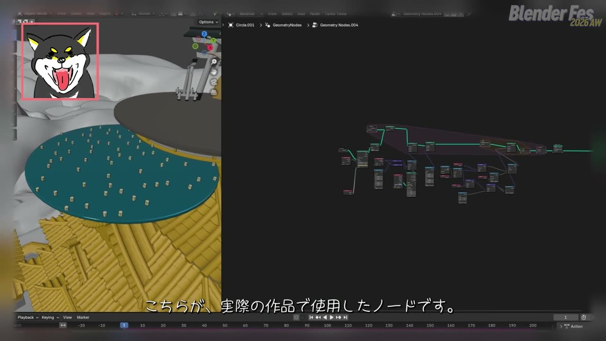

# Blender Fes 2026 AW: 『超かぐや姫！』のCG背景 ─ 背景スタジオが筆を置いてプロシージャルに向かった理由

アニメの背景と聞くと、多くの人は Photoshop で丁寧に塗られた一枚絵を思い浮かべるのではないでしょうか。実際、いまのアニメ背景の主流はデジタルペイントです。

その中で、劇場アニメ『超かぐや姫！』では、デジタルペイントを介さずに 3DCG だけで仕上げる背景が大量に使われました。担当したのは、アニメ・ゲーム専門の背景スタジオであるキューン・プラントです。

Blender Fes 2026 AW の Day1 最初のセッション「Blenderで作る『超かぐや姫！』のCG背景」では、同社の 3 名が、なぜ背景を 3D で作るのか、なぜプロシージャル（手続き型の自動生成）にこだわったのか、そして Blender で実際にどう組んだのかを語りました。前半は背景美術に対する考え方、後半はライブシーンのエフェクトをジオメトリーノードで組んだ具体的な手順という二部構成です。

---

## セッション概要

| 項目 | 内容 |
|:---|:---|
| **タイトル** | Blenderで作る『超かぐや姫！』のCG背景 |
| **イベント** | Blender Fes 2026 AW Day1（CGWORLD 主催のオンラインイベント） |
| **形式** | オンライン配信（講演。事前収録の映像にスライドと字幕を重ねた構成） |
| **日時** | 2026年9月26日（土）10:00–11:00 |
| **登壇** | 中尾陽子、草間徹也、高橋舞（いずれもキューン・プラント） |
| **キーワード** | 背景、超かぐや姫！、After Effects（チャンネルページのタグより） |

---

## 背景: アニメの背景は「一枚の絵」だった

アニメの背景美術は、長く「描くもの」でした。背景を動かしたいときも、基本は一枚絵を動かす手法が使われてきました。背景全体を横に流したり、手前の素材を切り分けた「ブック」をずらしたりする方法です。近年は After Effects で画像にパース変形をかけながら動かすことも一般的になりました。

ただ、これらはあくまで平面の絵を動かしているだけで、本物の奥行きはありません。キューン・プラントが『超かぐや姫！』で目指したのは、その先にある、立体空間そのものを動かす背景でした。

---

## セッション詳報

### スタジオの歩みと「良い背景は良いレイアウトから」（10:01〜）

最初に登壇した代表の中尾陽子さんによると、キューン・プラントは来年で創業 20 年を迎える背景スタジオで、早い段階から 3D を取り入れてきた点が他社との違いだそうです。

同社が 3D をまず取り入れたのはレイアウト工程でした。パースや輪郭線を 3D モデルから起こすと、手描きより速く、しかも安定します。そのためには、キャラクターとの縮尺が正確で、どの角度から見ても破綻しない「箱庭」のようなモデルが必要になります。ここで培ったモデリングの蓄積が、のちの CG 背景の土台になりました。

> 良い背景は良いレイアウトから生まれる。

中尾さんは、この言葉を創業以来の基本理念として紹介しました。その後 3D の用途は彩色の補助へ広がり、アンビエントオクルージョン（物体どうしが接する部分の陰りを計算する手法）の導入で空間表現が大きく向上したそうです。現在はパストレーシングで得られる各種のレンダリング要素を仕上げに使うのが、同社の標準的なワークフローになっています。

『超かぐや姫！』では、そこからもう一歩進み、デジタルペイントを介さない完全な CG 背景に挑戦しました。3D が背景を支える脇役から、背景を生み出す主役に変わった作品だと位置づけています。

### 背動とは何か、なぜ難しいのか（10:05〜）

続いて 3DCG 統括の担当者（草間徹也さんと思われます）が、同社が目指したものとして「背動（はいどう）」を挙げました。背動は背景動画の略で、背景をキャラクターと同じように動かす演出のことです。カメラが空間を移動するものだけでなく、背景の一部を動かしたり、風や光を変化させたりする演出も広い意味で含まれます。

手描きで背動を作るのが難しい理由は、情報量にあります。セルは色数も少なく整理できますが、背景画は密度が高く、それを何枚も描いて連続した映像にしなければなりません。すると、前後の絵の微妙な差がちらつきとして見えてしまいます。現場ではこれを「パカ」と呼ぶそうです。クレイアニメで形が少しずつ揺らいで見えるのと同じ現象です。

一方で、背景を立体空間として持っていれば、手前・中間・奥がそれぞれ違う速さで動く視差が自然に生まれます。

背景画を 3D モデルに投影するカメラマップも、有効な手法として紹介されました。ただし、カメラの移動範囲が広がるほど追加の描き素材が必要になり、描き素材が増えるほど誤差の調整が難しくなります。そこで同社がたどり着いたのが、背景を完全な 3D 空間として組み、しかもプロシージャルに生成するという考え方でした。

### 400 カットを支えたプロシージャルの 3 つの使い道（10:12〜）

キューン・プラントが担当したのは、主に作中の VR 空間である「ツクヨミ」と「合戦」の背景です。もともとデジタル空間という設定なので CG との相性がよく、ルックも意図的に CG らしさを生かす方向で設計されています。

オーダーはおよそ 400 カットの背景制作を含み、その半分近くが 3D の背動でした。この規模では、ペイント中心のやり方では現実的に回らない、というのが講演での判断です。そこで、次の 3 つの用途でプロシージャルを使いました。

| 用途 | 使った場所 | 内容 |
|:---|:---|:---|
| シェーダーノードによるテクスチャ生成 | ツクヨミの建物群 | エッジのハイライト、汚し、手描き風の質感 |
| ジオメトリーノードによる建物の生成と配置 | 超高層建築群、広域の街並み | ルールに沿った建物の自動生成、Geo-Scatter での配置 |
| アニメーション制御 | ツクヨミ、合戦 | ネオンの回転、照明の明滅、かがり火、吹き流し、垂れ幕、風 |

シェーダー側の手描き風の質感には、同じツインエンジングループの作品『クラユカバ』『クラメルカガリ』で培ったノウハウも使われています。独自開発したノードもあるものの、多くは既存のアセットや仕組みを流用しているそうです。

ジオメトリーノードは、用意した建物アセットだけでは足りない場面で、街並みのルールに沿った建物を生成するのに使われました。社内で「ミーティングスペース」と呼んでいた場所の超高層建築群の一部は、この仕組みで作られています。冒頭カットのような広い都市は、アドオンの Geo-Scatter で街全体を組み立てました。

アニメーションについては、のぼりだけは物理シミュレーションをベイクし、それ以外は手続き的に動かしているとのことでした。講演者が特に大きな変化として挙げたのは、背景担当が背景の中を自分で動かせるようになったことです。以前は背景と動画の役割がはっきり分かれていましたが、プロシージャルを使いこなせば背景スタッフが演出を補助できるようになります。

なお、街並みカットの多くは、キューン・プラントがモデル制作までを担当し、最終的な背景美術はコロリド美術部や協力会社が仕上げています。美術スタッフが造形やパースの補完といった基礎作業から離れ、より高度な表現に時間を使えたことも、この分業の利点として語られました。

### 3D を使うと腕が落ちるのか（10:18〜）

再び登壇した中尾さんは、背景美術の世界でよく聞く「3D を使うと腕が落ちる」という意見を取り上げました。答えは「半分正しく、半分間違い」です。

背景美術で最も大切なのはデッサン力で、その本質は立体空間を正確に理解して平面に落とし込む観察力だと中尾さんは考えています。3D だけを使っていれば筆さばきの技術は落ちるかもしれません。それでも、空間や色や光を観察する力は 2D でも 3D でも変わらず求められる、というのが中尾さんの見方です。

3D の強みとして挙げたのは、反射光と環境光です。描き背景では経験則に頼りがちなこれらの要素を、3D は物理的に計算してくれます。

> 私はこれを色のシミュレーションだと思っています。

さらに Blender では、ベースカラー、陰影、反射などを別々の素材として出力できます。Photoshop に慣れた背景スタッフなら、それらを合成して従来に近い感覚で仕上げられます。中尾さんは Blender 初心者に対し、まずはレンダリング素材を Photoshop で仕上げるハイブリッドな進め方をすすめていました。

ただし、モデル、ライティング、レンダリング設計のどれかが甘いと後工程で膨大な修正が生じます。良い CG 背景も良いモデルから生まれる、と中尾さんは冒頭の理念に話を戻していました。

### 車輪の再発明をしない（10:24〜）

次のパートのテーマは「流儀」です。講演者は、創作に絶対的な流儀はないと述べたうえで、Blender ユーザーには既にあるものを自前で作り直す「車輪の再発明」が意外と多いと指摘しました。

学生や初心者がノードを一から組むのは、学習として大きな意味があります。しかし仕事として制作する人には納期と予算があり、目的はノードの研究ではなく背景を完成させることです。

> だから私たちは、使えるものは使います。

『超かぐや姫！』で活躍したアドオンとして紹介されたのは次のとおりです。

| アドオン | 用途 |
|:---|:---|
| Geo-Scatter | 街並みや自然など、大量のオブジェクトの配置 |
| Physical Starlight and Atmosphere | 合戦の昼と夕方のシーンの空と大気を含む環境ライティング |
| RenderSet | 1 つのシーンから大量のカットを出すためのシーン管理とレンダリング管理 |
| Fluent: Materializer | マテリアル作成（詳細は割愛） |
| Paranormal Toon Shader（表記要確認） | トゥーン系のシェーディング（詳細は割愛） |

講演者が強調したのは、どのアドオンが優れているかではなく、実現したいルックのために何が必要かを考えることでした。使えるものがあるなら遠慮せず使い、浮いた時間をより良い表現に回してほしい、というメッセージです。

### 美術なのか、CG なのか（10:29〜）

『超かぐや姫！』の CG 背景に対しては、「これは背景美術ではなく CG だ」という感想もあったそうです。講演者はその見方を否定しないとしたうえで、定義にはあまり興味がないと率直に語りました。大事なのは、やりたいことを実現できるかどうかです。その手段としてたまたま Blender と 3DCG があった、という整理です。

ペイントを否定しているわけではなく、もっと自由に空間を作り、背景を動かすために、自分は一度筆を置くことを選んだと話しました。チャンネルページの紹介文にある「一度筆を置いて」という言葉は、この部分につながっています。

前半の締めくくりでは、Blender を個人でも学生でもプロダクションでも使え、いまも進化を続ける道具だと評し、次のようにたとえました。

> 未来を生き抜くクリエイターの箱舟のような存在だと思っています。

### ライブシーンの裏側（10:35〜）

後半は、CG テクニカルアーティストの高橋舞さんが加わり、作中の見せ場であるライブシーンを振り返る対談形式になりました。高橋さんは以前 3ds Max を主に使っていて、今回がジオメトリーノードを学ぶ良い機会になったと話していました。

キューン・プラントが担当したのは、全 5 曲のライブのうち 4 曲分です。ツクヨミ上空の特設ステージで行われるコラボライブと、合戦のお城に作られた特設ステージでの卒業ライブがそれにあたります。本作では演出段階のプリビズ（アニメーション付きの 3D レイアウト映像）でメッシュがかなり作り込まれていたため、同社に届く時点ではシェーディングだけが残っていることが多かったそうです。

コラボライブでは、眼下に見えるツクヨミの街並みを、3D でレンダリングしコロリド美術部が仕上げた画像として天球に貼っています。床から湧き出るエフェクトは、プリビズでは標準のパーティクルシステムで作られていました。しかし、カメラがステージの周りを 360 度動くためキャラクターとの前後関係に合わせたブック分けができず、すべてジオメトリーノードで作り直しています。

### スパイラルの柱とパーティクル（10:41〜）

ステージの外周で回転しながら昇っていくスパイラルの柱は、手順が詳しく解説されました。形そのものはモディファイアの積み重ねです。四角形を Array で縦に連ね、Simple Deform のねじりで螺旋にし、Wireframe で骨組み状にしたうえで、Lattice で上に向かって広がるシルエットに整えます。最後に 2 つの Boolean で上下の余分を切り落とします。

この柱を回転させながら上へ動かすと、螺旋が回りながら昇っていく動きになります。回転の強弱は、ライブ音源を解析して F カーブに変換したものを使い、音に合わせて変化させています。

面白いのは、Boolean にもう 1 つ役割を持たせている点です。柱は縦に長く作ってあるので、そのまま全体を粒子の発生源にすると、柱が昇るにつれて発生面積が増え、粒子の量も増えてしまいます。Boolean で切って発生範囲を常に一定に保つことで、柱を動かしても粒子の量が安定するようにしています。

粒子の部分は、後工程で素材ごとに分けて管理する必要があったため、標準パーティクルではなくジオメトリーノードで組み直しました。柱の表面に点を撒き、シミュレーションゾーンの中でランダムな初速を使って位置を毎フレーム更新します。各点には経過フレームを数える値を持たせ、一定を超えたら削除することで寿命を表現しています。最後に複数の形状をランダムな大きさでインスタンスとして配置する、という流れです。

### 水面を流れて昇る灯籠（10:47〜）

卒業ライブの 1 曲では、ステージ前の水の円盤を無数の灯籠が流れ、縁まで来ると空へ昇っていく演出が作られました。高橋さんによると、制作当時の Blender は 4.2 で、その時点の機能の制約を前提にした組み方だそうです。

Blender 標準のパーティクルでは条件分岐まで制御するのが難しく、ジオメトリーノードで組むことにしました。ポイントは「縁に到達した」というイベントを直接作らないことです。各点から下に向けてレイキャストを飛ばし、下に水面がある間は流れる動き、水面が見つからなくなったらスイッチで上昇に切り替えます。流れる速さにも昇る速さにもわずかなランダム幅を持たせ、一斉に動いて見えないようにしています。

灯籠どうしのめり込みを避ける処理も試しています。いちばん近い点を探してその位置を取得し、一定距離より近ければ水平方向だけ押し離す処理を、リピートゾーンで何度か繰り返す仕組みです。ただ、補正が弱いとめり込みが残り、強いと不自然に弾かれるため、最終的には灯籠の数や配置も含めて画として自然に見えることを優先して調整しました。

高橋さんは、この制作の考え方を次のように振り返っています。

> 物理的に正しいシミュレーションを作るというよりも、必要な画を作るために使える機能をどう組み合わせるかという考え方で制作しました。

### 締めくくり（10:52〜）

最後に講演者は、手塗りだから良い、CG だから悪いといった優劣にとらわれていては新しい段階に進めない、と述べてセッションを締めました。

告知では、同社が 10 月放送のテレビアニメ『塩対応の佐藤さんが俺にだけ甘い』の美術を担当することも紹介されました。

---

## 登壇者紹介

### 中尾陽子（キューン・プラント）

講演内でキューン・プラントの代表と名乗り、スタジオの歩みと 3D と背景美術の関係を語りました。

### 草間徹也（キューン・プラント）

講演内で「3DCG 統括」と紹介された担当者が草間さんと思われます（音声からの推定のため要確認）。背動とプロシージャルのパートを担当しました。

### 高橋舞（キューン・プラント）

講演内で CG テクニカルアーティストと紹介され、ライブシーンのエフェクトの組み方を解説しました。

---

## まとめ

このセッションは、Blender の操作講座というより、背景スタジオがなぜ 3D に向かったのかを語る内容でした。

| テーマ | 要点 |
|:---|:---|
| 背動 | 立体空間を持つ背景なら視差が自然に生まれ、手描きの「パカ」やカメラマップの限界を越えられる |
| プロシージャル | 約 400 カット、半数近くが背動という規模を回すための前提。シェーダー、建物生成、アニメーションの 3 用途 |
| 3D と描く力 | 失われるのは筆さばきで、観察力ではない。反射光や環境光は「色のシミュレーション」として得られる |
| 流儀 | 仕事では車輪の再発明をしない。アセットやアドオンを使い、浮いた時間を表現に回す |
| 技術パート | 「縁に来たら上昇」をレイキャストとスイッチで置き換えるなど、正しさより必要な画を優先して組む |

3D を取り入れるか迷っている背景美術の人には、「まずレンダリング素材を Photoshop で仕上げる」という入口が参考になるでしょう。

---

## 参考リンク

- [Blender Fes 2026 AW セッションページ（CGWORLD）](https://cgworld.jp/special/blenderfes/vol7/?channel=channel-952)
- [Geo-Scatter](https://www.geoscatter.com/)
- [Physical Starlight and Atmosphere（Superhive）](https://superhivemarket.com/products/physical-starlight-and-atmosphere)
- [Fluent: Materializer（Superhive）](https://superhivemarket.com/products/fluent-materializer)
