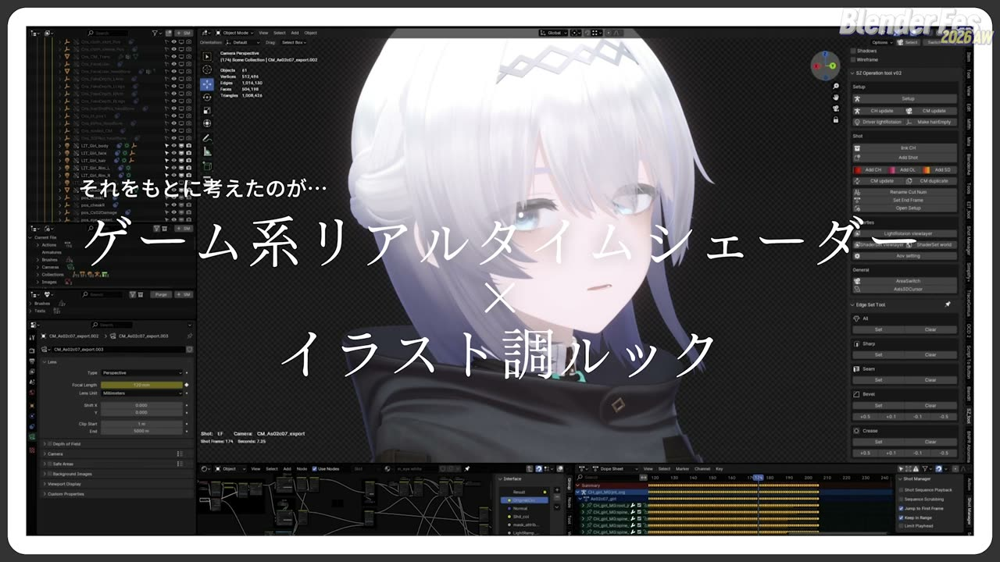
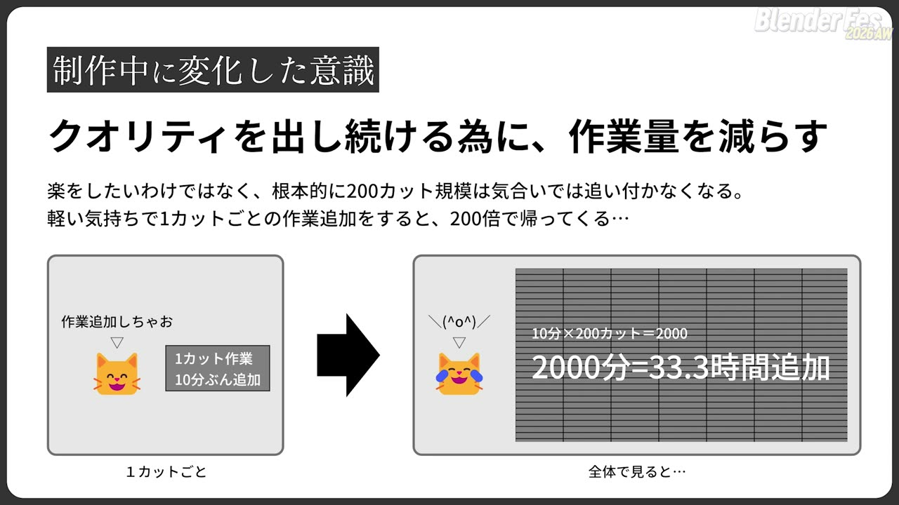
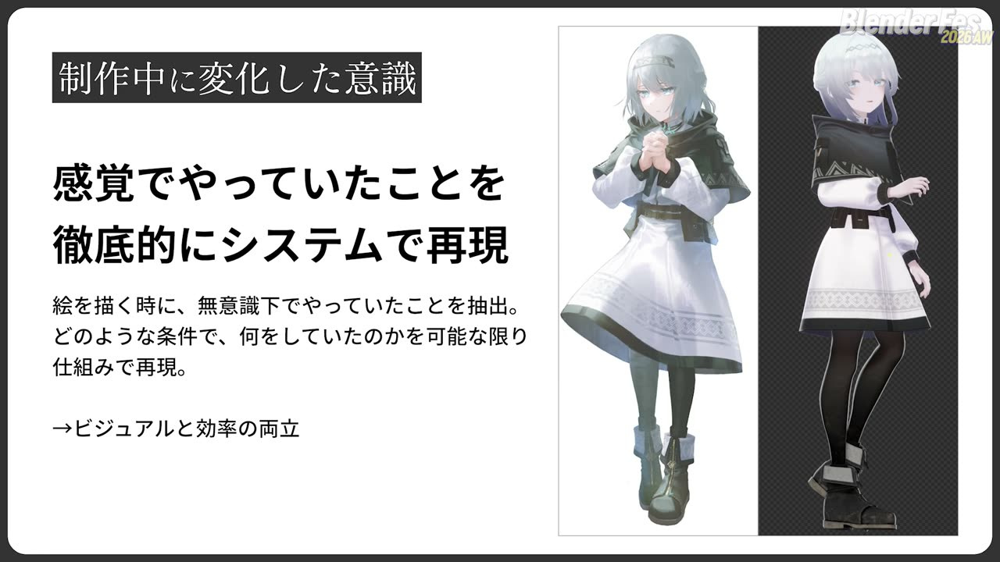
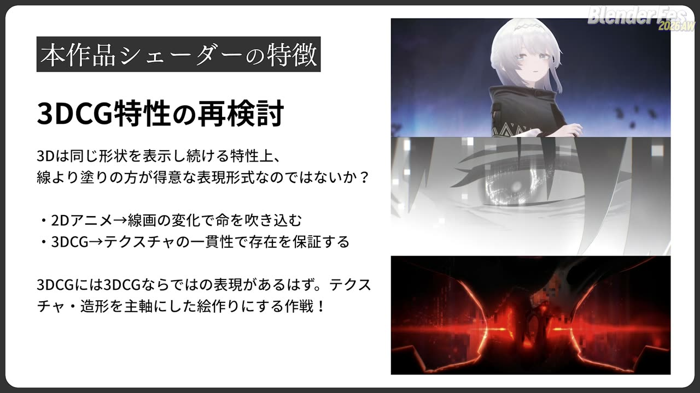
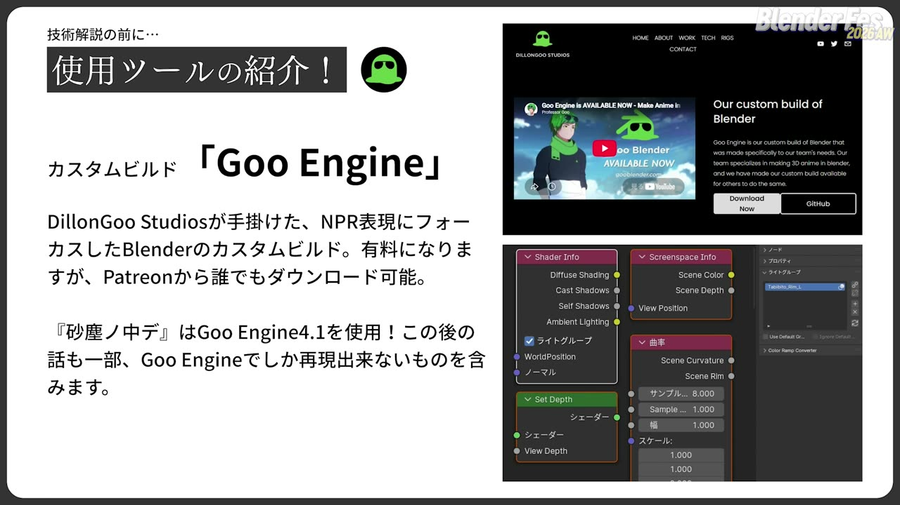
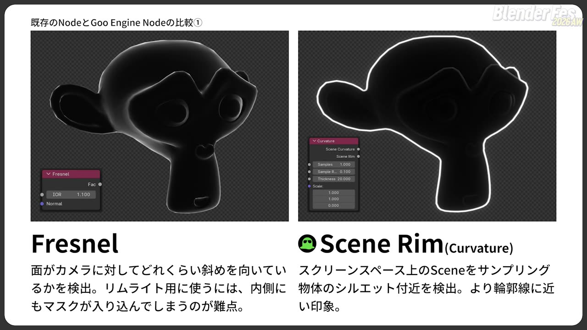
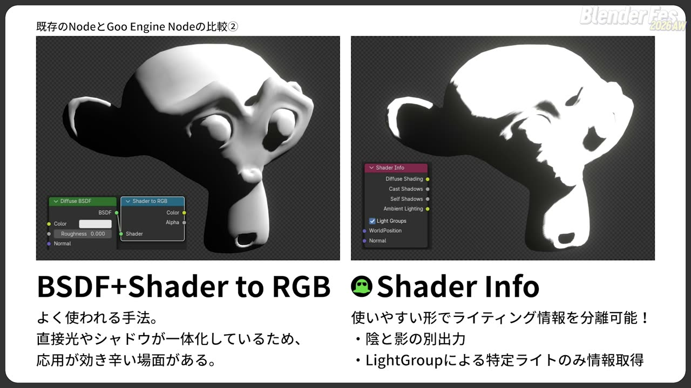
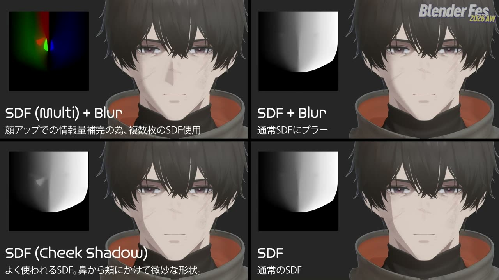
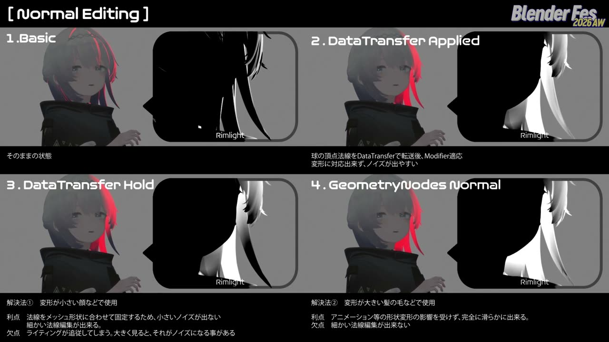
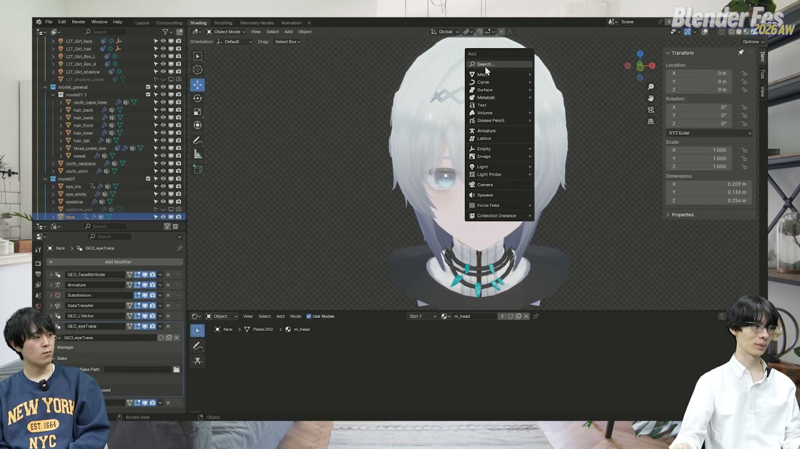

# Blender Fes 2026 AW: 絵作りと効率を両立させる、キャラクターシェーディング技法

1カットに10分の作業を足すだけなら、それほど重く感じないかもしれません。ところが200カットの映像では、その10分が合計で30時間を超える作業に膨らみます。

Blender Fes 2026 AW の Day1 に行われたセッション「絵作りと効率を両立させる、キャラクターシェーディング技法」では、自主制作アニメ映画『砂塵ノ中デ』を手がけた三縁エイトさんが、この「掛け算の重さ」を出発点にしたシェーダー設計を紹介しました。進行役は藤田将さんです。

話の軸は、レタッチ（出力後に1枚ずつ手で描き足す修正作業）を減らし、シェーダーの仕組みだけで完成形に近い絵を出すことでした。後半ではリムライトを組み立てるライブデモと、顔や髪のシェーディングの実データ解説が続きました。本記事では、配信を視聴した内容をもとに要点を整理します。

---

## セッション概要

| 項目 | 内容 |
|:---|:---|
| **タイトル** | 絵作りと効率を両立させる、キャラクターシェーディング技法 自主制作アニメ映画『砂塵ノ中デ』メイキング |
| **イベント** | Blender Fes 2026 AW Day1 |
| **形式** | オンライン配信（講演と、進行役との対話を交えたデモ） |
| **日時** | 2026年9月26日（土）11:15–12:15 |
| **対象レベル** | 中級者向け |
| **登壇者** | 三縁エイト |
| **進行役（MC）** | 藤田将 |

---

## 背景: 個人で200カットのアニメを作るということ

『砂塵ノ中デ』は、三縁さんが卒業制作をもとに個人制作で作り直した約21分の3DCGアニメーションです。カット数はおよそ200で、映像の9割以上を1人で制作したと紹介されました。カナダのファンタジア国際映画祭でアニメーション部門の賞（今敏賞と思われます。表記要確認）にノミネートされ、2026年7月に同映画祭でワールドプレミア上映が行われています。国内での劇場上映も2026年内に予定されているそうです。

リギングとアニメーションは Maya、モデリングからレンダリングまでは Blender のカスタムビルド「Goo Engine」、コンポジットは After Effects という分担です。戦闘シーンがあり人型キャラクターが中心の中編アニメを個人で作るのは、かなり負荷の高い挑戦と言えます。

---

## セッション詳報

### 制作中に変わった意識: 作業量を減らす（11:20〜）

三縁さんによると、効率を強く意識するようになったのは制作の途中で、200カットという規模が気合いでは乗り切れないと実感したことがきっかけでした。

1カットあたり10分の作業を足すと、全体では200倍の2000分、約33時間になります。ここで必要だったのは、レタッチを重ねて100%の絵を10カット作るワークフローではありませんでした。まず80%の品質を200カット安定して出せる仕組みが必要だった、というのが三縁さんの整理です。

> 必要だったのは、安定して80%のクオリティで200カットを作ること。最終的には両方要るけれど、先に必要なのはこちらでした。

進行役の藤田さんは、良い工数削減はデフォルメでもあると応じました。すべてを100%で作るとそれが水準になってしまうので、見せ場で出し切りほかは抑える配分も大事だと補足していました。

### 感覚をシステムで再現する（11:24〜）

作業量を減らしながら絵の質を保つために取った方針が、「感覚でやっていたことを徹底的にシステムで再現する」ことです。三縁さんはもともとイラストを描いており、シェーダーを組む前にキャラクターの完成イメージをデザイン画として描いています。

絵を描くときに無意識にしている判断を取り出し、それがどんな条件で何をしているのかを整理します。そのうえで、シェーダーノードやジオメトリーノードで再現できる形に置き換えていきます。藤田さんは、作家性と呼ばれるものにも定義できるルールがあり、たとえば線の揺れはノイズで再現できると言い換えていました。

### セルルック3DCGを選ばなかった理由（11:25〜）

次に検討したのが、既存の技法であるセルルック3DCG（手描きアニメのような見た目を狙う3DCG表現）です。作画が安定する、大胆なカメラワークができる、モーションキャプチャーで複雑な動きを付けられる、という利点があります。一方で、一定以上の品質を求めると結局は手描き的な修正が必要になり、キャラクターごとにモデルを作る負担もあります。

200カットをほぼ1人で作り、しかも人型キャラクターが中心という条件では、1カットごとの手数が品質を決めるセルルック3DCGを選んでも、商業作品の劣化版にしかならないのではないか。三縁さんは制作前からそう感じていたそうです。そこで自主制作だからこそ取れる別の選択肢として、「ゲーム系リアルタイムシェーダー」と「イラスト調ルック」を掛け合わせる方向に進みました。

### ゲームシェーダーとイラスト調ルック（11:29〜）

ゲームのシェーダーを参考にした理由は、プレイヤーがどの角度からキャラクターを見ても破綻しない絵を、自動で出す仕組みが詰まっているからです。リムライト（輪郭の縁に当たる光）や顔のシェーディングは、ゲームの手法を参考にしています。

リムライトの例では、本来ならカットごとに赤いライトと青いライトを置き直す作業が必要になります。これを「キャラクターの右側は赤、左側は青」と定義してしまえば、配置作業そのものを省略できます。実制作では左右のリムを別々のマスクとして出力し、After Effects で色を付けて、シーンに合わせて片側だけ消したり強めたりしていたそうです。

もう一方のイラスト調ルックについては、3DCGという表現形式の特性から考えています。

> 2Dアニメは線画の変化で命を吹き込むけれど、3DCGはテクスチャや造形の一貫性で存在を保証している。だから線より塗りで攻めた方がいい、と考えました。

この判断は試作と検討を重ねた末に落ち着いたもので、ワークフローが固まりきっていない自主制作だからこそ作っては壊す試行錯誤を多くこなせた、という振り返りもありました。

### 使用ツール: Goo Engine（11:33〜）

技術解説の前に、使用ツールとして Goo Engine が紹介されました。DillonGoo Studios が手がけた、NPR（Non-Photorealistic Rendering、写実ではなく絵画やアニメ調を狙うレンダリング）向けの Blender カスタムビルドです。有料ですが Patreon から誰でも入手でき、『砂塵ノ中デ』は全編でバージョン 4.1 を使っています。紹介は開発元の許諾を得たうえで行われました。

以降の解説には Goo Engine でしか再現できない部分も含まれます。追加ノードのうち2つが標準ノードと比較されました。

**Curvature ノードの Scene Rim 出力**は、標準の Fresnel ノードと比べられました。Fresnel は面がカメラに対してどれだけ斜めかを見るため、リムライトに使うと内側にもマスクが入り込み、メッシュの形によって線の太さが変わってしまいます。Scene Rim はスクリーンスペース（カメラから見た2D画面）上でシーンをサンプリングして物体のシルエット付近を検出するので、輪郭線に近い均一なマスクが得られます。

**Shader Info ノード**は、セルルックの基本形としてよく使われる Diffuse BSDF と Shader to RGB の組み合わせを、機能ごとに分解したようなノードです。Diffuse Shading（陰）、Cast Shadows（落ち影）、Self Shadows、Ambient Lighting を別々に取り出せます。さらにライトグループを指定すると、特定のライトの情報だけを受け取れます。

落ち影だけを取り出せるので、影の境界に線や彩度の高い色を入れる処理がしやすくなります。三縁さんはこのノードを非常に多く使ったそうです。

### デモ: リムライトを組み立てる（11:39〜）

後半は、アーマチュアで簡単なリグを入れたスザンヌ（Blender 標準のサルのモデル）を使ったライブデモです。サンライト1灯の状態から、作中のリムライトを再現していきます。

手順の流れは次のとおりでした。

1. サンライトを複製してリムライトにし、カメラにコンストレイントして常にカメラ左側から当たるようにする
2. Goo Engine のライトグループ機能でリムライト専用のグループを作り、既定グループへの登録を外す
3. マテリアル側の Shader Info ノードでそのライトグループを指定し、リムライトの成分だけを取り出す
4. Curvature ノードの Scene Rim を足してくっきりした輪郭を加え、色はライトではなくマテリアル内の Mix で付ける
5. 画面右側に回り込んだリムを消すため、左右を分けるマスクを作る

左右のマスクには、ジオメトリーノードが使われました。ボーンに追従させたエンプティの位置を Object Info ノードで取り、頂点位置との差を属性として保存します。この処理はアーマチュアモディファイアの後に置くので、アニメーションで動いた後の形にも追従します。マテリアル側では、その属性とカメラの横方向ベクトルの内積を取り、Color Ramp で0と1に振り分けて片側のマスクにします。Texture Coordinate ノードはメッシュの原点に依存し、縦長の人型ほどずれが大きくなるため、部位ごとの基準点は属性で渡す方が扱いやすいそうです。

最後に、反対側の青いリムライトを同じ仕組みで追加し、共通部分をノードグループにまとめて一括で調整できるようにしました。

### アクティブカメラへの追従（11:57〜）

リムライトを特定のカメラにコンストレイントしているため、別のカメラに切り替えると追従しません。そこでジオメトリーノードの Active Camera ノードを使った仕組みが紹介されました。

1頂点を X 方向に押し出した短い棒状のメッシュを作り、ジオメトリーノードでアクティブカメラの位置と回転に合わせて移動させます。棒の根元と先端に別々の頂点グループを割り当て、エンプティの位置を根元のグループに、向きを先端のグループにコンストレイントで合わせます。頂点1つだけでは回転の情報を持てないため、2点の棒にしているそうです。あとはリムライトのコンストレイント先をこのエンプティに変えれば、どのカメラに切り替えてもリムライトが付いてきます。

> コンストレイントを1個付け直すのに1分かかるとしても、それだけで200分になってしまいます。こういうものを1個ずつ積み重ねて作業を減らしていきました。

### SDFテクスチャを重ねたフェイスシェーダー（12:02〜）

続いて、実際のキャラクターデータで顔と髪のシェーディングが解説されました。顔は印象を最も左右し、レタッチが必要になりやすい部位です。

顔には SDF テクスチャ（光の向きに応じて影の境界がどこまで進むかを濃淡で持たせた画像）を使っています。三縁さんの方式では、基本の SDF に加えて、RGB の各チャンネルに別々のマスクを持たせた画像を用意しています。頬の明るい部分、鼻のハイライト、鼻の影などを個別に制御できるようにするためです。

よく使われる頬に三角形の影が乗るタイプは、遷移の途中で不自然な形が出ます。純粋なグラデーションの SDF は遷移がきれいな代わりに、顔のアップでは情報が足りません。そこで複数枚の SDF で情報量を補い、境界にブラーを入れて柔らかさを出したのが本作の方式です。

各パラメータはジオメトリーノードのモディファイア側に集められ、カットごとに調整できます。ただ実際に使ったのは一部のカットだけで、次はもっとシンプルにできる、という率直な振り返りもありました。

### 髪の法線をどう整えるか（12:10〜）

髪は細かく、しかも大きく動くため、シェーディングにノイズが乗りやすい部位です。三縁さんは法線の編集方法を4つ比較していました。

| 方式 | 内容 | 評価 |
|:---|:---|:---|
| 1. そのまま | 編集なし | 比較の基準 |
| 2. DataTransfer 適用 | 球などの法線を Data Transfer で転写してモディファイアを適用 | 変形に追従できず、ノイズが出やすい |
| 3. DataTransfer 保持 | モディファイアを残したまま転写 | 変形の小さい顔向き。ライティングが張り付いて見え、大きく見るとノイズになることがある |
| 4. ジオメトリーノードで法線を生成 | 位置情報を使って滑らかな法線を動的に作る | 変形の大きい髪向き。アニメーションの影響を受けず滑らか。細かい法線編集はできない |

顔には3番、髪には4番と使い分けています。藤田さんからは、ジオメトリーノードの Blur Attribute ノードでさらに滑らかにする手もあるという提案がありました。

### そのほかの仕込み（12:14〜）

最後に、顔や髪に入れている細かな仕込みがいくつか紹介されました。

- **前髪の落ち影**: 髪のメッシュを複製して影として表示し、Goo Engine の Screenspace Info ノードで画面上の肌の色を取得して影色を乗せています
- **髪越しに透ける目や眉**: 通常のオブジェクトとは別に、マテリアルとオブジェクトを複製した半透明版を重ねています。描画順は Goo Engine の Set Depth ノードでマテリアル側から制御できます
- **影の境界の色**: Shader Info ノードの WorldPosition 入力をライト方向に少しずらし、ずらした陰影と元の陰影の差分に彩度の高い色を乗せています。サブサーフェススキャッタリング（皮膚の内部で光が散乱して赤みが出る現象）のような見た目になります
- **影側の反射光**: ライトの向きの根元と先端にエンプティを置き、位置の引き算でライトのベクトルをジオメトリーノードで取得しています。アクティブカメラの仕組みと同じ考え方です。このベクトルと法線の内積から、光が当たる側の反対にうっすら青い反射光を入れています

反射光の仕組みは、イラストの描き方を分解して再現する試みの典型例として紹介されました。もともと絵を描いてきた立場から、どうすれば3DCGらしさの先に行けるかを考えて組んでいるそうです。藤田さんは、パラメータの調整の仕方ひとつで柔らかくもくっきりにもなり、ノードの組み方にも作家性が出ると応じていました。

### 締めくくり: アイデアで不足を覆す（12:22〜）

三縁さんは、この作品を3年ほどかけてほぼ1人で作ってきたと振り返りました。お金も人も足りない自主制作ですが、3DCGはアイデアとワークフローが品質を左右する部分が大きいと考えています。

> アイデアで足りない部分を解消し、覆していけるはずだと信じてこの作品を作ってきました。

作品はすでに完成しており、2026年内に劇場公開の予定です。今回は時間の都合で扱えなかった背景や撮影処理（コンポジット段階の仕上げ）については、個人のアカウントで発信していく予定とのことでした。

---

## 登壇者紹介

### 三縁エイト

講演内の自己紹介では、専門学校を卒業後にゲーム会社でコンセプトアーティスト兼背景モデラーを務め、現在はフリーランスで活動していると話していました。Blender のシェーダーノードやジオメトリーノードを使いこなせるようになったのはここ数年とのことです。イラストも描き、『砂塵ノ中デ』ではキャラクターのデザイン画から自ら手がけています。

### 藤田将（進行役）

本セッションの MC。作品本編を視聴したうえで、制作者の視点から多くの補足を加えていました。

---

## まとめ

このセッションで繰り返し語られたのは、効率化は品質を下げる妥協ではなく、品質を支える土台だという考え方でした。

| テーマ | 要点 |
|:---|:---|
| 規模の掛け算 | 1カットの小さな追加作業が200倍になる。先に「80%を200カット安定して出す」仕組みを作る |
| 土俵の選択 | 個人制作でセルルック3DCGを選ぶと商業作品の劣化版になりやすい。ゲームシェーダー × イラスト調ルックを選んだ |
| 感覚のシステム化 | 絵を描くときの無意識の判断を条件と処理に分解し、ノードで再現する |
| ライティングの分離 | Shader Info とライトグループで陰・落ち影・特定ライトを分けて扱う |
| カメラ非依存の仕組み | Active Camera ノードとエンプティで、どのカメラでもリムライトが付いてくるようにする |
| 顔と髪 | 複数の SDF とブラーで顔の情報量と柔らかさを両立し、髪はジオメトリーノードで滑らかな法線を作る |
| イラストの分解 | 影境界の色や影側の反射光など、描くときの判断をベクトルと内積の処理に置き換える |

> 大量のレタッチで100%を目指すより、仕組みだけで完成形に近い絵が出る状態を先に作る。それが完成させることと質を保つことの両方に効きました。

3年がかりの個人制作を支えたのは、特別な人手ではなく、こうした仕組みの積み重ねだったと言えるでしょう。Goo Engine 固有のノードに頼る部分もありますが、条件を分解してノードで再現するという考え方は、標準の Blender でも応用できると考えられます。

---

## 参考リンク

- [Blender Fes 2026 AW セッションページ](https://cgworld.jp/special/blenderfes/vol7/?channel=channel-946)
- [DillonGoo Studios（Goo Engine 開発元）](https://www.dillongoostudios.com/)
- [Blender マニュアル: Active Camera ノード](https://docs.blender.org/manual/en/latest/modeling/geometry_nodes/input/scene/active_camera.html)
- [Fantasia International Film Festival](https://fantasiafestival.com/)
