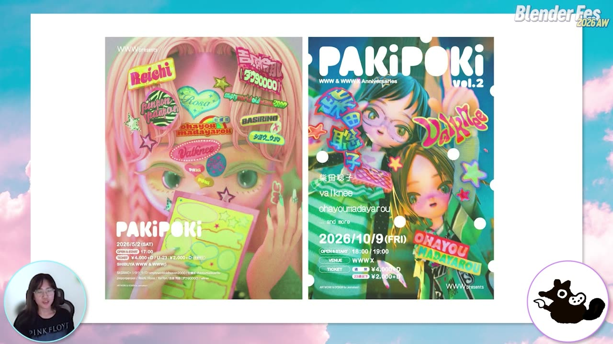
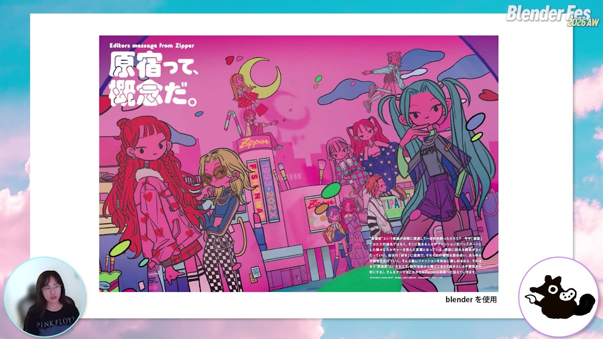
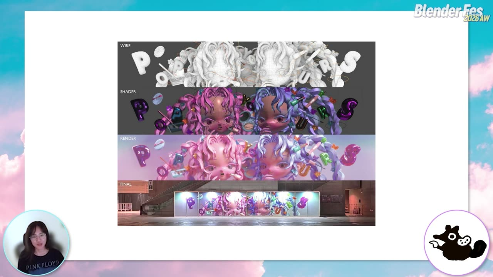
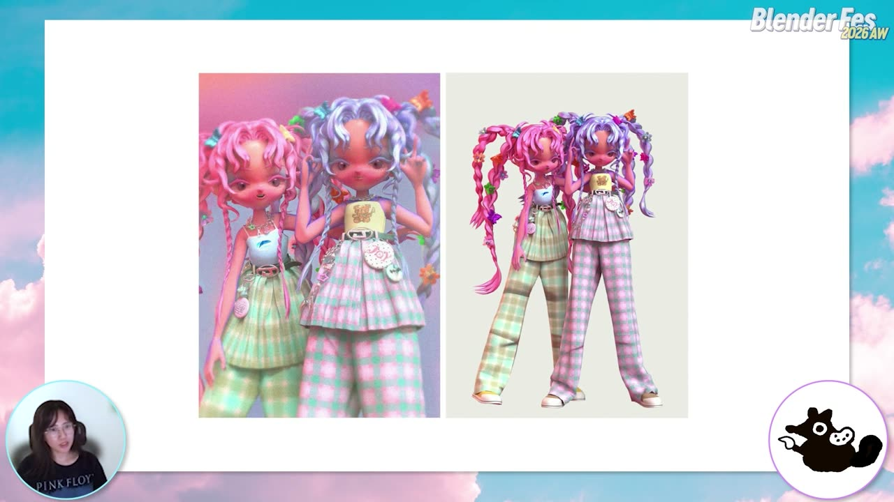
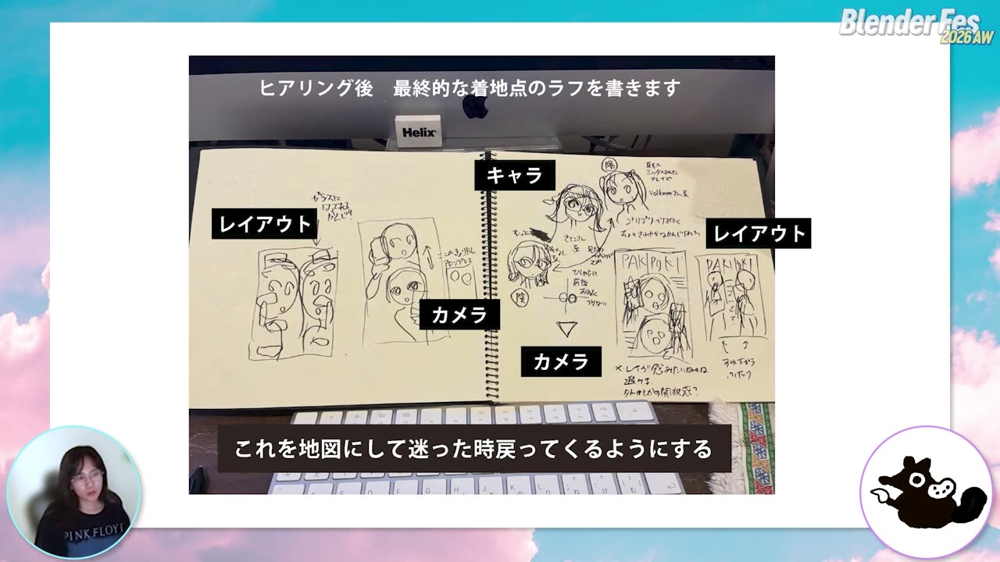
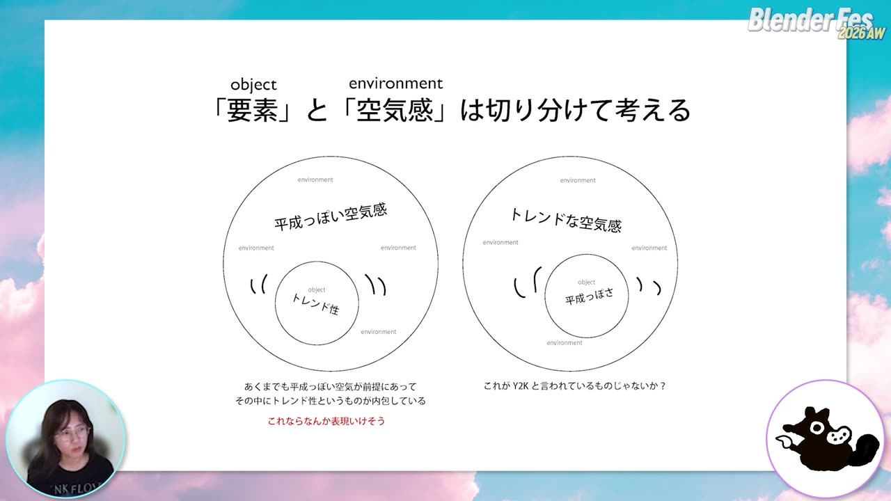
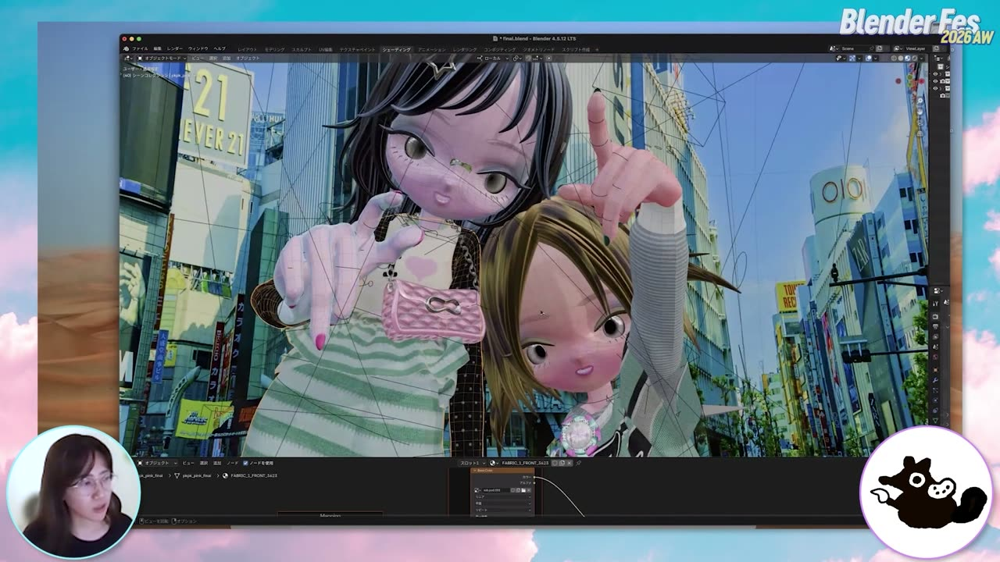
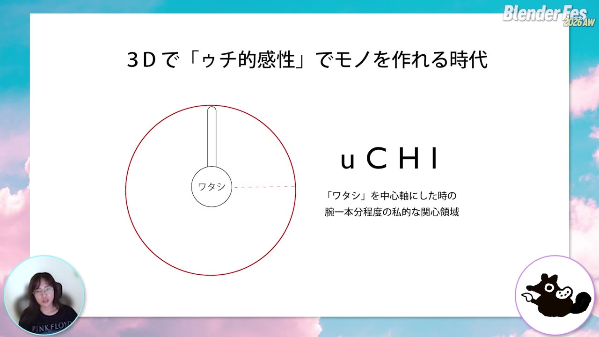

# Blender Fes 2026 AW: 現実より「盛る」3D制作 — ジェニーカオリさんが語る「ゥチ的感性」とシェーダー

3DCG と聞くと、車やロボット、SF の世界、リッチなアニメーションを思い浮かべる方が多いかもしれません。

Blender Fes 2026 AW の Day1 に登壇したジェニーカオリさんが見せてくれたのは、そのどれとも違う 3D でした。ガーリーでファッショナブルで、少し懐かしいのに今っぽい女の子たちです。テーマは、現実をそのまま再現するのではなく「現実にありそうで、現実には存在しない」世界、つまり **リアル²（リアルの二乗）** をつくることでした。

セッションの題材は、渋谷のライブハウス WWW で開かれる音楽イベント「PAKiPOKi」のフライヤー制作です。クライアントの少しあいまいなオーダーをどう読み解き、自分の「好き」とどう重ね、最後に Blender のシェーダーへどう落とし込んだのかが、制作データを開きながら語られました。

---

## セッション概要

| 項目 | 内容 |
|:---|:---|
| **タイトル** | 現実より「盛る」！ゥチらの3D制作～ Blenderでリアル²の世界へ～ |
| **イベント** | Blender Fes 2026 AW Day1 |
| **形式** | オンライン配信（講演。MC との対談形式で進行） |
| **日時** | 2026年9月26日（土）12:30–13:30 |
| **スピーカー** | ジェニーカオリ |
| **MC** | 東條あずさ |

---

## 「リアル²」と「ゥチ」という言葉

チャンネルページの紹介文は、「なんかゥチ、これ好き」「もっとこういうものが現実にあったらいいのに」という、ごく個人的なつぶやきから始まっています。

ここでいう「ゥチ」は、関西などで使われる一人称の「うち」と、「うちら」という仲間意識の両方を含んだ言葉と考えられます。個人制作だからこそ持てる制約のない自由さを使って、自分が見たい現実以上のものを自分でつくる。紹介文ではこれを「ゥチ的創作態度」と呼んでいました。

セッションはこの考え方を実際のクライアントワークに当てはめ、最後はノード 1 つの使い方にまで降りてくる構成でした。

---

## セッション詳報

### 2D の絵を板に貼るところから（12:31〜）

ジェニーカオリさんは 2D のイラストレーターとして 13 年ほど活動してきて、2020 年ごろから Blender を独学で学び始めたそうです。

最初期の Blender 作品は、モデリングではありませんでした。描いた絵を透過画像にして平面（プレーン）に貼り、飛び出す絵本やペーパークラフトのように空間に立てていく作り方です。背景のビルも含め、すべてが絵だったと言います。当時はアウトラインを 1 本付けるのにも苦労したそうで、イラストレーターの感覚のまま 3D に入る難しさがうかがえます。

その後、同じアートスタイルのまま立体のキャラクターを作るようになります。白目のない目をどう 3D で作るかなど、自分の絵柄を立体に置き換える方法を自主制作で何度も繰り返して固めていきました。その成果として、ヒップホップフェスティバル「POP YOURS」の大型パネルを手がけたそうです。ワイヤーフレーム、シェーダー、レンダー、会場設置という工程を並べたスライドは、2D の作家が 3D の全工程を 1 人で持っていることをよく示していました。

### 服はアパレルの目で作る（12:35〜）

首から上だけの納品が終わったあと、せっかくだからと体と服も作ったそうです。服には Marvelous Designer（型紙から服をシミュレーションで立体化するソフト）を使っています。

ジェニーカオリさんはイラストレーターになる前、アパレルでテキスタイルのデザインをしていました。身頃や袖丈の感覚はそのころの経験から来ていると言います。キャミソールのプリントがはげていたり、生地が毛羽立っていたり、プリーツに張りがなくヨレヨレだったりと、洗いこんだ古着のような質感にこだわりが出ています。MC からは、ファッションへの解像度がとても高いという感想が出ていました。

> 何も人生で無駄なことがないんだなって思います。

アパレル、2D、3D の経験がすべて合わさって今の作品になっている、という流れでの一言でした。

### 個人がワークフローを丸ごと持つ時代（12:38〜）

3D は本来チームで作る前提の工程が多い分野です。一方で Blender の登場によって、企画から仕上げまでを 1 人で持つ作り方がここ 2〜3 年で増えてきた、とジェニーカオリさんは見ています。

個人制作では、「自分はこういうところが素敵だと思っている」という内側の感性を、作品にそのまま投影できます。その作品を見て共感したクライアントが「一緒に作りませんか」と声をかけてくる。今回の PAKiPOKi もその流れで生まれた案件だそうです。

### PAKiPOKi のフライヤー案件（12:40〜）

PAKiPOKi は、渋谷・宇田川町のライブハウス WWW で開かれる音楽イベントです。スライドによると、スペースシャワーの企画で、ラッパーの valknee さんと、元 chelmico の Rachel さんによる DJ 名義 ohayoumadayarou さんが主催し、ジャンルを越えて活躍する女性アーティストが出演します。1 回目のフライヤーと、10 月開催の vol.2 のフライヤーの 2 枚を手がけました。

ジェニーカオリさんはもともと valknee さんのファンで、出演者の柴田聡子さんの音楽も 10 年ほど前から好きだったそうです。依頼を受けた時点で、出演者の感性が自分の中にすでに「セットアップされていた」わけです。好きなものを作っていると好きな仕事が来る、という話に MC も深くうなずいていました。

### 「抜け感のある平成」をどう読むか（12:44〜）

クライアントのブリーフ（依頼内容をまとめた指示書）には、画像のリファレンスと文章が含まれていました。登壇では文章部分だけを簡略化して紹介しています。

そこに並んでいたのは、「キラキラかわいい」「くすみ感のある平成」「バチバチの派手ギャルではなく抜け感のある平成」「2010 年代のような雰囲気」、そして「ミントグリーンやドットなどのトレンド感」といった言葉でした。平成っぽさとトレンド感は一見矛盾していて、ジェニーカオリさん自身も「どっちやねん」と思いつつ、言いたい雰囲気は分かる、と受け止めたそうです。

### ラフは迷ったときに戻る地図（12:46〜）

ヒアリングのあとは、最終的な着地点のラフを描きます。vol.2 なので女の子は 2 人、文字の配置、レイブっぽさは避けて屋外の開放感を出す、といった最初のひらめきを忘れないように書き留めておきます。

三面図は作らず、ラフも落書きに近いものだそうです。そのかわり、カメラと被写体の距離感など、後で迷いそうな点をメモしておきます。スライドには「これを地図にして迷った時戻ってくるようにする」と書かれていました。

リファレンスは自分で集めるより、クライアントからもらったものを中心にし、迷ったら担当者に確かめるそうです。一方で服やアクセサリーはほぼリファレンスを見ずに頭の中から出しています。その原動力は、いつも抱えている次の気持ちだそうです。

> こういう服欲しいの売ってねえ、みたいな感じがあるんです。

キャラクター設定も出演者から逆算しています。ポエトリー系の柴田聡子さんの存在を意識して、眼鏡をかけた文学少女風の女の子を置いた、という説明がありました。

### 平成には A 面と B 面がある（12:48〜）

「抜け感のある平成」は、人によって思い浮かべるものがばらつく言葉です。ジェニーカオリさんは平成のカルチャーを自分なりに A 面と B 面に分けて整理しています。

- **A 面**: Y2K という言葉で今よく取り上げられる、ギャルや SHIBUYA109 のイメージ
- **B 面**: セゾン系、PARCO の広告、雑誌『STUDIO VOICE』、渋谷系のような、文化資本の高いカルチャー寄りのイメージ

クライアントのいう「抜け感」は B 面側に合わせるとしっくりくる、と判断したそうです。

### 今の渋谷を背景に入れる（12:50〜）

PAKiPOKi はこれから開かれるイベントなので、「今の渋谷」を画面に入れたいと考えました。ランドマークとしては SHIBUYA109 もありえますが、今っぽくはないと感じたそうです。駅から WWW へ向かう道のりでは 109 の前を通らないことも理由の 1 つでした。

そこで選んだのは、宇田川町周辺の風景と、再開発で並び始めた高層ビルに青空や雲が映り込む景色です。背景の青には、ビル群に反射した空の青さを入れたかったと言います。スクランブル交差点に面した、かつて TSUTAYA が入っていたビル（表記要確認）も描き込み、なくなったもの、移ろうものを入れることもノスタルジー表現の一種だと考えたそうです。

初めてクラブに行く女の子の緊張とワクワクも意識しました。一番おしゃれな服で少し背伸びして出かける感じなど、自分の経験の「匂い」を画面に入れているそうです。

### 「要素」と「空気感」を切り分ける（12:53〜）

平成っぽさと今っぽさを両方入れようとすると、画面に情報があふれます。そこでジェニーカオリさんは、服やアクセサリーなどの**要素（object）**と、それを包む**空気感（environment）**を切り分けて考えるようにしました。

平成っぽい空気感が画面全体を包んでいれば、中に置くオブジェクトはトレンドのものでも構わない、という整理です。実際にネイルはピンクとミントグリーンの今っぽい配色にし、ドットも取り入れています。

発想のヒントになったのは Instagram の写真フィルターでした。

> 今撮った写真も懐かしくさせるのは、フィルターってか空気。

空気感はコンポジットやライティングで最後にまとめて出せるので、オブジェクトは平成にこだわらなくてよい、という考え方です。

### シェーダーが要素と空気感を取り持つ（12:57〜）

ここでようやく 3D の話に入ります。ジェニーカオリさんの考えでは、モデリングやマテリアルといった要素の側と、環境・空気感の側を取り持つのがシェーダーです。

キャラクターのアウトライン（輪郭の線）には、あえて別の色を入れてキャラクターの性格らしさを出しています。前髪や眉、化粧はトレンドの古さ・新しさが一番出やすい部分なので、ここに今の流行を入れるそうです。チークの位置ひとつで「古い」と判断されてしまう、という話も出ました。

今のトレンドとしてよく聞く言葉が「うるちゅる感」です。ネイルでも髪でも肌でもレンズでも使われるこの質感を、シェーダーでは何で調整すればよいのか。それが次の実演のテーマでした。

### Layer Weight 一つで「うるちゅる」を作る（13:00〜）

画面が Blender に切り替わると、レンダーのぼかしで見えなかった細部まで見えるようになりました。トポロジー（ポリゴンの流れ）も独学で身につけたそうです。リグには Auto-Rig Pro を使っています。

MC が驚いたのは、シェーダーの構成がとてもシンプルなことでした。中心にあるのは **Layer Weight（レイヤーウェイト）ノード**です。視点を動かすと瞳の色がマグネットネイルのように移り変わり、黒目の範囲やカラコンの色味もここで調整しています。ジェニーカオリさんは、カメラの動きに合わせて光の重なり方が変わるものだと独学なりに理解していると説明し、正確な仕組みはネットで調べてほしいと添えていました。

一般的な説明を補足すると、Layer Weight ノードは面の向きと視線の角度から 0〜1 の値を出すノードで、Fresnel と Facing の 2 つの出力を持ちます。正面を向いた面と輪郭側の面で値が変わるため、色を混ぜる係数に使うと、視点に合わせて縁の色が変わる表現が作れます。

Layer Weight は瞳だけでなく、ほとんどの箇所に使っているそうです。黒髪に見える髪の縁には、空気の色として青空の青を入れています。黒髪でも重く見えず、うるちゅるに通じる軽やかさが出る、という狙いでした。髪そのものにも、深いレイヤーカットなど平成っぽさを仕込んでいます。

### 肌はイエベ・ブルベで分ける（13:05〜）

肌のシェーダーは、パーソナルカラー診断で使われるイエベ（イエローベース）とブルベ（ブルーベース）で分けています。眼鏡の子はブルベ、もう 1 人はイエベという設定です。

化粧のテクスチャは 2 人で同じ画像を使い、色相・彩度の調整ではなく、シェーダーの中で色を混ぜて差を付けています。肌の縁にはピンクやブルーのラインが残るようにしました。人の肌からピンクは出ませんが、イラストではワクワクした雰囲気を出すために肌の輪郭をピンクやオレンジにする描き方があります。その 2D の見せ方をシェーダーで再現してみた、ということです。

髪型はフィギュアスケート選手の髪型（表記要確認）をニュースで見て次に来そうだと感じてスクリーンショットしておいたものを取り入れています。服に「PAKiPOKi」の文字をこっそり入れるなど、自分も制作を楽しむ工夫も欠かさないそうです。

### アドオンはほとんど入れない（13:10〜）

ジェニーカオリさんは、特別に技術的なことはしていないと繰り返しました。

> 今からインストールして、すぐ球体にシェーダーの勉強として貼り付けられるぐらいの程度のことを、こねくり回して応用して自分のものにする。

アドオンもほとんど入れないそうです。入れればその使い方を覚える必要があり、正直それが面倒だと言います。ソフトに最初から入っている機能をこねくり回すほうが性に合っていて、Blender は無料なのでアドオンを入れなければ費用もかからない、という話もありました。

### 「ゥチ」という関心領域（13:13〜）

終盤では、タイトルにある「ゥチ」の定義が示されました。スライドには「uCHI」と書かれ、「ワタシ」を中心軸にしたときの腕一本分程度の私的な関心領域、と説明されています。

水光レンズ、イエベ・ブルベ、古着のボロボロ具合といった、手の届く範囲の関心をすべて Blender で抱きしめて作っている、というのがジェニーカオリさんの感覚です。エンターテインメント作品というより個人の日記のような「私はこれが好き」という表現が、今後 SNS を中心にどんどん発信され、仕事にもつながっていくだろう、と語りました。

### 3D 学習の壁と AI との付き合い方（13:15〜）

イラストなら 30 分で描ける三つ編みも、3D ではカーブで編むのか、ジオメトリーノードで作るのか（要確認）から覚える必要があります。ここで挫折する人は多いだろう、と本人も認めています。

独学を始めたころは、絵に逃げないよう、描ける自分をいったん忘れて取り組んだそうです。ただ、一度ベースの体を作ってしまえば、髪型や服を変えて使い回せます。つらい時期を越えれば楽しい作業だけが残る、という実感でした。Discord で初心者同士が集まる場や、Blender Fes のような場が学習を続ける助けになる、という話もありました。

AI については、プロップの土台づくりなど、時間と予算に合わせて複合的に使うのはよいと考えているそうです。ただ、古着のはげ方やヨレ方は、指示しても求めているヨレとは違うものになりがちで、作品の中心になる部分は自分の手で作ることが手応えにつながる、という立場でした。

---

## 登壇者紹介

### ジェニーカオリ

公式の肩書は2D/3Dイラストレーターです。セッション内の本人の説明によると、2D のイラストレーターとして 13 年ほど活動し、2020 年ごろから Blender を独学しています。イラストレーターになる前はアパレルでテキスタイルのデザインに携わっていたそうです。2D の絵柄を保ったまま 3D に移す独自のワークフローを持ち、キャラクター、服、背景、シェーダーまでを 1 人で手がけています。

### 東條あずさ（MC）

本セッションの司会・聞き手です。公式の肩書はコンセプトアーティストです。

---

## まとめ

| テーマ | 要点 |
|:---|:---|
| 出発点 | 「こういうのが欲しいのに売ってない」という個人の欲望から作る |
| クライアントワーク | ブリーフの矛盾は、言葉を分解して自分の文脈（平成の A 面・B 面）で読み直す |
| ラフ | 迷ったときに戻る「地図」として、着地点とカメラの距離感を書き留める |
| 構成 | 「要素」と「空気感」を切り分け、空気感は最後のライティングとコンポジットでまとめる |
| シェーダー | Layer Weight ノード中心のシンプルな構成で、瞳・髪・肌の「うるちゅる感」やトレンドを出す |
| 学び方 | アドオンに頼らず標準機能をこねくり回す。最初のつらい時期を越えれば楽しい作業が残る |

技術的には、Layer Weight ノードのような基本の機能しか使っていません。それでも作品が強い個性を持つのは、ファッション、音楽、街の変化といった手の届く範囲の関心を、1 つひとつシェーダーやモデルに翻訳しているからだと考えられます。

3D の技術を高めることよりも、自分が何を好きなのかを知ることのほうが先にある。Blender はそれを形にするのにぴったりの道具だ、というのがこのセッションの一番のメッセージだったと言えるでしょう。

---

## 参考リンク

- [Blender Fes 2026 AW セッションページ](https://cgworld.jp/special/blenderfes/vol7/?channel=channel-948)
- [Blender Manual — Layer Weight Node](https://docs.blender.org/manual/en/latest/render/shader_nodes/input/layer_weight.html)
