# Blender Fes 2026 AW: アニメルックのつくりかた

Blender の 3DCG を手描きのアニメのように見せようとすると、線が均一すぎたり影が正しすぎたりして、どこか「3D っぽさ」が残りがちです。

Blender Fes 2026 AW の Day1 に行われたセッション **「アニメルックのつくりかた」** では、Blender で短編アニメを一人で制作している CG クリエイターの炭猫べべさんが、その 3D っぽさを消していく具体的な手順を実演しました。前半は短編アニメを作るための「監督としての勉強」の話、後半は Blender と Illustrator の画面を使った実演という二部構成です。

本記事では、配信の内容をもとにセッションの流れと設定のポイントを整理します。

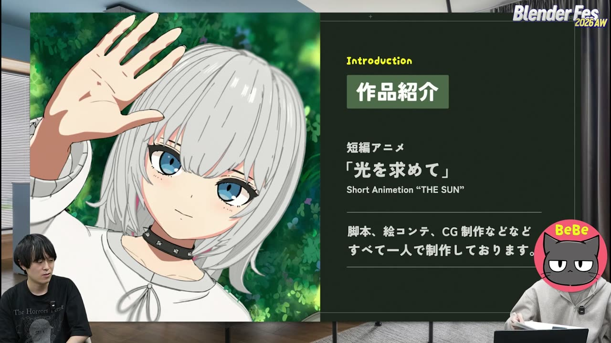

---

## セッション概要

| 項目 | 内容 |
|:---|:---|
| **タイトル** | アニメルックのつくりかた |
| **イベント** | Blender Fes 2026 AW Day1 |
| **形式** | オンライン配信（講演＋ソフトの画面を使った実演） |
| **日時** | 2026年9月26日（土）13:45–14:45（本編は 14:51 頃まで延長） |
| **登壇** | 炭猫べべさん（CG クリエイター） |
| **司会** | 藤田将さん |
| **使用バージョン** | 画面上の表示は Blender 4.5.3 LTS |

---

## 背景: 「アニメルック」とは何を指すのか

アニメルック（セルルックとも呼ばれます）は、3DCG をセル画のアニメのような見た目に仕上げる表現の総称です。輪郭線を描き、陰影の段階を減らし、色の情報をあえて潰すことで、物理的に正しいレンダリングから意図的に離れていきます。Blender で輪郭線を出す代表的な方法は、厚み付け（Solidify）モディファイアーで裏面を見せる方法と、グリースペンシルの **ラインアート（Line Art）** で線を自動生成する方法の二つです。

---

## セッション詳報

### 自己紹介と二つの作品（13:45〜）

炭猫べべさんは Blender で短編アニメを制作し、完成作を YouTube で公開しています。普段は映像制作会社で背景モデラーとしてフルタイムで働き、帰宅後に自主制作を進めているそうです。

紹介された作品は、明るい見た目とは裏腹に重い物語を描いた **「光を求めて」**（THE SUN）と、女の子と猫の休日の朝を描いた約 1 分の明るい短編 **「ルナと猫のミミ」** の二本です。どちらも脚本、絵コンテ、CG 制作をすべて一人で手がけています。

### AI の波と「監督」への舵切り（13:49〜）

活動のきっかけは、CG の専門学校に入って半年ほどのころ（2021〜2022 年ごろ）に訪れた画像生成 AI の盛り上がりでした。3 か月かけて作った背景の静止画を、数分で出力された AI の画像が上回ったことに強い衝撃を受けたそうです。

そこで、最後まで価値が残るのは作品全体を決める「監督」ではないかと考え、CG ソフトの勉強をいったん止めて脚本や絵コンテの勉強に時間を振り向けたといいます。就職先は当初の目標どおり背景モデラーでしたが、この判断が現在の自主制作につながっています。

### 監督としての勉強（13:52〜）

短編アニメを作るには CG の技術だけでは足りない、という考えから、次の教材が紹介されました。

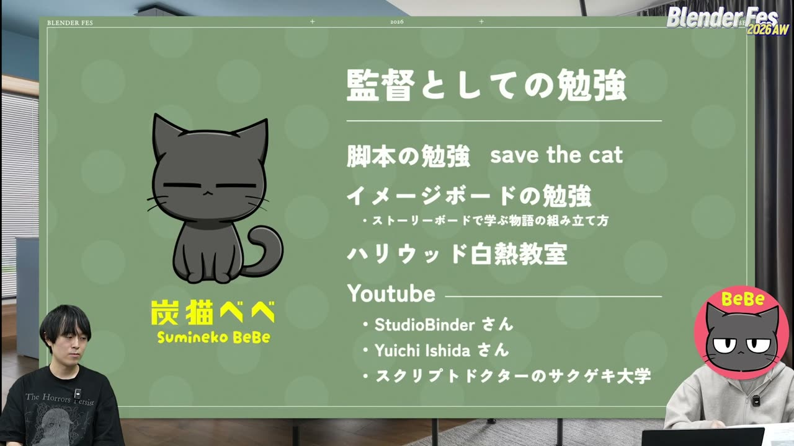

| 分野 | 教材 | 紹介されたポイント |
|:---|:---|:---|
| 脚本 | 『SAVE THE CAT の法則』 | ジャンルごとに押さえる点が分かる（ホラーなら逃げ出せない状況を作る、など） |
| イメージボード | 『ストーリーボードで学ぶ物語の組み立て方』（表記要確認） | 興味を引き続けるナラティブ・クエスチョン、メタファー、テーマの入れ方 |
| 映画づくり全般 | 「ハリウッド白熱教室」 | 映画づくりの基本を手軽に学べる |
| 構図・カメラワーク | StudioBinder（YouTube） | 実在の映画の場面で構図やカメラワークの狙いを解説 |
| 音・絵コンテ | Yuichi Ishida さん（YouTube） | 音の入れ方、絵コンテの作り方 |
| 脚本の直し方 | スクリプトドクターのサクゲキ大学（YouTube） | どこを直すと物語が面白くなるかをプロの脚本家が解説 |

### 映画体験と Blender への移行（13:58〜）

学生時代にはアート映画も幅広く見て、パク・チャヌク監督やダーレン・アロノフスキー監督に強く影響を受けたそうです。卒業制作で短編アニメを完成させて手応えを得たあと、無料で使える Blender で個人制作を始めました。本人はもともと Maya のユーザーで、仕事でも 3ds Max や Maya が中心だと話していました。

### 「光を求めて」の制作体制（14:01〜）

アニメルックを選んだ理由は、見た目の好みに加えて **コスト削減** でした。スライドには、アニメの方が見てもらえるかもしれないという狙いも挙がっていました。卒業制作では Arnold のレンダリングの重さに苦しんだそうです。現在の制作マシンは 7 年ほど前のゲーミングノート PC 1 台のため、シェーダーをできるだけ使わず、最終出力もビューポートレンダリングで済ませています。

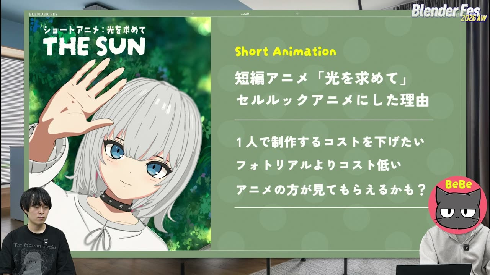

| 工程 | 使用ツール |
|:---|:---|
| モデリング | Blender |
| テクスチャ | Adobe Illustrator（主）、Photoshop・生成 AI（補助） |
| リギング | Rigify（Blender 同梱のリグ生成アドオン） |
| 髪の揺れ | Wiggle 2（表記要確認） |
| レンダリング | EEVEE |
| コンポジット | After Effects（主）、Blender のコンポジター（グレアや色収差を使うとき） |

制作期間はおよそ 7 か月で、そのうち 4 か月をシーン構築とアニメーションに充てています。平日は帰宅後に 2 時間ほど、あとは週末に作業を積み上げたそうです。

音楽は Artlist などのサービスを普段から流し聞きし、良い曲をストックしておくそうです。完成してから探すと見つからずに悩むことが多いからです。

### グリースペンシルで手描き風の線を作る（14:06〜）

ここから本題の実演に入りました。題材は「光を求めて」の主人公です。

グリースペンシルを使った理由は、厚み付けモディファイアーと裏面非表示を組み合わせる定番の方法では線が均一になり、手描きらしい歪みが物足りなかったためです。

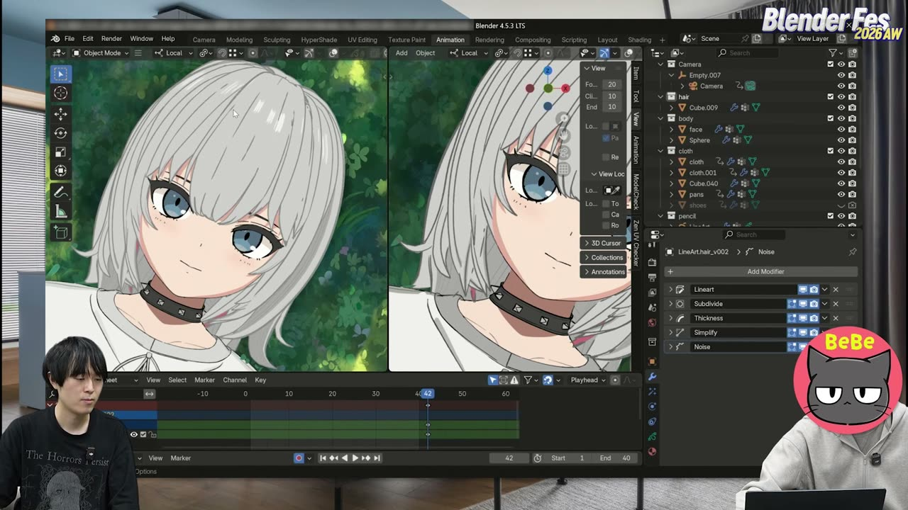

髪の線は、次の手順で作られていました。

1. 髪のオブジェクトが入ったコレクションを選び、Shift+A から **グリースペンシル → コレクションラインアート** を追加する
2. Line Art モディファイアーの **Line Radius** で太さを下げ、**Edge Types の Crease Threshold** を 138 度前後に調整する。180 度にするとわずかな角度でもポリゴンの境目に線が出てしまうため、ビューポートを見ながら値を探ります
3. **Intersections** のチェックを外す。髪はパーツ同士がぶつかりやすく、交差部分に線が出ると 3D らしさが目立つためです
4. マテリアルのベースカラーを、髪の明るいグレーに合う淡いグレーにする
5. **Subdivide** モディファイアー（レベル 2 程度）で、カールした部分のカクつきを滑らかにする
6. **Thickness** モディファイアーを追加し、Influence の **Custom Curve** を山なりにする。ストロークの始点と終点が細くなり、手描きの「入り抜き」が生まれます
7. **Simplify** モディファイアーを **Sample** モードにし、長さを非常に小さい値にしてポイントを細かく打ち直す
8. **Noise** モディファイアーで位置と太さに小さな揺らぎを加える

7 の手順は見た目がほとんど変わりませんが、ノイズを効かせるための下準備です。ポイントが少ないとノイズをかけても線が動かない点は、ジオメトリーノードでカーブを扱うときと同じだと司会が補足していました。モディファイアーの重ね順でも結果が変わります。

> ちょっとの微調整が、全体の空気感や雰囲気につながってくる。

### 線を出す場所・消す場所をコントロールする（14:16〜）

自動生成された線は、放っておくと目の周りにもぐるりと出てしまいます。そこで、顔の線を部分的に消す方法が紹介されました。

1. 髪用のラインアートを複製し、対象コレクションを顔の入った body に変更する。線を細くし、黒いマテリアルに差し替える
2. 顔のメッシュに新しい頂点グループを作り、ウェイトペイントで線を消したい部分を塗る。シンメトリーの X を有効にしておけば左右が同時に塗れます
3. ラインアート側のグリースペンシルオブジェクトにも頂点グループ（例: eye_mask）を作る
4. Line Art モディファイアーの **Vertex Weight Transfer** で、Filter Source に顔側の頂点グループ、Target に eye_mask を指定する
5. **Opacity** モディファイアーを追加し、Influence の Vertex Group に eye_mask を指定して、Opacity Factor を 0 にする

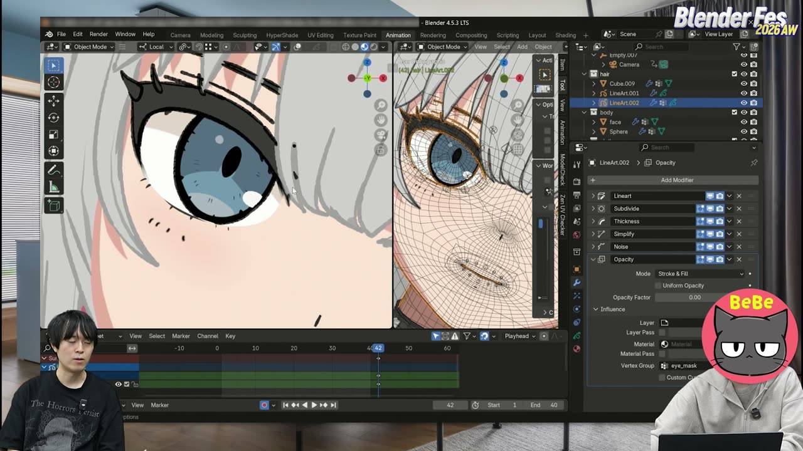

これで塗った部分の線だけが消えます。ウェイトを 1 ではなく中間の値で塗れば線は半透明になり、作品では口の中央だけ線が少し透ける表現に使っていました。消す、途切れさせる、薄くするをウェイトで描き分けられます。

### 影とハイライトはテクスチャに描く（14:22〜）

顔や髪の影とハイライトは、ライティングではなく **すべてテクスチャに描き込んだもの** でした。カメラを固定し、その視点から見える部分にだけ影色を描いています。カットごとにカメラが決まっているアニメ制作ならではの割り切りと言えます。

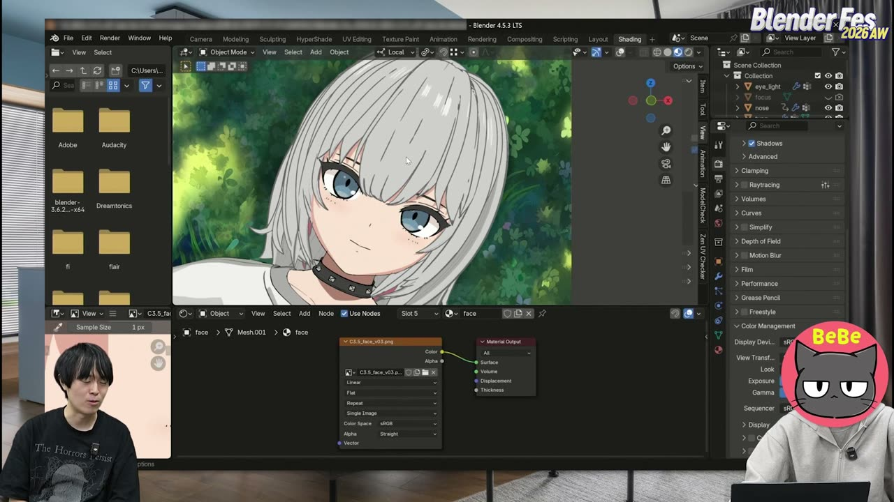

シェーダーも、画像テクスチャを Material Output に直接つないだだけです。このとき **カラーマネジメントの View Transform を Standard に変更する** 必要があります。既定の AgX のままだと、テクスチャの色がそのまま表示されないためです。司会の藤田さんも、最初に変えるべき項目だと強調していました。

最終出力には通常のレンダーを使わず、**ビューポートレンダー（Viewport Render Animation）** で書き出した素材をそのままコンポジットに回しているそうです。

### Illustrator でテクスチャを作る（14:24〜）

キャラクターのテクスチャは、ほぼすべて Adobe Illustrator で作られています。ペイント系ソフトを使う人が多い中で、珍しい選択です。

UV の画像を下に敷き、図形（パス）を置いていく形でテクスチャを組み立てます。目の輪郭のような正円は機械的に見えるため、**効果の「ランダム・ひねり」** をかけて形を崩しています。アピアランスパネルに積んだ効果は、後から数値を変えたり、重ねがけしたりできます。炭猫べべさんはこれを「Blender のモディファイアーのようなもの」と表現していました。

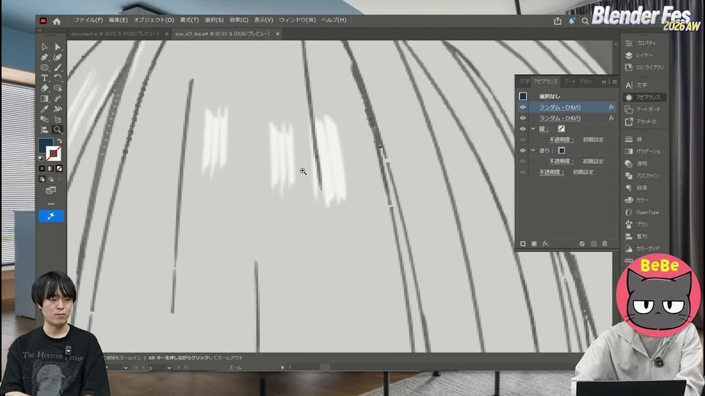

髪のハイライトも、同じ形のパスにそれぞれ違うランダム・ひねりをかけ、筆で描いたような揺らぎを出しています。さらに、パスに **ブラシ** を適用して鉛筆で引いたようなガタガタのタッチを付け、目の細部、頬の赤み、涙の跡、服のしわ、首元のラインなどを描いています。服のロゴは文字をアウトライン化してから歪ませています。

すべてパスなので、どれだけ寄っても荒れず、出力時に解像度を決めれば済みます。広いキャンバスをリファレンスボードのように使い、カットごとの瞳のバリエーションを並べて比べられるのも利点として挙げられました。

### シェーダーを組んだマテリアル（14:32〜）

「光を求めて」は画像テクスチャだけで仕上げていたため、シェーダーを作り込んだ例として「ルナと猫のミミ」のマグカップが紹介されました。

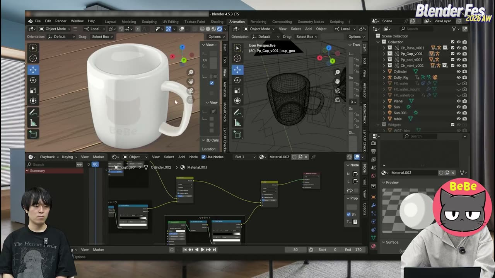

構成は、Illustrator で作ったテクスチャに「影」と「ハイライト」を順に重ねる形です。

- **テクスチャ**: 画像テクスチャの後に色相・彩度・明度を調整するノードを挟む
- **影**: Diffuse BSDF → **Shader to RGB** → Color Ramp で段階を作り、Mix Color の **比較（暗）**（Darken）でテクスチャと合成する
- **ハイライト**: Glossy BSDF → Shader to RGB → Color Ramp で作り、**加算**（Add）で上乗せする。陶器らしいキラリとした光沢が縁に乗ります

Shader to RGB は EEVEE 専用のノードです。合成モードは乗算なども試したうえで、暗くなり方が濁らない比較（暗）に落ち着いたそうです。暗い方を採って情報量を潰す合成は、セルルックのデフォルメと相性が良いと言えます。

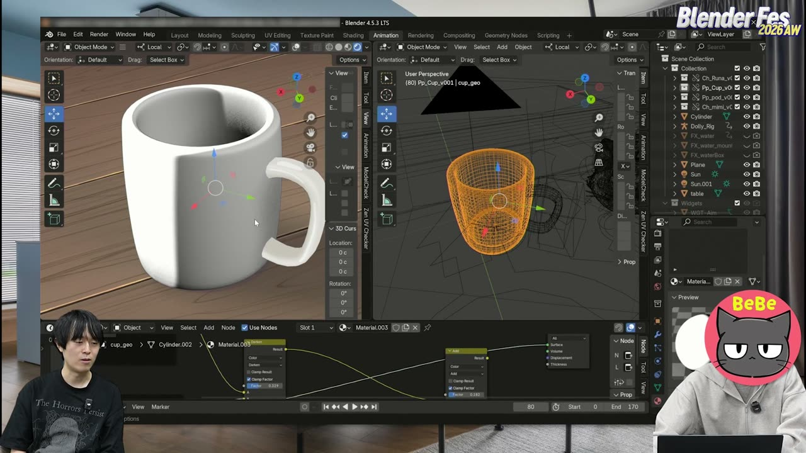

> 思った通りの絵ができるのが、セルルック CG の面白いところ。

司会のこの言葉のとおり、Photoshop のレイヤーを重ねる感覚で、ファクターを動かしながら見た目を詰めていけるのがこの組み方の強みです。

### プロジェクションマッピングで背景を作る（14:38〜）

最後はシーン構築です。一人制作ではキャラクターに時間をかけたいため、背景はモデリングせず、イラストを板ポリゴンや箱に投影する **プロジェクションマッピング** で作っているそうです。マットペイントを背景に使う感覚に近いと説明していました。

投影の前には、イラストのカメラの焦点距離、床からの高さ、ドアまでの距離、廊下の幅、天井の高さといった情報が必要です。ここで炭猫べべさんは、Claude にイラストを解析させて目安の寸法を出していました。

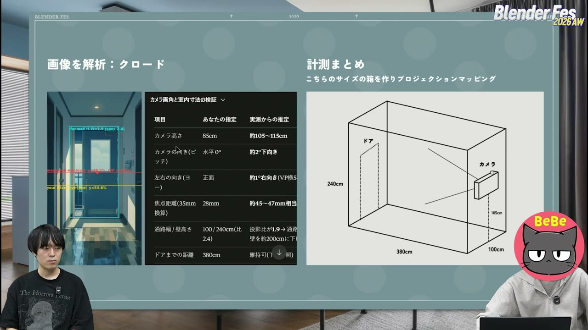

AI の寸法はまだ正確ではないため、最初のあたりとして使い、あとは手で合わせ込みます。

1. カメラの **Background Images**（下絵）にイラストを読み込み、カメラ視点で重ねる
2. 目安の寸法で作った箱の壁や天井を動かし、イラストに合わせる。焦点距離がずれるときは、画面のスクリーンショットを Claude に送って比較させ、値を詰めていく方法もある
3. 箱に **Subdivision Surface** を **Simple** モードでかけ、分割数を大きくして適用する。頂点が少ないと投影したテクスチャが歪むためです
4. イラストの画像をマテリアルに設定し、全頂点を選んで UV の **Project from View** を実行する
5. カメラに前進のアニメーションを付け、アドオン **Camera Shakify** で手ブレを加える

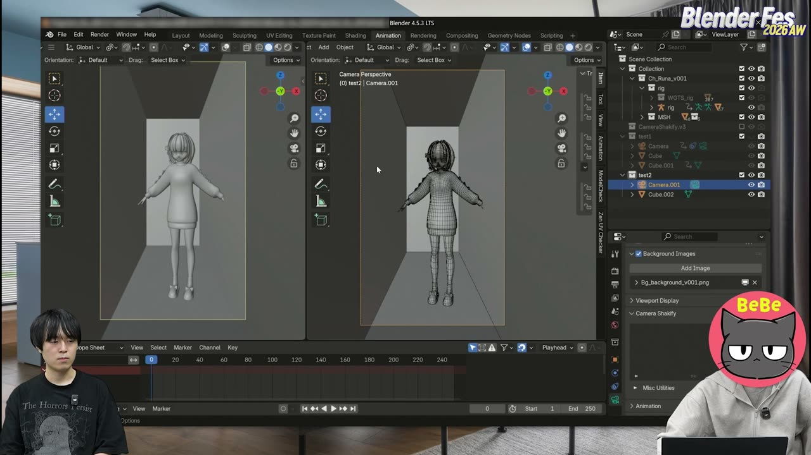

仕上げの例では、ドアだけを別の箱として投影してスライドさせ、廊下を進むとドアが開いて海が見えるカットを作っていました。テクスチャの情報量が多いので、単純な箱でも作り込んだ背景に見えます。

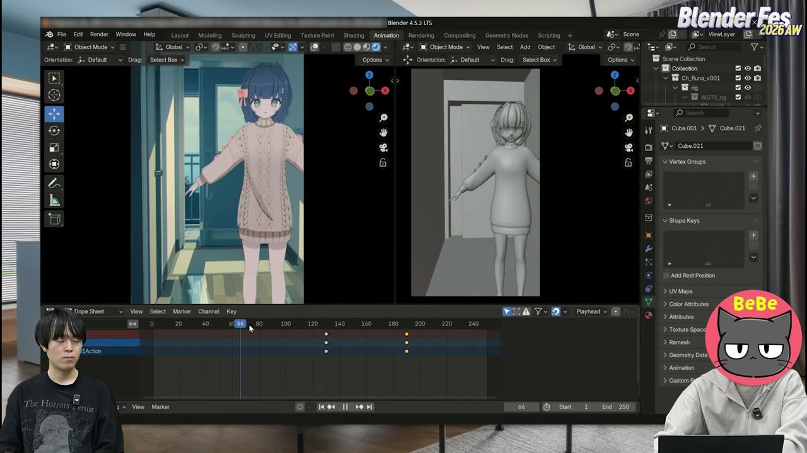

### AI 活用の広がり（14:48〜）

最後に AI 活用の話が広がりました。炭猫べべさんは、服の UV 展開図を AI に渡してスペキュラーの色だけを足してもらったり、着色を任せたりする試みを紹介し、作品の服の一部に取り入れているそうです。継ぎ目などに多少の修正は必要なものの、最初のあたりとしては十分使えるという評価でした。司会の藤田さんも、ラフから最終レンダリングのイメージを AI に見せてもらい、方向性を早めに見通すのに使っていると話していました。

### 締めくくり（14:50〜）

質疑応答の時間はなく、実演の終了とともにセッションは締めくくられました。炭猫べべさんは、今後も Blender の活用法や短編アニメの作り方を発信していくと話しました。司会の藤田さんは、ピクセルではなくベクターでテクスチャを作るような細かい積み重ねが、くっきりした目元などの作風につながっていると分かり感心した、と感想を述べていました。

---

## 登壇者紹介

### 炭猫べべさん（CG クリエイター）

登壇時の自己紹介によると、映像制作会社で背景モデラーとして働きながら、Blender で短編アニメを個人制作しています。代表作は「光を求めて」「ルナと猫のミミ」です。

### 藤田将さん（司会）

本セッションの司会を務め、カラーマネジメントや合成モードについて実務的な補足を加えていました。

---

## まとめ

このセッションで繰り返し語られていたのは、**「3D っぽさ」は細部の積み重ねで消える** という考え方でした。

| 領域 | 手法 | ねらい |
|:---|:---|:---|
| 線 | ラインアート＋Subdivide／Thickness／Simplify／Noise | 均一な線に入り抜きと揺らぎを加える |
| 線の制御 | 頂点グループ＋Vertex Weight Transfer＋Opacity | 目元や口元の線を消す、薄くする |
| 影・ハイライト | カメラ固定でテクスチャに描き込み、View Transform は Standard | シェーダーを最小限にし、色をそのまま出す |
| テクスチャ | Illustrator のランダム・ひねりとブラシ | 手ブレのような形の揺らぎと、解像度に縛られない描画 |
| シェーダー | Shader to RGB＋Color Ramp、比較（暗）と加算で合成 | 物理的な正しさより、狙った絵を優先する |
| 背景 | Claude で寸法の目安を出し、Project from View で投影 | 背景のコストを下げ、キャラクターに時間を回す |

一人で短編アニメを作るという制約が、すべての判断の出発点になっていました。重いレンダリングを避け、背景を投影で済ませ、AI に寸法出しや下塗りを任せて、空いた時間をキャラクターと物語に注ぎ込む。技術の話でありながら、前半の「監督としての勉強」とひとつながりになったセッションと言えるでしょう。

---

## 参考リンク

- [Blender Fes 2026 AW「アニメルックのつくりかた」チャンネルページ](https://cgworld.jp/special/blenderfes/vol7/?channel=channel-944)
- [Blender Manual: Line Art Modifier](https://docs.blender.org/manual/en/latest/grease_pencil/modifiers/generate/line_art.html)
- [Blender Manual: Color Management](https://docs.blender.org/manual/en/latest/render/color_management/index.html)
- [Blender Manual: UV Project from View](https://docs.blender.org/manual/en/latest/modeling/meshes/editing/uv.html)
