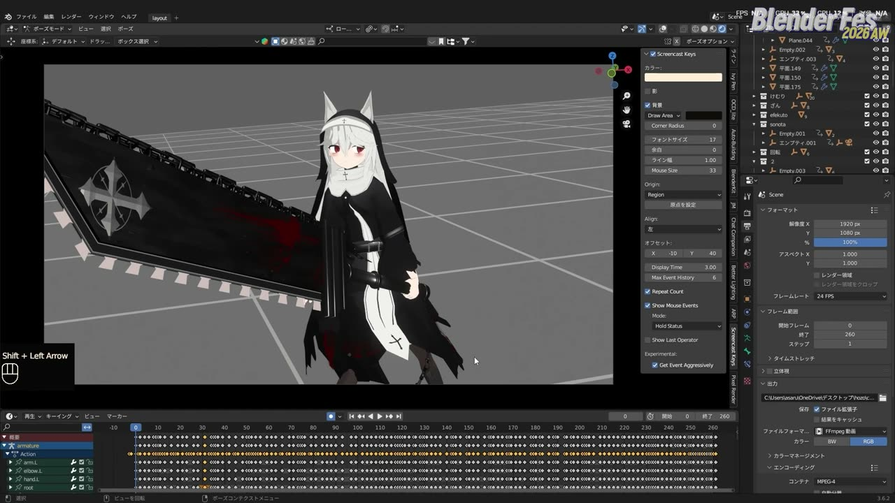
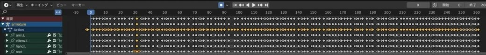
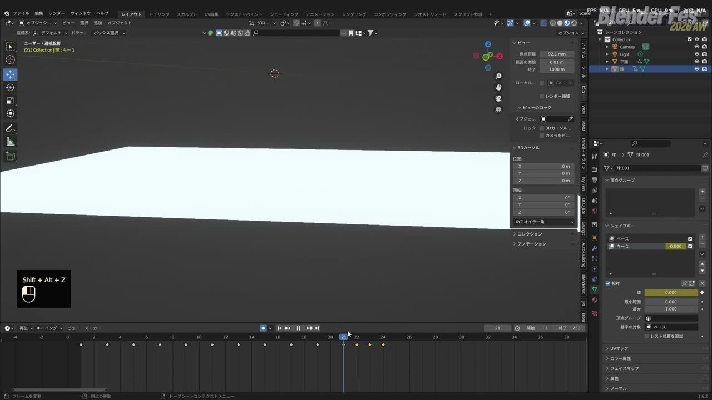
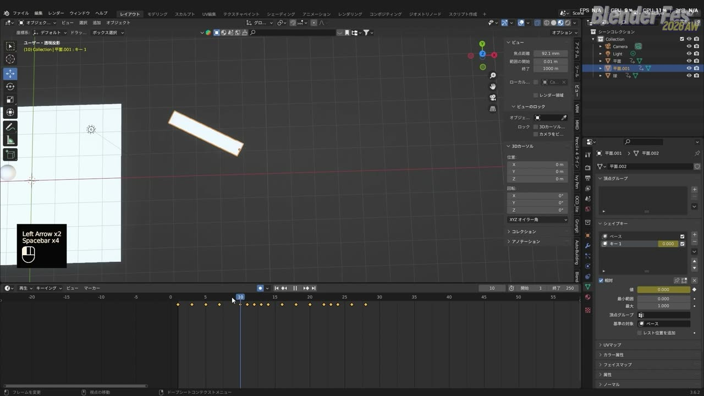
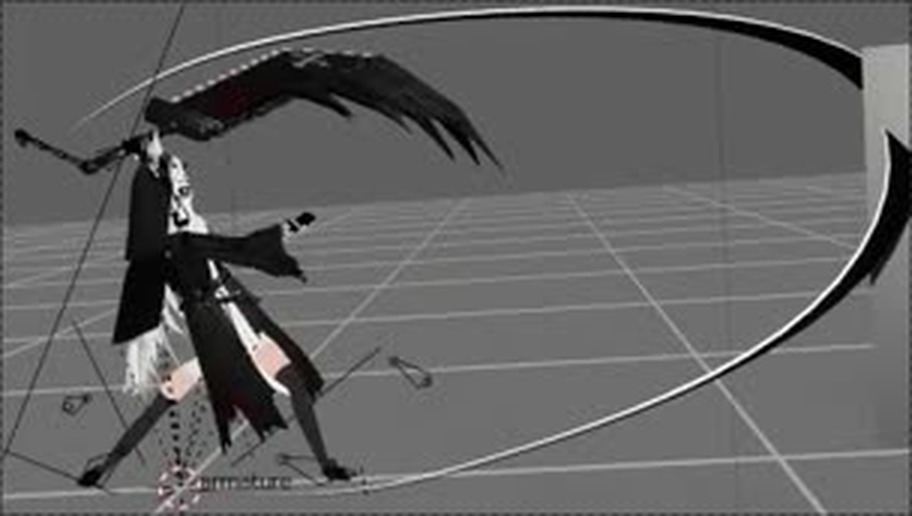
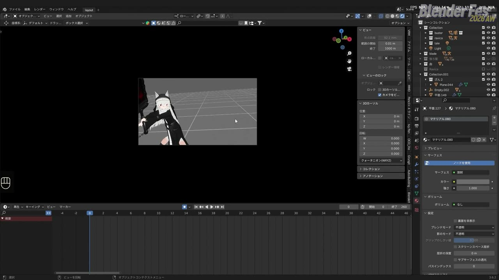
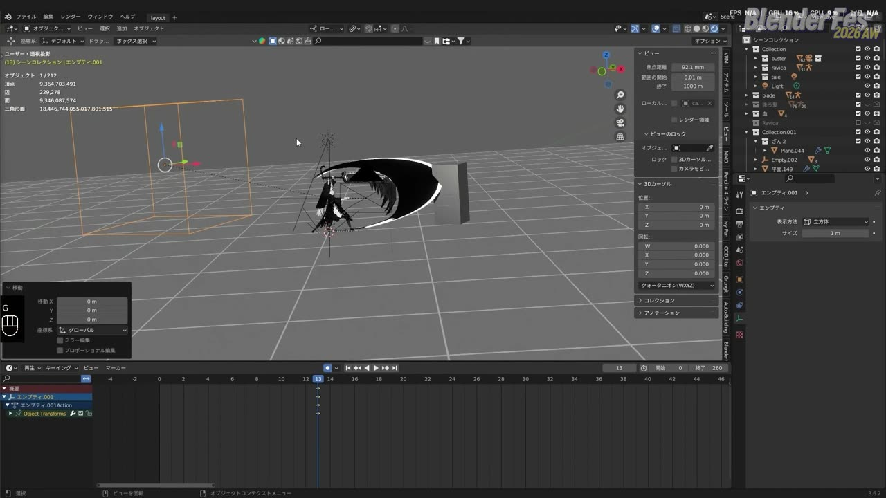
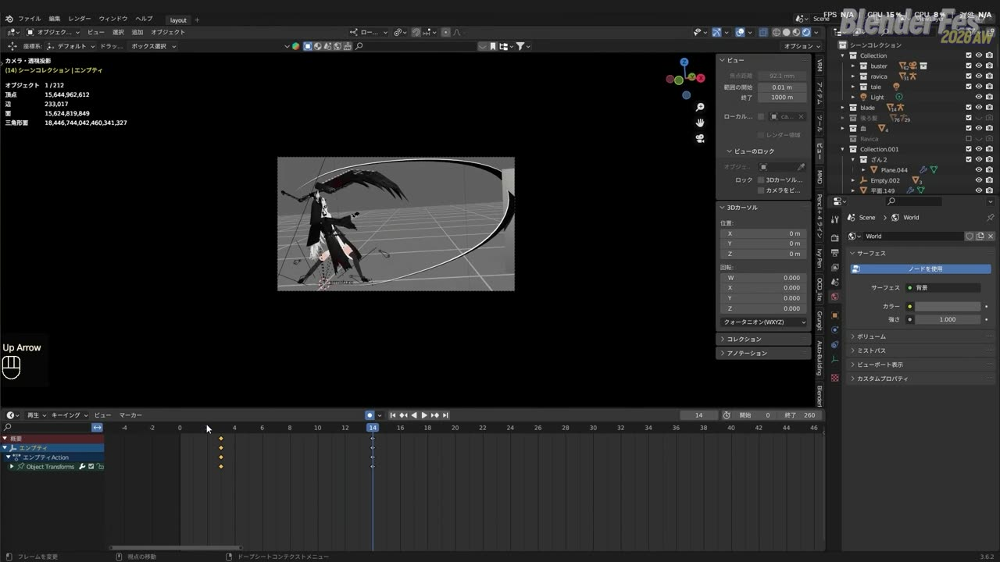
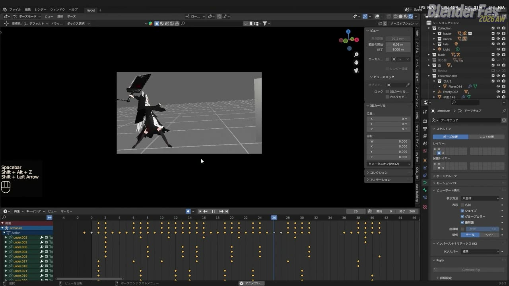
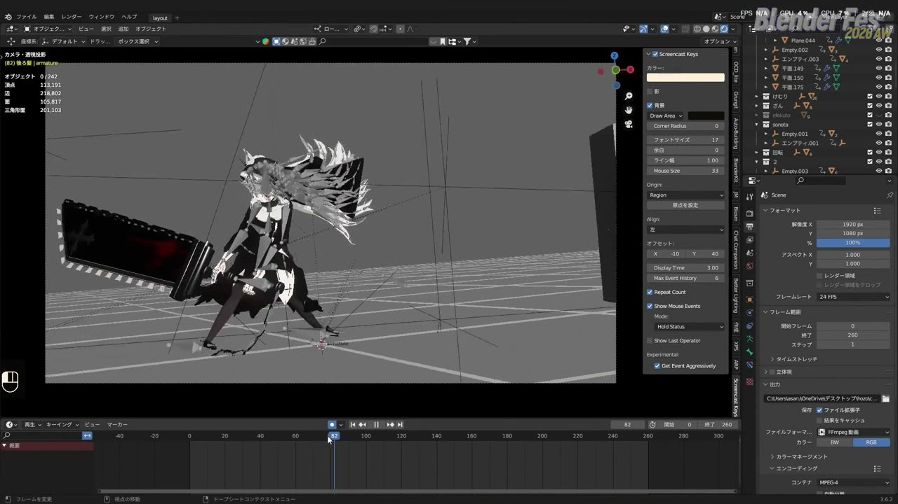

# Blender Fes 2026 AW: 「キレ」を意識した2Dアニメ的アクション演出 — コマを抜くほど動きが立つ

3DCG でキャラクターを動かすと、なぜか「ぬるっと」した印象になってしまう。そんな経験はないでしょうか。

3D ソフトはキーとキーの間をきれいに補間してくれます。そのおかげで滑らかな動きは簡単に作れますが、2D アニメのアクションシーンで感じるような「バシッと決まる」気持ちよさは、かえって出しにくくなります。

CGWORLD 主催のオンラインイベント「Blender Fes 2026 AW」Day1 の 15:00 からは、この問題を正面から扱ったセッション **「「キレ」を意識した2Dアニメ的アクション演出」** が配信されました。登壇者は、SNS を中心に Blender でアニメ調のアクション映像を発表している龍村某氏です。

講演は機能紹介ではなく、ポーズの作り方と「何を意識して動かしているか」を中心に、Blender の画面上で実際にモーションを組み立てながら進みました。本記事では、配信の内容をもとに、その考え方と手順を整理してご紹介します。

---

## セッション概要

| 項目 | 内容 |
|:---|:---|
| **タイトル** | 「キレ」を意識した2Dアニメ的アクション演出 |
| **イベント** | Blender Fes 2026 AW Day1（Blender Fes vol.7） |
| **形式** | オンライン配信（講演。Blender の実演が中心） |
| **日時** | 2026年9月26日（土）15:00–16:00 |
| **登壇者** | 龍村某氏 |
| **チャンネル** | [セッションページ](https://cgworld.jp/special/blenderfes/vol7/?channel=16) |

---

## 背景: なぜ3Dの動きは「キレ」にくいのか

チャンネルページの説明文は、このセッションの問題意識を端的に示しています。3DCG の動きは「滑らかで立体的」になりやすい一方、2D アニメらしい動きは必ずしも滑らかではありません。動きを飛ばす、形を崩す、タイミングを極端にする、カメラから見たシルエットを優先する。こうした「正確な 3D」からあえて外れる操作が、2D アニメ特有の気持ちよさにつながる、という整理です。

ここで鍵になるのが **リミテッドアニメーション** という考え方です。日本の TV アニメでは、1 秒 24 コマの映像に対して、同じ絵を 2 コマや 3 コマ続けて表示する「2 コマ打ち」「3 コマ打ち」が広く使われてきました。3 コマ打ちなら 1 秒あたり 8 枚、2 コマ打ちなら 12 枚の絵で動くことになります。絵の枚数が少ないぶん、止まる瞬間と一気に動く瞬間の差がはっきりし、それが独特のメリハリを生むと言われています。

3DCG でこの見え方を再現しようとすると、ソフトが自動で作る「中割り」をどう抑えるかが問題になります。講演はまさにこの点から始まりました。

---

## セッション詳報

### デモ映像とリミテッドアニメーション（15:01〜）

講演は、今回のために制作されたデモ映像の再生から始まりました。チェーンソーのような大剣を持った、シスター風の衣装の女の子が激しく戦うアクションです。

龍村某氏がまず注目してほしいと示したのは、画面下のタイムラインでした。すべてのキーフレームが縦一列にそろっています。シーン全体は 24fps のまま、キャラクターだけが 8〜12fps 相当のカクカクした動きになっているのが分かります。

この「キャラクターだけフレームレートを落とす」手法がリミテッドアニメーションで、今回の講演の中心になる概念だと説明されました。剣を振り下ろす瞬間のように動きが詰まっている部分だけコマを細かくし、それ以外は間引くことで、緩急を作ります。

なお龍村某氏は冒頭で、自分はかなり自己流で作ってきたので、これが唯一の正解ではなく一例として見てほしい、と前置きしていました。

### ボールで学ぶ基本の作り方（15:03〜）

最初の実演は、ボールが床に落ちるだけの、ごく基礎的なアニメーションでした。

まず普通にキーを打って滑らかな落下を作ります。次に、3 フレームごとにだけキーを打ち直し、キーの **補間モードを「一定」（Constant）** に切り替えます。すると、キーとキーの間で値が変化しなくなり、急にフレームレートが落ちたような見た目になります。これが一番基本的なリミテッドの作り方です。

ただ、均等に 3 コマ打ちしただけでは退屈な動きにしかなりません。龍村某氏はここで間隔に強弱を付け、ゆっくりな部分はキーを空け、速い部分はキーを詰めて、緩急のある落下に仕上げていきました。

### シェイプキーで作るアニメ的なブラー（15:05〜）

ここから「アニメらしさ」を足していきます。使うのは **シェイプキー** です。

ボールのメッシュの頂点を適当につまんで大きく引き伸ばし、残像のような形を作ります。これを動きが一番速いフレームにだけ仕込み、次のコマでは一瞬で消します。2D アニメでよく見る、速い物体が細長く伸びて描かれる「ブラー」や「スミア」と呼ばれる表現を、3D のメッシュ変形で再現するわけです。

1 コマしか映らない変形ですが、入れる前と後では印象が大きく変わり、龍村某氏も「ちょっとアニメっぽくなった」と手応えを語っていました。

### 伸び縮みと1コマの誇張（15:07〜）

続けてボールが奥へ跳ねて戻るアニメーションを追加しました。ここでは、普段のアニメーションではあまり使わない **ボーンのスケール（拡大縮小）** も積極的にキーに組み込みます。奥で「ぽよん」とつぶれ、戻るときは反動で細長く伸びる、といった具合です。

> こういう1フレームだけ押し込むというのが、リミテッドの面白いところでもあります。

同じ動きをフルコマ（すべてのフレームで動く状態）で見比べると、それはそれで悪くはないものの、味気なく感じられます。リミテッドのほうが、必要な情報だけがそろっていて気持ちがよい、というのが龍村某氏の評価でした。

### 剣の振りに応用する（15:09〜）

次に、同じ考え方を剣の振りに当てはめます。先ほどのボールを剣に見立て、2 回振り回すアニメーションを作り、それをリミテッドにしていきました。

手順はボールのときと同じです。動きの遅いところはコマを長めに取り、速いところだけ細かくキーを打ちます。フルコマ用に打っていたキーは邪魔になるので消しておきます。最後に補間を「一定」にすると、カクついた動きになります。

コマを割り直したいときは、手作業で足してもかまいません。いったん全キーを選んで補間を **ベジェ** に戻し、必要なフレームでキーを打ち直してから「一定」に戻す方法も紹介されました。

ブラーは剣にも同じ要領で付けます。龍村某氏はメッシュを変形させていましたが、**グリースペンシル** を使える人ならそちらで描いても問題ない、とのことでした。エフェクトの有無を切り替えて見せると、差は一目瞭然です。

作業そのものはキーを打って頂点を伸ばすだけなので、フルコマで作り込むよりずっと簡単に見えます。だからこそ動きの発想力が問われ、そのセンスを磨くことがリミテッドアニメーションでは大事になる、と龍村某氏は強調しました。

### キャラクターのモーションを作る（15:14〜）

基礎編を終えて、いよいよ実際のキャラクターで、剣を振り上げるモーションを作ります。

流れは次のとおりです。

1. 最初の構えのポーズを作る
2. 振り終わりのポーズを作る
3. 間を割ってポーズを足し、緩急とキレを出す（振り上げる前にもっとぐっと踏み込ませる、など）
4. リミテッド化する（遅い部分はキーを空け、速い部分は 1 フレームずつ詰める）
5. 採用したフレーム以外のキーを消す

作業を速くするコツとして、`I` キーで出るキーフレーム挿入メニューの **「位置・回転・スケール」** を、何かしらのショートカットに割り当てておくと便利だと紹介されました。

リミテッドにした直後は「間が抜けている」「重さを感じない」と感じた箇所を、コマを足したり消したりしながら調整していきます。剣が描く軌跡がもっと大げさに見えるよう、腕の角度も詰めていきました。

### 破綻は「カメラから見えるか」で判断する（15:23〜）

調整の途中で、龍村某氏は自分のやり方について率直に語っています。ゲームのモーションを作る人には怒られそうな作り方だ、というのです。

メッシュを直接変形させるので、ブラーのコマではモデルの形が大きく崩れます。モデラーによっては見たくない状態かもしれません。それでも、今回の技術はゲームよりアニメ映像寄りのものだと位置づけ、次のような姿勢で作っていると説明しました。

> カメラに映っているものが良ければ全て良し、みたいなマインドでやっております。

一方で、どうしても自然に見えない部分には手当てが必要です。デモでは右手の動きが不自然にガクッとしていたため、そのボーンのキーだけを消し、全体をベジェに戻して、ほかと同じフレームでキーを打ち直す、という対処を見せていました。自動補間だけでは直りきらず、最後は手作業で整えています。フレームを 1 枚消して振りをスピーディーにする、といった微調整も続きました。

### 斬撃エフェクトを手作業で作る（15:27〜）

モーションができたら、そこに足す斬撃エフェクトです。龍村某氏自身が「我流」「かなり脳筋な手法」と呼ぶ作り方ですが、手順は明快でした。

1. 平面を追加し、**サブディビジョンサーフェス** モディファイアーを強めにかけて、弧を描く斬撃の線（スラッシュライン）の形を作る
2. モディファイアーを適用する
3. 表示したいフレームにだけ見えるようキーを打つ（講演ではマスクなど方法は自由としつつ、手早く画面外へ動かして隠していました）
4. オブジェクトを複製し、キーを 1 コマずらして 2 枚目を作る。内側を削るなど形を少しずつ変える
5. さらに複製して 3 枚目を作り、薄く割るように削っていく
6. 最後のコマでは、各パーツの原点をそれぞれに設定し、見えなくなるまで縮めて消す

つまり、1 コマごとに別のオブジェクトを用意して、2D アニメの作画のように「1 枚ずつ絵を差し替える」発想です。斬撃の流れは円を描いているので、その流れに沿って変化させるのがポイントだと説明されました。

色については、黒も格好よさそうだと迷いつつ、白い複製を少し混ぜるといった試行を重ねていました。画面を見るかぎりマテリアルは「放射」（Emission）で作られていて、ライティングに左右されない、アニメのエフェクトらしいフラットな発色になっています。

龍村某氏はこの試行錯誤についても触れ、蛇足かもしれない実験で「思ったよりいいな」となることが多いので、遊び心を忘れずにいてほしいと話していました。

### カメラワークと画面揺れ（15:37〜）

エフェクトの次はカメラワークです。

龍村某氏は、カメラを直接動かすのではなく、**カメラ制御用のエンプティ** を置く方法をよく使うそうです。移動用、回転用、画面の揺れ専用、というように役割ごとにエンプティを分けておくと、あとから個別に調整できます。

今回は、剣を振り上げるときに画面が引くカメラワークを付けました。さらに迫力を出すために、振り上げの瞬間に画面の振動を加えます。揺れ専用のエンプティに、最初の 2 フレームは大きく、その後だんだん小さくなる揺れのキーを打ち、カメラと連動させる、という作り方です。

### 揺れ物もリミテッドにそろえる（15:42〜）

最後に、服の貫通を直し、スカートなどの揺れ物を付けます。ここにも一工夫があります。

1. 揺れ物のキーをいったんベジェに切り替えて、滑らかに揺れる動きを作る
2. 揺れ物のボーンをばらばらに選び、キーを少しずつずらしてフォロースルー（本体より遅れてついてくる動き）を出す
3. キャラクター本体のキーが縦にそろっているフレームで、揺れ物のボーンを全選択してキーを打つ
4. それ以外の余分なキーを消す

こうすると、服の揺れも本体と同じタイミングでリミテッドになります。揺れ物だけ滑らかに動いていると、せっかくのコマ打ちの印象が崩れてしまうので、最後に必ずそろえておくのが大切だと考えられます。

### まとめ: 大事なのは発想力（15:44〜）

講演の締めくくりで、龍村某氏は冒頭のデモ映像を流しながら、あのカットも特別に難しいことはしていないと明かしました。ポーズを作ってリミテッドにし、エフェクトを付け、カメラを揺らす。やっていることは、講演で見せた手順と同じだそうです。

> 結局リミテッドアニメーションにおいて一番大事なのは、発想力なのかなと僕は思っています。

足元に寄るカットを入れる、チェーンソーが回り始める瞬間を映す、外から見ると破綻しているポーズでもカメラから見て迫力があるなら思い切って崩す。そうした「こう動いたら格好いいのでは」という発想を育てることを、龍村某氏は何より重視していました。

技術は全部覚える必要はなく、必要なときに調べればよい、Blender には大体それを実現する方法がある、とも話しています。まず自分が何を作りたいのかを大切にし、思いついたものを Blender 上で動かしてみる。その繰り返しで、少しずつ自分なりのアニメーションになっていくのではないか、という言葉で講演は締めくくられました。

---

## 登壇者紹介

### 龍村某氏

講演内の自己紹介によると、普段は SNS を中心に Blender で 3D アニメーションを制作しており、アニメ調のキャラクターアニメーションやアクションシーンを手がけることが多いそうです。アニメーションは独学に近い形で身に付けてきたと話していました。

公式の肩書はCGアーティストです。

---

## 本セッションから持ち帰れること

講演で扱われた要素を、目的ごとに整理すると次のようになります。

| 目的 | 手法 | ポイント |
|:---|:---|:---|
| 緩急を出す | リミテッドアニメーション | 補間を「一定」にし、遅い部分はコマを空け、速い部分は詰める |
| 速さを見せる | シェイプキーのブラー | 最速の 1 コマだけ頂点を引き伸ばし、次のコマで消す |
| 弾力を見せる | ボーンのスケール | 1 コマだけ大きくつぶす・伸ばす誇張を入れる |
| 軌跡を見せる | 手作りの斬撃エフェクト | 1 コマごとに別オブジェクトを用意し、差し替えて見せる |
| 迫力を出す | カメラ用エンプティと画面揺れ | 役割ごとにエンプティを分け、揺れは最初の 2 コマを大きく |
| 統一感を保つ | 揺れ物のリミテッド化 | 本体のキーがそろったフレームに揺れ物のキーを合わせる |

どれも個々の操作は単純です。そのぶん「どのコマを残し、どのコマで崩すか」という判断に作り手の個性が出る、というのが講演全体を通したメッセージと言えるでしょう。

---

## まとめ

3DCG で 2D アニメのようなキレを出すには、ソフトが作る滑らかさをいったん手放す必要があります。龍村某氏の講演は、補間を「一定」にしてコマを抜くという、拍子抜けするほど単純な操作から始まりました。そこにシェイプキーのブラー、1 コマの誇張、手作りのエフェクト、揺れるカメラを重ねていくことで、冒頭のデモのような映像にたどり着きます。

もう一つ印象に残ったのは、「カメラに映るものが正解」という割り切りです。モデルの形が崩れても、画面の中で格好よく見えればよい。ゲーム向けの正確さとは別の物差しを持つことが、アニメ的な演出への近道なのかもしれません。

リミテッドアニメーションは、特別なアドオンがなくても Blender の標準機能だけで試せます。手元のキャラクターで、まずは 3 コマ打ちから始めてみると、動きの印象がどう変わるかを実感できるはずです。

---

## 参考リンク

- [Blender Fes 2026 AW 公式ページ](https://cgworld.jp/special/blenderfes/vol7/)
- [セッションページ「「キレ」を意識した2Dアニメ的アクション演出」](https://cgworld.jp/special/blenderfes/vol7/?channel=16)
- [Blender マニュアル: キーフレームの補間モード（Interpolation Mode）](https://docs.blender.org/manual/ja/latest/editors/graph_editor/fcurves/editing.html)
- [Blender マニュアル: シェイプキー](https://docs.blender.org/manual/ja/latest/animation/shape_keys/index.html)
