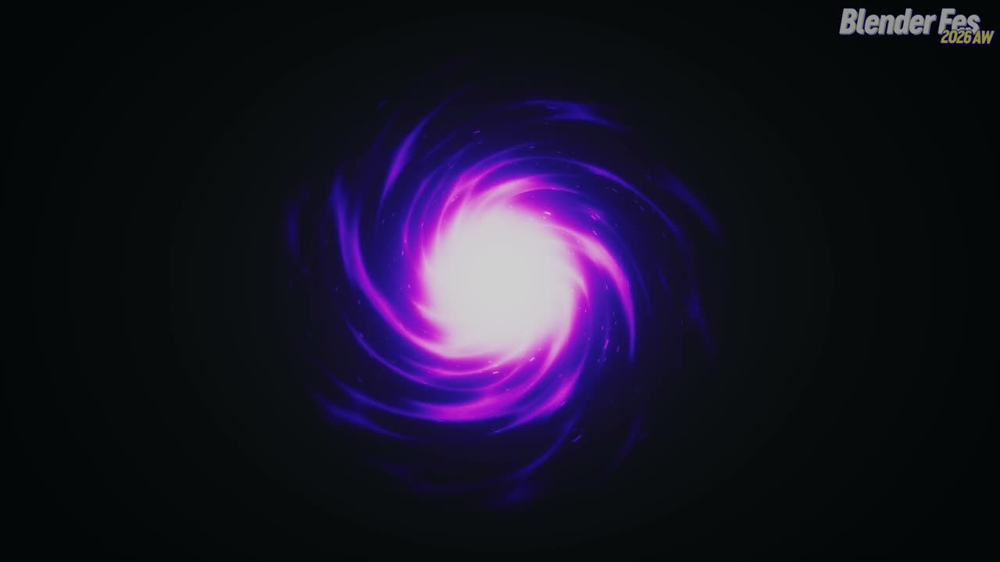
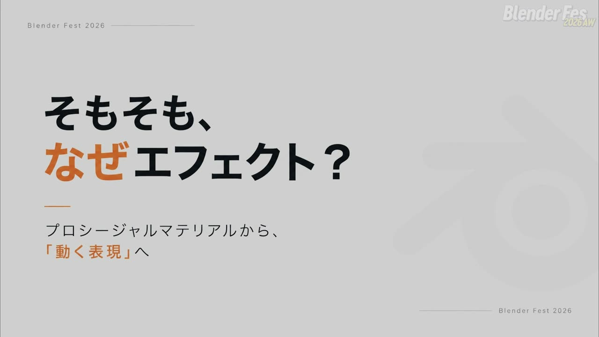
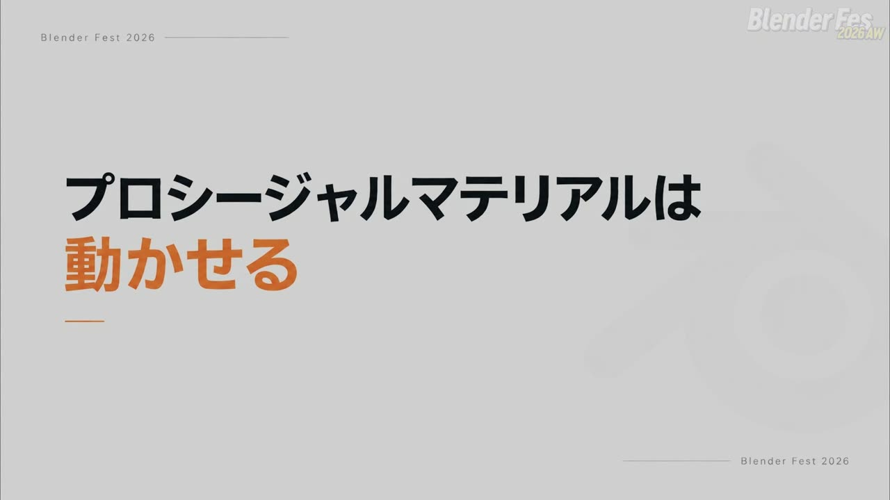
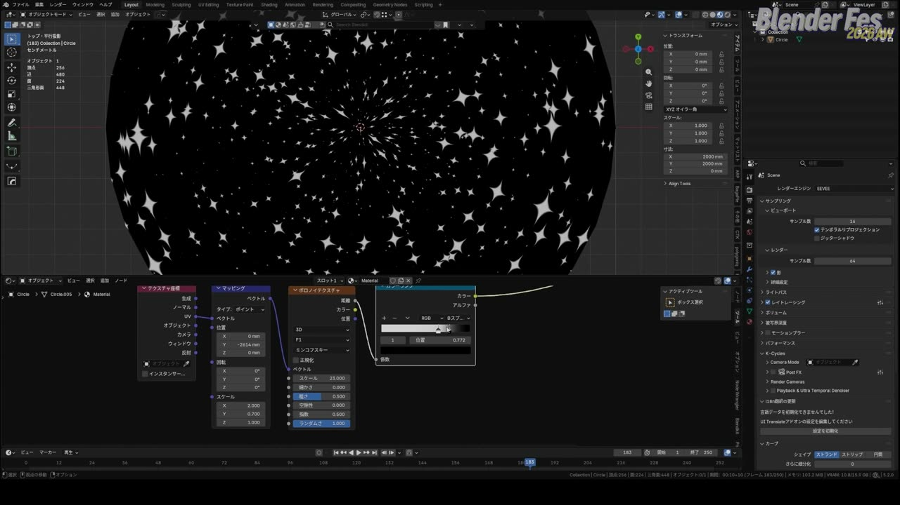
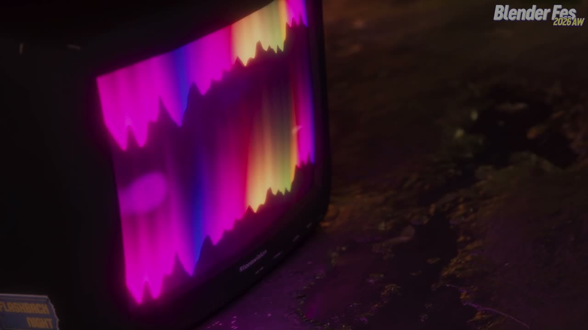
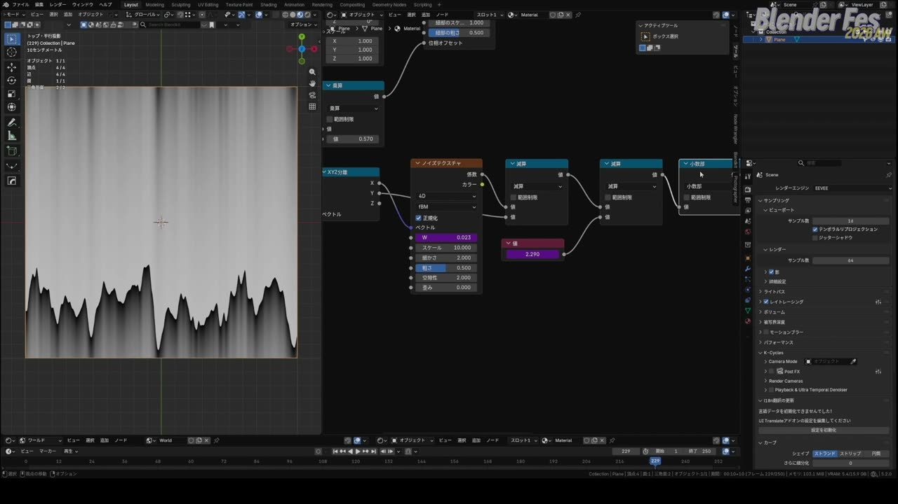
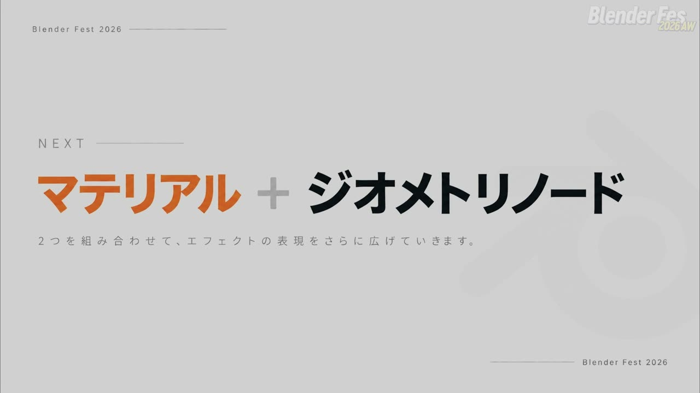
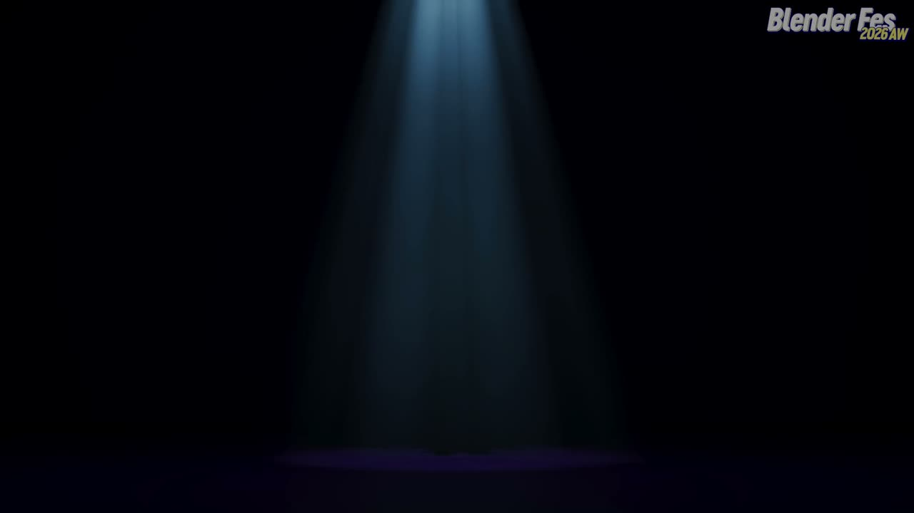
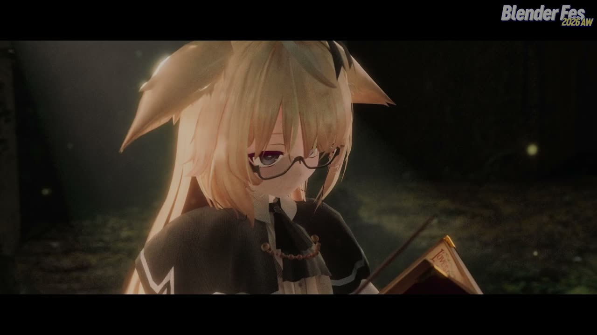
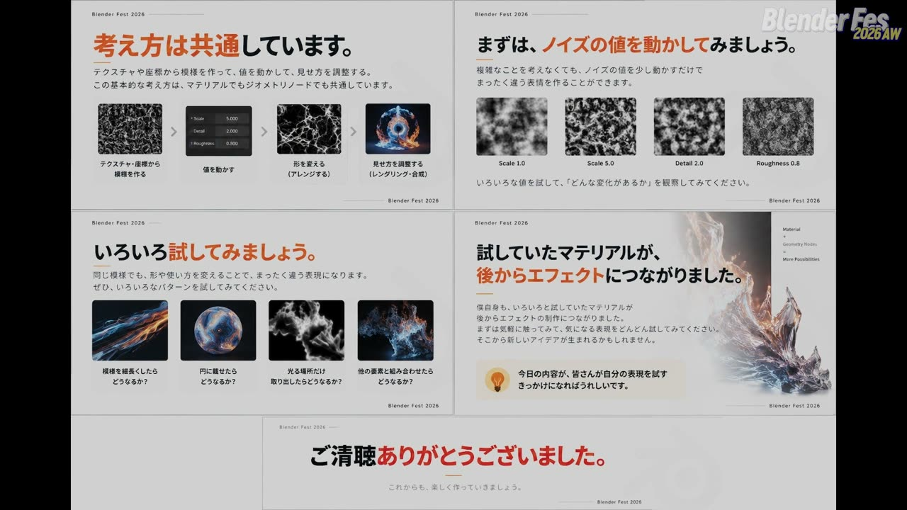

# Blender Fes 2026 AW: エフェクトを作ろう — 動くテクスチャで組み立てるエフェクトの考え方

渦を巻きながら光が中心へ吸い込まれていくブラックホールのような映像を見ると、複雑なシミュレーションを組んでいるように感じるかもしれません。

ところが、このセッションで紹介された作例の多くは、ノイズやボロノイといった標準のテクスチャを「動かす」ことから作られていました。

Blender Fes 2026 AW の Day1、16:15 から配信されたセッション **「エフェクトを作ろう」** では、牛乳瓶さんが Blender の標準機能だけで作るエフェクトを 3 つの作例で解説しました。ブラックホール風の渦、光が流れる模様、糸がほどけるようなトランジションです。

本記事では、配信を視聴した内容をもとに、各作例の組み立て方と、その背後にある考え方を整理します。

---

## セッション概要

| 項目 | 内容 |
|:---|:---|
| **タイトル** | エフェクトを作ろう |
| **イベント** | Blender Fes 2026 AW Day1 |
| **形式** | オンライン配信（講演とデモ） |
| **日時** | 2026年9月26日（土）16:15–17:15 |
| **対象** | 初・中級者向け |
| **スピーカー** | 牛乳瓶 |
| **使用アドオン** | Node Wrangler、Mio3 UV |

---

## 背景: 「複雑なシミュレーションに頼りすぎない」エフェクト

チャンネルページの紹介文では、このセッションの狙いを「標準機能を使ったシンプルなエフェクトの制作方法」と「それらを組み合わせて見栄えする演出に仕上げる考え方」としていました。形状・動き・タイミングを整理しながら組み立てる、という方針です。

ここでいう「プロシージャルマテリアル」とは、画像を貼るのではなく、ノイズやボロノイなどの数式で生成するテクスチャをノードで組み合わせて作るマテリアルのことです。数値を変えるだけで模様が変わるため、解像度に縛られず、調整がしやすいという特徴があります。

セッションでは、この「数値で決まる模様」を時間とともに変化させることが、エフェクト制作の出発点になると説明されていました。

---

## セッション詳報

### なぜエフェクトなのか（16:15〜）

牛乳瓶さんは冒頭で、Blender を始めたころにプロシージャルマテリアルを熱心に研究していたと振り返りました。みかんや畳、きゅうりの漬物といった質感を大量に作り、無料で配布していた時期もあったそうです。

その後 Substance 3D Painter を使い始めると、テクスチャを描いたほうが早く自由度も高いと感じ、プロシージャルマテリアルからは離れかけていたといいます。

転機になったのは、以前に作った回路のような模様が点滅するマテリアルでした。ボロノイテクスチャを 2 つ使い、4D の「W」の値を動かしているだけの単純な構造です。ここで「マテリアルは質感を作るだけでなく、時間で変化するものとして扱えばエフェクトになる」と気付いたことが、エフェクト制作の始まりだったと語られました。

講演の前提として、牛乳瓶さんは覚えるべきものを次のように絞っていました。

> 細かい数値やノードの接続を覚える必要はありません。

持ち帰ってほしいのは、テクスチャをどう動かし、どう加工するとエフェクトになるか、という考え方だと強調していました。

最初のデモはごく短いものでした。平面にノイズテクスチャを 1 つつなぎ、次元を 4D に切り替えると W という入力が増えます。この W を動かすと、ノイズの模様そのものが変化します。エフェクト作りは「この動く模様をどう加工し、どう見せるか」を考えることだ、と整理されていました。

### 作例 1: ブラックホール風の渦（16:17〜）

1 つめの作例は、紫色の光が渦を巻いて中心に吸い込まれていくエフェクトです。見た目は凝っていますが、仕組みは簡単だと説明されていました。

**メッシュと UV の準備。** 円に面を張って中央に穴を開け、シームを入れてからループカットを追加します。UV 展開したあと、Mio3 UV の機能で UV を格子状にそろえて正規化し、90 度回転させます。これで UV の下端が円の外周、上端が中心に対応する形になります。円のエフェクトを「帯」として扱えるようにする下準備です。

**流れる筋を作る。** ボロノイテクスチャに Node Wrangler の Ctrl+T でテクスチャ座標とマッピングをつなぎ、座標は UV を使います。カラーランプの補間を B-スプラインにして黒の位置を詰めると、筋状の模様になります。マッピングの位置 Y にドライバーで `#frame/-70` を入れると、フレームが進むにつれて模様が中心へ流れていきます。分母を大きくすると遅く、小さくすると速くなり、符号を反転すると流れる向きが逆になります。ここで動いているのはモデルではなく、テクスチャの座標です。

**細かい粒を重ねる。** 同じノード群を複製し、マッピングのスケールを変えてボロノイの距離関数をミンコフスキーにすると、星のようなきらめく粒になります。こちらは `#frame/-100` として、筋とは少し速度をずらして重ねます。

**マスクと発光。** UV の Y 成分を取り出して外周に向かって暗くなるマスクを作り、模様に乗算します。さらに中心だけ白くするマスクをミックスで重ねます。シェーダーは放射と透過 BSDF をミックスし、明るいところだけが光り、暗いところは透明になるように組みます。

**最後に形でねじる。** この時点では筋がまっすぐ中心へ向かうだけなので、メッシュの外側を選んでプロポーショナル編集を有効にし、Z 軸まわりに回転させます。影響範囲を調整しながら回すと全体がねじれ、渦になります。ねじれはシェーダーでも作れますが、メッシュを変形させるほうが手早いという判断でした。

> 全部を一つの方法で作ろうとせず、形で調整しやすいところは形で調整する。

### 完成品を分解して確かめる（16:28〜）

作例 1 の後半では、完成したノードを 1 つずつ表示して、それぞれの役割を確かめていました。

ノイズの筋だけでも中心へ流れる感じは出ています。ボロノイの粒はゆっくり明暗が変わり、細かい模様が流れの細部、大きな模様が全体の明暗の変化を受け持っています。2 つのマッピングを同じ速さにすると、模様の重なり方が変わって見え方も変わります。外周のマスクは、模様を面白くするためというより、メッシュの端を目立たせないためのものだと説明されていました。

新しいノードを大量に足さなくても、模様の組み合わせ、速度、見せる範囲、流れる向きを調整するだけで印象は変えられる、というのがこのパートのまとめです。

### 作例 2: 光が流れる模様（16:32〜）

2 つめの作例は、ブラウン管テレビの画面に映る、光が揺らめきながら流れる模様です。明るさの模様と色を別々の枝で作り、最後に組み合わせます。まず色をつけずに白黒で仕組みを確認する進め方でした。

**座標の一方向だけを使う。** UV とマッピングのあいだに「XYZ 分離」を入れ、X だけをノイズに渡します。すると、同じ X の位置では上下どこでも同じ値になるため、縦に伸びた模様になります。Y だけを渡すと横に伸び、分離せずにそのまま渡すと普段のノイズに戻ります。

> ノイズの設定を変えなくても、何を座標として渡すかで模様の形は変わります。

筋状の模様が欲しいとき、ノイズを引き伸ばす以外にこうした方法がある、という指摘は応用が利きそうです。

**グラデーションを崩す。** 数式ノードの「減算」で、ノイズの値から UV の Y を引きます。高さに応じて明るさが変わり、その境界がノイズで凸凹した形になります。ノイズは色として使うだけでなく、グラデーションの形を崩す道具にもなる、という説明でした。

**「小数部」で繰り返す。** 数式ノードの「小数部」は、1.2 を入れても 2.2 を入れても 0.2 を返します。値が増えるたびに 0 から 1 の手前までを繰り返すので、明暗の縞が繰り返し現れます。負の値でも 0 以上 1 未満に収まるため、減算でマイナスになった部分も扱えます。Y を 3 倍してから小数部を通すとグラデーションが 3 回並ぶ、という単純な例で仕組みを見せていました。

**2 種類の動きを分ける。** 小数部の手前でさらに `#frame/100` を引くと模様が流れ出します。加えてノイズの W にもドライバーを入れると、模様の凸凹そのものがゆっくり変化します。片方ずつ止めて比べると、減算が「流す」動き、W が「形を変える」動きを受け持っていることが分かります。速く流したいが形はあまり変えたくない場合は、流す側の分母を小さく、W 側の分母を大きくします。動きが落ち着かないと感じたら、どちらが強すぎるのかを分けて確認するとよい、という助言もありました。

**明るさと色。** 小数部のあとに「累乗」（指数 1.5）を入れて中間の明るさを落とし、メリハリをつけます。これを放射の強さにつなぎます。色は別の枝で、波テクスチャをリング・方向 Y・スケール 0.12 で使い、カラーランプで色を割り当てます。波テクスチャの位相オフセットに `#frame/30` を入れると、色も時間で変化します。値ノードのあとに乗算を挟んでおくと、速度の微調整が楽になるとのことでした。

最後に全体を振り返り、光る模様を作りたいときは「どんな形の模様にするか」「どう動かすか」「どこを明るくして何色にするか」を分けて考えるよう勧めていました。白黒で模様を確認し、動かし、明るさを整えてから色をつける順番なら、思いどおりにならなかったときにどの段階で差が出たのかを確かめやすくなります。牛乳瓶さん自身も、完成形のノードが最初から頭にあるわけではなく、途中の結果を見ながら組み立てているそうです。

### 作例 3: 糸がほどけるトランジション（16:52〜）

3 つめは、MV 制作で「糸がほどけるように」というオーダーに対して提案したトランジションです。本番ではパーティクルなども加えていたそうですが、説明用に簡略化されていました。構造は、発光しながら上から下へ現れるキャラクターと、その周りを光が走るパスの 2 つに分かれます。

**キャラクターの出現。** テクスチャ座標のオブジェクト出力から Z 成分を取り出し、値を足し引きして白黒のマスクを作ります。ここにノイズ由来の歪みをミックスで加えると境界が揺らぎ、その度合いもミックスの係数で調整できます。

**パスに沿って走る光。** カーブのパスに押し出しで幅をつけ、メッシュに変換して UV を見ると、端から端に対応した UV が自動でできています。パスの長さが違ってもこの座標を使える点が要です。UV からグラデーションテクスチャにつなぎ、数式ノードの加算で位置をずらし、カラーランプを通してアルファと色に振り分けます。

**マテリアルは共有し、値だけを個別に渡す。** 実際の制作ではパスが何本もあります。同じマテリアルを共有したまま値を動かすと全部が同じ動きになり、かといってマテリアルを複製すると、後で色を変えるときに 1 つずつ直すことになります。そこで、ジオメトリノードの「名前付き属性を格納」ノードで属性を作り、その値をグループ入力として公開しました。これでモディファイアーの欄から数値を入れられます。マテリアル側では属性ノードで同じ名前を指定して値を取り出し、光の位置をずらす加算ノードにつなぎます。

3 本のパスで試すと、選んだ 1 本のモディファイアー値を変えたときにそのパスの光だけが動きます。値にキーフレームを打ち、開始フレームを少しずつ遅らせると、順にほどけていくような流れが生まれます。MV なら音に合わせて一気に動かしたり、少し残したりといった調整もできます。光の色を変えたいときは、共通のマテリアルを 1 か所直すだけで 3 本ともそろって変わり、ずらしたタイミングはそのまま残ります。

> 実際の制作では完成させることだけでなく、後から変更しやすくしておくことも大事だと思っています。

全体でそろえたい色や光の幅は共通のマテリアルで、パスごとに変えたい位置やタイミングはモディファイアーで扱う、という分担です。ジオメトリノードは形を作るだけでなく、マテリアルを操作する窓口にもなる、という点がこのパートの要点でした。

### エフェクトを組み合わせた演出（17:03〜）

最後に、複数のエフェクトを重ねた作例が紹介されました。

杖の先から魔法陣が現れ（画像素材に出現アニメーションをつけたもの）、「これから何かが起こる」という入り口を作ります。続いて煙やパーティクルのシミュレーションが出て、煙がぶつかるタイミングに合わせてオブジェクトが変化します。この変化には Animax（表記要確認）というアドオンを使っているそうです。そこへ上から下へ光が走るマテリアルを重ね、変化の瞬間を強く見せていました。

ほかにも、空間に小さな光を浮かべる、杖の動きに合わせて先端を光らせる、窓から差し込む光をボリュームで作る、といった細かな要素がシーンの雰囲気を支えています。完成映像は複雑に見えても、分けてみれば「画像を出す」「模様を動かす」「光らせる」「形を変える」「煙や粒を重ねる」とそれぞれに役割があります。コンポジットでにじみや色を整える前提で素材を分けておくと、映像全体になじませやすくなるという補足もありました。

### まとめのメッセージ（17:06〜）

ブラックホール、光が流れる画面、糸がほどけるトランジションは、見た目はそれぞれ違います。それでも、テクスチャ座標から模様を作り、値を動かし、見せ方を調整するという考え方は共通している、とまとめられました。

> まずは、ノイズの値を動かしてみるところからで大丈夫です。

模様を細長くしたら、円に乗せたら、光る場所だけ取り出したら、と試していくことを勧めて、講演は締めくくられました。

---

## スピーカー紹介

### 牛乳瓶

講演冒頭の自己紹介では、Blender を中心に映像向けの 3DCG 制作を手がけていると話していました。公式の肩書はキャラクターアーティストです。

Blender を始めたころからプロシージャルマテリアルを研究し、自作マテリアルを無料で配布していた経験が、今回のエフェクト制作の土台になっています。講演全体を通じて、完成形を一気に作るのではなく、途中の結果を見ながら少しずつ組み立てる姿勢が一貫していました。

---

## まとめ

このセッションは、ノードの組み方そのものより「エフェクトをどう分解して考えるか」に重心を置いた内容でした。要点を表にまとめます。

| 作例 | 使った仕組み | 持ち帰りたい考え方 |
|:---|:---|:---|
| ブラックホール風の渦 | 円の帯 UV、ボロノイ 2 種、`#frame` ドライバー、放射と透過のミックス、プロポーショナル編集 | 動かすのはモデルではなく座標。形で直せるところは形で直す |
| 光が流れる模様 | XYZ 分離、減算、小数部、ノイズの W、累乗、波テクスチャ | 渡す座標で模様の形が変わる。流す動きと形を変える動きを分ける |
| 糸がほどけるトランジション | カーブの UV、名前付き属性の格納、属性ノード、モディファイアーのキーフレーム | 共通の見た目と個別の動きを分け、後から変えやすくしておく |

プロシージャルマテリアルを「質感」ではなく「時間で変わるもの」として見直すと、同じノードがそのままエフェクトの部品になります。まずはノイズを 1 つ置いて W を動かしてみる、という小さな一歩から試してみると、この講演の考え方がつかみやすいでしょう。

---

## 参考リンク

- [Blender Fes 2026 AW「エフェクトを作ろう」チャンネルページ](https://cgworld.jp/special/blenderfes/vol7/?channel=channel-941)
- [Blender Manual: Voronoi Texture Node](https://docs.blender.org/manual/en/latest/render/shader_nodes/textures/voronoi.html)
- [Blender Manual: Math Node](https://docs.blender.org/manual/en/latest/render/shader_nodes/converter/math.html)
- [Blender Manual: Store Named Attribute Node](https://docs.blender.org/manual/en/latest/modeling/geometry_nodes/attribute/store_named_attribute.html)
- [Blender Manual: Node Wrangler](https://docs.blender.org/manual/en/latest/addons/node/node_wrangler.html)
