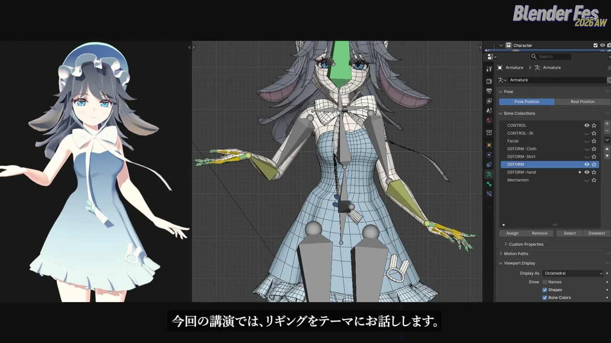
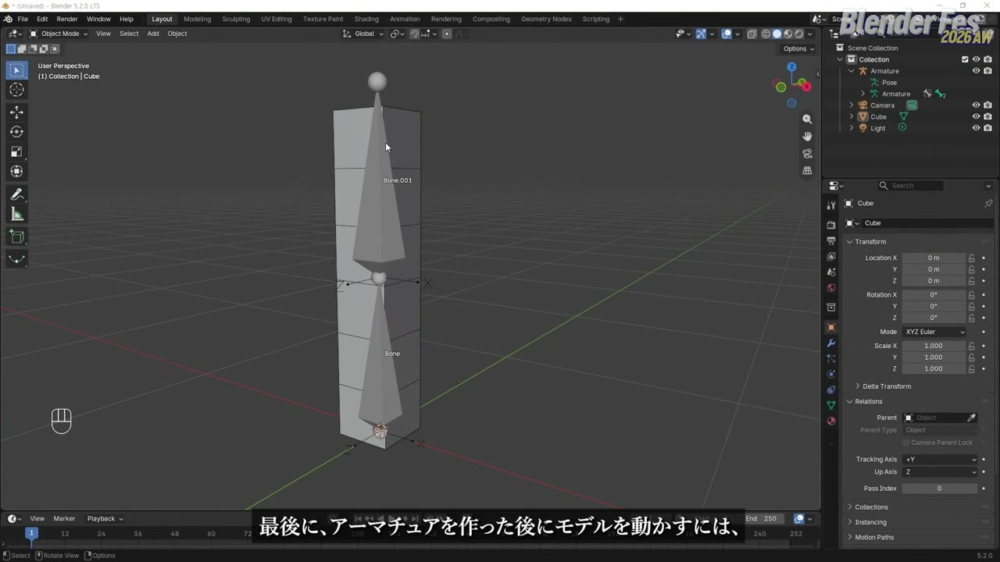
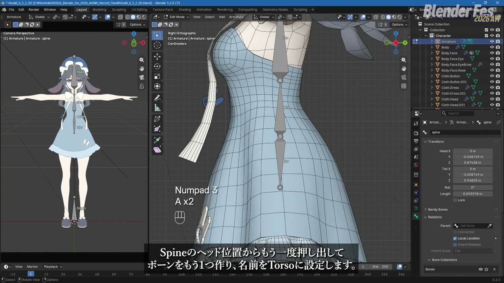
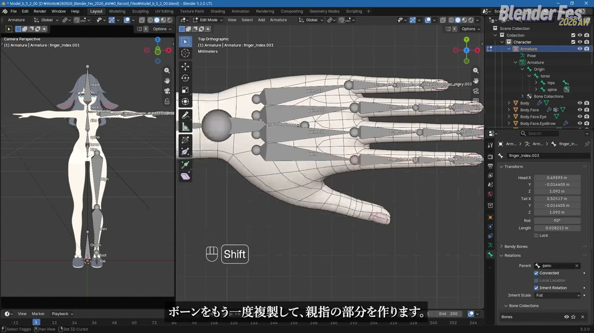
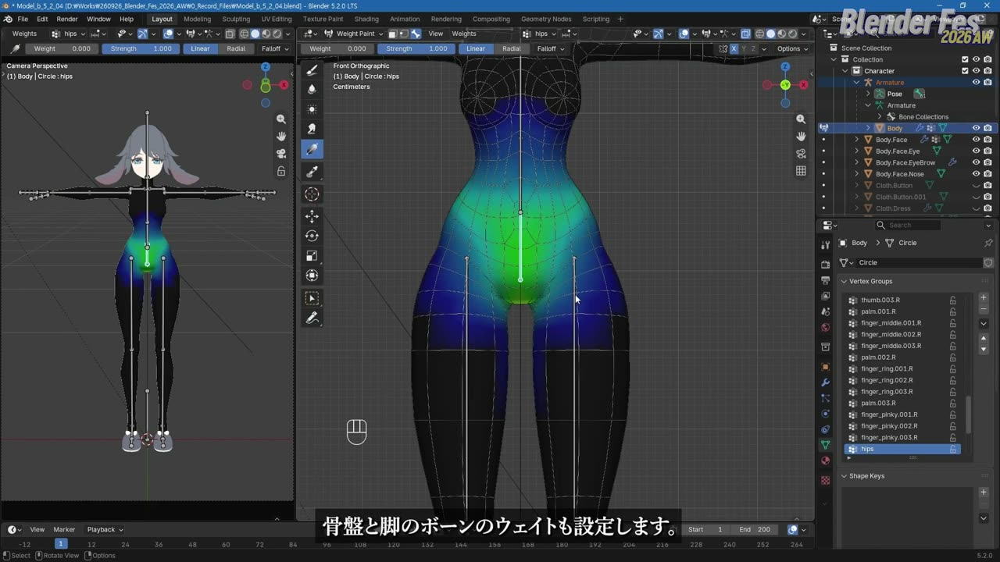
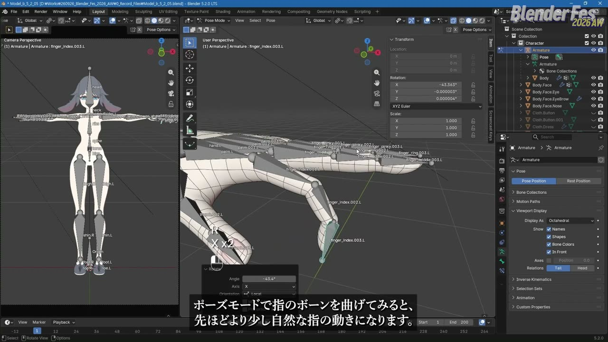
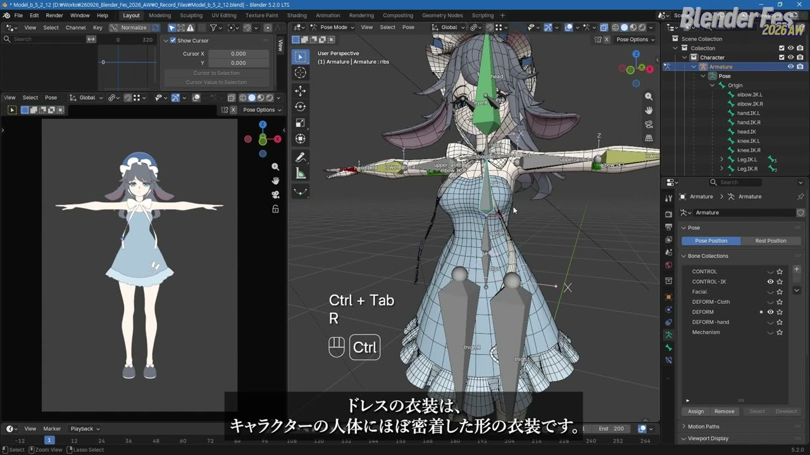
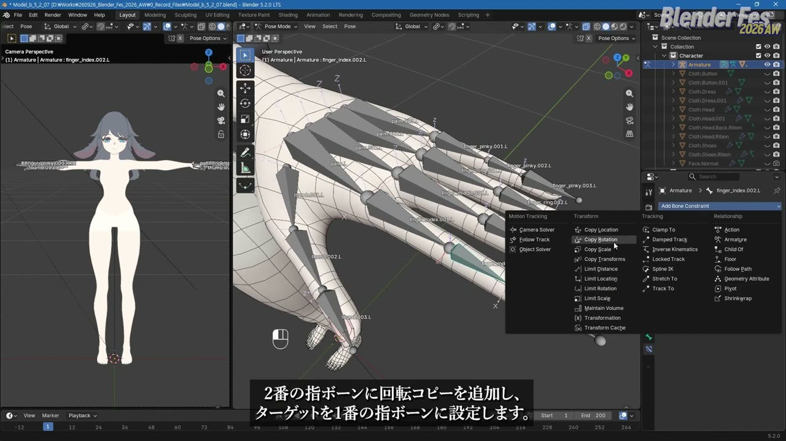
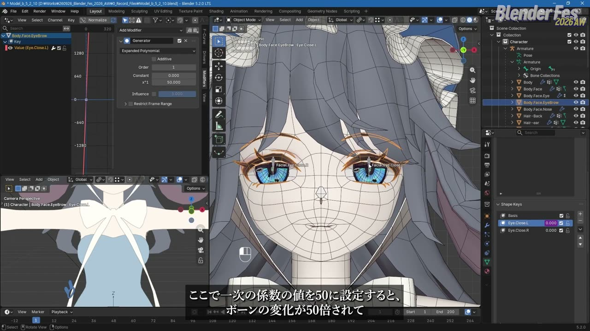
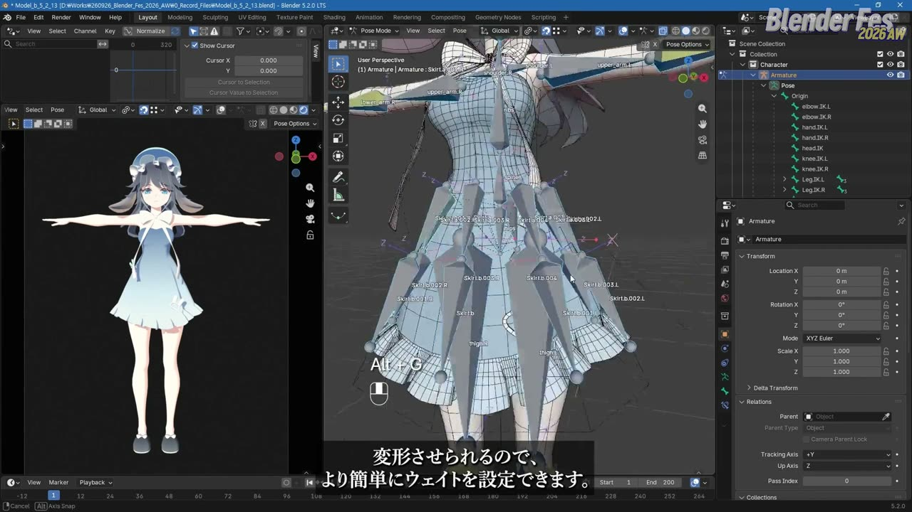

# Blender Fes 2026 AW: ボーン1本から始めるキャラクターリギング — アドオンに頼らず組み立てる人体・表情・衣装のリグ

リギングはアドオンで一式を生成して済ませる、という方も多いかもしれません。便利な反面、体型や衣装が変わったときに、どこを直せばよいか分からなくなることもあります。

Blender Fes 2026 AW の Day1、17:30 から配信された **「ボーン1本から始めるキャラクターリギング」** では、minusT さんが最初の 1 本のボーンから、IK、指のコントローラー、表情、衣装までを 1 体のキャラクターで組み上げました。

講演は全編が韓国語でした。本記事では、配信を視聴した内容をもとに、手順と考え方を日本語で要約します。

---

## セッション概要

| 項目 | 内容 |
|:---|:---|
| **タイトル** | ボーン1本から始めるキャラクターリギング |
| **イベント** | Blender Fes 2026 AW Day1 |
| **形式** | オンライン配信（講演とデモ） |
| **日時** | 2026年9月26日（土）17:30–18:30 |
| **スピーカー** | minusT |
| **言語** | 韓国語（本記事は日本語で要約。抽出した配信フレームには日本語字幕が表示されていました） |
| **使用バージョン** | Blender 5.2.0 LTS（画面表示より） |
| **使用アドオン** | なし |

---

## 背景: なぜ「ボーン1本から」なのか

リギングとは、モデルを動かすための仕組みを組む作業です。ボーンを追加し、各頂点がどのボーンにどれだけ引っぱられるか（ウェイト）を設定し、ボーンを扱いやすくするコントローラーを用意します。

minusT さんは冒頭で、リグの出来によってアニメーション作業の効率が変わると話していました。アドオンは便利ですが、状況によってはボーンを自分で構成しなければならない場面もあります。そこで今回は、アドオンを使わず標準機能だけで組む流れを見せる構成でした。

---

## セッション詳報

### リギングの基礎と回転モード（17:30〜）

最初はキューブとボーン 2 本の小さな例で基本を確認しました。アーマチュアには、ボーンの配置を作る **Edit Mode** と、ボーンを動かしてポーズを付ける **Pose Mode** があります。ボーンは Head と Tail の 2 点を持ち、Head を中心に回ります。押し出したボーンは元のボーンが Parent になり、**Connected** を外すと親子関係を保ったまま離して置けます。

続いて、チャンネルページで予告されていた回転の話です。同じ 2 つの向きにキーを打つと、Quaternion は最短経路でなめらかにつなぎ、Euler は少し横にぶれてから戻ります。自由に回るボーンには Quaternion が向いています。一方で Quaternion は 4 つの数値から向きを読み取りにくく、何回転もさせたいときは最短経路に負けてしまいます。

> 回転軸が決まっているボーンや、一方向に何回転もするボーンでは、Euler のほうが便利なことがあります。

スキニングは、オブジェクト、アーマチュアの順に選び、Ctrl+P の **Armature Deform → With Automatic Weights** で行います。Armature モディファイアーと頂点グループが追加され、Weight Paint モードで塗って調整できます。

### 人体のボーンを作る（17:38〜）

本編では、ピボットポイントを **Individual Origins** にして、ボーンが Head を中心に動くようにしてから始めます。最初の 1 本は全体を動かす **Origin** です。体の中心から胸、首、頭へ押し出し、背骨の Head から下へ骨盤を押し出します。さらに中間に **torso** を置き、spine と hips の親を torso、torso の親を Origin にします。

脚は hips を複製して作り、腕は肩から手まで押し出します。手のひらには palm を 4 本置き、それぞれから指を 3 本ずつ伸ばします。名前は Ctrl+F2 の **Batch Rename** でまとめて変えられます。

指のボーンは、正面から見て指の中心よりやや甲側に置くと、曲げたときに自然な形になりやすいそうです。左半分ができたら **Auto-Name Left/Right** で `.L` を付け、**Symmetrize** で右側を作ります。Alt+R でロールをリセットし、指はローカル X 軸が曲げる軸になるよう調整したうえで、回転モードを XYZ Euler にしていました。複数ボーンへの反映は右クリックの **Copy to Selected** です。

### ウェイトを整える（17:46〜）

Origin と torso は変形に関わらないので **Deform** をオフにします。自動ウェイトのあと、Armature モディファイアーを Subdivision Surface より上に移していました。頂点が少ない段階で変形させ、あとから細分化する順番です。体には Mirror モディファイアーが残っているため、`.L` 側だけ整えれば反対側にも反映されます。

Weight Paint は、アーマチュア、体の順に選んで入ると、Alt+クリックでボーンを選ぶだけで頂点グループが切り替わります。**Auto Normalize** をオンにし、ブラシ、**Gradient**、**Blur** で調整します。脚のボーンは腰まで影響が広がりがちなので、グラデーションで上側を 0 にしていました。

指は数値で割り当てます。頂点を選んで **Remove from All Groups** で消し、指先のボーンに 1.0、関節のループは隣り合う 2 本に 0.5 ずつ Assign します。済んだ部分は H で隠していくと二重作業を防げます。

> いくらウェイトを塗り直しても直らないときは、ウェイトではなく頂点の位置が原因かもしれません。

関節付近にループが 3 本並ぶと、曲げたときに内側へ食い込みます。外側を狭く、内側を広く配置すると形を保ちやすくなります。キャラクターでは肘の頂点を密にし、指は曲げたときに少しへこむほうが自然なので 3 本のループにしていました。

頭は別オブジェクトなので **With Empty Groups** でペアレントし、head グループに 1.0 を割り当てます。head をロックして **Delete All Unlocked Groups** を実行すれば、不要なグループをまとめて消せます。

### 腕と脚の IK（17:58〜）

ボーンを 1 本ずつ回すのは大変なので、ここからコントロールボーンを作ります。まずボーンコレクションを CONTROL、CONTROL-IK、DEFORM などに分け、表示を切り替えられるようにします。

腕は、hand を複製した `hand.IK.L` と、肘の後ろに置いた `elbow.IK.L` を用意し、どちらも Deform をオフ、親を Origin にします。lower_arm に **Inverse Kinematics** を追加し、Target を hand.IK.L、**Chain Length** を 2、**Pole Target** を elbow.IK.L にして **Pole Angle** を合わせます。

ここに落とし穴があります。Edit Mode で腕が完全な一直線だと、IK はどちらへ曲げればよいか判断できません。肘の関節を少し後ろにずらしておく必要があります。手の向きは、hand に **Copy Rotation**（Target: hand.IK.L）を付けて IK ボーンに追従させます。

脚も `foot.IK.L` と `knee.IK.L` で shin に IK を設定します。ただしこのままだと、腰を動かしたときに足裏が回ってしまいます。そこで `Leg.IK.L` を全体の親にし、その下に足と逆向きのかかと用ボーン `foot.IK.001.L`、さらにその下に foot.IK を置きます。かかと用ボーンを回すとかかとが上がり、`toe.IK` でつま先を別に動かせます。foot.IK は Mechanism コレクションに移して隠していました。

頭は、前方に置いた `head.IK` を head の **Track To** のターゲットにします。**Target Z** をオンにすると、head.IK の回転で頭の傾きも付けられます。

### 指のコントローラー（18:02〜）

2 本目と 3 本目の指ボーンに Copy Rotation を付け、Target を 1 本目にします。空間は **Local Space**、Axis は X だけ、**Mix** は **Add** にします。こうすると 1 本目を回すだけで指全体が曲がり、各ボーンをさらに手で回して微調整する余地も残ります。

手のひらは、palm.002 に palm.003 の回転を Influence 0.5 で、palm.001 にはさらに弱くコピーします。palm.001 には反対の端の palm.L からの Copy Rotation も足し、両端の 2 本で手の丸みを作れるようにしていました。

### 表情: Shape Key と Driver（18:11〜）

デフォルメしたキャラクターでは、ボーンより Shape Key で直接形を作るほうが意図どおりになりやすい、という判断でした。Shape Key があるとモディファイアーを適用できないため、先に Mirror を適用してから作ります。片目を閉じた形を作ったら、**New Shape from Mix** と反転で反対側を用意します。

目の近くに置いた Facial コレクションのボーン（親は head）で Shape Key を動かします。値を右クリックして **Add Driver** を選び、Type を **Averaged Value**、変数をボーンの Y Location（Local Space）にします。そのままでは大きく動かさないと変化しないので、**Generator** モディファイアーで 1 次の係数を 50 にしていました。

Copy Driver / Paste Driver で眉と顔の両方に貼れば、ボーン 1 本で 2 つの Shape Key が動きます。最後に **Limit Location** で Y の範囲を決め、**Affect Transform** をオンにして実際の値も範囲内に収めます。

### 衣装のリギング（18:16〜）

衣装は、部位ごとに手間の少ない方法を選び分けていました。

- **帽子や靴**: 1 本のボーンに 1.0 で割り当てます。靴を toe だけに割り当てると、かかとを上げても靴は床に残ります
- **胸のリボン**: 頂点グループを作らずにペアレントし、Weight Paint で使うボーンだけを選んで **Assign Automatic from Bones** を実行します
- **体に密着したドレス**: **Data Transfer** モディファイアーで、体のウェイトを **Nearest Face Interpolated** で写します

Data Transfer には落とし穴があります。コピー元の体がアーマチュアで変形していると、ポーズを変えたときにウェイトが崩れます。変形しない体の複製をソースにすると正しく写せるそうです。

フリルのあるスカートは **Surface Deform** で扱います。8 頂点の円から単純なケージを作り、レンダーに映らないようにしてから Bind します。ケージのボーンはスナップを Vertex にして頂点に吸着させて配置し、Shift+N の Global +Z Axis でロールをそろえます。

ドレスの下半分だけを頂点グループにまとめ、Surface Deform にはそのグループを、Armature には同じグループを反転して指定します。1 つのオブジェクトで 2 つの方式を使い分ける形です。なお Surface Deform は Blender の外では使えないため、書き出す場合はケージのウェイトを Data Transfer で写してから使うよう補足がありました。

### 頂点ペアレントと Bendy Bones（18:27〜）

小さなボタンは、スカートの頂点 3 つを選んで Ctrl+P する **頂点ペアレント**で済ませます。ウェイトなしで 3 頂点の中心に貼りついて動きます。

手首のねじれは、ツイストボーンの代わりに **Bendy Bones** で対処していました。lower_arm の Segments を増やし、**Ease In** と **Ease Out** を 0 にすると、前腕は曲がらずねじれだけが分散されます。最後に、作ったコントローラーでポーズを付けて講演は締めくくられました。

---

## スピーカー紹介

### minusT

講演冒頭では、Blender で制作した 3D アニメーションを YouTube や X に投稿していると話していました。所属・肩書は、イベントの公開情報では確認できていません。

操作するキーを画面に表示しながら 1 手ずつ進め、設定ごとに「なぜそうするのか」を添える説明が印象的でした。

---

## まとめ

ボーンの作成から衣装までを 1 体で通しながら、「このボーンは何のために、どう動くべきか」を設定の根拠にしていく講演でした。

| 対象 | 使った仕組み | 持ち帰りたい考え方 |
|:---|:---|:---|
| 人体のボーン | Origin、torso、Symmetrize、ロール調整 | 全体用と胴体用の親を分け、回る軸に合わせて回転モードを選ぶ |
| ウェイト | Automatic Weights、Gradient、数値での Assign | 直らないときはトポロジーを疑う |
| 腕と脚 | Inverse Kinematics、Pole Target、かかと用ボーン | 手足の先で操作でき、足裏が床に残る階層にする |
| 指と表情 | Copy Rotation（Local、X、Add）、Driver、Limit Location | 1 本の操作で複数を動かし、範囲を制限する |
| 衣装 | Data Transfer、Surface Deform、頂点ペアレント、Bendy Bones | 部位ごとに一番手間の少ない方法を選ぶ |

まずは腕 1 本に IK と Pole Target を付けてみると、この講演の組み立て方がつかみやすいでしょう。

---

## 参考リンク

- [Blender Fes 2026 AW「ボーン1本から始めるキャラクターリギング」チャンネルページ](https://cgworld.jp/special/blenderfes/vol7/?channel=channel-943)
- [Blender Manual: Inverse Kinematics Constraint](https://docs.blender.org/manual/en/latest/animation/constraints/tracking/ik_solver.html)
- [Blender Manual: Copy Rotation Constraint](https://docs.blender.org/manual/en/latest/animation/constraints/transform/copy_rotation.html)
- [Blender Manual: Drivers](https://docs.blender.org/manual/en/latest/animation/drivers/index.html)
- [Blender Manual: Surface Deform Modifier](https://docs.blender.org/manual/en/latest/modeling/modifiers/deform/surface_deform.html)
