# Blender Fes 2026 AW: 3D人と選ぶ注目のBlenderアドオン 第7回 ― 論文とAIがアドオンの作り方を変えた

Blender Fes 2026 AW の Day1 に配信された **「＜第7回＞3D人と選ぶ、注目のBlenderアドオン！」** は、第1回から続く人気の対談企画です。今回は、AI エージェントが Blender を操作できるようになったことを受けて、「アドオンはどこから生まれ、どこまで広がったのか」を考える構成になっていました。

登壇者は 3D人さん、ますくさん、そして今回初参加の Land-Y さんです。Land-Y さんは cvELD の主宰で、リギング補助アドオン「cvELD_QuickRig」「cvELD_QuickBBone」の開発者として知られています。

本記事では、紹介されたアドオンと、登壇者が語ったアドオン選びの考え方を整理します。

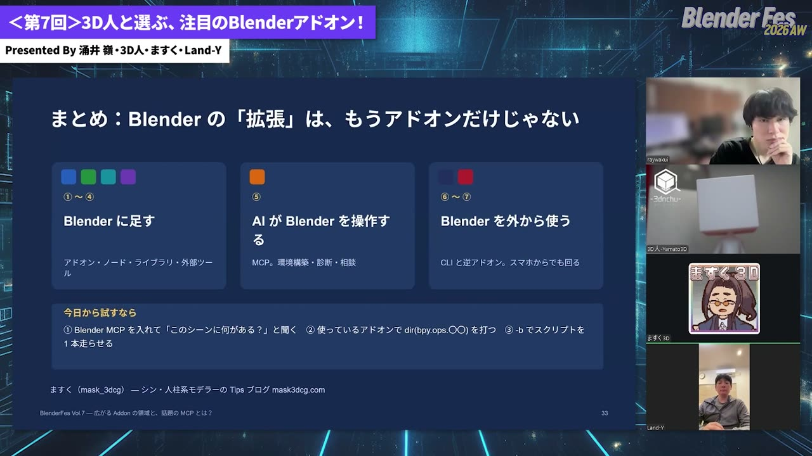

---

## セッション概要

| 項目 | 内容 |
|:---|:---|
| **タイトル** | ＜第7回＞3D人と選ぶ、注目のBlenderアドオン！ |
| **イベント** | Blender Fes 2026 AW Day1 |
| **形式** | オンライン配信（対談） |
| **日時** | 2026年9月26日（土）18:45–19:45 |
| **登壇** | 3D人 / ますく / Land-Y（cvELD 主宰） |
| **司会** | 涌井嶺 |

---

## 「3D人と選ぶ注目のBlenderアドオン」とは

この企画は、CG ツール情報サイト「3D人」の 3D人さんとますくさんが毎回ゲストを迎え、使ってみたアドオンの感触を語り合うシリーズです。二人はアドオンをまとめた書籍「アドオン辞典」も出版しています。

今回の背景には、対話型 AI の急速な進化があります。AI にアドオンを書かせる人が増え、AI に Blender そのものを操作させる手段も整ってきたことが、冒頭から話題になりました。3 人の発表は、それぞれ違う角度からこの変化を扱っていました。

---

## セッション詳報

### ますくさん：Blender の「拡張」はアドオンだけではなくなった（18:47〜）

ますくさんは当初、購入したアドオンを紹介する予定でした。しかし、収録直前に新しい上位 AI モデルが公開されたことを受けて、急きょ「AI で何が変わったか」をテーマにスライドを作り直したそうです。題材は開発が止まっていた自作の Unity ゲームで、AI を使って 4 日ほどでおおむね形にできたそうです。

発表は 7 つのステップで、前半 4 つは Blender の中に機能を足す話、後半 3 つは Blender を外から使う話でした。

#### ① Python アドオン：VRM Add-on for Blender と Auto-Rig Pro

最初のステップは、Python で書かれた従来型のアドオンです。ゲーム制作では **VRM Add-on for Blender** でキャラクターをセットアップし、**Auto-Rig Pro** で人型以外のキャラクターのリグを組んだそうです。

#### ②③ ジオメトリーノードとアセットライブラリ

ジオメトリーノードやアセットライブラリも、最近はアドオンの UI から呼び出すものが増えており、広い意味での拡張として整理されていました。素材サイト Poly Haven のアセットを呼び出すアドオンや、Blender 本体に入ったオンラインアセットライブラリも紹介されました。

#### ④ 外部ツールとのブリッジ：Tripo DCC Bridge

外部サービスを Blender から呼び出す窓口としてのアドオンも紹介されました。ますくさんが特に多く使ったのが **Tripo** の Blender 連携です。イラストから Tripo で 3D モデルを起こし、Web 側で送信を押すとそのまま Blender に入ってきます。

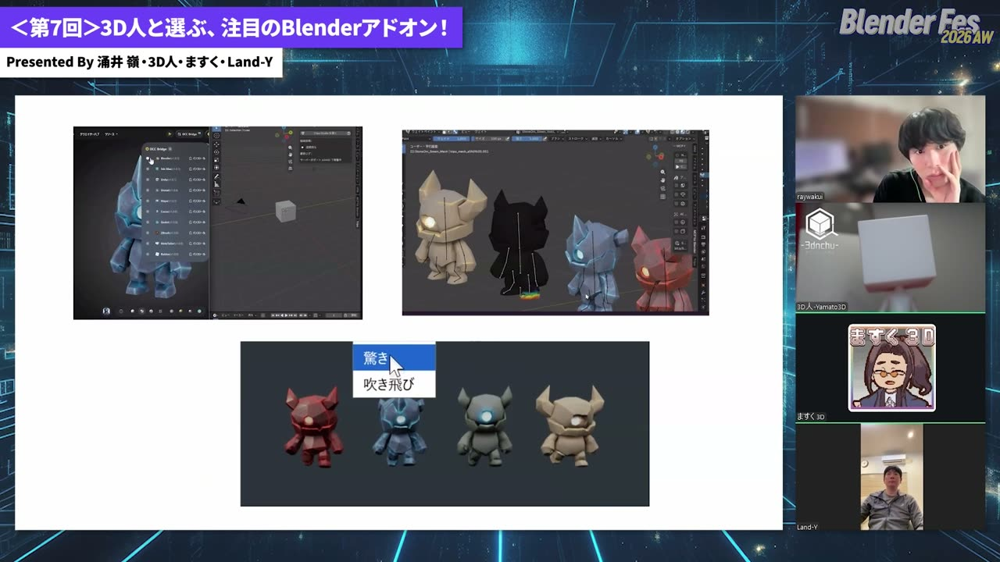

テキストからモーションを作る Tencent の **HY-Motion**（表記要確認）や動画生成 AI も組み合わせていました。オオカミ型のボスには、人型以外にも骨とウェイトを入れられる研究モデル **SkinTokens** を使いました。個人での環境構築は難しい研究コードですが、AI にセットアップを任せたら動いたそうです。

#### ⑤〜⑦ MCP、CLI、そして「逆アドオン」

後半は、AI が Blender を扱うための 2 つの経路の話でした。

- **MCP**（Model Context Protocol）：対話型 AI と外部ツールをつなぐ共通の仕組みです。Blender 側に受け口となるアドオンを入れておくと、さまざまな AI から Blender に指示を送れます。公式版のほかコミュニティ製も多数あります。どれを使うかは作業に応じて AI に相談するとよい、という助言がありました。
- **CLI**（コマンドライン）：Blender の画面を開かずに、必要な機能だけをコマンドで呼び出す使い方です。ますくさんが一番気に入っている方法だそうです。

既存のアドオンも AI から操作でき、Auto-Rig Pro も AI 経由で動かしていました。アドオンの機能が「オペレーター」として定義されていれば、AI 側から呼び出せるという説明でした。

さらに、作りたいコンテンツが主役で、Blender はその部品として呼ばれる側になる、という見方も示されました。スライドではこれを「逆アドオン」と呼んでいます。ますくさんは出張中の移動時間に、自宅の PC にある Blender と Unity をチャット経由で動かし、ゲームを進めていたそうです。

> 人が開いたのは、レビューのときだけ。

完成したゲームのスライドに添えられた一文です。ただし、CG の基礎を知っているほうが良い結果を出しやすい、という補足もありました。

---

### 3D人さん：論文から生まれるアドオン（19:06〜）

3D人さんは今回、「専門技術の実用化」、つまり研究論文と一緒に公開されたアドオンに注目しました。前年に紹介した Smear が論文と同時公開だったと後から知ったことがきっかけだそうです。

#### Field-Aligned Surface-Filling Curve（19:08〜）

メッシュの表面を、1 本の連続したカーブで埋め尽くす技術です。Eurographics 2026 の論文で、著者がリポジトリ内で Blender アドオンも公開しています。

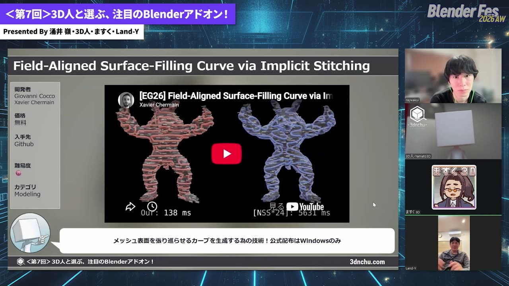

- **使いどころ**：生成されるのはエッジなので、カーブに変換すればジオメトリーノードでチューブ化するなど自由に加工できます。木目のような柄や、一筆書きで構築されていくアニメーション、3D プリント用のアクセサリーといった用途が話題になりました
- **注意点**：公式配布の実行ファイルは Windows 用です。細かく設定すると処理に時間がかかります

登壇者の一人は、使い道より先に「こういうことができる」と知ること自体に価値がある、と話していました。

#### ZOZO の Contact Solver（19:11〜）

ZOZO が公開した布シミュレーション用ソルバー（PPF Contact Solver）の Blender アドオンです。論文とあわせてオープンソースで公開されています。

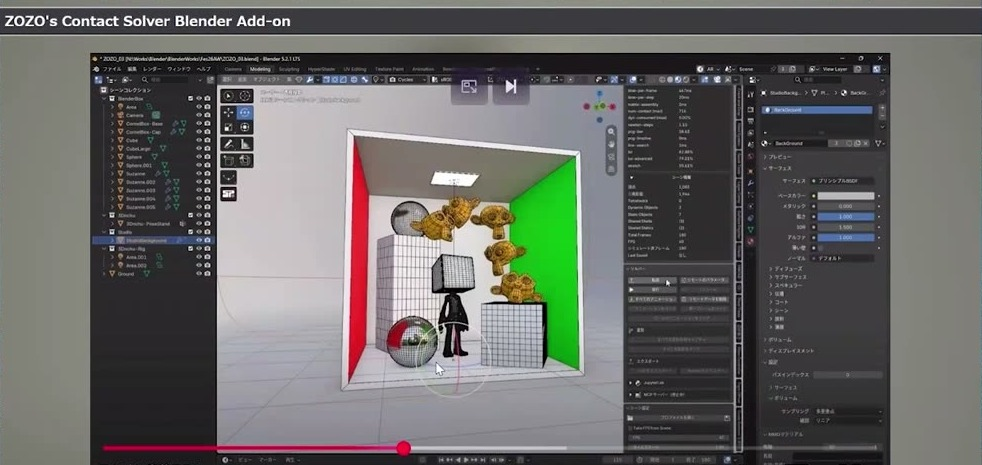

- **選出理由**：布を 3 枚重ねてシミュレーションしても、めり込みがほとんど起きません。自己衝突は布シミュレーションの長年の課題なので、登壇者たちも驚いていました
- **使いどころ**：ベイクすると頂点の動きが全フレーム分のシェイプキーとして入ります。そのため、ゲームなど他の環境にも持ち出しやすくなっています
- **注意点**：最初から自己交差しているメッシュはエラーで弾かれます。ポーズを付けたキャラクターの脇などが該当するので、リメッシュするか、軽いメッシュでシミュレーションしてからケージで変形させる方法が現実的だという話でした

#### SplatGen（19:15〜）

Blender のシーンから 3D ガウシアンスプラッティング（3DGS）のデータを作るアドオンです。3DGS は、写真のような見た目を大量の半透明な粒で表現する手法です。

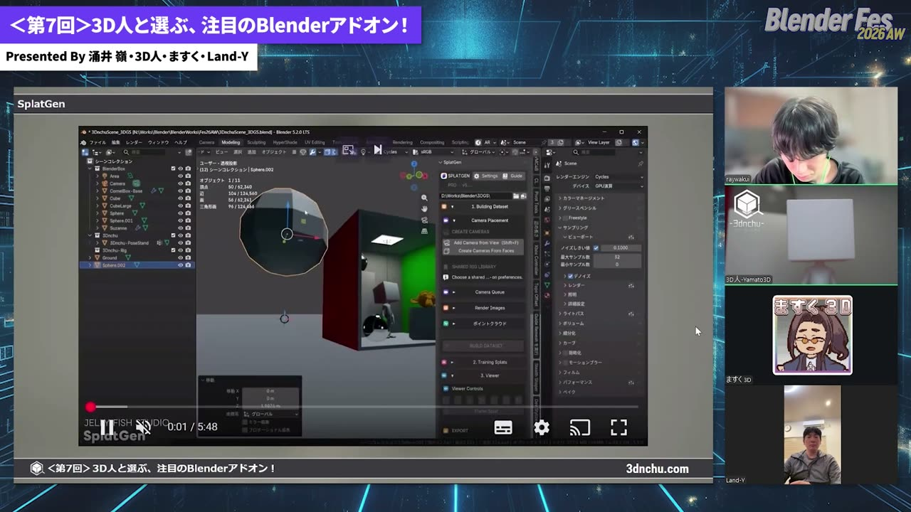

- **使いどころ**：球状メッシュの法線に沿ってカメラを自動配置し、実行すると各カメラのレンダリングをもとに学習が進みます。背景をベイクして軽く扱う用途が話題になりました
- **注意点**：無料版はデータセット作成までで、Blender 上での学習には Pro 版が必要です。アドオンは約 3GB と大きく、処理時間も長めです。実写写真ではなく Blender のシーンを 3DGS 化したい人向けです。近くで見ると粒が目立つため、遠景向きという意見もありました

#### UVgami（19:20〜）

複数の UV 展開エンジンを切り替えて使える自動 UV 展開アドオンです。xatlas、OptCuts、パーツ単位で展開する PartUV を選べます。

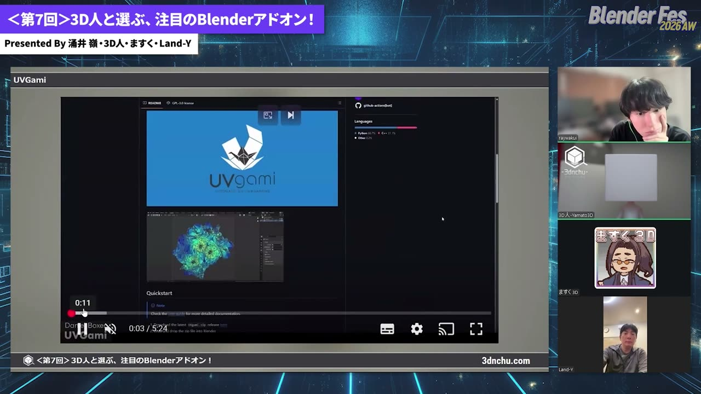

- **使いどころ**：依存ライブラリはアドオンの画面からまとめてインストールできます。エンジンを選んでボタンを押すだけで展開されます。OptCuts はウェイトペイントで切りたい場所の優先度を制御できるので、一番使いやすいかもしれないという評価でした
- **注意点**：結論として「完璧ではない」という感想でした。処理のためにメッシュが三角形化されますが、元のメッシュへ UV だけを転送するオプションが用意されています。PartUV は GPU で動き、当初は環境の問題で動かなかったものの、AI にソースを直させて解決したそうです

#### 論文を AI でアドオン化してみる（19:27〜）

後半では、3D人さんが自分で試した取り組みが紹介されました。まだアドオン化されていない論文を AI に探させ、ソースを取り込んで Blender アドオンにするという試みです。

- **Topological Offsets**：自己交差のない厚みのあるシェルを作る技術です。シリコン型づくりへの応用に関心が集まりましたが、計算が非常に遅いため今回は見送ったそうです
- **Stealth Shaper**：日本人研究者の論文で、メッシュをステルス機のような鋭い面構成に変形させます。アドオンとして動きましたが、処理にはまだ 2 分ほどかかります
- **Developability of Triangle Meshes**：メッシュを、紙のように平面へ展開しやすい形状に変える技術です。論文と同じ結果が出るところまでは進みましたが、まだ未完成とのことでした

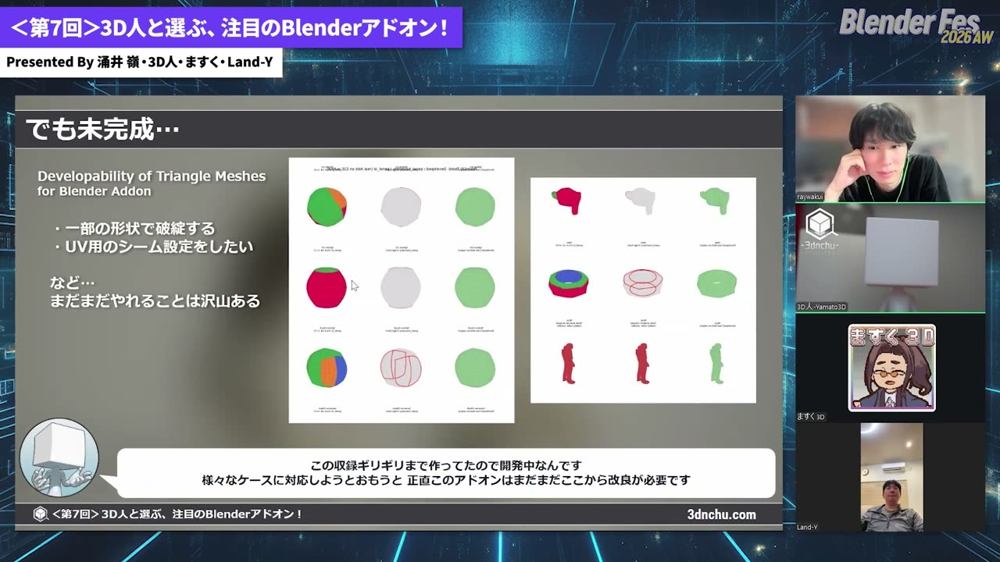

実装は、ChatGPT で調査と相談、Claude Code で実装とテストという分担で、トークン節約のためどちらも一番安いプランで動かしたそうです。形が崩れたときは、AI に画像を撮らせて問題箇所を判断させ、直させたそうです。

注意点として、ライセンスの確認が挙げられていました。Stealth Shaper は利用について問い合わせが必要とされていました。そのため、今回は手元での実験にとどめたそうです。3D人さんのまとめは次のとおりでした。

> 誰でもAIのおかげで作って試すハードルはかなり下がった。その上で何を試すか、どう評価するかが重要な時代になった。

#### INSYDIUM NeXus（19:37〜）

最後は、長年の開発経験があるメーカーのアドオンと比べるという意味で、Cinema 4D 向けプラグインで知られる INSYDIUM の **NeXus for Blender** が紹介されました。GPU で動くパーティクル・流体・炎のシミュレーション環境です。

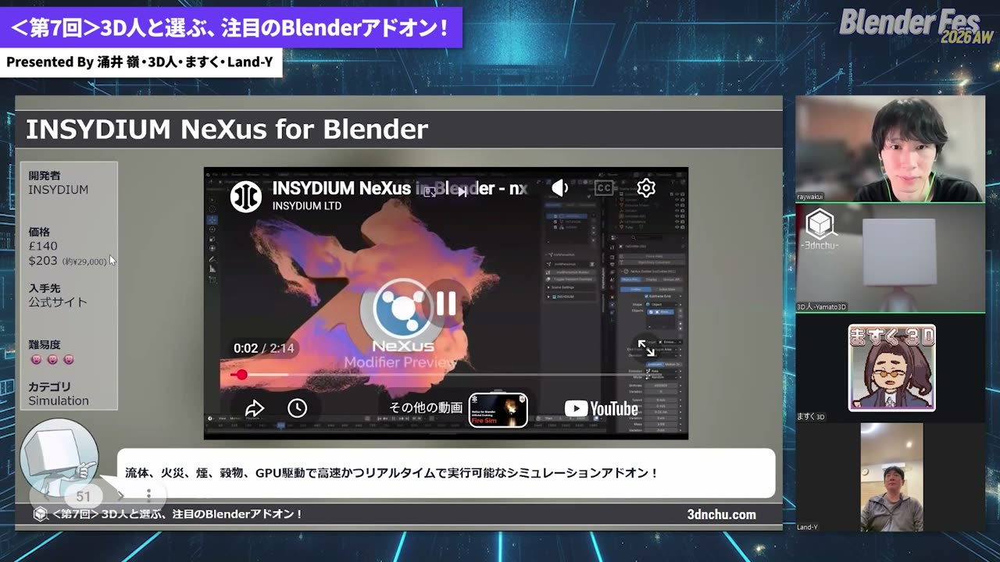

- **選出理由**：機能を 1 つのパネルにスタックして管理でき、プリセットも豊富です。ノート PC の GPU でも、炎はほぼリアルタイムで反応したそうです
- **使いどころ**：チュートリアルをなぞるだけで、水の表現が 15 分ほどで作れたそうです。ゼリー状のスザンヌに水が当たって崩れる表現も紹介されました
- **注意点**：流体の粒子を細かくすると重くなるので、粗い設定でテストしてから解像度を上げる流れになります。価格はスライドでは約 29,000 円相当で、12 か月のアップデートが付いた買い切りです

3D人さんは、AI で試すハードルは下がっても、長年のノウハウは揺るがないと締めくくりました。

---

### Land-Y さん：リギング経験者がアドオンを作り続ける理由（19:43〜）

Land-Y さんはスライドを使わず、cvELD の X アカウントの投稿を見せながら話しました。Softimage の開発終了を受けて Blender に移り、特に苦手だと感じたリギングを補うために最初に作ったのがボーンを素早く作る **cvELD_QuickRig** だったとのことです。

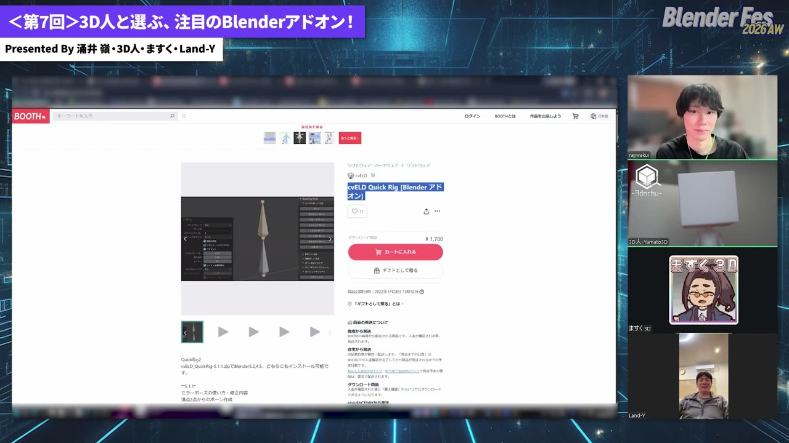

#### cvELD_ShellFit と ShellFit Brush

素体と衣装の貫通を押し戻し、シェイプキーやメッシュに焼き込むアドオンです。VRChat の着せ替え衣装の需要に応えて作り、大きな反響があったそうです。

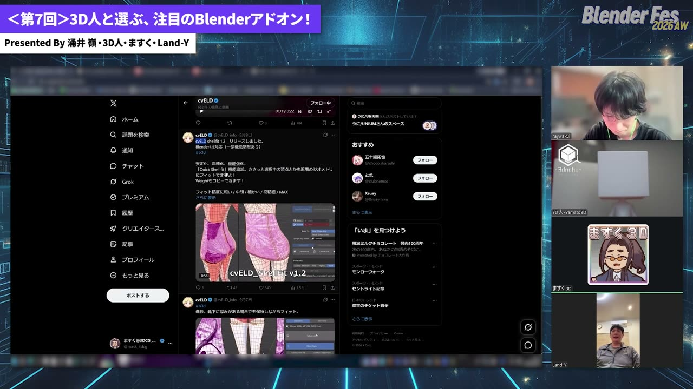

マニュアルを読まずに使えるように、ブラシ型の **ShellFit Brush** も作ったそうです。ただし、できることは根本的に違うため、衣装を調整するにはどちらも必要という位置づけでした。

#### cvELD Schematic View

Softimage にあった「スケマティックビュー」を Blender で再現するアドオンです。シーンの階層をノードとして一覧表示し、選択や表示切り替え、階層の編集ができます。

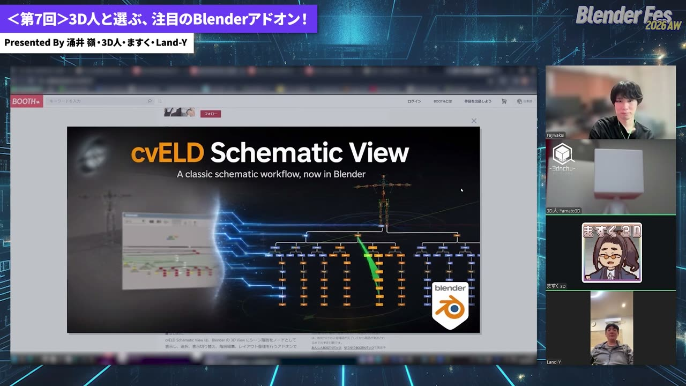

GPU 描画 API で画面をゼロから作り、Nuke を参考にしたコメントやグループ分けも加えているそうです。コンストレイントの関係も表示できます。

#### 開発の現場から

Land-Y さんは、AI によって開発効率が大きく上がったと話しました。半年かかるようなツールが 1 週間でできるのが実感だそうです。現在はコードをほとんど見ずに、要望を伝えて AI に書かせる「バイブコーディング」で開発しているとのことでした。

その一方で、仕組みはすぐにできても、使い勝手を整え、エラーをなくし、例外条件を洗い出す作業には今も長い時間がかかると強調していました。

> 自分は分かるけども、人に使わせたらうんざりするようなUIを出してくるんですよね、いまだにAIって。

そのため UI は、スクリーンショットを撮って直し方を指示する作業を手で繰り返しているそうです。

#### リミナルウォーカー（表記要確認、19:50〜）

最後に見せたのは、ビューポートの中を一人称視点で歩き回れるツールです。バックルームのような空間を WASD キーで進み、飛行モードやカメラの追従機能もあります。作った背景の中を歩いた動きをカメラに記録し、あとでレンダリングに使えるようにする予定だそうです。

Land-Y さんは、思いついて作り始めたアドオンを 10 本以上同時に進めているそうです。販売は主に BOOTH で行っていて、手数料の面からもできれば BOOTH で買ってもらえると助かる、と話していました。

---

## 紹介されたアドオン一覧

| アドオン / ツール | 用途 | 有料・無料 | 推薦者 |
|:---|:---|:---|:---|
| VRM Add-on for Blender | VRM 形式のキャラクターセットアップ | 無料 | ますく |
| Auto-Rig Pro | 自動リギング（人型以外にも利用） | 有料 | ますく |
| Tripo DCC Bridge | Tripo で生成したモデルを Blender へ送る | 無料（Tripo 側は別途） | ますく |
| SkinTokens | 人型以外も含む自動リギングの研究モデル | 無料（オープンモデル） | ますく |
| HY-Motion（表記要確認） | テキストからモーション生成 | 無料（オープンモデル） | ますく |
| Blender MCP | AI から Blender を操作する受け口 | 無料 | ますく |
| Field-Aligned Surface-Filling Curve | 表面を埋める 1 本のカーブを生成 | 無料 | 3D人 |
| ZOZO Contact Solver | めり込まない布シミュレーション | 無料（オープンソース） | 3D人 |
| SplatGen | Blender シーンから 3DGS を生成 | 無料版 / 有料 Pro 版 | 3D人 |
| UVgami | 複数エンジンによる自動 UV 展開 | 無料 | 3D人 |
| INSYDIUM NeXus | GPU パーティクル・流体・炎 | 有料（買い切り） | 3D人 |
| cvELD_ShellFit / ShellFit Brush | 衣装と素体の貫通修正 | 有料 | Land-Y（自作） |
| cvELD Schematic View | シーン階層のノード表示 | 有料 | Land-Y（自作） |
| cvELD_QuickRig | ボーンの素早い作成 | 有料 | Land-Y（自作） |
| リミナルウォーカー（表記要確認） | ビューポート内の一人称ウォークスルー | 開発中 | Land-Y（自作） |

論文の試作として触れた Topological Offsets、Stealth Shaper、Developability of Triangle Meshes は、配布されているアドオンではありません。

---

## 登壇者紹介

### 3D人

CG ツールの情報サイト「3D人（3dnchu.com）」の方で、この企画のホスト役です。今回は「論文から生まれたアドオン」という切り口で、自身でもアドオン化を試していました。

### ますく

第1回からこの企画に参加している常連の登壇者です。今回は AI エージェントと既存アドオンを組み合わせたゲーム制作の実例を紹介しました。

### Land-Y（cvELD 主宰）

cvELD の主宰で、リギング補助アドオン cvELD_QuickRig、cvELD_QuickBBone の開発者です。今回が初参加でした。Softimage から Blender に移ってからアドオン開発に力を入れている経緯と、現在の開発の進め方を語りました。

---

## まとめ

今回の対談は、アドオンの紹介を入り口に「アドオンとは何か」を問い直す 1 時間になりました。

締めくくりに 3D人さんは、AI の登場でアドオン開発の立ち位置も使い方も変わったと振り返りました。専門家が作ったアドオンは細かな要望に応えてくれる一方、自分でできないことを AI でアドオン化するハードルも下がった、という整理です。

3 人に共通していたのは、「AI で何でも作れる」という楽観だけでは終わらなかった点です。何を選ぶかという目利きと、人が使える形に仕上げる手間は、今も人の側に残っています。気になる論文やアドオンを自分で試してみると、次の一本が見つかるかもしれません。

---

## 参考リンク

- [Blender Fes 2026 AW セッションページ](https://cgworld.jp/special/blenderfes/vol7/?channel=channel-949)
- [3D人（3dnchu.com）](https://3dnchu.com/)
- [Tripo DCC Bridge for Blender](https://www.tripo3d.ai/integrations/blender)
- [SkinTokens プロジェクトページ](https://zjp-shadow.github.io/works/SkinTokens/)
- [HY-Motion 1.0（Tencent Hunyuan / GitHub）](https://github.com/Tencent-Hunyuan/HY-Motion-1.0)
- [Blender Lab MCP Server](https://www.blender.org/lab/mcp-server/)
- [Surface-Filling-Curve（GitHub）](https://github.com/iota97/Surface-Filling-Curve)
- [ZOZO PPF Contact Solver（GitHub）](https://github.com/st-tech/ppf-contact-solver)
- [SplatGen（3D人の紹介記事）](https://3dnchu.com/archives/splatgen/)
- [SplatGen（Superhive）](https://superhivemarket.com/products/splatgen)
- [UVgami（GitHub）](https://github.com/DanielBoxer/UVgami)
- [PartUV（GitHub）](https://github.com/EricWang12/PartUV)
- [Topological Offsets（arXiv）](https://arxiv.org/abs/2407.07725)
- [Stealth Shaper（プロジェクトページ）](https://kenji-tojo.github.io/publications/stealthshaper/)
- [Developability of Triangle Meshes（Columbia University）](http://www.cs.columbia.edu/cg/developability/)
- [INSYDIUM NeXus](https://insydium.ltd/products/nexus/)
- [cvELD（BOOTH）](https://cveld.booth.pm/)
- [cvELD Quick Rig（BOOTH）](https://cveld.booth.pm/items/3596146)
- [cvELD Schematic View（BOOTH）](https://cveld.booth.pm/items/8665027)
- [cvELD Shell Fit（Superhive）](https://superhivemarket.com/products/cveld-shellfit)
