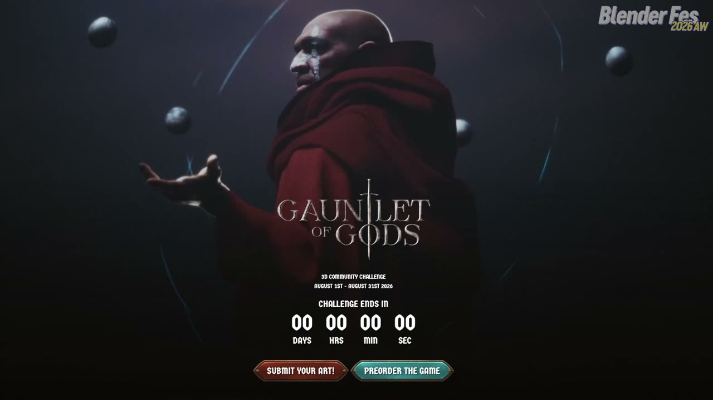
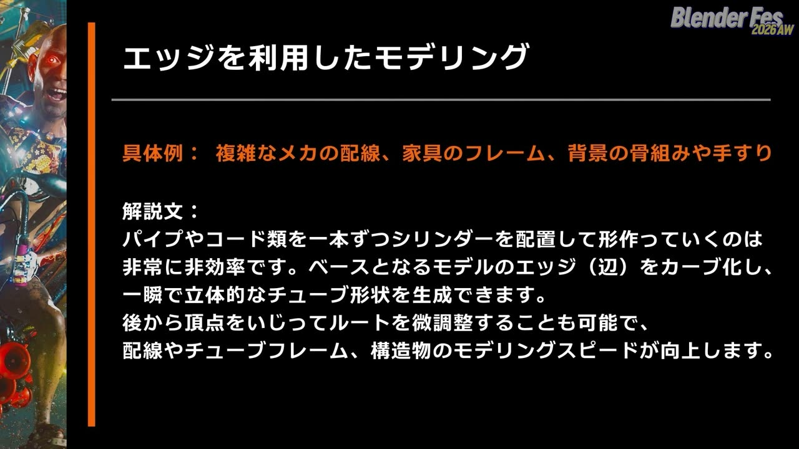
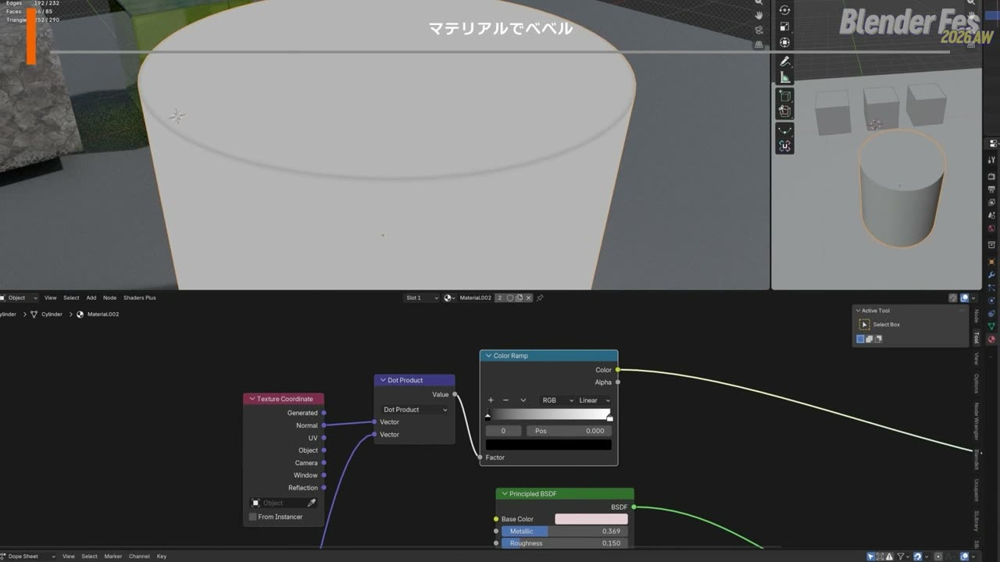
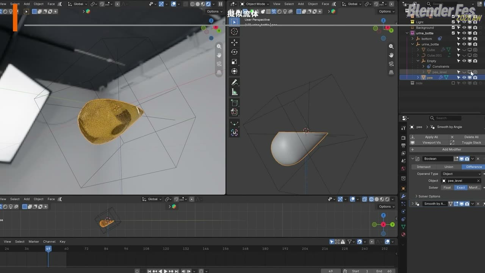
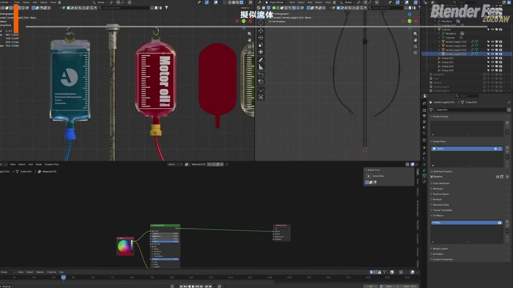
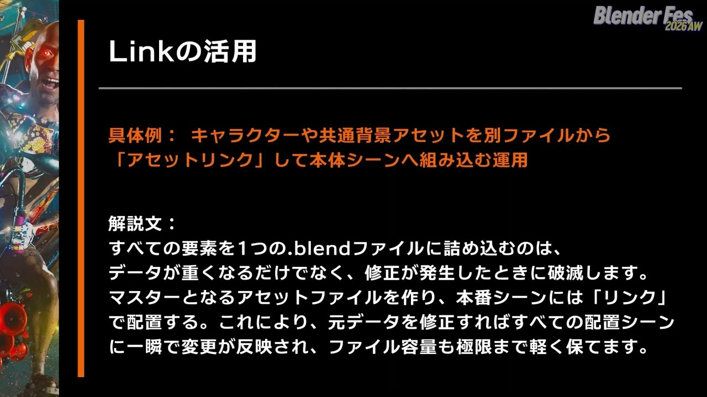
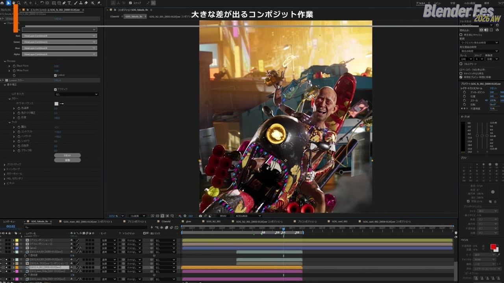
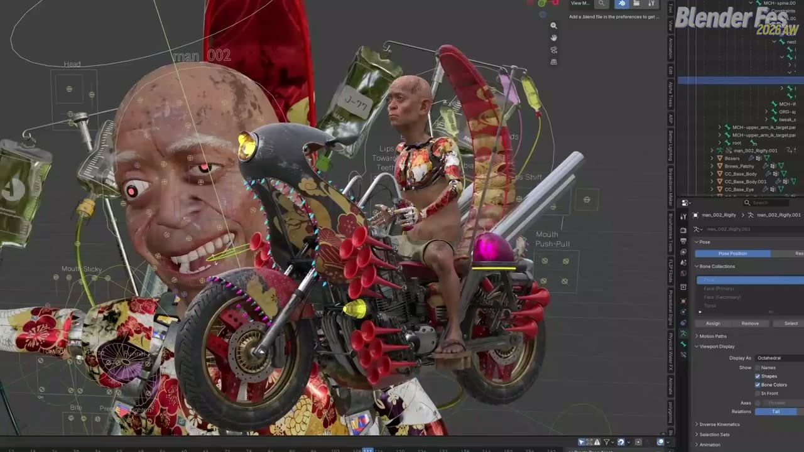
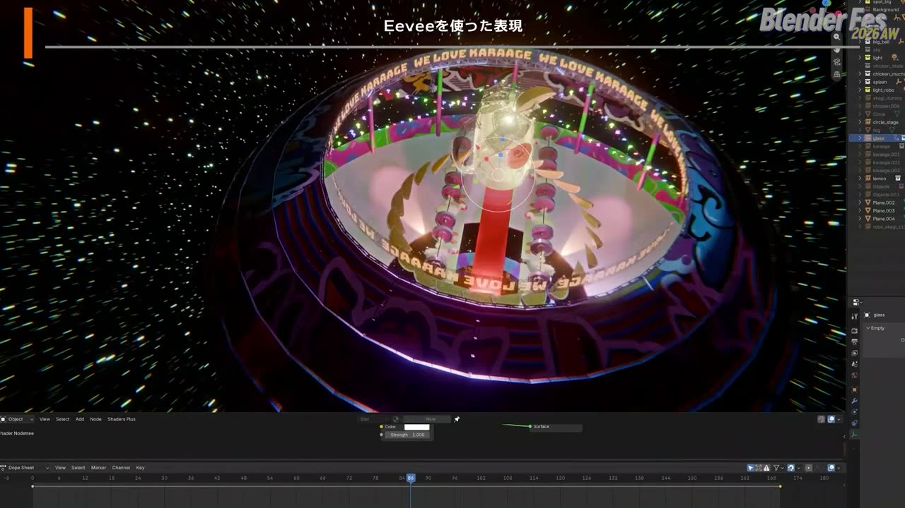
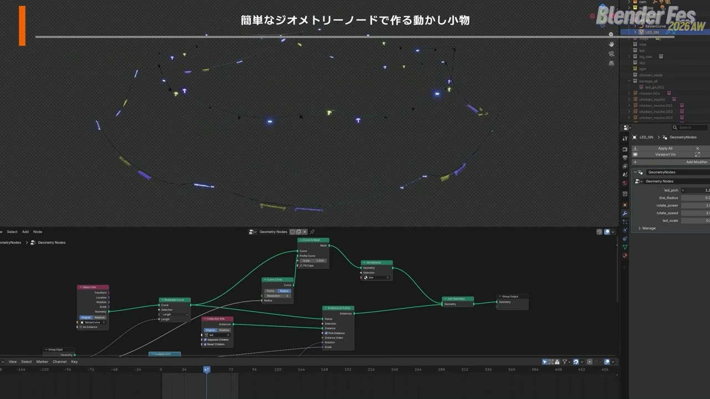

# Blender Fes 2026 AW: 短時間で心を掴む！自主制作から学ぶ、魅力的なショート映像制作 — 限られた時間で絵を仕上げる 8 つの時短テクニック

バイクにまたがった老人が夜の街を暴走し、爆発の光が画面を照らす。そんなショート映像を、仕事の合間のおよそ 20 日間で作り上げたと聞くと、どこで時間を節約しているのか気になるのではないでしょうか。

Blender Fes 2026 AW の Day2、10:00 から配信されたセッション **「短時間で心を掴む！自主制作から学ぶ、魅力的なショート映像制作」** では、株式会社FUKUPOLY の福田泰崇さんが、自主制作を続ける理由と、短い期間で映像を仕上げるための具体的な手法を紹介しました。

題材は、3D コミュニティチャレンジ「GAUNTLET OF GODS」への応募作と、赤城ウェンさんのミュージックビデオ「〜↑↑ -KARAAGE-」の 2 本です。本記事では、配信を視聴した内容をもとに、講演の流れとそれぞれのテクニックの要点を整理します。

---

## セッション概要

| 項目 | 内容 |
|:---|:---|
| **タイトル** | 短時間で心を掴む！自主制作から学ぶ、魅力的なショート映像制作 |
| **イベント** | Blender Fes 2026 AW Day2 |
| **形式** | オンライン配信（講演、収録映像） |
| **日時** | 2026年9月27日（日）10:00–11:00 |
| **スピーカー** | 福田泰崇（株式会社FUKUPOLY 3DCGアーティスト） |
| **題材** | 「GAUNTLET OF GODS」応募作、赤城ウェン「〜↑↑ -KARAAGE-」MV |
| **紹介されたツール** | Blender（Cycles / EEVEE）、After Effects、Nexus for Blender（表記要確認） |

---

## 背景: 自主制作は「攻めの投資」

チャンネルページの紹介文では、講演を「自主制作を発信し続ける理由」「アイデアの種の見つけ方」「短時間で組み上げるシーン構成」「ショート映像の演出」の順で組み立てると予告していました。

ここでいうショート映像とは、数秒から数十秒程度の短い CG 映像のことです。SNS での発信やデモリール（作品集の映像）に向いた長さで、1 人でも完成まで持っていきやすい規模と言えます。

福田さんは、限られた時間とリソースの中でどこに手間をかけ、どこを省くかという判断こそが、ショート映像の質を左右すると繰り返し語っていました。

---

## セッション詳報

### なぜ自主制作を発信し続けるのか（10:01〜）

冒頭では、CM やミュージックビデオ、立体造形などの制作実績をまとめたショートリールが流れました。続いて、自主制作を続ける理由が「クリエイターの生存戦略」として整理されました。

受注の仕事だけを続けていると、スキルや表現の幅が固定されやすいという問題意識が出発点です。福田さんは自主制作を、自分の限界を越えて次の段階へ進むための「攻めの投資」と位置づけていました。利点は 3 つ挙げられています。

- **実験場になる。** クライアントワークでは採用されにくい表現や、新しいツールやワークフローを、リスクなしに試せます。デモリールを更新し続けることで、今の自分に何ができるかを示せます
- **インプットの質が上がる。** 作ると決めて発信していると、街の風景や映画のカット、SNS の流行までが素材に見えてくるそうです
- **個人の看板になる。** 組織や下請けの立場に頼らず、自分の名前と作品でファンやクライアントとつながれることが、キャリアの安全網になると説明されていました

### アイデアの種を見つける（10:04〜）

次に「何を作ればよいか分からない」状態を抜けるための方法が 3 つ紹介されました。

1 つめは、締め切りとお題を外から持ってくることです。自分の意思だけに頼ると「完璧に作りたい」という思いで手が止まるため、コンペや期限付きのチャレンジ企画に参加し、未完成でも期限内に出す環境をあえて作ります。今回の GAUNTLET OF GODS への参加も、この考え方の実践例と言えます。

2 つめは、制約をルールにすることです。1 シーン 5 秒、使うアセットは何個まで、制作は休日の 1 日だけ、といった条件を先に決めると、迷う余地が減ってアイデアが尖るといいます。

3 つめは、過去の没案の掘り起こしです。容量や時間の都合で諦めたカットや、メモに書き留めた思いつきを、今のスキルや新しいツールで作り直してみることが勧められていました。

> 諦めず手を動かすということが大切かと思います。

学業や仕事の中で時間を作るのは難しいと認めたうえで、心に留めておくだけでも空き時間に学ぶ動機になる、という語り口が印象的でした。

### エッジをカーブにしてモデリングする（10:06〜）

ここからは、制作で使っている時短の手法が作例とともに紹介されました。最初は、メッシュのエッジ（辺）をカーブに変換してパイプや配線を作る方法です。

パイプやコードを 1 本ずつシリンダーで置いていくと時間がかかります。そこで、ベースとなるメッシュを作って形を整え、必要なエッジだけを複製・分離してカーブに変換します。角にはフィレット（角の丸め）を入れ、カーブの半径を設定すれば、立体的なチューブになります。頂点を動かせば後から経路も直せます。

GAUNTLET OF GODS の作品では、警察の特型警備車（表記要確認）の屋根に載った高圧放水器のハンドルや、屋根のチューブ構造をこの方法で作っていました。参考として学校の椅子も作って見せ、面から作るので全体のシルエットをつかみやすく、1 脚あたり 1 分ほどで作れると話していました。ソリッド化モディファイアーと組み合わせた蓋の取っ手や、「カーブに沿って複製」で作る手すりの例も紹介されています。

### マテリアルでベベル（10:13〜）

エンジンや石垣のようにエッジが大量にあるモデルで、すべての角にモデリングでベベルを入れると、ポリゴン数が膨れ上がります。そこで、シェーダーのベベルノードで角の丸みとハイライトだけを表現する方法が紹介されました。

ベベルノードをノーマル（法線）につなぎ、サンプル数と半径を調整するだけで、角が取れたような見た目になります。ボロノイテクスチャの距離出力をベベルの半径につなぐと、角の欠け方が不規則になります。ボロノイのランダムさを 0 にすると格子状の陰影が出るという、偶然の発見も共有されていました。

さらに、テクスチャ座標とベクトル演算の内積、カラーランプを組み合わせてミックスシェーダーの係数に使うと、角が擦れて下の色がのぞくような表現になります。今回の作品では、エンジンをはじめ多くのオブジェクトにこの簡易的なベベル表現を使ったそうです。

### 疑似流体（10:18〜）

本格的な流体シミュレーションは、計算とベイクに長い時間がかかります。背景や短いカットであれば、ブーリアンやマテリアルのアニメーションで液体らしく見せられる、というのが疑似流体の考え方です。福田さんは「賢い手抜き」と表現していました。

作品のテーマは、寝たきりの老人がサイボーグ化され（聞き取り要確認）、暴走族時代の記憶がよみがえって街を暴走するというものです。火炎瓶の代わりに尿瓶を使う、という遊び心のある小道具で疑似流体が使われていました。

液体のオブジェクトからブーリアンで立方体を差し引き、水面を作ります。立方体を上下させれば水位が変わります。この立方体に「トラック」系のコンストレイントを付けて下方向のオブジェクトを常に向かせると、瓶が傾いても水面が水平に保たれます。

バイクに付けた点滴バッグは、厚みのない板状のメッシュを透明なバッグの中に入れるだけです。屈折の効果で、中に液体が満ちているように見えます。液体のマテリアルに透明シェーダーをミックスし、グラデーションテクスチャとカラーランプで境目を作ると、見た目の液量を増減できます。ボロノイテクスチャで水面を波打たせ、UV の位置を動かすと、液面が左右に揺れ続けます。

尿瓶の炎も、炎のレンダリング画像を連番テクスチャとして貼った 1 枚の板です。ベンドモディファイアーで曲がり方を調整できるようにしておき、風になびく様子や回転しながら飛ぶ動きに対応させていました。

### キーフレームに頼らないアニメーション制御（10:27〜）

不規則なライトの点滅やメーターのような動きは、キーフレームを 1 つずつ打つと時間がかかります。そこで、数式・アニメーションカーブのノイズ・ノイズテクスチャの 3 通りで電球を点滅させる例が示されました。

- **数式で制御する。** 放射の強さにドライバーで sin 関数を使った式を入れ、フレームに合わせて点滅させます。数値を変えると点滅の速さが変わります
- **カーブのノイズで制御する。** 強さにキーフレームを 1 つ打ってアニメーションカーブを作り、モディファイアーの「ノイズ」を加えます。タイムライン上で明滅を目で確かめながら調整できます
- **ノイズテクスチャで制御する。** オブジェクト情報のランダム出力と加算ノードをノイズテクスチャに入れ、「より大きい」と乗算を通して強さにつなぎます。オブジェクトごとに値が変わるため、複製するとばらばらに点滅します。光の色にもランダム値をつなげば、1 つのマテリアルで色と点滅の両方がばらつきます

> 似たような見た目の点滅であっても、仕込み方次第でその後の制御のしやすさが大きく変わってくるので、適材適所で使い分けると時短になります。

一方で、目立つパトランプは実物の回転灯の構造を意識して細部まで作り込んだそうです。リアルに作る部分と手を抜く部分のバランスが大事だ、という話につながっていました。

### Link の活用（10:32〜）

すべての要素を 1 つの .blend ファイルに詰め込むと、データが重くなるうえ、修正のたびに困ることになります。マスターとなるアセットファイルを作り、本番シーンにはリンクで配置すれば、元データの修正がすべてのシーンに反映され、ファイルも軽く保てます。

今回の作品でも、背景のビル群、パトカー、警備車、バイク、老人のロボ、警察官を別々のファイルで作り、最後に本番シーンへリンクで読み込んでいました。

### 大きな差が出るコンポジット（10:34〜）

仕上げのコンポジットは、映像の質を大きく変える工程として紹介されました。全体のトーンを引き締めるだけで、映画の一場面のような説得力が出るといいます。ここでは After Effects での作業が示されました。

部分的にグローをかけたり色を変えたりするため、レンダリングは情報を多く持てる EXR の連番か、背景やバイクなど要素ごとにマスク付きの連番で書き出すことが多いそうです。本作では背景、バイク、老人のロボに加えて、爆発、水しぶき、光る部分のマスクを分けて出力していました。煙や爆発、粉塵は Nexus for Blender（表記要確認）というアドオンで作ったとのことです。

グローは背景とバイクで分け、それぞれ強さと広がり方を変えています。カラーグレーディングは Lumetri カラーで行い、暗部を締めつつ全体を少し青寄りにして、爆発のオレンジと対比させる配色にしました。爆発の瞬間には明るさを変えて明順応（表記要確認）のような効果を入れ、レンズフレアの素材も重ねています。11 のレイヤーを基本に、細部はマスクで直し、最終的には 20 ほどのレイヤーで仕上げたそうです。

自主制作ではオブジェクトも基本的に自作しており、看板や点滴バッグのデザイン、バイクのラッピングも Photoshop や Illustrator で作ったといいます。この作品は、仕事の合間におよそ 20 日間かけて制作されました。

### EEVEE を使った表現（10:42〜）

後半の題材は、赤城ウェンさんのミュージックビデオ「〜↑↑ -KARAAGE-」です。複数の映像作家による合作で、福田さんはダンスを踊るメタリックな赤城ウェンさんのモデリングとアニメーション、冒頭の鶏の連れ去り、中盤のダンスパート、エンディングを担当しました。企画段階から参加し、映像のアイデアも含めて制作したそうです。

Cycles で数十分から数時間かかるレンダリングを待つのではなく、EEVEE の特性を理解してコンポジットと組み合わせれば、数秒から数分でも高品質な絵が出せる、というのがこのパートの主張です。楽曲の勢いやスピード感を損なわないために、レンダリングの速い EEVEE が活躍したと語っていました。

完成に近いイメージを見ながら作業でき、レイトレーシングにも対応したことで、きれいな絵のまま楽しく制作を進められたそうです。ただし透明なマテリアルには工夫が必要で、お酒のボトルは前半の点滴バッグと同じ方法で中身の増減を表現しました。鶏の羽がむしられる場面は、当初パーティクルを使う予定でしたが、羽がもともとジオメトリノードで植えられていたため、その位置と回転を制御するだけで表現できたそうです。

### ジオメトリノードで作る動かし小物（10:47〜）

最後の手法は、ジオメトリノードで背景の小物をまとめて動かす方法です。ランダムに揺れる提灯や規則正しく回る歯車を 1 つずつ手付けで動かすときりがありません。ジオメトリノードなら、ノイズテクスチャを使った揺れや、インスタンスごとにずれたアニメーションを数個のノードで一括して制御できます。

作例は、にぎやかしに使う電飾です。コードになるカーブと電球のモデルを用意し、カーブに「ポイントにインスタンス作成」をつないで、インスタンスには電球の入ったコレクションを渡します。「カーブのリサンプル」のサンプル数で電球の数を変えられます。点滅は先ほどのアニメーションカーブのノイズでランダムにし、インスタンスの回転にノイズを加えると、風になびくような動きになります。

### 締めくくり（10:50〜）

駆け足の紹介だったため、気になった箇所は検索しながら掘り下げてほしい、と福田さんは呼びかけました。Blender の魅力の 1 つはコミュニティの情報量の多さにあり、自身も 2 年前に別のソフトから移行した際、Blender Fes のようなイベントや公開チュートリアルに助けられたそうです。

CG 制作に携わって 25 年以上になる福田さんは、長く続ける秘訣を聞かれることが多いといいます。体をいたわることやインプットを大事にすることなど答えはいくつもあるものの、一番は制作の過程そのものを楽しむことだと語りました。

> 完成した成果物に一喜一憂しすぎず、制作の過程に楽しさを見出せれば、いつまでも続けていけるのではないかと思います。

---

## スピーカー紹介

### 福田泰崇

株式会社FUKUPOLY の 3DCG アーティストです。講演冒頭の自己紹介では、独学で 3DCG と VFX を学び、企業 CM やミュージックビデオの CG 制作と映像ディレクション、3D プリンターを使った立体造形などを手がけていると話していました。

Blender へは 2 年前に移行したそうです。講演全体を通じて、作り込む部分と省く部分を意識的に分け、仕事の合間でも作品を完成させる段取りが一貫して示されていました。

---

## まとめ

このセッションは、個々の機能の使い方より「限られた時間でどこに手をかけるか」という判断に重心を置いた内容でした。紹介された手法を表にまとめます。

| 手法 | 使った仕組み | 省けるもの |
|:---|:---|:---|
| エッジを利用したモデリング | エッジの分離、カーブ変換、フィレット、半径 | シリンダーを 1 本ずつ置く手間 |
| マテリアルでベベル | ベベルノード、ボロノイ、内積、ミックスシェーダー | 実際のベベルによるポリゴン増加 |
| 疑似流体 | ブーリアン、トラック系コンストレイント、板メッシュ、連番テクスチャ | 流体シミュレーションの計算とベイク |
| アニメーション制御 | ドライバーの数式、カーブのノイズ、オブジェクト情報のランダム | キーフレームの手打ち |
| Link の活用 | 別ファイルのアセットをリンクで配置 | 修正のたびの差し替えと重いファイル |
| コンポジット | EXR 連番、マスク、グロー、Lumetri カラー | Blender 内での再レンダリング |
| EEVEE | リアルタイム表示とレイトレーシング | Cycles の長いレンダリング待ち |
| ジオメトリノードの小物 | ポイントにインスタンス作成、カーブのリサンプル、ノイズ | 小物ごとの手付けアニメーション |

どの手法も、見る人の目が向く部分には手間をかけ、そうでない部分は仕組みで済ませる、という判断の上に成り立っています。まずは手元の作品で「本当にシミュレーションが必要か」「1 か所直せば全体に反映される作りになっているか」を見直してみると、この講演の考え方をつかみやすいでしょう。

---

## 参考リンク

- [Blender Fes 2026 AW「短時間で心を掴む！自主制作から学ぶ、魅力的なショート映像制作」チャンネルページ](https://cgworld.jp/special/blenderfes/vol7/?channel=channel-945)
- [FUKUPOLY](https://www.fukupoly.com/)
- [Blender Manual: Bevel Node](https://docs.blender.org/manual/en/latest/render/shader_nodes/input/bevel.html)
- [Blender Manual: Boolean Modifier](https://docs.blender.org/manual/en/latest/modeling/modifiers/generate/booleans.html)
- [Blender Manual: F-Curve Modifiers（Noise）](https://docs.blender.org/manual/en/latest/editors/graph_editor/fcurves/modifiers.html)
- [Blender Manual: Linked Libraries](https://docs.blender.org/manual/en/latest/files/linked_libraries/index.html)
- [Blender Manual: Instance on Points Node](https://docs.blender.org/manual/en/latest/modeling/geometry_nodes/instances/instance_on_points.html)
