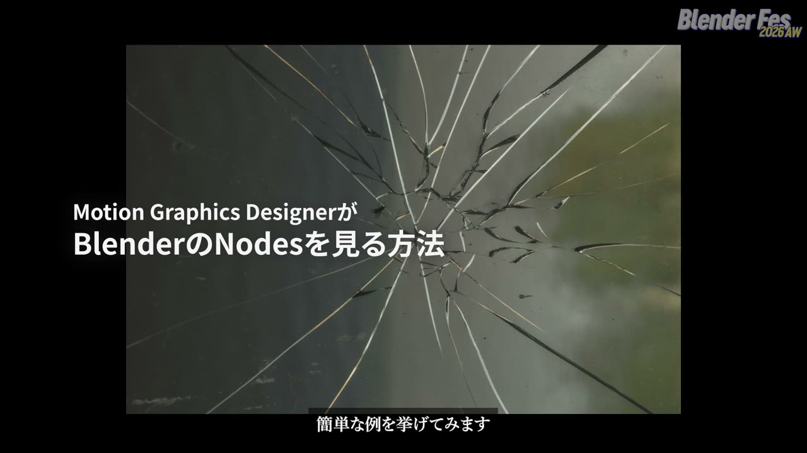
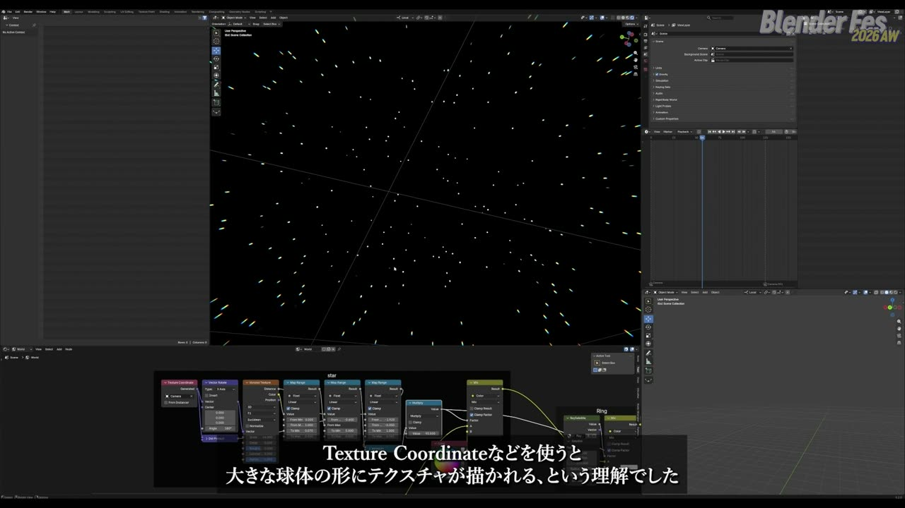
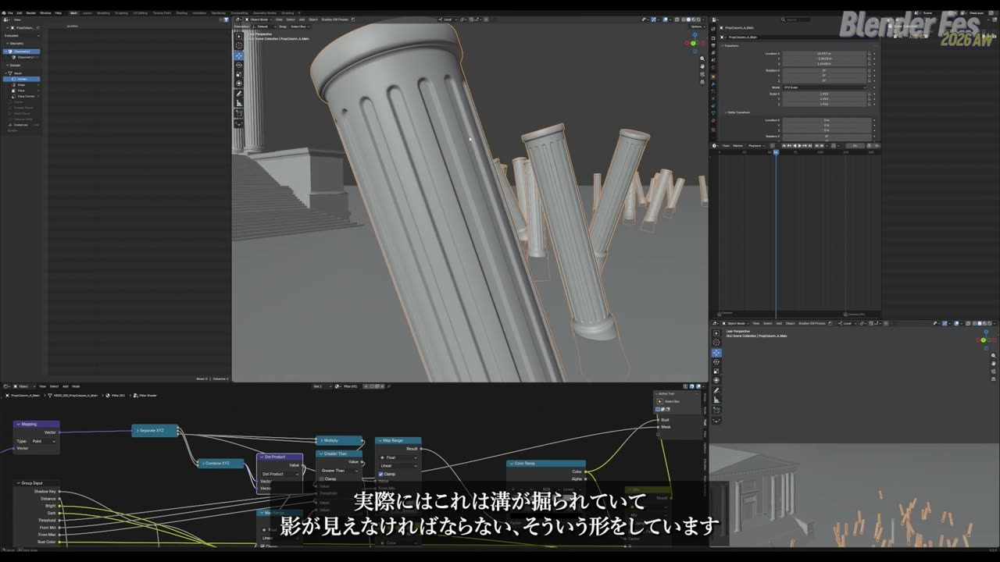
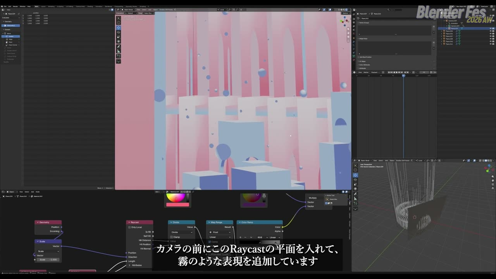
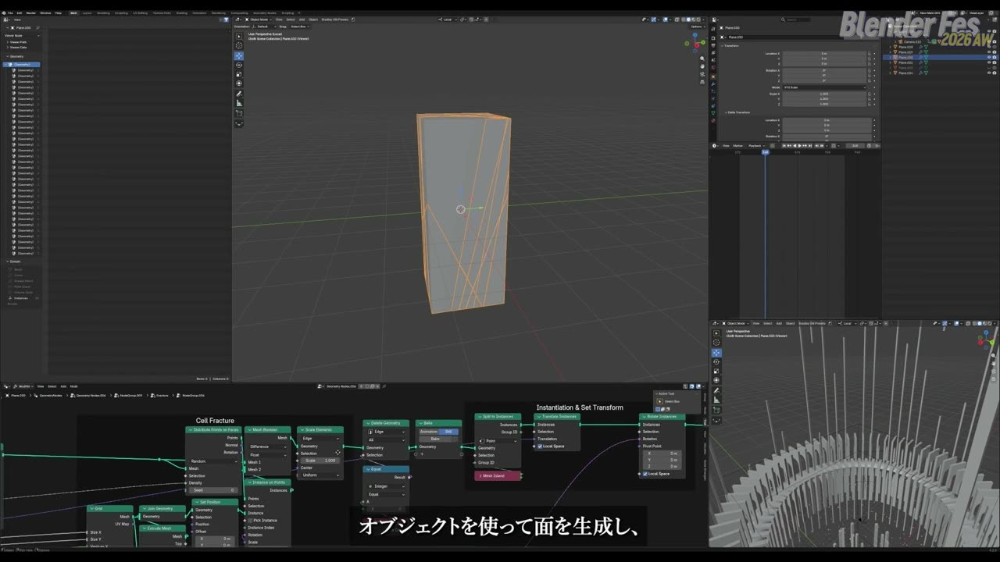
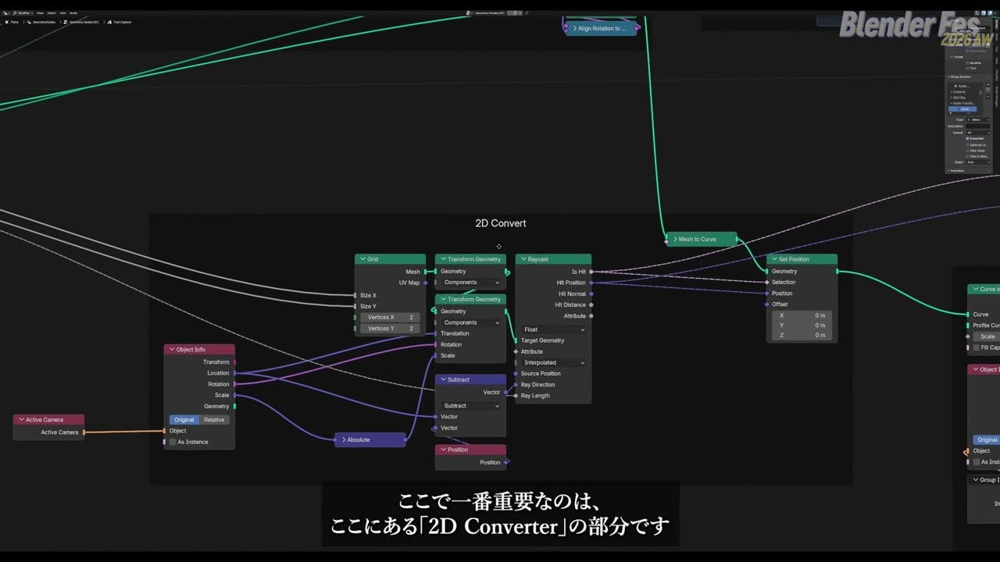
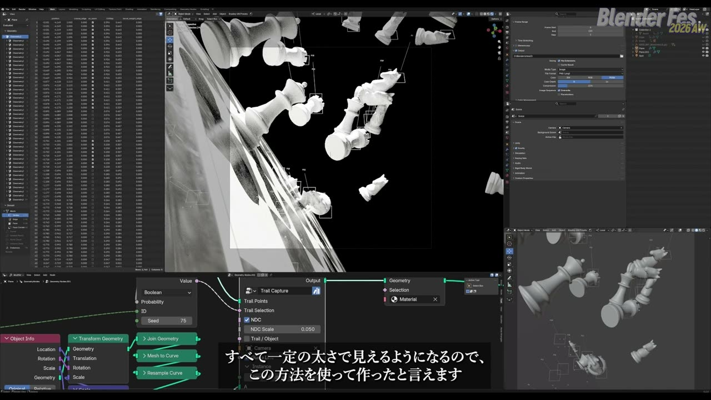
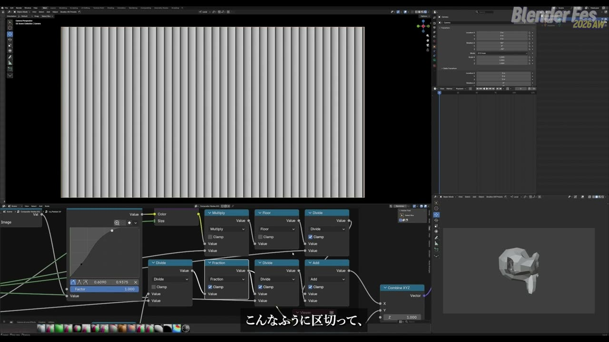
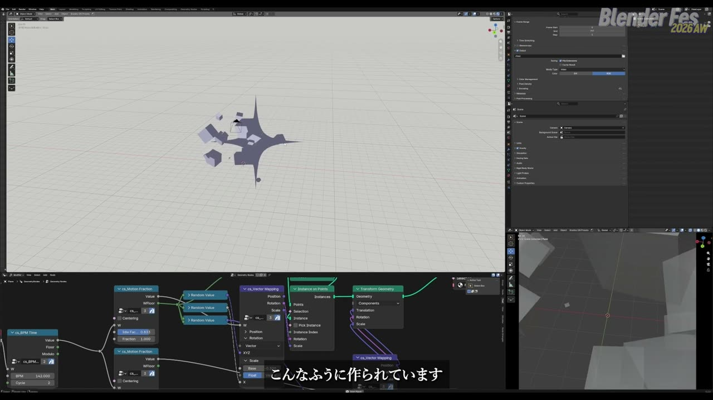
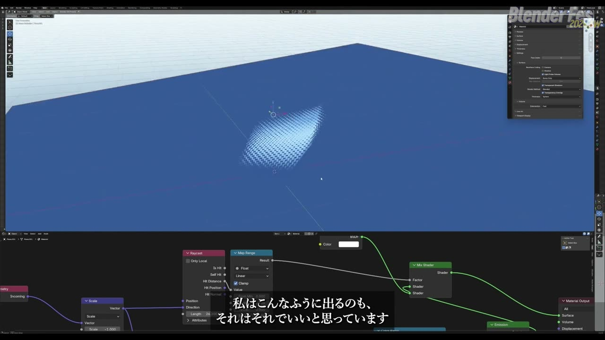

# Blender Fes 2026 AW: ノードで楽しむモーショングラフィックス表現 — 点・線・面から組み立てる Geometry / Shader / Compositor ノード

Geometry Nodes は、完成したノードツリーを見るとどこから読めばよいか迷いがちです。チュートリアルをなぞって同じ絵は作れても、別の表現に応用しようとすると手が止まる、という経験のある方も多いでしょう。

Blender Fes 2026 AW の Day2、11:15 から配信された **「ノードで楽しむモーショングラフィックス表現」** では、モーションデザイナーの cerbalance さんが、Blender を学び始めて 1 年ほどの間に作った習作と代表作のノード構成を順に開いて見せました。Geometry Nodes だけでなく、Shader Nodes と Compositor Nodes も同じ考え方で使い分けていたのが印象的でした。

講演は全編が韓国語でした。本記事では、配信を視聴した内容をもとに、考え方とノード構成を日本語で要約します。

---

## セッション概要

| 項目 | 内容 |
|:---|:---|
| **タイトル** | ノードで楽しむモーショングラフィックス表現 |
| **イベント** | Blender Fes 2026 AW Day2 |
| **形式** | オンライン配信（講演と Blender 画面でのデモ） |
| **日時** | 2026年9月27日（日）11:15–12:15（本編は 12:08 頃まで） |
| **スピーカー** | cerbalance（Motion Designer / Supervisor） |
| **言語** | 韓国語（本記事は日本語で要約。抽出した配信フレームには日本語字幕が表示されていました） |
| **扱ったノード** | Geometry Nodes、Shader Nodes（World を含む）、Compositor Nodes |

---

## 背景: After Effects から Blender へ

cerbalance さんは Blender を始める前、After Effects のエクスプレッションと基本機能を突き詰めて、モーショングラフィックスの作業を自動化することに力を入れていたそうです。大事にしてきたのは、修正に強い非破壊の構造です。素材が A から B に変わっても、上に積んだ作業を作り直さず、あらかじめ決めたルールがそのまま新しい結果に対応する形を好んでいました。

ただ、規模が大きくなると After Effects では最適化と性能が壁になりました。2D に特化したツールなので、同じルールで作った結果をカメラの位置や角度を変えて見せることにも限界があります。ルール中心の作り方を保ったまま、空間と視点を広げられる道具として選んだのが Blender でした。

2025 年に学び始めた当時は、仕事で 3DCG を求められる場面が増えていたそうです。モデリングを深く学ぶより、既存のオブジェクトを配置し、ライトとカメラを組み、動きを足す領域を優先しました。その中で、モーショングラフィックスの作り方に一番近いと感じたのが Geometry Nodes でした。

---

## セッション詳報

### 画面を点・線・面に分解して見る（11:17〜）

最初の章は、ノードをつなぐ前の考え方です。cerbalance さんは、ノードの接続より先に「画面をどんな構造として見るか」を決めることが大切だと話しました。

> モーショングラフィックスの表現は、思ったより単純な要素の組み合わせでできています。複雑に見える画面も、分けていけば点と線と面、それより少し複雑な物体で構成されています。

例に挙げたのは、割れたガラスが舞う画面です。1 枚の面を割って破片を飛ばしたのかもしれませんし、砂のような粒をまいてから、それぞれをガラス片の形に育てたのかもしれません。Geometry Nodes ではどちらも作れます。最初から正解を決めるのではなく、点・線・面のどれから始めたかを考え、明らかに合わない方法を外しながら、作って確かめて選べばよいという立場でした。

学び方についても触れていました。完成品をなぞるチュートリアルは早く結果を出すには向いています。一方で、目の前に点が 1 つあるなら、それをどう動かし、増やし、散らし、別の形に変えられるかを自分に問うほうが、別の表現に応用できる力になるそうです。作る前に簡単な「制作シナリオ」を書き、手順を予想してから検証する。最初は失敗して遠回りもしますが、繰り返すうちにどこから始めるべきかの判断が速くなると話していました。

### 最初の習作: 失敗の記録も含めて（11:24〜）

最初の習作は、ホテルのラウンジにあるシャンデリアと階段をテーマにした映像です。金色と透明なガラスのオブジェクトで、きらめく画面を作ろうとしました。

階段は当初、キューブを 1 つ作り、一定間隔で位置を上げて回転させる方法で組んでいました。Blender に詳しい知人の助言で、らせん状のカーブをポイントに変え、**Instance on Points** で並べるほうがよいと知ったそうです。

切り欠きのあるドーナツ形（アーク状のドーナツ）では、最初に **Mesh Boolean** を何度も使い、押し出して **Merge by Distance** をかける方法を試しました。しかし形が不自然になり、処理も重くなります。ここで検索を始め、**For Each** のゾーンを初めて覚えました。当時の試行錯誤は記録に残してあり、「本当にいろいろなことをした」と振り返っていました。

進め方は一貫していて、自分で仮説を立てて作り、違っていれば YouTube や Google で「もっと良い方法はないか」を調べます。色合わせは以前からの経験があり、順調だったそうです。

### DJMAX「Dreamscape」MV: World シェーダーで空を作る（11:31〜）

2 つ目は、リズムゲーム DJMAX の新規 DLC に合わせて依頼された楽曲「Dreamscape」のミュージックビデオです。今年 6 月に公開された作品で、「夢の場所」というテーマから、塩湖の風景、ゲームやイラストに出てくる衛星の浮かぶ空、映画『インセプション』などを組み合わせて世界を作りました。

方針は、自分にできることとまだできないことを意識的に分けることでした。拾ってきたオブジェクトのテクスチャをそのまま自然に見せるのは難しいと判断し、影も色もあえて単色に近い、非現実的なシェーダーに置き換えています。

中心になったのは World シェーダーです。**Texture Coordinate** を World で使うと、大きな球に描くようにテクスチャが貼られる性質を利用し、**Voronoi Texture** で星を作りました。画面では Vector Rotate、Voronoi Texture（F1）、Map Range を 3 段重ねて Multiply する構成になっていました。空は Gradient Texture を Color Ramp で色付けし、衛星のような要素と混ぜています。

特に紹介したいと話していたのが、自作のノードグループ **RaySphere** です。カメラから特定の方向へ光線を飛ばし、仮想の球に投影する関数を作るもので、山のシルエットも同じ仕組みで作っていました。

柱のシェーダーでは、**Dot Product**（内積）で画面中心からの距離を求め、溝のある柱を影のない色分けだけで見せています。Separate XYZ、Dot Product、Greater Than、Map Range、Color Ramp の組み合わせで、ノードグループとして多くの場所に使い回したそうです。内積以外はごく基礎的な概念でできている、という説明でした。

建物はモデリングせず、線を描いて面にし、それを立体にする考え方で作っています。モニュメントバレー風の形を、線から面、面から押し出しの順で組み、アーチ形を繰り返してキューブと合わせたパーツを 4 種類用意しました。コレクションで切り替えられるようにして、画面に配置しています。

### Raycast で霧を足し、破片は自分で割る（11:39〜）

画面に霧のような表現を足したいと考えたとき、目に留まったのが **Raycast** ノードでした。Blender 5.0 か 5.1 が出たころだったと振り返っていました。カメラの前に Raycast を使うための平面を置き、ピンクがかった霧を重ねています。画面では、**Geometry** ノードの **Incoming** を **Vector Math** の Scale（-1）で反転して Raycast の Direction に入れ、**Hit Distance** を Divide、Map Range、Color Ramp の順に通していました。

このとき、Raycast を使うマテリアルは必ず **Blended** にしておくよう教わったそうです。これは講演の最後でもう一度強調されました。

後半のトンネルのシーンでは、光線の球（RaySphere）を使っています。カメラが球の範囲を外れると別の色が出てしまう、という問題がありました。ところがその「不具合」が、かえって印象的な画面を生んだと話していました。

背景のオブジェクトが少しずつ欠けて見えるのは、破片用のアドオンではなく Geometry Nodes で割ったものです。画面では「Cell Fracture」と名付けたフレームに、**Distribute Points on Faces**、**Instance on Points**、**Mesh Boolean**（Difference）、**Split to Instances** が並んでいました。大きいまま割ると重いので、小さく作ってから拡大しています。破片は形が違って見えても実は似た形の使い回しで、色とスケールで不規則さを出しているそうです。

### Blob Tracking を Blender で作る（11:44〜）

3 つ目は、ここ 1 年ほど流行している **Blob Tracking**（映像内の物体に四角い枠や線を重ねる演出）を Blender で作った作品です。TouchDesigner や After Effects のプラグインで作られることが多い表現ですが、中身を細部まで制御したくて自作したそうです。

使ったのは自作の **Trail Capture** ノードグループで、オブジェクトのポイントを拾って枠と線を描きます。一番大事なのは、その中の「2D Convert」の部分でした。カメラの方向へ光線を飛ばし、3D 空間の点を、カメラに見えるとおりの位置で平面に押し付ける処理です。

> Raycast は、ある方向に仮想の光線を飛ばして、どこで何に当たったかを持ってくるものだと考えてください。

画面では、**Active Camera** と **Object Info** からカメラの位置と回転を取り、**Grid**（頂点 2×2）を Transform Geometry でカメラの前に置いていました。各点の Position との差を Subtract で求めて Ray Direction にし、Raycast の **Hit Position** を **Set Position** に入れて点を平面へ移します。

グループの **NDC**（Normalized Device Coordinates、画面上の正規化座標）スイッチを切ると、線は 3D 空間の点をそのまま追いかけます。オンにすると線がカメラの前に張り付き、遠くの物体にも近くの物体にも同じ太さで線が引かれます。本人は「用語の使い方は厳密ではない」と断っていました。

前段階の簡単な例では、チューブ状のオブジェクトからシミュレーションで点を打ち続け、その点からカーブを作っていました。2D Convert がないと、線はチューブの点に沿って伸びるだけになります。

### Compositor Nodes で作るトラッキング UI（11:49〜）

最新の個人作品は、Compositor Nodes を学ぶために作った「Object Tracking Interface」です。レンダー表示とコンポジターを同時に有効にして使います。最適化は考えていないので、環境によっては落ちるかもしれないと注意していました。ファイルは後日配布する予定とのことです。

3D の位置を画面座標に変える部分は、検索すれば同じ仕組みの既存ノードが見つかるので説明を省き、モザイク状の UI の作り方に時間を割いていました。

- **Map UV**: UV があれば画像をその上に配置できるノードで、画面に文字を並べる手段として使いました
- **Pixelize UV**（自作グループ）: **Image Coordinates** の **Pixel** 出力を一定値で割り、**Fraction** で端数を取り出して U を作り、同様に V を作って合成します
- **String Sprite**（自作グループ）: 外部のスプライト画像を使わず、800×80 ピクセルのキャンバスに数字を描きます。Number と ABC を切り替えられます
- **Track Object**（自作グループ）: 100×50 ピクセルの四角形（blob）を作り、Noise Texture とモンキー（Suzanne）を合わせてピクセル化します。要所は Subtract、Multiply、Power です

String Sprite では、数字の「1」をわざと抜いています。Map UV で並べたときに 1 だけが目立って不自然になるためだそうです。最後は **Maximum** で Track Object と合成します。コンポジターは解像度が変わるとずれるので、合わせる必要があるという注意もありました。

### すぐ使えるノードの用例（11:57〜）

最後の章は、最近実験しているノードの紹介です。

1 つ目は **Math ノードでアニメーションを自動化する仕組み**です。モーショングラフィックスで使うグラフの形は意外と限られているので、あらかじめカーブとして用意しておけば映像を速く作れる、という発想です。自作の **Motion Fraction** には **Float Curve** がつながっていて、**Idle Factor** の値で、リニアな動きとカーブどおりの動きの混ぜ具合を調整します。

> 実際のモーショングラフィックスでも、グラフをそのまま使うわけではありません。ある程度はリニアな動きと混ぜるので、どれだけリニアを入れるかを考えるとよいと思います。

音楽と切り離せないので、BPM を扱う **BPM Time** ノードと組み合わせると便利だそうです。さらに **Vector Mapping** で、Motion Fraction の動きを位置・回転・スケールのどれにどう割り当てるかを決めます。

2 つ目は、クロスシミュレーションを使った文字のアニメーションです。講演では、最新の Blender 5.2 で Geometry Nodes からクロスシミュレーションを扱えるようになったと紹介されました。一番大事なのは、最初から文字をシミュレーションに入れないことでした。まず **Mesh Line** で試し、ポイント表示で確かめながら、「Experimental」と表示されたクロスシミュレーションのノードに入れます。

上端の点は **Capture Attribute** で取った位置を **Separate XYZ** で Z だけにし、**Greater Than** で選んで固定していました。この比較の値をアニメーションさせれば、ある瞬間に一斉に落ちる動きも作れます。Mesh Line の複製数や Y・Z 方向の間隔を変えるだけでも動きが変わるので、一番持ち帰りやすい表現だと話していました。文字は **String to Curves** で作ったカーブに並べて合わせます。風のような力はノイズで作り、力を加える仕組みを使えば衝突も表現できるそうです。

3 つ目は、Shader Nodes の Raycast を使ったグラフィック表現です。Voronoi Texture でハーフトーンが作れることを前提に、Raycast と組み合わせてハーフトーンのエフェクトを作ります。

> 一番大事なのはここです。Geometry の Incoming で方向ベクトルを作り、Scale で -1 倍して Raycast に入れます。

**Hit Distance** を **Map Range** に通し、**Mix Shader** の Factor で **Transparent BSDF** と **Emission** を混ぜています。EEVEE では **Render Method** を必ず **Blended** にしておくこと、効果を強めたいときは色の明度を変えてみることが補足されました。

---

## スピーカー紹介

### cerbalance

Motion Designer / Supervisor。講演では、After Effects でモーショングラフィックスを制作してきた経験と、2025 年に Blender を学び始めた経緯が語られました。代表作として、DJMAX「Dreamscape」のミュージックビデオを紹介していました。

自作のノードグループに名前を付けて整理し、開いて中身を 1 つずつ見せる進め方でした。「最初はこう失敗した」という記録まで見せてくれるので、完成品だけでは分からない考えの順番がたどりやすい講演でした。

---

## まとめ

作例ごとに使うノードの種類は変わりますが、「表現を最小単位に分け、仮説を立てて作り、違えば調べ直す」という進め方は一貫していました。

| 作例 | 主に使ったノード | 持ち帰りたい考え方 |
|:---|:---|:---|
| 最初の習作 | Instance on Points、Mesh Boolean、For Each | まず自分で作り、違えば調べて置き換える |
| DJMAX「Dreamscape」MV | World シェーダー、Voronoi Texture、Dot Product、Raycast | できないことは表現の側で割り切る |
| Blob Tracking | Raycast、Active Camera、Set Position | 点をカメラ前の平面に押し付けて線の太さをそろえる |
| トラッキング UI | Map UV、Image Coordinates、Fraction、Maximum | 外部素材に頼らず画面座標から組み立てる |
| ノードの用例 | Float Curve、クロスシミュレーション、Shader の Raycast | 動きの型を部品にして使い回す |

手始めに、目の前の点 1 つを「どう動かし、どう増やせるか」から Geometry Nodes を触ってみると、この講演の組み立て方がつかみやすいでしょう。

---

## 参考リンク

- [Blender Fes 2026 AW「ノードで楽しむモーショングラフィックス表現」チャンネルページ](https://cgworld.jp/special/blenderfes/vol7/?channel=channel-947)
- [Blender Manual: Geometry Nodes](https://docs.blender.org/manual/en/latest/modeling/geometry_nodes/index.html)
- [Blender Manual: Raycast Node（Geometry Nodes）](https://docs.blender.org/manual/en/latest/modeling/geometry_nodes/geometry/sample/raycast.html)
- [Blender Manual: Compositing](https://docs.blender.org/manual/en/latest/compositing/index.html)
