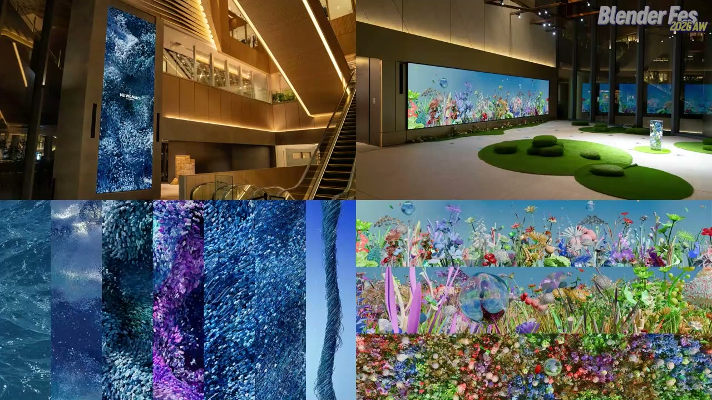
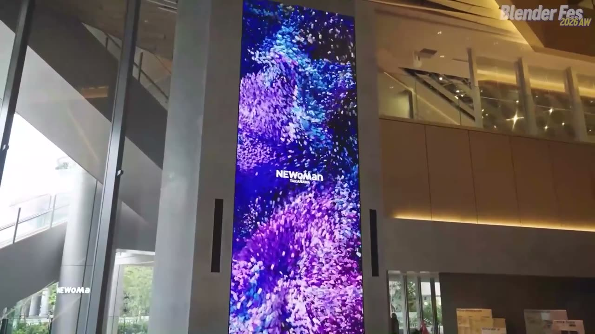
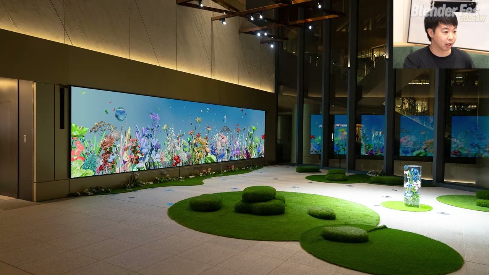
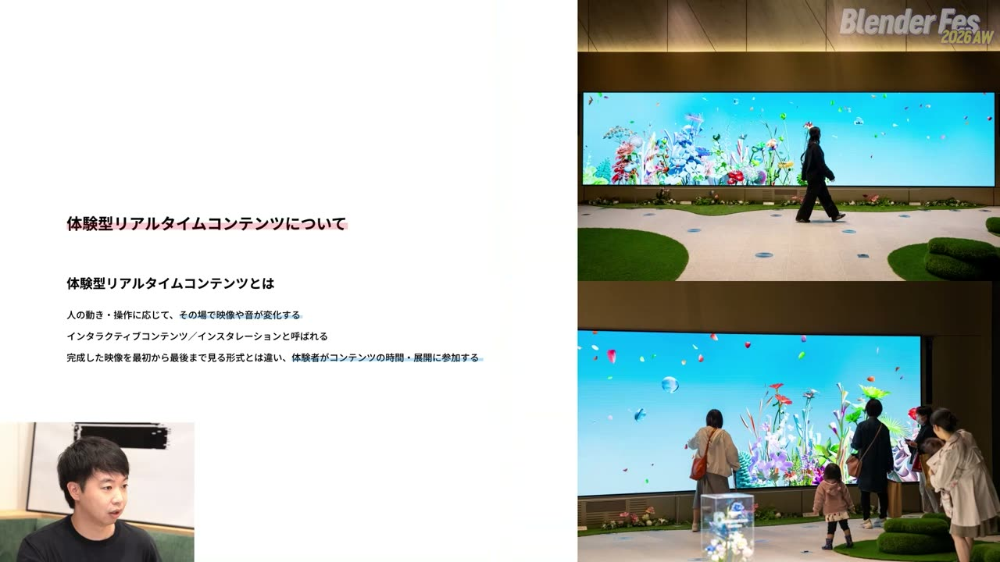
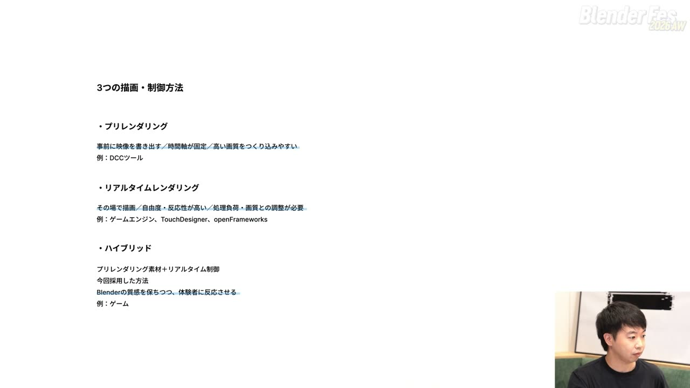
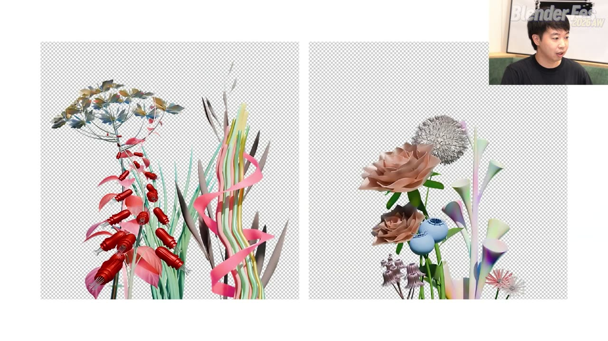
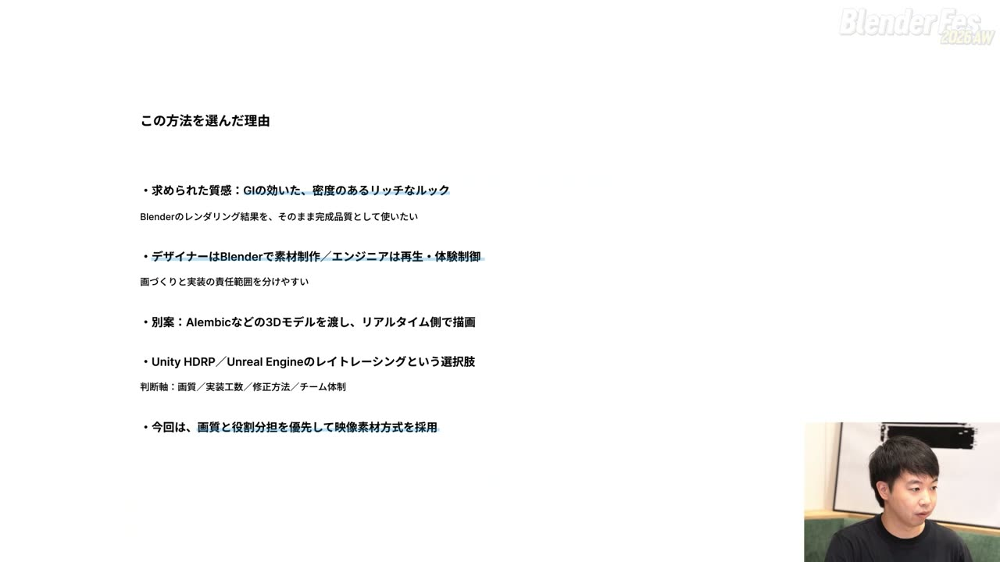
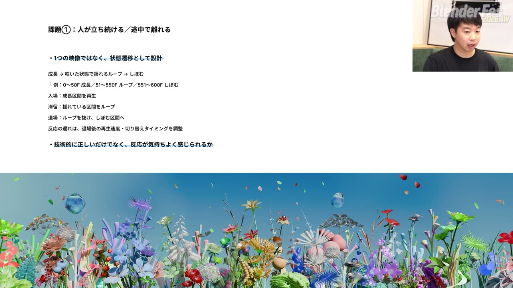
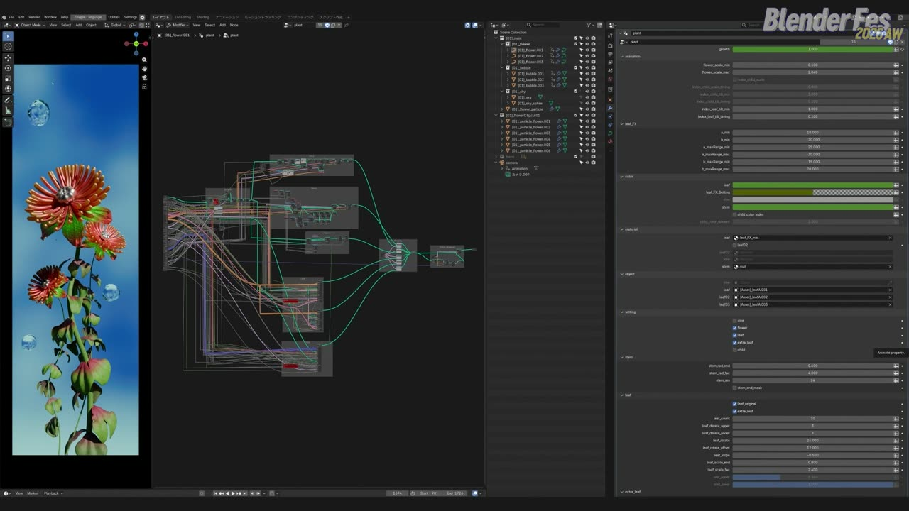
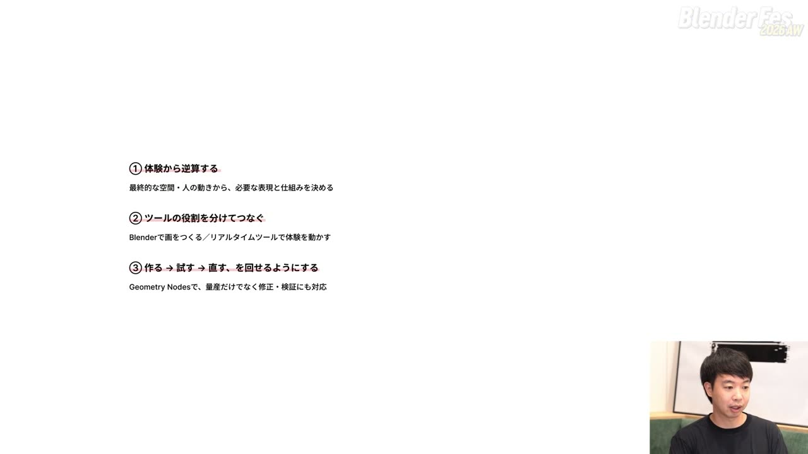

# Blender Fes 2026 AW: Blenderから広がる、体験型リアルタイムコンテンツのつくり方 — 絵はBlender、体験はリアルタイム側で

LED の前に立つと足元から花が咲き、離れるとしぼんでいく。そんな体験型の展示を見ると、ゲームエンジンで花を 1 本ずつリアルタイムに描いているように感じるかもしれません。

ところが、このセッションで紹介された作品の花は、Blender の Cycles でレンダリングした「映像」でした。リアルタイム側は、その映像をどこに置き、どのフレームを再生するかを制御しています。

Blender Fes 2026 AW の Day2、12:30 から配信されたセッション **「Blenderから広がる、体験型リアルタイムコンテンツのつくり方」** では、raw inc. の中野雄太さんが、商業施設 NEWoMan TAKANAWA に常設されている LED 作品を題材に、設計から現場での調整までの流れを解説しました。

本記事では、配信を視聴した内容をもとに、映像制作の技術を体験型コンテンツへつなぐ考え方を整理します。

---

## セッション概要

| 項目 | 内容 |
|:---|:---|
| **タイトル** | Blenderから広がる、体験型リアルタイムコンテンツのつくり方 |
| **イベント** | Blender Fes 2026 AW Day2 |
| **形式** | オンライン配信（講演） |
| **日時** | 2026年9月27日（日）12:30–13:30 |
| **対象** | Blender と 3DCG の基礎知識がある人。ハンズオンではなく考え方とワークフローの紹介 |
| **スピーカー** | 中野雄太（raw inc. Co-Founder / Creative Director）、寺澤佑希斗（raw inc. CG Designer） |
| **題材** | NEWoMan TAKANAWA「IMAGINATION OCEAN」「IMAGINATION GARDEN」 |

---

## 背景: 映像の「外」に出るコンテンツ

Blender Fes のセッションの多くは、最終的な出力が映像作品です。このセッションは出力先が大型 LED やサイネージ、インスタレーションといった空間で、少し経路が違う内容だと冒頭で説明されていました。

ここでいう体験型リアルタイムコンテンツとは、人の動きや操作に応じて、その場で映像や音が変わるコンテンツのことです。体験者がコンテンツの時間の進み方に参加するため、映像だけでなく体験や空間の設計まで考える必要があります。

---

## セッション詳報

### raw inc. と題材の作品（12:30〜）

冒頭では中野さんが自己紹介と会社紹介をしました。raw inc. は 2022 年設立の会社で、3DCG、体験型コンテンツとインスタレーション、メディア制作を柱にしています。3DCG とプログラミングを掛け合わせ、プリレンダリングから開発までを一貫して手がける点が特徴だそうです。

事例として、大阪・関西万博のシグネチャーパビリオン「null²」（表記要確認）でのビジュアル開発や、東京 2025 デフリンピックで開発した、卓球の打球や攻守を AI が判別して可視化するシステム「見る音」（表記要確認）が挙げられました。

続いて記録映像で、高輪ゲートウェイ駅直結の商業施設 NEWoMan TAKANAWA に常設されている LED 作品が紹介されました。縦長 LED の「IMAGINATION OCEAN」は海や粒子が 1 本の縄のような線へまとまっていく約 1 分 30 秒の映像、「IMAGINATION GARDEN」は見たことのない植物の庭園をカメラが進む映像です。どちらもアドオンを使わず Geometry Nodes で作り、最後まで Blender だけで仕上げたそうです。

講演の中心は、別エリアの横長 LED に設置された「IMAGINATION GARDEN」の体験型バージョンでした。LED の前に人が立つと花が咲き、離れるとしぼみます。立つ位置によって植物の見た目や音が変わり、複数の人が同時に体験できる設計です。縦長 LED の作品と違って時間軸が固定されず、体験者の位置や人数、滞在時間によって展開が変わります。

### 担当区分と「3 つの描画方法」（12:43〜）

raw inc. が担当したのは 2 つです。1 つはコンセプトを具体的なビジュアルに落とし込むデザイン、もう 1 つは Blender からリアルタイム側へ素材を渡すまでを含むシステム設計でした。実装は Enigma（表記要確認）という会社が担当し、素材の作り方や渡し方を相談しながらチームで進めたそうです。

最終的な絵を出す方法として、次の 3 つが整理されていました。

| 方法 | 特徴 | 例 |
|:---|:---|:---|
| プリレンダリング | 事前に映像を書き出す。時間軸は固定だが、高い画質を作り込みやすい | Blender、Cinema 4D、Houdini などの DCC ツール |
| リアルタイムレンダリング | その場で描画する。自由度と反応性が高いが、処理負荷と画質の調整が必要 | Unity、Unreal Engine、TouchDesigner、openFrameworks |
| ハイブリッド | プリレンダリング素材をリアルタイムに制御する。Blender の質感を保ちつつ体験者に反応できる | ゲームのイベントシーン |

ハイブリッドの例は、操作中はリアルタイムに描画し、イベントで作り込んだ映像に切り替えるオープンワールドのゲームです。今回の作品もこの方式で設計されました。

### 体験型コンテンツの難しさ（12:49〜）

難しい点の 1 つめは、体験者の動きを事前に決められないことです。いつ来るか、どこに立つか、何人来るか、どれだけ留まるかは読めません。1 本の完璧なアニメーションでは対応できないため、映像のタイムラインではなく「状態」と「状態遷移」として考えることが重要だと説明されていました。

2 つめは、デザインと実装を同時に考えることです。入力や判定、状態管理、再生制御が必要になるため、デザイナーとエンジニアで素材の仕様、命名、再生ルールを共有し、見た目と反応の速さ、安定性を両立させる必要があります。

3 つめは、空間まで含めて完成形になることです。画面の大きさや縦横比、見る距離、音の聞こえ方、立ち位置、人の流れによって印象は変わります。

> PC の画面で見て OK、ではなく、空間にインストールしたときにどう見えるかが重要です。

PC 画面では良くても、実寸では動きが速すぎたり細部が見えなかったりします。そのため、現場での確認と調整を最初から制作工程に組み込んでおく、という考え方が示されました。

### なぜ Blender を選んだのか（12:53〜）

社内には Cinema 4D や Houdini を使うデザイナーもいる中で、今回は Blender を選んだそうです。理由は 2 つでした。

**無料であること。** 作品の解像度は 8K を超え、修正量も最後まで読めなかったため、レンダーサーバーに加えて手元の複数 PC でも分散してレンダリングしたそうです。ライセンスの制約がなく、会社と自宅で同じ環境をそろえやすい点が効いたと語られていました。

**Geometry Nodes があること。** 形や動き、バリエーションを非破壊で組めるため、パラメータを変えて再レンダリングする試行錯誤がしやすくなります。現場で必ず出る「少し速い」「もう少し大きく」といった声に備え、該当箇所を最初からパラメータとして外に出しておけます。

### 映像素材方式という設計（12:56〜）

全体の方針は、Blender で映像素材を書き出し、リアルタイム側で配置と再生制御を行うというものです。横長 LED の花は横に 8 グループに分かれ、さらに前後の奥行きごとに別々の映像として書き出されています。コーデックには、アルファ付きで扱える HAP を採用したそうです。

この方法を選んだ理由として、まず求められた質感が挙げられました。GI の効いた、密度のあるリッチな見た目にしたいという要望があり、Blender のレンダリング結果をそのまま完成品質として使いたかったそうです。すべてを Unity や Unreal Engine、TouchDesigner でリアルタイムに描くと、どうしてもゲームらしい見た目に寄ってしまうという懸念がありました。

もう 1 つは役割分担です。デザイナーは Blender で素材を作り、エンジニアは再生と体験の制御を受け持ちます。最初に素材の渡し方を決めたテスト用データを実装側に渡し、双方が並行して作業を進め、最後に現場で合わせる流れでした。

別案として、Alembic などで 3D モデルを渡してリアルタイム側で描く方法や、Unity HDRP、Unreal Engine のレイトレーシングも検討されましたが、スタディで想定のルックに近づかず見送ったそうです。判断軸は「画質／実装工数／修正方法／チーム体制」で、今回は画質と役割分担を優先しました。

### 3 つの課題と解き方（13:01〜）

映像素材方式を選ぶと、別の課題が出てきます。講演では 3 つの課題と解き方が紹介されました。

**課題 1: 人が立ち続ける、途中で離れる。** 1 本の映像を「成長」「咲いた状態で揺れるループ」「しぼむ」の 3 区間に分けました。例として示されたのは、600 フレームのうち 0〜50 を成長、51〜550 を揺れのループ、551〜600 をしぼむ区間にする設計です。人が来たら成長区間から再生し、留まる間はループ区間を繰り返し、離れたらループを抜けてしぼむ区間へ進みます。

ループ序盤で人が離れるとしぼむまでに間が空くため、離れたときは再生速度を上げるよう再生制御側で調整したそうです。

> 技術的に正しいだけでなく、反応が気持ちよく感じられるかを念頭に設計しました。

**課題 2: 植物の配置と前後関係が固定される。** 「ここに立つとこの植物が出る」という対応が見抜かれやすく、ランダムさが薄れます。そこで植物の上を花びらが舞う演出をリアルタイム側で加えました。花びらは奥行きを持って横切り、手前に植物があると奥へ隠れるため、見え方が状況ごとに変わります。

**課題 3: 隣の花の有無で影の見え方が変わる。** 全グループが並んだ状態でレンダリングすると花同士の影が焼き込まれ、1 人しか立っていないときに不自然になります。これは影ありと影なしの素材パターンを用意し、周囲の状況に合わせて差し替えることで解決していました。

### ハイブリッド方式の代償と制作サイクル（13:07〜）

高い画質を保てる一方で、状態が増えるほど素材の数と組み合わせは増えます。すべての組み合わせを作るのではなく、破綻する条件を先に見つけ、エリアやグループ、前後関係を管理できる単位に整理します。実装前の設計が制作量を大きく左右する、という指摘でした。

ここまでの話は、次の制作サイクルとしてまとめられていました。

1. 体験者の動き、必要な状態、起こりうる破綻を洗い出す
2. 必要な映像素材、前後関係、影のパターンを設計する
3. Blender で制作し、書き出す
4. Unity で体験と再生状態を事前にシミュレーションし、デバッグする
5. TouchDesigner で本番実装する（実装を担当した会社が使っていたツール）
6. 現場の実寸 LED で確認する
7. Blender に戻って修正し、再出力と再確認を行う

4 番では Unity で専用のアプリを作り、現場に入る前に検証したそうです。それでも現場では、PC 上では見えなかった影や重なりの粗、実寸での速さの違いが出てきます。現場調整は最後の微調整ではなく、制作工程の一部だと位置づけられていました。

### 修正に強い Geometry Nodes の組み方（13:11〜）

映像素材方式の弱点は、修正のたびに Blender に戻って再レンダリングし、素材を渡し直す手間です。素材が多いほど、修正と確認のコストも増えます。

この弱点を補うのが Geometry Nodes でした。モデリング、配置、アニメーションを仕組みにしておき、パラメータの変更を複数の植物や素材に一括で反映できるようにします。手作業で直す箇所を減らし、試行錯誤の回数を確保する狙いです。

見た目の違う 4 種類の植物も、茎、葉、花びらという基本構造と組み方は共通です。花びらの枚数や葉の分岐まで仕組みにして組み合わせ、新しい植物を量産していったそうです。どう組み合わせるとどんな植物になるかという決め事は、制作前にデザイナー間で共有していました。

画面のモディファイアーパネルには、成長度合いや揺れの強さ、花のスケール、色、マテリアル、参照する葉のオブジェクト、要素ごとの表示切り替えといった項目が並んでいました。制作の終盤、現場で検証する段階に入ってからは、ノードエディタを開くことは基本的になく、外に出したパラメータの調整と参照オブジェクトの差し替えだけで修正していたそうです。

> 見た目だけでなく、実装に合わせて修正できる仕組みを作ることが大事です。

この意味で、Geometry Nodes はデザインと開発をつなぐ架け橋のような位置にある、と中野さんは表現していました。

### 振り返りと、これからの Blender（13:17〜）

振り返りでは、現在の Blender の機能で最後まで完走でき、決定的に不足する機能はなかったと語られました。重要なのは制作者の設計と技術だという実感だったそうです。

今後の Blender への期待としては、ノードやアセットの再利用、管理、共有のしやすさと、表現に応じて選べるレンダラーの選択肢が挙げられました。後者は、Cycles だとどうしても「Cycles らしい」見た目に寄るという実感から出た希望です。

AI については、3DCG はまだ意図どおりに制御しにくいとしたうえで、すべてを生成するより、Geometry Nodes の下地づくりやノードの整理・命名といった制作途中の作業を支援してほしい、という期待が語られました。

### まとめのメッセージ（13:20〜）

最後に、「体験から逆算する」「ツールの役割を分けてつなぐ」「作る、試す、直すを回せるようにする」の 3 点が大事なこととして挙げられました。

映像制作のスキルは体験型コンテンツづくりにもつながっている、空間演出に興味を持つきっかけになればうれしい、と呼びかけて講演は締めくくられました。

---

## スピーカー紹介

### 中野雄太（raw inc. Co-Founder / Creative Director）

クリエイティブディレクターとして案件を率いながら、自らもデザイナー、エンジニアとして手を動かしていると自己紹介していました。講演でも、見た目の話と再生制御の話が常にセットで語られていたのが印象的でした。

### 寺澤佑希斗（raw inc. CG Designer）

raw inc. の CG デザイナーです。配信の音声では寺澤さんの発言場面を特定できなかったため、本記事では個別の発言を寺澤さんのものとして扱っていません（要確認）。

---

## まとめ

このセッションは、Blender のテクニックそのものより「映像制作の技術を、体験型コンテンツにどう接続するか」という設計の話に重心がありました。要点を表にまとめます。

| 論点 | 今回の選択 | 持ち帰りたい考え方 |
|:---|:---|:---|
| 描画方法 | プリレンダリング素材をリアルタイム制御するハイブリッド方式 | 画質、実装工数、修正方法、チーム体制を判断軸にして選ぶ |
| 時間の扱い | 成長・ループ・しぼむの 3 区間と再生点の制御 | タイムラインではなく状態と状態遷移で考える |
| 固定配置と影 | リアルタイムの花びら演出、影あり・影なし素材の差し替え | 破綻する条件を先に見つけ、管理できる単位に整理する |
| 修正コスト | Geometry Nodes のパラメータを外に出して一括修正 | 現場で直すことを前提に、仕組みとして作っておく |

リアルタイムで描くか映像で書き出すかは二者択一ではなく、求められる画質と体制に合わせて組み合わせられる、という点がこの講演のいちばんの示唆と言えそうです。

---

## 参考リンク

- [Blender Fes 2026 AW「Blenderから広がる、体験型リアルタイムコンテンツのつくり方」チャンネルページ](https://cgworld.jp/special/blenderfes/vol7/?channel=channel-951)
- [Blender Manual: Geometry Nodes](https://docs.blender.org/manual/en/latest/modeling/geometry_nodes/index.html)
- [Blender Manual: Geometry Nodes Modifier](https://docs.blender.org/manual/en/latest/modeling/modifiers/generate/geometry_nodes.html)
- [TouchDesigner: HAP](https://docs.derivative.ca/HAP)
