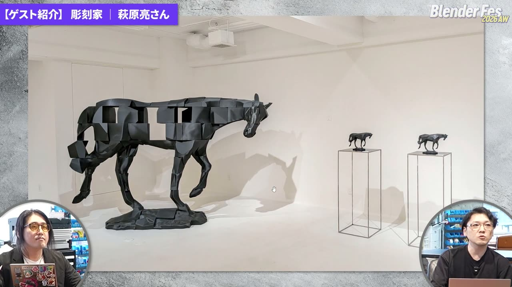
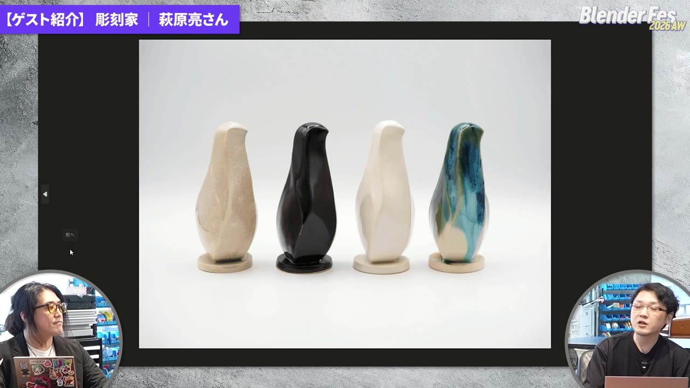
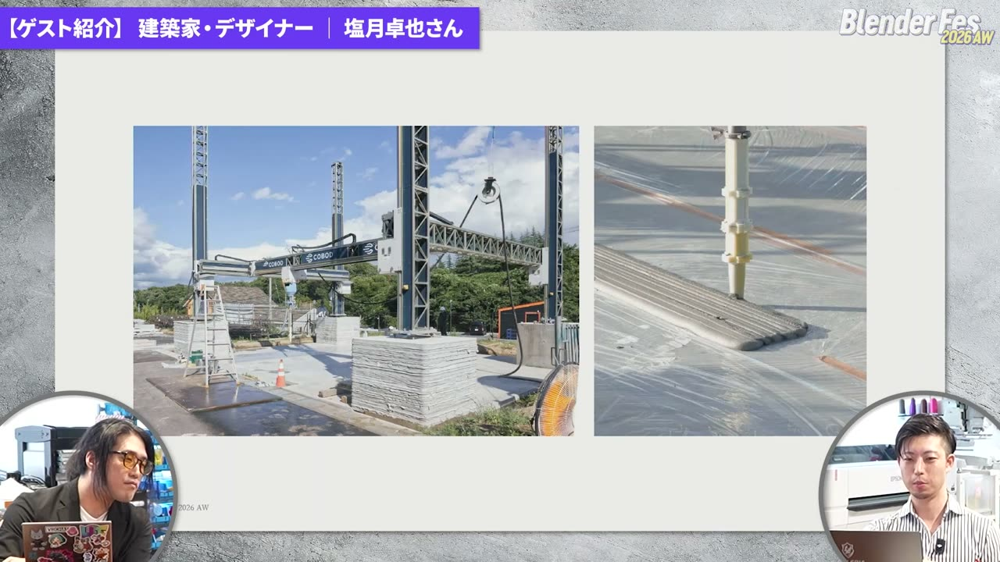
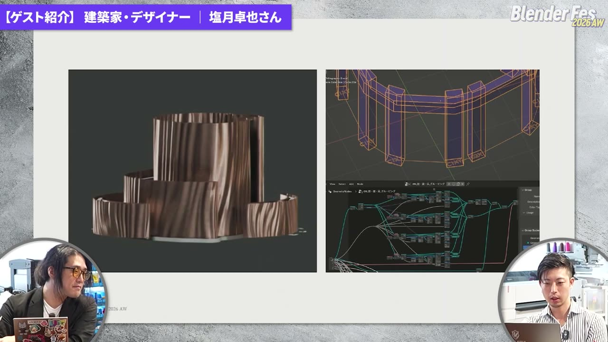
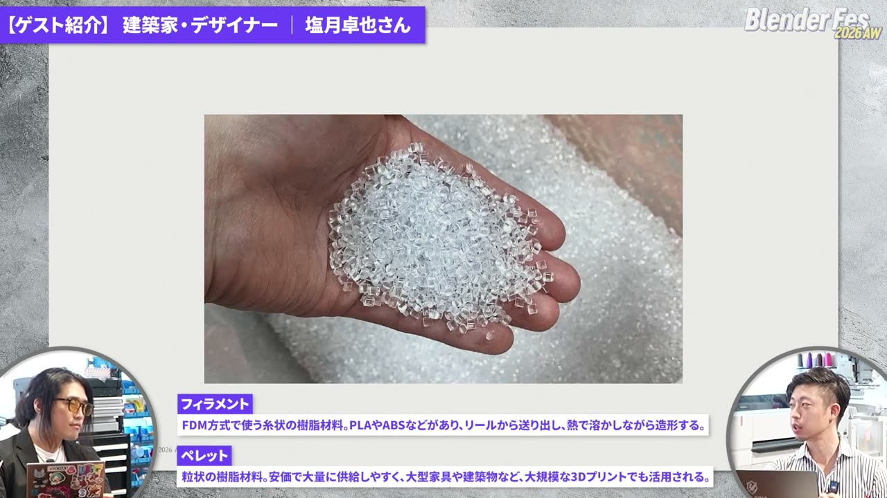
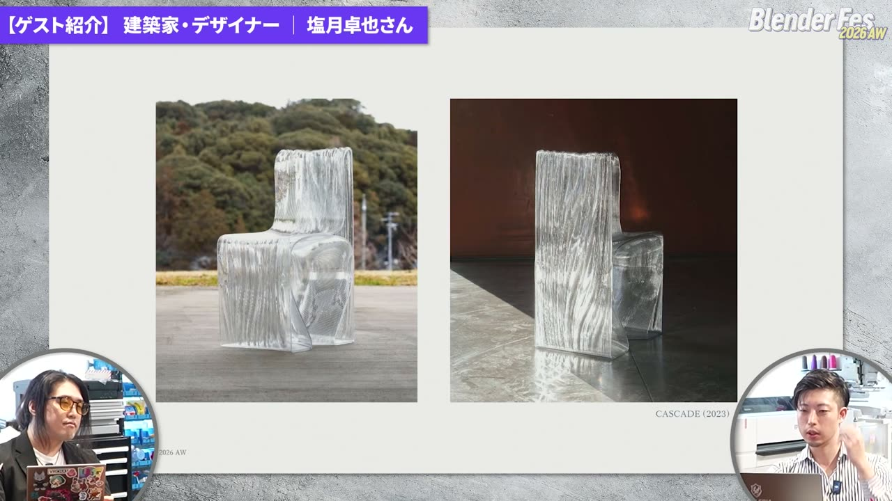
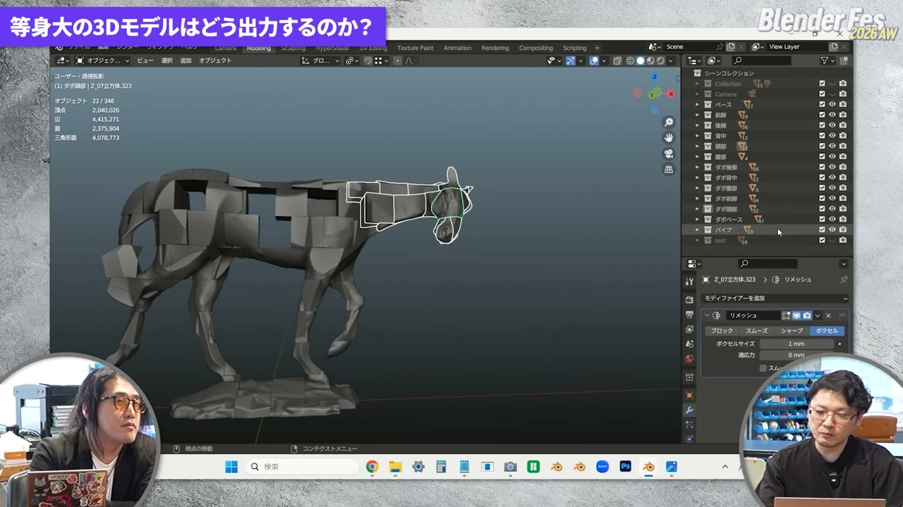
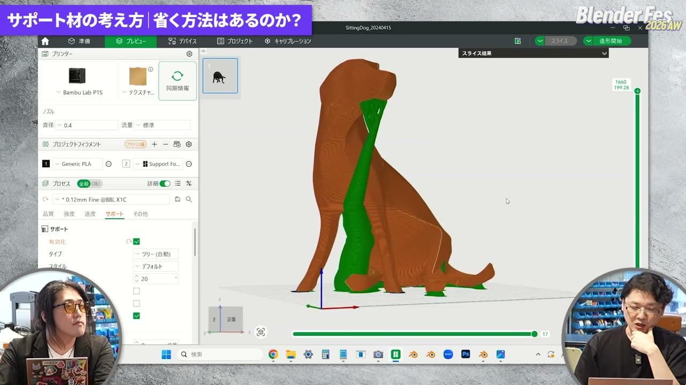
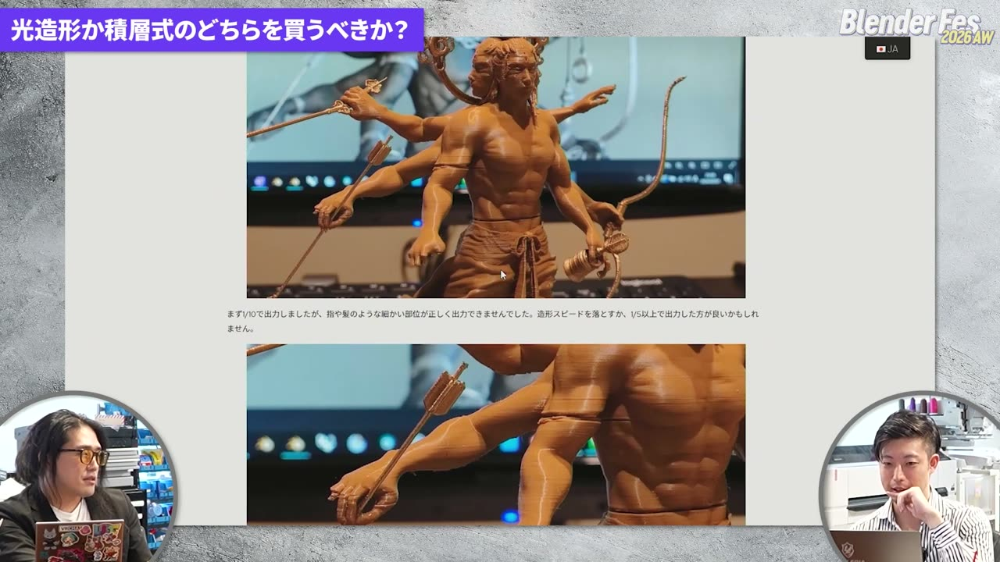

# Blender Fes 2026 AW: Blender × 3Dプリント ― 画面の中の形を、手に取れるものにするまで

Blender Fes 2026 AW の Day2 に配信された **「Blender × 3Dプリント クリエイターが語る制作の裏側」** は、Blender で作ったデータを 3D プリントで実物にしている 2 人のクリエイターを迎えた対談です。Blender Fes として初めての外部ロケで、渋谷・道玄坂の FabCafe Tokyo から配信されました。

登壇者は、彫刻家の萩原亮さんと、建築家・デザイナーの塩月卓也さんです。司会は 3D モデラーで大学講師のますくさんが務めました。機材や素材の選び方、サポート材の考え方、量産や販売まで、テーマごとに経験を聞いていく構成でした。

本記事では、対談で語られた判断の基準と、Blender 側でできる準備を中心に整理します。

---

## セッション概要

| 項目 | 内容 |
|:---|:---|
| **タイトル** | Blender × 3Dプリント クリエイターが語る制作の裏側 |
| **イベント** | Blender Fes 2026 AW Day2 |
| **形式** | オンライン配信（対談） |
| **日時** | 2026年9月27日（日）13:45–14:45 |
| **登壇** | 塩月卓也（ZKI design Inc. / VERCE / SUIGEN、建築家・デザイナー）/ 萩原亮（彫刻家） |
| **司会** | ますく（3Dモデラー/大学講師） |

---

## 冒頭：デジタルファブリケーションとオープンソース（13:45〜）

ますくさんは、データを 3D プリンターなどで実物にする「デジタルファブリケーション」の話から始めました。クリス・アンダーソンの著書『MAKERS』を引き、ものづくりの民主化を支えたオープンソース文化の代表として Blender を位置づけていました。

---

## ゲスト紹介

### 萩原亮さん：出力をそのまま作品にも、原型にもする（13:46〜）

萩原さんは大学在学中から 3DCG を制作に取り入れ、コロナ禍の頃から Blender と 3D プリントを組み合わせるようになりました。出力をそのまま作品にするほか、ブロンズや陶器に置き換えることもあります。3D データなので、カプセルトイのような展開もしやすいそうです。

### 塩月卓也さん：建築から家具まで、Blender で形を検討する（13:48〜）

塩月さんはゼネコンで大型建築の設計を担当したあと独立し、建築、インテリア、プロダクト、インスタレーションを横断して制作しています。Blender は大学時代の 2011 年から使っていて、設計の検討やビジュアライゼーションに活用してきました。

独立後の代表例が、モルタルの 3D プリントで建てた住宅です。国内で初めて 2 階建てを 3D プリントで実現した例だと紹介されました。宮城県にあり、現在は民泊として宿泊できるそうです。

この住宅では、壁の中に構造用の柱を仕込んでいます。Blender のジオメトリーノードでパラメトリックにモデルを組み、断熱材を入れる隙間の形はブーリアンで求めました。その体積を「3D Print Toolbox」アドオンで計算し、断熱材の数量の見積もりに使ったそうです。

塩月さんは、水の流れを主題にしたブランド「SUIGEN」も展開しています。透明な樹脂のペレットを大型機で溶かして積層し、使う人に合わせた寸法で注文を受けられるのが特徴です。今年はミラノサローネに出展し、海外の来場者から「ガラスですか」と聞かれることも多かったそうです。

---

## セッション詳報

### 最初の 1 台と最初の 1 個（13:56〜）

最初のテーマは、3D プリンターとの出会いでした。

萩原さんが 2020 年ごろに最初に買ったのは TRONXY X5SA（表記要確認）で、40cm 角ほどを出せたものの精度は今ひとつだったそうです。最初の出力は付属 SD カードのキューブで、実物が出てくるだけで嬉しかったと振り返っていました。

塩月さんが初めて自分で出力したのは、会社が導入したプリンターでのスザンヌでした。スザンヌは目のまわりなどに張り出しが多く、サポート材が大量に付いて大変だったそうです。司会からは、最初はテンプレートで出してみて、次に難しい形のスザンヌをきれいに出すことを目標にするとよい、という提案がありました。

### なぜ Blender なのか、ほかのツールとの組み合わせ（14:00〜）

建築の設計者は SketchUp で検討する人が多いそうです。塩月さんは CG から入ったので、曲面を自由に作れてそのままレンダリングもできる Blender が合っていたと話しました。萩原さんは Maya やメタセコイアを経て Blender に落ち着きました。彫刻の分野では ZBrush でスカルプトする人が多いものの、萩原さんは頂点を動かすポリゴンモデリングのほうが肌に合うそうです。

ほかのツールとの組み合わせでは、2 人の流れが対照的でした。

- **萩原さん**：粘土で形を検討し、Revopoint の 3D スキャナーで取り込みます。Blender でリトポロジー（ポリゴンを張り直す作業）をして、最終形を決めます
- **塩月さん**：検討は Blender で行い、実際に作る段階では Rhinoceros に持っていってサーフェスに変換します。大型機では、Grasshopper で G コード（プリンターのヘッドの動かし方を記述したデータ）を直接生成します。一筆書きにしたり、吐出量や速度を細かく制御したりするためです

通常はスライサー（モデルを層に切り分けて G コードを作るソフト）が書き出すので、自分で書く必要はありません。

### Blender でできる出力前の確認：3D Print Toolbox（14:06〜）

おすすめのアドオンとして 2 人がそろって挙げたのが **3D Print Toolbox** です。Blender 公式の Extensions から入手できる 3D プリント向けのアドオンで、萩原さんは日本語表示で使っていました。

- **体積や表面積の計算**：塩月さんは住宅の断熱材の見積もりに使いました。シルバーなど金属で出力するときは材料の量に直結するので、数字がよりシビアになるそうです
- **エラーの検出**：面に穴が開いている、薄すぎるといった、出力で問題になる箇所を洗い出せます
- **置き方の検討**：萩原さんは、選んだ面を下に向けて配置する機能をよく使うそうです。スライサー側でもできる操作ですが、スライサーはメーカーごとに癖があるので、慣れた Blender 側で決められると便利だという話でした

### 機材の選び方（14:09〜）

熱溶解積層方式（FDM）の機材では、Bambu Lab の名前が真っ先に挙がりました。萩原さんは Bambu Lab P1S を使っていて、この機種以降に業界全体の造形スピードと品質が上がったと評価していました。ユーザーが多く、トラブルの解決策を見つけやすいことも利点です。

塩月さんは、大きいほうが有利だと考えて最初に大型機を買ったそうです。ところが熱のトラブルで止まることが多く、大きな造形が途中で止まると損失も大きくなりました。現在は小さいものを Bambu Lab A1 mini で出していて、2 万円台で安定していることを評価していました。次に買うなら、Bambu Lab の筐体に囲われた機種で、造形サイズが 300mm を超えるものを選ぶそうです（機種名は明言なし）。

### 等身大の馬はこう分割した（14:11〜）

等身大の馬は、一般のユーザーが持てる環境で作ることをコンセプトにしています。すべて P1S で出力されました。

- **分割サイズ**：P1S の造形範囲は仕様上 256mm 角です。ただ、一部に造形できない領域があるため、各ブロックを 230mm 角に収めて分割しました
- **構造**：荷重がかかる部分にはアルミのパイプを芯として仕込み、パーツ同士はダボを入れて接着しています。荷重がかからない部分は、ブロックに穴を開けて 3D プリントの接合パーツでつないでいます
- **軽量化**：自重を支えるため、内部の充填率を 3% まで下げています。荷重がかかる部分だけ充填率を上げたそうです
- **数字**：高さ約 180cm、重さ約 40kg で、1kg 巻のフィラメントを 40 巻ほど使っています。ノズルは標準の 0.4mm のままで、1 ブロックに最長 30 時間かかりました。そのため P1S を 2 台に増やしたそうです

画面では、パーツがコレクションごとに整理され、一部のオブジェクトにボクセルサイズ 1mm のリメッシュモディファイアーが付いているのが確認できました。

### 素材の選び方と表面処理（14:14〜）

萩原さんは当初 ABS を使っていました。アセトンという溶剤で接着でき、アセトンの蒸気で表面を薄く溶かしてなめらかにできるからです。ただ、実験を重ねてもうまくいかず、造形中のにおいも気になったそうです。さらに、A1 や A1 mini のような筐体のないオープン型の機種では、全体を高温に保てないため反りが出やすくなります。こうした理由から、現在は PLA を使っています。

塩月さんも、試作には圧倒的に PLA を使うそうです。透明の PLA もあり、価格も落ち着いています。SUIGEN の作品は積層の跡をデザインの一部として生かしているので、削ってなめらかにする作業はあまりしないとのことでした。

表面処理について、萩原さんの方法は地道なものでした。パテで積層の跡を埋めて削る作業を繰り返し、表面を整えてから塗装します。PLA は塗料が密着しにくい素材ですが、先に軽くやすりをかけて表面を荒らしておくと食いつきが良くなる、という助言もありました。

ペレット式の大型機は何でも溶かせるように見えますが、そうではないそうです。ペットボトルのキャップに多い PE や PP は反りやすく、3D プリントには向きません。塩月さんの大型作品は、ポリカーボネートに近い性質を 3D プリント向けに調整した専用材料を使っています。

### 試作から量産へ：型は作った本人が決める（14:21〜）

萩原さんは、陶器の作品の型と原型を会場に持ち込んで説明しました。流れは次のとおりです。

1. Blender で原型を作り、3D プリントで出力して表面を整える
2. 原型のまわりに型も 3D プリントで作り、どこで分割すれば一発で抜けるかを形で示す
3. それを職人に渡し、石膏で型を複製してもらう
4. 溶かした粘土を石膏型に流し込み、石膏が水分を吸ったら外す。これを繰り返して数を作る

3D プリンターは一つずつ造形するので、量産には向いていません。一方、どこで型を分ければ抜けるかは、作った本人が一番よく分かっています。その意図を職人や工場に伝える手段として 3D プリントを使っている、という整理でした。ブロンズの場合はシリコン型で抜けるため、抜き勾配をあまり気にしなくてよいそうです。

### 外注という選択肢：金属・光造形（14:24〜）

金属では、CGWORLD の中高生向け 3DCG コンテストのトロフィー（名称要確認）が紹介されました。金属粉末をレーザーで溶かして固めるステンレスの 3D プリントで、粉末が造形物を支えるためサポート材は基本的に不要です。

ジュエリーでは、光造形用のキャスタブルレジン（鋳造用レジン）がよく使われます。出力した造形物を型材に埋めて焼くと、樹脂が溶けて抜け、空洞に金属を流し込めます。キャスタブルレジンで出力して鋳造所に持ち込み、ジュエリーにしてもらう人もいるそうです。

塩月さんのシルバー（925）の指輪は、Blender から STL を書き出してそのまま業者に入稿したものです。カーブを重ねて作ったモデルなので、STL にする段階でメッシュに変わります。そのため、最もきれいに見える細かさに設定してから書き出したそうです。金属で作る前に、粉末積層の別素材で一度テスト出力し、細い部分が持つかを確かめていました。外注先としては、CASTY（表記要確認）、JLC3DP、DMM.make の名前が挙がりました。研磨やサポート跡の処理まで任せられるのが外注の利点です。

### サポート材は「付けない設計」が一番（14:29〜）

宙に浮く部分は、下から支えるサポート材がないと出力できません。ただ、外すのが大変で、本体が折れることもあります。

塩月さんは、そもそもサポートが要らない設計を優先しています。ペレット式の大型機はサポートを作れないので、一筆書きで出せる向きと形を最初から考えるそうです。洗面ボウルのような形も、上下を逆にしてオーバーハング（下に支えのない張り出し）をなくして出力していました。

萩原さんは、Bambu Lab のスライサー画面でサポートの様子を見せました。

サポートを本体と別の材料で出す方法もあります。複数の材料を使い分けられる機種なら、水に溶けるフィラメントや、本体とくっつきにくい PETG などをサポート側に使うと外しやすくなります。塩月さんは以前の会社で溶けるサポート材を試しましたが、超音波洗浄機にかけても跡が残ったそうです。

2 人に共通していたのは、次の 2 点です。

- **サポートの接点は目立たない場所に置く**：熱溶解積層では、サポートが付いた下向きの面が荒れます
- **跡の処理を前提にする**：光造形でもプラモデルのランナーのように跡が残るので、切ったあとに磨く工程を見込んでおきます

### 光造形か、熱溶解積層か（14:33〜）

初心者が必ず迷う問いに、塩月さんは自身の作品で答えました。題材は、3D プリントのコンペ向けに Blender で作った「金剛夜叉明王像」です。

最初は大型の熱溶解積層機 ELEGOO Neptune 4 Max（表記要確認）で 1/10 に縮小して出力しました。すると、指や腕が途中で切れるなど、細かい部分がうまく出ませんでした。大きく出力し直すと、破綻はほぼなくなったそうです。

判断の目安は次のように整理されていました。

| 作りたいもの | 向いている方式 | 理由 |
|:---|:---|:---|
| 小さなフィギュア、髪の毛や装飾のある細かい造形、アクセサリー | 光造形 | 細部が出やすい |
| 等身大など大きなもの、数を早く出したいもの | 熱溶解積層 | 大きいと積層の跡が目立たず、材料も安い |

材料費の差も大きく、PLA は 1kg で 1,000 円を切ることもあります。一方、光造形のレジンは 500ml で 7,000 円ほどになることもあるそうです。

### 続けていくための売り方（14:37〜）

最後のテーマはマネタイズでした。2 人の考え方は、はっきり分かれました。

- **萩原さん：データを流通させる**。3D プリントは量産に向かないので、データを販売し、出力は購入者に任せています。改変や二次創作も歓迎していて、小さな犬の作品を実物大で出力した人もいるそうです。データの価格は抑えめにしていて、作品が広まっていくことを楽しんでいると話していました
- **塩月さん：再現できないことを価値にする**。SUIGEN の作品は、特定の大型機でなければ出せない形にしています。同じプリンターを買っても調整が難しく、再現しにくいことが独自性になります。そのため、技術力のある国内の工房に出力を頼んでいます

ミラノサローネでは作品を木箱で運んだため、輸送費が大きくかかったそうです。データだけ送って現地で出力できれば関税の面でも理想的だ、という話も出ました。

ますくさんは、2 人とも一人で完結させているわけではない点に注目しました。萩原さんによると、彫刻は一人で木や石を彫るイメージが強いものの、ブロンズや陶芸は専門の職人との分業が基本です。原型までを自分で作り、その先を職人に任せるやり方は、その伝統に近いと話していました。

---

## まとめ

締めくくりに萩原さんは、3D プリンターを買わなくても、データを作れれば出力サービスで実物にできると勧めていました。会場の FabCafe のようなデジタルファブリケーションの拠点を使う方法もあります。塩月さんは、CG で作った空想の形が初めて現実に出てきたときの感動を、多くの人に知ってほしいと話しました。

対談を通して見えてきたのは、出力の質を決める要素の多くが、Blender でモデリングしている段階ですでに決まっているということです。

- 造形範囲に収まる分割
- 細部が出る大きさ
- サポートが要らない向き
- 型が抜ける分け目

こうした判断をデータの段階で済ませておくと、プリンターや職人に渡したあとの手戻りを減らせそうです。まずは手元のデータを 1 つ、サービスに出してみるところから始めてみるとよいかもしれません。

---

## 登壇者紹介

### 塩月卓也

ZKI design Inc. / VERCE / SUIGEN。建築家・デザイナーです。建築からプロダクトまでを横断して制作しています。

### 萩原亮

彫刻家です。Blender と 3D プリントで原型を作り、樹脂・ブロンズ・陶器の作品を手がけています。

### ますく（司会）

3D モデラー、大学講師です。

---

## 参考リンク

- [Blender Fes 2026 AW セッションページ](https://cgworld.jp/special/blenderfes/vol7/?channel=channel-940)
- [3D Print Toolbox（Blender Extensions）](https://extensions.blender.org/add-ons/print3d-toolbox/)
- [Bambu Lab](https://bambulab.com/)
- [FabCafe Tokyo](https://fabcafe.com/tokyo/)
