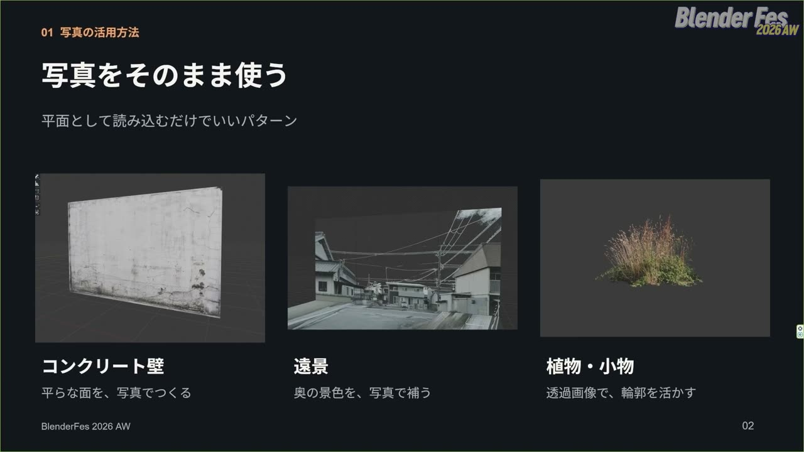
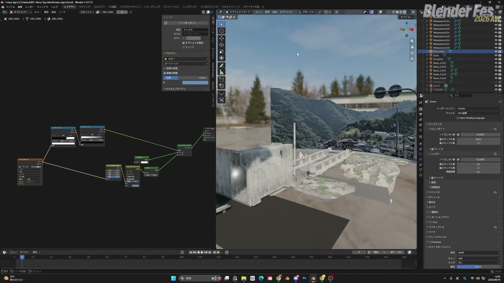
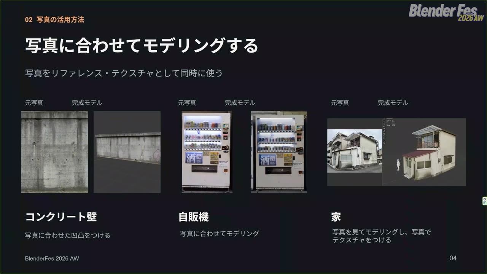
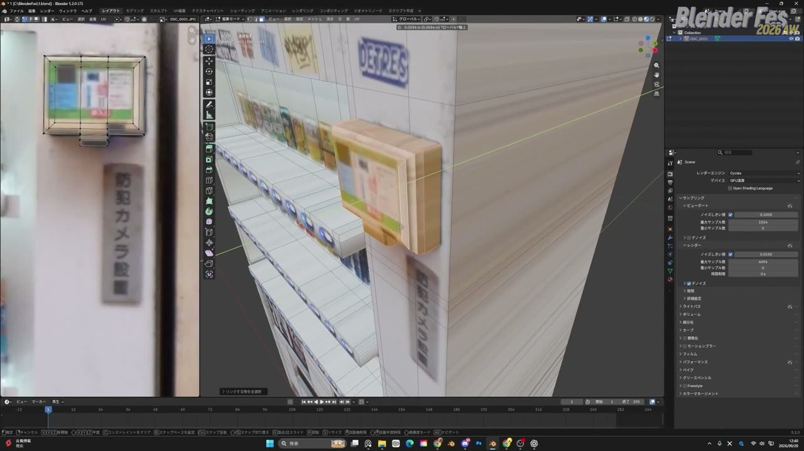
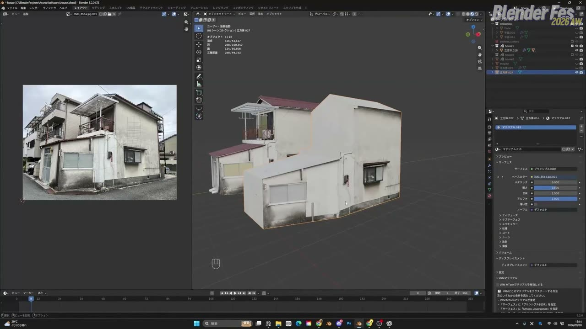
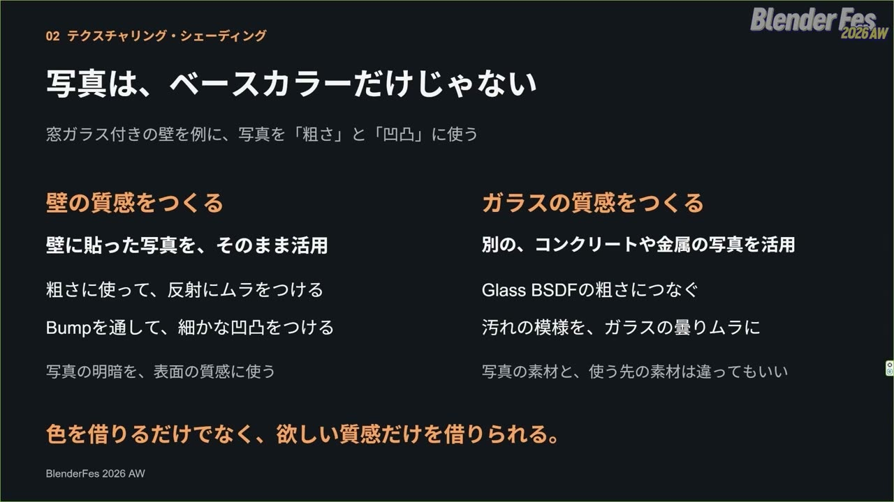
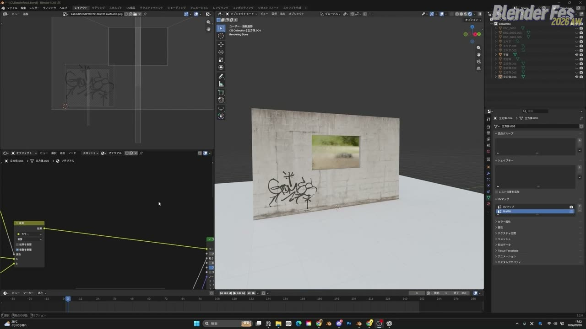
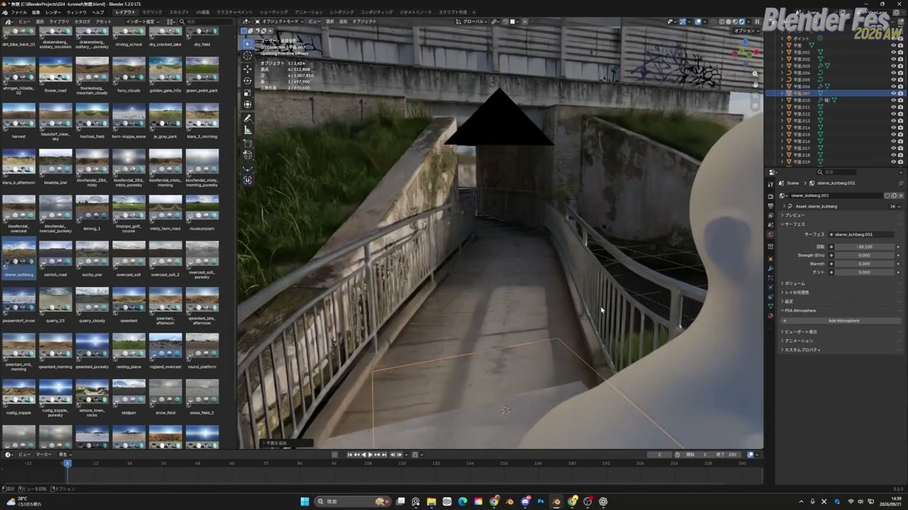
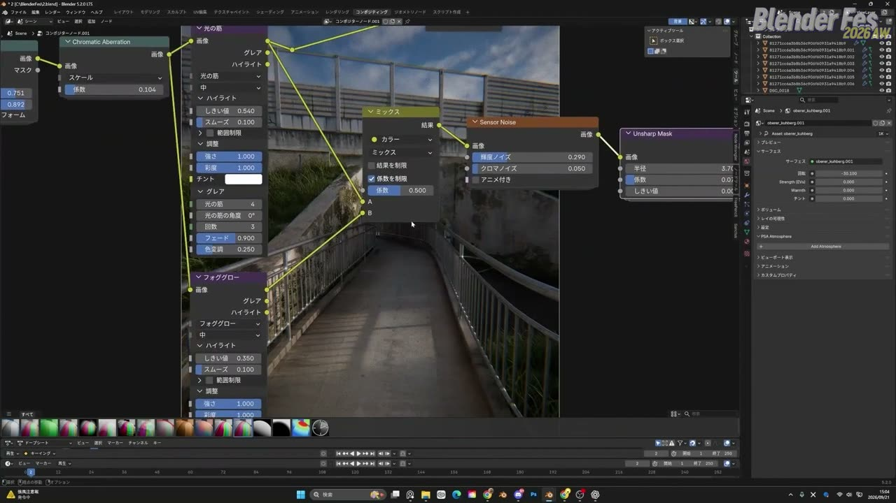
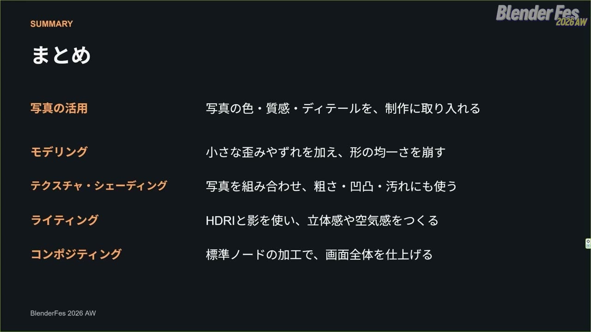

# Blender Fes 2026 AW: フォトリアルCGテクニック — 写真を借りて、均一さを崩す

フォトリアルな CG と聞くと、細かいモデリングや複雑なシェーダー、長いレンダリング時間を思い浮かべるかもしれません。

Blender Fes 2026 AW の Day2、15:00 から配信されたセッション **「フォトリアルCGテクニック」** では、イオリさんがその印象とは少し違う近道を示しました。出発点は写真です。写真には現実の色や汚れ、細かなディテールがすでに写っているので、それを上手に借りれば多くの工程を省けます。

講演の前半では写真の使い方を 3 つの段階に分けて紹介し、後半ではモデリング、テクスチャリングとシェーディング、ライティング、コンポジットの各工程で使える小さな工夫をデモで見せていました。本記事では、配信を視聴した内容をもとに、その流れと考え方を整理します。

---

## セッション概要

| 項目 | 内容 |
|:---|:---|
| **タイトル** | フォトリアルCGテクニック |
| **イベント** | Blender Fes 2026 AW Day2 |
| **形式** | オンライン配信（講演とデモ） |
| **日時** | 2026年9月27日（日）15:00–16:00 |
| **対象** | 初・中級者向け |
| **スピーカー** | イオリ（CGアーティスト） |
| **画面で確認できた環境** | Blender 5.2.0 LTS、Cycles（GPU 演算） |

---

## 背景: 「簡単で汎用的なテクニック」に絞った講演

チャンネルページの紹介文では、フォトリアル CG の手法のうち、特に「簡単」で汎用的なものを工程ごとに解説すると予告されていました。初心者でも、小さな工夫の積み重ねで手軽にリアルな仕上がりへ近づけることを実感してほしい、という趣旨です。

実際の講演も、特殊なアドオンや重い処理にはほとんど頼らず、標準機能と写真素材で完結する内容でした。

---

## セッション詳報

### 写真がいちばんの近道（15:00〜）

イオリさんは冒頭で、講演全体の軸をはっきり示しました。

> フォトリアルなCGを作るのに一番手軽で簡単な方法は、写真を活用することだと思っています。

写真には色も経年劣化の質感も、現実ならではのディテールもすでに入っています。そのため写真を使えば、CG で一つずつ作るはずだった工程をまとめて飛ばせる、という理屈です。講演ではまず写真の使い方をまとめて紹介し、そのあとで各工程の話に進む構成が取られていました。

### 段階 1: 写真をそのまま使う（15:01〜）

最初の段階は、写真を平面として読み込むだけで済ませる使い方です。スライドでは 3 つの例が挙げられていました。

**平らな面はそのまま。** シンプルなコンクリートの壁なら、画像を平面メッシュとして読み込むだけで使える場合があります。実際の作品でも、壁の一部をこの方法で作り、上から写真を貼り付けていると紹介されました。

**遠景は写真 1 枚で。** 作品の奥に見える円形の背景は、1 枚の写真を少し湾曲させて置いているだけでした。遠くの建物ほど高さや大きさの差が目立たなくなるので、遠景は写真で済ませてもリアルに見える場面が多い、という判断です。建物と地面のあいだにループカットを入れ、地面を手前に少し伸ばすと、わずかに立体感が出てシーンになじむという補足もありました。

ただし、写真をそのまま置くだけでは周囲から浮いてしまうことがあります。そこでイオリさんは、明度をカラーランプで調整して空の部分を透過させ、彩度を整えたうえで、背景の HDRI（周囲の光と景色を記録した全方位画像）の空の色をオーバーレイで薄く重ねていました。画面上のミックスノードは、ブレンドモードがオーバーレイ、係数は 0.323 でした。

**植物や小物は透過画像で。** 背景を透過した草の画像は、平面に貼るだけでも、少し離れて見ればツタが生えているように見えます。斜めからの角度に弱いと感じたら、ループカットを入れてプロポーショナル編集で一部を前に押し出すと、斜めから見ても立体感が出ます。

### 段階 2: 写真に合わせてモデリングする（15:04〜）

次の段階は、写真をリファレンスとテクスチャの両方として同時に使う方法です。

**コンクリートの壁。** textures.com の画像を読み込み、写真に写っている凹凸を 3D で少しだけ再現します。上部の段差に合わせてループカットを入れて押し出し、下の穴はナイフツールで面を追加して押し出します。自分で撮影した写真でも同じようにできるとのことでした。

**自動販売機。** 一見複雑ですが、壁と同じ手順の繰り返しで作れると説明されていました。自分で撮影した写真を読み込み、左端の 1 台だけを切り出します。UV エディターで正面の画像が平面に収まるように頂点を合わせたら、面を押し出して大まかな形を作ります。あとは写真の凹凸に合わせてループカットで辺を足し、押し出していきます。

このデモでは、画像をゆがませないための細かなコツがいくつも出てきました。

- 既存の辺を使えるところは、G を 2 回押す辺スライドで位置を合わせる
- 面を複製して拡大縮小するときや頂点を動かすときは、ツールオプションの「面の属性を補正」（表記要確認）を有効にして、UV が伸びないようにする
- ループカットで余計な面を増やしたくない部分は、新しく立方体を追加して作る
- 曲線的な部分はナイフツール（K）で切る。ただし先にナイフを使うとあとでループカットが入りにくくなるので、なるべく最後に回す

棚に並ぶ商品は、小さなプリミティブ（種類は要確認）をベベルで大まかに整え、複製して並べていました。写真を使う場合はこの程度のディテールで十分だそうです。ここで、軸を固定せず目分量で回転やスケールを加えて、並びにランダムさを出すよう勧めていました。

> 現実世界の特徴として、完全な規則性だったり垂直平行みたいな要素は現実にはほとんどないので、そういうものを再現することが重要です。

並べた商品はリンク選択でまとめて選び、正面ビューから UV の「ビューから投影」で展開して写真の商品に合わせます。側面など画像が伸びる部分は「キューブ投影」で展開し直し、写真の何も写っていない白い部分に寄せていました。最後に、商品の手前の透明な板を枠の複製から作り、グラス BSDF を割り当てて完成です。画面で確認できたグラス BSDF の IOR は 1.500 でした。

**家。** より複雑な家は、先に大まかな形を作ってからテクスチャを貼り、ディテールを足す順番で作られていました。側面を選び、撮影した位置に近い画角にビューを合わせてから「ビューから投影」を実行すると、UV の角度を合わせる手間が減ります。ゆがみが残る部分は辺を追加して、窓や扉の位置に UV を合わせていきます。

写真に写っていない床や柵は、壁の別の場所からテクスチャを取ったり、錆びた金属の別の写真を使ったりして補っていました。ここから、撮影時の心得も語られました。窓などのディテールがない、汎用的に使える壁の領域を広めに写しておくと、写っていない面も同じ質感で作れるそうです。

### モデリング: 均一さを崩す（15:24〜）

ここから講演は工程別のテクニックに移りました。イオリさんは、CG らしさを感じさせる原因を「平行や垂直などの均一すぎる要素」と説明しています。現実の直線はわずかにゆがんだりへこんだりしているので、そのノイズを少しずつ足していくことが大切だという考え方です。

デモでは看板をモデリングし、次のような手順で均一さを崩していました。

- 伸ばしたり押し出したりするときに軸を固定せず、目分量で少しずらす
- 複製した 2 つの部品にも、それぞれ違う回転や位置のずれを加える
- ベベルで角を削る。これだけでも見栄えが大きく変わる
- ナイフツールで辺を追加し、「上から物が落ちてへこんだ」といった経緯を想像しながらゆがみを入れる

ナイフツールの使用中に C キーを押すと、見えている面だけでなく奥の面まで貫通して切れます。ループカットが入らない形でも、これで裏側まで辺をそろえて追加できます。

### テクスチャリングとシェーディング（15:28〜）

窓ガラス付きの壁を例に、写真の使い道を広げる 3 つの方法が紹介されました。

**写真を粗さと凹凸にも使う。** 壁の写真をベースカラーだけでなく粗さにもつなぐと、明度の低い部分ほど粗さが低くなり、黒いところほどつるつるになります。間にカラーランプを挟めば効き方を調整できます。画面では、カラーランプの位置 0.145 の設定が見えていました。さらに写真をバンプノード（ディスプレイスメントのカテゴリにあるノード）の高さにつないでノーマルへ渡すと、表面に細かな凹凸がつきます。

ガラスでも同じことができます。グラス BSDF の粗さに、ガラスとは関係のない金属の汚れの写真をつなぐと、曇りのムラになります。このとき黒を真っ黒のままにせず明度を少し上げておくと、完全につるつるという極端な状態を避けられる、という注意もありました。

> 色を借りるだけでなく、欲しい質感だけを借りられる。

スライドのこの一文が、このパートの要点をよく表しています。

**複数の写真を重ねる。** 壁にグラフィティを足すために、オブジェクトデータプロパティで UV マップを 1 つ追加し、「Graffiti」と名前をつけます。UV マップノードでこの UV を選んでグラフィティ画像につなぎ、画像のアルファを係数にして壁の写真とミックスします。背景が透過している部分はアルファが 0 なので、壁だけが残ります。画像の拡張を「クリップ」にすると繰り返しが消え、1 つだけ表示されます（講演では「リップ」と聞こえた部分で、クリップと判断しました）。濃すぎる場合はカラーランプで係数を弱め、ミックスのブレンドモードを乗算にしてなじませていました。

**環境に合わせて汚す。** 最後はアンビエントオクルージョンノードです。物と物の境目や光が入りにくい場所など、汚れがたまりやすい位置を白黒で出してくれます。この白黒を係数にして、元の壁と汚れた壁のテクスチャをミックスすると、地面に近いところだけ汚れた状態を作れます。周りに立方体を追加すると、その接地面にも自動で汚れが出るのがこの方法の利点だと紹介されていました。

### ライティング: HDRI と画面外の影（15:37〜）

ライティングは HDRI で素早く作る方針です。ポイントは 3 つ挙げられていました。

1. よく使う HDRI をいくつか事前にダウンロードし、すぐ試せる状態にしておく
2. 朝方や夕方の HDRI を選ぶ。空気感が出しやすく、影が長く伸びるので立体感やダイナミックな印象を作りやすい
3. 使う HDRI を決めたら、回転させながら良い向きを探す

イオリさんは Poly Haven のアドオン（名称要確認）を使い、アセットブラウザーからドラッグ＆ドロップで HDRI を適用していました。デモで選ばれたのは oberer_kuhberg という HDRI で、回転は -30.100 に設定されていました。向きを決める目安は、地面に落ちた影が壁にもつながる位置です。影が面をまたいでつながると、そこに立体があることがより強く伝わります。

仕上げとして、画面の外に影を作るためのオブジェクトを置きます。いちばん簡単で効果が大きいのは、大きな板を画面外に置き、手前に影が落ちるように動かす方法です。撮影している場所の背後にも何かがあると感じさせ、壮大な印象につながります。

もう 1 つは、空を透過した風景写真を画面外に置く方法です。写真のアルファをカラーランプで調整し、補間を「一定」にすると、空と建物をくっきり分けられます。四角い板の影ではなく、建物や木の輪郭をもつ複雑な影が落ちるようになります。カメラには直接映らないので、切り抜きは大まかで構わないそうです。木や橋など、シルエットが面白い透過画像なら何でも使えます。

> 画面外に置いた物でも、画面の中の印象を変えられる。

### コンポジット: 標準ノードで 6 つの加工（15:42〜）

レンダリング後の仕上げは、Blender 標準のノードで十分できると説明されていました。スライドでは露出、ビネット、色収差、グレア、ノイズ、シャープの 6 つが挙げられています。デモでは、最近の Blender で追加されたノードのセット（詳細は要確認）を中心に使っていました。

画面で確認できた設定は次のとおりです。

- **色収差**: Chromatic Aberration の係数 0.104
- **グレア**: 「光の筋」（しきい値 0.540、光の筋 4 本、回数 3、フェード 0.900）と「フォググロー」（しきい値 0.350）を用意し、ミックスの係数 0.500 で両方を取り入れる
- **ノイズ**: Sensor Noise の輝度ノイズ 0.290、クロマノイズ 0.050
- **シャープ**: Unsharp Mask で係数を下げ、少しくっきり見える程度にとどめる
- **ビネットと露出**: 値を調整して周辺を暗くし、全体の明るさを整える。露出は最初に調整しても構わない

確認の途中では、V と Alt+V でバックドロップを拡大縮小し、ノイズの粒を近づいて見ていました。スライドでも色収差は「ごくわずかに加える」とされ、シャープも係数を下げて使っていました。1 つずつは控えめな加工でも、重ねることで CG 特有のきれいすぎる印象がやわらぎます。

### まとめ（15:46〜）

最後にイオリさんは、写真には現実の色味や質感、細かなディテールがすでに入っているので、そのまま使ったり写真に合わせてモデリングしたりすることで、リアルな見た目を手軽に取り入れられると振り返りました。

> 難しそうに感じるフォトリアルCGも簡単なテクニックの積み重ねで作ることができる

自分の制作にも取り入れられそうだと感じてもらえたらうれしい、という言葉で講演は締めくくられました。

---

## スピーカー紹介

### イオリ

公式の肩書は CG アーティストです。講演では自身の作品から、遠景や自動販売機、家など、写真をもとに作ったアセットを多数見せていました。自動販売機や家の写真は自分で撮影したものだそうで、撮影の段階から「あとで CG に使えるか」を意識している点が印象に残ります。

---

## まとめ

このセッションは、個々のテクニックよりも「写真から何を借りるか」と「どこで均一さを崩すか」の 2 点に重心がありました。工程ごとの要点を表にまとめます。

| 工程 | 主な方法 | 持ち帰りたい考え方 |
|:---|:---|:---|
| 写真の活用 | 平面として読み込む、写真に合わせてモデリング、ビューから投影で UV を合わせる | 写真には色・質感・ディテールがすでにある。遠景は写真 1 枚で足りることが多い |
| モデリング | 軸を固定しない移動、ベベル、ナイフでのゆがみ | 完全な平行・垂直・規則性を崩す |
| テクスチャ・シェーディング | 写真を粗さ・バンプにも使う、UV を分けて重ねる、AO で汚す | 色だけでなく質感を借りる。汚れは環境に合わせる |
| ライティング | 朝夕の HDRI を回転、画面外の板や透過写真で影 | 影が面をまたいでつながる向きを探す |
| コンポジット | 露出、ビネット、色収差、グレア、ノイズ、シャープ | 標準ノードで、どれもわずかにかける |

写真を撮るところから CG 制作が始まっている、という見方に立つと、身の回りの壁や自動販売機も素材に見えてきます。まずは手元の写真を 1 枚、平面として読み込んでみるところから試してみるとよいでしょう。

---

## 参考リンク

- [Blender Fes 2026 AW「フォトリアルCGテクニック」チャンネルページ](https://cgworld.jp/special/blenderfes/vol7/?channel=channel-950)
- [Blender Manual: Ambient Occlusion Node](https://docs.blender.org/manual/en/latest/render/shader_nodes/input/ao.html)
- [Blender Manual: Bump Node](https://docs.blender.org/manual/en/latest/render/shader_nodes/displacement/bump.html)
- [Blender Manual: Glare Node](https://docs.blender.org/manual/en/latest/compositing/types/filter/glare.html)
- [Blender Manual: Knife Tool](https://docs.blender.org/manual/en/latest/modeling/meshes/editing/mesh/knife_topology_tool.html)
