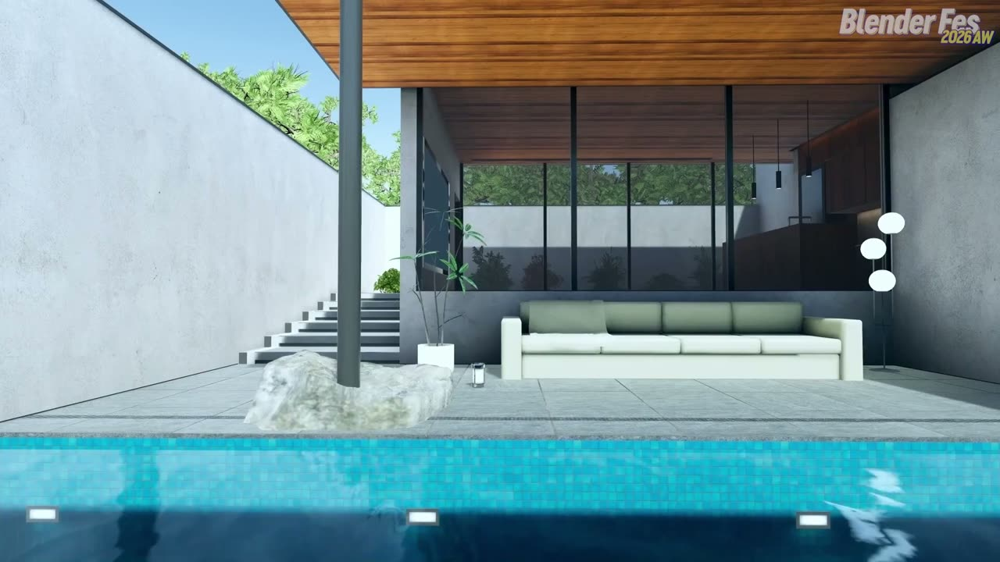
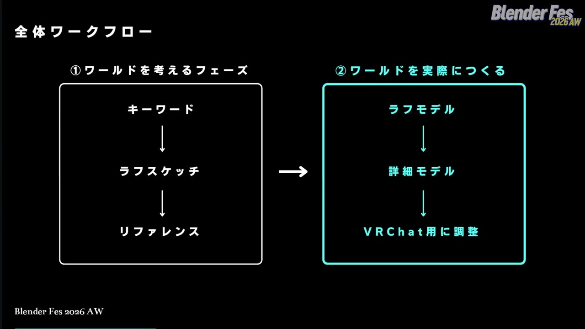
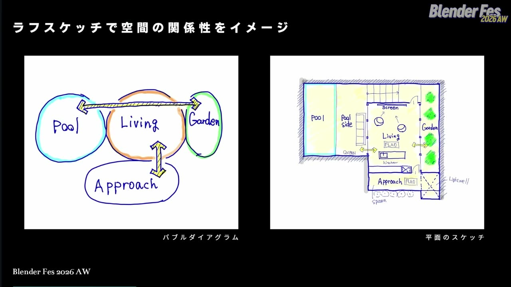
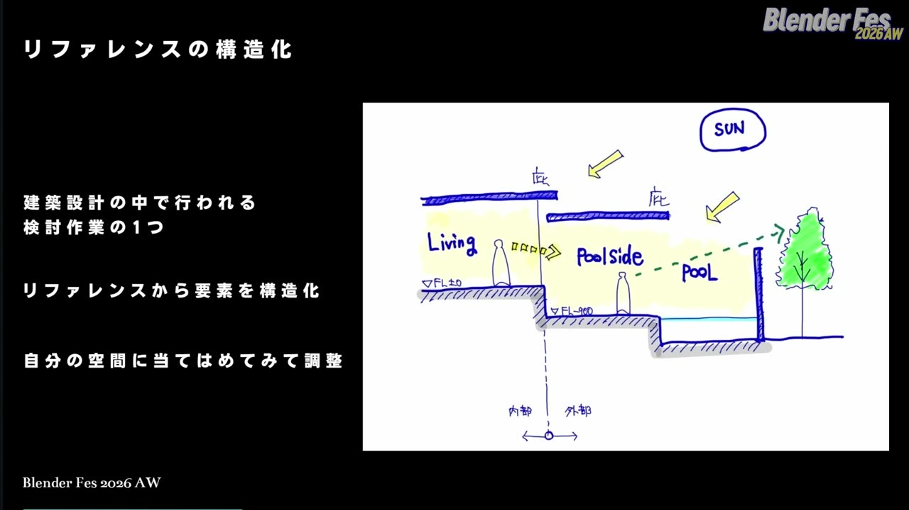
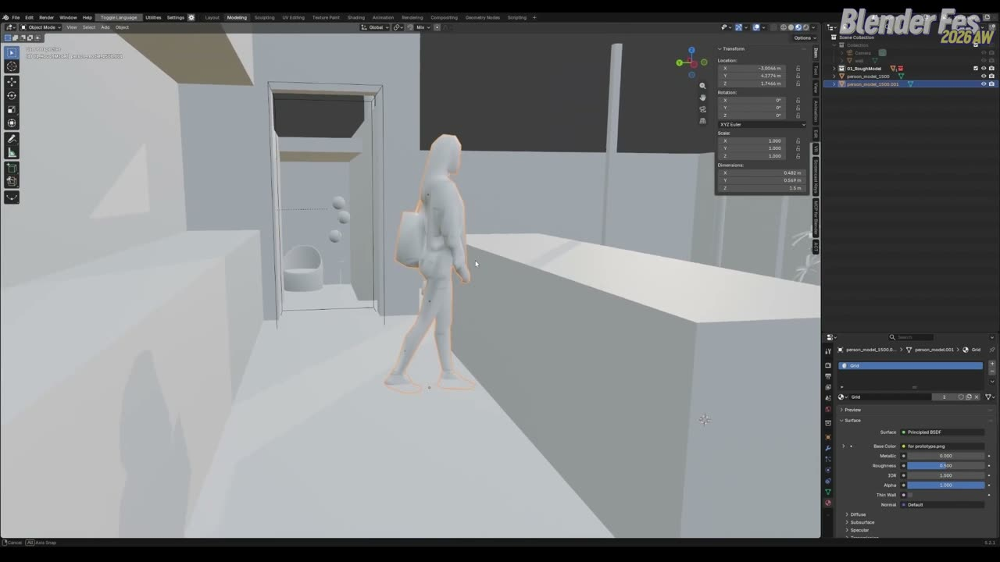
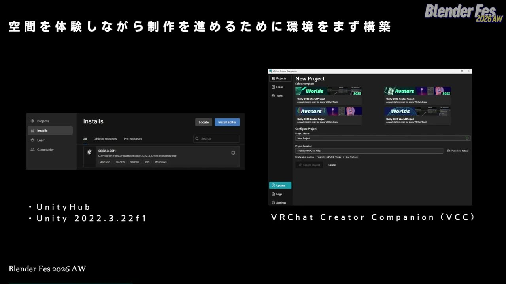
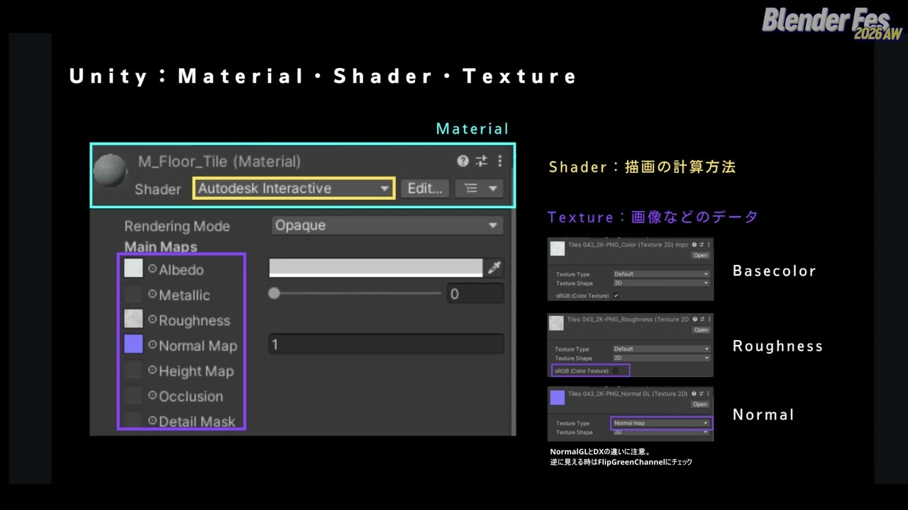
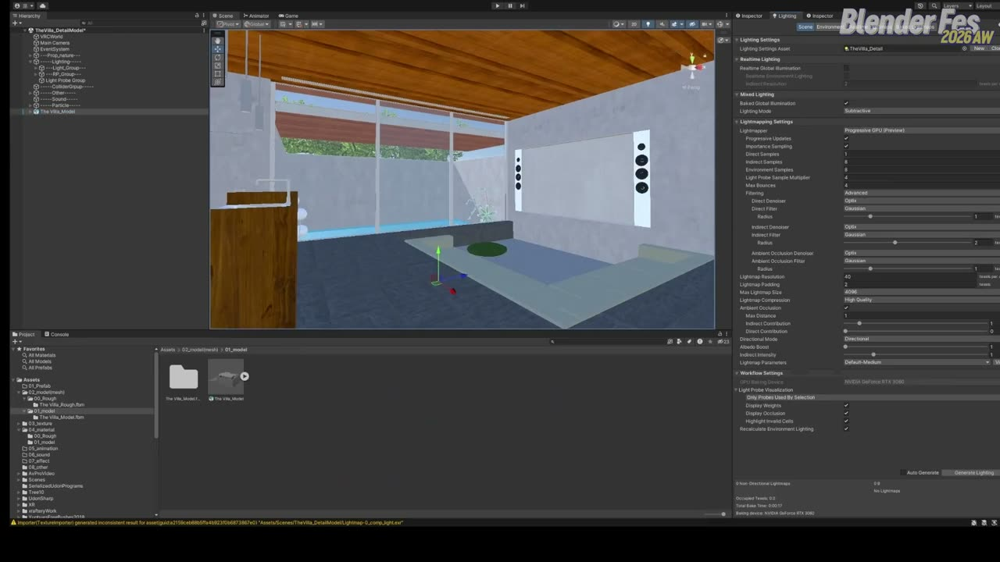
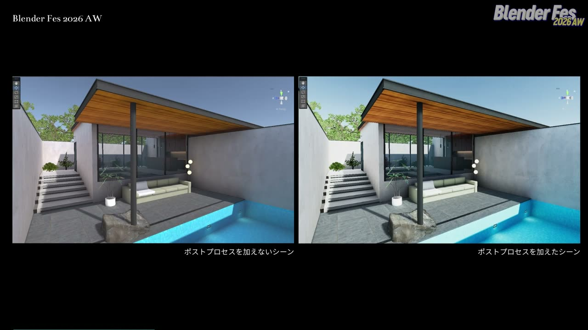
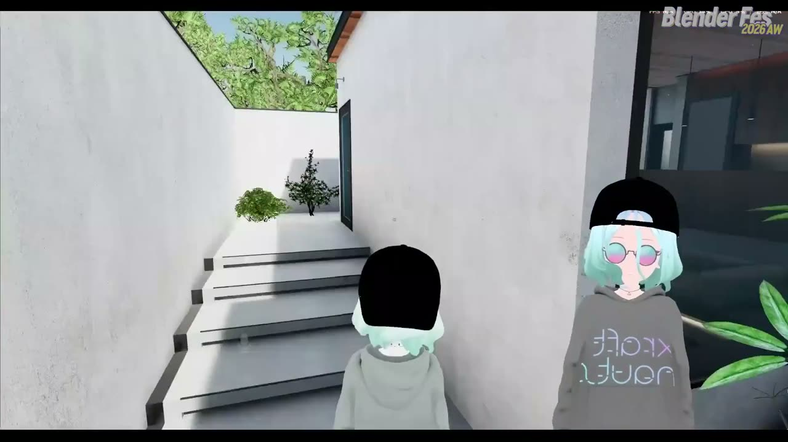

# Blender Fes 2026 AW: VRChatワールドができるまで — BlenderとUnityをつなぐ空間制作の基本ワークフロー

Blender でモデリングはできるのに、それを VRChat のワールドとして公開するまでに何をすればよいのかが分からない。そうした声は少なくないようです。

Blender Fes 2026 AW の Day2、16:15 から配信されたセッション **「VRChatワールドができるまで」** では、空間デザイナーの Fujito さんが、1 つのワールドを題材に制作の全工程を順にたどりました。空間の考え方から、Blender でのモデリング、Unity への持ち込み、ライトベイク、アップロードまでです。

本記事では、配信を視聴した内容をもとに、工程ごとの要点と判断のよりどころを整理します。

---

## セッション概要

| 項目 | 内容 |
|:---|:---|
| **タイトル** | VRChatワールドができるまで BlenderとUnityをつなぐ空間制作の基本ワークフロー |
| **イベント** | Blender Fes 2026 AW Day2 |
| **形式** | オンライン配信（講演と操作デモ） |
| **日時** | 2026年9月27日（日）16:15–17:15 |
| **スピーカー** | Fujito（空間デザイナー / XRクリエイター） |
| **使用ツール** | Blender、Unity 2022.3.22f1、VRChat Creator Companion、VRChat SDK |

---

## 背景: モデリングの「前」と「後」

チャンネルページの紹介文では、このセッションを「モデリングはできるが、その前後に何をすればワールドとして完成するのか」を把握するための内容と位置付けていました。

VRChat は、ワールドやアバターをユーザー自身がアップロードし、仮想空間で交流できるソーシャル VR のプラットフォームです。パソコンだけでも参加できます。ワールドを作るには、Blender で作った形を Unity に持ち込み、VRChat 用の SDK（ソフトウェア開発キット）でビルドしてアップロードします。

---

## セッション詳報

### 自己紹介と今回のワールド（16:15〜）

Fujito さんは建築設計事務所で意匠設計に携わったあと独立し、現在は XR やバーチャル空間に特化した空間デザインスタジオを構えているそうです。題材は、Blender Fes に合わせて制作したコンパクトな別荘風のワールドでした。

### 全体ワークフロー: 考えるフェーズとつくるフェーズ（16:18〜）

最初に示されたのは、制作を 2 つのフェーズに分ける図でした。1 つは「ワールドを考えるフェーズ」で、キーワード、ラフスケッチ、リファレンスの順に進みます。もう 1 つは「ワールドを実際につくるフェーズ」で、ラフモデル、詳細モデル、VRChat 用の調整と進みます。

空間をどう考えればよいか分からず手が止まる、という悩みをよく聞くそうで、前半は「考える」手順から紹介されました。

### キーワードで与条件を決める（16:19〜）

1 つめの段階は、作りたいワールドのキーワードを決めてデザインの軸を作ることです。今回のワールドでは、年代は現代、時間は 13 時くらい、季節は夏、天気は晴れ、場所は湖や森の近く、建築は別荘、雰囲気はシンプルな隠れ家と決めていました。

あわせて「広すぎない」「周辺は作り込まない」「夜景にも対応できる」という制約条件も書き出します。何を作りたいのかと、どんな条件の中で作るのかを先に明確にしておく、というのがこの段階の要点でした。建築設計でいう「与条件」を自分で設定する作業と捉えると分かりやすいでしょう。

### ラフスケッチとリファレンスの構造化（16:20〜）

2 つめはラフスケッチです。

> 絵の上手さは関係なくて、頭の中を整理して図として書き出すことが重要です。

まず、プール・リビング・ガーデン・アプローチ（入口までの導入空間）の関係を丸と矢印で描いたバブルダイアグラムで、全体の構成を決めます。次に平面のスケッチで、吹き抜けの光、右手のガーデン、奥のプールと、歩きながら目に入るものの順序を検討します。平面スケッチにはスポーン（入室時に最初に立つ位置）の場所も書き込まれていました。

3 つめはリファレンスの収集と整理です。収集には Pinterest、整理には PureRef や Miro を使い、作るものが多いときは Notion でリスト化して全体の工数を把握するそうです。

Fujito さんが特に勧めていたのが、集めたリファレンスをそのまま再現せず「構造化」することでした。リファレンスから要素を読み取り、自分の空間にどう当てはめるかを考える作業です。今回のワールドでは、当初リビングからプールまでを同じ高さで考えていましたが、日差しを立体的に取り込むリファレンスをもとに床の高さに段差をつけ、テラス全体を立体的に感じられるよう調整したそうです。

### ラフモデリング: 寸法と身体スケールで作る（16:24〜）

ここから Blender での「つくる」フェーズに入ります。モデリング作業そのものは割愛され、ラフモデリング中に有効にしておくとよい機能が紹介されました。

- **辺の長さを表示する。** 編集モードのオーバーレイで「辺の長さ」を有効にすると、スケッチの寸法と照らし合わせながら作れます。
- **トランスフォームパネルを見ながら作る。** 建築空間はきりのよい寸法で管理されているので、数値を見てきれいな寸法で作るよう心がけます。
- **人型のモデルを置く。** 空間の大きさが直感的に分かるようになります。

> 身体スケールで確認するというのは意外と大事なポイントだったりします。

VR 空間では最終的に人がその中に入って体験するため、人の大きさを基準に確かめることが欠かせない、という趣旨でした。

- **面の向きを確認する。** オブジェクトモードのオーバーレイで「面の向き」を有効にすると、裏返った面が赤く表示されます。裏向きの面は Unity に持ち込むと見えなくなることがあるため、反転して表にしておきます。

ラフモデルは VR 空間で体験しながら徐々に細かくしていきます。今回も大きさを確かめたあと、こぢんまりした空間が欲しいと感じて付け足したそうです。

### Unity 環境の準備と FBX 書き出し（16:27〜）

Unity はどのバージョンでもよいわけではなく、VRChat に対応したバージョンを選ぶ必要があります。講演では 2022.3.22f1 を Unity Hub からインストールしていました。プロジェクトの作成と管理には VRChat Creator Companion（VCC）を使います。VCC は VRChat SDK など必要なパッケージをまとめて管理するツールです。

VCC で Worlds の 2022 テンプレートからプロジェクトを作り、Unity の Assets にメッシュ用フォルダーを用意しておきます。

Blender からの書き出しは「ファイル > エクスポート > FBX」です。設定は次のとおりでした。

- **対象を絞る。** 「選択したオブジェクト」にチェックし、オブジェクトタイプはメッシュだけにします。
- **パスモードは「コピー」。** 使っているテクスチャーも一緒にコピーされます。ただし右隣の埋め込みボタンはオフにし、テクスチャーを別ファイルで管理します。
- **トランスフォーム。** スケールの適用は「FBX すべて」、前方は -Z、上は Y にします。
- **ジオメトリ。** 「モディファイアーを適用」をオンにします。

保存先を Unity プロジェクトのメッシュ用フォルダーにすると、Unity が変更を検知して自動で取り込みます。一度この場所に書き出しておけば、以降は Blender で修正して同じ FBX を上書きするだけで済む、という運用です。

### Unity での下準備とプローブ（16:31〜）

取り込んだ FBX には、次の下準備をします。

1. インスペクターの Materials タブで Extract Materials を押し、Unity 側で編集できるマテリアルとして取り出します。
2. Model タブの Generate Lightmap UVs にチェックして Apply します。テクスチャー用の UV とは別に、ライトベイク用の UV を Unity が自動で作ります。
3. シーンに配置し、位置が 0,0,0 になっていることを確かめます。
4. Mesh Collider を追加して当たり判定を付けます。最終データではコライダーを分けたり軽い形にしたりすることもあるそうです。
5. インスペクター右上の Static にチェックして、ライトベイクの対象にします。まずは完成を優先して項目を一括で有効にしていました。

続いて 2 種類のプローブを置きます。Reflection Probe はマテリアルの映り込みに使うもので、まずは部屋ごとに 1 つ、周囲の見え方が大きく変わる場所ごとに置くという考え方で十分だそうです。範囲は部屋の境界に合わせ、Box Projection にもチェックを入れます。Light Probe Group は場所ごとの明るさを記録しておくもので、ワールドを動き回るアバターの照らされ方に効きます。初心者のうちは等間隔にざっくり置いてかまわない、という助言でした。

### ライトベイクと早い段階での VRChat 確認（16:36〜）

VRChat のワールドで全部の光をリアルタイムに計算すると負荷が大きいため、動かない建物は光と影をライトマップとして焼き込んでおくのが一般的です。

太陽の役割を持つ Directional Light の向きと強さを調整し、Lighting の設定で Environment Lighting（空や周囲から回り込む光）を整えてからベイクします。目的は完成形の照明ではなく、VRChat の中でスケール感を確かめられる状態にすることです。

ビルドは VRChat SDK の Show Control Panel から行います。今回はアップロードせずに試せる Build & Test で、ラフモデルのワールドに入って確かめていました。

> ワールド制作の早い段階からこのように VRChat の環境で体験することが、いいワールドを作るための一つのポイントかなというふうに私は考えています。

ヘッドマウントディスプレイがあれば、Blender の VR Scene Inspection アドオンで確かめる方法もあるそうです。

### 詳細モデリング: 素材のスケールと建築的な収まり（16:40〜）

ラフモデルとの大きな違いは、テクスチャーの設定と細かな建築ディテールの追加です。テクスチャーは CC0（権利を放棄した素材）のものを使い、ambientCG や Poly Haven から選ぶのがおすすめとのことでした。マテリアルは Node Wrangler の Ctrl+Shift+T で、選んだテクスチャー一式をまとめて適用します。

UV は、建築モデルに直方体に近い形が多いことから立方体投影で展開します。ここで意識してほしいと強調されていたのが素材のスケール感です。床に想定した磁器質タイルは 500 角（500mm × 500mm）なので、1m の中にタイルが 2 枚入る大きさになるよう UV を合わせていました。

ディテールでは、建築の実際の収まりを意識した例がいくつも紹介されました。

- キッチン上部の間接照明用の折り上げと、窓の上の空調の吹き出し口
- プールの床タイルの厚み。横から見たときに厚みが分かるよう小口（建材の端面）まで作る
- モザイクタイルの目地を壁と床でそろえ、埋め込み照明もその割り付けに合わせる
- ガラスをフレーム、シール材、ガラスの構成で作り、ドアには枠を付ける
- キッチンの天板に大理石らしい厚みを持たせ、下の扉には手をかける隙間を空ける

> フォトリアルというよりかは、VR 空間の中に入ったときの実在感を出すための工夫だと私は考えています。

### 見えない面を消す（16:46〜）

詳細モデルの段階では、メッシュの整理も行います。ソファーの裏側のように面がほぼ同じ位置で重なると、表示がちらつく Z ファイティングが起こります。完成したワールドでは絶対に見えない面や、重なった面はできるだけ消しておくよう勧めていました。

こうした面はライトベイクの容量も増やすため、Unity に持っていく前に Blender 側で整理しておく、という判断でした。

### Unity のマテリアル設定（16:48〜）

詳細モデルを同じ手順で書き出したあと、Unity ではマテリアルにシェーダー（描画の計算方法）を設定し、そこにテクスチャー（画像データ）を当てはめる、という関係が整理されました。

シェーダーには Unity に含まれる Autodesk Interactive を使っていました。Standard シェーダーにはラフネスマップをそのまま入れる場所がないため、Blender 側でラフネスマップを使っていたデータを持ち込みやすいシェーダーとして選んだそうです。

テクスチャーの読み込み設定には注意点が 2 つあります。ラフネスマップは色ではなく「表面のざらつき」という数値を持つ画像なので、sRGB のチェックを外します。ノーマルマップはテクスチャータイプを Normal map に変更します。スライドには、ノーマルマップの OpenGL 形式と DirectX 形式の違いに注意し、凹凸が逆に見えるときは Flip Green Channel にチェックする、という補足もありました。

操作では、マテリアルを全選択してシェーダーを一括変更し、検索欄に「rough」と入れてラフネスマップの sRGB をまとめて外していました。

### 本番のライトベイク（16:53〜）

まずはサンプル数を低いまま、Environment Lighting を少し上げて Generate Lighting を押します。早く焼ける段階で、間接照明のライトや日の入り方、室内の明るさを確かめ、最後にサンプル数を上げて仕上げる流れです。ラフネスマップの設定漏れがないかも、この段階で確認していました。

植物は Unity Asset Store の無料アセットを使っているそうです。サンプル数を上げてもライトマップに黒ずみが出る場合は、ライトマップ用の UV（UV2）を Blender で展開する必要がある、という補足もありました。

### Post Processing で仕上げる（16:55〜）

最後の仕上げは Post Processing です。カメラで描画した映像に対し、画面全体へ最後にかける処理のことで、明るい部分を光らせたり、色味やコントラストを変えたりできます。

注意点として、VRChat の Post Processing は Windows 向けのワールドでは使えるものの、Quest や Android、iOS 向けでは無効になると説明されていました。今回は PC 向けの表現として設定しています。

空のゲームオブジェクトに Post-process Volume を追加して Is Global にし、専用レイヤーに置きます。Main Camera には Post-process Layer を追加してそのレイヤーを指定します。プロファイルでは Bloom で明るい部分をにじませ、Color Grading で露出、彩度、コントラストを少しずつ整えていました。色の調整に正解の数値はなく、雰囲気を見ながら決めるものだそうです。

### アップロードと動作確認（17:01〜）

公開前の調整として、一括で付けていた Mesh Collider を、通り抜けたい扉と水面から外します。スポーン位置は平面スケッチどおり、アプローチ空間から始まるように動かしていました。

SDK のパネルでワールド名とサムネイルを設定し、警告は Auto Fix で解消してから Build and Publish します。失敗したときはコンソールに原因が表示されます。アップロードには VRChat のアカウントが New User 以上のランクである必要があります。

アップロード後は VRChat の Web サイトでワールドの情報を確認できます。今回のワールドは負荷や容量の軽減をまだあまり行っていないため、容量は 100MB を超えていました。Fujito さんは普段、100MB を超えないことを 1 つの基準にしているそうです。Quest や iOS に対応するときの目安になるから、という理由でした。

入室時はインスタンスの種類を選びます。今回は招待した人だけが入れる Invite で入り、三人称視点や Web カメラによるトラッキング、VR での見え方を確かめていました。

### 締めくくり（17:08〜）

最後に、今回の内容は VRChat のクリエイターたちの知見のほんの一部だと述べ、各クリエイターの情報発信を追いかけることを勧めていました。解説したワールドはブラッシュアップしてショップで販売し、公開もする予定とのことです。

---

## スピーカー紹介

### Fujito

公式の肩書は空間デザイナー / XR クリエイターです。講演冒頭の自己紹介では、建築設計事務所での経験を経て独立し、リアルとバーチャルの両方の空間をデザインしていると話していました。

講演全体を通じて、キーワードでの与条件設定、バブルダイアグラム、断面での検討、建材の厚みや目地といった建築設計の考え方が、ワールド制作の手順にそのまま生かされていました。

---

## まとめ

工程ごとの要点を表にまとめます。

| 工程 | 主な作業 | 判断のよりどころ |
|:---|:---|:---|
| 考える | キーワードと制約条件、バブルダイアグラム、平面スケッチ、リファレンスの構造化 | 何を作るかと与条件を先に決める。リファレンスは再現せず要素を抜き出す |
| ラフモデル | 辺の長さ表示、トランスフォームパネル、人型モデル、面の向き | 身体スケールで確かめる。裏向きの面は Unity で消える |
| Unity への移行 | VCC、FBX 書き出し、Extract Materials、Generate Lightmap UVs、Collider、Static、プローブ | 同じ FBX を上書きする運用にする。早い段階で VRChat に入って確かめる |
| 詳細モデル | CC0 テクスチャー、立方体投影 UV、建築ディテール、不要な面の削除 | 素材の実寸で UV を合わせる。見えない面は Blender で消してから持ち込む |
| 仕上げと公開 | Autodesk Interactive、テクスチャー設定、ライトベイク、Post Processing、アップロード | 低サンプルで試してから上げる。Post Processing は PC 向けのみ。容量は 100MB を目安にする |

モデリングの腕前だけでなく、何を作るかを決める段階と、VRChat の中で確かめる段階を工程に組み込むことが、ワールドの完成度を左右すると考えられます。まずはラフモデルのまま Build & Test でワールドに入ってみるところから試すと、この講演の流れがつかみやすいでしょう。

---

## 参考リンク

- [Blender Fes 2026 AW「VRChatワールドができるまで」チャンネルページ](https://cgworld.jp/special/blenderfes/vol7/?channel=channel-991)
- [VRChat Creator Companion Documentation](https://vcc.docs.vrchat.com/)
- [Blender Manual: FBX](https://docs.blender.org/manual/en/latest/files/import_export/fbx.html)
- [Unity Manual (2022.3): Light Probes](https://docs.unity3d.com/2022.3/Documentation/Manual/LightProbes.html)
- [Unity Manual (2022.3): Reflection Probe](https://docs.unity3d.com/2022.3/Documentation/Manual/class-ReflectionProbe.html)
- [Unity Manual (2022.3): Generating lightmap UVs](https://docs.unity3d.com/2022.3/Documentation/Manual/LightingGiUvs-GeneratingLightmappingUVs.html)
