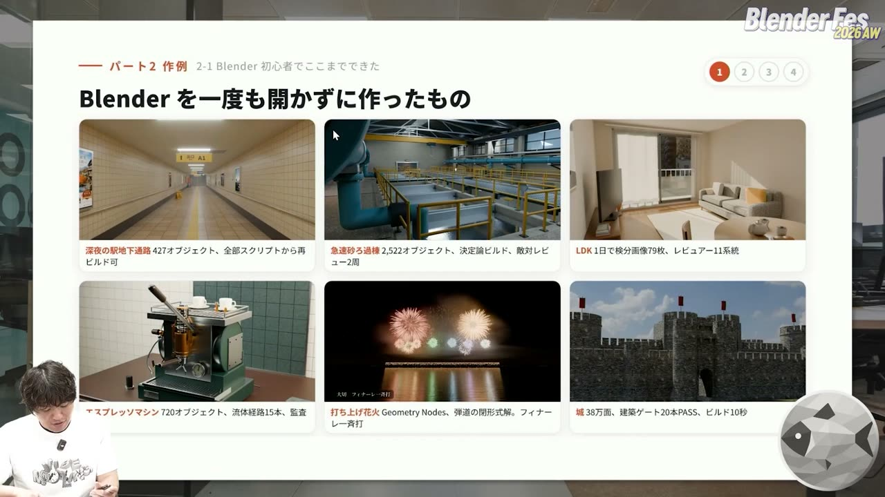
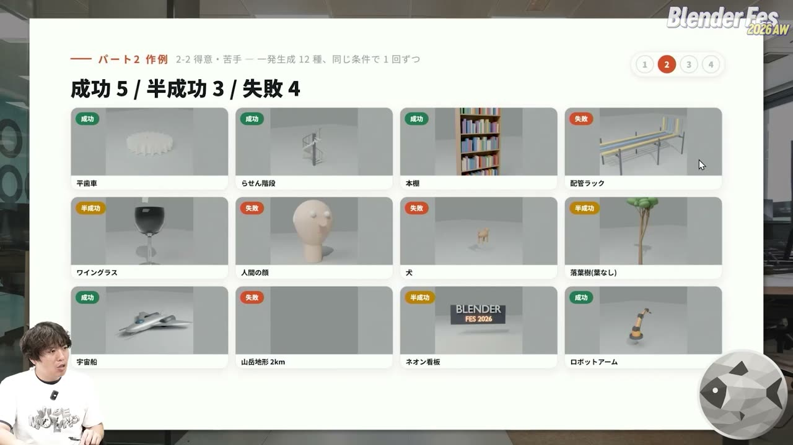
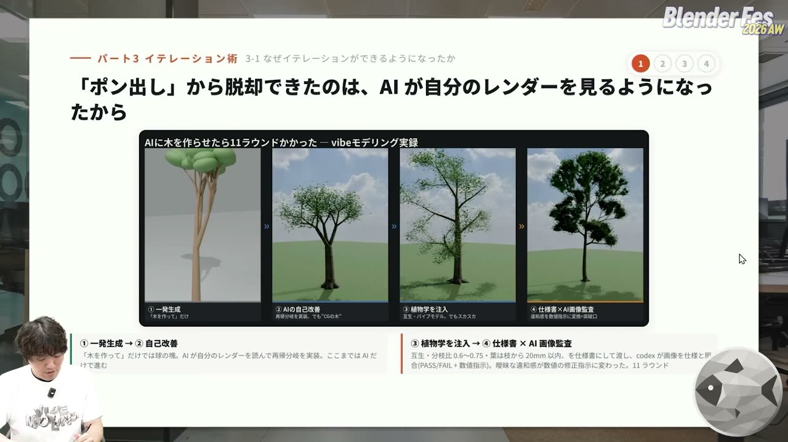
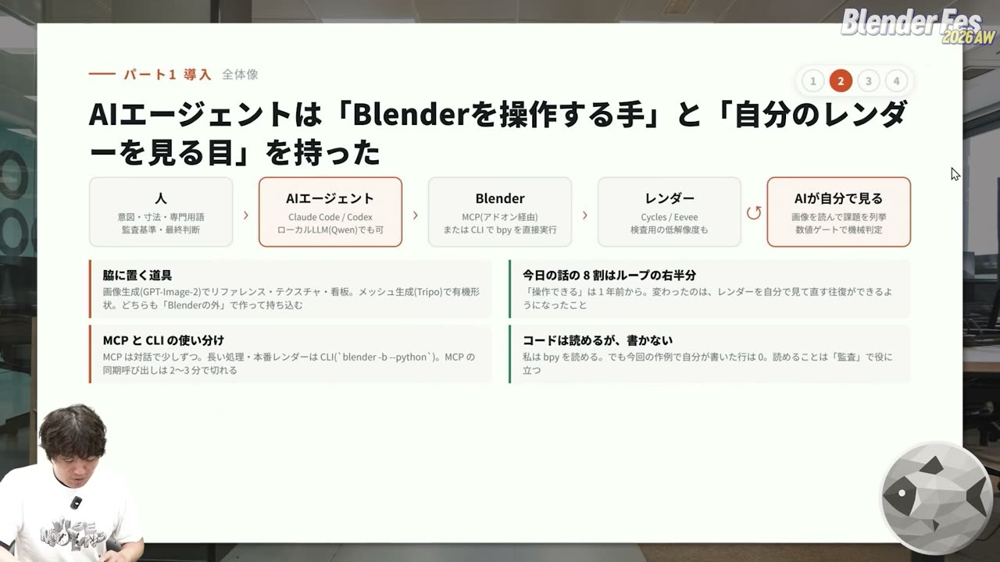
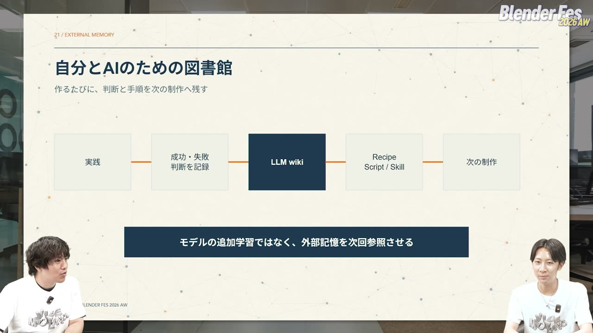
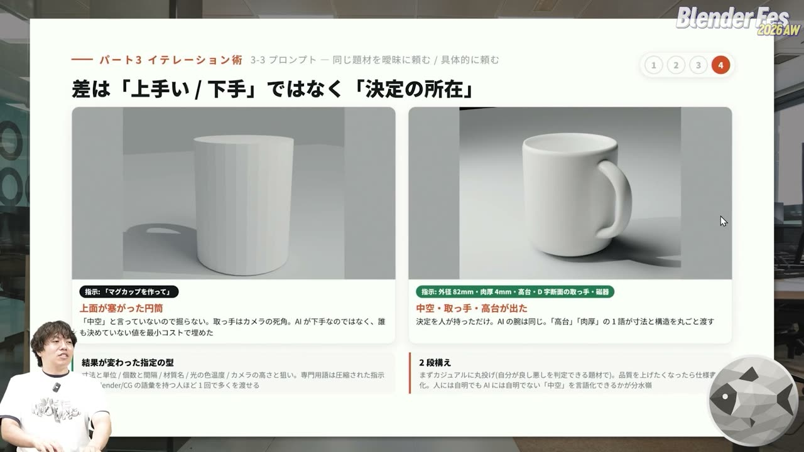
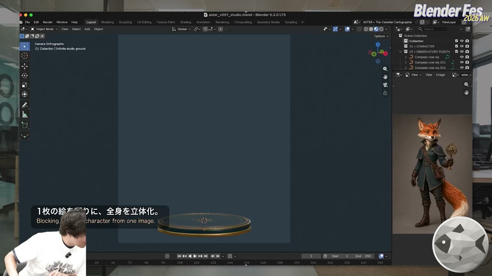
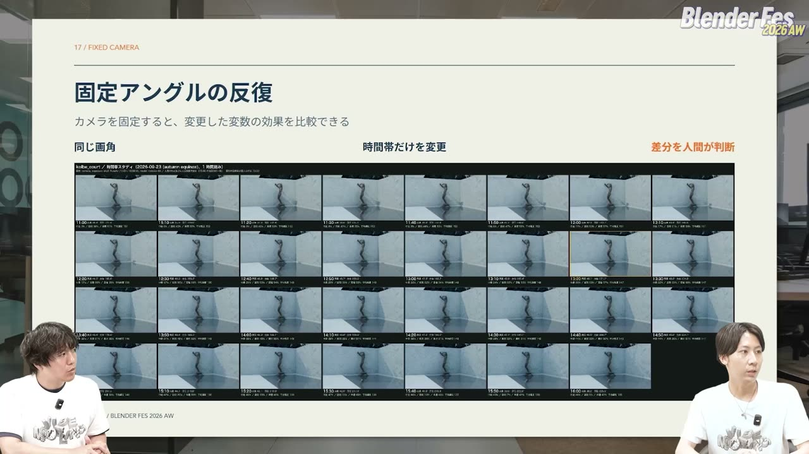
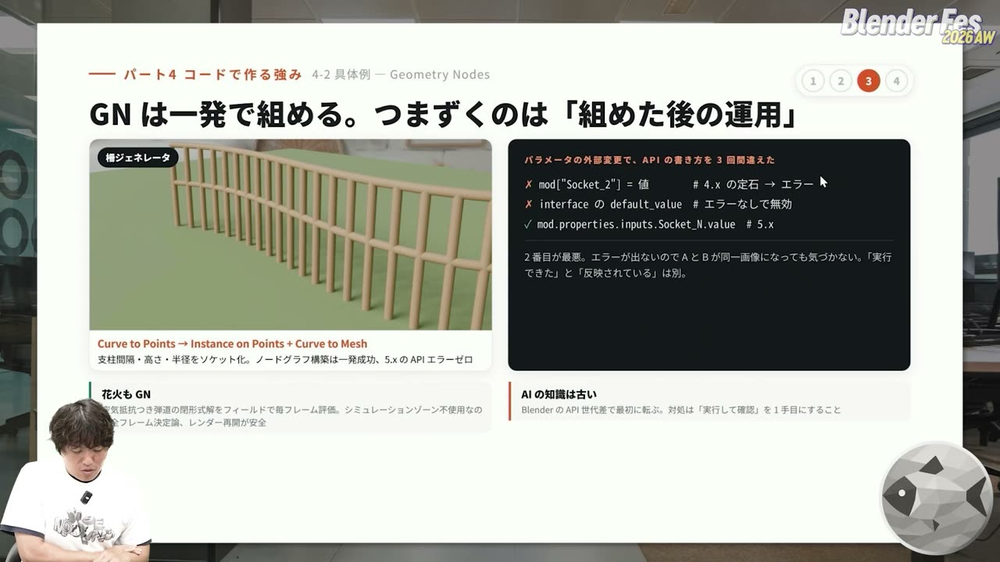
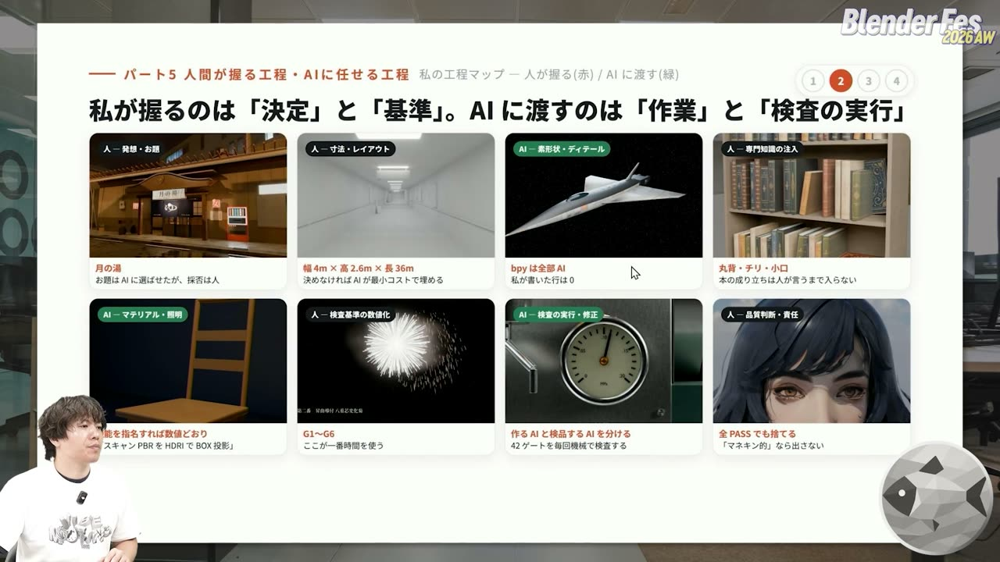

# Blender Fes 2026 AW: AIエージェント × Blenderで挑む Vibe Modeling — ポリゴンを触らずに作品を作る人たちの反復術

Blender を一度も開かずに、フォトリアルな駅の地下通路や浄水場の建屋を作る。そう聞くと、にわかには信じにくいかもしれません。

Blender Fes 2026 AW の Day2、17:30 から配信されたセッション **「AIエージェント × Blenderで挑む Vibe Modeling」** では、Blender 歴 2 か月の posi_posi さんと 4 か月の KOBATAKA さんが、AI エージェントとの会話だけで作った作例を見せながら、その進め方を語りました。進行は CGWORLD の宮沢さんです。

このセッションは事前収録で、話の中で収録日は 9 月 5 日と説明されていました。登場するモデルやツールの評価は、その時点のものとして読むのがよさそうです。

本記事では、ツールの構成、反復（イテレーション）の回し方、人間と AI の役割分担を中心に整理します。

---

## セッション概要

| 項目 | 内容 |
|:---|:---|
| **タイトル** | AIエージェント × Blenderで挑む Vibe Modeling |
| **イベント** | Blender Fes 2026 AW Day2 |
| **形式** | オンライン配信（事前収録の対談とスライド） |
| **日時** | 2026年9月27日（日）17:30–18:30（配信は 18:42 頃まで） |
| **スピーカー** | KOBATAKA、posi_posi |
| **主なツール** | Claude Code / Codex、Blender MCP、画像生成、3D メッシュ生成（Tripo など） |

---

## 背景: Vibe Modeling とは何か

「Vibe Modeling」は、自然言語で指示を出して 3D モデルを作っていく方法を指す言葉として紹介されました。2025 年ごろに広まった「Vibe Coding」（雰囲気でコードを書かせる開発スタイル）をもじったもので、明確な定義はまだないそうです。

いきなり 100 点を狙うのではなく、たたき台や頭の中のイメージを形にして確かめる段階で使うもの、というのが 2 人の捉え方です。

ここでいう「AI エージェント」とは、指示を受けて自分で手順を考え、ツールを呼び出して作業を進める AI のことです。「MCP（Model Context Protocol）」は、AI エージェントが外部のアプリを操作するための共通の接続方式で、Blender 用の MCP を使うと、AI が Blender に Python のコードを送って実行できます。

---

## セッション詳報

### Blender を開かずに作った作例（17:34〜）

posi_posi さんが最初に見せたのは、Blender の画面を自分では一度も操作せずに作った作品群でした。スライドには作品ごとの規模も添えられていました。駅地下通路は 427 オブジェクトで、全部をスクリプトから再ビルドできるそうです。急速砂ろ過棟は 2,522 オブジェクト、エスプレッソマシンは流体の経路を 15 本持ち、城は 38 万面をビルド 10 秒で組み上げたと書かれていました。

KOBATAKA さんは、Blender のコマンドはいまも 1 つも知らないそうです。作例は建築の定番題材のバルセロナ・パビリオンで、敷地の高低差や植栽まで自然言語で作り、タイルの割り付けは自分で監督しました。作業時間は合計 20 時間ほどでした。

作業画面は、左に Claude Code のチャット、右に Blender という構成です。AI が撮ったスクリーンショットがチャットに返ってくるので、それを見て指示を出します。KOBATAKA さんは、AI が決めた同じ視点から進捗を撮らせ続ける「定点観測」で、破綻がないか、意図どおりに直っているかを確かめていました。

### 得意な形と苦手な形（17:38〜）

posi_posi さんは、12 種類の題材を同じ条件で 1 回ずつ作らせた結果を示しました。結果は成功 5、半成功 3、失敗 4 です。

得意なのは、平歯車、らせん階段、本棚、宇宙船、ロボットアームのように、数値で言い切れる形や繰り返しのある形です。苦手なのは、人の顔や犬のような有機的な形、配管ラックのように部品同士の接続が大事な形、山岳地形のように物理的な量感がかかわる形でした。顔は冗談で作ったのではなく、頑張ってこの出来だったそうです。

KOBATAKA さんも同じ見方で、水平な面と角のはっきりした形が多い建築は、言葉と数字で定義しやすく AI と相性がよいと述べていました。一方、銅像や重機のような複雑な形は、Tripo などの 3D メッシュ生成 AI で作って組み合わせ、役割を分けているそうです。

### 「ポン出し」からの脱却: AI に自分のレンダーを見させる（17:43〜）

反復の回し方について、posi_posi さんは「AI 自身に自己改善のループを回させる」ことを挙げました。長いプロンプトを 1 回書いて生成させるやり方とは違う、という位置づけです。

例として示されたのは木です。「木を作って」だけでは球の塊になります。次に、AI に実物の木の画像と自分のレンダー結果を比べさせて反省させると、再帰的な枝分かれを実装して少し木らしくなります。比較用の画像は、画像生成 AI で作らせたそうです。

そこから先は人が観点を足します。スライドには、互生（枝が交互に出ること）、分枝比 0.6〜0.75、葉は枝から 20mm 以内、といった条件を仕様書にして渡し、Codex がレンダー画像を仕様と照らして PASS/FAIL と数値の修正指示を返す流れが書かれていました。「なんとなく違う」という感覚が、数値の修正指示に変わったというのが要点です。

なぜ AI は最初から気付けないのか、という進行役の質問に対して、posi_posi さんはゴールの問題だと答えていました。

> 何を作ったらゴールかを、AI 自体は知らないわけです。

背景にうっすら映るだけならたたき台でも足りますし、前景のアセットなら写実性を詰める必要があります。どこまでを完成とするかを伝えることが、最も大事な点だとされていました。

### 作る AI とツッコむ AI を分ける（17:46〜）

KOBATAKA さんは、ここに「敵対的なレビュー」を加えていると話しました。作業している AI は、自分では良かれと思って進めます。そこで、厳しい人格を持ったツッコミ役の AI を隣に置き、定期的にモデルを監査させます。物と物がおかしく衝突している、柱と床の間に隙間がある、といった指摘に加えて、直し方も提案させるそうです。

仕組みとしては、メインのエージェントから呼び出せる「サブエージェント」を使います。作業中の記憶や履歴を持たない別の個体なので、新鮮な目で見られる、というのが利点です。

KOBATAKA さんは全体の仕組みを「手」と「目」にたとえていました。AI が MCP 経由で Blender を操作し（手）、ビューポートやレンダー結果を画像として受け取って自分で分析します（目）。この操作と確認のサイクルが回るようになったことが大きい、というのが 2 人の共通認識でした。

### 2 人のワークフロー（17:53〜）

KOBATAKA さんのワークフローは、次の 6 段階です。

1. 制作の目的を決める（人間が決めることが多い）
2. 目的に必要な専門知識を、AI に Web 調査させる
3. 作業の仕様を決める（単位、固定する条件、変数にする部分）
4. Blender で実行する
5. AI 自身が画像と数値（寸法・座標）で検査する
6. 最後に人間が確認する

特に 2 番目を重視し、設計者ならどこに注目するかを先に調べさせて、想像任せの失敗を減らしています。3 番目では、決まっていない条件があれば人間に質問するよう AI に頼み、人間側の見落としにも気付けるようにしています。

ほぼ丸投げだという posi_posi さんは、AI に自分の進め方を解説させたスライドを見せました。AI エージェントは Claude Code か Codex（ローカル LLM の Qwen でも可）です。Blender の操作は、MCP で対話的に少しずつ進める方法と、`blender -b --python` で CLI（バックグラウンド実行）から bpy を直接走らせる方法を使い分けます。スライドには、長い処理や本番レンダーは CLI に回し、MCP の同期呼び出しは 2〜3 分で切れる、と書かれていました。

専門用語や監査基準も AI 自身に調べさせ、その基準を満たせば納品、満たさなければ改善ループに戻ります。

### 経験をためる「図書館」（18:00〜）

KOBATAKA さんは、作業中に AI が出した仮説を次のお題にして、自分で検証させることも試しているそうです。

こうした経験は「LLM wiki」と呼ぶファイルベースのナレッジベースにためています。テキストファイル同士がつながった構造で、うまくいった例や判断の理由を AI 自身が書き足し、図書館のように整理します。スライドには、モデルに追加学習させるのではなく、外部の記憶を次回に参照させる、とまとめられていました。

Web のノウハウは人間の手作業が前提ですが、コードで Blender を動かす AI には独自のつまずきがあります。それを AI 自身に書き留めさせておくことが有効だそうです。

posi_posi さんも、知見を記憶するよう AI に指示し、スキルやメモリーとして蓄積しています。指示は 1〜2 行でも、裏では過去のスキルを大量に呼び出しているそうです。ただし、何を記憶するかの観点を渡さないと記憶が混ざって質が下がる、とも付け加えていました。

### 人間向けチュートリアルと 1000 体の生成（18:07〜）

KOBATAKA さんは、YouTube やブログにある人間向けの Blender チュートリアルを AI と一緒に解いています。目的は作品そのものより、作業の作法を AI に記憶させることです。

幾何学的な形を 1000 体作らせたときは、100 体ずつ 10 ラウンドに分け、間に振り返りと次の仮説を挟みました。最後の 100 体は最初の 100 体より圧倒的に早く仕上がったそうです。

posi_posi さんのマグカップの例は分かりやすいものでした。「マグカップを作って」とだけ頼むと、上が塞がった円筒が出てきます。外径 82mm、肉厚 4mm、高台、D 字断面の取っ手、磁器、と指定すると、中空で取っ手と高台のあるカップになりました。スライドの見出しは、差は「上手い/下手」ではなく「決定の所在」です。

> 「中空」と言っていないので掘らない。誰も決めていない値を最小コストで埋めた。

人には自明でも AI には自明でない条件を言葉にできるかが分かれ目で、「高台」「肉厚」のような専門用語は寸法と構造を丸ごと渡す圧縮された指示になる、という整理でした。進め方は 2 段構えで、まず自分が良し悪しを判断できる題材で気軽に丸投げし、品質を上げたくなったら仕様書にする、という順番です。

### 過信しない、構造の理由から作らせる（18:13〜）

posi_posi さんは、AI にできることは想像と違う場合が多いので、無茶振りでも一度頼んでみるよう勧めていました。反対に、できそうでできないこともあります。打ち上げ花火では光より先に煙が出ましたし、椅子の貫（ぬき）が脚から離れている、配管が途中で切れている、といった失敗も起きます。

対策として 2 人が挙げたのが、形の背景にある理由を先に考えさせることです。階段なら一段ずつ踏むので抜けてはいけない、手すりは人が歩くので適切な高さが要る、というように、なぜそこに物があるのかを考えてから作らせると、抜け漏れがかなり減ったそうです。

### 新モデルで有機形状が変わり始めた（18:17〜）

収録の直前に、OpenAI の新モデル GPT-6 Astra（講演では「アストラ」）が Codex から使えるようになったそうです。posi_posi さんは、これまで苦手だった有機的な形が大きく変わったと驚いていました。

1 枚の絵をもとにしたキツネのキャラクターは、これまで丸に耳が付いた程度が限界だったものが、画像にかなり近い形になっていました。作業は Blender MCP 経由で、粘土のように鼻や耳を少しずつ出していく様子が見えたそうです。

### コードで作る強み（18:22〜）

KOBATAKA さんは、同じルールで機械的に繰り返す作業に AI が向いている例として、時間帯スタディを見せました。

プレゼン用の構図で時刻だけを変えたレンダーを並べる作業は、これまで若手社員が 1 枚ずつ手で行っていたそうです。判断の手前にある選択肢を並べる仕事は AI に任せやすい、という話でした。オニキス（縞模様の石材）のマテリアルは、画像生成機能を持つ Codex がテクスチャを作って貼り、実物の写真と比べながら直していったそうです。

posi_posi さんは、コードで作る強みとして「どう作るか」を渡せる点を挙げました。Array モディファイアーで柱を並べれば、数値を 1 つ変えるだけで回廊を作り直せます。ただし、Bevel や Array のような機能は名前で指定しないと使われないそうです。

バージョン差の落とし穴もありました。ジオメトリノードの柵は一発で組めたものの、入力値を外から変える API の書き方を 3 回間違えたそうです。4.x の書き方はエラーになり、別の書き方はエラーなしで値が反映されませんでした。「実行できた」と「反映されている」は別で、AI の知識は古いので、まず実行して確かめるよう勧めていました。

### 画像生成・動画生成とのリレー（18:27〜）

KOBATAKA さんは、ライティングの一部を画像生成に任せる選択肢も挙げました。よいモデルからよい画像、よい画像からよい動画へ、とツールをリレーする考え方です。モデルのキャプチャーからマテリアル違いを画像生成で 10 パターン出させ、人間が方向性を選んでからモデル作業に戻る、というループも紹介されました。

### 人間が握る工程、AI に任せる工程（18:31〜）

posi_posi さんの基準は、判断がコードの中で閉じるかどうかです。人工物の破綻はコードで検証できますが、キャラクターの曲線の良し悪しは人が都度伝える必要があります。工程マップのスライドでは、お題の採否、寸法、専門知識の注入、検査基準の数値化、品質判断を人が持ち、形状の作成、マテリアルと照明、検査の実行と修正を AI に渡していました。検査基準の数値化には一番時間を使い、全項目が PASS でも「マネキン的」なら出さない、と書かれています。

KOBATAKA さんは、実作業はいずれ AI ができるようになっていくとしたうえで、人間に求められるのはディレクション力だと述べていました。何を作りたいか、どこを目指すかを決め、途中で方向を調整して導く力です。

### 始めるための最短ルート（18:35〜）

posi_posi さんによると、一番のハードルは Claude Code や Codex を入れるところで、その先の Blender のインストールも環境構築も AI に任せられるそうです。KOBATAKA さんも、Blender のインストールと MCP の整備を頼んで買い物に出かけ、帰ると「最初に何を作りますか」と聞かれたと振り返っていました。

どちらのツールを勧めるかについては、収録時点では 2 人とも Codex を挙げていました。新モデルの性能に加えて、参照画像やテクスチャを画像生成で作れるため、作業が 1 か所で完結するのが理由です。一方で、モデルの力関係は 1 か月で変わるので、慣れたらその時点で最も強いモデルを選ぶとよい、とも話していました。

KOBATAKA さんの最後のスライドは「自分が判断できる分野から始める」です。専門分野の教材や作品研究を AI と一緒に解いてみる、というのが最初の一歩として示されていました。

> 見た目はできる。中身は検証で決まる。

posi_posi さんのまとめのスライドにはこの言葉とともに、Blender を知っている人は検証が最初からできる、と書かれていました。

---

## スピーカー紹介

### KOBATAKA

自己紹介では、建築設計の仕事をしながら社内で AI 活用の推進を担当していると話していました。Blender 歴は約 4 か月で、ふだんは Rhinoceros を使っているそうです。

### posi_posi

自己紹介では、メーカーや IT 系企業で AI 系のエンジニアをしていると話していました。Blender は 7 月に始めたばかりで、専門知識の調査まで AI に任せる進め方を突き詰めています。

---

## まとめ

2 人の話を通して見えてきたのは、Vibe Modeling の品質を決めるのはプロンプトの長さではなく、反復の仕組みだという点です。要点を表にまとめます。

| 論点 | 2 人の実践 | 持ち帰りたい考え方 |
|:---|:---|:---|
| 得意・苦手 | 数値で言い切れる形、繰り返しは得意。有機形状・接続・物理量は苦手 | 苦手な形はメッシュ生成 AI と分担する。新モデルで境界は動きつつある |
| 反復 | AI に自分のレンダーを見させ、参照画像や仕様書と照合させる | ゴールと合格基準を渡さない限り、AI は最小コストで埋める |
| レビュー | 作る AI とツッコむ AI（サブエージェント）を分ける | 自己レビューと敵対的レビューを両方回す |
| 知識 | 専門知識を Web 調査させる。経験を LLM wiki やスキルにためる | 追加学習ではなく、外部の記憶を次回に参照させる |
| 指示 | 寸法、専門用語、機能名（Bevel、Array）で指定する | 専門用語は圧縮された指示。Blender を知る人ほど 1 回で多くを渡せる |
| 役割分担 | 人は決定・基準・品質判断、AI は作業と検査の実行 | 人間に残るのはディレクション力 |

ふだん Blender を使っている人ほど、AI の出力のどこが破綻しているかを最初から見抜けます。2 人が繰り返し語っていたのは、その「見る力」がそのまま Vibe Modeling の武器になる、ということでした。まずは自分が良し悪しを判断できる小さな題材で、AI に丸投げしてみるところから試してみるとよいでしょう。

---

## 参考リンク

- [Blender Fes 2026 AW「AIエージェント × Blenderで挑む Vibe Modeling」チャンネルページ](https://cgworld.jp/special/blenderfes/vol7/?channel=channel-942)
- [Blender Lab: MCP Server](https://www.blender.org/lab/mcp-server/)（Blender 公式の MCP。登壇者が使った MCP と同じものかは未確認）
- [lab/blender_mcp（Blender Projects）](https://projects.blender.org/lab/blender_mcp)
- [Blender 5.2 LTS Release Notes: Python API](https://developer.blender.org/docs/release_notes/5.2/python_api/)
- [OpenAI: GPT-6 Astra](https://openai.com/index/gpt-6-astra/)
- [Andrej Karpathy: llm-wiki（Gist）](https://gist.github.com/karpathy/442a6bf555914893e9891c11519de94f)
- [Tripo AI](https://www.tripo3d.ai/)
- [Meshy](https://www.meshy.ai/)
