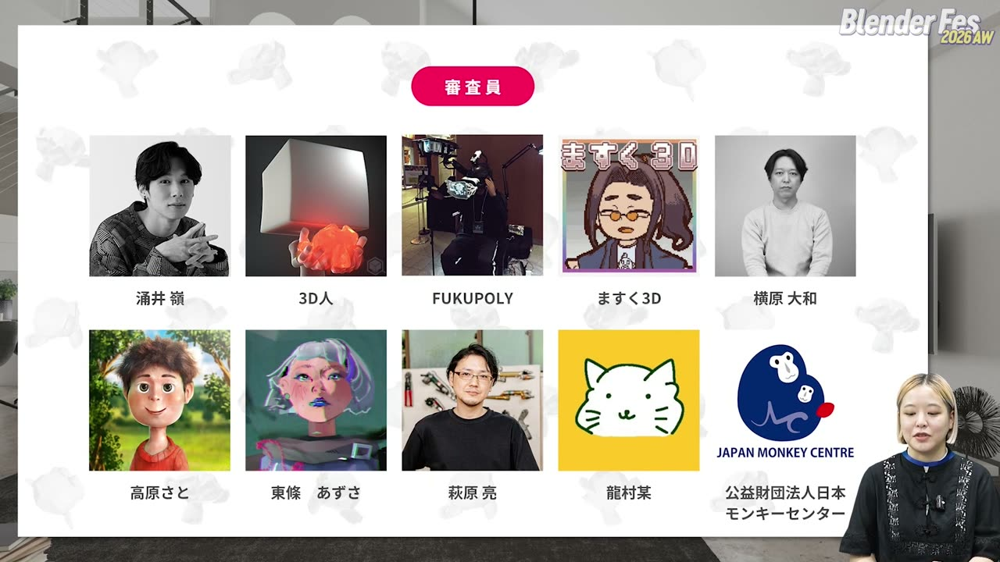
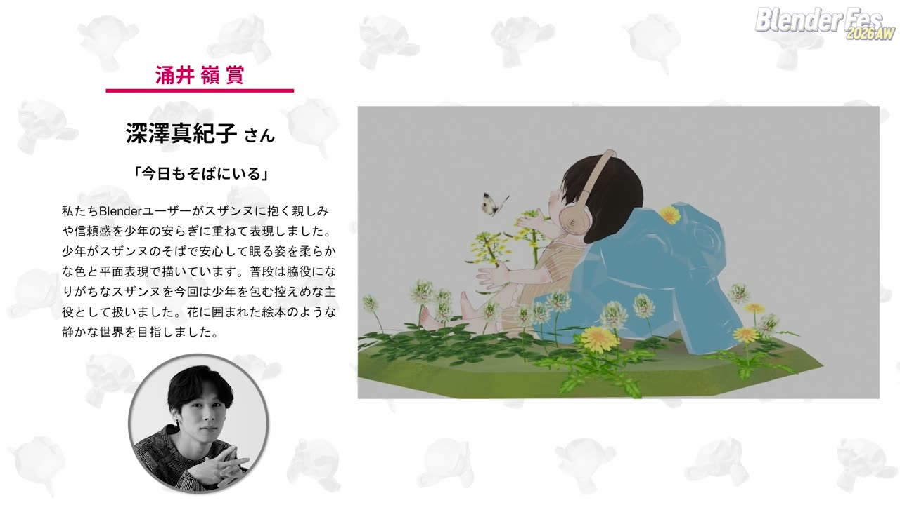
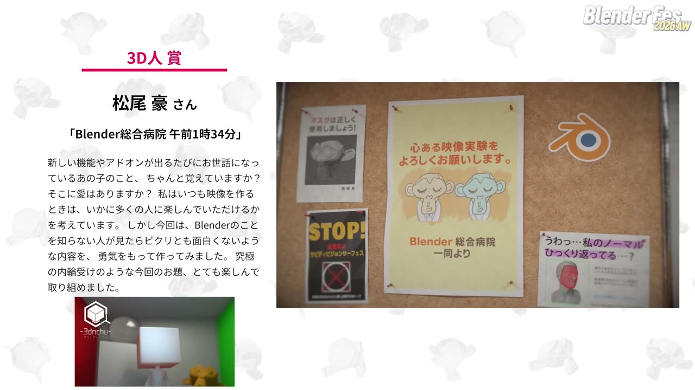
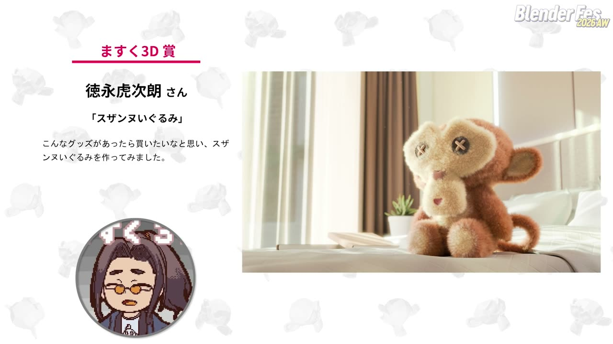
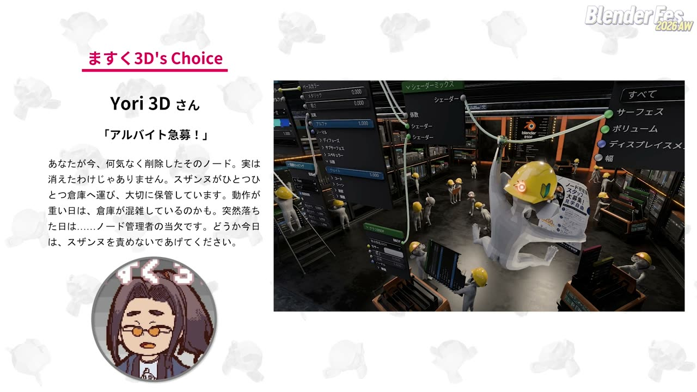
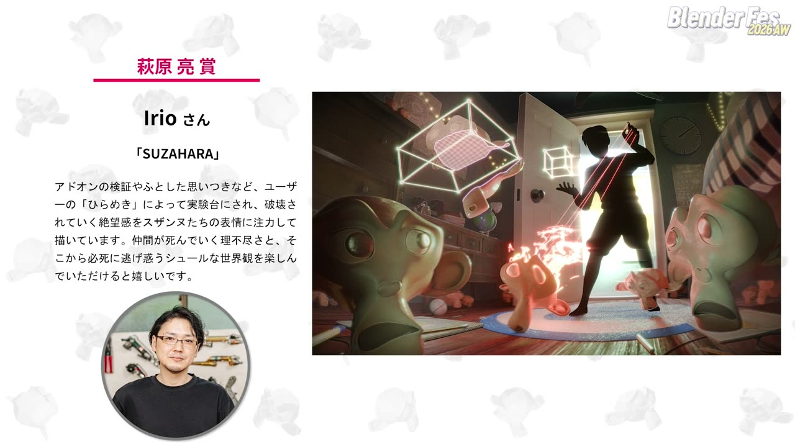
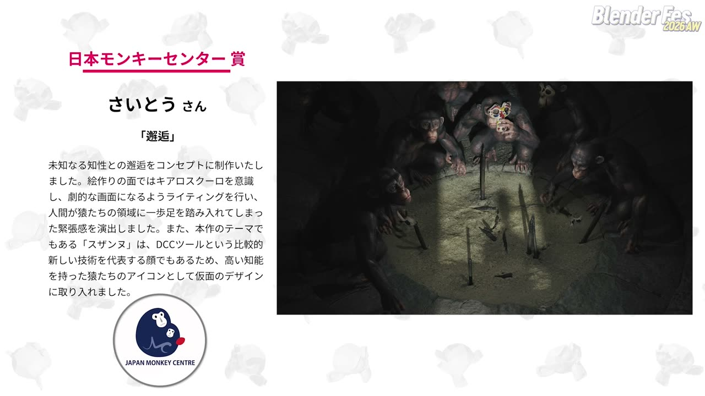
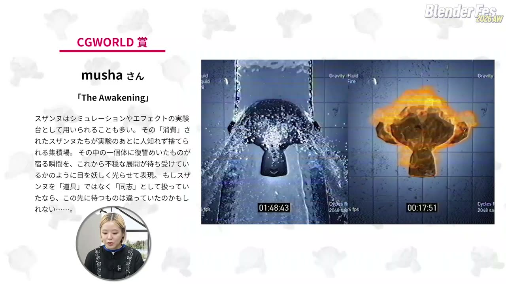

# Blender Fes 2026 AW: b3d創作祭「スザンヌ」結果発表 ― 実験台の猿を、審査員はどう見たか

Blender Fes 2026 AW の Day2、全 16 セッションの最後を飾ったのが **「b3d創作祭「スザンヌ」 結果発表&講評セッション」** です。b3d創作祭は CGWORLD が企画・運営する Blender ユーザー限定の CG 作品コンテストで、第 5 回のテーマは Blender の標準モデル「スザンヌ」でした。

スザンヌは、Blender で「猿」のメッシュを追加すると出てくるおなじみのモデルです。シェーダーやアドオンを試すときのテスト用として使われることが多く、多くのユーザーにとって身近な存在と言えます。今回は 77 点の応募があり、10 名の審査員と CGWORLD 編集部が、それぞれ 1 作品ずつ賞を選びました。

本記事では、受賞作品と講評の要点を審査員ごとに整理します。あわせて、講評から見えてきた「評価された作品の共通点」もまとめます。

---

## セッション概要

| 項目 | 内容 |
|:---|:---|
| **タイトル** | b3d創作祭「スザンヌ」 結果発表&講評セッション |
| **イベント** | Blender Fes 2026 AW Day2 |
| **形式** | オンライン配信（結果発表・講評） |
| **日時** | 2026年9月27日（日）18:45–19:45（本編は 19:29 頃まで） |
| **登壇** | 涌井嶺（VeAble）/ 3D人 / FUKUPOLY / ますく |
| **審査員** | 上記 4 名に加え、横原大和、高原さと、東條あずさ、萩原亮、龍村某、公益財団法人日本モンキーセンターの計 10 名 |

セッションは CGWORLD の司会で進み、各審査員が録画やナレーションで講評を届ける形式でした。審査員ごとの賞にはギフトカード、CGWORLD 賞には協賛社提供の液晶タブレットが贈られると案内がありました。

---

## 受賞作品一覧

| 賞 | 作品名 | 作者（配信での表記） |
|:---|:---|:---|
| 涌井嶺賞 | 今日もそばにいる | 深澤真紀子さん |
| 3D人賞 | Blender総合病院 午前1時34分 | 松尾豪さん |
| FUKUPOLY賞 | アルバイト急募！ | Yori 3D さん |
| ますく3D賞 | スザンヌいぐるみ | 徳永虎次朗さん |
| 横原大和賞 | Blender総合病院 午前1時34分 | 松尾豪さん |
| 高原さと賞 | Blender総合病院 午前1時34分 | 松尾豪さん |
| 東條あずさ賞 | Blender総合病院 午前1時34分 | 松尾豪さん |
| 萩原亮賞 | SUZAHARA | Irio さん |
| 龍村某賞 | Blender総合病院 午前1時34分 | 松尾豪さん |
| 日本モンキーセンター賞 | 邂逅 | さいとうさん |
| CGWORLD 賞 | The Awakening | musha さん |

10 名の審査員のうち 5 名が、同じ「Blender総合病院 午前1時34分」を選びました。一方で、ほかの審査員は作風のまったく違う作品を選んでおり、評価の軸の多様さもよく表れた結果になりました。

---

## セッション詳報

### 涌井嶺さん：スザンヌを「親しみのある存在」として描く（18:47〜）

涌井さんは、お題を聞いた時点では、どんな作品が集まるか想像がつかなかったそうです。実際には、スザンヌを「Blender ユーザーにとって身近なテスト用モデル」という前提で扱った作品が多く、その中で表現方法の違いに注目して選んだと話していました。

選んだのは、深澤真紀子さんの **「今日もそばにいる」** です。気味悪く、あるいはコミカルに描く作品が多い中で、スザンヌを柔らかく温かな存在として描いた点を評価していました。作中のスザンヌはサブディビジョンもかかっていない角張った形です。それでも、背中にもたれた少年の気持ちよさそうな様子から、触ると柔らかそうに感じられる、という講評でした。

最後まで 1 位を迷った作品として、大西後東さんの「土曜19時30分」も紹介されました。昭和の特撮ヒーロー番組のような質感をコンポジットで作り込んでいる点を高く評価しつつ、主役がスザンヌかどうかという点で一歩譲ったそうです。ほかに松尾豪さんの作品と、まるさんの「笑うスザンヌ」にも触れていました。

---

### 3D人さん：ネタに振り切りつつ、作品としてまとまっている（18:51〜）

3D人さんは、過去の b3d創作祭でも、応募者がスザンヌをどう取り入れるかを毎回ひそかに見ていたそうです。

選んだのは、松尾豪さんの **「Blender総合病院 午前1時34分」** です。待合室の掲示物には、無意味なサブディビジョンサーフェスをやめようという張り紙や、法線の反転を嘆くポスターなど、Blender ユーザーなら思わず笑うネタが並んでいます。受付の画面に Blender の UI が映っている点も評価していました。ネタに振り切りながら、作品としてのまとまりもある、という講評でした。

ほかに紹介されたのは次の 4 作品です。

- **musha さん「The Awakening」**：実験台にされるスザンヌを、映画のオープニングのようなダークな見せ方で描いた作品
- **カミワダ テルさん「スザンヌよ、永遠に。」**：実験に使われたスザンヌたちの墓地を、明るく爽やかに描いた作品
- **石井貴大さん「Assembly line」**：スザンヌの生産ライン。規則的な動きや繰り返しに CG ならではの気持ちよさがある、という評価でした
- **大西後東さん「土曜19時30分」**：昭和レトロな演出とロゴの使い方を評価しつつ、スザンヌは脇役的だったという指摘もありました

---

### FUKUPOLY さん：構図と配色で視線を導く（18:55〜）

FUKUPOLY さんが選んだのは、Yori 3D さんの **「アルバイト急募！」** です。Blender の裏方として働くスザンヌたちを描いた静止画で、細部の作り込み、視線を中央へ導く構図、黒を基調にオレンジと黄色を効かせた配色を評価していました。シェーダーのノードの線をつかんだ手にマテリアルが反映され始めている演出にも触れています。

あえて助言するなら、尻尾を付けたり、猫背や前かがみの姿勢にしたりすると、猿らしさや愛嬌が加わったかもしれない、とのことでした。ただ、人間のような体つきが独特の不気味さを生んでいて、それが魅力にもなっている、という見方も添えていました。

ほかに Shosuke Watanabe さんの「SUZANNE×3 : RITUAL」を、ネオンカラーと闇のコントラスト、セルルックの線、カメラワークの完成度で紹介しました。こちらには「なぜスザンヌなのか」の物語がもう少し描かれていると深みが増した、という指摘がありました。松尾豪さんの作品も、何度見ても発見がある「アイデアの宝庫」として挙げています。

---

### ますくさん：理屈抜きに「欲しい」と思わせた作品（18:58〜）

ますくさんは、ネタ枠のお題だからこそ、ネタで終わらせずに作品に仕上げるのが一番難しいと感じていたそうです。

選んだのは、徳永虎次朗さんの **「スザンヌいぐるみ」** です。スザンヌを気味の悪い側のキャラクターだと思っていたのに、実物が欲しくなったことに自分でも驚いたそうです。ライティングとレンダリングの丁寧さが、ぬいぐるみの柔らかさを引き立てていたと話していました。

選んだ理由については、次のように語っています。

> 一番評価させていただいたのは、技術力の高さとかストーリーの良さとかではなくて、理屈抜きに可愛い、欲しいと感情に訴えかけてきて、そう思わせてきてくれたことです。

最後まで迷った作品として、Yori 3D さんの「アルバイト急募！」も紹介されました。広角で現場全体を見せつつ、ノードの線にぶら下がるスザンヌを手前に置くことで、奥行きとダイナミックさが出ているという評価です。もう 1 作の石井貴大さん「Assembly line」については、プロダクト開発に関わる立場から、射出成形の工程まで再現した点を評価していました。

総評では、これまでの Blender Fes で紹介された表現やテクニックが、応募作の随所に生かされていたことがうれしかったと振り返りました。

---

### 横原大和さん・高原さとさん・東條あずささん・龍村某さん：病院の待合室に集まった支持（19:03〜19:22）

この 4 名はいずれも、松尾豪さんの「Blender総合病院 午前1時34分」を選びました。評価した点は少しずつ違います。

- **横原大和さん（19:03〜）**：午前 1 時 34 分という時刻が、寝る前に Blender を触る深夜の浮ついたテンションに重なる点に共感したそうです。テストモデルのスザンヌを見かけたら、この病院で順番を待っているのかと想像できるところも挙げていました
- **高原さとさん（19:07〜）**：2 カット構成のうち、冒頭のカットが映像の導入として成立している点を評価しました。運ばれてくるスザンヌが画面に流れてくるタイミングの笑いにも触れています
- **東條あずささん（19:11〜）**：病院という身近な場所と組み合わせたことで妙なリアルさが出た点、スザンヌごとに違う服の付き添いがいて患者らしさが増した点を挙げていました
- **龍村某さん（19:18〜）**：技術より発想の面白さを基準に審査したそうです。CG の「マスク」機能と感染予防のマスクをかけた張り紙を例に、発想の勝利と評していました

横原さんは、ほかに Irio さん「SUZAHARA」、さいとうさん「邂逅」、籠屋大志さん「スザンヌ活動コンセプト」を紹介しました。スザンヌの「可愛いような、不気味なような」両面が魅力だという見方です。講評の締めくくりには、次の一言がありました。

> AIで乱雑に生成されたほとんどの動画や画像よりも、こんな感じで人の手で作られた愛のある作品っていうのは、やっぱりすごく魅力がある

高原さんは、北野凌太郎さん「Run Away」のカメラの揺れやノイズ感を、少ない要素でも映像として見せる工夫として挙げました。石井貴大さん「Assembly line」については、細部の作り込みとつるりとしたセルルックの対比、全体と細部を左右に並べる見せ方を評価しています。

東條さんは、わんころさんの 2D 作品「解せぬ。」のシンプルな味わいを挙げ、全要素がそろった作品を選びがちだった自分に気付いたと話していました。「アルバイト急募！」には、スザンヌが持っている紙が手順書や注意事項なら、現場としての説得力がもう一段上がる、という提案もありました。

龍村さんは、「Run Away」で、最初から Blender のシーンにあるキューブにつまずく皮肉を面白い点として挙げました。

---

### 萩原亮さん：3 つの観点で選んだ「SUZAHARA」（19:15〜）

萩原さんは、テーマの独自の解釈、造形的な説得力、世界観の構築という 3 つの観点で評価したそうです。

選んだのは Irio さんの **「SUZAHARA」** です。ユーザーの思いつきで実験台にされるスザンヌたちの視点から描いた 1 枚絵です。画面中央の逆光や炎による明度差で、シルエットになったユーザーに視線を集める演出を評価していました。顔だけの存在でも動き回りそうな造形と表情にも、強い説得力があるという講評でした。壁のカレンダーに今回の募集期間の印が付いているといった小道具の細かさにも触れています。

ほかに、さいとうさん「邂逅」と Odie Burger さん「Hasta La Vista Monkey!」を紹介しました。「邂逅」については、フォトリアルな作品は再現度に目が行きがちですが、トーンを抑えた画面の中で高彩度の仮面へ視線を集める構成が優れていると話しました。「Hasta La Vista Monkey!」は、デフォルメされたスザンヌの形に金属骨格を納めた構造と、皮膚と金属の質感の描き分けを評価していました。

---

### 日本モンキーセンター：「猿を知ることは人を知ること」（19:22〜）

特別審査員の日本モンキーセンターは、愛知県犬山市にある霊長類専門の博物館・動物園・研究施設です。「猿を知ることは人を知ること」というコンセプトを、審査でも重視したそうです。

選んだのは、さいとうさんの **「邂逅」** です。暗がりでチンパンジーのような動物たちと目が合う瞬間を描いた作品です。人に似ているけれど違う存在に見つめられ、「私たちとは何か」を考えさせられる、という講評でした。暗い画面の中で顔に光が当たり、見られている感覚が強まる点、スザンヌを模した仮面だけが原色で目を引く点にも触れています。

ほかに、はじさん「起源」、Shosuke Watanabe さん「SUZANNE×3 : RITUAL」、葉羽さん「スザンヌの1日Vlog」を紹介しました。「RITUAL」については、ゴリラが胸を叩くドラミングを手を開いた形で描いている点を、専門家の目から評価していたのが印象的でした。

---

### CGWORLD 賞：「The Awakening」（19:27〜）

最後に発表された CGWORLD 賞は、musha さんの **「The Awakening」** です。実験台として消費され、最後は捨てられるスザンヌを描いた映像作品です。

編集部の講評は、道具として日常的に扱われるモデルだからこそ「消費される」というテーマに説得力が生まれた、という内容でした。セルフラクチャーなど多彩なシミュレーションを研究施設のような演出でテンポよく見せ、後半のスクラップ置き場で赤く光る目が余韻を残す構成も評価されていました。

セッションは 19:29 頃に終了し、そのまま Blender Fes 2026 AW 全体の閉会となりました。

---

## 講評に共通していた評価の軸

審査員の講評を並べると、評価された作品にはいくつかの共通点がありました。

1. **テーマの前提を共有したうえで、ひとひねりしている**：多くの作品が「テスト用モデル」という前提を使っていました。その中で、病院や墓地、工場、倉庫など、どんな舞台に置き換えたかが差になっていました
2. **細部に何度も見返したくなる情報がある**：掲示物、チラシ、カレンダーといった小道具の作り込みが、多くの審査員から挙げられていました
3. **構図と光で視線を導いている**：静止画では、中央への視線誘導、逆光によるシルエット、暗い画面で顔に光を当てる手法が繰り返し評価されていました
4. **「なぜスザンヌなのか」に答えている**：質の高い作品でも、スザンヌが脇役に見えたり、スザンヌである理由が弱かったりすると、惜しいという指摘がありました

技術の完成度はもちろん評価されていました。ただ、それ以上に「発想」や「感情に訴える力」を重視した審査員が多かったのが、今回の特徴と言えるでしょう。

---

## 登壇者紹介

### 涌井嶺（VeAble）

映像ディレクター / VFX アーティストです。スザンヌの見せ方の違いに注目し、柔らかく温かい表現を選びました。

### 3D人

CG アーティスト / テクニカルアーティスト / CG ブロガーで、CG ツール情報サイト「3D人」を運営しています。過去の創作祭でもスザンヌの扱われ方に注目してきたそうです。

### FUKUPOLY

3DCG アーティストです。構図や配色といった絵作りの観点から、具体的な改善の助言も添えていました。

### ますく

3D モデラー / 大学講師で、配信では「ますく3D」と表記されていました。Blender Fes には初回から 7 回連続で出演しているそうです。

---

## まとめ

今回の創作祭では、テスト用モデルとして「消費される」スザンヌに光を当てた作品が数多く集まりました。そこから、笑い、恐怖、癒やし、問いかけといった、まったく違う方向の作品が生まれたのが印象に残ります。

審査員の多くは、技術の高さを前提としながら、発想の面白さや、見る人が思わず想像を広げてしまう余白を重視していました。いつも何気なく追加しているスザンヌも、見方を変えれば 1 本の作品の主役になります。次の創作祭に向けて、身近なモチーフを見直してみるのもよいかもしれません。

---

## 参考リンク

- [Blender Fes 2026 AW セッションページ](https://cgworld.jp/special/blenderfes/vol7/?channel=channel-919)
- [b3d創作祭「スザンヌ」特設サイト](https://cgworld.jp/special/promo/b3dcontestsuzanne/)
- [3D人（3dnchu.com）](https://3dnchu.com/)
- [日本モンキーセンター](https://www.j-monkey.jp/)
