# Blender Fes Extra: 3D衣装の作り方 — デザインから Unity での仕上げまで、1 着を通して追う制作ワークフロー

VRChat でアバターに着せる衣装を見ていると、布の端の厚みや縫い目の食い込み、スカートを広げたときのなめらかな動きに目を奪われることがあります。こうした仕上がりは、1 つの特別な技でできているわけではありません。デザインの段階から後の工程を見越した小さな判断を、工程ごとに積み重ねた結果と言えます。

CGWORLD ONLINE ACADEMY の講座 **「【Blender Fes Extra】3D衣装の作り方」** は、前半と後編の 2 本、あわせて約 3 時間 27 分の講座です。講師のアレイラさん(講座内の呼称)は、バラと骨をあしらったゴシック調の衣装 1 着を題材に、デザイン決めから Unity での見た目のチェックまでを順に解説しました。

本記事では前半と後編を 1 つの流れとしてまとめ、工程ごとに「何をするか」「どこで判断するか」を整理します。各工程の終わりには、操作を再現するときに「どのアプリのどこを開くか」の小さな表を添えました。

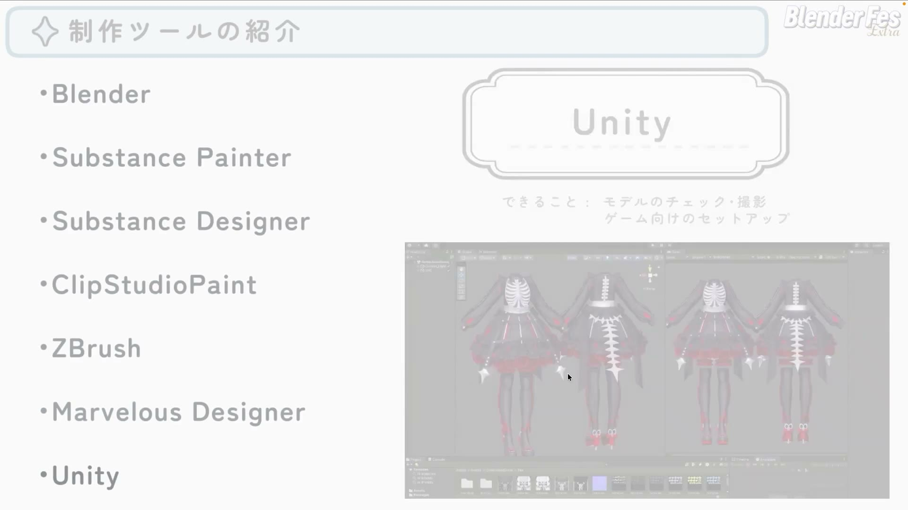

---

## 講座概要

| 項目 | 前半 | 後編 |
|:---|:---|:---|
| **タイトル** | 【Blender Fes Extra】3D衣装の作り方 前半 | 【Blender Fes Extra】3D衣装の作り方 後編 |
| **提供** | CGWORLD ONLINE ACADEMY | CGWORLD ONLINE ACADEMY |
| **URL** | https://academy.cgworld.jp/contents/2152 | https://academy.cgworld.jp/contents/2181 |
| **長さ** | 1:41:31 | 1:45:48 |
| **主な内容** | 全体のワークフロー、使うツール、デザイン決めと分析、モデリング、UV 展開、ハイモデル作成 | ベイク、テクスチャ、ボーンとウェイト、Unity でのチェック、ワークフロー観、質疑応答 |
| **講師** | アレイラさん(講座内の呼称) | 同左 |

時刻の表記について補足します。前半の時刻は講座動画プレーヤーの時刻に換算した目安です。後編の時刻は校正済み文字起こしの時刻で、プレーヤーの時刻とは数分から十数分ずれている可能性があります(要確認)。

---

## 背景: 1 着の衣装を「工程の地図」として見せる講座

### 講師の制作スタイル

アレイラさんは講座の中で、3DCG アーティストとして VRChat 向けの衣装やアイテムを配布したり、Unity で映像やシェーダーを作ったりしていると話していました。講座のもとになったのは、アレイラさん自身が書いた記事「3D衣装のつくり方とヒミツ」です。約 13,000 字の記事の内容を、動画の実演でさらに掘り下げる構成になっています。

題材の衣装は、VRChat 向けアバター「マヌカちゃん」に合わせて作られ、最終的に無料で配布されました。質疑応答によると、デザインの作り直しを含めて完成までに約 2 年かかったそうです。

講座を通して印象に残るのは、どの工程でも「次の工程が楽になるか」を基準に判断している点です。モデリングで付けたシャープが UV のシームになり、ベイクの仕上がりにも効いてきます。こうしたつながりを工程をまたいで見られることが、この講座の大きな特徴と言えるでしょう。

### 対象読者

講座は 2 種類の受講者を想定していました。3D 衣装がどう作られるのかを知りたい人と、すでにモデリングや衣装制作の経験があり、細かいテクニックを取り入れたい人です。Blender の基本操作(視点操作、移動、回転、編集モードなど)は覚えている前提で進みます。アレイラさんは、難しい箇所はいったん通して見てから、実際に手を動かすときにアーカイブで見直すとよいと勧めていました。

### 必要なツール

講座では 7 つのソフトが紹介されました。すべてが必須というわけではなく、アレイラさんが最低限そろえるなら、と挙げたのは Blender と Substance 3D Painter の 2 本です。VRChat やゲームで使うなら、これに Unity が加わります。

| ツール | 講座での役割 | 必須度 |
|:---|:---|:---|
| Blender(講座は 5.1) | モデリング、UV 展開、ハイモデル、ボーン、ウェイト | 必須 |
| Substance 3D Painter | ベイクとテクスチャ | 講師は必須と位置付け |
| Unity + lilToon + VRChat SDK | 見た目のチェックと VRChat 向けの設定 | ゲームで使う場合に必要 |
| Marvelous Designer | 型紙からのシワづくり(完成品には不使用) | 任意 |
| ZBrush | 布のハイモデル | 任意(Blender のスカルプトで代用可) |
| Substance 3D Designer | レースや柄のパターン素材 | 任意 |
| CLIP STUDIO PAINT | デザイン画、テクスチャの加筆と PSD 化 | 任意(使い慣れたペイントソフトで可) |

Substance 3D Painter を選ぶ理由として、Blender では補いにくい機能がそろっていること、リアル寄りの衣装ではほぼ必須なこと、衣装以外の制作にも使えることの 3 点が挙げられていました。

---

## 1. 企画・型紙的発想とモデリング

最初の工程は、デザインを決めて分析し、ポリゴンで形を作り、UV に開くところまでです。この講座では、現実の服の構造(縫い目や型紙)を手がかりに 3D の形を考える場面が何度も出てきます。

### 前半 15:11〜 デザイン画は素体に合わせて描く

アレイラさんは、着せるアバターの素体を正面から撮影し、その画像に重ねてデザイン画を描いていました。モデリングで形をキャラクターに合わせ直す手間が減るためです。

今回のデザイン画は正面図と詳細図だけでしたが、描かれていない角度を頭で補う必要があるため、このやり方はあまり勧めていません。おすすめは正面・側面・背面の三面図です。依頼や共同作業ではほぼ必須で、1 人で作る場合も下絵としてトレースできます。

### 前半 18:03〜 T ポーズと A ポーズは「両方で確かめる」

デザイン画の腕のポーズは、素体の標準姿勢である T ポーズか A ポーズに合わせます。T ポーズはモデリングしやすい反面、腕を下ろしたときに肩や袖のシワが不自然になりがちです。A ポーズは下ろした状態に近いぶん自然ですが、モデリングはしにくくなります。

どちらを選ぶべきかという問いに、アレイラさんは次のように答えていました。

> 私の答えはどちらでもOKです。

選ばなかったほうのポーズでも確かめればよい、という考え方です。T ポーズで描いたなら、ペイントソフトの変形機能で腕を傾けて違和感を探します。A ポーズで描いたなら、腕を水平にした画像を下絵にします。人に描いてもらう場合は、A ポーズに近い形で頼むのが無難だそうです。

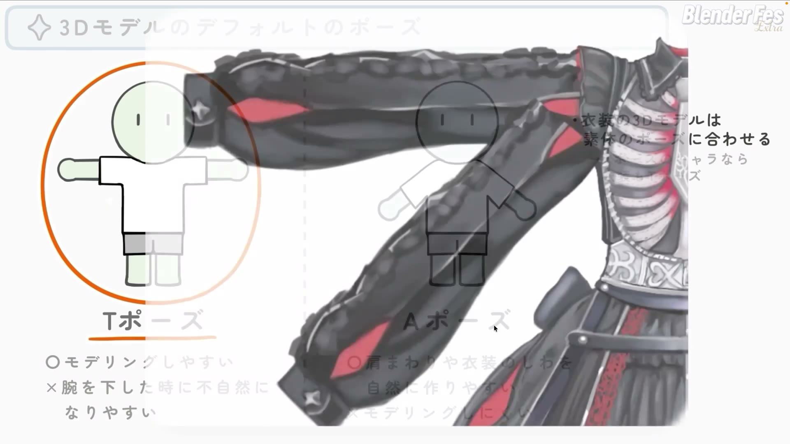

デザインは「自分が好きな要素」と「受け取る人がうれしい要素」の 2 つを軸にしていました。斜め上からのライトで影がきれいに落ちること、バストアップでも特徴が分かること、近くで見て気づく作り込みを意識したそうです。

### 前半 24:48〜 デザインの分析で「作り方の方針」を先に決める

デザインが決まったら、制作に入る前に分析をします。分析の目的は 2 つです。1 つはデザインの解像度を上げること、もう 1 つはモデル制作の方針を決めることです。

構造が分からないパーツは、実物の服や通販の商品画像を集めて調べます。アレイラさんは PureRef に画像と三面図を並べて貼り、生地や縫い方も観察して詳細図にメモしていました。

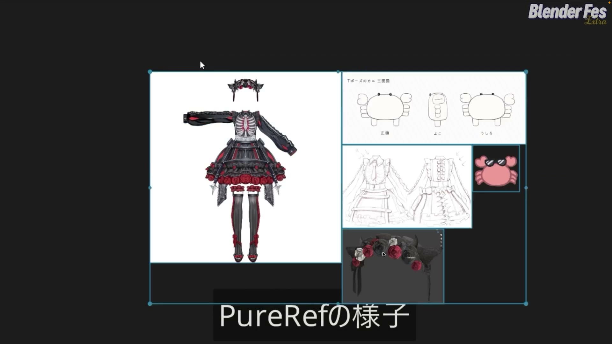

方針の面では、ポリゴン数、どこまでを形で作るか、テクスチャの枚数と分け方、柄の用意の仕方を見積もります。今回は VRChat の少人数での撮影を想定し、8〜10 万ポリゴン以内に抑えました。バラやフリルにポリゴンを使うぶん、正面の細かなシワは平らに作ってテクスチャに任せています。この線引きには経験が要るため、慣れないうちはベイクの段階で試して決めてよいそうです。

### 前半 29:18〜 下準備と「立体を出して、増やして、動かす」基本

下準備では、素体の FBX を読み込み、デザイン画を画像エンプティとして配置します。下絵は正面から見たときだけ表示し、不透明度を下げ、選択できないようにしておきます。テクスチャが色あせて見えるときは、カラーマネージメントのビュー変換を「標準」にします。講座では「フィルミック」から変えていましたが、Blender 4.0 以降の既定は AgX です。どちらでも「標準」にすれば同じ結果になります。

モデリングの基本は、標準の立体を出し、必要なだけ頂点を増やし、動かして形を作ることの繰り返しです。スカートなら、頂点数を 8〜10 に減らした円柱を下絵に合わせて変形し、ループカットで辺を足し、上下の面を消せばラフができます。

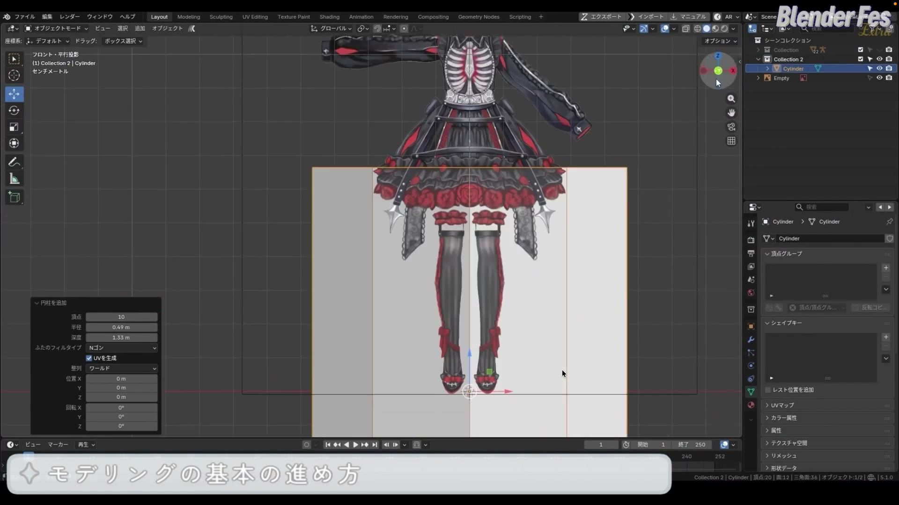

作り始めの立体は、筒状のパーツなら円柱、結び目なら立方体、平たいものや複雑なものは平面と選び分けます。ただ、最後に形になればどれから始めても問題ないそうです。

作り込みでは、無料のアドオン AutoMirror、EdgeFlow、LoopTools と、標準の細分化、ナイフ、収縮/膨張(Alt+S)、辺スライド(G を 2 回)を組み合わせます。細分化は三角面をまたいでも一周できるため、ループカットより出番が多いそうです。

### 前半 45:42〜 複雑なパーツとシワの作り方

骨のベルトやヘッドドレスの羽、靴底は、平面をデザイン画に合わせてナイフでトレースし、押し出して作ります。地道ですが応用の利く方法です。

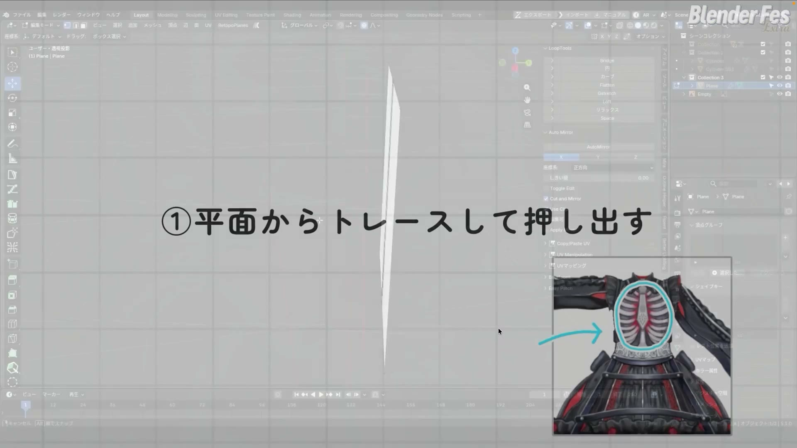

チェーンのような繰り返しは、配列モディファイアーで並べてカーブモディファイアーで沿わせます。バラも花びら 1 枚から配列で作り、適用後にプロポーショナル編集で形をばらつかせて硬さを消していました。

シワは、流れに沿ってナイフを入れて膨らませる方法と、ハイモデルで作ってからリトポロジーする方法の 2 通りです。Marvelous Designer は型紙を縫い合わせるだけでリアルなシワができる反面、デザイン画と同じシワは作れません。重力に逆らうフリルがあったため、今回の完成品には使っていないそうです。

### 前半 51:37〜 シルエットの調整と三面図の優先順位

形ができたら、引きで見て角が目立つ所にポリゴンを足し、上下や斜めから回して歪みを探します。三面図どおりのスカートは上から見ると四角っぽくなりやすいので、丸く整えます。

三面図と 3D が合わない場面はほぼ必ず出てきます。アレイラさんの優先順位は、正面図と斜めの見え方が最優先、次に背面図、最後に側面図でした。側面図は印象を取り入れる程度にとどめ、3D として自然な奥行きを優先します。

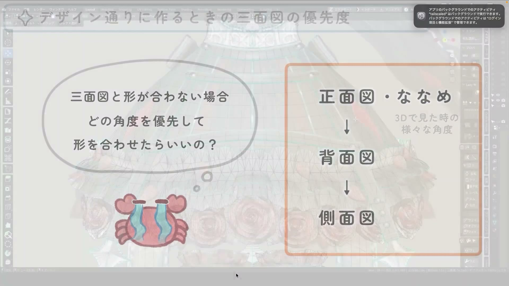

なお、前半の 54:18 付近には、録画の都合で講座動画の約 2 分ぶんが欠けています。三面図の優先順位の説明の途中にあたるため、講座動画で確かめると確実です。

### 前半 57:18〜 後工程が楽になる形と、データの最終チェック

この工程でいちばん実践的なのが、後の工程を見越した形の作り方です。UV のためには、縫い目や材質が変わる所に辺を合わせ、90 度に近い角や材質の切り替わりに「シャープをマーク」を付けておきます。ウェイトのためには、面を格子状にそろえ、肩・肘・膝は素体とエッジの位置と本数を合わせます。近いパーツや表裏のあるパーツは頂点の位置をそろえ、ボタンの下は中心でバツ印に面を割っておくと、動かしても浮きにくくなります。

仕上げのチェックは 3 つです。五角形以上の面は「特徴で全選択」で探して直します。ゲーム向けモデルは Unity ですべて三角面になるため、三角面を使ってかまいません。歪んだ四角面はむしろ三角化して向きをそろえるほうがよいそうです。あとは、フリルなどに出やすい非多様体と、裏返った面の向きを直します。

### 前半 65:20〜 UV は「シャープ・縫い目・目立たない側面」でシームを入れる

アレイラさんは UV 展開を、コツを覚えれば楽しい作業だと話していました。

> コツを覚えてしまえばとても楽しいパズルゲームのような作業です

流れは、シームを付ける、展開する、整える、正方形に詰める、の 4 段階です。まずシャープの辺を「類似選択」で一括選択してシームに変えます。これだけでシーム付けの約半分が終わります。

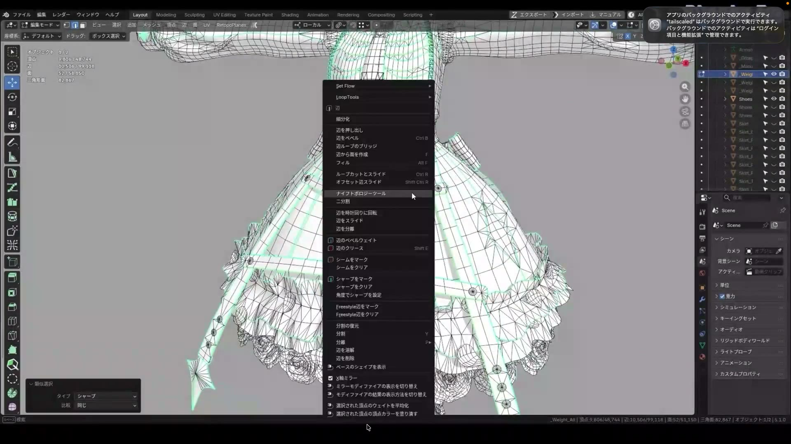

残りは、布なら現実の服の縫い目の位置に入れます。分からない形は型紙を調べるとよいそうで、衣装ならではの発想と言えます。縫い目のない装飾は、立方体なら角、円柱なら上下と目立たない側面、と単純な立体に置き換えて考えます。

展開はアングルベースで一度に行います。崩れたら、シームの入れ忘れと非多様体や面の向きを確かめます。展開のエラーは、モデリングのミスに気づくきっかけにもなります。

### 前半 72:23〜 Mio3 UV で直線化し、6 枚のタイルに詰める

UV を整えるには、アドオンの Mio3 UV を使います。線が入る所や UV の端を直線にすると、隙間が減って解像度を稼げ、線のジャギーも抑えられます。TexTools は Blender 5.0 以降で動かないため、Mio3 UV に切り替えたそうです。

UV ストレッチで歪みを色で見ながら、格子状の所はグリッド化、三角面が混じる所は矩形、下が波打つフリルは上辺だけストレートで直線にします。端をピン留めして内側を展開し直すと、歪みが抜けます。

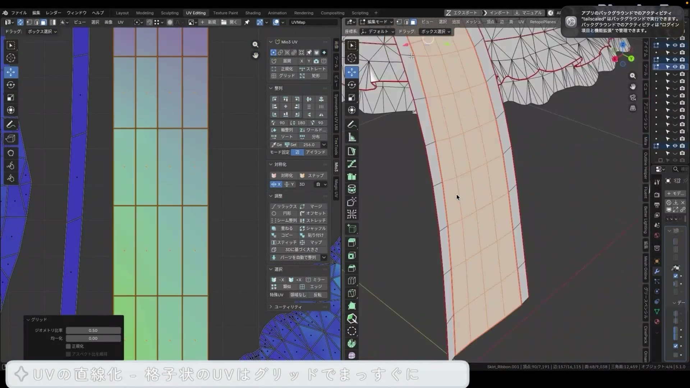

配置では、UV の大きさと向きをそろえ、パディング(間隔)を空けます。今回の衣装は、縦に 6 つ並べた正方形に、バラ、トップス、スカート、靴下と靴、骨、ベルトと金属をそれぞれ詰めていました。スカートだけでテクスチャ 1 枚分の解像度が必要だったためです。

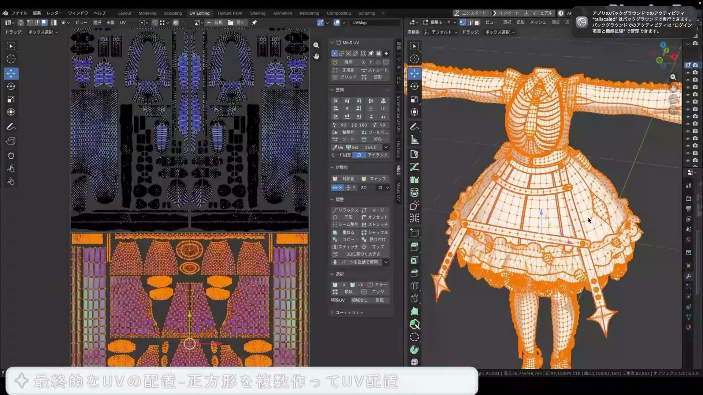

**開く場所(モデリングと UV)**

| 目的 | アプリ | 開く場所 |
|:---|:---|:---|
| 下絵を正面だけに表示する | Blender | プロパティエディター > オブジェクトデータタブ > エンプティ > 表示先(Show In)の「透視投影」をオフ |
| テクスチャの色あせを直す | Blender | プロパティエディター > レンダータブ > カラーマネージメント > ビュー変換(View Transform)を「標準」に |
| 五角形以上の面を探す | Blender | 編集モード > 選択 > 特徴で全選択(Select All by Trait) > 面の辺数(頂点数 4、タイプ「大きい」) |
| 非多様体を探す | Blender | 編集モード > 選択 > 特徴で全選択 > 非多様体(Non Manifold) |
| シャープを一括でシームにする | Blender | 編集モード > 選択 > 類似選択(Select Similar) > シャープ → 右クリック > シームをマーク(Mark Seam) |
| UV を直線にする | Blender + Mio3 UV | UV エディター > サイドバー(N) > Mio3 UV > グリッド化 / 矩形 / ストレート(日本語表記は要確認) |

---

## 2. ハイモデル(スカルプト)

### 前半 86:41〜 ハイモデルは「凹凸を運ぶための素材」

ハイモデルは、数百万ポリゴン以上の細かいモデルにシワやディテールを彫る工程です。ゲームには使わず、後編のベイクで凹凸をテクスチャに移すための素材になります。

アレイラさんは、布は主に ZBrush、硬いパーツは Blender のベベルやサブディビジョンと使い分けていました。Blender は数百万ポリゴンを超えると編集が重くなりやすいためです。講座では両方の手順が紹介されました。

### 前半 88:50〜 Blender での準備: 複製、ミラー適用、マルチレゾリューション

手順の最初は、モデリングで作ったモデルを必ず複製することです。複製したほうをハイモデル専用にします。ミラーモディファイアーは適用しておくと、左右で違うシワを描けます。

次にマルチレゾリューションモディファイアーを付け、「細分化」か「リニア」でポリゴンを細かくします。細分化はサブディビジョンサーフェスに近い丸まり方をし、リニアは元の形をほぼ保ちます。ローポリ寄りのモデルで角が丸まりすぎる場合は、先にリニアを 2〜3 回かけてから細分化するのがアレイラさんの手順です。講座のスカートは細分化 3 回から始めていました。

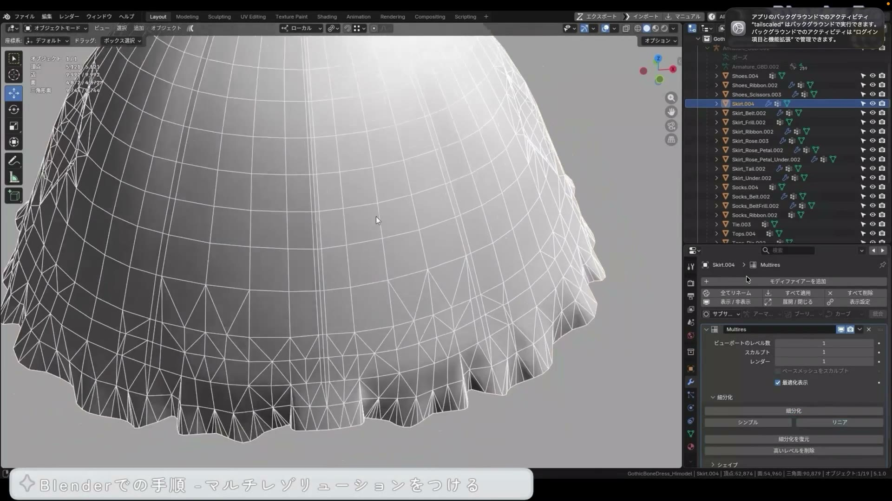

スカルプトモードでは、照明をグレー系の MatCap にしてシワの凹凸を見やすくし、左右対称のパーツは対称の X をオンにします。

### 前半 91:39〜 表面を磨いてから、大きなシワ、鋭いシワの順に

最初にするのは、細分化で残ったポリゴンの角やシワを Shift のスムーズで消すことです。ポリゴンの角はベイクで拾われてしまうため、先に表面を磨いておきます。

シワはドローブラシで大きなものから描き、根元をスムーズでなじませます。鋭い山や溝はドローシャープ、深い溝はクリースシャープ、カーブの調整はグラブです。マルチレゾリューションが付いている間は、塗った所を元に戻す「マルチレゾディスプレイスメント消しゴム」も使えます。

### 前半 94:47〜 ダイナトポで割りを直し、描くときはオフにする

シワ付けが一段落したら、マルチレゾリューションを適用してダイナトポを使える状態にします。ディテールタイプを「相対ディテール」にし、密度ブラシでなぞると、その部分のポリゴンの割りが作り直されます。マルチレゾでは直らなかった割りの乱れを修正でき、ディテールサイズを下げれば、フリルの付け根のように細かく描きたい所だけ割りを増やすこともできます。

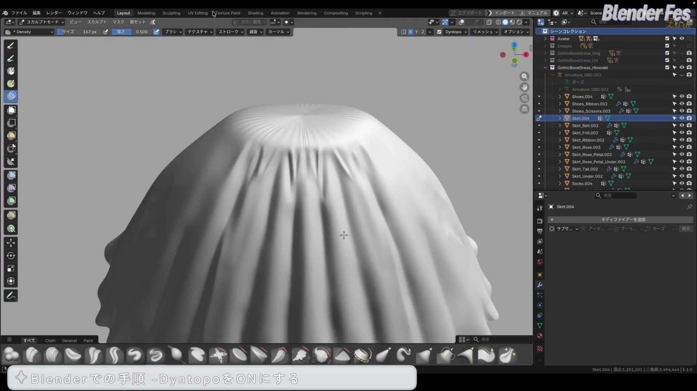

描き込むときはダイナトポをオフにすると、アーティファクトを防げるそうです。フリルの実演では、大きな凹凸の当たりを取ってから鋭いシワを加えていました。シワ入れは手癖になりがちだとして、アレイラさんは次のように話していました。

> 実際のお洋服を見て、形状やシワの入るところと、逆に入らないところを考えてから描くのが大事だなと思います。

### 前半 96:50〜 ZBrush での手順

ZBrush では、GoB アドオンか FBX でモデルを持ち込み、サブツールを複製してから作業します。ZRemesher でポリゴンの流れを整え、ディバイドを 2〜3 回かけ、表面を磨いてから、スタンダードブラシや配布ブラシの SK クロス・SK スラッシュ(要確認)でシワを描きます。質疑応答によると、衣装全体のハイモデルは約 2,000 万ポリゴンあったそうです。

**開く場所(ハイモデル)**

| 目的 | アプリ | 開く場所 |
|:---|:---|:---|
| ポリゴンを細かくする | Blender | プロパティエディター > モディファイアータブ > モディファイアーを追加 > 生成 > マルチレゾリューション(Multiresolution) > 細分化 / リニア |
| シワを見やすくする | Blender | 3D ビューポート右上 > ビューポートシェーディングのポップオーバー > 照明 > MatCap |
| 左右対称に描く | Blender | スカルプトモードのヘッダー右 > 対称(Symmetry)の X |
| 割りを作り直す | Blender | スカルプトモードのヘッダー > Dyntopo(ディテールタイプ「相対ディテール」)→ 密度(Density)ブラシ |
| ポリゴンの流れを整える | ZBrush | ジオメトリ > ZRemesher → ディバイド(Divide) |

---

## 3. ベイクのためのパーツ分けと Substance でのベイク

### 後編 00:00〜 ノーマルと AO の 2 枚が要

ベイクは、ハイモデルの凹凸などの情報をテクスチャに変換する工程です。少ないポリゴンでも立体感を出せるため、質と軽さの両方に効きます。特に重視されていたのは、ノーマルマップと AO(アンビエントオクルージョン、隙間の影)の 2 枚でした。

> この2枚さえうまくできたらテクスチャも綺麗に作れると言っても過言ではありません

アレイラさんは Substance 3D Painter のプロジェクトを、ノーマルのベイク用、AO のベイク用、テクスチャ作成用の 3 つに分けています。ベイク用の 2 つで 1 枚ずつ焼いて書き出し、テクスチャ用プロジェクトに素材として読み込む流れです。

### 後編 02:21〜 ノーマル用のパーツ分けは「交差をなくす」

ベイクをきれいにする鍵は、Blender でのパーツ分けです。ノーマルは近くの面の凹凸まで拾うため、交差する所にエラーが出ます。そこで交差するパーツを別オブジェクトに分けます。リボンなら上・真ん中・下の 3 つです。

分けるのはベイク用の複製です。ローモデルは Unity で使う本番のモデルでもあるためです。ハイモデルも同じ単位で分け、名前をそろえて末尾にローは `_low`、ハイは `_high` を付けます。これで Substance 3D Painter がメッシュ名でローとハイを対応付けられます。

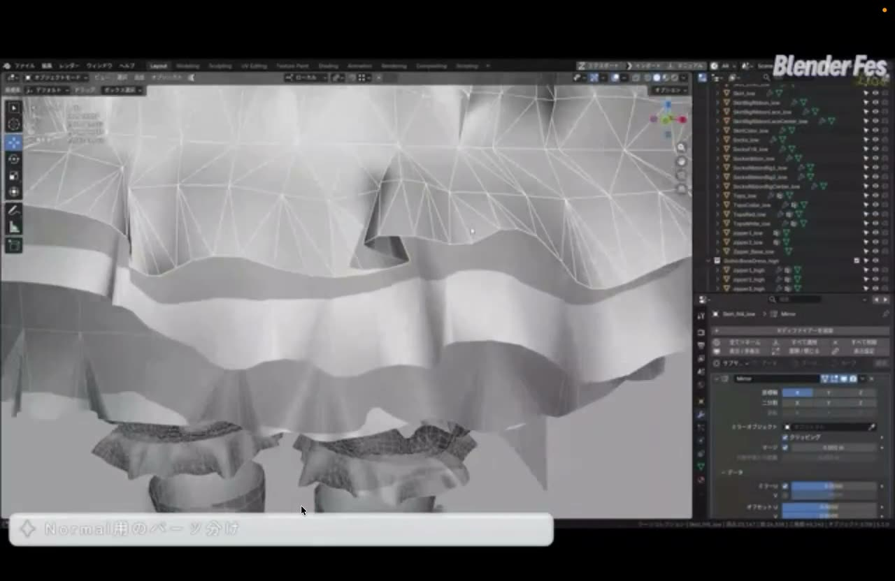

### 後編 06:51〜 AO 用のパーツ分けは「影を残さない」

AO は基本 1 つのオブジェクトにまとめ、パーツ同士の影が入るようにします。分けるのは、表示を切り替えるパーツと大きく揺れるパーツだけです。影だけが残ると不自然に見えるためです。今回はネクタイ、ベルトやリボン、骨、フリルを分けていました。

分け終わったら、元のモデルと同じ位置にあるか、マテリアル名と割り当てが正しいかを確かめます。最後にロー用・ハイ用・AO 用を別々の FBX で書き出します。

### 後編 09:28〜 Substance 3D Painter でノーマルを焼く

ノーマル用プロジェクトは、ロー用の FBX で新規作成します。解像度は 4096(簡単なモデルなら 2048)、法線マップ形式は Unity なら OpenGL、Unreal なら DirectX です。

「メッシュマップをベイク」の画面では、ハイポリメッシュにハイ用の FBX を指定し、前面の最大距離を赤いはみ出しが消えるまで上げ、くぼみが取れるよう背面の最大距離も少し上げます。マッチは「メッシュ名別」にし、アンチエイリアスは 4 か 8 にします。Normal のチェックを Alt+クリックすると、そのベイカーだけがオンになります。

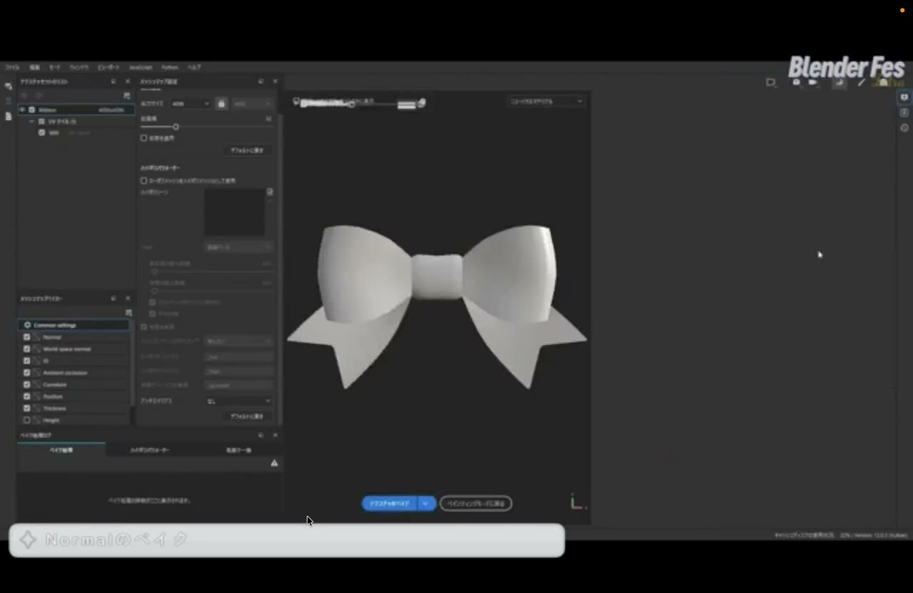

### 後編 11:40〜 ベイクエラーの 3 段階の対処

衣装ではノーマルにエラーが出ることがあります。対処は 3 段階です。

1. ポリゴンに沿った筋が出るときは、UV の重なりを疑います。同じパーツの UV を重ねて配置している場合、1 つを残して UV タイル 1 個分ずらしてから焼きます。ノーマル用と AO 用の両方で同じ処理をします。
2. 欠けて見えるときは、ハイモデルの高低差が読み取れる範囲を超えています。最大距離を調整し、それでもだめならハイモデルの高低差をグラブで抑えるか、ケージモデルを作ります。
3. 最終手段として、ペイントレイヤーをパススルーにし、指先ツールでノーマルを引き延ばすように手で直します。

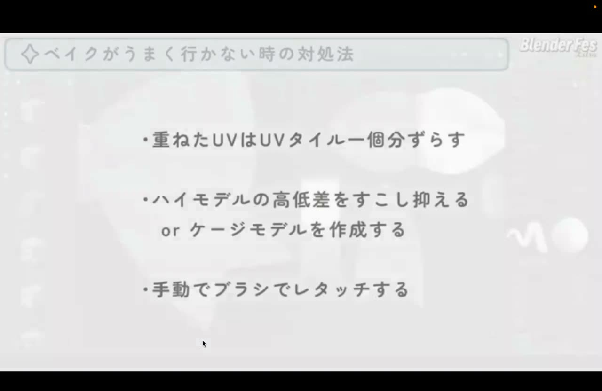

ケージモデルの読み込み方は、該当部分の音声と画面が確認できていません(要確認)。

焼けたノーマルは、出力テンプレートに Normal OpenGL を入れた専用テンプレートで書き出します。PNG、4096 か 2048、パディングは「拡張 + 透明」がおすすめとのことでした。

### 後編 15:16〜 AO を焼き、手でレタッチする

AO 用プロジェクトにはハイモデルを読み込まず、書き出したノーマルをメッシュマップの Normal 欄に入れます。これでハイモデルの凹凸が AO に反映されます。Ambient occlusion だけをオンにし、セルフオクルージョンを「同じメッシュ名のみ」にして焼きます。

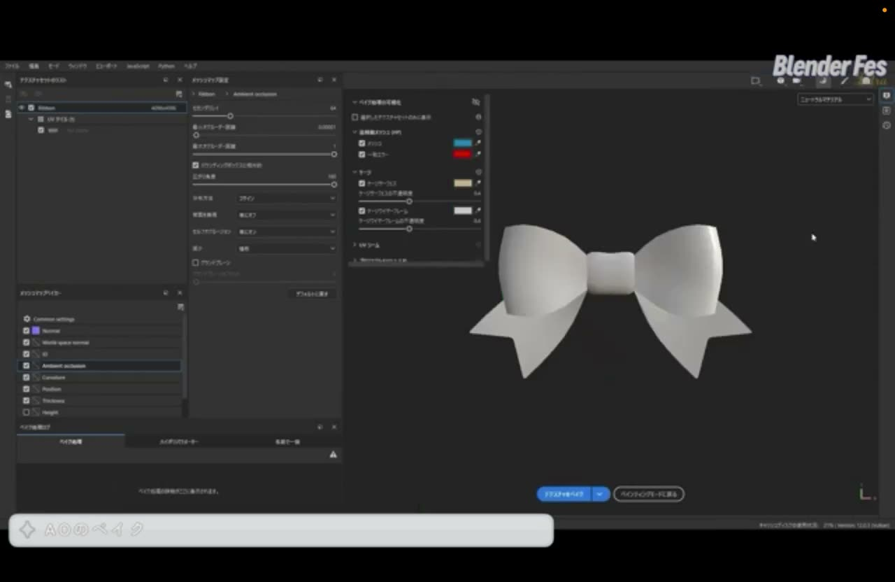

きれいに焼けても、カクカクした線など気になる所は残ります。AO チャンネルを追加してミキシングを置き換えにし、焼いた AO を塗りつぶしレイヤーで下に敷き、その上のペイントレイヤー(パススルー)に指先ツールやブラシ、消しゴムで手を入れます。AO はテクスチャ作成で凹凸を足したあとに焼き直すため、ここでの書き出しは仮です。

**開く場所(パーツ分けとベイク)**

| 目的 | アプリ | 開く場所 |
|:---|:---|:---|
| 交差するパーツを分ける | Blender | 編集モード > L でリンク選択 > メッシュ > 分離 > 選択(Separate > Selection、P) |
| ベイク用の FBX を書き出す | Blender | ファイル > エクスポート > FBX > 選択したオブジェクト / スケールを適用「すべてFBX」/ 三角面化 |
| ベイク画面を開く | Substance 3D Painter | テクスチャセットの設定(Texture Set Settings) > メッシュマップをベイク(Bake Mesh Maps) |
| ローとハイを名前で対応付ける | Substance 3D Painter | ベイク画面 > 共通設定 > マッチ > メッシュ名別(By Mesh Name) |
| 他パーツの影を入れない | Substance 3D Painter | ベイク画面 > Ambient occlusion > セルフオクルージョン > 同じメッシュ名のみ |
| 焼いた画像を書き出す | Substance 3D Painter | ファイル > テクスチャを書き出し(Ctrl+Shift+E) > 出力テンプレート |

---

## 4. テクスチャ

### 後編 19:28〜 5 つのステップと、ソフトの選び方

テクスチャは、下準備、ベースの色分けと柄、ディテールの追加、ライティングの焼き込み、質感の調整の 5 ステップで進めます。UV のミスに気づきやすい柄を早めに入れるのがポイントです。完全なイラスト調のモデルなら、ハイモデルとベイクを省いてペイントソフトで塗ることもあるそうです。今回は少しリアル寄りの立体感を見せるため、Substance 3D Painter を中心にしています。

### 後編 20:56〜 テクスチャ用プロジェクトの下準備

テクスチャ用プロジェクトはロー用の FBX で作り、複数の UV タイルを使う設定にします。テクスチャセットの設定では、AO チャンネルを追加し、透明部分があれば Opacity、発光があれば Emissive も足します。標準ミキシングと AO のミキシングを「置き換え」にし、UV パディングを「3D スペースネイバー」にすると、UV の境界で描画がうまくいかない問題を避けられます。

メッシュマップの Normal と AO 欄には焼いた 2 枚を入れ、残りのメッシュマップはその 2 つと ID のチェックを外してから焼きます。マテリアルごとに設定が独立している点に注意が要ります。

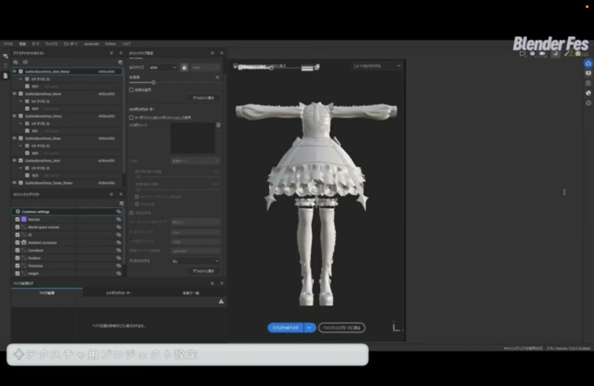

さらにシェーダーを透過対応の pbr-metal-rough-with-alpha-blending にし、最下層の塗りつぶしレイヤーにノーマルと AO を敷き直します。

### 後編 25:14〜 塗りつぶしレイヤーと黒マスクで色分けする

Substance 3D Painter では、透明な空レイヤーに直接描くやり方は基本的に使いません。塗りつぶしレイヤーに黒のマスクを付け、マスクの中のペイントレイヤーに白黒で形を描きます。白が塗る所、黒が塗らない所です。形と色が分かれているため、形はそのままで色や他のパラメーターだけを変えられます。

色分けは、ポリゴン塗りつぶし(4 キー)の UV 単位のモードでバケツ塗りすると速く進みます。左右対称のモデルは、ペイントにミラーフィルターを足せば片側だけ塗れば済みます。

柄は、Substance 3D Designer で作った多色の SBSAR ならレイヤーに直接、単色の柄ならマスクに入れて貼ります。柄が歪むときは、この段階で UV を直してメッシュを再読み込みするのがおすすめだそうです。

### 後編 30:36〜 布端、縫い目、繊維でディテールを足す

ここから Substance 3D Painter の本領が出ます。アレイラさんが足すのは 3 つの要素です。

1. **布端の立体感。** 実際の服の裾は折り返して縫ってあるため、端が膨らんで見えます。マスクに UV の端から一定幅を塗るジェネレーター(UV Border 系、正式名称は要確認)を入れ、ブラーとヒストグラムスキャンで輪郭を整え、ハイトを上げて膨らませます。
2. **縫い目。** ペイントレイヤーのパスにステッチ系のブラシで縫い目を引き、サイズとハイトを調整します。UV がまっすぐな所はブラシで直接引くだけで済みます。
3. **生地の質感。** マスクに繊維のパターンを入れ、投影を三面投影にして UV の切れ目を目立たなくし、細かくタイリングしてハイトで凹凸を付けます。レザーも同じ手順です。

### 後編 33:40〜 ライティングをベースカラーに焼き込む

Unity でトゥーンシェーダー(lilToon)を使う場合、見た目は Substance 3D Painter のマテリアル表示よりベースカラー表示に近くなります。そのため、ベースカラーに光と影をある程度焼き込んでおく必要があります。

ただし、ジェネレーターの多くは AO、ワールドスペースノーマル、カーバチャーのメッシュマップを材料にしているため、上で足した凹凸はそのままでは反映されません。そこで、ノーマルをいったん書き出して AO を焼き直し、ワールドスペースノーマルとカーバチャーも焼き直してから焼き込みに入ります。

焼き込みでは、AO(乗算)で影を、カーバチャーで角のハイライトを、ポジションで上ほど明るいグラデーションを入れます。ライトジェネレーターを前後から重ねて影にし、最後に Baked Lighting フィルターで環境光を焼き込みます。

### 後編 38:14〜 ツヤと自然なムラで質感を仕上げる

質感は「凹凸」「焼き込んだ影」「ツヤ」の 3 つで作ります。最後はラフネスでツヤを調整し、奥まった所は上げて暗く、角は下げてハイライトにする使い方も紹介されました。

リッチに見せるコツは、自然な変化で CG っぽさを消すことです。生地にグランジ系のテクスチャで色ムラを付けますが、やりすぎると汚れに見えるため控えめにするそうです。

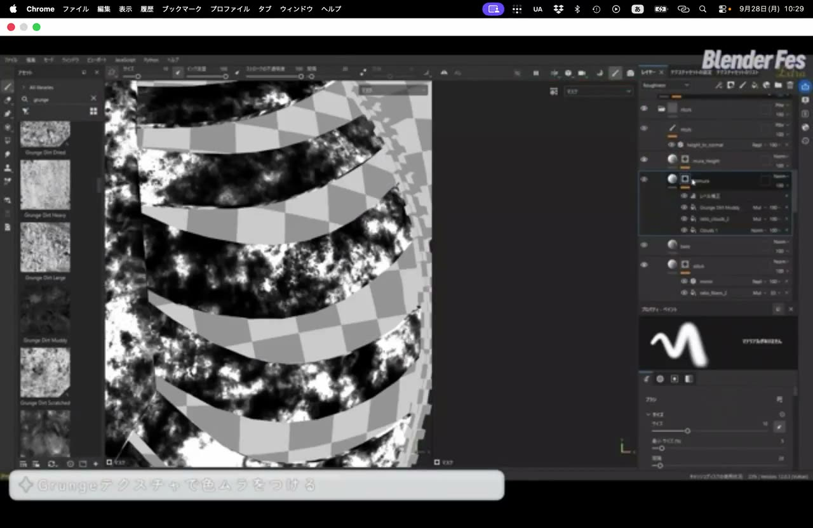

何より大事なのは、実物の服を観察することだと強調していました。たとえばベルトの縫い目は、そのままでは上に乗っているだけに見えます。縫い目を下に複製して周りをへこませると、生地への食い込みが再現できます。

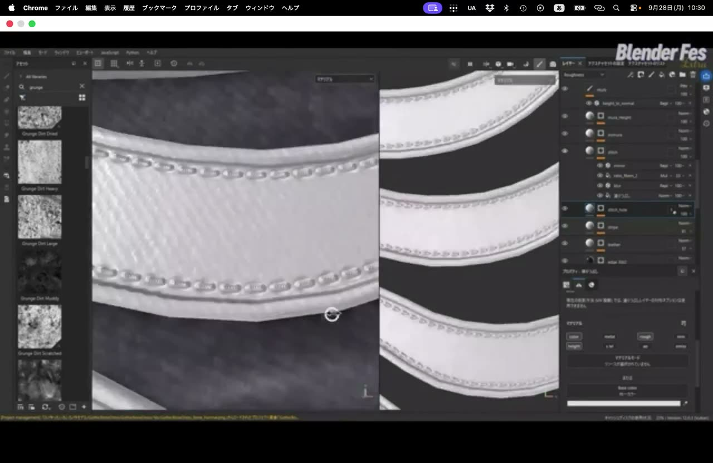

最後に、白黒のマップはグレー、カラーは RGB、透明度を含むベースカラーは RGB+A で出力テンプレートを作り、書き出して完了です。

**開く場所(テクスチャ)**

| 目的 | アプリ | 開く場所 |
|:---|:---|:---|
| ノーマルと AO を編集できるようにする | Substance 3D Painter | テクスチャセットの設定 > チャンネルの + / 標準ミキシングとアンビエントオクルージョンのミキシングを「置き換え」(Replace) |
| 形と色を分けて塗る | Substance 3D Painter | レイヤーパネル > 塗りつぶしレイヤーを追加 > 右クリック > 黒のマスクを追加 > マスクを右クリック > ペイントを追加 |
| UV 単位で塗る | Substance 3D Painter | ツールバー > ポリゴン塗りつぶし(Polygon Fill、4 キー) > UV 単位のモード |
| 布端を膨らませる | Substance 3D Painter | マスクを右クリック > ジェネレーターを追加 > UV Border 系(要確認) → 塗りつぶしレイヤーの Height |
| 環境光を焼き込む | Substance 3D Painter | レイヤーにフィルターを追加 > Baked Lighting Environment / Baked Lighting Stylized |
| ツヤを調整する | Substance 3D Painter | 塗りつぶしレイヤーのプロパティ > Roughness |

---

## 5. ボーンとウェイト

### 後編 41:43〜 揺れ骨は親ボーンから押し出し、エンドボーンで締める

衣装のボーンは、キャラクターのボーンに揺れ物用の骨を足して作ります。ネクタイなら、近いチェストの先端から押し出し、接続を外して根元をネクタイの位置へ動かします。揺れ骨の最後には、ウェイトを付けない空の骨(エンドボーン)を足します。Unity で先端のボーンが無視されるのを防ぐためです。

リボンのように分岐するものは、根元に階層をまとめる空の骨を 1 本置き、そこから枝分かれさせます。

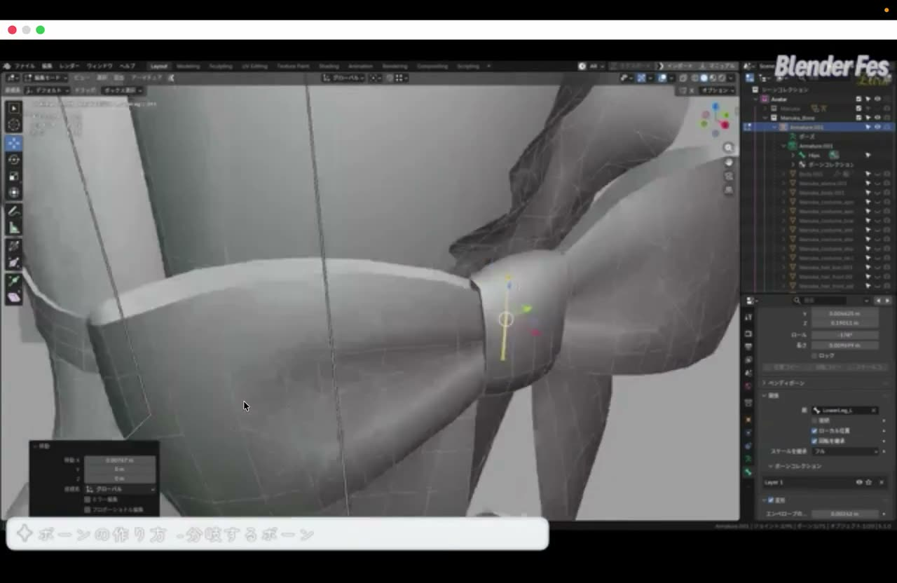

スカートは、ヒップから押し出したまとめ用の空の骨の下に、傘の骨のように放射状に並べます。名前に `_L` を付けて左側だけ作り、対称化で右側を作ります。

揺れ骨は「ロールを再計算」の「グローバル +Z 軸」で向きをそろえ、ポーズモードで回してスカートがきれいに広がるかを確かめます。最後に衣装とアーマチュアを「空のグループで」親子付けします。自動ウェイトは使いません。

### 後編 46:23〜 素体のウェイトを転送し、揺れ物は 2 通りで付ける

素体のウェイトは、データ転送モディファイアー(頂点グループ、最近接面の補間)で衣装へ移します。アーマチュアモディファイアーより上に置いてから適用するのがポイントです。

揺れ物は、単純なものならグラデーションツールで下から素体のウェイトを奪うように付けます。スカートのように複雑なものは、ボーンと同じくらいの頂点数の簡易モデルに数値でウェイトを割り当て、本番の衣装へ転送します。

### 後編 50:07〜 数値の表で、親子 2 つの間だけで取り合う

チェックでは、関節をやりすぎと思うくらい曲げ、ひねりも確かめます。原因のボーンが分からないときは、接続を外して大きく移動すると崩れが見やすくなります。

修正には、ブラシではなく、一覧表で数値を入れられるアドオンを使っていました。yuzuWeightEditor と、もう 1 つ(Lazy Weight Tool と推定、要確認)です。

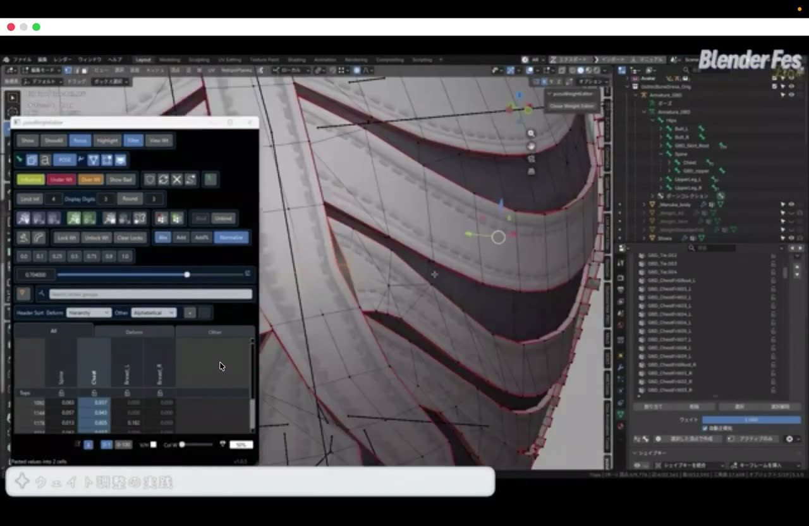

ルールは 2 つです。親の階層から順に調整すること(胴体ならヒップ、スパイン、チェストの順)と、変えたくないグループをロックすることです。

> 基本的に編集中のボーンとその親以外はロックして、親と自分の2つの間だけでウェイトを取り合うときれいにウェイトをつけられます

実演では、チェストをひねったときの破綻を、スパインとチェストの間だけで直していました。表裏のあるパーツは表と裏を同じ値にそろえます。

仕上げに、「クリーン」で 0 に近いウェイトを消し、「合計を制限」で 1 頂点 4 グループまでにし、「すべてを正規化」します。実行後は必ず骨を動かして確かめます。

**開く場所(ボーンとウェイト)**

| 目的 | アプリ | 開く場所 |
|:---|:---|:---|
| 根元を自由に動かす | Blender | プロパティエディター > ボーンタブ > 関係(Relations) > 接続(Connected)をオフ |
| ボーンロールをそろえる | Blender | 編集モード > アーマチュア > ボーンロール > ロールを再計算(Recalculate Roll) > グローバル +Z 軸 |
| 衣装とアーマチュアを親子付けする | Blender | オブジェクトモード > Ctrl+P > 空のグループで(With Empty Groups) |
| 素体のウェイトを移す | Blender | モディファイアーを追加 > 編集 > データ転送(Data Transfer) > 頂点データ > 頂点グループ > 最近接面の補間 |
| 数値でウェイトを調整する | Blender + yuzuWeightEditor | アドオンのエディターウィンドウ(頂点を選ぶと表に値が出る) |
| Unity 向けに整える | Blender | ウェイトペイント > ウェイト > クリーン / 合計を制限(Limit Total、制限 4) / すべてを正規化(Normalize All) |

---

## 6. Unity と lilToon での仕上げ

### 後編 58:07〜 FBX の書き出しと Unity への読み込み

衣装のメッシュとアーマチュアだけを選んで FBX で書き出します。素体や転送用メッシュは名前の先頭に `_` を付けて区別していました。設定は「選択したオブジェクト」「すべてFBX」「三角面化」に加え、エンドボーンを自分で付けているので「リーフボーン追加」を外します。

Unity は VRChat 向けの 2022 系で、lilToon と VRChat SDK を先に入れておきます。FBX を読み込んで Read/Write をオンにし、マテリアルを取り出してシェーダーを lilToon に変えます。ライトの色は白にしておきます。

### 後編 60:41〜 lilToon の設定

スカートを例に、lilToon の設定が順に紹介されました。

- **影。** 影設定をオンにし、色を少し抑えます。AO マップ欄に AO テクスチャを入れると、奥まった所がしっかり暗くなります。
- **ノーマルマップ。** ノーマルマップ設定をオンにしてテクスチャを入れ、「Fix Now」が出たら押します。
- **リムライト。** 色を白にし、マスク欄に AO マップを入れると、奥まった所にリムが入らなくなります。
- **反射。** 光沢設定で反射をオンにし、滑らかさ欄にグロスマップ(ラフネスの白黒反転)を入れ、光沢のタイプをリアルにします。反射率は弱めがおすすめです。環境光の反射に HDRI をキューブマップとして入れると、映り込みが加わります。
- **リムシェード。** 縁を少し暗くして、布の重みを出します。
- **金属。** マットキャップに CLIP STUDIO PAINT で描いた反射の球の画像を入れ、メタリックのマスクで範囲を限定します。

マテリアルを複製すれば、カラーバリエーションも作れます。

### 後編 64:58〜 Unity で見て、前の工程に戻る

この段階でモデルやテクスチャを作り直すことが多いそうです。Unity では印象が変わるためです。繊維が細かすぎてモアレに見えた、凹凸がイラスト的すぎた、といった点を前の工程に戻って直していました。PhysBone の仮設定や VRChat への仮アップロードで確かめ、ポストプロセスのオンとオフの両方でも見比べています。

揺れ物の設定やアップロードの手順は、ゲームによって変わることと、VRChat 向けの解説がすでに多いことから、講座では扱っていません。

**開く場所(Unity)**

| 目的 | アプリ | 開く場所 |
|:---|:---|:---|
| Unity 向けの FBX にする | Blender | ファイル > エクスポート > FBX > アーマチュア > リーフボーン追加(Add Leaf Bones)をオフ |
| FBX の読み込み設定をする | Unity | FBX を選択 > Inspector > Model タブ > Read/Write をオン、Blend Shape Normals を None |
| マテリアルを取り出す | Unity | FBX の Inspector > Materials タブ > Extract Materials |
| AO で影を制御する | Unity + lilToon | マテリアルの Inspector > 影設定 > AO マップ |
| 反射を付ける | Unity + lilToon | マテリアルの Inspector > 光沢設定 > 反射 / 環境光の反射 |

---

## 7. 講師のワークフロー観と Q&A

### 後編 66:50〜 ワークフローは崩してよい

講座の最後に、アレイラさんは紹介したワークフローを自分でも崩して使っていると明かしました。Unity で違和感があればモデルにもテクスチャにも戻り、ウェイトで柄の歪みに気づけばテクスチャに戻ります。モデリングしながら UV 展開を進めるのもよくやる進め方だそうです。

今回試してよかったこととして挙げられていたのが、次の考え方です。

> 自分が苦手な工程は先に味見してチェックしてみる

アレイラさんは、Blender のモデルを Unity に持っていくと見え方が変わることが苦手だったため、テクスチャもない途中のモデルを Unity で確かめたそうです。これでシルエットの修正回数が大きく減りました。ウェイトの難しい肩も、モデリングの途中で仮のウェイトを付け、UV やテクスチャの手戻りを減らしています。

締めくくりには、一度でうまくいかなくても挑戦を重ねること、自分の好きな部分を大切にすることが語られました。

> 自分の好きを取り入れた作品は人にも伝わりますし、それがあなたの個性になるかもしれないです。

### 後編 70:16〜 質疑応答から

質疑応答では、講座の内容を補う技術的な回答が多くありました。主なものを要約します。

- **ターンしたときのスカート。** ポーズモードで Z 軸に回してひねりを確かめ、最後は VRChat で実際にターンして確認するそうです。
- **別のアバターへの対応。** 素体に衣装を合わせてからウェイトを転送し直します。揺れ物の頂点グループをロックして転送すれば、揺れ物のウェイトは流用できます。肘や膝のエッジ数はアバターで違うため注意が要ります。
- **厚みの使い分け。** 襟など目に付く所はポリゴンで厚みを付け、裾のように目立たない所は薄いままです。
- **マルチレゾリューションで角が丸まる問題。** 分けられるパーツは別オブジェクトにし、無理な所はサブディビジョンとクリースを適用してからかけます。
- **テクスチャの枚数。** 仮の UV で AO とノーマルがきれいに焼けるか試してから決めるのがよいそうです。
- **調べ方。** 見つからないときは英語で検索し、英語の YouTube 動画を見るのがおすすめだそうです。

**開く場所(Q&A で出た操作)**

| 目的 | アプリ | 開く場所 |
|:---|:---|:---|
| ひねりを確認する | Blender | ポーズモード > ヘッダーの座標系「ローカル」、ピボットポイント「個々の原点」 > R → Z |
| 角の丸まりを防ぐ | Blender | 編集モード > 辺を選択 > Shift+E(辺のクリース)→ サブディビジョンサーフェスを適用 |
| 揺れ物のウェイトを残して転送する | Blender | プロパティエディター > オブジェクトデータタブ > 頂点グループの鍵アイコン → データ転送 |

---

## まとめ

約 3 時間半の講座を通して見えてくるのは、どの工程も「次の工程が楽になるか」で判断が組み立てられていることです。工程ごとの要点を表にまとめます。

| 工程 | 主な道具 | 持ち帰りたい考え方 |
|:---|:---|:---|
| 企画とモデリング | Blender、PureRef | 三面図と両方のポーズで確かめる。シャープと辺の位置を後工程に合わせて置く |
| UV 展開 | Blender、Mio3 UV | シームはシャープ、服の縫い目、目立たない側面に入れる。端を直線にして解像度を稼ぐ |
| ハイモデル | Blender スカルプト、ZBrush | 表面を磨いてから描く。実物のシワの入り方を観察する |
| ベイク | Blender、Substance 3D Painter | ノーマルは交差をなくすため、AO は影を残さないために分ける |
| テクスチャ | Substance 3D Painter | 布端・縫い目・繊維で凹凸を足し、トゥーン向けに光と影をベースカラーへ焼き込む |
| ボーンとウェイト | Blender、yuzuWeightEditor | 親から順に、親子 2 つの間だけで数値を取り合う |
| Unity での仕上げ | Unity、lilToon | 最終的に使う場所で見て、違和感があれば前の工程に戻る |

アレイラさん自身がワークフローを崩して使っているように、この手順は守るべき型というより、自分の得意と苦手に合わせて組み替えるための地図と捉えると使いやすいでしょう。まずは苦手な工程を 1 つ選び、途中のモデルで先に試してみるところから始めると、この講座の考え方がつかみやすいかもしれません。

---

## 参考リンク

- [【Blender Fes Extra】3D衣装の作り方 前半(CGWORLD ONLINE ACADEMY)](https://academy.cgworld.jp/contents/2152)
- [【Blender Fes Extra】3D衣装の作り方 後編(CGWORLD ONLINE ACADEMY)](https://academy.cgworld.jp/contents/2181)
- [特徴で全選択(Blender マニュアル)](https://docs.blender.org/manual/ja/latest/modeling/meshes/selecting/all_by_trait.html)
- [ビューポートオーバーレイ(Blender マニュアル)](https://docs.blender.org/manual/ja/latest/editors/3dview/display/overlays.html)
- [シーム(Blender マニュアル)](https://docs.blender.org/manual/ja/latest/modeling/meshes/uv/unwrapping/seams.html)
- [マルチレゾリューションモディファイアー(Blender マニュアル)](https://docs.blender.org/manual/ja/latest/modeling/modifiers/generate/multiresolution.html)
- [Dyntopo(Blender マニュアル)](https://docs.blender.org/manual/ja/latest/sculpt_paint/sculpting/tool_settings/dyntopo.html)
- [カラーマネージメント(Blender マニュアル)](https://docs.blender.org/manual/ja/latest/render/color_management/index.html)
- [Blender 4.0 Color Management(AgX が既定に)](https://developer.blender.org/docs/release_notes/4.0/color_management/)
- [Mio3 UV(Blender Extensions)](https://extensions.blender.org/add-ons/mio3-uv/)
- [GoB(GitHub)](https://github.com/JoseConseco/GoB)
