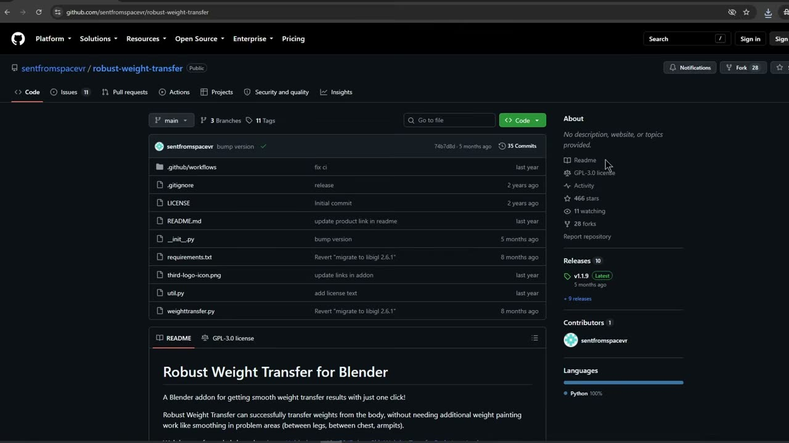
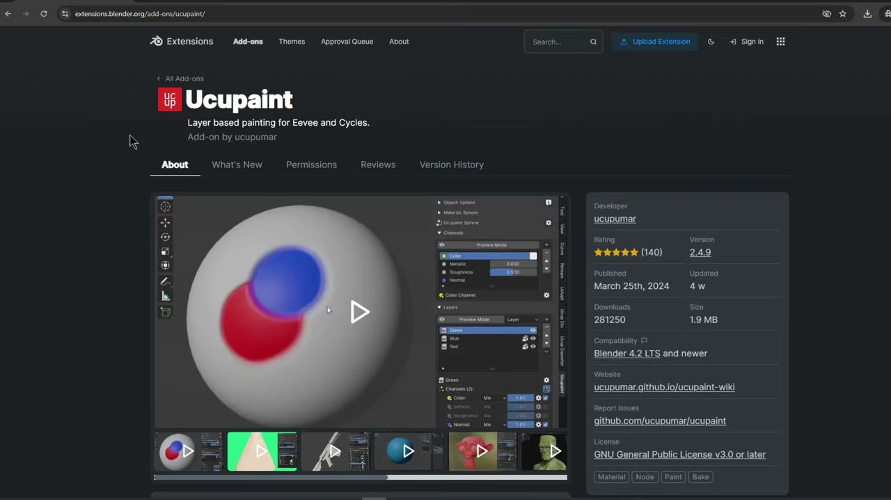
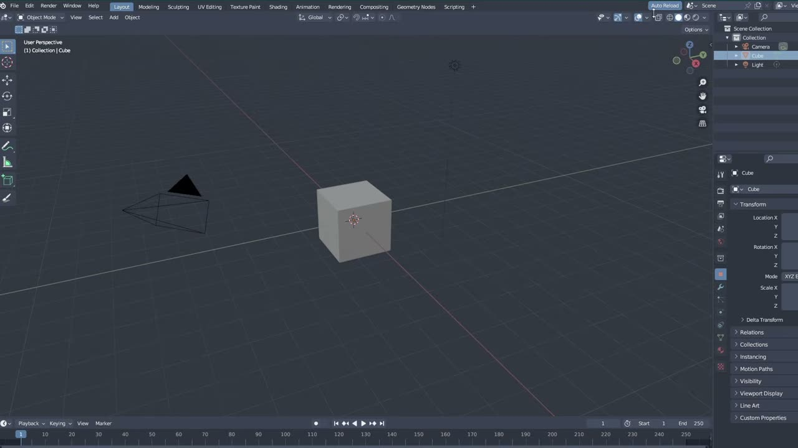

# Blender で作る VTuber モデル EP0: シリーズの全体像と準備するアドオン

3D の VTuber モデルを Blender で自作しようとすると、モデリングの前に「どのアドオンを入れておけばよいのか」「最後までにどんな工程があるのか」で迷いやすいものです。連載もののチュートリアルでは、この準備を最初にそろえておくと、途中の回でつまずきにくくなります。

YouTube チャンネル Hatsumi で公開された **「Blender Vtuber Modeling Series: EP 0 Intro」** は、VTuber モデルをゼロから作る連載の導入回です。約 5 分半の短い動画で、シリーズの方針、使うアドオンの入れ方、作者がよく使うツールがまとめて紹介されています。

本記事では、英語で解説されている動画の内容を日本語で整理し、EP1 以降に進む前に済ませておきたい準備を紹介します。

---

## 動画概要

| 項目 | 内容 |
|:---|:---|
| **タイトル** | Blender Vtuber Modeling Series: EP 0 Intro |
| **チャンネル** | Hatsumi |
| **公開日** | 2026年8月31日 |
| **長さ** | 5:42 |
| **言語** | 英語（ナレーション） |
| **使用ソフト** | Blender（作者は 3.6 を使用と説明） |
| **扱う内容** | シリーズの方針、アドオンの導入、よく使うツール |

---

## 手順の詳報

### シリーズの方針（00:24〜）

動画の前半では、このシリーズがどんな連載なのかが説明されます。複数回に分けたチュートリアルで、Blender の高度な技術がなくても自分の 3D VTuber モデルを作れるようになることを目指しています。

特徴的なのは、全員が同じ完成品を目指す形になっていない点です。作者は次のように話していました。

> 決まった 1 体のキャラクターを全員で作るわけではありません。

参照画像は作者が用意し、自由に手を加えてよいとされています。自分の参照画像がある人はそれを使ってもかまいません。画面には、T ポーズで描かれた参照画像の例が映っていました。

同じテーマの回を 1 本で終わらせず、複数用意する方針も語られています。肌の色、髪型、衣装を組み合わせられるようにし、耳・しっぽ・翼のようなアクセサリーも扱う予定です。すべての要素について男性版も用意すると説明されていました。

扱う範囲は、モデリングからテクスチャ、リギング、表情、Unity でのセットアップまでです。VTuber モデルを作る予定がない人にも、ここで使う手法は役立つと補足されています。参照画像やスターターメッシュ（途中段階のメッシュ）は、作者の Patreon で無料配布される予定です。

### Blender を用意する（01:59〜）

作者が使っているのは Blender 3.6 です。ただし、好きなバージョンを使ってよく、公式サイトからでも Steam からでも入手できると説明されていました。

### 外部から入れるアドオン 4 つ（02:10〜）

外部から取得するアドオンとして、次の 4 つが挙げられていました。

- **VRM Add-on for Blender**: VTuber 向けのアバター形式である VRM を Blender で扱うためのアドオン
- **Robust Weight Transfer**: 体のウェイト（ボーンの影響度）を別のメッシュへ転送するアドオン。画面に映った README では、脇や股のような崩れやすい場所も追加の手直しなしで転送できると紹介されていました。GitHub から入手します
- **Mio3 UV**: UV 展開を補助するアドオン。作者は「使うかどうかはまだ分からないが、あると便利かもしれない」という位置づけで紹介していました
- **Ucupaint**: レイヤー形式でテクスチャを描くためのアドオン

Ucupaint は、Blender の拡張機能サイトの「Get Add-on」からファイルを取得し、Blender へドラッグ＆ドロップする方法が示されていました。ただし作者は、GitHub から取得するほうをすすめています。

画面に映った拡張機能サイトでは、Ucupaint の対応バージョンが「Blender 4.2 LTS and newer」と表示されていました。作者と同じ 3.6 を使う場合は、GitHub 側で 3.6 に対応する版を探すことになりそうです。この点は動画では説明されていないため、導入時に確認しておくと安心です。

### アドオンをインストールする（03:21〜）

ダウンロードが終わったら、Edit メニューの Preferences から Add-ons を開き、Install でファイルを選びます。ここでの注意点は 1 つです。

> zip は解凍しないでください。zip のまま選んで Install Add-on を押します。

インストールしたアドオンは、一覧でチェックが入った状態になります。

Blender に最初から同梱されているアドオンも 2 つ使います。LoopTools と Extra Objects です。同じ Add-ons 画面の検索欄に名前を入れ、チェックを入れれば有効になります。最後に Save Preferences を押して設定を保存します。

LoopTools は、選んだ辺を円形に整えたり間隔をならしたりするアドオンで、EP1 の素体づくりでも何度も登場します。Extra Objects は、追加メニューに丸みのある立方体などの形状を増やすアドオンです。

### 作者がよく使うツール（04:12〜）

最後に、シリーズを通して作者が多用するツールが紹介されます。編集モードでは移動・拡大縮小・回転のツールをよく使うそうです。

Smooth Vertices（頂点をスムーズに）は、作者のキーボードでは D キーに割り当てられています。Vertex メニューから呼べますが、項目を右クリックして Change Shortcut を選べば、好きなキーに登録できます。後の回で作者がメニューを開かずに頂点をならしている場面は、この割り当てによるものと捉えると分かりやすいでしょう。

ほかに、ベベル、ループカット、頂点スライド（Vertex Slide）も多用するツールとして挙げられていました。スカルプトモードでは Smooth ブラシと、簡単な細部づくりに使う Grab ブラシです。プロポーショナル編集もよく使うので、動画を見るときに意識しておいてほしいと話していました。

表示面では、ビューポートの Overlays から Wireframe をオンにしておくのが作者の好みです。メッシュの辺の流れが常に見えるため、EP1 以降の画面でも辺の本数を追いやすくなります。

---

## 作者紹介

### Hatsumi

YouTube チャンネル Hatsumi で、Blender を使った VTuber モデル制作のチュートリアルを公開しているクリエイターです。本動画の説明文では、チュートリアルの公開に合わせて参照画像を Patreon で無料配布すると案内しています。

動画のタグには VRM、Unity、Warudo（VTuber 向けの配信ソフト）が並んでいます。Blender でのモデリングだけでなく、配信で動かすところまでを見据えた連載だと読み取れます。

---

## まとめ

EP0 は、モデリングに入る前の準備をそろえる回でした。内容を表にまとめます。

| 項目 | 内容 |
|:---|:---|
| シリーズの方針 | 全員が別々の完成形を目指す。参照画像は自由に改変してよい |
| 扱う範囲 | モデリング、テクスチャ、リギング、表情、Unity でのセットアップ |
| Blender | 作者は 3.6。バージョンは自由 |
| 外部アドオン | VRM Add-on for Blender、Robust Weight Transfer、Mio3 UV、Ucupaint |
| 同梱アドオン | LoopTools、Extra Objects（Preferences で有効化） |
| よく使うツール | 移動・拡大縮小・回転、Smooth Vertices、ベベル、ループカット、頂点スライド、Smooth / Grab ブラシ、プロポーショナル編集 |

アドオンの導入は一度済ませれば、以降の回でそのまま使えます。EP1 の素体づくりに入る前に、Smooth Vertices のショートカット登録とワイヤーフレーム表示まで整えておくと、作者の画面と同じ感覚で手を動かせるでしょう。

---

## 参考リンク

- [Blender Vtuber Modeling Series: EP 0 Intro（YouTube）](https://www.youtube.com/watch?v=veGYSWljWfI)
- [Hatsumi の Patreon（動画説明文より）](https://www.patreon.com/cw/hatsumimodels)
- [Robust Weight Transfer（GitHub、動画内で表示）](https://github.com/sentfromspacevr/robust-weight-transfer)
- [Ucupaint（Blender Extensions、動画内で表示）](https://extensions.blender.org/add-ons/ucupaint/)
