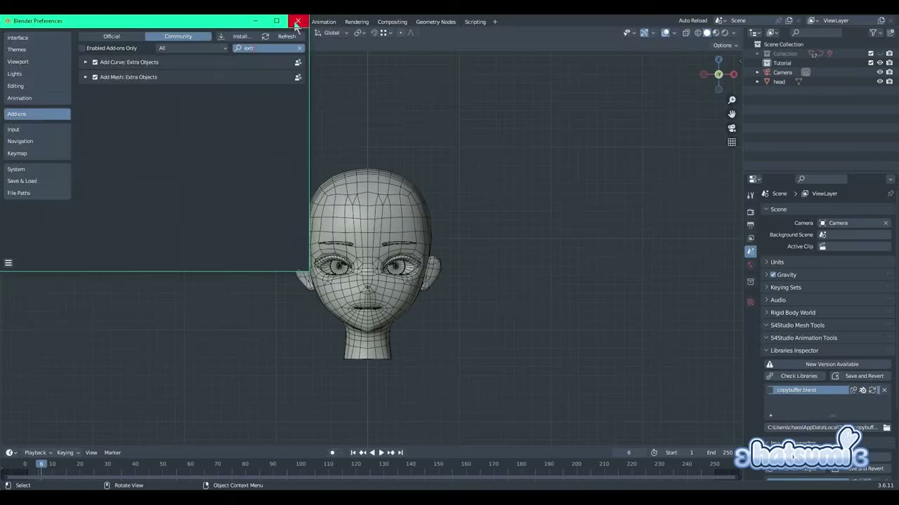
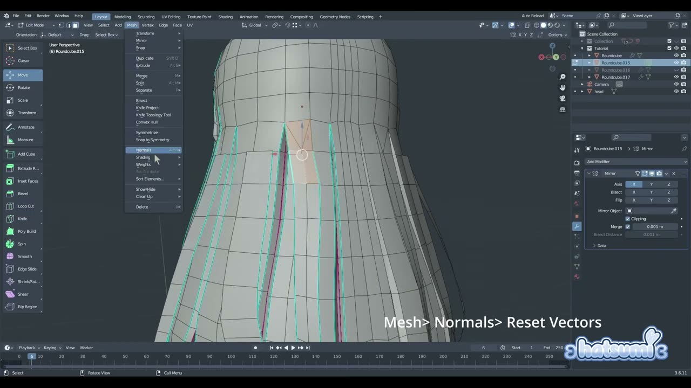
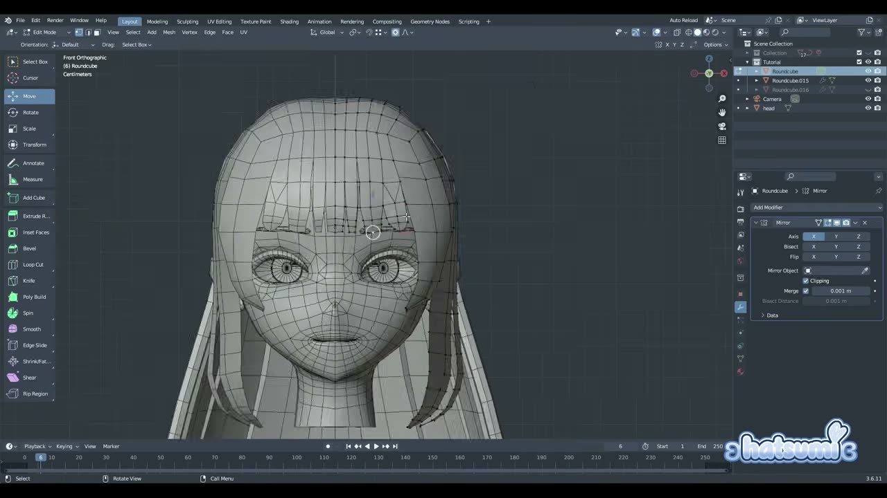
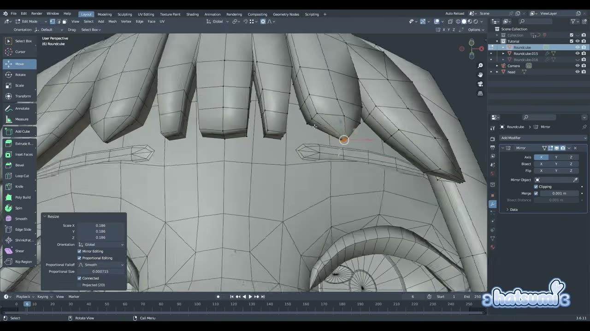

# Blender でアニメ髪を作る: 丸い立方体を裂いて房にするかんたんな方法

3D のキャラクターを作るとき、アニメ調の髪はつまずきやすい部分です。房を 1 本ずつカーブで作る方法もありますが、本数が増えると頭の形に沿わせる調整が大変になりがちです。

YouTube チャンネル Hatsumi で公開された **「How to make EASY Anime Hair in Blender」** は、頭をおおう丸い立方体を裂いて房に分けていく、メッシュ中心の方法を紹介する約 14 分のチュートリアルです。後ろ髪と前髪を作ったあと、ボーナスとして房を重ねて密度を上げるコツも解説されています。

本記事では、英語で解説されている動画の内容を日本語で整理し、手順の流れと、その背景にある判断を紹介します。

---

## 動画概要

| 項目 | 内容 |
|:---|:---|
| **タイトル** | How to make EASY Anime Hair in Blender |
| **チャンネル** | Hatsumi |
| **公開日** | 2026年4月10日 |
| **長さ** | 14:24 |
| **言語** | 英語（ナレーション。一部の操作は画面にテロップ表示） |
| **使用ソフト** | Blender（画面の表示は 3.6.11） |
| **前提のアドオン** | LoopTools、Extra Objects |

---

## 手順の詳報

### 準備: アドオンを有効にする（00:11〜）

作者はこの動画を、初心者にもかなり取り組みやすい内容だと紹介していました。始める前に、Edit メニューの Preferences から Add-ons を開き、Community のタブで LoopTools と Extra Objects を有効にします。画面では、Extra Objects の Add Mesh 版と Add Curve 版の両方にチェックが入っていました。

Extra Objects を入れると、追加メニューに Round Cube（角を丸めた立方体）が現れます。この形状が髪全体の土台になります。

### 土台を頭にかぶせる（00:37〜）

Shift+A の Mesh から Round Cube を追加し、Arc（角の分割数）を 6、Linear を 1 に設定します。0.90 前後まで縮め、頭の形に合わせて整えます。

次に後ろ半分を P キーで分離し、前後 2 つのパーツに分けます。それぞれ底面を削除し、左右の片側も削除します。中央側の頂点を押し出してすき間を埋め、画面では Mirror モディファイアー（軸 X、Clipping オン）で左右対称にしていました。

形を頭に合わせたら、縁の辺を選んで LoopTools の Relax で間隔をならします。そのまま少し下へ押し出し、プロポーショナル編集で丸みをつけます。ここでスムーズシェードに切り替え、ループカットを数本入れておきます。

### 房に裂いて毛先をとがらせる（01:55〜）

髪の房に分けたい面を、房の半分くらいの高さまで選びます。V キーのリップ（Rip）でマウスを横にずらすと、面が裂けて房の切れ目ができます。画面の左のツールバーにも Rip Region が並んでいました。

裂けた房の下側の頂点を少し下へ引くと、とがった V 字の毛先になります。作者はこの動画では簡単な形にとどめ、好みで調整してよいとしていました。毛先にループカットを足し、もう一度 V 字を作ってからリップで裂くと、房の分かれ目がさらに増えます。

### 厚みをつけて毛先を細くする（03:19〜）

Solidify モディファイアーを追加し、厚みを 0.009 前後（好みで変えてよい）にして適用します。厚みの中央にループカットを入れ、毛先を選んで縮めます。こうすると、断面がつぶれた平たい毛先になります。

次に、内側の頂点を Ctrl+クリックでつなげて選び、Smooth Vertices をかけます。外側も同じようにならします。作者は Smooth Vertices をキーに割り当てているため、画面ではメニューを開かずに実行していました。

### 法線を整えて後ろ髪を仕上げる（04:09〜）

全体を選び、Mesh メニューの Normals から Reset Vectors を実行します。作者の説明では、外側の辺がシャープとして扱われ、全体がなめらかに見えるようになるとのことでした。ただし好みの問題なので、気に入らなければ省いてよいと補足されています。

外から見えない内側の面は削除して、少し軽くします。形を好みに整えたら、もう一度 Reset Vectors をかけて後ろ髪は完成です。

### 前髪を作る（05:00〜）

前髪も同じ方法で作ります。片側を削除して中央まで押し出し、Round Cube を頭の形に合わせてから、リップで房に分けます。

作者は、顔の横に長めの房（フリンジ）を足していました。ナイフで縦に切り込み、その先を V 字に切ります。理由は次のように説明されていました。

> ここで辺を分けても、密度を上げすぎずに済むようにするためです。

房の先にループカットを足して形を詰めたら、長い房を下まで押し出します。プロポーショナル編集で回転させて顔の輪郭に沿わせ、ループカットを数本加えます。先端を縮めて三角形にし、すき間を埋めて整えます。

### 前髪の仕上げ（07:38〜）

前髪にも Solidify を追加して適用します。厚みは後ろ髪より薄く、字幕では 0.006 と読み取れます。後ろ髪と同じく中央にループカットを入れ、毛先を縮めて平たくします。

外側と内側の頂点をそれぞれ Ctrl+クリックで選んで Smooth Vertices をかけ、全体に Reset Vectors をかけます。外側に残った鋭い角を取り、中央の不要な面を削除して、もう一度 Reset Vectors をかければ前髪も完成です。

サブディビジョンサーフェスを足したい場合は、毛先の中央と下端の頂点に Shift+E でクリース（Edge Crease）を入れておきます。こうすると、分割後もとがった毛先が丸まりません。ただし動画ではモディファイアーを足さずに進めていました。

### ボーナス: 房を重ねて密度を上げる（10:18〜）

最後に、髪をより細かく見せる方法が 2 つ紹介されます。

1 つ目は、髪の半分ほどを複製して分離し、内側へずらして少し縮める方法です。作者は次のように説明していました。

> 髪の内側にもう 1 層足して、少しボリュームがあるように見せているだけです。

2 つ目は、房の一部の面を複製して好きな位置に動かし、プロポーショナル編集で形を整える方法です。少し縮めて大きさに変化をつけると、単調さが減ります。

足した房を土台とつなぐ手順も示されていました。房の上側の面を削除し、土台側ではその真上の辺を下へ裂いて V 字にし、中央にナイフで切れ目を入れます。そこへ房をつなげ、Reset Vectors をかけます。これを何か所か繰り返すと、房の重なりが増えた髪になります。

---

## 作者紹介

### Hatsumi

YouTube チャンネル Hatsumi で、Blender を使ったアニメ調キャラクターや VTuber モデル制作のチュートリアルを公開しているクリエイターです。本動画の説明文では、以前から約束していた髪のチュートリアルだと述べ、感想や次に見たい内容をコメントで募っています。

2026 年 8 月末からは、VTuber モデルをゼロから作る連載も始まっています。本動画の手順は、その連載で髪を作るときの下地としても読めます。

---

## まとめ

このチュートリアルは、頭にかぶせた Round Cube を裂いて房に分け、厚みと法線を整えてアニメ調の髪にする内容でした。流れを表にまとめます。

| 工程 | 主な操作 | 押さえどころ |
|:---|:---|:---|
| 準備 | LoopTools、Extra Objects の有効化 | Round Cube を追加できるようにする |
| 土台 | Round Cube（Arc 6、Linear 1）、P で前後分離、Mirror | 頭の形に合わせ、縁を Relax |
| 房 | ループカット、V でリップ、V 字の毛先 | 房の半分の高さまで裂く |
| 厚み | Solidify を適用、中央のループカット、毛先を縮小 | 毛先を平たく細くする |
| 仕上げ | Smooth Vertices、Reset Vectors、内側の面を削除 | 法線を整えてから軽くする |
| 密度 | 複製して内側へ、房の追加と接続 | V 字とナイフでつなぐ |

作者は最後に、とても単純な方法だが、複雑な髪を作るときの考え方のヒントになればとまとめていました。長い髪にも同じ考え方を応用できるとしています。まずは短めの髪で 1 回通して、裂き方と Reset Vectors のかかり方を確かめてみるとよいでしょう。

---

## 参考リンク

- [How to make EASY Anime Hair in Blender（YouTube）](https://www.youtube.com/watch?v=swLa_pTLqmk)
