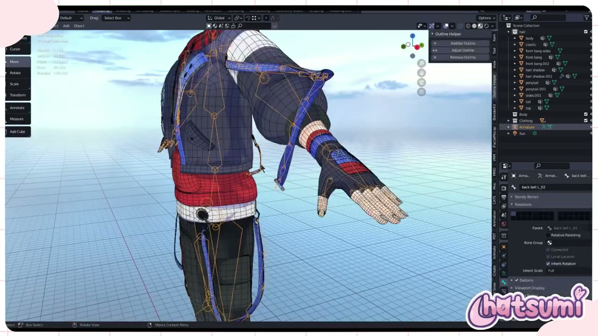
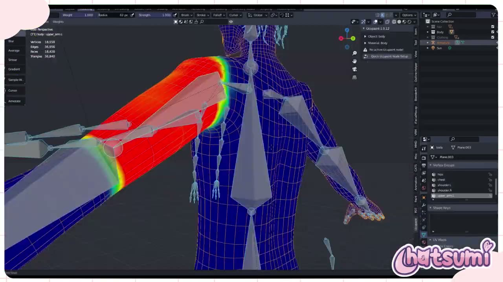
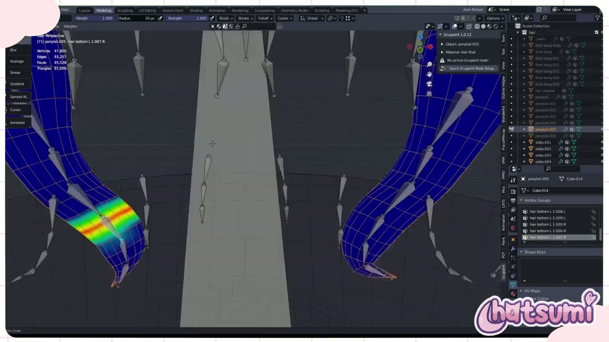
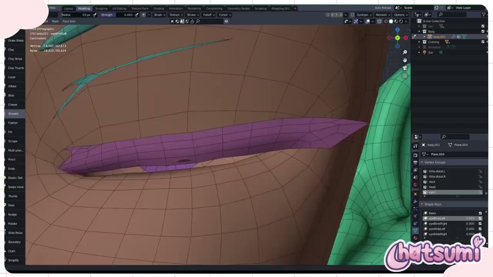
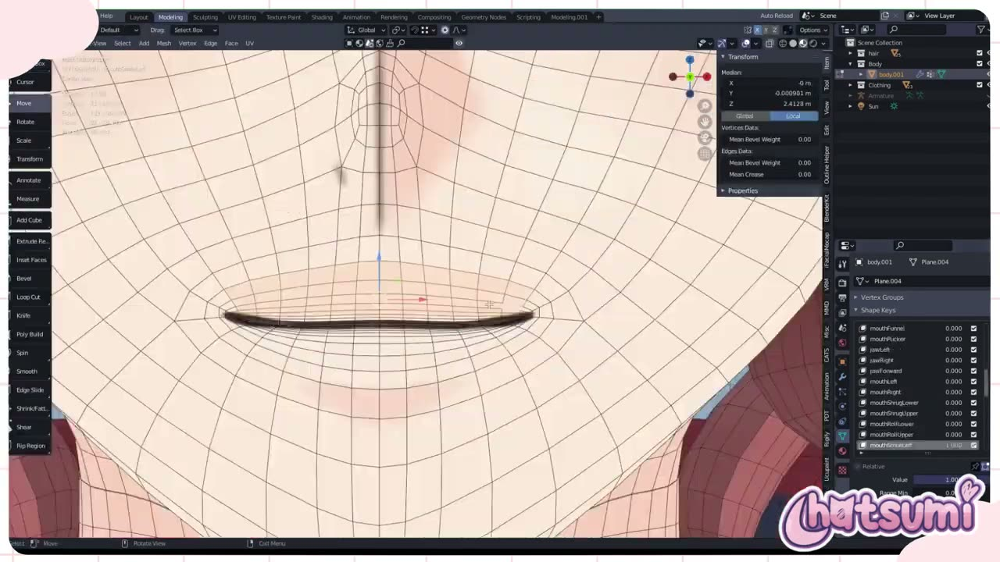

# TimTea の 3D VTuber アバター制作 最終回: 揺れ物ボーン・ウェイト・ARKit 系シェイプキーを画面から読む

VTuber のアバターは、形と色がそろっただけでは配信に使えません。体の動きに合わせてメッシュを曲げるボーンとウェイト、まばたきや口の動きを作るシェイプキー（ブレンドシェイプ）が入って、はじめて「動くアバター」になります。

YouTube チャンネル Hatsumi の **「Making A 3D Vtuber Avatar for TimTea! Final Part UV Rigging/Blendshapes『Blender』」** は、VTuber「TimTea」さんのアバター制作を記録した連載の最終回です。約 25 分の動画で、アーマチュアの調整、ウェイトペイント、表情用のシェイプキー作りまでを扱っています。

前回の Part 5 と同じく、この動画にもナレーションはありません。冒頭の英語テロップのほかは作業画面だけで進むため、本記事では画面の操作パネルやリストに映った名前・値から手順を読み取り、日本語で整理しました。

---

## 動画概要

| 項目 | 内容 |
|:---|:---|
| **タイトル** | Making A 3D Vtuber Avatar for TimTea! Final Part UV Rigging/Blendshapes『Blender』 |
| **チャンネル** | Hatsumi |
| **公開日** | 2024年9月19日 |
| **長さ** | 24:44 |
| **言語** | 英語（冒頭のテロップのみ。ナレーションなし） |
| **使用ソフト** | Blender（アーマチュアのパネルにボーンレイヤーが表示されており、4.0 より前の版と推定。要確認） |
| **画面に映るアドオン** | Ucupaint 1.0.12、Outline Helper、iFacialMocap、VRM、CATS など |

---

## 背景: 連載の締めくくりは「動かす準備」

冒頭のテロップでは、この回の内容が次のように示されていました。

> これがこのシリーズ最後の動画です。リギングとブレンドシェイプを扱います。

タイトルには「UV」の語も入っていますが、画面で UV を編集する場面は確認できませんでした。UV とテクスチャは前回の Part 5 で扱われているため、タイトルの表記は前回からの名残と考えられます（要確認）。

動画のタグには vrchat と vseeface が含まれます。VSeeFace は、VRM 形式のアバターを使う配信向けのトラッキングソフトです。3D ビューポートのサイドバーには VRM や iFacialMocap のタブも見えており、VRM 形式での利用や、iPhone の顔トラッキングとの連携を見据えた作りと読み取れます。

---

## 手順の詳報

### 衣装と髪に揺れ物のボーンを足す（00:01〜）

最初は、アーマチュアの編集モードでボーンを配置する作業です。体の骨格に加えて、衣装や髪の揺れる部分に専用のボーンを足していきます。画面で確認できた名前には、パーカーのひもの string.L_01、腕のベルトの belt arm L_01.003、背中のベルトの back belt L_01 / L_02、アホ毛の cowlick 1、髪の房の hair top L 01.015 などがあります。

どの揺れ物も、根元から先へ連なる数本のボーンで作られていました。ボーンプロパティの Relations（関係）では、back belt L_02 の親が back belt L_01 になっています。名前の末尾の番号と .L / .R で、左右と順番がわかるように付けているのが特徴です。左右対称の名前にしておくと、Blender の対称化やミラーの機能を使いやすくなります。

髪は房ごとに細かくボーンが入り、02:02 頃の画面では、アーマチュア全体のボーン数が 339 と表示されていました。

### 体のウェイトを塗る（02:22〜）

体のメッシュを選んでウェイトペイントに入ります。頂点グループの一覧には hips、chest、shoulder.L、upper_arm.L、hand.L、thumb.proximal.L、foot.L、toes.L などが並んでいました。ボーンと同じ名前の頂点グループに、どれだけそのボーンに従うかを 0 から 1 で塗る仕組みです。

画面のブラシ設定は、Weight 1.000、Strength 1.000、Radius 52〜62 px でした。左のツールバーには Draw のほか、Blur、Average、Smear、Gradient、Sample Weight が並んでいます。上腕、手のひら、指の関節、足先と、ボーン 1 本ずつ境目を見ながら塗り進めていました。

自動ウェイトでたたき台を作ってから直したのか、最初から手で塗ったのかは、画面からは判断できませんでした（要確認）。04:09 頃にはポーズモードに切り替え、アーマチュアの Pose Position を確認する場面があります。

### 髪と衣装のウェイト（07:20〜）

続いて、髪と衣装のオブジェクトに移ります。髪の各オブジェクトには Armature モディファイアーが付いており、Bind To は Vertex Groups がオン、Preserve Volume はオフでした。

髪の頂点グループは、Side face L 1.L、front bang L 1.L、hair bottom L 1.008.L のように、房の場所と段の番号を組み合わせた名前です。房の根元は head に、その先は房のボーンに、というふうに塗り分けています。

房のウェイトは、ボーン 1 本分ずつの帯になるように塗られていました。隣の帯と少しずつ重ねることで、房が折れずになめらかに曲がるようになります。

### 目のシェイプキー（18:22〜）

後半はシェイプキーです。体のメッシュのシェイプキーには、Basis の下に eyeBlinkLeft、eyeBlinkRight、eyeWideLeft、eyeWideRight が並んでいました。

まぶたの形は、スカルプトモードで作り込んでいました。Smooth（Strength 0.493）で表面をならし、Grab（Strength 0.400）でまぶたの縁を引き下げています。シェイプキーを選んだ状態でスカルプトすると、その変形はそのキーだけに記録されます。

20:10 頃には、一時的な Key 56 を作り、片側の頂点だけを選んで Blend from Shape（Shape は Basis、Blend 1.000）を実行する場面がありました。選んだ部分だけを元の形に戻す操作で、両目を動かした形から片目だけのキーを作る目的と考えられます（要確認）。

### 口・ほお・鼻のシェイプキー（20:45〜）

口まわりは、編集モードでプロポーショナル編集を使って動かしていました。jawOpen を作る場面では、Proportional Falloff が Smooth、Proportional Size が 0.218、Connected がオンです。

リストには、brow、mouth、jaw、cheek、eyeSquint、noseSneer、tongueOut など、Apple の ARKit の顔トラッキングで使われる 52 種類のブレンドシェイプと同じ名前が並んでいました。名前をそろえておくと、iPhone の顔トラッキングの値をそのままアバターに当てはめやすくなります。VTuber の界隈では「パーフェクトシンク」と呼ばれる対応です。

24:19 頃のリストでは、ARKit 系の名前の後ろに happy、sad、shock という表情のキーも追加されていました。細かなトラッキング用のキーと、ボタンで切り替える表情のキーを両方用意しておく構成と言えるでしょう。

---

## 作者紹介

### Hatsumi

YouTube チャンネル Hatsumi で、Blender による VTuber モデル制作の過程やチュートリアルを公開しているクリエイターです。説明文では、3D モデルの制作依頼を VGen で受け付けていると案内しています。TimTea さんの連載は依頼制作の記録で、この回が最終回です。

---

## まとめ

最終回は、完成した見た目のアバターを「動かせる状態」にする仕上げの工程でした。流れを表にまとめます。

| 工程 | 画面で確認できた内容 | 押さえどころ |
|:---|:---|:---|
| ボーン | 衣装のひも・ベルト、髪の房に揺れ物のボーンを追加 | 親子と番号、.L / .R がわかる名前にする |
| 体のウェイト | ウェイトペイントでボーンごとに塗る | 関節の境目を 1 本ずつ確認する |
| 髪・衣装のウェイト | Armature モディファイアー、房ごとの帯状のウェイト | 帯を少し重ねて、なめらかに曲げる |
| 目のシェイプキー | eyeBlink などをスカルプトで作る | Blend from Shape で片側だけ戻す |
| 口・顔のシェイプキー | ARKit と同じ名前、happy などの表情キー | 顔トラッキングとの対応を名前でそろえる |

画面を追うと、ボーンやシェイプキーの名前を、後で使うツールに合わせて付けていることがわかります。揺れ物のボーンは親子と番号で、シェイプキーは ARKit の名前で整理されています。書き出しの設定は動画に出てきませんが、名前の付け方から VRM や顔トラッキングでの利用を前提にしていると読み取れるでしょう。

---

## 参考リンク

- [Making A 3D Vtuber Avatar for TimTea! Final Part UV Rigging/Blendshapes『Blender』（YouTube）](https://www.youtube.com/watch?v=AF4N-22qkkU)
- [Making A 3D Vtuber Avatar for TimTea! Part 5 UV Mapping/Texturing『Blender』（YouTube）](https://www.youtube.com/watch?v=fMM4BXnj9xM)
- [Hatsumi の VGen（動画説明文より）](https://vgen.co/hatsumi)
