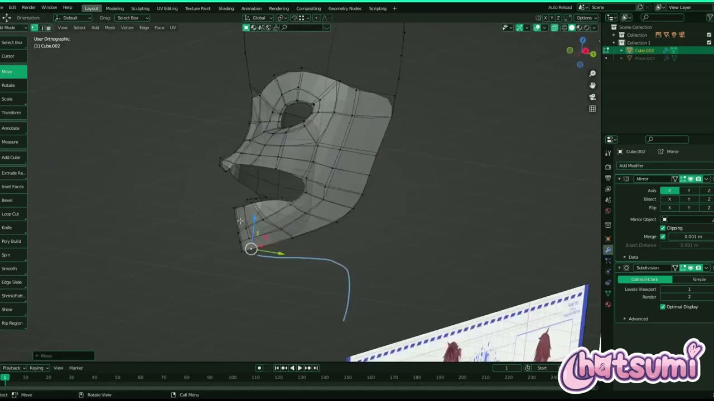
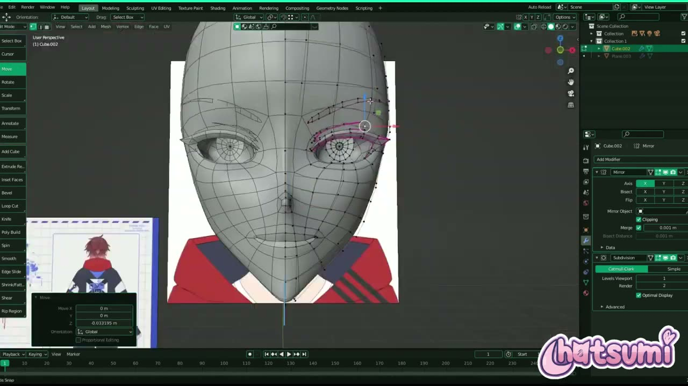
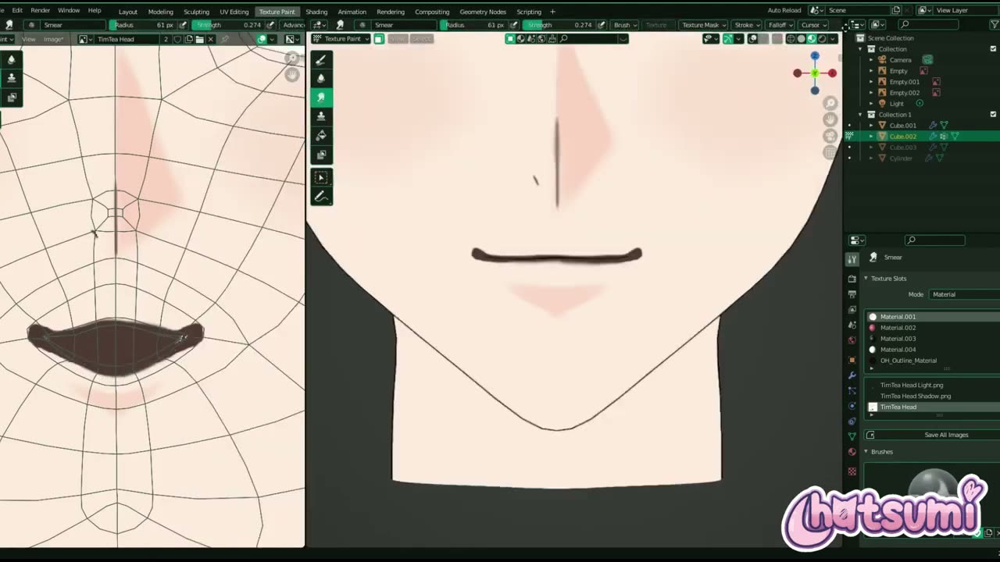
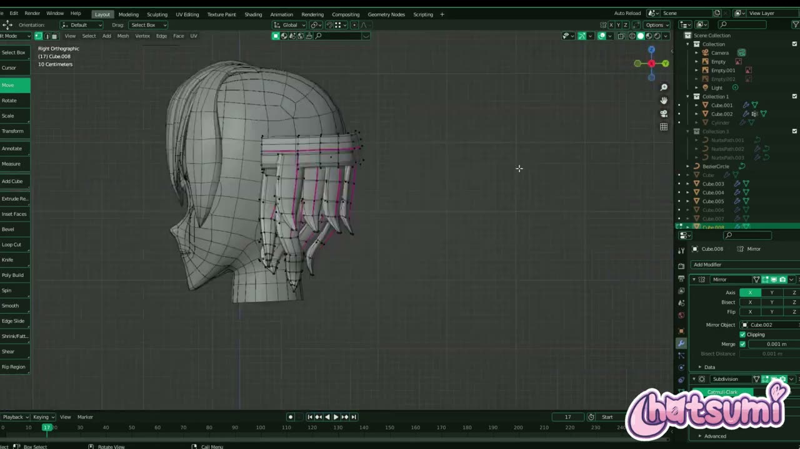
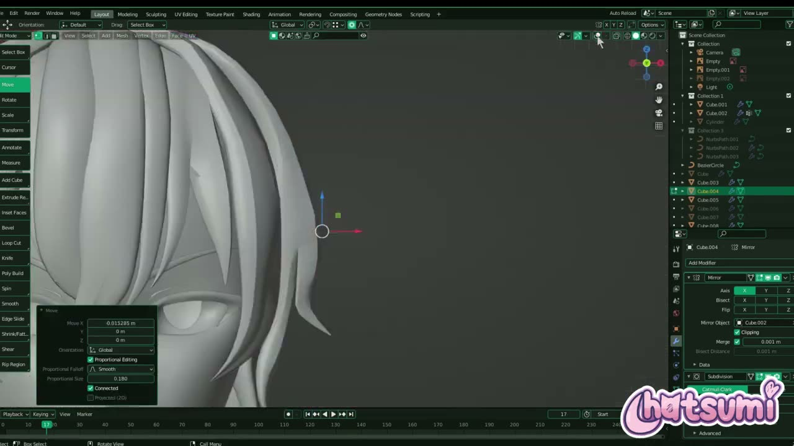

# Blender で作る依頼制作の VTuber モデル P1: 目の周りから顔を張り、髪を束で重ねる

YouTube チャンネル Hatsumi で公開された **「Making A 3D Vtuber Avatar for TimTea! Part ~1 Head and Hair『Blender』」** は、VTuber の TimTea 氏から依頼を受けた 3D モデルの制作過程を記録した連載の第 1 回です。約 26 分で、頭のモデリング、顔のテクスチャ、髪のモデリングまでを扱っています。

この動画にはナレーションがなく、BGM に乗せて作業が早回しで流れる形式です。そのため本記事では、画面に映るツール名、モディファイアーの設定、操作後のパネルの値を読み取り、手順の流れを日本語で整理しました。数値は画面で確認できたものだけを載せています。

---

## 動画概要

| 項目 | 内容 |
|:---|:---|
| **タイトル** | Making A 3D Vtuber Avatar for TimTea! Part ~1 Head and Hair『Blender』 |
| **チャンネル** | Hatsumi |
| **公開日** | 2023年7月23日 |
| **長さ** | 26:20 |
| **形式** | ナレーションなしの制作記録（BGM と一部テロップ） |
| **使用ソフト** | Blender（この回の画面ではバージョン表示を確認できず。第 2 回の画面は 2.93.18） |

---

## 背景: 依頼制作の記録として作られた連載

動画の説明文では、依頼者から制作過程の記録を頼まれたことが収録のきっかけだと説明されています。

> TimTea さんの 3D モデルを作る過程を記録してほしいと頼まれました。この動画では頭と髪の基本的なモデリングと、顔のテクスチャを扱います。

冒頭では完成したモデルが一瞬映り、00:30 には「W1 Day 1: Head Modeling and Texturing」という画面タイトルが出ます。初日の作業をまとめた回だと読み取れます。

---

## 手順の詳報

### 参照画像を 2 枚置き、ミラーとサブディビジョンを最初から付ける（00:30〜）

作業の最初から、顔のアップのイラストを正面に、全身の三面図を横に、それぞれ板状の参照画像として置いています。編集中のメッシュには、はじめから 2 つのモディファイアーが付いていました。

- Mirror: 軸 X、Clipping オン、Merge 0.001 m
- Subdivision Surface: Catmull-Clark、Levels Viewport 1、Render 2

左右対称とサブディビジョン後の見た目を確かめながら、少ない頂点で形を詰めていく進め方です。

### 目の周りから面を広げる（01:07〜）

最初に作るのは顔全体ではなく、目のまわりの輪でした。目の穴を囲む面を張り、そこから頬、額、口のまわりへと面を広げていきます。01:51 の時点で、目と口に穴のあいた仮面のような形になっていました。

正面ビューに切り替えると、参照イラストの目の線に辺のループを沿わせていることがわかります。イラストの顔はあごが細くとがっていて、メッシュもその輪郭に合わせていました（04:12）。

### 頭を閉じ、目・まつ毛・眉を作る（03:19〜）

顔の面を後頭部まで伸ばして頭を閉じたあと、目のまわりを作り込みます。まつ毛と二重の線は細い帯状の面で作り、眼球は中心から放射状に辺が伸びる円形のトポロジーになっていました（05:44）。眉も同じく細い帯の形です。

07:21 にはスカルプトモードに入り、Grab ブラシ（Radius 102 px、Strength 0.400）で頭の丸みを参照の輪郭に寄せていました。細かい頂点を 1 つずつ動かすより、全体のシルエットを一度に整えるための使い分けと考えられます。

### 顔のテクスチャを描く（09:03〜）

09:03 からは Texture Paint ワークスペースに移ります。画面の左に UV、右に 3D ビューを並べ、3D ビュー上で直接描いていく構成です。途中で別の .blend ファイルからデータを Append する場面もありました。

画像は「TimTea Head」「TimTea Head Light.png」「TimTea Head Shadow.png」の 3 枚が用意されていました。明るい部分と影を別の画像に分けておく構成です。ブラシは Smear（Radius 62 px、Strength 0.274）で色をなじませ、眉、まぶたの線、頬の赤みを描いています。12:22 には編集モードで、目と口の穴の縁に赤い辺が見えました。UV を切り開くためのシーム（切れ目）と思われます。

### 髪を束ごとのメッシュで重ねる（14:12〜）

髪は、束ごとに別のメッシュオブジェクトとして作っていました。アウトライナーには Cube.003 から Cube.010 までが並び、どれも頭とは別オブジェクトです。

髪の Mirror モディファイアーでは、Mirror Object に頭のオブジェクトが指定されていました。髪のオブジェクト自体の原点がずれていても、頭の中心を基準に左右対称にできる設定です。束は Y 方向だけ 0.435 や 0.700 に縮めて薄くし、前髪を何層にも重ねていました。

前髪の毛先を動かすときは、プロポーショナル編集（Smooth、Size 0.424、Connected オン）を使っていました。Connected をオンにすると、つながった頂点だけに影響が及ぶため、隣の束を巻き込まずに済みます。

後ろ髪は、帯状の土台から下向きに束を並べる形で作られていました（19:03）。

### スカルプトで束の流れを整える（20:15〜）

髪がそろってきたら、再びスカルプトの Grab ブラシ（Radius 129 px、Strength 0.400）で、束の流れを参照の髪のシルエットに合わせていきます。22:13 のソリッド表示では、束の重なりと毛先のとがりがはっきりわかる状態になっていました。

最後に頭頂のアホ毛を別の束として足し、影響範囲を大きくしたプロポーショナル編集（Size 1.464）で角度をつけていました（23:57）。

---

## EP1（素体ベース）との違いとつながり

同じ作者の「Blender Vtuber Modeling Series: EP 1 EASY Body Base Tutorial」は、体を立方体から作るナレーション付きの解説動画でした。本動画とは次の点が異なります。

| 観点 | EP1（素体ベース） | TimTea P1（頭と髪） |
|:---|:---|:---|
| 形式 | 手順を話す解説動画 | ナレーションなしの制作記録 |
| 出発点 | 立方体にサブディビジョンを適用 | 目のまわりの輪から面を張る |
| サブディビジョン | 途中で適用して頂点を増やす | モディファイアーのまま最後まで残す |
| 対象 | 体（素体） | 頭、顔テクスチャ、髪 |

EP1 の最後では、次回に頭を扱うと予告されていました。依頼制作のこの動画は、その頭の作り方を先取りして見られる資料とも言えます。第 2 回では、この頭の首から体を伸ばしていく流れにつながります。

---

## 作者紹介

### Hatsumi

YouTube チャンネル Hatsumi で、Blender による VTuber モデル制作の動画を公開しているクリエイターです。本動画の説明文では、依頼（コミッション）の案内や作品を X（旧 Twitter）で紹介していると書かれています。動画のタグには VRChat や VSeeFace（VTuber 向けのトラッキングソフト）が並び、配信で使うアバターを前提にした制作だと読み取れます。

---

## まとめ

| 工程 | 主な操作 | 押さえどころ |
|:---|:---|:---|
| 準備 | 参照画像 2 枚、Mirror と Subdivision Surface | モディファイアーは最初から付けておく |
| 顔 | 目の輪から面を広げる | 参照の目とあごの線に辺を沿わせる |
| 目まわり | 帯状のまつ毛と眉、放射状の眼球 | 線の表現は細い面で作る |
| 輪郭 | スカルプトの Grab | シルエットは広い範囲で動かす |
| テクスチャ | Texture Paint、Smear、明暗の画像を分ける | シームは目と口の縁に置く |
| 髪 | 束ごとのオブジェクト、Mirror Object に頭 | Connected のプロポーショナル編集で束を個別に動かす |

言葉による解説はありませんが、画面の設定を追うだけでも、少ない頂点とモディファイアーで形を詰める進め方がよく伝わってきます。参照イラストの線に辺を沿わせるという考え方は、アニメ調の顔を作るときに試しやすいでしょう。

---

## 参考リンク

- [Making A 3D Vtuber Avatar for TimTea! Part ~1 Head and Hair『Blender』（YouTube）](https://www.youtube.com/watch?v=tCU6VFnH5Jo)
- [Blender Vtuber Modeling Series: EP 1 EASY Body Base Tutorial（YouTube）](https://www.youtube.com/watch?v=H9uRpY2mV0A)
