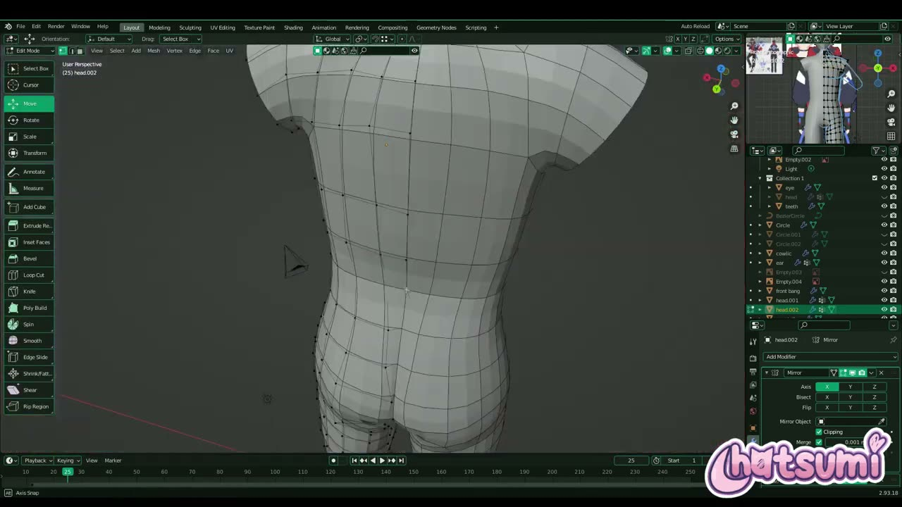
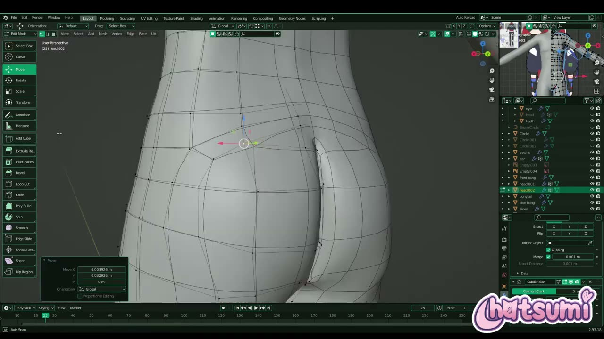
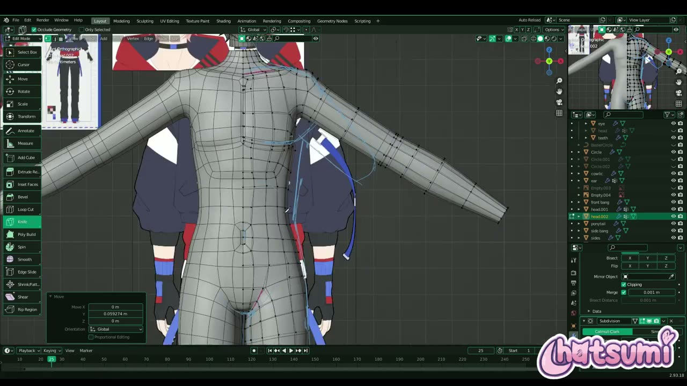
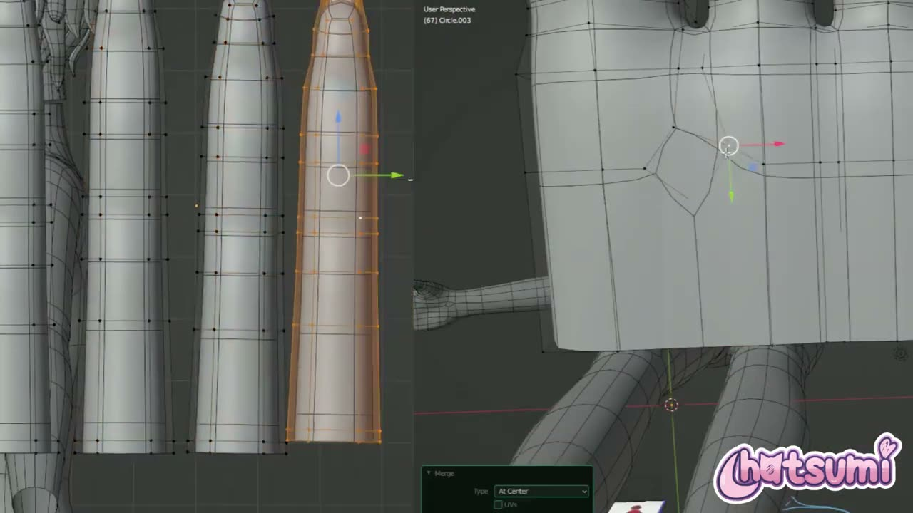

# Blender で作る依頼制作の VTuber モデル P2: 頭の首から体を伸ばし、指を 1 本ずつ作る

YouTube チャンネル Hatsumi で公開された **「Making A 3D Vtuber Avatar for TimTea! Part ~2 Body『Blender』」** は、VTuber の TimTea 氏から依頼された 3D モデルの制作記録の第 2 回です。約 22 分で、胴体から腕、脚、手までの体を作っています。

第 1 回と同じくナレーションはなく、BGM に乗せて作業が早回しで流れます。本記事では、画面に映るツール名やモディファイアーの設定、オペレーターパネルの値、途中のテロップを読み取り、手順の流れを日本語で整理しました。数値は画面で確認できたものだけを載せています。

---

## 動画概要

| 項目 | 内容 |
|:---|:---|
| **タイトル** | Making A 3D Vtuber Avatar for TimTea! Part ~2 Body『Blender』 |
| **チャンネル** | Hatsumi |
| **公開日** | 2023年7月28日 |
| **長さ** | 22:02 |
| **形式** | ナレーションなしの制作記録（BGM と一部テロップ） |
| **使用ソフト** | Blender（画面右下の表示は 2.93.18） |

---

## 背景: 男性キャラクターの体に挑む回

説明文には、作者自身のこの回への感想が率直に書かれています。

> 完璧にしたかったので、何度も取り消しと修正を繰り返しました。男性キャラクターのトポロジーにはあまり慣れていませんが、うまくできたと思います。

同じ作者の素体チュートリアル（EP1）は、胸のふくらみを出す女性らしい体型でした。この回は、胸板や肩幅など男性らしい体つきを、参照イラストに合わせて探りながら作る過程として見ることができます。

---

## 手順の詳報

### 頭の首から胴体を伸ばす（01:07〜）

最初のフレームでは、すでに第 1 回で作った頭のオブジェクト（head.002）を編集モードで開き、首の下に円筒状の胴体が伸びていました。体を別のオブジェクトとして作るのではなく、頭と同じメッシュのまま首から続けて作る進め方です。

参照は、キャラクターの顔と全身のイラスト、衣装の設定画をまとめた三面図の 3 種類です。画面の右上には全身を映す小さな 3D ビューが別に開いてあり、細部を作りながら全体のバランスを確かめられる配置になっていました。

モディファイアーは Mirror（軸 X、Clipping オン、Merge 0.001 m）です。02:43 には Loop Cut（Number of Cuts 1、Correct UVs オン）で胴に辺を足し、04:12 には Y 方向に 1.204 倍して、側面の参照に合わせて体の厚みを増やしていました。

### 背中とお尻の形を出す（04:35〜）

04:35 には、肩から背中、お尻までの形ができています。肩の先はまだ短く切れた状態で、腕はこのあと付け足します。

05:17 には胴の辺を Bevel（Edges、Segments 1、Loop Slide オン）で 2 本に分けて密度を上げ、06:27 の右面ビューでは、肩の横に腕を付けるための丸い穴があいていました。

### ナイフで胸と肩の流れを作る（07:36〜）

胸と肩のトポロジーは、Knife Topology Tool で辺を引き直して作っていました。ツールの設定は Occlude Geometry がオンで、手前の面だけを切る状態です。

08:03 にはスカルプトモードの Grab ブラシ（Radius 127 px、Strength 0.400）で胸板のふくらみを整えています。11:22 の正面ビューでは、胸の下の線と腹筋の区切りが辺の流れとして表れていました。

12:29 には、作業中の考えが画面のテロップで表示されます。

> トポロジーをどんな形にしたいか、いろいろ試しているところです。

完成形の辺の流れを最初から決めているのではなく、切っては戻しながら探っている様子が伝わる場面です。説明文の「何度も取り消した」という言葉とも重なります。

### 腕と脚を伸ばす（09:13〜）

脚はひざの位置で、Knife で辺を足して関節の形を作っていました（09:13）。13:08 には腕が肩から伸びた状態になり、腕の頂点を選んで Scale 0.963 で縮め、太さを微調整しています。

お尻と太ももの境目は、何度か頂点を動かして作り直されていました。14:29 の画面では、お尻の丸みに沿って辺が回り込み、太ももへ流れる構成になっています。

13:52 と 17:42 にはスカルプトの Grab（Radius 90 px、59 px）に切り替え、腰と脚の輪郭を参照に寄せていました。途中からは Mirror の下に Subdivision Surface も追加されています。

### 手を指から組み立てる（18:18〜）

18:18 以降は画面が左右 2 分割の早回しになり、手を作る工程が流れます。手は体とは別のオブジェクト（Circle.003）で、指を 1 本ずつ円柱から作り、あとで手のひらとつなぐ方法でした。

指の先は丸めたカプセル状で、Scale 0.925 で長さや太さをそろえています。18:46 には指の根元の頂点を Merge（At Center）でまとめる操作が見えました。

20:09 には手のひらから親指が伸び、21:13 には指と手のひらの間の穴を Grid Fill（Span 3、Offset 0）で埋めていました。Grid Fill は、向かい合う辺のループの間を格子状の四角面で埋める機能です。

---

## EP1（素体ベース）との違いとつながり

| 観点 | EP1（素体ベース） | TimTea P2（体） |
|:---|:---|:---|
| 形式 | 手順を話す解説動画 | ナレーションなしの制作記録 |
| 出発点 | 立方体から胴体を作る | 頭のメッシュの首から伸ばす |
| 体型 | 女性の体型（レオタードの形を意識） | 男性の体型（胸板と肩幅） |
| 辺の足し方 | 押し出し、ループカット、ベベル | Knife Topology Tool で引き直す場面が多い |
| 手 | 次回の予告のみ | 別オブジェクトで指から組み立てる |

EP1 で扱った「関節に辺を多めに入れる」「プロポーショナル編集で脚をなだらかに動かす」といった考え方は、この回でもひざや腰の作り方に表れています。一方で、首から体を伸ばす進め方は、頭と体を 1 つのメッシュとして扱いたい場合の手本になります。

---

## 作者紹介

### Hatsumi

YouTube チャンネル Hatsumi で、Blender による VTuber モデル制作の動画を公開しているクリエイターです。本動画の説明文では、依頼（コミッション）の案内を X（旧 Twitter）で、3D モデルの申し込みを自身のサイトで受け付けていると書かれています。

---

## まとめ

| 工程 | 主な操作 | 押さえどころ |
|:---|:---|:---|
| 胴体 | 首から押し出し、Loop Cut、Y 方向の拡大 | 頭と同じメッシュで続けて作る |
| 背中・腰 | Bevel で辺を増やす、スカルプトの Grab | 側面の参照で厚みを合わせる |
| 胸・肩 | Knife Topology Tool（Occlude Geometry） | 辺の流れは試しながら決める |
| 腕・脚 | 押し出し、ひざに辺を足す | お尻から太ももへ辺を回り込ませる |
| 手 | 円柱の指、Merge、Grid Fill | 指を先に作ってから手のひらとつなぐ |

言葉での解説はありませんが、テロップと説明文からは、男性の体つきに合う辺の流れを何度も試した跡が読み取れます。体のトポロジーは正解が 1 つではないため、参照に合わせて切っては戻す作業そのものを、手順の一部として受け止めておくとよいでしょう。

---

## 参考リンク

- [Making A 3D Vtuber Avatar for TimTea! Part ~2 Body『Blender』（YouTube）](https://www.youtube.com/watch?v=EZ40p2Ia8-0)
- [Making A 3D Vtuber Avatar for TimTea! Part ~1 Head and Hair『Blender』（YouTube）](https://www.youtube.com/watch?v=tCU6VFnH5Jo)
- [Blender Vtuber Modeling Series: EP 1 EASY Body Base Tutorial（YouTube）](https://www.youtube.com/watch?v=H9uRpY2mV0A)
