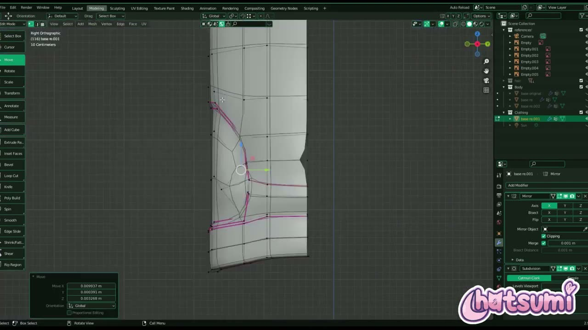
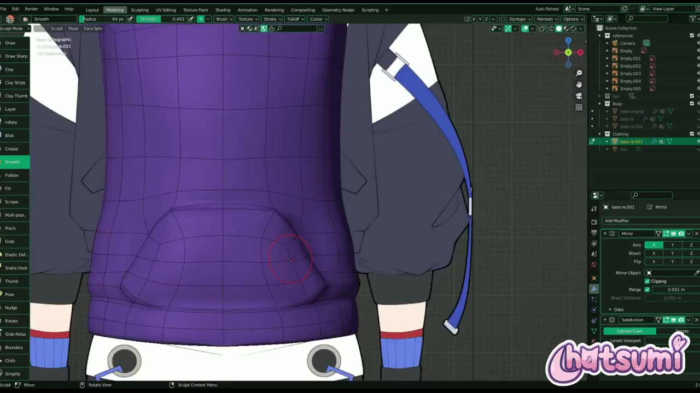
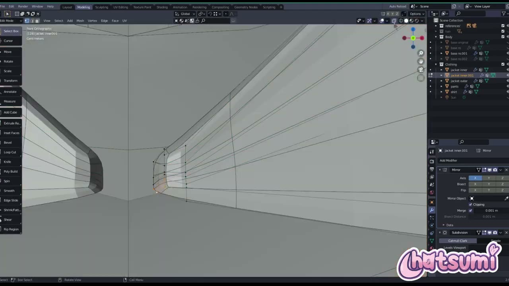
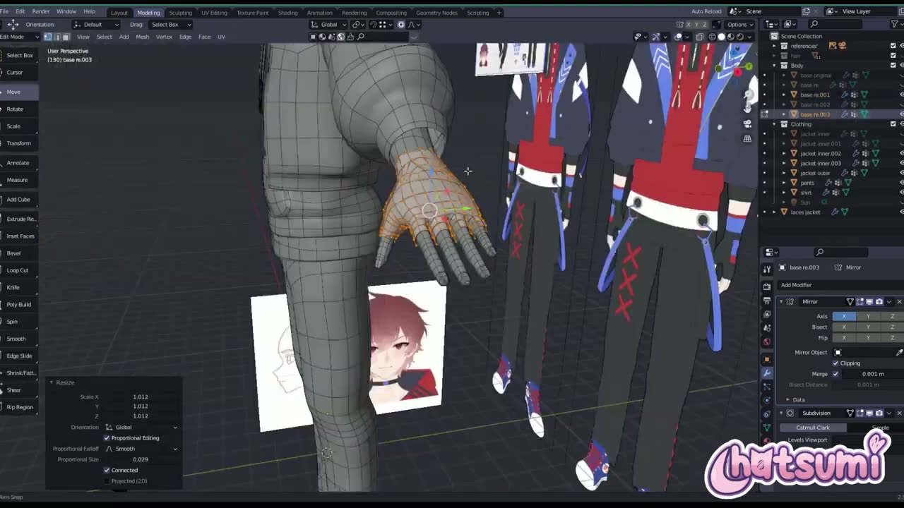
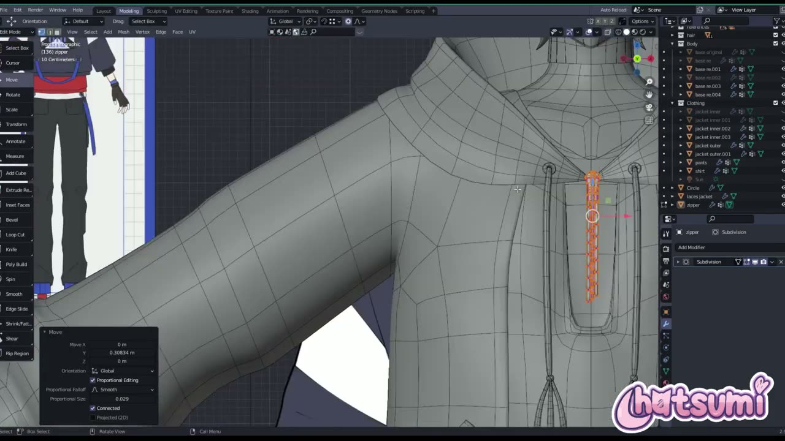

# Blender で VTuber の服を作る: 素体を複製してパーカーとジャケットに仕立てる

3D の VTuber モデルで、素体の次に手間がかかりやすいのが服です。服を一から箱で組むのか、体のメッシュを流用するのかで、作業量も仕上がりも大きく変わります。

YouTube チャンネル Hatsumi の **「Making A 3D Vtuber Avatar for TimTea! Part ~3/ Clothing『Blender』」** は、依頼を受けて制作した VTuber モデルの服づくりを記録した約 29 分の動画です。ナレーションはなく、BGM と作業画面だけで進みます。そのため本記事では、画面に映った操作パネルやオブジェクト名から、どのような手順で服を作っているかを読み取って整理します。

---

## 動画概要

| 項目 | 内容 |
|:---|:---|
| **タイトル** | Making A 3D Vtuber Avatar for TimTea! Part ~3/ Clothing『Blender』 |
| **チャンネル** | Hatsumi |
| **公開日** | 2023年8月10日 |
| **長さ** | 28:59 |
| **言語** | 英語（ナレーションなし。BGM のみ） |
| **使用ソフト** | Blender（バージョンは画面から読み取れず） |

---

## 背景: 依頼作品の制作記録

動画の説明文によると、これは TimTea さんから依頼された 3D モデルの制作過程を記録したシリーズです。服の制作には合計で約 10 時間かかったため、動画を 2 本に分けると書かれていました。

同じチャンネルの EP1（素体の作り方）が解説付きのチュートリアルだったのに対し、この回は早回しの作業記録です。操作の理由は語られませんが、モディファイアーの設定値やアウトライナーのオブジェクト名がはっきり映っているので、作業の組み立ては十分に追えます。

キャラクターの衣装は、赤いパーカーの上に濃紺のジャケットを重ね、指先の出る手袋と黒いパンツを合わせた構成です。画面の横には正面・背面の設定画が常に置かれていました。

---

## 手順の詳報

### 素体を複製して服の土台にする（00:46〜）

作業は、素体を複製するところから始まります。アウトライナーの Body コレクションには base original、base re、base re.001 と、素体の複製が並んでいました。このうち base re.001 が、しばらくすると Clothing コレクションへ移されています。

複製したメッシュには、素体と同じく Mirror モディファイアー（軸 X、Clipping と Merge がオン、Merge 0.001 m）と、Subdivision Surface（Catmull-Clark、ビューポート 1、レンダー 2）が付いたままです。体と同じトポロジーから始めるので、肩や脇の辺の流れがそのまま服に引き継がれます。

最初は首まわりの辺ループを選び、襟ぐりの形に合わせて頂点を動かしていました。02:28 頃には右面の正投影に切り替え、服のすそや裏側の頂点を細かく移動しています。操作パネルの移動量は数ミリ単位で、体からわずかに浮かせる程度の調整と読み取れます。

### スカルプトでポケットとシワを入れる（03:20〜）

パーカーの胴体ができると、スカルプトモードに入ります。カンガルーポケットの縁を Smooth ブラシでなじませる場面では、Radius 64 px、Strength 0.493 が表示されていました。

ジャケットも同じように、別の素体の複製（base re.003）から作られています。袖はふくらみを持たせた形で、Grab ブラシ（Strength 0.400、Radius 95〜98 px）で大きく形を引き出していました。06:03 頃には袖の一部に明るい色のマテリアルが割り当てられ、設定画の切り替えしに合わせてパーツの境目を色で確認しています。

07:02 頃には、オブジェクト名が jacket inner、jacket outer、shirt に整理されていました。内側と外側でオブジェクトを分けておくと、重なる部分だけを個別に調整しやすくなります。

### パンツを作る（08:00〜）

パンツも素体の脚から作られます。09:14 頃の pants オブジェクトは、へその下あたりにウエストの縁があり、Mirror と Subdivision の構成は上着と同じでした。

11:29 頃には、パンツのすそ付近で Clay ブラシ（Radius 142 px、Strength 0.500）が選ばれていました。画面のパンツは脚に沿った素体の形ではなく、少しゆとりのあるストレートなシルエットになっています。スカルプトで布のゆとりを足していく流れと読み取れます。

### フードと袖口の厚み（12:42〜）

12:42 以降は jacket inner.001 という新しいオブジェクトで、フードまわりの大きな形を作っていました。13:27 頃の袖口の拡大では、布の端が内側へ折り返されています。

Solidify モディファイアーのような一括の厚み付けは、画面のモディファイアー一覧には見当たりませんでした。見える端だけを折り返して厚みがあるように見せる作り方と考えられます（要確認）。フードは jacket inner.002 として複製され、Grab ブラシ（Radius 179 px）で頭に沿うように整えられていました。

### ひもと細部のパーツ（16:12〜）

パーカーのひもは laces jacket という別オブジェクトです。首元から左右に 2 本垂れる形で、先端には結び目のようなふくらみが作られていました。このオブジェクトでは Subdivision Surface が Mirror より上に置かれ、Clipping はオフです。中央でつながらない独立した部品なので、Clipping を切っていると読み取れます。

17:42 頃には jacket inner.003 で Dissolve Edges（Dissolve Vertices オン）を使い、不要な辺を減らしていました。

### 手袋を手から作る（18:26〜）

手袋は、服と同じ考え方で手のメッシュを複製して作られています。base re.003 の手の部分を選び、プロポーショナル編集（Smooth、Proportional Size 0.029、Connected オン）を付けたまま 1.012 倍に拡大していました。ほんの少し膨らませるだけで、手の表面から浮いた手袋の層ができます。

19:14 頃には手の甲側の辺を選び直し、指先の出るデザインに合わせて開口部を整えていました。手首まわりは base re.004 という別の複製で、前腕の辺ループを動かして作っています。

### ファスナーとパネルライン（20:46〜）

20:46 頃には zipper というオブジェクトで、パーカー胸元のファスナーの歯を並べていました。ファスナーは Subdivision Surface のみで、Mirror は付いていません。中央に 1 本だけある部品なので、左右対称にする必要がないためと考えられます。

21:35 頃には Knife ツールでジャケット表面に切り込みを入れ、ヘッダーには Occlude Geometry と Only Selected の設定が見えていました。設定画にある色の切り替えしの位置に辺を足しておく作業と読み取れます。

### 仕上げの細部（22:32〜）

後半は細かい部品が続きます。首元のパーツ（base re.005）を Grab で整え、shirt のすそを押し出し（Extrude Region and Move）で伸ばしていました。27:28 頃には袖に沿って細い帯状のパーツを押し出しており、設定画にある袖のラインを立体で入れていると考えられます。最後はパンツのベルトループと、そこから下がるストラップを作って動画が終わります。

---

## 作者紹介

### Hatsumi

YouTube チャンネル Hatsumi で、VTuber 向け 3D モデルの制作過程やチュートリアルを公開しているクリエイターです。説明文では、X（旧 Twitter）でコミッション情報と作品を紹介していると案内していました。動画のタグには VRChat や VSeeFace が並び、配信やメタバースで使うモデルを主に手がけていると読み取れます。

---

## まとめ

この回は、素体の複製を出発点に、パーツごとにオブジェクトを分けて服を作る流れでした。

| 工程 | 主な操作 | 押さえどころ |
|:---|:---|:---|
| 土台 | 素体を複製、Clothing コレクションへ移動 | 体のトポロジーを引き継ぐ |
| 形出し | Grab・Smooth・Clay ブラシ | ポケットや袖のふくらみはスカルプトで |
| 厚み | 端の折り返し | 見える端だけに厚みを持たせる（要確認） |
| 手袋 | 手を選んで 1.012 倍、プロポーショナル編集 | わずかに膨らませて層を作る |
| 細部 | ひも・ファスナー・ベルトを別オブジェクトに | 中央の部品は Mirror を外す |

ナレーションがない分、画面の数値とオブジェクトの分け方が大きな手がかりになりました。服を内側と外側、部品ごとに分けて名前を付けておくと、あとの調整や貫通の修正がしやすくなると考えられます。自分のモデルに当てはめるときは、まず素体を複製して 1 着作ってみるところから始めるとよいでしょう。

---

## 参考リンク

- [Making A 3D Vtuber Avatar for TimTea! Part ~3/ Clothing『Blender』（YouTube）](https://www.youtube.com/watch?v=_TMy8mK_4FA)
