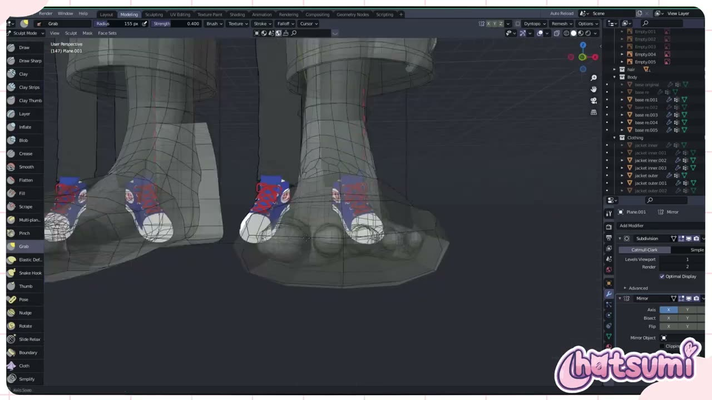
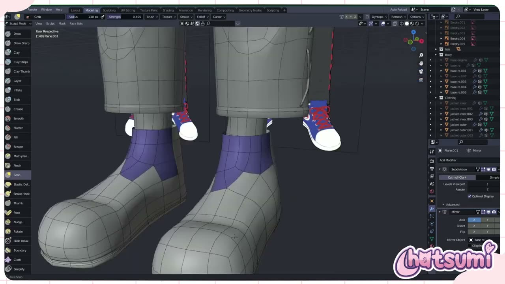
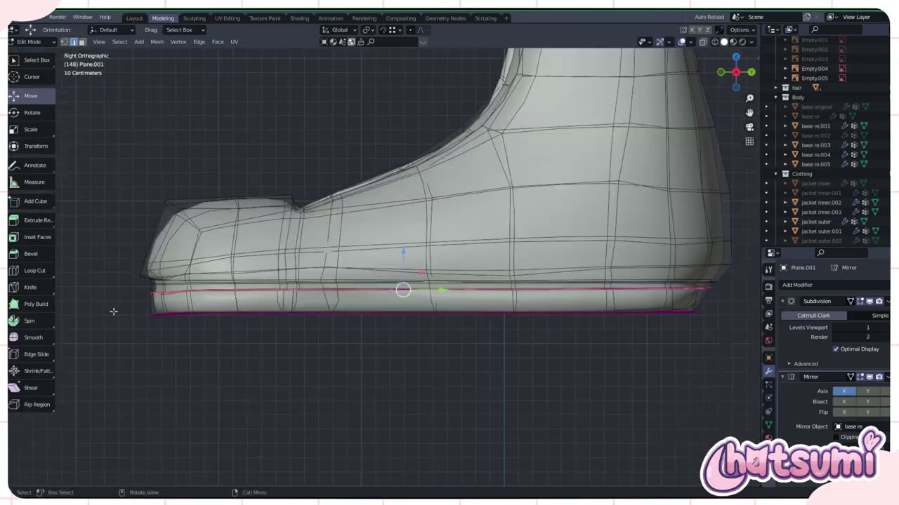
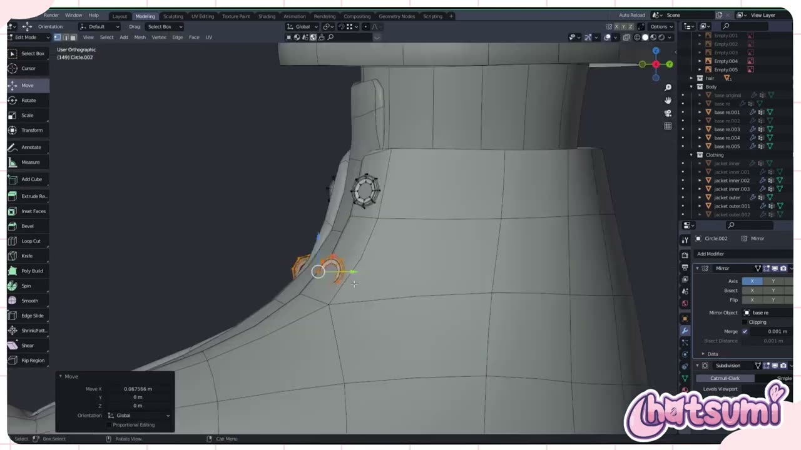
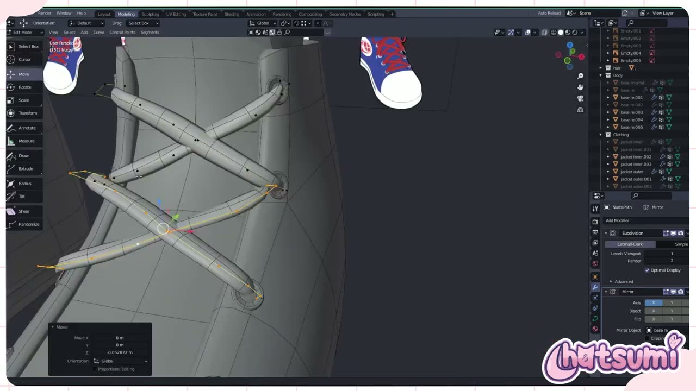

# Blender で VTuber の靴を作る: 平面のケージからハイカットスニーカーへ

VTuber モデルの靴は、画面の中では小さく映りがちです。それでも全身が映る配信や VR では意外と目に入り、つま先の丸みやひもの立体感で印象が変わります。

YouTube チャンネル Hatsumi の **「Making A 3D Vtuber Avatar for TimTea! Part 4 Shoes『Blender』」** は、依頼作品の VTuber モデルの靴づくりを記録した約 23 分の動画です。前回の服の回と同じく、ナレーションはなく BGM と作業画面だけで進みます。本記事では、画面に映った設定値やオブジェクト名から、靴の作り方を整理します。

---

## 動画概要

| 項目 | 内容 |
|:---|:---|
| **タイトル** | Making A 3D Vtuber Avatar for TimTea! Part 4 Shoes『Blender』 |
| **チャンネル** | Hatsumi |
| **公開日** | 2023年9月1日 |
| **長さ** | 23:24 |
| **言語** | 英語（ナレーションなし。BGM のみ） |
| **使用ソフト** | Blender（バージョンは画面から読み取れず） |

---

## 背景: 服の回に続く制作記録

動画の説明文には、このキャラクターの靴を作る回だと書かれています。設定画の靴は、白いつま先とソールに、青いアッパーと赤いひもを合わせたハイカットのスニーカーです。

ただし、靴の作業は前半の約 11 分で、11:43 頃からはパンツの装飾、14:34 以降はジャケットの細部に移ります。14:34 には「Week 2 Day 6- Jacket Details」というテロップが出ており、制作日ごとに区切って記録していることがわかります。本記事では、靴の工程を中心に、後半の服の工程も短く紹介します。

---

## 手順の詳報

### 平面から粗いケージを作る（00:15〜）

靴は、素体の足を複製するのではなく、Plane.001 という平面オブジェクトから作られていました。服の回では体を複製していたので、ここは作り方が分かれる点です。

正面の正投影で、設定画の靴の輪郭に合わせて頂点を置き、押し出しで足をすっぽり囲む箱状のケージを作ります。00:35 頃のワイヤーフレームでは、ケージの中に足のメッシュが透けて見えていました。

モディファイアーは Subdivision Surface（Catmull-Clark、ビューポート 1、レンダー 2）が上、Mirror が下の順です。Mirror の Mirror Object には、01:39 頃から素体の base re が指定されていました。平面の原点が体の中心にない場合でも、素体の原点を基準に左右の靴を映せる設定です。

### スカルプトで靴の形を出す（01:01〜）

ケージができたら、スカルプトモードの Grab ブラシ（Strength 0.400、Radius 155 px 前後）で、つま先や甲のふくらみを引き出していきます。足がメッシュ越しに見えるので、足が靴から突き出していないかを確かめながら形を作れます。

02:35 頃には、甲から履き口にかけての面が紫で色分けされていました。ベロ（タン）や履き口の範囲を色で区切り、形を確かめていると読み取れます。この色がマテリアルなのか、スカルプトモードの Face Sets なのかは、画面からは判別できませんでした（要確認）。03:15 頃には Grab ブラシの Radius を 89 px まで小さくして、甲まわりを細かく整えていました。

### ソールの境目を辺ループで作る（04:02〜）

04:02 頃からは右面の正投影で、靴底の辺を選んで高さをそろえています。06:09 頃には、底の近くに 2 本の辺ループが接近して並んでいるのが見えます。

Subdivision Surface では、辺ループを近づけるとその部分の角が締まります。ソールを別パーツにせず、同じメッシュのまま溝の線だけを締めてソールらしく見せる方法です。06:44 頃には、足首まで覆うハイカットの側面形状がほぼ完成していました。

### ハトメを円から作る（07:25〜）

ひもを通すハトメ（アイレット）は、Circle.002 という円のオブジェクトから作られていました。モディファイアーは Mirror（Mirror Object は base re、Merge 0.001 m）と Subdivision Surface です。

1 つのリングを作ったら複製して、履き口の縁に沿って移動していきます。07:59 頃には Select Linked で 1 個ずつ選び直して位置を詰めていました。08:37 頃には、履き口の左右に小さなハトメが列になって並んでいます。完成時のアウトライナーでは、これらは shoe holes という名前のオブジェクトにまとめられていました。

### 靴ひもをカーブで通す（09:45〜）

靴ひもは NurbsPath、つまりカーブのオブジェクトです。編集モードの左のツールバーには Draw、Extrude、Radius、Tilt といったカーブ用のツールが並んでいました。

カーブの制御点をハトメからハトメへ交差させて置き、太さのあるひもにしています。太さの付け方（カーブの Bevel か別の方法か）は画面からは読み取れませんでした（要確認）。このカーブにも Subdivision Surface と Mirror（Mirror Object は base re）が付いていました。10:48 頃には、甲の上を X 字に交差するひもと、履き口の横に垂れる結び目の輪ができあがっています。完成時のアウトライナーには laces という名前のオブジェクトがありました。

### パンツとジャケットの細部（11:43〜）

靴のあとは、パンツの装飾に移ります。12:50 頃には、X 字の平面（Plane）と、すそに沿った編み上げ状の帯がパンツの脚に重ねられていました。これも Subdivision Surface を付けた別オブジェクトで、完成時は x pants という名前です。

14:34 以降はジャケットの細部です。15:39 頃には shirt.003 の辺に Edge Crease の Factor -0.256、20:34 頃にはジャケットのすその辺に 0.643 を設定していました。Subdivision Surface をかけたまま、選んだ辺の角だけを締めたり緩めたりする使い方です。22:40 頃には小さな立方体（Cube.001）を回転させて、胸元の飾りのような部品を置いていました（要確認）。

完成時の Clothing コレクションには、belts、choker、gloves outer、hoodie、jacket pockets、zipper などが並びます。部品ごとにオブジェクトを分けて名前を付ける進め方は、服の回から一貫していました。

---

## 作者紹介

### Hatsumi

YouTube チャンネル Hatsumi で、VTuber 向け 3D モデルの制作過程やチュートリアルを公開しているクリエイターです。この回の説明文では、3D モデルのコミッションは VGen で受け付けていると案内していました。動画の最後にも、X（旧 Twitter）で完成作品を公開していると紹介されています。

---

## まとめ

靴の工程を表にまとめます。

| 工程 | 主な操作 | 押さえどころ |
|:---|:---|:---|
| ケージ | Plane から押し出し、Mirror Object に素体 | 足を囲む粗い箱から始める |
| 形出し | Grab ブラシ、範囲を色分け | 足を透かして貫通を確かめる |
| ソール | 底の近くに辺ループを 2 本寄せる | 別パーツにせず溝の線で見せる |
| ハトメ | Circle を複製して並べる | ひもの通り道を先に決める |
| 靴ひも | NURBS カーブに太さ、交差配置 | ハトメの位置に制御点を合わせる |

足のメッシュを複製せず、平面から粗いケージを作ってスカルプトで寄せていく方法は、ハイカットのように足首まで覆う靴で扱いやすいと考えられます。ハトメやひもを別オブジェクトにしておくと、あとから数や位置を変えるのも簡単です。まずはケージとソールの線まで作り、形が決まってから小物を足していくとよいでしょう。

---

## 参考リンク

- [Making A 3D Vtuber Avatar for TimTea! Part 4 Shoes『Blender』（YouTube）](https://www.youtube.com/watch?v=-Bvus86rY7w)
- [Hatsumi の VGen（動画説明文より）](https://vgen.co/hatsumi)
