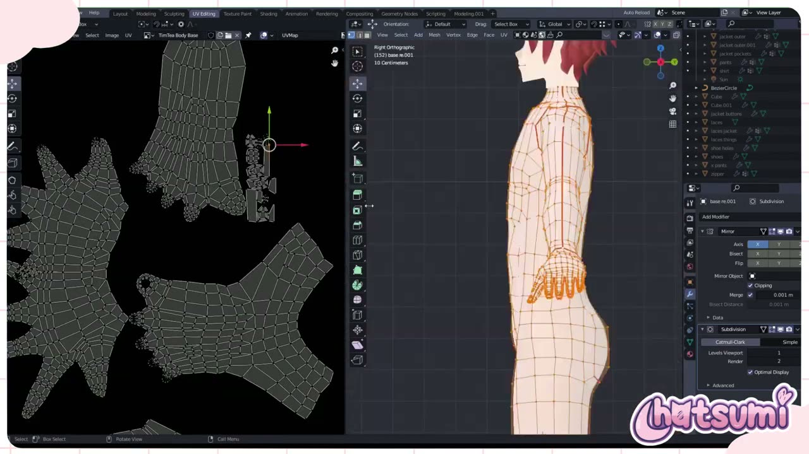
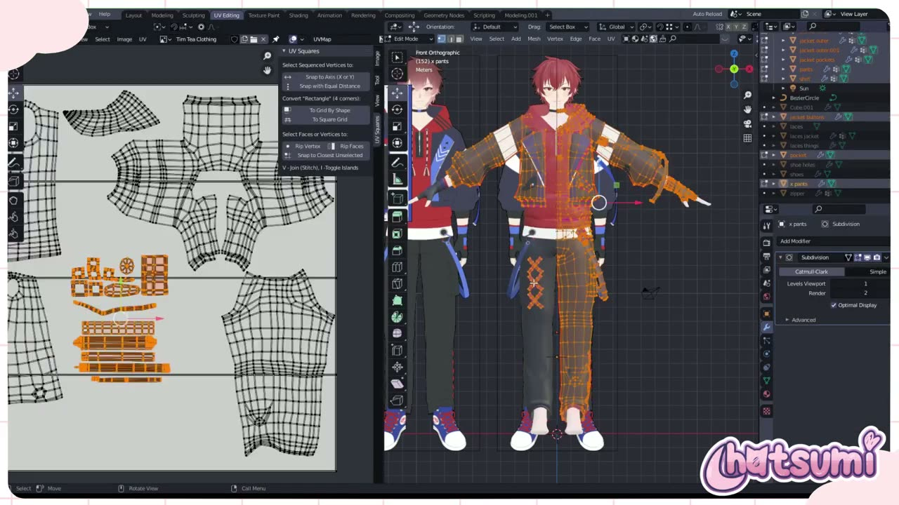
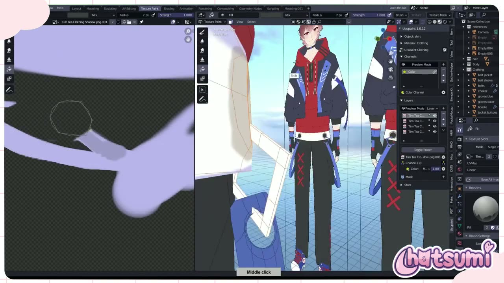
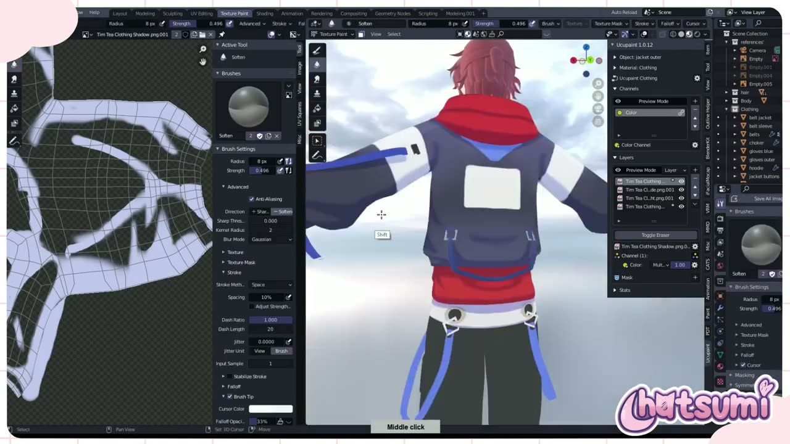
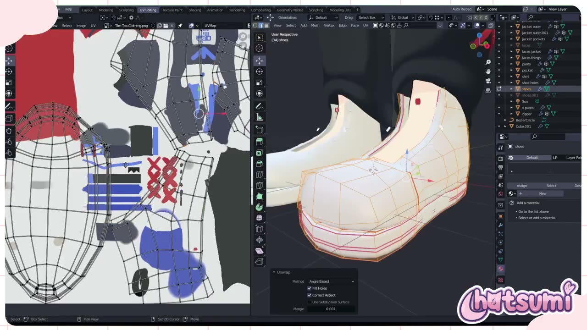

# TimTea の 3D VTuber アバター制作 Part 5: UV 展開とテクスチャペイントを画面から読む

3D の VTuber アバターは、形ができても色が付くまでは完成に見えません。その間に挟まるのが、立体を平面に開く UV 展開と、開いた面に色を塗るテクスチャの工程です。

YouTube チャンネル Hatsumi の **「Making A 3D Vtuber Avatar for TimTea! Part 5 UV Mapping/Texturing『Blender』」** は、依頼を受けて制作した VTuber「TimTea」さんのアバターの制作過程を記録した連載の第 5 回です。約 37 分の動画で、体・衣装・靴・髪の順に UV を開き、Blender の中だけで塗り上げています。

この動画には解説のナレーションがなく、BGM に合わせて作業画面が流れる形式です。冒頭に英語のテロップが出るだけなので、本記事では画面に映った操作パネルやパネル内の値から手順を読み取り、日本語で整理しました。読み取りに自信がない所は、その旨を書き添えています。

---

## 動画概要

| 項目 | 内容 |
|:---|:---|
| **タイトル** | Making A 3D Vtuber Avatar for TimTea! Part 5 UV Mapping/Texturing『Blender』 |
| **チャンネル** | Hatsumi |
| **公開日** | 2024年5月14日 |
| **長さ** | 37:34 |
| **言語** | 英語（冒頭のテロップのみ。ナレーションなし） |
| **使用ソフト** | Blender（バージョン表示は画面で確認できず） |
| **画面に映るアドオン** | UV Squares、Ucupaint 1.0.12、Outline Helper、VRM、CATS など |

---

## 背景: 依頼制作の過程を追う連載

動画の説明文によると、この連載は TimTea さんから「3D モデルを作る過程を記録してほしい」と頼まれて始まったものです。冒頭のテロップでは、次のように本編の内容が示されていました。

> ただいま。この動画では UV マッピングとテクスチャを扱います。

なお、説明文には「この動画ではキャラクターの靴を作ります」という一文も残っています。本編の内容とは合わないため、前の回の説明文を引き継いだものと考えられます（要確認）。

作業は UV Editing と Texture Paint の 2 つのワークスペースを行き来して進みます。左に UV エディター、右に 3D ビューポートを並べる、Blender の標準的な画面構成です。

---

## 手順の詳報

### 体にシームを入れて展開する（00:08〜）

最初は、頭と髪を除いた体（素体）のメッシュです。編集モードで、肩まわりや手首、脚の側面などの辺にシーム（切れ目）を入れていきます。画面では、シームは赤い線で表示されていました。

展開すると、左の UV エディターに体のアイランド（ひとつながりの面のかたまり）が並びます。胴と脚をひと続きにした大きなアイランドのほか、指を広げた手、足の甲と裏などが別々に開かれていました。体のメッシュには Mirror と Subdivision Surface のモディファイアーが付いたままで、展開はミラー前の片側に対して行っているように見えます（要確認）。

### 塗るための画像を用意する（02:37 頃）

UV エディターで新しい画像を作り、名前を「TimTea Body Base」にします。作った直後の画像は黒一色で、UV のアイランドをその上に重ねて確認できます。

画像はすぐに PNG として保存していました。保存画面では、形式 PNG、RGBA、色深度 8、圧縮 15% が選ばれています。塗る前にファイルとして保存しておくと、あとで Blender を閉じても塗った内容を失いにくくなります。

### 衣装はまとめて展開し、UV Squares で整える（03:35〜）

衣装は、ジャケット、パーカー、ズボン、ベルト、手袋など多くのオブジェクトに分かれています。これらを複数選んで同時に編集モードに入り、1 枚の画像「Tim Tea Clothing」に向けてまとめて展開していました。

ここで使われていたのが、UV エディターのサイドバーに出る UV Squares というアドオンです。To Grid By Shape や To Square Grid で、ゆがんだアイランドを格子状にそろえられます。ベルトやひもなどの帯状のパーツは、まっすぐな長方形に整えてから小さく並べていました。まっすぐにしておくと、線や模様を塗るときにゆがみが出にくくなります。

### 体を Texture Paint で塗る（07:16〜）

Texture Paint ワークスペースに移ると、プロパティの Texture Slots に 4 枚の画像が並んでいます。「TimTea Body Base」のほかに、soft shade、Light、Shadow という名前の画像です。色の土台と、陰影や明るい部分を別の画像に分けて塗る構成と読み取れます。

肌の塗りでは、Standard Brush という名前のブラシ（Blend は Mix、Radius 28 px）で、鎖骨や腹筋、ひざの線を薄い赤で描き込んでいました。そのあと Smear ブラシ（Strength 0.27〜0.30 前後、Radius 112〜145 px）に切り替え、線や血色をぼかしてなじませます。手の指の股やひざ裏など、赤みを入れた場所も同じようにぼかしていました。

### 衣装を Ucupaint のレイヤーで塗る（15:10〜）

衣装の塗りでは、3D ビューポートのサイドバーに Ucupaint 1.0.12 のパネルが表示されます。Ucupaint は、Blender の中で画像をレイヤーとして重ねて塗れるようにするアドオンです。

レイヤーは上から Shadow、Soft Shade、Light、土台の Clothing の 4 枚です。影のレイヤーは合成方法が「Mult…」と表示されており、乗算で重ねていると考えられます。影そのものは、紫がかった明るい色で塗られていました。乗算にすると、下の色がこの色の分だけ暗くなるため、どの布の色にも同じ影色を使えます。

塗り方は、まず TexDraw（Radius 7〜10 px、Strength 1.000）で影の形をはっきり描き、はみ出した所は Blend を Erase Alpha にして消します。最後に Soften ブラシ（Radius 8 px、Strength 0.496）で、影の縁をところどころぼかしていました。影を全部ぼかさず、境目のくっきりした所を残しているのが、アニメ調の見た目につながっていると言えるでしょう。

### 靴をあとから展開して同じ画像に入れる（27:45 頃）

靴は、衣装より後に展開されていました。靴を選んで Unwrap を実行し、衣装用の画像の空いている場所に収めています。操作パネルの値は、Method が Angle Based、Fill Holes と Correct Aspect がオン、Margin が 0.001 でした。

靴の土台の色は、Ucupaint の一番下にある Clothing のレイヤーに、Blend を Mix にして塗っていました。

### 髪の UV と塗り（30:57〜）

最後は髪です。新しい画像「Tim Tea Hair Base」を作り、髪の房ごとに展開します。房の UV は UV Squares で格子状にそろえ、細長い長方形として並べていました。画面では、並べたアイランドを 0.214 倍に縮めて空きに詰める場面があります。

髪のマテリアルは Emission と ColorRamp の組み合わせで、Outline Helper のアウトライン用マテリアルも付いています。光の当たり方に左右されにくい、セルルック向けの設定と考えられます（要確認）。塗りは衣装と同じく Ucupaint で、Hair Base、Shadow、Soft shade、Light の 4 枚のレイヤーに分けていました。

---

## 作者紹介

### Hatsumi

YouTube チャンネル Hatsumi で、Blender による VTuber モデル制作の過程やチュートリアルを公開しているクリエイターです。説明文では、3D モデルの制作依頼を VGen で受け付けていると案内しています。動画のタグには vrchat、vtuber、vseeface、commission が並んでおり、配信やソーシャル VR で使うアバターの受託制作を中心に活動していることがうかがえます。

---

## まとめ

この回は、UV 展開とテクスチャを、Blender の中だけで完結させる制作記録でした。流れを表にまとめます。

| 対象 | UV の作り方 | 塗り方 |
|:---|:---|:---|
| 体 | シームを入れて展開、専用の画像 1 枚 | Texture Slots の 4 枚、Standard Brush と Smear |
| 衣装 | 複数オブジェクトをまとめて展開、UV Squares で直線化 | Ucupaint の 4 レイヤー、影は乗算 |
| 靴 | あとから Angle Based で展開し、衣装の画像へ | 衣装の土台レイヤーに Mix で塗る |
| 髪 | 房ごとに展開、UV Squares で格子化 | Ucupaint の 4 レイヤー、Emission のマテリアル |

画面から見えてくるのは、土台の色と陰影を別の画像やレイヤーに分けておく考え方です。影だけを塗り直したり、明るさを調整したりしやすくなります。外部のペイントソフトを使わなくても、Ucupaint のようなアドオンを足せばレイヤーで塗り分けられる、という点も参考になるでしょう。連載の最終回（Final Part）では、リギングとブレンドシェイプが扱われています。

---

## 参考リンク

- [Making A 3D Vtuber Avatar for TimTea! Part 5 UV Mapping/Texturing『Blender』（YouTube）](https://www.youtube.com/watch?v=fMM4BXnj9xM)
- [Hatsumi の VGen（動画説明文より）](https://vgen.co/hatsumi)
