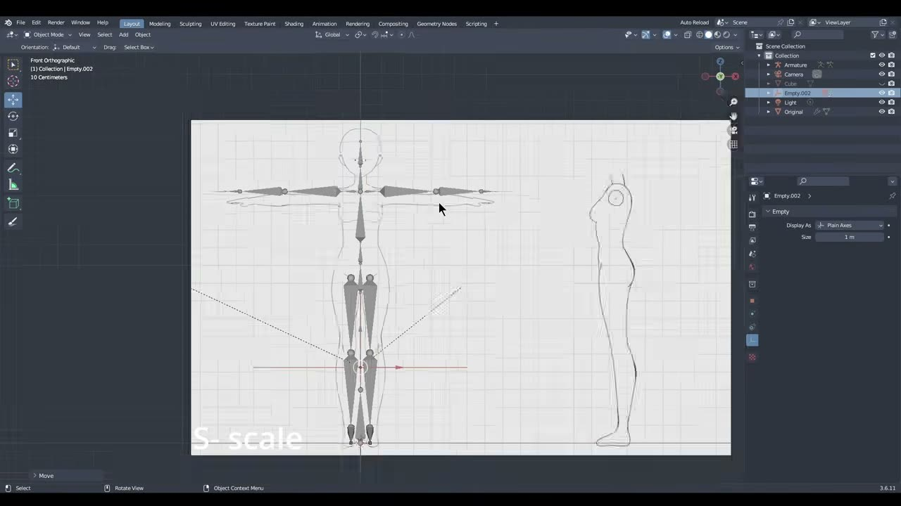
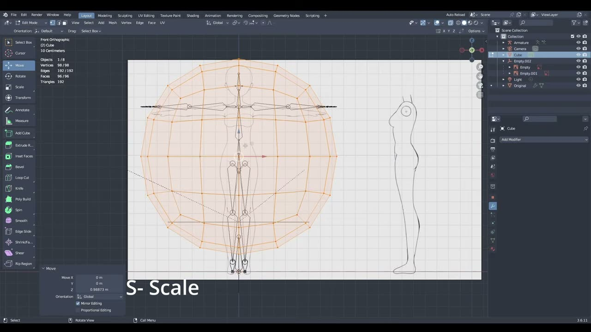
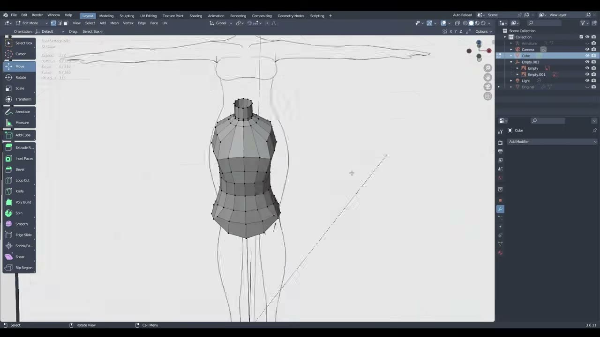
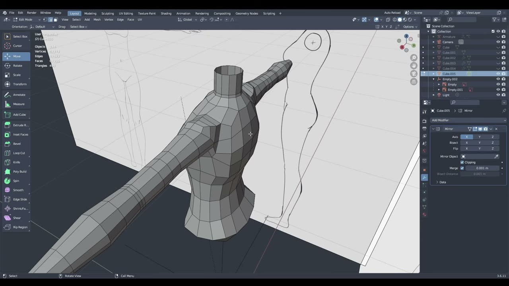
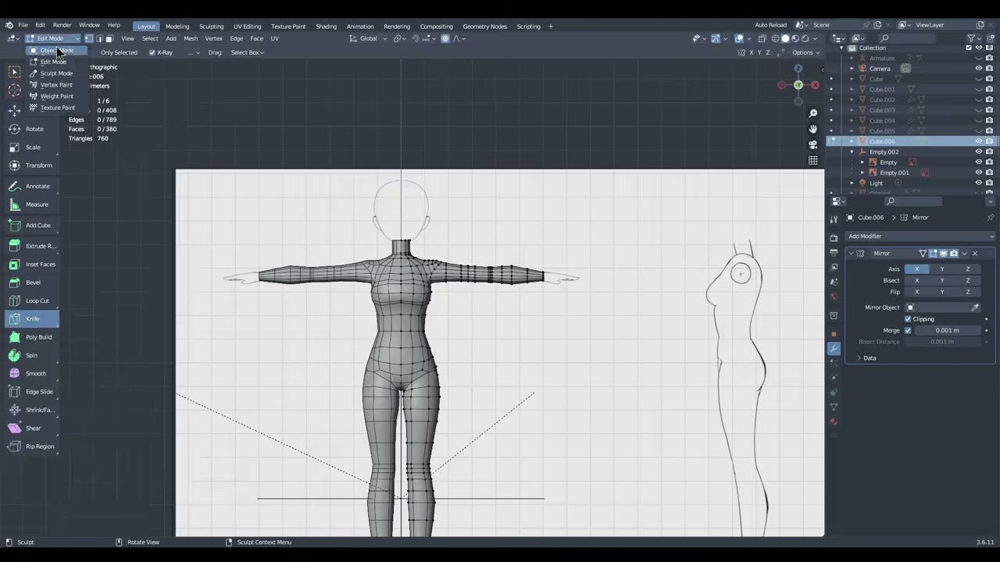
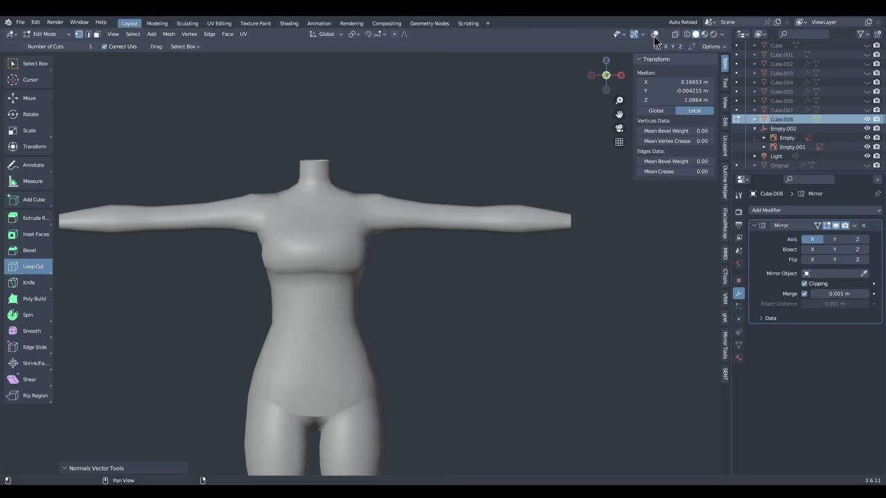

# Blender で作る VTuber モデル EP1: 立方体から素体（Body Base）を作る

3D の VTuber モデルを自作しようとすると、最初に手が止まりやすいのが「体をどこから作るか」という点です。顔や髪に目が行きがちですが、衣装やリグの土台になるのは、頭と手足の先を除いた体のメッシュ、いわゆる素体（Body Base）です。

YouTube チャンネル Hatsumi で公開された **「Blender Vtuber Modeling Series: EP 1 EASY Body Base Tutorial」** は、この素体をデフォルトの立方体から作る約 19 分のチュートリアルです。VTuber モデルをゼロから作る連載の第 1 回にあたります。

本記事では、英語で解説されている動画の内容を日本語で整理し、手順の流れと、その背景にある判断を紹介します。

---

## 動画概要

| 項目 | 内容 |
|:---|:---|
| **タイトル** | Blender Vtuber Modeling Series: EP 1 EASY Body Base Tutorial |
| **チャンネル** | Hatsumi |
| **公開日** | 2026年9月1日 |
| **長さ** | 19:23 |
| **言語** | 英語（ナレーション。一部の操作キーは画面にテロップ表示） |
| **使用ソフト** | Blender（画面の表示は 3.6.11） |
| **前提のアドオン** | VRM Add-on for Blender、LoopTools |

---

## 背景: VTuber モデル連載の第 1 回

動画の説明文によると、このシリーズは複数回に分けて 3D の VTuber モデルを作る連載です。EP1 では体をゼロから作り、次回は手・足・頭を扱うと動画の最後で予告されていました。

冒頭では、VRM 用のアドオンを入れておくことと、LoopTools を有効にしておくことが前提として挙げられています。VRM は VTuber 向けの 3D アバターで広く使われるファイル形式で、LoopTools は選んだ辺を円形に整えたり、間隔をならしたりするアドオンです。導入方法は、シリーズの紹介動画で説明しているとのことでした。

対象は、Blender の基本操作（押し出しや拡大縮小など）に触れたことがある初心者から中級者です。作者は、途中で難しく感じたら Patreon で配布している途中段階のメッシュ（スターターメッシュ）から再開してよいと案内していました。完成形を一気に目指すより、段階ごとに追いつける構成になっています。

---

## 手順の詳報

### 参照画像とアーマチュアを置く（00:30〜）

新規シーンを開いたら、デフォルトの立方体は削除せず、非表示にしておきます。この立方体が後で体の材料になるためです。

次に追加メニュー（Shift+A）から VRM のアーマチュアを追加し、続けて参照画像を読み込みます。参照画像は、T ポーズの正面図と側面図が描かれた線画です。画像エンプティの Opacity（不透明度）を下げ、グリッドが透けて見えるようにしておきます。

側面用の画像は、テンキー 3 の右面ビューで同じ画像をもう一度追加し、横にずらして正面図と輪郭の高さをそろえます。2 枚を Plain Axes（十字）のエンプティにペアレント（Ctrl+P）すると、エンプティを拡大縮小するだけで両方の画像の縮尺を一度に変えられます。

合わせ方の目安も具体的でした。腕の線がアームボーンのすぐ下、腰がウエストのボーンの位置、両膝の間隔がグリッド 1 マスになるようにそろえます。アーマチュアはあくまで大きさの基準なので、画像を少し大きめにしてもかまわない、と補足されていました。

### 胴体のベースを作る（01:57〜）

非表示にしていた立方体を戻し、サブディビジョンサーフェスを 2 レベルで追加して適用します。画面では、この時点で頂点 98・面 96 の球に近いメッシュになっていました。

編集モードで全体を縮め、中央の辺のループが腰の高さに来るように上に移動します。そこから頂点の列ごとに拡大縮小し、胴体の大まかな輪郭に寄せていきます。X 線表示（X-Ray）をオンにすると、メッシュ越しに参照画像が見えて作業しやすくなります。

ここで大事なのが、右上の X ミラー（Mirror Editing）をオンにしておくことです。左右どちらかを動かすと反対側も同じように動くので、左右対称を保ったまま形を詰められます。右面ビューに切り替えたら、メッシュを参照の中心に移し、Y 軸方向に縮めて体の厚みを合わせます。

### 首の穴と胸のライン（03:22〜）

正面ビューに戻り、上面を 2 回押し出して、そのつど縮めていきます。一番上の中央 8 面を選び、右クリックメニューから LoopTools の Circle で円形にしてから削除すると、首の穴になります。さらに 2 回押し出すと首ができます。

角ばった部分は、スカルプトモードの Smooth ブラシで整えます。強さを下げ、筆圧を切った状態で軽くクリックして回る使い方でした。ミラーの左右がずれてしまった場合は、Snap to Symmetry で対称にそろえ直せます。

### 胸を作る（04:50〜）

胸の位置にそろえた 6 面を押し出して少し縮め、Vertex メニューの Smooth Vertices（頂点をスムーズに）でならします。側面ビューで参照に合わせたら、中央にループカットを 1 本入れます。そのあとスカルプトの Grab ブラシで前に引き出し、胸のふくらみを作ります。

### 左右を分けてミラーにする（06:03〜）

ここでメッシュの片側を削除し、Mirror モディファイアーを追加します。画面では軸は X、Merge がオンで、途中から Clipping もオンになっていました。Clipping がオンだと、中央の頂点が反対側へはみ出さなくなります。

肩の土台は、首のつけ根の頂点を持ち上げて作ります。ナイフで辺から中央まで切るといったん三角面ができますが、2 点の間にループカットを入れて四角面に戻していました。

### 腕を出す（07:00〜）

肩の横にある中央の 6 面を押し出して少し縮め、上面を合計 3 回押し出して肩の張り出しを作ります。そのうえで下側の 8 面を削除すると、腕の付け根の穴になります。

プロポーショナル編集をオンにして、穴の縁を参照に合わせながら角ばった形を丸く整えます。穴が大きくなりすぎないよう、下側の面を持ち上げておくのがコツだと説明されていました。縁の辺を選んで LoopTools の Relax をかけ、間隔をならしてから押し出して腕を伸ばします。

腕の中ほど（ひじのあたり）では、辺を Ctrl+B でベベルし、セグメントを 2 にします。作者はその理由を次のように述べていました。

> リギングしたときに、よりきれいに変形させるためです。

ひじやひざのように大きく曲がる関節には辺のループを多めに入れておく、というリグ前提の判断です。

### 背中を整える（09:59〜）

参照画像を非表示にして、背中の中央の辺を少し内側へ押し込みます。背骨のくぼみを作り、全体の角ばりをスカルプトツールで減らしていきます。

### 腰まわりと脚の付け根（10:56〜）

胴体の底面を Grab で少し平らにし、外側の面を削除して脚の穴を 2 つ作ります。残った中央の部分が股になります。脚の穴の辺にも LoopTools の Relax をかけて整えます。

下半分の頂点を下げる場面では、レオタードの形をイメージして頂点を並べるよう勧めていました。

### 脚を作る（12:03〜）

脚の穴の辺を押し出して下に伸ばし、Z 軸に 0 で拡大縮小して断面を水平にそろえます。お尻にあたる辺は Ctrl+B でベベルして丸みを出し、ループカットを追加してお尻と太ももの境目をはっきりさせます。

おなかにもループカットを入れ、ナイフで既存の辺とつなぎます。辺の位置は、画面のテロップで示された Shift+V の頂点スライドで下げていました。脚をさらに押し出してひざに辺を足し、参照に合わせて太さを調整します。

> 今は完璧を目指さなくて大丈夫です。あとで戻って直せます。

形がそろってきたら、スムーズシェードで表示します。右面ビューでは脚の最後の辺を選び、影響範囲を大きくしたプロポーショナル編集で後ろへ押します。こうすると脚全体がなだらかについてきます。影響範囲はマウスホイールで調整できます。

### 仕上げとトポロジーの手直し（15:36〜）

ここからは任意の作業です。胸の面をベベルしてつなぎ、いったん三角面を作ってから、最後にループカットで四角面へ戻す流れが紹介されていました。お尻の三角面も、M キーの Merge（At Center）で 2 点をまとめ、不要な頂点を溶解（Dissolve）し、ループカットを入れて解消します。

全体を選んで Smooth Vertices をかけると、サブディビジョンに頼らずになめらかなメッシュにできます。ただしメッシュが少し痩せるので、作者は Grab ブラシでボリュームを戻していました。サブディビジョンを適用するかどうかは好みでよいそうです。

側面の参照は 1 対 1 でなぞる必要はない、という点も強調されていました。作者自身も、背骨のカーブは参照よりまっすぐにしたほうがよいと判断し、そのように調整したと話しています。

---

## 作者紹介

### Hatsumi

YouTube チャンネル Hatsumi で、Blender を使った VTuber モデル制作のチュートリアルを公開しているクリエイターです。本動画の説明文では、制作途中のメッシュやモデルファイル、参照画像を Patreon で配布すると案内しています。動画の最後では、Patreon で早回しなしの制作過程なども公開していると紹介されていました。

動画のタグには VRM、Unity、Warudo（VTuber 向けの配信ソフト）が並んでおり、Blender で作ったモデルを配信で使うところまでを視野に入れたシリーズだと読み取れます。

---

## まとめ

このチュートリアルは、デフォルトの立方体から押し出しとループカットを重ねて、VTuber 向けの素体を作る内容でした。流れを表にまとめます。

| 工程 | 主な操作 | 押さえどころ |
|:---|:---|:---|
| 準備 | 参照画像 2 枚、VRM アーマチュア、エンプティへのペアレント | ボーンを基準に縮尺を合わせる |
| 胴体 | サブディビジョン 2 レベルを適用、X ミラー、拡大縮小 | 腰の高さに中央のループを置く |
| 首・胸 | 押し出し、LoopTools の Circle、Smooth Vertices、Grab | 角ばりはスカルプトで少しずつ取る |
| 腕 | 側面の押し出し、面の削除、Relax、ひじのベベル | 関節には辺を多めに入れる |
| 脚 | 脚の穴、押し出し、Z 軸 0 の縮小、プロポーショナル編集 | レオタードの形を意識する |
| 仕上げ | Merge、Dissolve、ループカット、Smooth Vertices | 三角面を四角面に戻す |

作者は最後に、ここで扱ったのは体に慣れるためのごくシンプルなトポロジーであり、中級者なら自由に変えてよいとまとめていました。参照に従うかどうかも含めて、自分の好みの形に寄せていく前提の素体です。まずは同じ手順で 1 体作り、次回の手・足・頭の回に備えておくとよいでしょう。

---

## 参考リンク

- [Blender Vtuber Modeling Series: EP 1 EASY Body Base Tutorial（YouTube）](https://www.youtube.com/watch?v=H9uRpY2mV0A)
- [Hatsumi の Patreon（動画説明文より）](https://www.patreon.com/cw/hatsumimodels)
