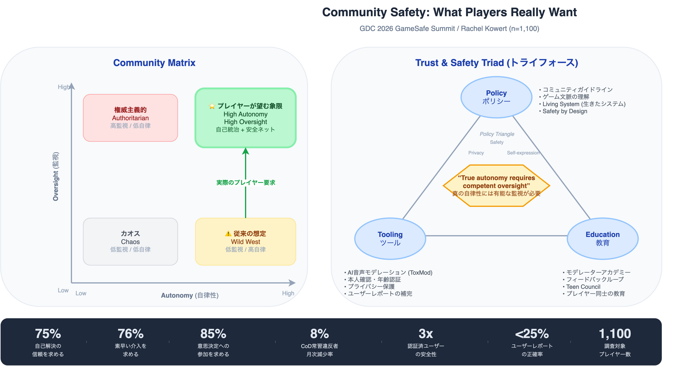
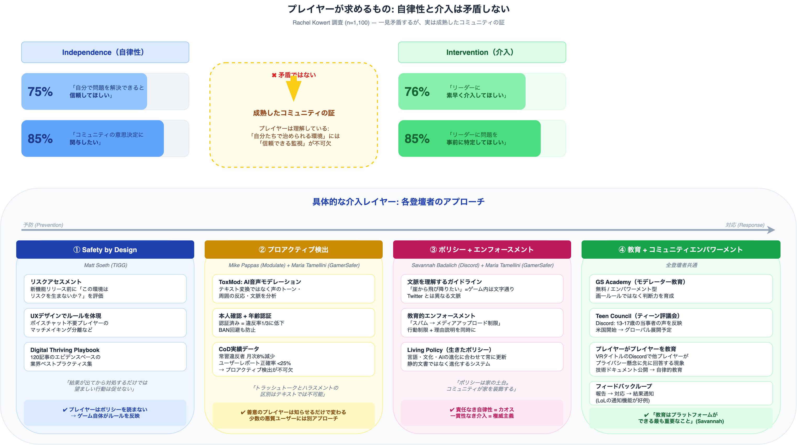

# GDC 2026 セッション要約

## FROM INDEPENDENCE TO INTERVENTION: WHAT PLAYERS REALLY WANT FROM COMMUNITY SAFETY

- **日時**: 2026年3月9日（月） 12:45pm - 1:45pm
- **場所**: Room 2009, West Hall
- **形式**: Partner Developer Summit（GameSafe Summit）
- **トラック**: Educators
- **対象レベル**: Entry-Level

---

## 登壇者

| 登壇者 | 所属 | 役割 | 代表するレイヤー |
|:---|:---|:---|:---|
| Rachel Kowert, PhD | University of Cambridge | モデレーター | 学術的エビデンス・心理学 |
| Mike Pappas | Modulate（CEO/共同創業者） | パネリスト | AI音声モデレーション技術 |
| Savannah Badalich | Discord（プロダクトポリシー） | パネリスト | プラットフォームポリシー・大規模運用 |
| Maria Tamellini | GamerSafer（COO/共同創業者） | パネリスト | 本人確認・年齢認証インフラ |
| Matthew Soeth | TIGG（エグゼクティブディレクター） | パネリスト | 業界横断の基準・ベストプラクティス |

---

## 核心的な発見: Community Matrix

Rachel Kowert が 1,100人のプレイヤー調査から導出したフレームワーク。

### プレイヤーが求めているもの（一見矛盾する要求）

| 自律性（Independence） | 介入（Intervention） |
|:---|:---|
| **75%** 自分で問題を解決できると信頼してほしい | **76%** リーダーに素早く介入してほしい |
| **85%** コミュニティの意思決定に関与したい | **85%** リーダーに問題を事前に特定してほしい |

### 結論

> **「真の自律性には有能な監視が必要」（True autonomy requires competent oversight）**

プレイヤーは「放置」も「管理」も望んでいない。**自己統治できる環境を、助けがすぐそばにある状態で**実現することを求めている。これは矛盾ではなく、コミュニティの成熟を示す「高自律性 × 高監視」の象限。

---

## Trust and Safety Triad（トライフォース）

セーフティを支える3つの柱。ゼルダのトライフォース（力・勇気・知恵）に例えられた。

### Policy Triangle との関係

Safety / Privacy / Self-expression のトレードオフ（ポリシー・トライアングル）が背景にあり、3つのバランスを追求する。

---

## セクション1: Policy（ポリシー）

### Savannah Badalich（Discord）
- コミュニティガイドラインは「家の土台（foundation）」— コミュニティが「家の装飾」を決める
- **ゲーム特有の文脈理解が必要**: 「I want to jump off a cliff」はゲーム内では文字通りの意味（Twitter とは違う）
- ティーンの安全が最優先（bread and butter）
- ポリシーだけでは不十分 — ボランティアモデレーターにツールを渡す必要がある

### Maria Tamellini（GamerSafer）
- **フレームワーク**: 「責任なき自律性はカオスを生み、一貫性なき介入は権威主義に見える」
- プレイヤージャーニーの全段階（ロビー〜ゲームプレイ〜Discord）で安全を組み込む
- 自己表現 ↔ ヘイトスピーチ、つながり ↔ グルーミング の境界線設計
- 13歳からのプレイヤーが一緒に成長する設計
- **ポリシーは生きたシステム**: 言語・文化・AIの進化に合わせて常に更新

### Matthew Soeth（TIGG）
- **プレイヤーはポリシーを読まない** → ゲーム自体がルールを反映すべき
- うまくできたポリシーは「自然に感じる」
- **Safety by Design**: リスクアセスメント → UX設計 → 行動予測を事前に行う
- **安全は楽しさを犠牲にしてはならない**

---

## セクション2: Tooling（ツール）

### Mike Pappas（Modulate）— AI音声モデレーション
- **テキスト変換だけでは不十分**: 「hey, come to my private room」はトーンで意味が全く変わる
- **音声ネイティブの理解**: トランスクリプトではなく「どう言ったか」「周囲がどう反応したか」を分析
  - 全員が沈黙 → 不快
  - 誰かがログアウト → 安全でないと感じた
  - 全員が笑っている → 問題なし
- **Call of Duty での成果**: 常習違反者が月次 **8%減少**
- **毒性の大半は悪意ある少数派ではない**: 境界を知らない善意のプレイヤーが原因。存在を知らせるだけで行動が変わる（「トイレの手洗い注意書き」効果）
- **ユーザーレポートの限界**: 正確なレポートは**4分の1以下**（報復報告などが多い）

### Maria Tamellini（GamerSafer）— 本人確認・認証
- **認証済みユーザーは未認証の3分の1の確率でしか違反しない**（3倍安全）
- **信頼構築の2つの柱**:
  1. プライバシーファースト・同意ベース・透明性
  2. インセンティブ設計（早期アクセス、特別バッジ、マッチング優先権など）
- 認証バッジを**誇りに感じる**プレイヤーが出現
- モデレーション負荷の軽減 → 高リスクケースに集中可能

### Savannah Badalich（Discord）— 年齢認証
- Discord が発表した年齢認証（Age Assurance）は**初期反応が否定的**だった
- 監視・プライバシー侵害への恐れが原因
- **IDデータは保持しない**ことを明確に伝える
- 目的: グルーミング・セクストーション防止（男女問わず被害あり）
- **急がず、フィードバックを反映して改善を続ける**

### プライバシーと安全の文化的課題（全体議論）
- 「必要最小限のデータで安全性を高める」と「すべてを記録・収集する」の**違いを社会がうまく議論できていない**
- 業界全体でこの議論を進める責任がある

---

## セクション3: Education（教育）

### Maria Tamellini（GamerSafer）— GS Academy
- モデレーター向け無料教育プログラム
- 「こうしなさい」ではなく**エンパワーメント**: 実践的アドバイスで各コミュニティが自分で判断できるように
- 各ゲーム・プラットフォームのユニークな文化を尊重
- 他組織との共同制作パートナーシップを準備中

### Savannah Badalich（Discord）— エンフォースメント × 教育の統合
- 違反時に「何をしたか」「なぜダメか」を具体的にフィードバック（行動制限 + 理由教育）
- **ボランティアモデレーターへの教育**: ガバナンス、紛争解決、リーダーシップ — **キャリアスキル**でもある
- **Teen Council（ティーン評議会）を新設**: 13〜17歳で構成、米国で開始 → グローバル展開予定
- **「教育はプラットフォームができる最も重要なこと」** と断言

### Matthew Soeth（TIGG）— Safety by Design の実践
- **「ビルボード理論」**: メッセージは6回見て初めて認知される → ゲーム体験に自然に組み込む
- **フィードバックループを閉じる**: 報告後に「対応しました」と伝える → 報告文化を育てる
- 新機能リリース前に「この環境はリスクを生まないか？」を問う
- 根本原因の切り分け: デザインの問題 / セーフティの問題 / 文化の問題

### Mike Pappas（Modulate）— プレイヤーがプレイヤーを教育する
- VRタイトルの Discord で、プライバシー懸念の質問に**他のプレイヤーが先に正確に回答**
- 技術ドキュメントを公開 → ユーザーをエンパワー → コミュニティが自律的に教育機能を持つ
- 「僕たちが言うより、プレイヤー同士の方が遥かに説得力がある」

---

## 主要な数値データ

| データ | 出典 |
|:---|:---|
| 75% のプレイヤーが自己解決の信頼を求める | Kowert 調査（1,100人） |
| 76% がリーダーの素早い介入を求める | 同上 |
| 85% がコミュニティ意思決定への参加を求める | 同上 |
| 85% がリーダーの事前問題特定を求める | 同上 |
| 常習違反者が月次 8% 減少 | Modulate × Call of Duty |
| 認証済みユーザーは違反率が 3分の1 | GamerSafer |
| ユーザーレポートの正確率は 25% 以下 | Modulate × Call of Duty |

---

## キーフレームワーク・概念

1. **Community Matrix**: 自律性（低/高） × 監視（低/高）の2×2マトリクス
2. **Trust and Safety Triad**: Policy × Tooling × Education
3. **Policy Triangle**: Safety × Privacy × Self-expression のトレードオフ
4. **Safety by Design**: 事後対応ではなく設計段階から安全を組み込む
5. **Living Policy**: ポリシーは静的文書ではなく、進化し続ける生きたシステム

---

## 記事化に向けたポイント

- **ゲーム開発者向けの実践的な示唆が豊富** — 特にインディー開発者にも適用可能
- **「プレイヤーは自由を望んでいる」は神話** — 実際は「安全ネット付きの自由」を求めている
- **AI モデレーションの実例と数値データ**がある — Call of Duty の事例は説得力が高い
- **プライバシーと安全のトレードオフ**は現在進行形の業界課題 — Discord の年齢認証事例が象徴的
- **教育の過小評価**への警鐘 — 最も重要だが最も軽視されている柱

---

## 参考リンク

- [Modulate ToxMod](https://www.modulate.ai/products/toxmod)
- [GamerSafer](https://gamersafer.com/)
- [TIGG Digital Thriving Playbook](https://digitalthrivingplaybook.org/)
- [Discord Safety](https://discord.com/safety)
- [ADL: Hate is No Game 2023](https://www.adl.org/resources/report/hate-no-game-hate-and-harassment-online-games-2023)

---

*文字起こし元ファイル: `source/transcripts/transcript_raw.txt`*
