## セッション情報

| 項目 | 内容 |
|:---|:---|
| タイトル | Clues and Camping in 'Ghost of Yōtei': Curating Guided Exploration Through a Non-Linear Open World |
| スピーカー | Samuel Holley (Sucker Punch Productions) |
| トラック | Design, Narrative & Performance |
| 形式 | Lecture |
| 日時 | 2026年3月12日（木）10:30–11:30 |
| 場所 | Room 2005, West Hall |

---

## Part 1: イベントデッキの仕組み

### イベントデッキシステムの概要

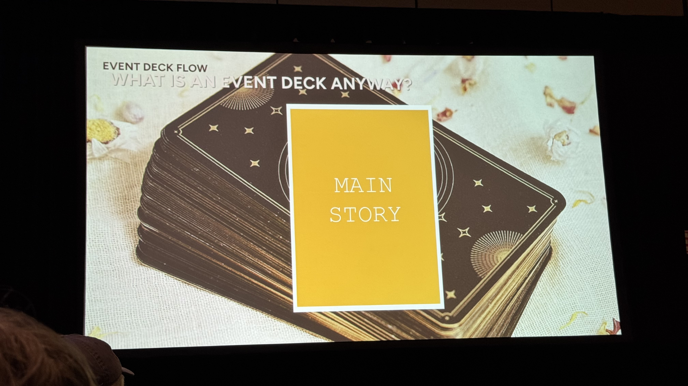

世界はディーラーで溢れている。ディーラーはイベントデッキからカードを引き、その情報を使って現在の状況に最も適切なものを選んで提供する。

イベントデッキとは、カードデッキ方式で非線形オープンワールドのガイド付き探索を実現するシステムだ。デッキは理想的なフローを線形に定義し、シャッフルせずリセットする。

### ディーラー = あらゆるインタラクションポイント

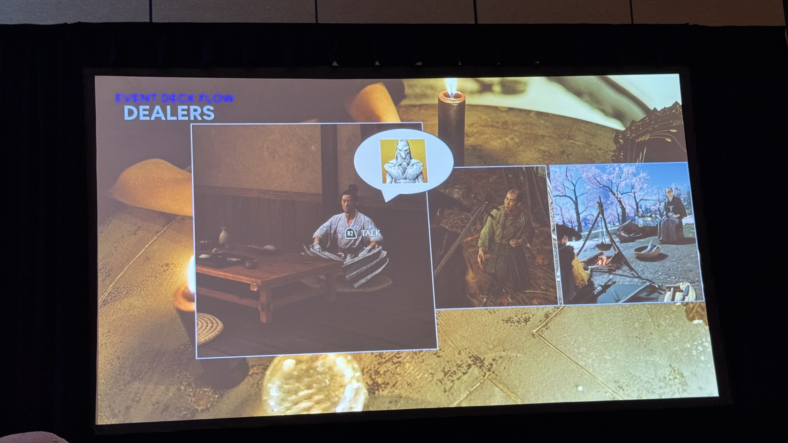

ディーラーとは、ワールド内のインタラクション可能な存在（NPC、掲示板、キャンプ、敵など）のこと。プレイヤーが接触するとイベントデッキからカードを引いて適切なイベントを提供する。

### 黄金の秘訣 その1: 多様なプレイスタイルへの対応

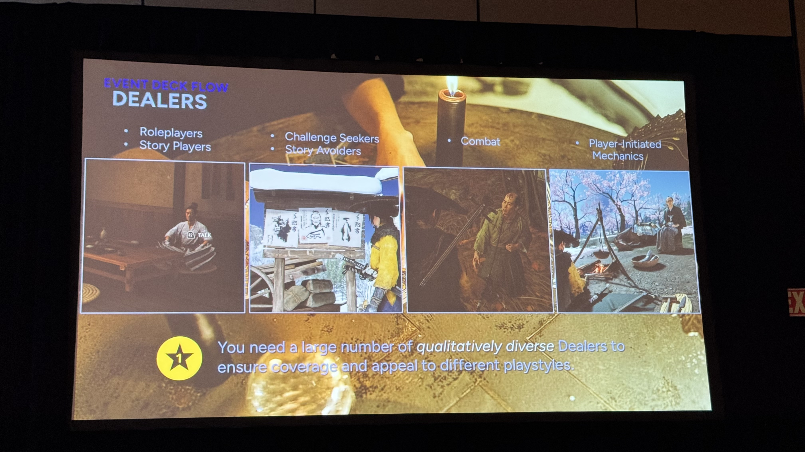

特にオープンワールドゲームでは、プレイヤーはそれぞれ異なるプレイスタイルを持っている。NPCと話すのが好きな人ばかりではない。キャンプをたくさんするのが好きな人ばかりでもないが、誰もがこれらのうちいくつかはやる。

すべてをディーラーに変えることができれば、イベントデッキがプレイスタイルに関係なくすべてのプレイヤーに届くようにできる。

### デッキの仕組み: 4枚カードの例

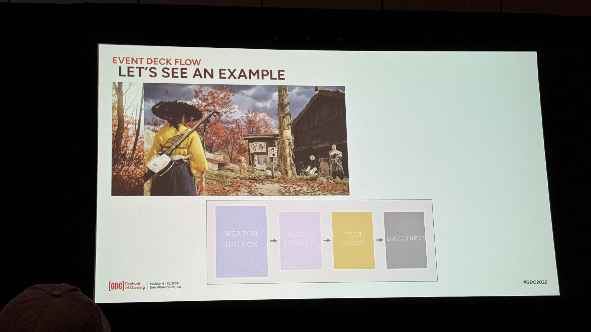

1. プレイヤーが集落の賞金首掲示板に近づく → **武器アンロック** カードが引かれる
2. 酒場の浪人に話しかける → **体力増加** カードが引かれ、温泉への地図をもらう
3. 戦闘後、敵を取り調べる → **メインストーリー** カードが引かれ、OTA6の居場所を聞き出す
4. 十分な時間が経過 → **孤独** カードが発動し、デッキがリセットされる

### 黄金の秘訣 その2: 「何もしない」余白をデッキに入れる

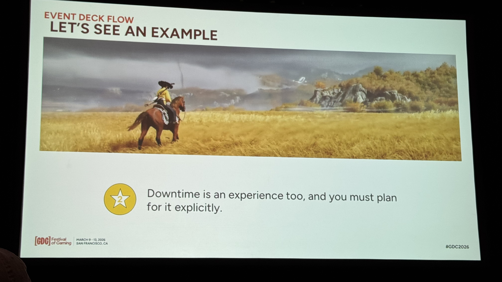

> "Downtime is an experience too, and you must plan for it explicitly."

「孤独」カードは特別なカードで、デッキの中に「何もしない」ための明確なスペースを確保する。『対馬（Tsushima）』のときのようにプレイヤーにやることを山積みにしない。日本の辺境をさまよい、自分の馬だけが唯一の相棒——それはエモーショナルターゲットだ。

### 緊急カードの仕組み

デッキは常に変化し続ける。特定の条件が満たされると、カードがデッキの先頭にジャンプする。例えば「体力増加」カードはデッキの真ん中にあるが、最大体力が他の進行度に対して遅れていると判断されたら、緊急カードとしてデッキの先頭にジャンプする。

### 黄金の秘訣 その3: 伝えることのコストを意識する

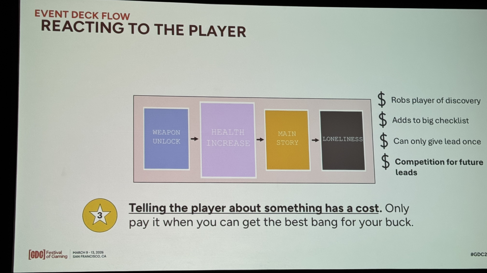

> "Telling the player about something has a cost."

プレイヤーに何かを伝えることにはコストがある:

- 自分で発見する喜びを奪う
- やることリストにもう1つ項目が追加される
- 伝えることすべてが、次に伝えることとの競争になる

コストが高い場合は計画に固執せず、プレイヤーが未完了のものを終えるか新しいリージョンに入るまでカードをスキップする。

### システミック・エンカウンター

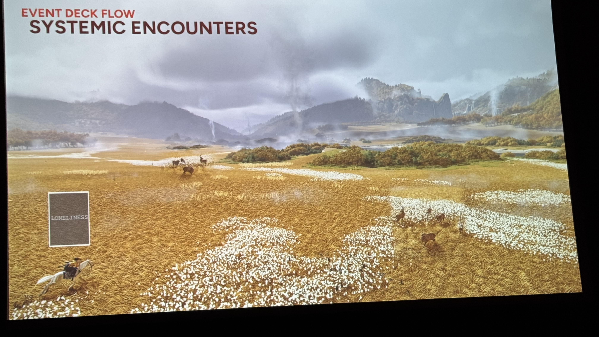

作り込みコンテンツの間の空白を埋めるシステム。イベントデッキを参照してスポーン内容を決定する。「孤独」カード時は動物のみスポーンし、意図的な空虚感を演出する。

---

## Part 2: Dealer Deep Dives

### 取り調べ（Interrogation）

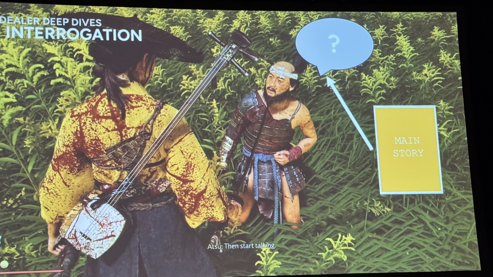

イベントマスターリストは全イベントを定義した巨大テキストファイル。カードから具体的イベント（オーディオ、アニメ、テキスト）への変換テーブルとして機能する。

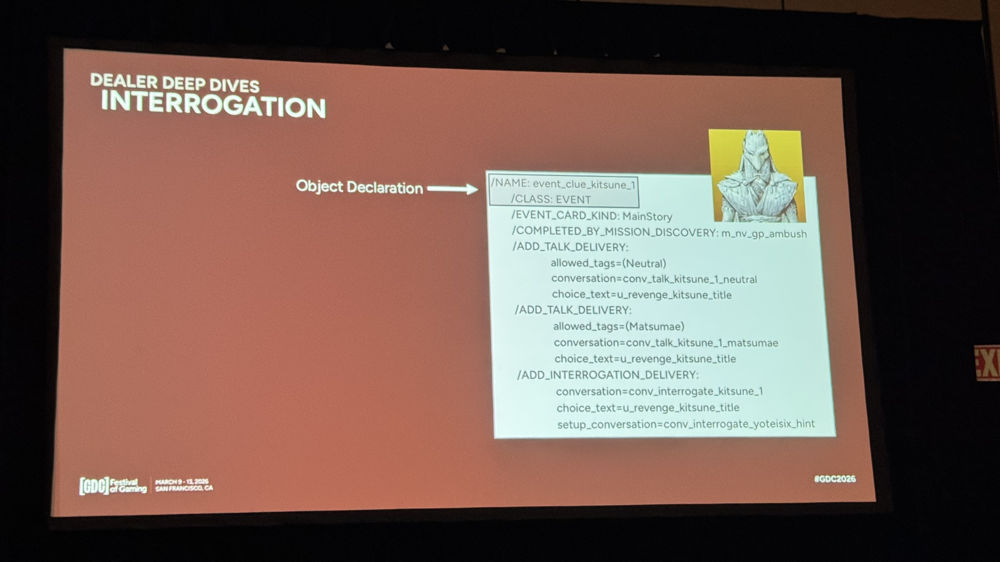

デリバリーシステムにより、同じイベントを複数の配信方法（talk / interrogation 等）で届けられる。ディーラーごとに対応するデリバリーが異なる。

### キャンプサイト訪問者（Campsite Visitor）

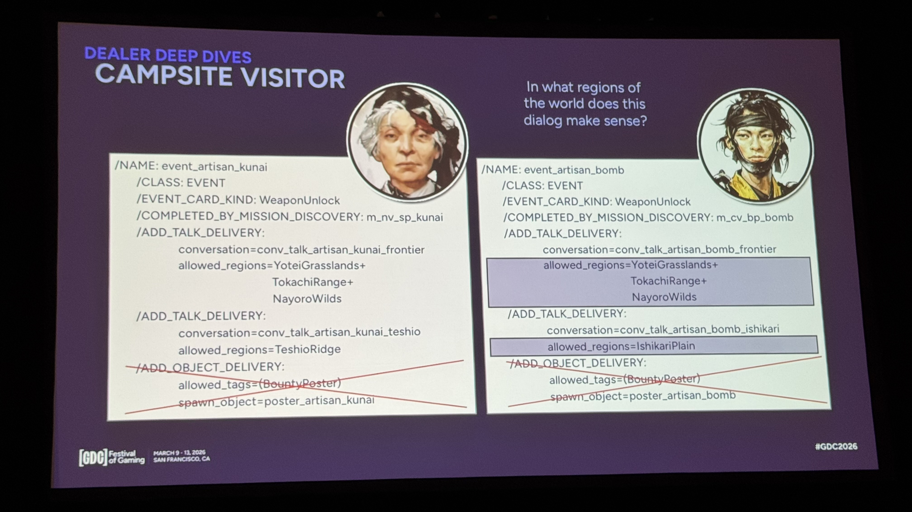

リージョンルール（allowed_regions）により、デリバリーに地域制約がある。プレイヤーの現在地域に合う情報のみ提供し、遠い地域の情報はフィルタされる。

### 黄金の秘訣 その4: 場所に紐づかないディーラー

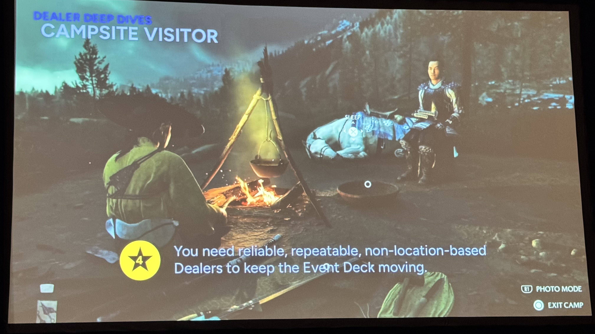

> "You need reliable, repeatable, non-location-based Dealers to keep the Event Deck moving."

キャンプサイトのような場所に紐づかないディーラーは極めて価値が高い。プレイヤーが自発的にエンゲージし、どこでも発動し、デッキの枯渇を防ぐ。

### Non-Linear Linearity（非線形な線形性）

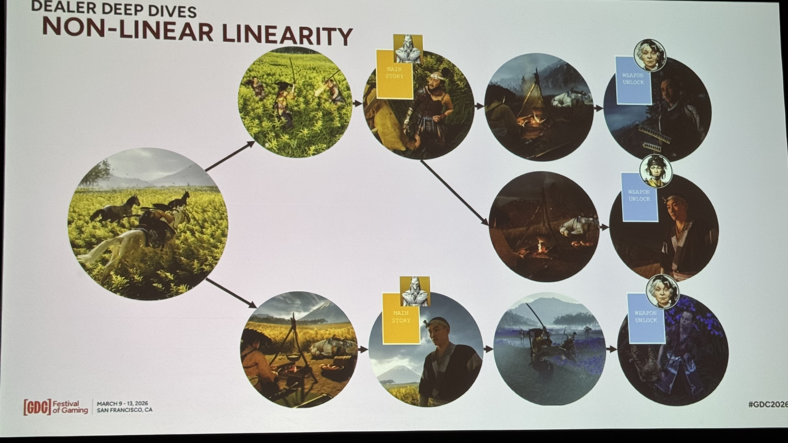

非線形なプレイヤー行動 × 線形なデッキ計画の融合。どの順序で何をしても、デッキは同じシーケンスのカードを異なるディーラー＋デリバリーで自然に届ける。

### 黄金の秘訣 その5: ナラティブの一貫性

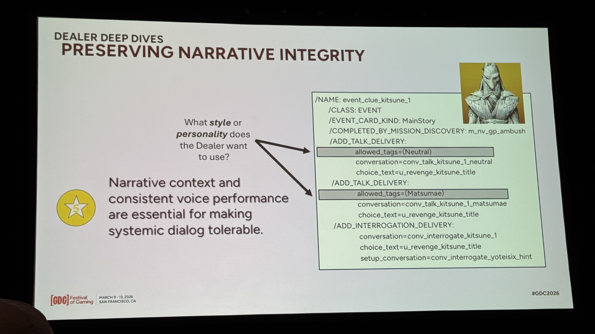

> "Narrative context and consistent voice performance are essential for making systemic dialog tolerable."

allowed_tagsでキャラクターごとにセリフを差別化しイマージョン維持。開拓者は「精霊」、松前藩侍は「ロシア人」と同じ情報でも語り方が異なる。

### V.O. Recording: レシピのスペクトラム

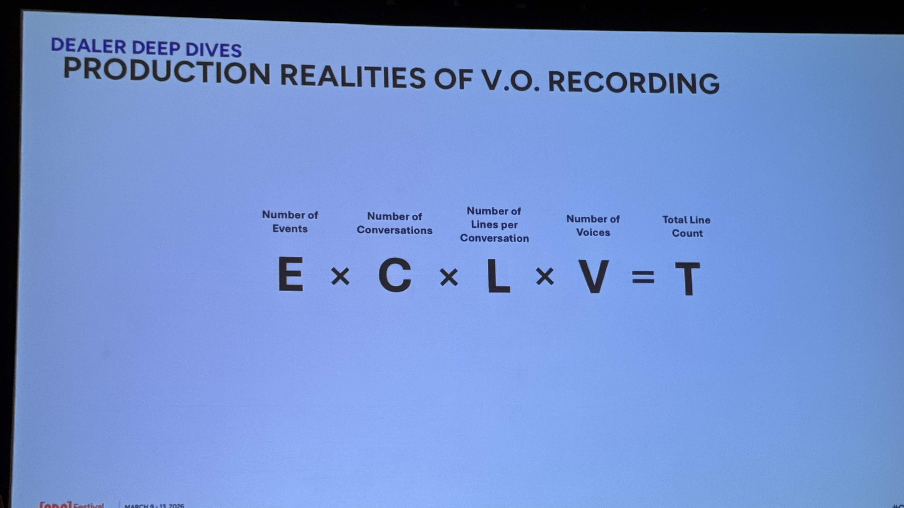

計算式: **E × C × L × V = T**（イベント数 × 会話数 × 行数/会話 × ボイス数 = 総行数）

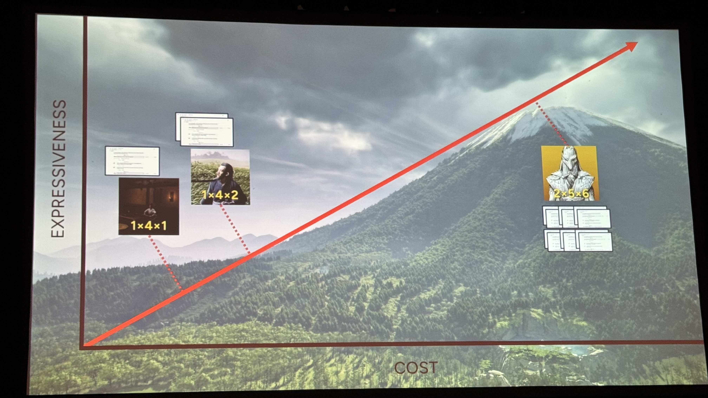

| レシピ | 用途 | コスト |
|:---|:---|:---|
| 2×5×6 | OTA6メインストーリー | 高（全体の10%以下） |
| 1×4×2 | 取り調べ | 中 |
| 1×4×1 | キャンプ訪問者・環境NPC | 低（全体の90%以上） |

VA×16キャラ戦略: 1人のボイスアクターが16マイナーキャラを演じ、スケーラブルな配信を実現。

---

## Part 3: Benefits & Shortcomings

### メリット

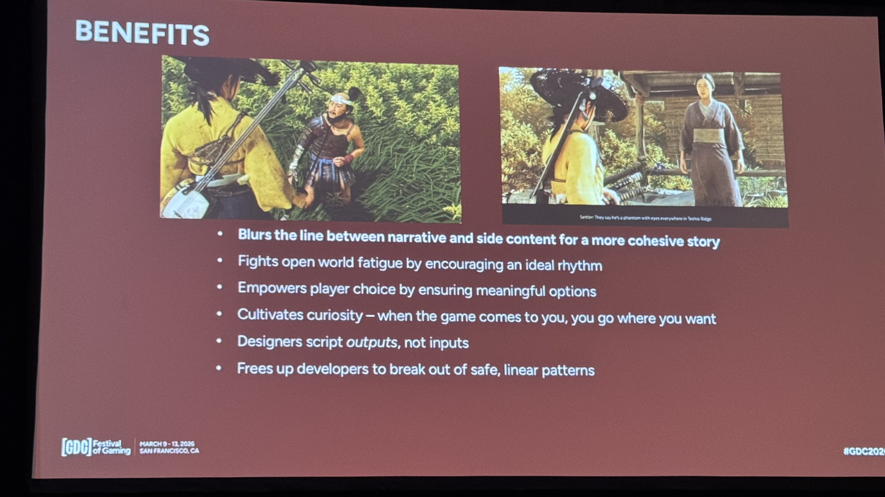

1. **非線形設計の自由度** — 開発者が安全な線形パターンから脱却できる
2. **出力ベースの設計** — デザイナーは入力ではなく出力を記述する。カード並び替えでペース制御
3. **好奇心の醸成** — ゲームがプレイヤーのところに来るので、自由に行きたい場所に行ける
4. **プレイヤー選択の強化** — カードスキップにより常に意味のある選択肢を保証
5. **オープンワールド疲労の対策** — 理想的なリズムを奨励し、同じ体験の連続を防ぐ
6. **ナラティブとサイドコンテンツの統合** — ストーリーとメカニクスの境界をぼかし、より一貫した物語を作る

### 欠点

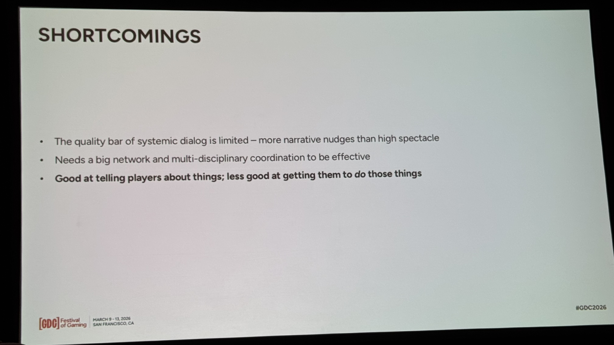

1. **システミック・ダイアログの品質限界** — ナラティブのナッジは得意だが、大きな感情的イベントには不向き
2. **大規模な投資** — 多数のディーラーと多部門連携が必要
3. **伝えることは得意だが、実行させることは苦手** — リード→行動の相関は約75%
4. **ダイアログへの過度な依存** — イベント配信が会話に偏りがち。次回はオブジェクト・デリバリーにもっと投資したい

### 結論

メリットは欠点を上回る。イベントデッキは全員を同じ道に強制するのではなく、プレイヤーが気に入りそうな方向にそっと押す（ナッジ）。多くの欠点は次回のイベントデッキで改善可能。

---

## 5 Golden Secrets まとめ

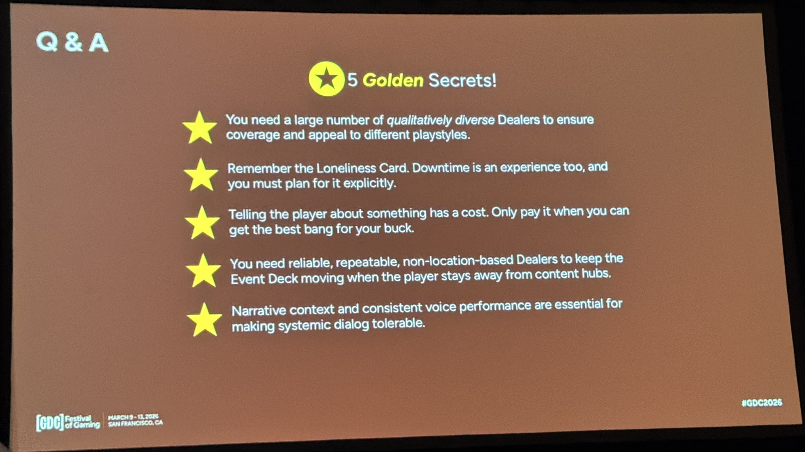

| # | Golden Secret |
|:---|:---|
| ★1 | 質的に多様なディーラーでカバレッジを確保し、異なるプレイスタイルに訴求する |
| ★2 | 孤独カードを忘れるな。ダウンタイムも体験であり、明示的に計画すべき |
| ★3 | プレイヤーに何かを伝えることにはコストがある。最大の効果が得られるときだけ払え |
| ★4 | 場所に紐づかない信頼性の高いディーラーで、プレイヤーがコンテンツハブから離れてもデッキを回し続ける |
| ★5 | ナラティブの文脈と一貫したボイスパフォーマンスが、システミック・ダイアログを許容可能にする鍵 |

---

## 全トランスクリプト要約（46項目）

### Part 1: イベントデッキの仕組み

1. **ディーラー**: ワールド内のインタラクション可能な存在。プレイヤーが接触するとイベントデッキからカードを引いて適切なイベントを提供
2. **イベントデッキ**: カードデッキ方式で理想的なフローを線形に定義。シャッフルせずリセットする
3. **黄金の秘訣 その1**: あらゆるインタラクションポイントをディーラー化し、どのプレイスタイルでもイベントが届くようにする
4. **黄金の秘訣 その2**: 「孤独」カードで「何もしない」余白をデッキに確保する
5. **緊急カード**: 進行バランスが崩れた場合、該当カードがデッキ先頭にジャンプして自動補正する
6. **黄金の秘訣 その3（最重要）**: 伝えることにはコストがある。すでに類似情報を知っている場合はカードをスキップする
7. **ダンジョンマスターとしてのデッキ**: 計画を持ちつつプレイヤーの変化に適応
8. **システミック・エンカウンター**: イベントデッキを参照してスポーン内容を決定。「孤独」カード時は動物のみスポーン

### Part 2: Dealer Deep Dives

9. **イベントマスターリスト**: 全イベントを定義した巨大テキストファイル
10. **取り調べの条件分岐**: デッキにカードがあれば取り調べ発生、「孤独」カードのみなら敵はただ死ぬだけ
11. **デリバリーシステム**: 同じイベントを複数の配信方法で届けられる
12. **イベント選択**: 複数の有効イベントがある場合は最初に見つかったものを採用
13. **キャンプサイト = ディーラー**: フェードイン/アウト時にデッキからカードを引く
14. **Object Delivery**: 会話ではなくオブジェクトをスポーンするデリバリータイプ
15. **リージョンルール**: デリバリーに地域制約があり、プレイヤーの現在地域に合う情報のみ提供
16. **キャンプサイト訪問者フロー**: カード → マスターリスト → リージョンフィルタ → NPC選択 → 会話再生
17. **黄金の秘訣 その4**: 場所に紐づかないディーラーがデッキの枯渇を防ぐ
18. **反省点**: キャンプの価値に気づくのが遅く、キャンプに過度依存
19. **核心メッセージ**: 非線形なプレイヤー行動 × 線形なデッキ計画の融合
20. **黄金の秘訣 その5**: allowed_tagsでキャラクターごとにセリフを差別化
21. **コストの現実**: 高コストだがイマージョン維持に不可欠
22. **VA×16キャラ戦略**: 1人のVAが16マイナーキャラを演じる
23. **レシピのスペクトラム**: E×C×L×V=T
24. **90/10の法則**: 安いレシピが90%以上、高いレシピは最重要イベントのみ

### Part 3: Benefits & Shortcomings

25. **メリット1**: 非線形オープンワールド設計の自由度
26. **メリット2**: 出力ベースの設計
27. **メリット3**: プレイヤーの選択を強化
28. **メリット4**: 活動の多様性リズム
29. **メリット5**: 世界の繋がりとリアリティ
30. **メリット6**: ストーリー/メカニカル両プレイヤーへの訴求
31. **欠点1**: 大きな感情的イベントには不向き
32. **欠点2**: 大きな投資が必要
33. **欠点3**: 伝えることは得意だが行動は保証できない（相関約75%）
34. **欠点4**: ダイアログへの過度な依存
35. **結論**: メリットは欠点を上回る。次回で改善可能
