# GDC 2026: Kate Edwards が語る「文化化」— インディ・ジョーンズの世界を本物にする技術

「ゲームの世界に置いたオブジェクトは、ただそこに置くだけでいい」——そう思っていませんか。

環境アーティストが雰囲気を出すために地図を壁に貼る。キャラクターの衣装をそれっぽく作る。背景の装飾品を"それらしく"散りばめる。しかしその「それらしく」の基準が曖昧なとき、文化的誤表現という見えないリスクが積み上がっていきます。

GDC 2026で、地理学者であり「カルチャライゼーション（Culturalization：ローカライゼーションの先にある概念で、単なる言語翻訳ではなく文化的文脈に合わせてコンテンツを適応させること。日本語では「文化化」とも訳される）」のパイオニアであるKate Edwards（Geogrify CEO）が登壇し、**「インディ・ジョーンズ and the Great Circle」** における世界構築の裏側を語りました。33年・317本のゲームキャリアで磨き上げた「意図的な世界構築（Intentional Creation）」の哲学を、スライドとともにレポートします。

本セッションはGDCの **Advocacy トラック**（ゲーム業界の多様性・包括性・社会的課題を扱う専門トラック。技術やデザインのトラックとは異なり、業界の社会的責任に焦点を当てる）で行われました。カルチャライゼーションがこのトラックに配置されていること自体が、この分野が単なる品質管理ではなく、業界の倫理的課題として位置づけられていることを示しています。

---

## 「Indiana Jones and the Great Circle」とは

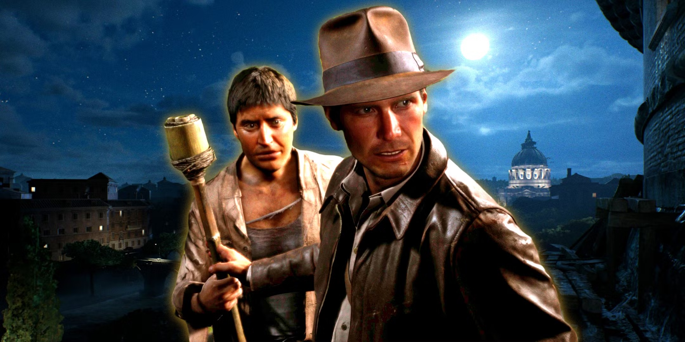

**「Indiana Jones and the Great Circle」** は、2024年12月に発売された一人称アクションアドベンチャーゲームです。開発は Wolfenstein シリーズで知られるスウェーデンのスタジオ **MachineGames**、パブリッシャーは **Bethesda Softworks / Xbox Game Studios**。Xbox Series X|S / PC 向けにリリースされ、2025年4月には PS5 版も発売されました。

舞台は1937年——映画シリーズ第1作「レイダース/失われたアーク《聖櫃》」（1936年設定）と第3作「最後の聖戦」（1938年設定）の間の時期です。プレイヤーはインディ・ジョーンズとなり、バチカン、エジプトのギザ、タイのスコータイ、上海、ヒマラヤなど世界各地を巡りながら、古代遺跡を結ぶ「グレート・サークル」の謎を追います。一人称視点によるアドベンチャーと探索、パズル、戦闘を組み合わせたゲームプレイで、発売後は各メディアから高い評価を受けました。

このゲームがカルチャライゼーションの観点で特異なのは、**実在する歴史的時代・場所・文化を極めて忠実に再現しようとした**点です。本セッションでは、その裏側でどのような文化考証が行われたかが詳細に語られます。

---

## セッション概要

| 項目 | 内容 |
|:---|:---|
| **セッションタイトル** | Building the Cultural World of Indiana Jones and the Great Circle |
| **スピーカー** | Kate Edwards（Geographer & CEO, Geogrify / Former Executive Director, IGDA & Global Game Jam） |
| **トラック** | Advocacy（多様性・包括性・社会的課題を扱う専門トラック） |
| **日時** | 2026年3月11日（水）PDT |
| **会場** | Metreon（GDC 2026 サテライト会場、San Francisco） |
| **ゲームタイトル** | Indiana Jones and the Great Circle（MachineGames / Bethesda Softworks / Xbox Game Studios） |

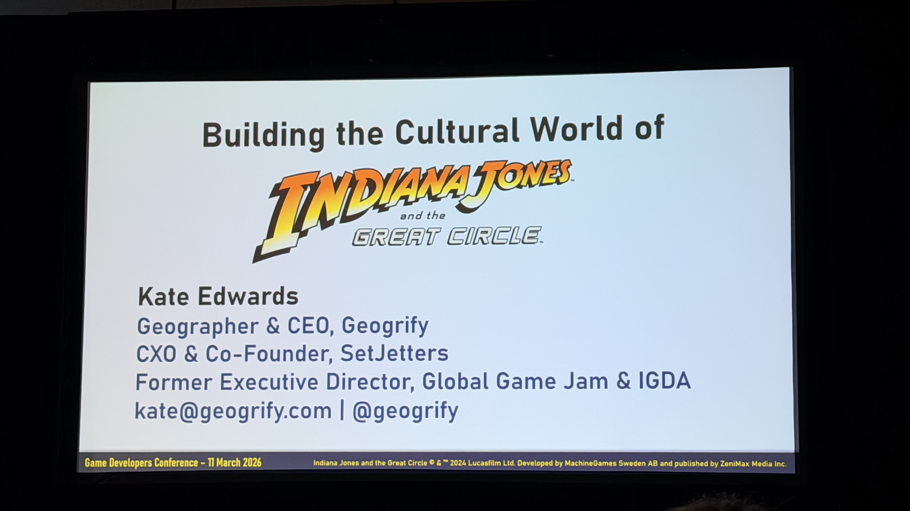

---

## Kate Edwards とは何者か

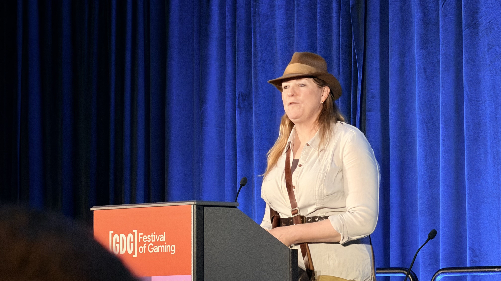

Kate Edwardsは地理学者であり、ゲーム業界歴33年のカルチャライゼーションのパイオニアです。Microsoftで13年間「Geopolitical Strategist（地政学ストラテジスト）」として、同社の全製品が世界各国の政治的・文化的感受性に抵触しないよう監修する役職を務めました。その後、IGDA（International Game Developers Association：世界最大のゲーム開発者団体、会員数は数万人規模）の事務局長を5年間務め、ゲーム開発者の権利擁護や業界の多様性推進に尽力しました。現在はGeogrify社CEOとして、世界中のゲームスタジオにカルチャライゼーションのコンサルティングを提供しています。

Edwards は「A few numbers…（いくつかの数字を）」とスライドを示しながら、自身のキャリアを数字で紹介しました。

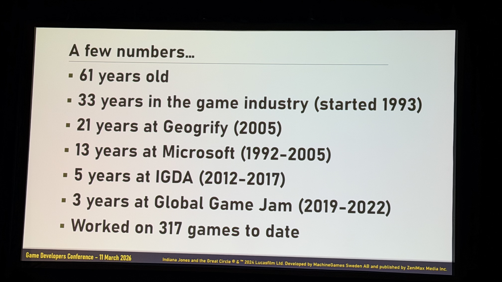

スライドには「61 years old / 33 years in the game industry (started 1993) / 21 years at Geogrify (2005) / 13 years at Microsoft (1992-2005) / 5 years at IGDA (2012-2017) / 3 years at Global Game Jam (2019-2022)」に加え、**「Worked on 317 games to date」** が列挙されています。33年間で317本——年間約10本のペースでゲームの文化監修に携わってきた計算です。

| キャリア項目 | 年数 |
|:---|:---|
| ゲーム業界歴 | 33年（1993年〜） |
| Geogrify（自社） | 21年（2005年設立） |
| Microsoft | 13年（1992〜2005年） |
| IGDA 事務局長（Executive Director） | 5年（2012〜2017年） |
| Global Game Jam 代表（世界同時開催のゲーム制作イベント） | 3年（2019〜2022年） |
| 携わったゲーム本数 | **317本** |

続いて、これまで携わった代表タイトルのロゴが一画面にずらりと並びます。

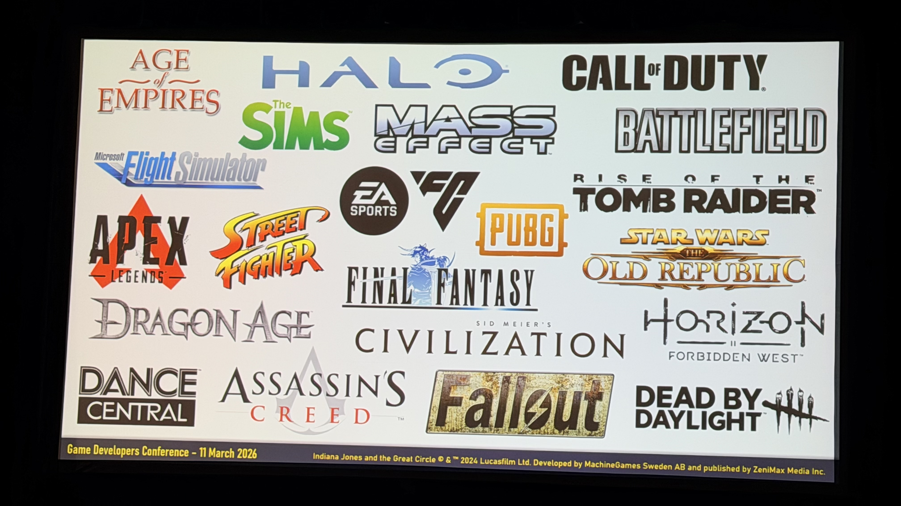

Age of Empires、Halo、Call of Duty、The Sims、Mass Effect、Battlefield、Microsoft Flight Simulator、EA Sports FC、Apex Legends、Street Fighter、PUBG、Rise of the Tomb Raider、Star Wars: The Old Republic、Final Fantasy、Dragon Age、Sid Meier's Civilization、Horizon Forbidden West、Dance Central、Assassin's Creed、Fallout、Dead by Daylight——AAAタイトルからインディーまで、ジャンルもプラットフォームも多岐にわたります。特に Age of Empires は29年来の関係で、シリーズの歴史表現をずっと監修してきたと語りました。

---

## プロジェクト参加の経緯

Edwards がこのプロジェクトに関わったのは3年以上前。Fallout 3 と Fallout: New Vegas で Bethesda との関係がすでにあり、Indiana Jones のプロジェクトが持ち込まれたとき「答えは一言で言えば Hell yes（地獄のイエス）でした」。

Edwards は1981年の映画公開時16歳で、ロサンゼルスの Grauman's Chinese Theatre で Raiders of the Lost Ark を初めて観た世代です。プレミア上映の前週のプレビュー上映のチケットスタブを今も保存しているほどの熱狂的ファンで「this is how much of a nerd I am（私がどれだけのオタクか）」と自嘲しながら語りました。

---

## セッションのテーマ

自己紹介を終えた Edwards は、ロサンゼルスの夕焼けのスカイラインを背景にしたスライドを映し出しました。

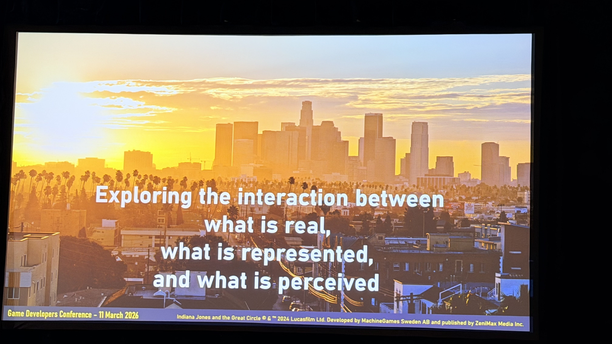

スライドには大きく **「Exploring the interaction between what is real, what is represented, and what is perceived」** と記されています。

> *（現実にあるもの、表現されるもの、そして知覚されるもの——その相互作用を探る）*

これが Kate Edwards の仕事の核心です。地理学者として、現実の地理（what is real）とゲーム内で表現される世界（what is represented）を照合し、プレイヤーがその世界をどう「読む」か（what is perceived）に意図を持たせる。背景のLAスカイラインも単なる風景ではなく、後述するGTA Vの「アレゴリー距離」の伏線になっています。

---

## 「カルチャライゼーション」とは何か

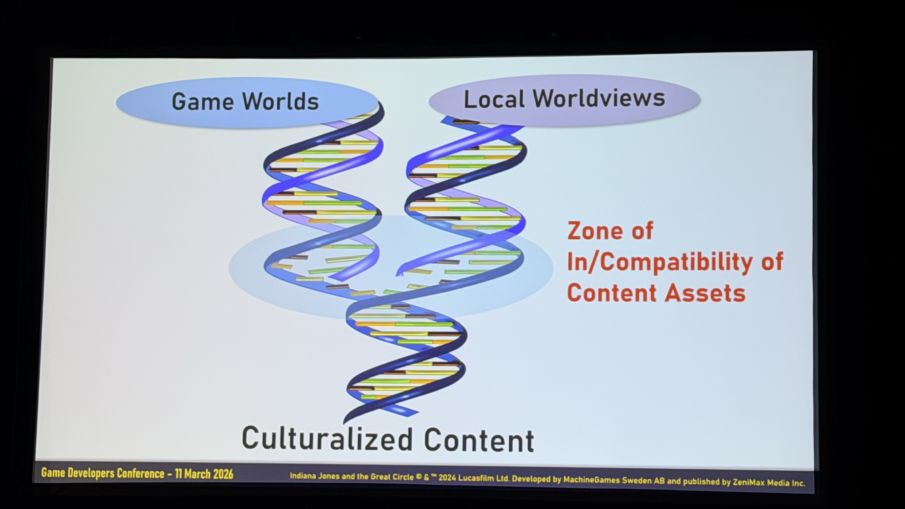

カルチャライゼーションとは、ローカライゼーション（Localization：言語翻訳を中心とした地域対応）の一歩先にある概念です。日本のゲーム業界では「ローカライズ」といえばテキスト翻訳・音声吹き替えが中心ですが、カルチャライゼーションはそこからさらに踏み込み、宗教・政治・歴史認識・ジェスチャーの意味など「言語では表せない文化の差異」を扱います。「Game Worlds（ゲームの世界観）」と「Local Worldviews（現地の世界観）」の二重らせんが交差することで、「Culturalized Content（文化化されたコンテンツ）」が生まれます。

この交差点の中に **Zone of In/Compatibility of Content Assets（コンテンツ資産の互換性ゾーン）** があり、Edwards の仕事はここを精査することです。

Edwards はこれを「遺伝子スプライシング（gene splicing：DNA の特定部分を切り出して別の配列に組み込む技術）」に例えます。ゲームのDNAを壊さずに、文化的に問題のある部分だけを正確に切り取り、適切なものに置き換えるという意味です。

> ゴールはゲームのクリエイティブビジョンを守り抜くこと。しかし、世界に届けるために必要な変更は外科的に（surgical：必要最小限の範囲で正確に）行う。

---

## The Challenge：インディ・ジョーンズという難題

Edwards が自身のファン歴を語った後、ゲームのキーアートが映し出されました。鞭を手にしたインディを中心に、女性キャラクター、丸眼鏡の敵役、ピラミッドやジャングルなど、複数のロケーションが描かれています。

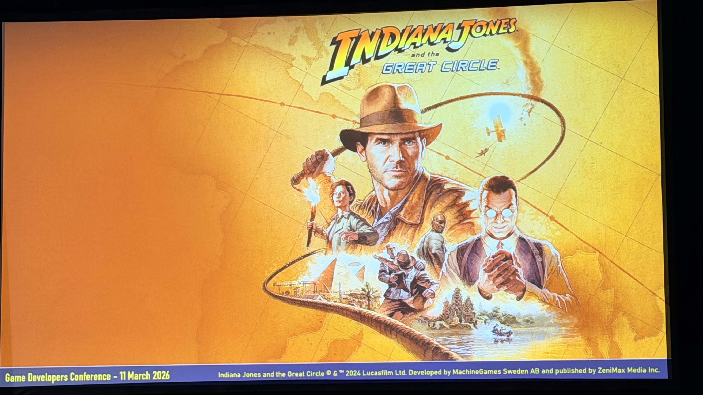

続いて「The Challenge」と題されたスライドで、このIPがカルチャライゼーションにおいて特別に難しい理由が整理されます。

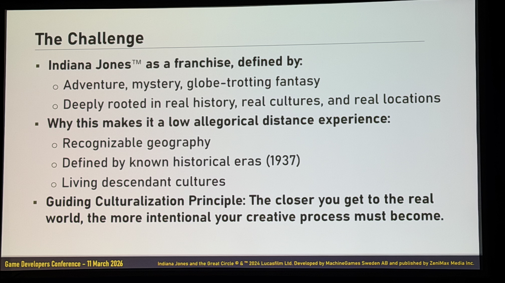

スライドには以下のように記されています：

- **Indiana Jones as a franchise, defined by:** Adventure, mystery, globe-trotting fantasy / Deeply rooted in real history, real cultures, and real locations
- **Why this makes it a low allegorical distance experience:** Recognizable geography / Defined by known historical eras (1937) / Living descendant cultures
- **Guiding Culturalization Principle:** The closer you get to the real world, the more intentional your creative process must become.

つまり、インディ・ジョーンズというIP（Intellectual Property：知的財産権。ここではキャラクターやストーリーなどのフランチャイズ全体を指す）は文化化において特別な難しさを持ちます。アドベンチャー・謎・世界旅行ファンタジーでありながら、**実在する歴史・文化・場所に深く根ざしている**（ゲームの舞台は1937年——「レイダース/失われたアーク」と「最後の聖戦」の間の年）。認識可能な地理、既知の歴史時代、そして**今も存在する子孫文化（Living descendant cultures）** を描くため、「アレゴリー距離（Allegorical Distance）」が小さく、文化的表現への要求が非常に厳しくなります。

Edwards は「最後の聖戦」の架空の国名 Kingdom of Hatay を例に挙げ「変な作り名だと言う人もいるが、映画の舞台である1938年にごく短期間存在した実在の国だった」と指摘——シリーズは常に現実に根ざしています。

日本のゲーム開発に置き換えると、例えば「戦国無双」や「龍が如く」のように実在の時代・場所を舞台にするタイトルが同様の課題に直面します。架空の世界を舞台にする場合よりも、はるかに高い文化的精度が要求されるのです。

---

## 「アレゴリー距離」という概念

Edwards はまず「アレゴリー」という言葉そのものの定義をスライドで示しました。

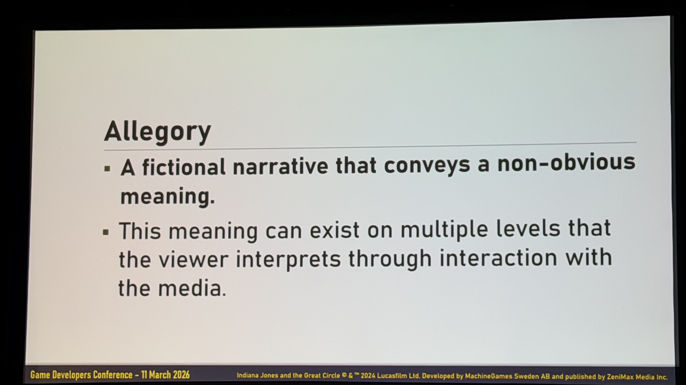

スライドには2つの定義が記されています：
- **A fictional narrative that conveys a non-obvious meaning.**（表面上の物語の裏に、自明ではない意味を込めた表現）
- **This meaning can exist on multiple levels that the viewer interprets through interaction with the media.**（この意味は複数のレベルで存在し、視聴者がメディアとのインタラクションを通じて解釈する）

Edwards は「寓話（fable）や教訓話（parable）は本質的にアレゴリーだ。ファンタジーの物語に包まれているが、実際には道徳的・倫理的な教訓を伝えている」と補足しました。日本の例では、『風の谷のナウシカ』における環境破壊の寓意がこれにあたります。

ここから Edwards が提唱する独自の概念 **「アレゴリー距離（Allegorical Distance）」** の説明に入ります。これは **「プレイヤーがゲーム内実装から元の現実世界のインスピレーションを知覚するために必要な努力の度合い」（degree of effort required for the player to perceive the original real-world inspiration from the in-game implementation）** です。この距離が近いほど「現実の文化をそのまま描いている」と受け取られやすく、距離が遠いほど「あくまでフィクション」として許容される余地が広がります。

カルチャライゼーションの原則として、**現実世界に近づくほど、クリエイティブプロセスはより意図的でなければならない（the closer you get to the real world, the more intentional your creative process has to become）** 。Edwards はこの概念を3つのゲームの具体例で説明します。

### 小さな距離：GTA V

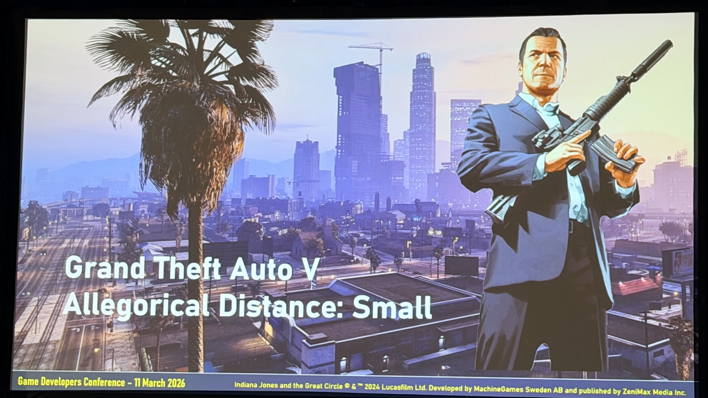

Los Santos がロサンゼルスであることは誰の目にも明らかです。ロサンゼルス出身の Edwards は「彼らはLAをLos Santosという架空の文脈に適応させる素晴らしい仕事をした。それでいて街の本質を捉えている（they still captured the essence of what that city is）」と評価。ストリートのNPCの横を歩くだけで「LAの路上で聞いたのと同じセリフが聞こえる」ほどだと語りました。**距離が小さいほど、精度へのハードルは高くなります。** 日本のゲームで例えるなら、「龍が如く」の神室町（歌舞伎町）がこれに近い関係です。

### 中程度の距離：Detroit: Become Human

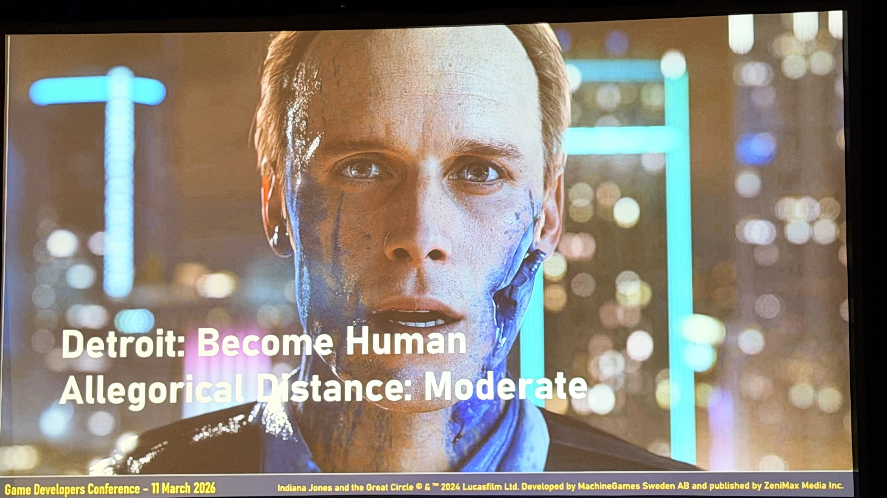

アンドロイドを用いた物語は、**「奴隷制度」** と「社会で人間扱いされない存在の権利」のアレゴリーです。物語を進むにつれてアレゴリーが明確になる——距離は「スタート時は広く、進むにつれて縮まる」構造です。

### 大きな距離：Horizon Zero Dawn

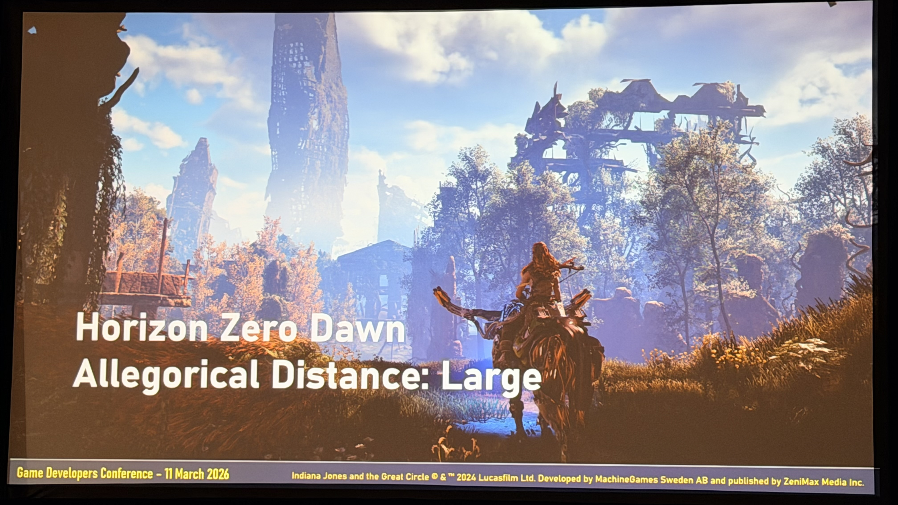

Edwards 自身が携わったタイトル。「億万長者の欲望、企業的な強欲、環境破壊（billionaires and corporate greed and the destruction of the environment）」というアレゴリーが世界観の奥深くに刻まれていますが、ゲームプレイの表面には強く出てきません。「なぜ興味深いバイオメカニカルなマシンが歩き回り、なぜ人類が滅び、なぜ都市が崩壊しているのか」は設定の奥にある——ナラティブデザイナーが意図的にそのバックストーリーを前面に出さない選択をした結果です。**距離が大きいほど、創作の自由度が高くなります。**

---

## リアル世界 vs 架空世界

Edwards は次に、すべてのゲームが「Real World（RW：現実世界）」と「Fictional World（FW：架空世界）」のスペクトラム上のどこかに位置するという概念図を示しました。

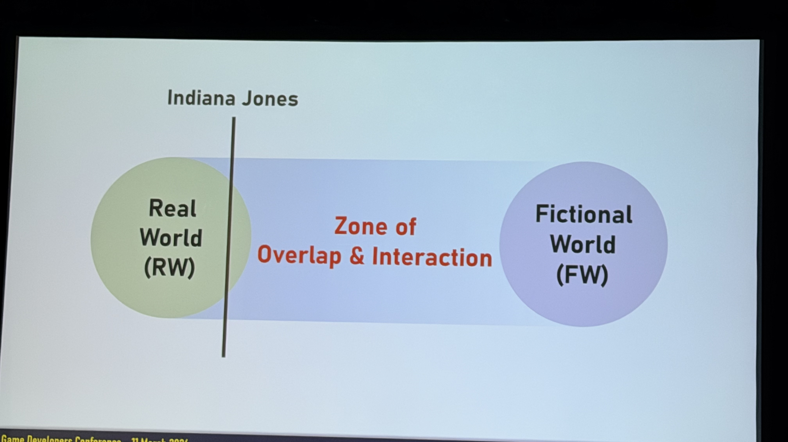

スライドでは左に **Real World (RW)**、右に **Fictional World (FW)** の円が配置され、中央に **「Zone of Overlap & Interaction」（重なりとインタラクションのゾーン）** が赤字で示されています。多くのゲームはこの二つの円のどこかに位置し、完全に現実でも完全にフィクションでもない——両者が流動的に混ざり合う領域で作られている、という考え方です。

**「Indiana Jones」** のラベルが付いた縦線は、RW の円の右端——ほぼ現実世界に位置しつつも、わずかに重なりゾーンに踏み出した位置に配置されています。Edwards は「アーク（聖櫃）を開けたら何が起きる？ クリスタル・スカルは？ ひょっとしてエイリアン？——いや、その話はやめておこう（Possibly aliens. Shut up. We're not gonna talk about that）」と会場の笑いを誘いながら、シリーズが常に現実に根ざしつつも少しだけフィクションに踏み出す構造を説明しました。

### 文化表現の目標の違い

Edwards は RW と FW で制作者が目指すべきゴールが根本的に異なることを、2枚のスライドで整理しました。

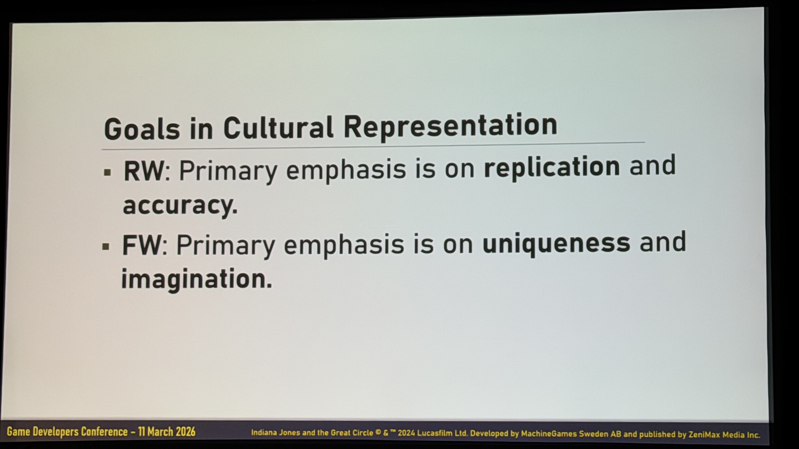

1枚目のスライド **「Goals in Cultural Representation」** では：
- **RW**: Primary emphasis is on **replication** and **accuracy**.（複製と正確性が主眼）
- **FW**: Primary emphasis is on **uniqueness** and **imagination**.（独自性と想像力が主眼）

Edwards は RW の例として Age of Empires を挙げ「29年間、実在の歴史を再現してきた。すべての戦闘が史実通りではないが、何が起きたかの感覚は伝わる」と説明。FW の例では Dragon Age シリーズを挙げ「中世ヨーロッパ風ファンタジーの中でもユニークな世界を作ることに注力した」と語りました。

| | Real World（RW） | Fictional World（FW） |
|:---|:---|:---|
| **文化表現の主眼** | Replication and accuracy（複製と正確性） | Uniqueness and imagination（独自性と想像力） |
| **プレイヤー体験の主眼** | Realism and an experience that feels authentic（リアリズムと真正性の感覚） | Escapism and an experience that enables discovery（現実逃避と発見の体験） |

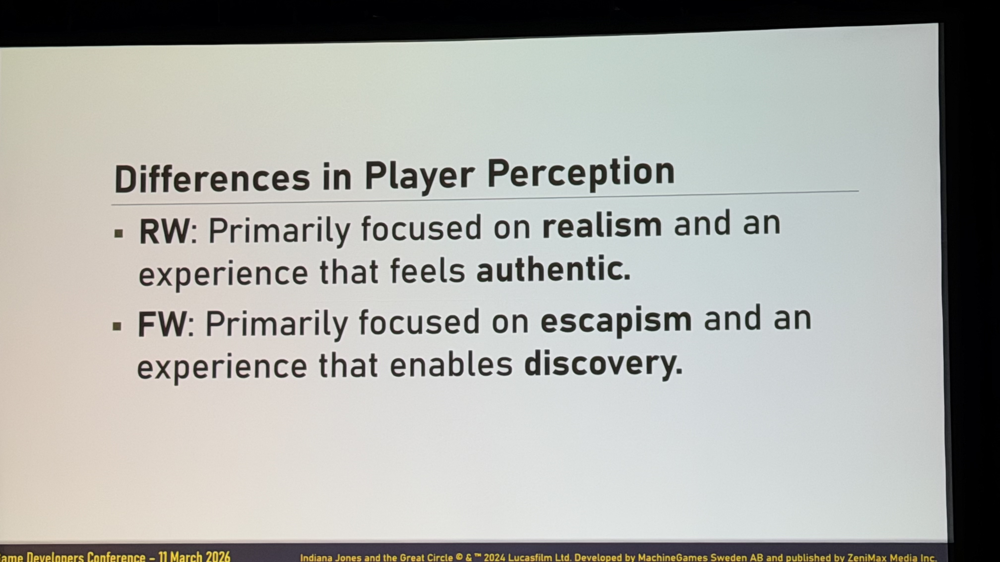

2枚目のスライド **「Differences in Player Perception」** では、プレイヤー側の期待が整理されています：
- **RW**: Primarily focused on **realism** and an experience that feels **authentic**.（リアリズムと真正性の感覚。「本物っぽい」ではなく「本物だ」と感じさせること）
- **FW**: Primarily focused on **escapism** and an experience that enables **discovery**.（現実逃避と発見の体験）

Edwards は Battlefield 6 での仕事を例に挙げ「架空の国（ワカンダやソコヴィアのような）を作り出すのではなく、現実の場所でなければならない。それがこのフランチャイズのプレイヤーが期待し求めるもの」と語りました。一方、FW の例では Zelda: Breath of the Wild を挙げ「どの方向に行っても何かを発見し、インタラクトできる。あの体験が素晴らしかった」と表現しました。

---

## Real World における3つの課題

ここからセッションは具体的な事例パートに入ります。スライドには **「Real World – Primary Issues:」** と題し、3つのキーワードがシンプルに列挙されています。

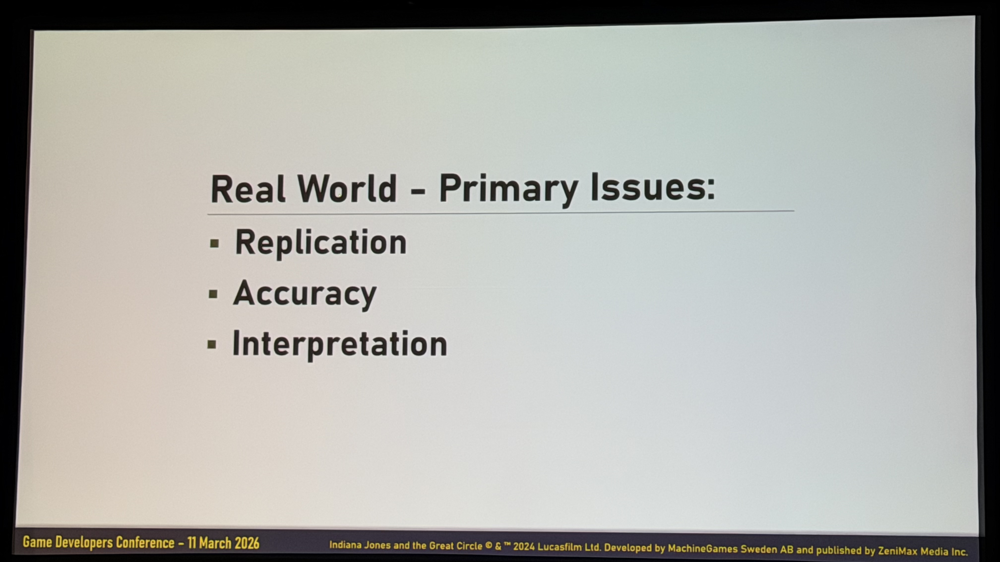

- **Replication**（複製）——現実の場所をどこまで忠実に再現するか
- **Accuracy**（正確性）——歴史上の人物・事実をどれだけ正確に描くか
- **Interpretation**（解釈）——現実のものをゲームに落とし込む際の文化的解釈の違い

Edwards はこの3つを軸に、Indiana Jones and the Great Circle の具体的な制作事例を紹介していきます。

### 1. Replication（複製）

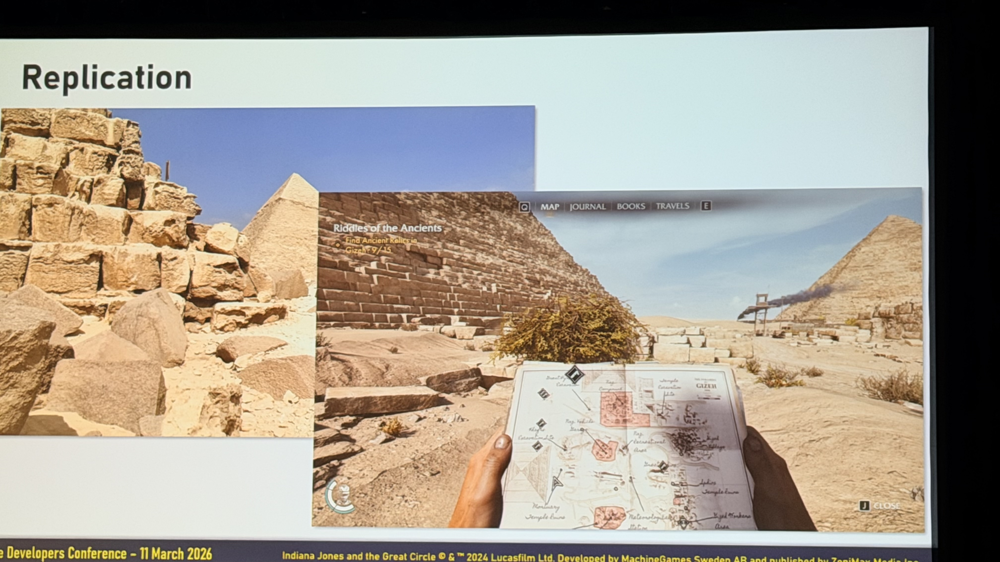

Edwards 自身がギザ高原で撮影した写真と、ゲーム内の同じ場所の再現。「かなりいい線いっている。彼らはギザ高原の再現に膨大な時間を費やした（it's pretty darn good. They did a great job replicating the Giza Plateau. They spent a tremendous amount of time on that work）」と評価しています。

ただし、複製においても配慮が必要です——宗教的なアーティファクト（artifact：遺物・工芸品。考古学的に発見された文化的価値のある物品）や文化的に重要な物体は、たとえ正確に複製できても「ゲーム内でプレイヤーがインタラクトしたり破壊したりできる」状態には置かない、という判断が求められます。日本のゲーム開発でも、神社の鳥居や仏像をゲーム内で破壊可能にすることへの抵抗感は容易に想像できるでしょう。

### 2. Accuracy（正確性）

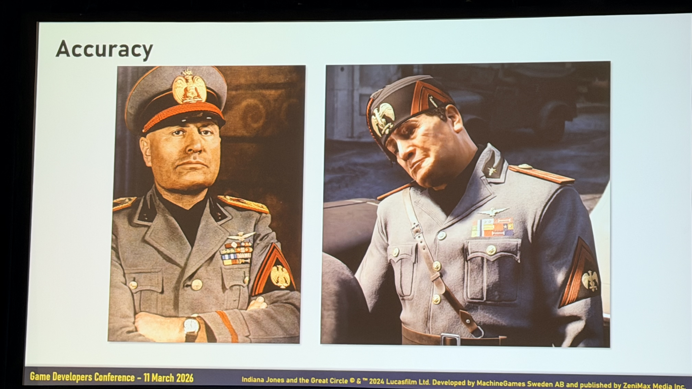

バチカンレベルには**ベニト・ムッソリーニが実際に登場**します。実在の写真をもとに、ゲーム内の外見を設計しました。Edwards はムッソリーニの実際の写真とゲーム内バージョンを比較し「かなり近い。同じパッチ、同じユニフォームのスタイル（Pretty darn close, same patches, same kind of uniform style）」と解説しました。

> 歴史上の実在する人物をゲームに登場させるときは、正確に再現しなければならない。今日のイタリアはもはや数十年前のようにムッソリーニを崇拝していないが、他の国には今でも「崇拝される人物」が存在する。そういうケースでは、法的な許可や遺族からの許諾が必要になることもある。

また、エッフェル塔のような有名ランドマークについても「フランス政府はエッフェル塔の描写に非常にセンシティブ。尖塔を2本にしたり、半壊させたりすると問題になり得る」と具体例を挙げました。

### 3. Interpretation（解釈）

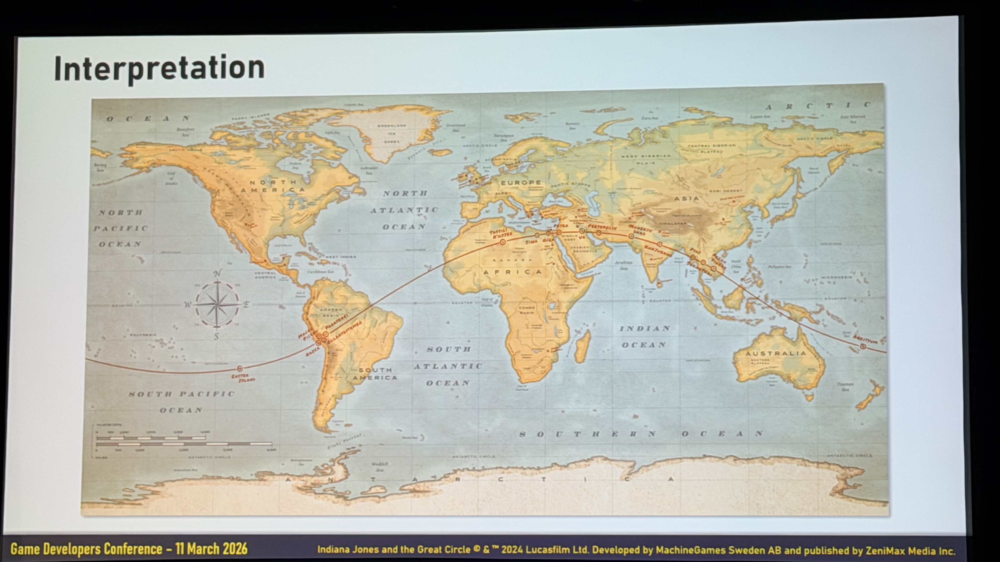

現実のものをゲームに落とし込む「解釈」の仕方は、文化・国によって異なります。Edwards は Age of Empires での経験を例に挙げました——「ある国でゲームをリリースするために、シナリオの歴史を変更しなければならなかった。なぜなら、その国の歴史の教科書では『そんなことは起きていない』とされているからだ。その国以外の世界中の歴史書にはそう書いてあるにもかかわらず（Even though every history book outside the country says it did）」。これは日本のゲーム開発者にとっても身近な問題です。例えば、第二次世界大戦を扱うゲームでは、日本・中国・韓国・欧米で歴史認識が大きく異なり、同じ出来事でも国ごとに表現を変える必要が生じます。

### Indiana Jones の世界観の制約

Edwards は「The World of Indiana Jones…」と題したスライドで、ここまでの議論をインディ・ジョーンズに適用した4つの制約をまとめました。

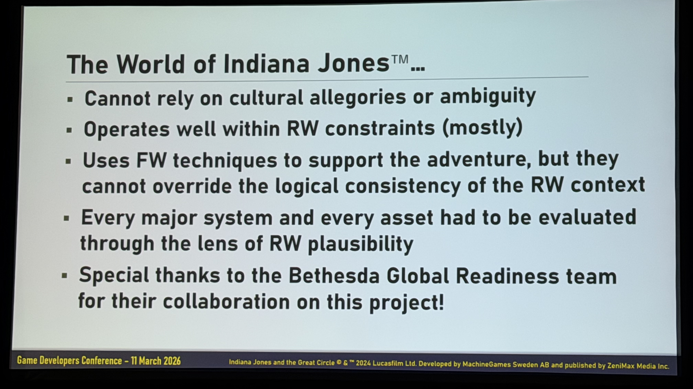

スライドの記載内容：

- **Cannot rely on cultural allegories or ambiguity**（文化的アレゴリーや曖昧さに頼れない）——Horizon Zero Dawn のように「実はこういう寓意がある」という距離感は取れない
- **Operates well within RW constraints (mostly)**（ほぼ RW の制約の中で動く）——先ほどの概念図で示した「RW寄り」のポジション
- **Uses FW techniques to support the adventure, but they cannot override the logical consistency of the RW context**（FW の技法でアドベンチャーを支えるが、それは RW の論理的一貫性を覆せない）——聖櫃やグレートサークルのようなフィクション要素はあっても、1937年の世界のリアリティを壊してはならない
- **Every major system and every asset had to be evaluated through the lens of RW plausibility**（すべての主要システム・アセットを「RW における現実妥当性」のレンズで評価しなければならなかった）
- **Special thanks to the Bethesda Global Readiness team for their collaboration on this project!**

Bethesda Global Readiness チームとは、Bethesda 社内でゲームのグローバル展開における文化的・法的・政治的リスクを管理する専門チームです。Edwards の外部コンサルティングと社内チームの協力体制で、このプロジェクトのカルチャライゼーションが進められました。

---

## The Maps

セッションは具体的な制作事例に入ります。ゲームのキーアートを背景に **「The Maps」** と大きく表示されたセクションタイトルスライドが映し出されました。

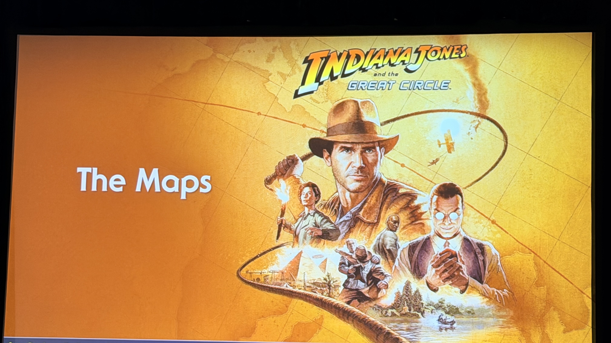

Edwards がこのプロジェクトに招かれた最初のきっかけが**フライオーバーマップ（flyover map：映画版インディ・ジョーンズでおなじみの、移動シーンで飛行機のルートが赤い線で描かれる地図演出）の制作**でした。地理学者である Edwards にとって、地図こそが最初の出番だったのです。

### Great Circle = Orthodrome

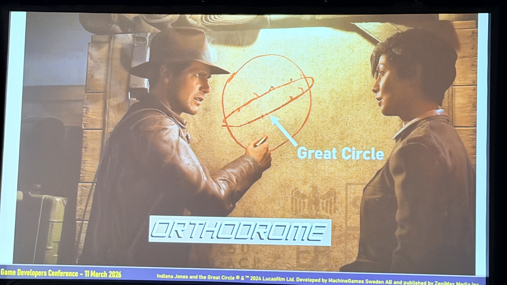

タイトルの核となる「グレート・サークル」は**実在する地理学的概念**です。地球を最大の円周で切ったときにできる弧——すべての経線はグレートサークルで、赤道もグレートサークルです。カートグラフィー（cartography：地図学・地図製作術）の技術用語では **Orthodrome（正距圏）** と呼ばれます。

> 「インディ・ジョーンズと正距圏」はさすがに……。「グレート・サークル」の方がかっこいい。

世界中の古代遺跡を結ぶグレートサークルが存在するという設定は**フィクション**ですが、地理学的概念そのものは本物です。

### フライオーバーマップのデザイン方針

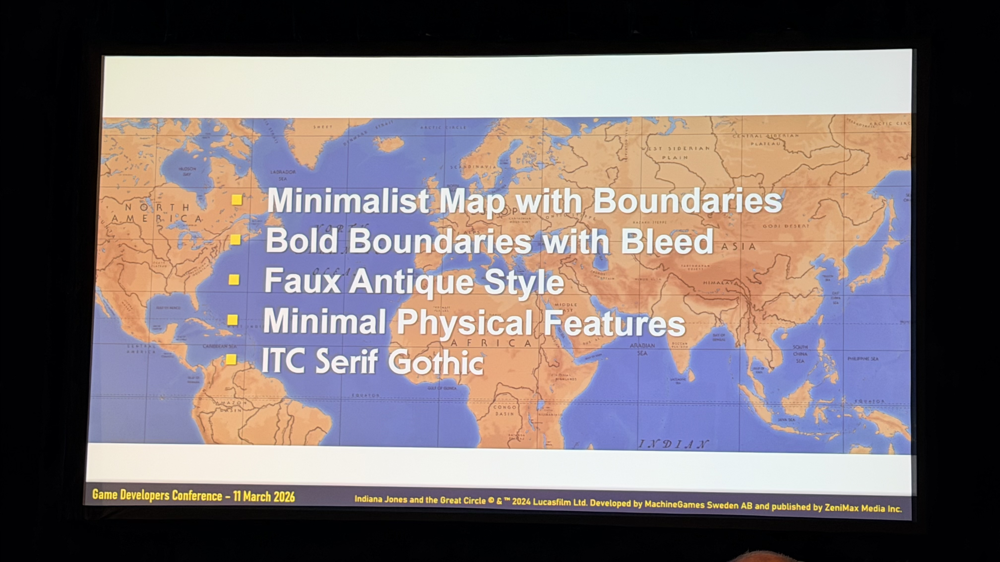

Edwards がプロジェクトに招かれた最初の仕事はベースマップの監修でした。MachineGames から初期のベースマップが届いたとき、そこには「レイダース/失われたアーク」の地図で使われた正確なフォントが使用されていました。Edwards は「これで MachineGames がこのゲームを作る絶対に正しいチームだと確信した。彼らはミッションを理解している（They understand what the mission is here）」と語りました。

映画版フライオーバーマップの特徴：

| 要素 | 内容 |
|:---|:---|
| **スタイル** | Minimalist Map with Boundaries（境界線付きのミニマルデザイン） |
| **境界線** | Bold Boundaries with Bleed（太い境界線。ブリード=線の外側ににじみを持たせる表現） |
| **感触** | Faux Antique Style（人工的にアンティーク感を出した仕上げ） |
| **物理的特徴** | Minimal Physical Features（山脈・河川などの地形表現は最小限） |
| **フォント** | **ITC Serif Gothic**（映画ごとに使い方に若干の不整合があったが、基本はこのフォント） |

### 1937年の世界地図の再現

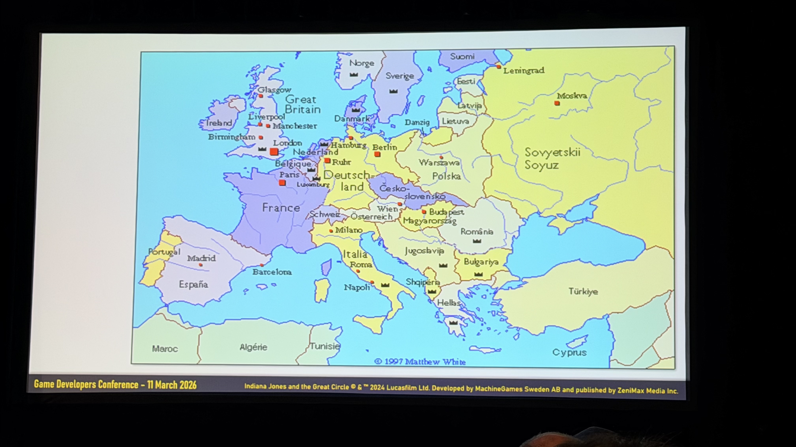

1937年はナチス・ドイツが急速に拡大し、欧州の国境が年単位・月単位で変動していた時期。Deutschland（ドイツの自国語表記）、Sovyetskii Soyuz（ソビエト連邦のロシア語表記）、Espana（スペインの自国語表記）など、当時の各国を自国語で表記する方式で精確な地図を調査しました。

### 歴史的航空路線の調査

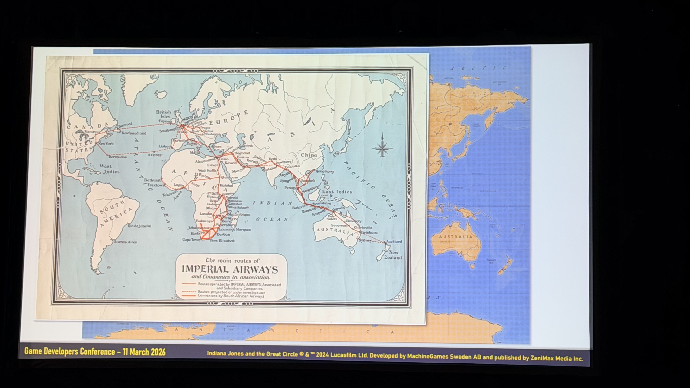

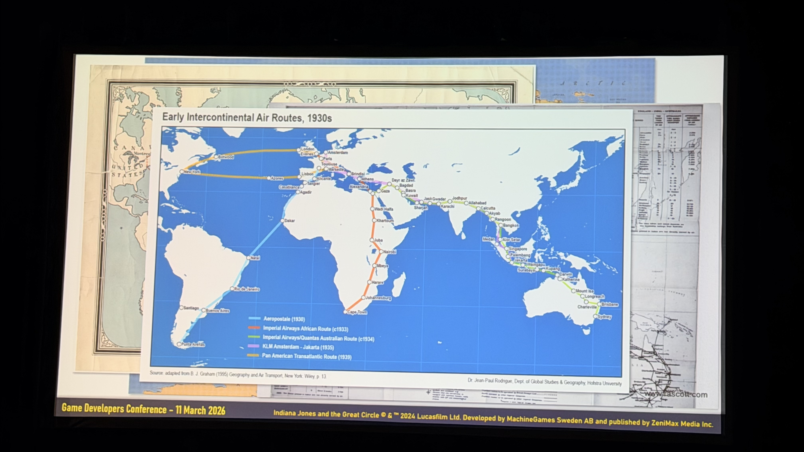

1930年代の実際の航空路線（Imperial Airways など）を発掘・研究。当時の航空機は航続距離が非常に短く、実際には大量の経由地が必要でした——しかしゲームのフライオーバーマップで全経由地を表示するわけにはいかない。

> Raiders of the Lost Ark（「レイダース/失われたアーク《聖櫃》」：インディ・ジョーンズ映画シリーズ第1作、1981年）では、インディが China Clipper 機に乗ってサンフランシスコを離れるシーンでゴールデン・ゲート・ブリッジの上を飛びますが、映画では橋が完成した状態で描かれています。しかし映画の舞台は1936年であり、橋の完成は1937年でした。（"In 1936, it was not finished yet. It was finished in 1937. Oops."）私たちはその間違いを繰り返さないようにしました。

また、境界線については——**最終的に表示しない**という判断がなされました。1937年の境界線を正確に再現すると、現在の政治的センシティビティ（political sensitivity：国境問題や領土紛争など、各国政府が強く反応する政治的に敏感な事項）に抵触するためです。Edwards は「残念だが、境界線に関するすべての作業は表示されないことになった。いつか別の形で日の目を見るかもしれない（Maybe that'll show up again someday in another form）」と語りました。これはカルチャライゼーションの典型的な判断の一つで、歴史的正確性よりも現在のグローバル市場での安全性を優先した例です。

### ゲーム内ワールドマップ（完成版）

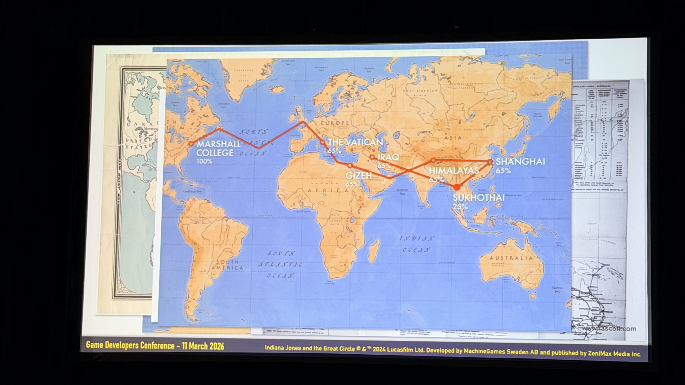

ゲーム内の主要ロケーションは以下の通りです：

| ロケーション | 進行率 |
|:---|:---|
| Marshall College | 100% |
| The Vatican | 65% |
| Iraq | 65% |
| Gizeh（ギザ） | 65% |
| Himalayas（ヒマラヤ） | 65% |
| Shanghai（上海） | 65% |
| Sukhothai（スコータイ） | 25% |

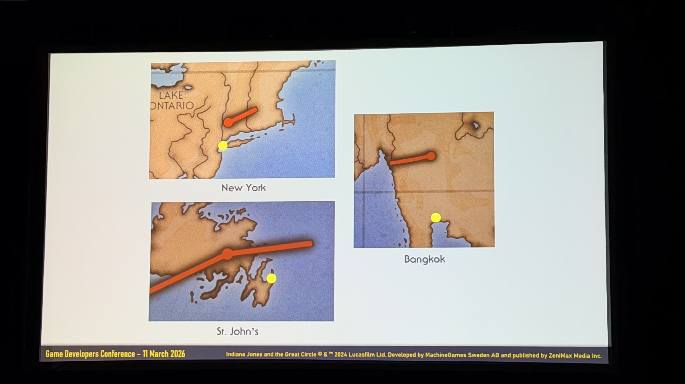

各都市のローカルマップも同様のアンティーク風スタイルで統一されています。

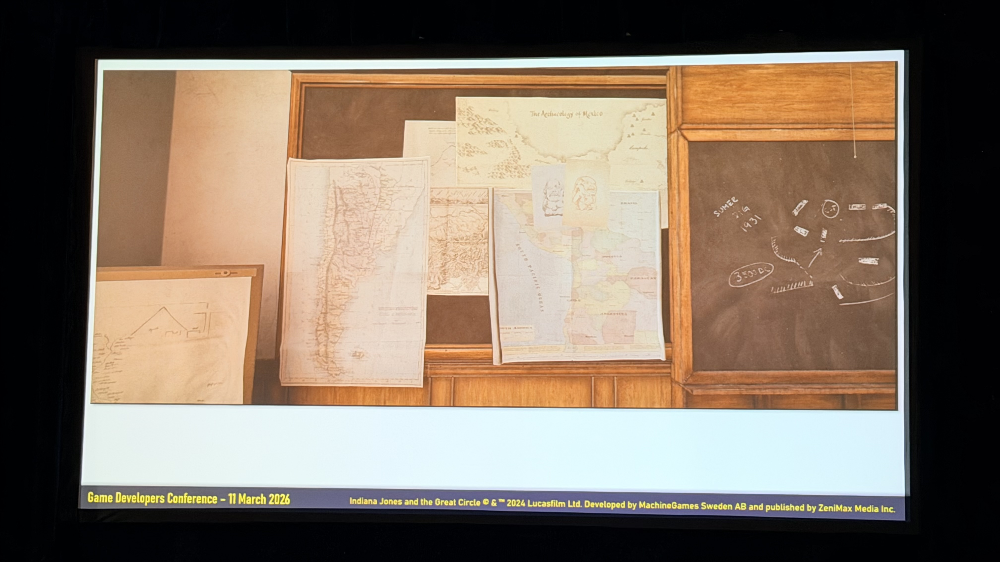

オフィスの壁に掛けられた地図まで、1937年当時の精度で作成しました。Edwards は壁に掛かった南米の地図を調査し「これらの地図のいくつかは実は時代が合わない。1937年以降に作られた地図だった（a couple of these maps were actually too late）」と発見。環境内の小道具である地図まで時代考証を行い修正しました。

> 本当に深いところまで入り込んだ。誰にもスクリーンショットを撮って「ほら、間違ってる」と指摘されないように。ほとんど強迫観念に近いレベルで意識していた。（We were kind of conscious of that almost to obsession.）

また、コレクターズエディションの地球儀のデザインも Edwards が担当しました。磁石の小さな飛行機をグレートサークルに沿って動かすと、地球儀が開いてジャーナルが出てくるという仕掛けです。

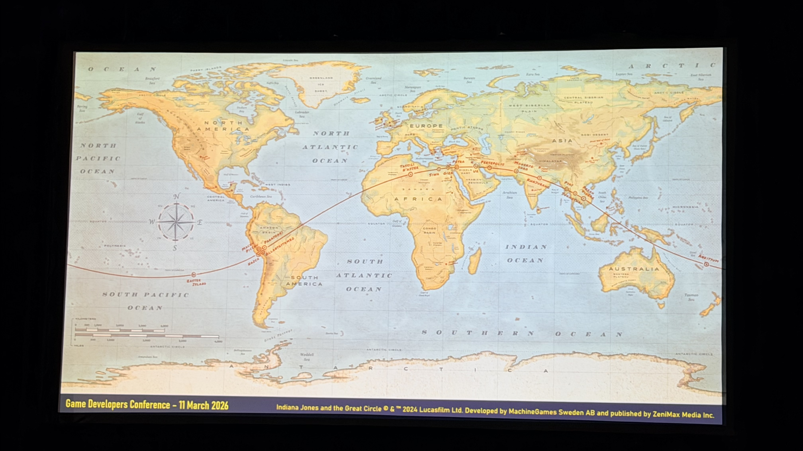

---

## The Environments

マップの話題を終え、セッションは次のセクション **「The Environments」** に移ります。キーアートを背景にしたセクションタイトルスライドが映し出されました。ここからは各ロケーションの環境アート・建築・文化考証の話になります。

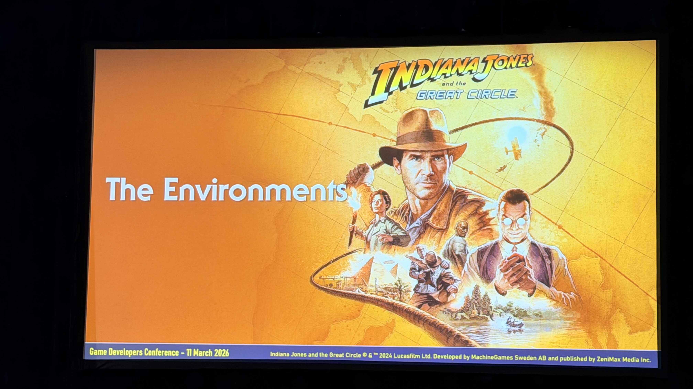

### バチカン

バチカンのレベルについては、実際にバチカンの関係者から「これはバチカンの非常に優れた再現だ（wow, this is a really great recreation of the Vatican）」という称賛を受けたと Edwards は語りました。1930年代のファシスト・イタリア時代のバチカンを正確に再現するため、外部コンサルタントと協力して場所と時代の両方の正確性を確保しました。

### タイ（スコータイ）

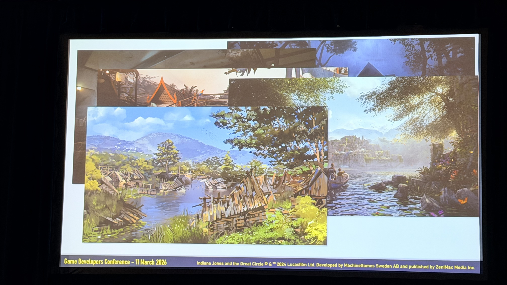

タイのレベルではナラティブ上、地下神殿が必要でしたが、タイ考古学コンサルタントの Amornrat Jingwaja は「タイでは水位（water table）が高いため、特に沿岸部では地下構造物を作らなかった」と指摘。これは若干のクリエイティブ・リバティを取り「もし彼らが作っていたら？（What if they did?）」という仮定のもとに進めた例です。

### エジプト：考古学的研究をもとにした地下環境

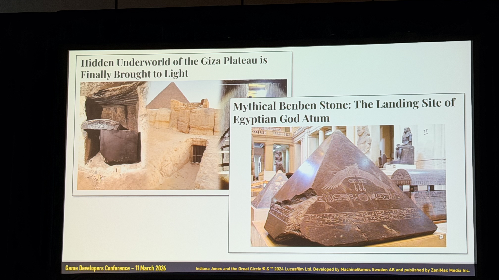

スライドには「Hidden Underworld of the Giza Plateau」（ギザ高原の隠された地下世界）や「Mythical Benben Stone」（神話的ベンベン石）に関する実際の考古学的記事のスクリーンショットが並んでいます。開発チームはこうした最新の考古学研究を出発点にして、ゲームの地下環境を設計しました。

次の2枚のスライドでは、実際のエジプト神殿の写真とゲーム内の同じ場所の再現を並べて比較しています。

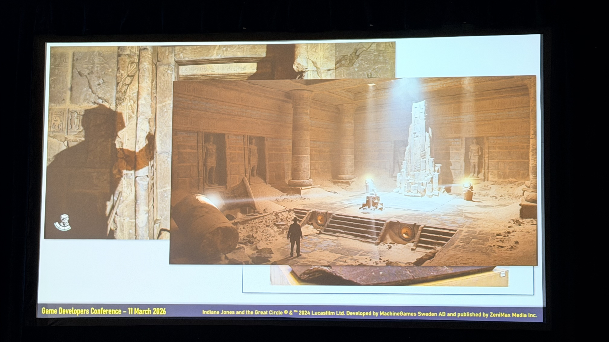

左が実際の神殿の柱列・壁面レリーフの写真、右がゲーム内の同じ空間。色調・柱の間隔・壁面装飾の密度まで忠実に再現されていることがわかります。

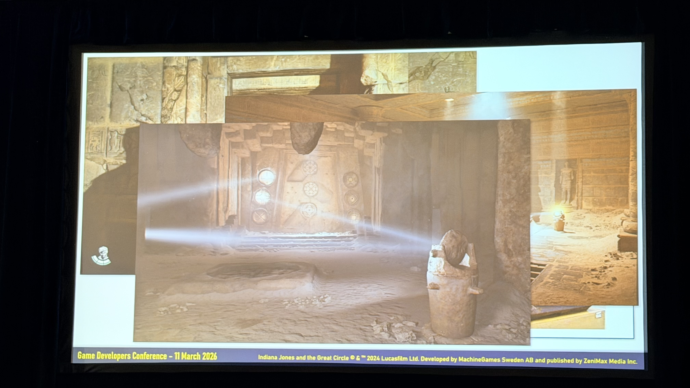

こちらは神殿内部の通路の比較。天井の高さ、壁面の彩色、照明の入り方まで写真資料をベースに構築されています。

しかし、見た目の再現だけでは十分ではありませんでした。あるパズルの機構をめぐって、エジプト学者から重要な指摘がありました。デザイナーが作ったパズルメカニズムに対し「エジプト人はこの技術を持っていなかった。これは現実的ではない（the Egyptians never had this technology. This makes no sense）」。しかし単に否定するだけでなく、エジプト学者はこう提案しました——「エジプト南部のある墓で、我々が発見したがまだ正確な仕組みがわかっておらず、現在学術界で熱い議論になっているものがある。それを出発点にしてはどうか（there's something that we found and we don't know exactly how it works and it's being hotly debated in academia right now）」。こうして、実在する未解明の考古学的発見という「真実の核（kernel of truth）」を起点にフィクションを構築しました。

エジプト学者たちはギザの地下トンネルの実際の見た目についても助言し、「こんなに大きくない」「通路はこういう作り方をしない」といった具体的なフィードバックを提供。最大4人のエジプト学者が同時にこのゲームに参加していた時期もありました。

---

## ヒエログリフ：壁のテキストは本物

Edwards はヒエログリフのパズル設計図を映し出しました。「IDOL OF RA」「HIEROGLYPH 1」「HIEROGLYPH 2」「PEDESTAL」とラベルが付けられた配置図で、パズル内のヒエログリフの位置関係が示されています。

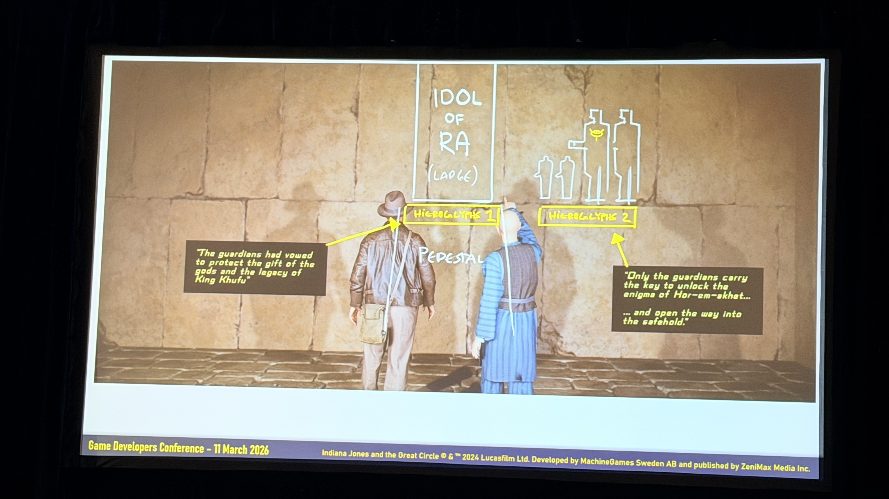

Edwards は「プレイヤーが必ず何をするかはわかっている——壁に書かれたものは何でもスクリーンショットを撮って解読しようとする。秘密のメッセージがあるはずだ、無料の何かを手に入れるコードかもしれない、と（I'm going to screenshot it and decipher what it said. There's a secret message there. Maybe it's a code to get a free something）」と笑いながら語りました。だからこそ、壁の文字には本物の意味を持たせました。

次のスライドで、その翻訳プロセスの具体例が示されます。

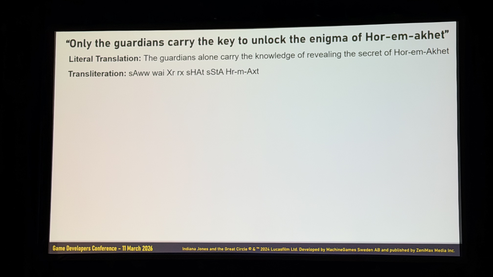

スライドには英語のテキストとその音声転写が並んで表示されています：

> **English**: *Only the guardians carry the key to unlock the enigma of Hor-em-akhet*
>（守護者のみが Hor-em-akhet（ホルエムアケト＝大スフィンクスの古代エジプト語名）の謎を解く鍵を持つ）
>
> **Transliteration**: *sAww wai Xr rx sHAt sStA Hr-m-Axt*

さらに次のスライドでは、この一文を構成する個々のヒエログリフ記号が分解表として示されます。各記号の音価・意味・機能（表意文字か表音文字か）が一覧になっています。最終的にゲーム内に実装された完成形では、壁面に刻まれた状態で実際のエジプト語として意味を持つテキストになっています。

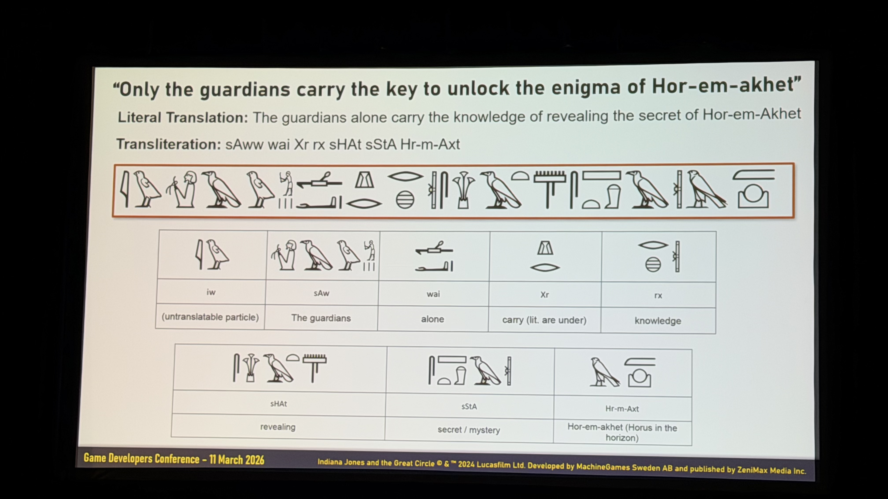

プロセス：
1. ナラティブチームが英語テキストを決定
2. エジプト語専門家がヒエログリフに翻訳
3. 音声転写（Transliteration）に変換
4. 個々のヒエログリフに分解
5. 壁面デザインに落とし込む

> エジプトレベルだけでなく、ゲームの他のパートでもこの作業を何度も何度も繰り返した。絶対に正確でなければならなかった。（We did this so many times. So many times throughout that level and in other parts of the game as well.）

---

## NPC デザイン：実写資料から設計する

Edwards は次に、エジプトの群衆キャラクターのコンセプトアートを映し出しました。ターバンやガラベーヤ（エジプトの伝統的長衣）を着た男性、ヒジャブを被った女性など、多様な服装・体型の NPC デザインが並んでいます。

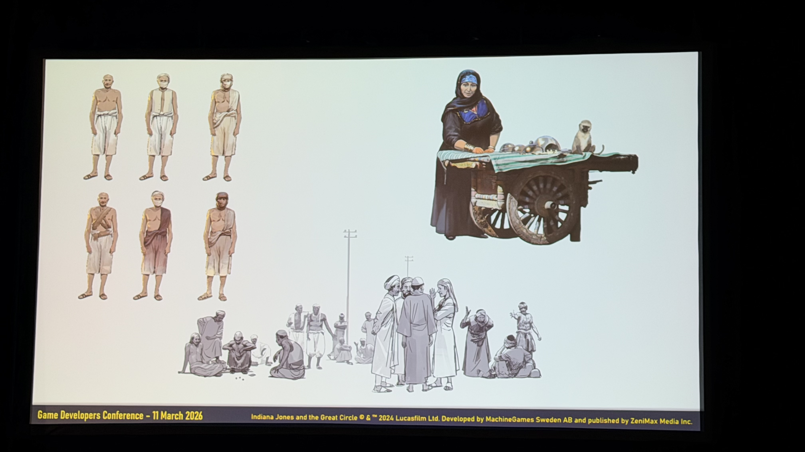

続いて、これらのデザインの元になった1900年代初頭のカイロの実写写真がスライドの左半分に、ゲーム内のキャラクターが右半分に配置されます。

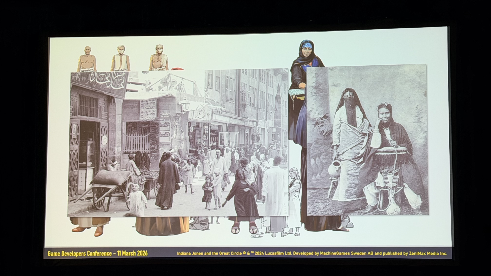

1937年のカイロで出会う NPC（Non-Player Character：プレイヤーが操作しない、ゲーム内の住民や通行人などのキャラクター）たちの外見は、**当時の実際の写真資料**をもとにデザインされました。1930年代のカイロやエジプト各地の古い写真を大量に調査し、「典型的と言えるもの」をモデリングしました。バチカンのレベルでも同様に、1930年代のファシスト・イタリア時代に合った衣装を着用しています。衣装だけでなく、アクセントやキャラクター表現のあらゆる側面にまで同様の精度で調査が及んでいます。

---

## The Artifacts

セッションは3つ目のセクション **「The Artifacts」** に進みます。環境の次は、その環境の中に配置される「モノ」——文化的アーティファクトの話です。

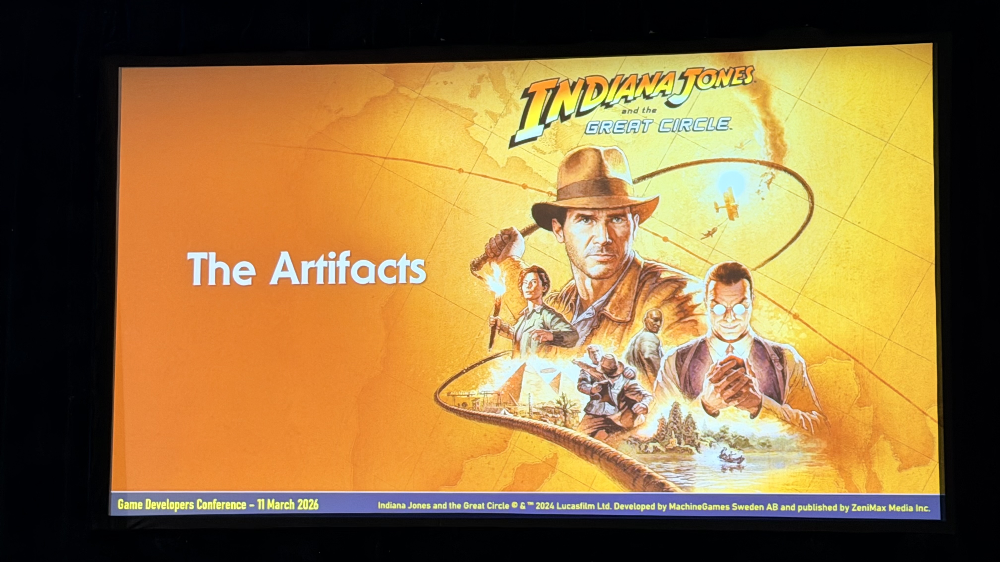

まず、ゲーム内で猫のミイラを手にするインディのスクリーンショットが映し出されました。プレイヤーがインタラクトする文化的オブジェクトには、環境以上に慎重な考証が必要になります。

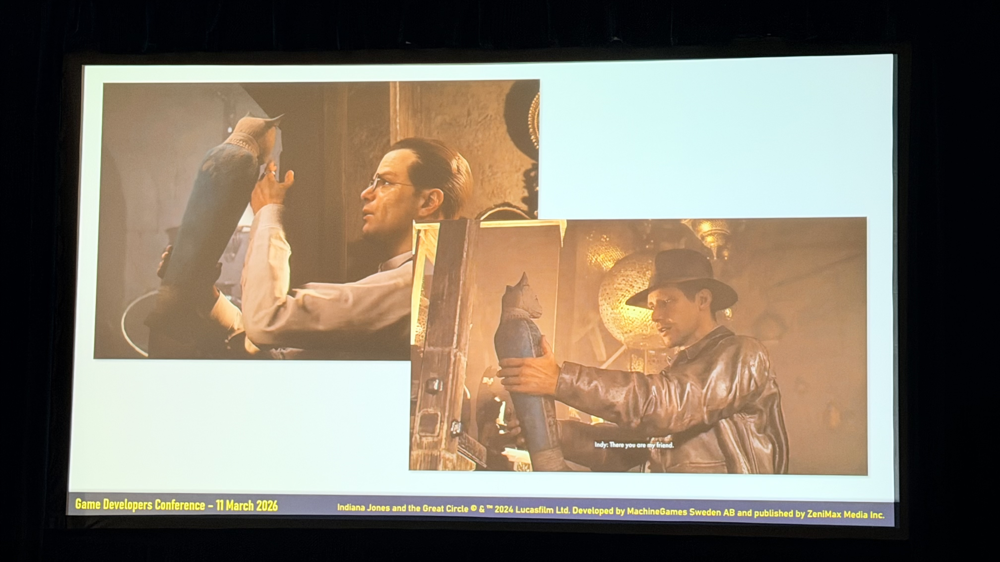

### 猫のミイラ（Cat Mummy）（エジプト）

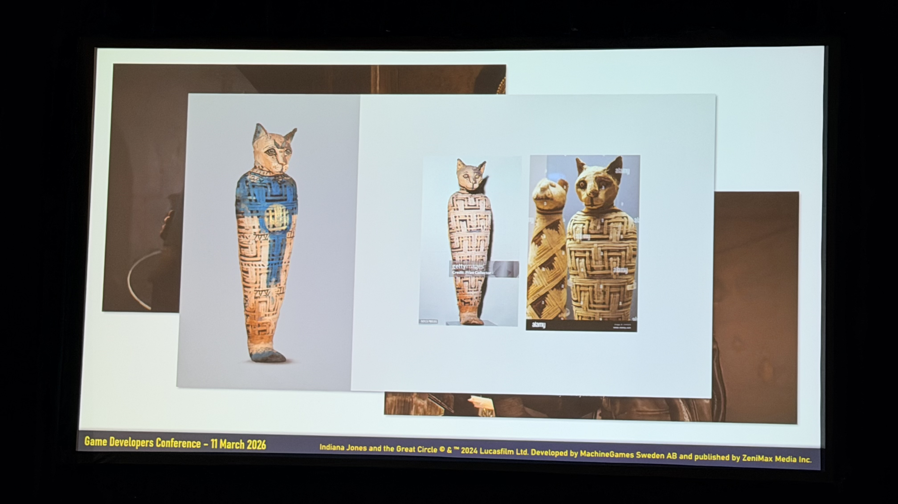

エジプトレベルのキーアーティファクトは**猫のミイラ（cat mummy）** です。この中にメインストーリーのフィクショナルなレリックの一つが隠されています。実在の猫のミイラ——大英博物館やカイロのエジプト博物館にあるもの——を参考にしつつ、完全なコピーは避けました。

> 一部の国には、実在する文化財の複製に関する法律があります（in some countries, they are very sensitive. In some cases, they even have laws about replicating actual real artifacts）。「誰が見ても猫のミイラだとわかるが、ユニークなデザイン」——真正性（authenticity：その文化に由来する本物らしさ）と独自性を両立させました。

### タイのアーティファクト（スコータイ）

スライドにはタイ・クメール様式の石像の参考写真が複数並んでいます。ナーガ（蛇神）の石彫、シンハ（獅子）像、仏陀坐像など、スコータイ〜アユタヤ時代の様式の実物写真です。

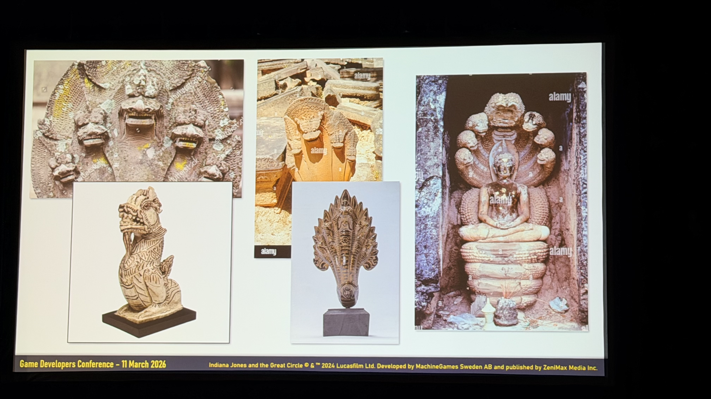

次のスライドでは、これらの参考資料をもとにゲーム内に実装されたナーガ頭部像のスクリーンショットが映し出されました。多頭蛇の装飾的な造形が、参考写真の様式を踏襲しつつゲーム向けにアレンジされています。

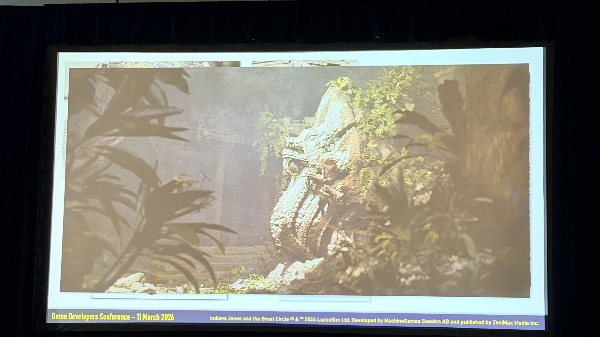

### エジプトのアーティファクト参考資料

スライドにはエジプトの装飾品・副葬品の写真がずらりと並びます。金の円形ペンダント、カルトゥーシュ（王名を囲む楕円形の枠）付きの護符、スカラベ（フンコロガシの形をした護符で、再生と太陽を象徴する）、ウシャブティ（来世で主人の代わりに労働する小像）などです。

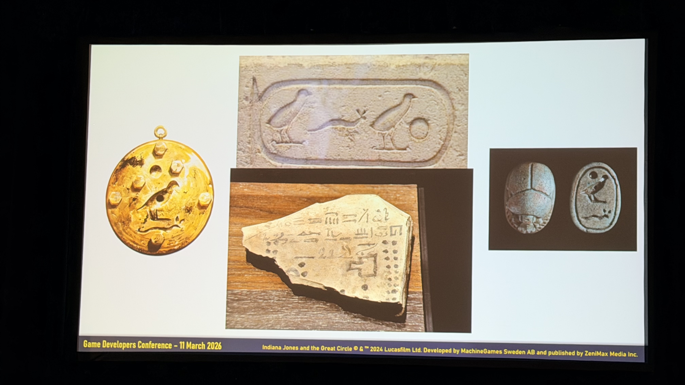

### 世界各地の参考資料

エジプトに限らず、ゲーム内に登場するすべての文化圏のアーティファクトについて同様のリサーチが行われました。スライドにはバイキングのルーン石碑、メソポタミアの粘土板、ベナン（西アフリカ）のブロンズ像、アフリカ各地の仮面など、多文化のアーティファクト写真が並んでいます。

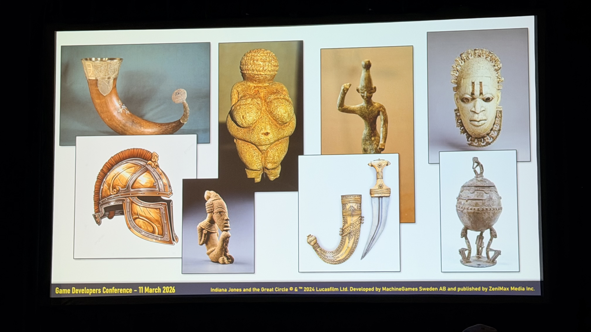

---

## The Relics：17種の架空のレリックと地質学的考証

スライドには石製のレリック——手のひらサイズの彫刻された石のオブジェクト——が複数並んでいます。これらはすべてゲームオリジナルの架空アイテムです。

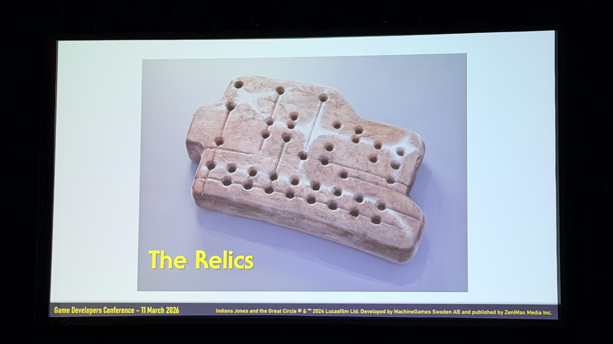

ゲームの中心的な収集要素は **17種類の架空のレリック**。プレイヤーはグレートサークル上の各考古学的サイトで集めていきます。The Giant's Pendant、The Giant's Key など——すべて「その時代・その場所に由来しそう」に見えるよう設計されています。

次のスライドでは、各レリックに割り当てられた鉱物種が図解されています。レリックのイラストの横に、それぞれの素材となる鉱物名がラベル付けされています。

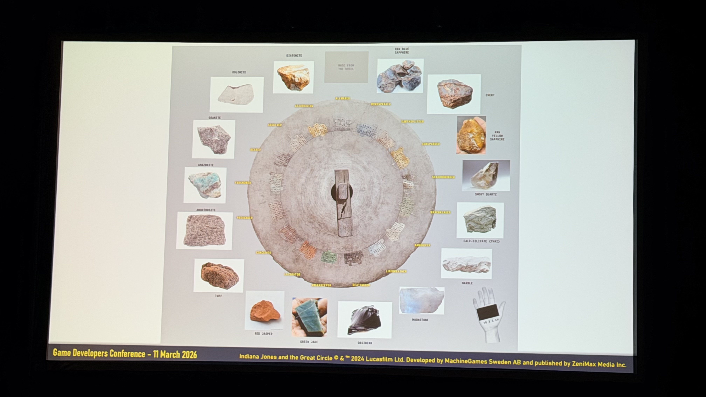

ナラティブチーム（narrative team：ゲームのストーリー・世界観・テキストを統括するチーム）は各レリックに鉱石の種類を割り当てていました。Diatomite（珪藻土）、Dolomite（苦灰石）、Blue Sapphire（青サファイア）、Chert（チャート）、Granite（花崗岩）、Amazonite（天河石）、Moonstone（月長石）、Obsidian（黒曜石）、Red Jasper（赤碧玉）、Green Jade（翡翠）、Marble（大理石）、Smoky Quartz（煙水晶）など多様な鉱物が対応付けられました。

しかし、あるとき誰かがこう尋ねました——「これらの鉱石は、ゲームで見つかる場所に**実際に産出する可能性**があるのか？」

### 古代交易路の調査

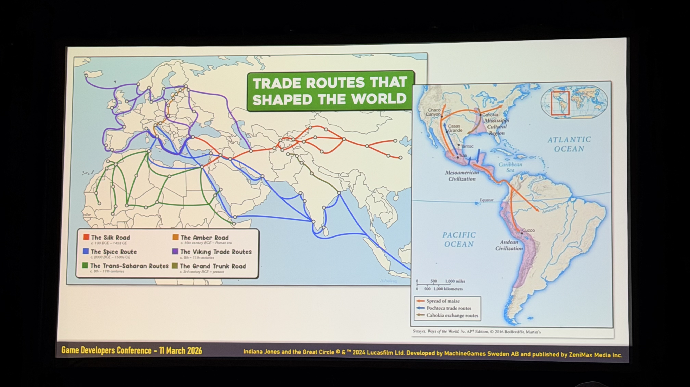

シルクロード、スパイスルート（香辛料交易路）、Trans-Saharan Routes（サハラ縦断交易路）、Amber Road（琥珀の道：バルト海から地中海への交易路）、Viking Trade Routes（ヴァイキング交易路）、Grand Trunk Road（グランド・トランク・ロード：南アジアの大幹線道路）——各鉱石が古代においてその地域に届く可能性があるか、歴史的交易路線をもとに精査しました。

結果：いくつかの鉱石は **「可能性ゼロ」** と判定され変更。「でも黄色くないといけない」というナラティブ側の制約のもと、その地域で産出する黄色い鉱石を再調査しました。

> 実は私の父は地質学者として数十年教鞭を取っていました。このプロジェクトで最初に電話したのは父でした。**父は現在88歳で、ゲームのクレジットに名前が載っています（Randy Edwards）。** 架空のストーンの鉱物種について長電話で議論した——最高でした。ただ、ある時点で父は「もう覚えてない。現場の地質学者を見つけなさい（I don't remember. You need to get a field geologist to help you out）」と言いました。引退して久しかったのです。そこで別の地質学者（Jason Titus）もチームに加わりました。

---

## プロジェクトクレジット

Edwards はプロジェクトに参加した Geogrify LLC のメンバー一覧をスライドで紹介しました。カルチャライゼーション専門家だけでなく、タイ考古学、エジプト学、地質学の各分野の専門家が参加していたことがわかります。

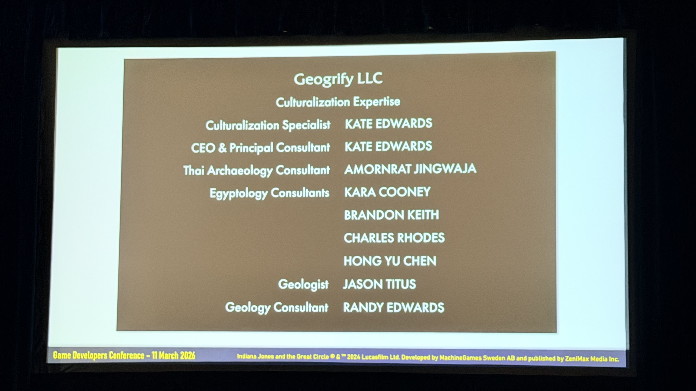

| 役割 | 担当者 |
|:---|:---|
| Culturalization Specialist（カルチャライゼーション専門家） & CEO | Kate Edwards |
| Thai Archaeology Consultant（タイ考古学コンサルタント） | Amornrat Jingwaja |
| Egyptology Consultants（エジプト学専門家） | Kara Cooney, Brandon Keith, Charles Rhodes, Hong Yu Chen |
| Geologist（地質学者） | Jason Titus |
| Geology Consultant（地質学コンサルタント） | Randy Edwards（Kate の父、88歳） |

---

## The Power of Intentional Creation

セッションの締めくくりとして、Edwards はこれまでの具体例を踏まえた総論スライドを示しました。

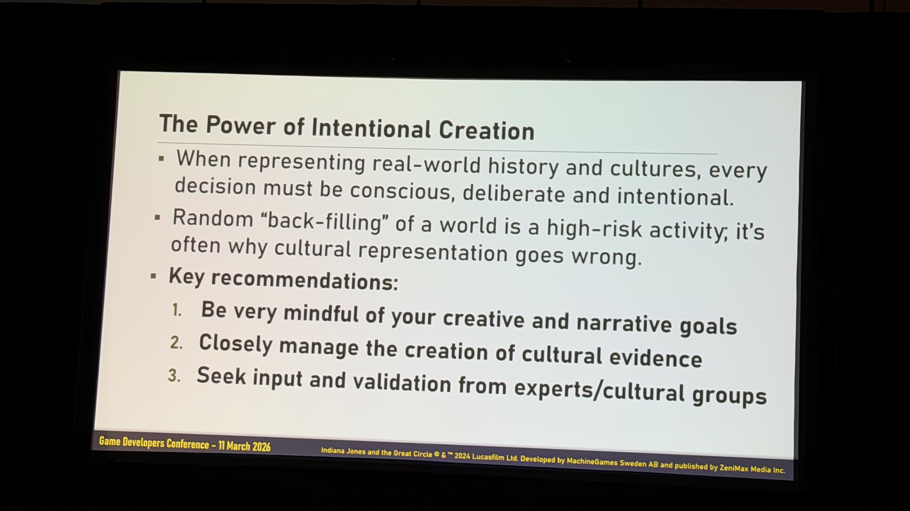

スライドの全文を以下に翻訳します：

- **When representing real-world history and cultures, every decision must be conscious, deliberate and intentional.**（現実の歴史と文化を表現するとき、すべての決定は意識的で、計画的で、意図的でなければならない）
- **Random "back-filling" of a world is a high-risk activity; it's often why cultural representation goes wrong.**（世界のランダムな「穴埋め」はハイリスクな行為であり、文化的表現が失敗する原因になりがちである）
- **Key recommendations:**
  1. **Be very mindful of your creative and narrative goals**（創作・ナラティブのゴールを常に意識する）
  2. **Closely manage the creation of cultural evidence**（「文化的証拠」の創出を緻密に管理する）
  3. **Seek input and validation from experts/cultural groups**（専門家・文化グループからのインプットと検証を求める）

**「文化的証拠（Cultural Evidence）」** とは、建物・遺物・アーティファクトなど「その文化がここに存在する」という説得力を与えるあらゆる要素のこと。架空の世界でも、この「証拠」が積み重なって初めて世界に説得力が生まれます。

Edwards は特に **「Random Backfilling（ランダムな穴埋め）」** を最大のリスクとして警告しました。世界を構築するとき、環境を埋めるためにオブジェクトをただ投げ込む行為です。

> 私が携わったすべてのゲームで、最もリスクが高いのはそこだ。チームがオブジェクトを環境に投げ込み始めるが、「なぜそこにあるのか？ この世界でどんな目的を果たすのか？ そこにある本当の理由はあるのか？ 現実世界の文化に合っているのか、あるいはデザインした架空の文化に合っているのか？」を考えない（that's usually where I see teams start throwing objects into the environment without really thinking about why is it there）。

避けるべきこととして **Cultural Appropriation（文化的流用：ある文化の要素を、その文化への理解や敬意なく表面的に借用すること）** も明示的に挙げています。架空の世界であっても、十分なアレゴリー距離とインスピレーションなしに他の文化のアーティファクトを使うことは「極めて不適切になり得る（can be extremely inappropriate）」と警告しました。

---

## カルチャライゼーション・プロセス

Edwards はカルチャライゼーションを開発フローに組み込む方法を、アニメーションスライドで説明しました。

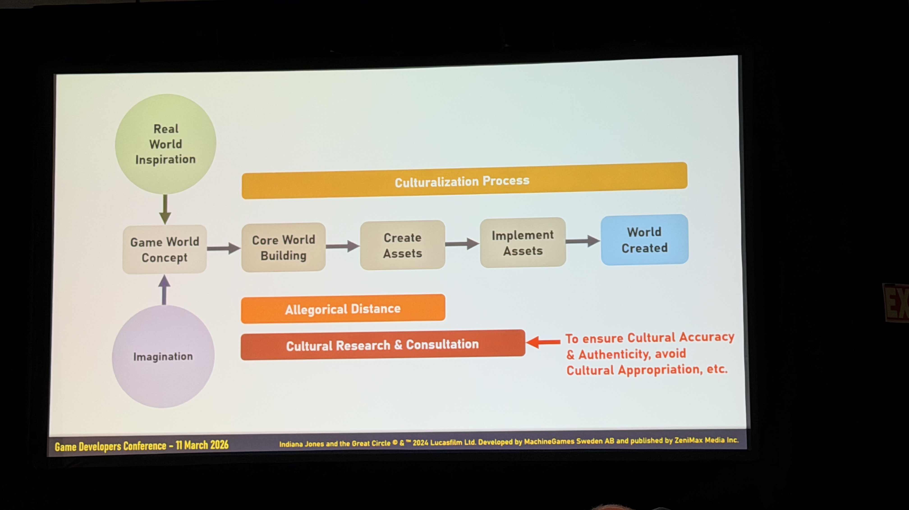

上から **Real World Inspiration**（現実世界からのインスピレーション）が、下から **Imagination**（想像力）が合流して **Game World Concept**（ゲーム世界のコンセプト）を形成し、**Core World Building**（世界構築の核）→ **Create Assets** → **Implement Assets** → **World Created** へと進みます。その上に黄色い帯で **「Culturalization Process」** がパイプライン全体を覆って並走しています。フロー図の下部にはオレンジ色のバーで **「Allegorical Distance」**（アレゴリー距離）と、赤色のバーで **「Cultural Research & Consultation」**（文化調査とコンサルテーション）が配置され、赤色バーには注釈として「To ensure Cultural Accuracy & Authenticity, avoid Cultural Appropriation, etc.」（文化的正確性と真正性を確保し、文化的流用を回避するため）と記されています。

フロー全体を整理すると：

```
Real World Inspiration
        +
    Imagination
        ↓
  Game World Concept ←──── Allegorical Distance（どこまで現実に寄せるか判断）
        ↓
  Core World Building ←─── Cultural Research & Consultation
        ↓                  （Cultural Accuracy & Authenticity 確保、
  Create Assets             Cultural Appropriation 回避）
        ↓
 Implement Assets
        ↓
  World Created
  ─────────────────────────
  ↑ Culturalization Process が全工程を覆う ↑
```

**最重要ポイント**: カルチャライゼーションは**最初から始める**。

> ローカライゼーションは「テキストが完成してから翻訳者に渡す」という誤解がいまだに多い。でも本来は最初から参加すべき。私も同じ——「どんな世界を作るのか、誰が登場するのか、プレイヤーのエージェンシー（player agency：プレイヤーが物語や世界に対して持つ主体的な選択・行動の自由度）は何か」、そこから始める。早い段階での修正は安い（fix it early, fix it cheap：開発後期の修正はコストが跳ね上がるという原則）。

---

## Is All This Effort Worth It?

すべての具体例を語り終えた Edwards は、白い背景にシンプルに一文だけが表示されたスライドを映し出しました——**「Is All This Culturalization Effort Worth It?」**（このカルチャライゼーションの努力はすべて報われるのか？）。会場が静まったところで、答えとなるレビューを次々と紹介していきます。

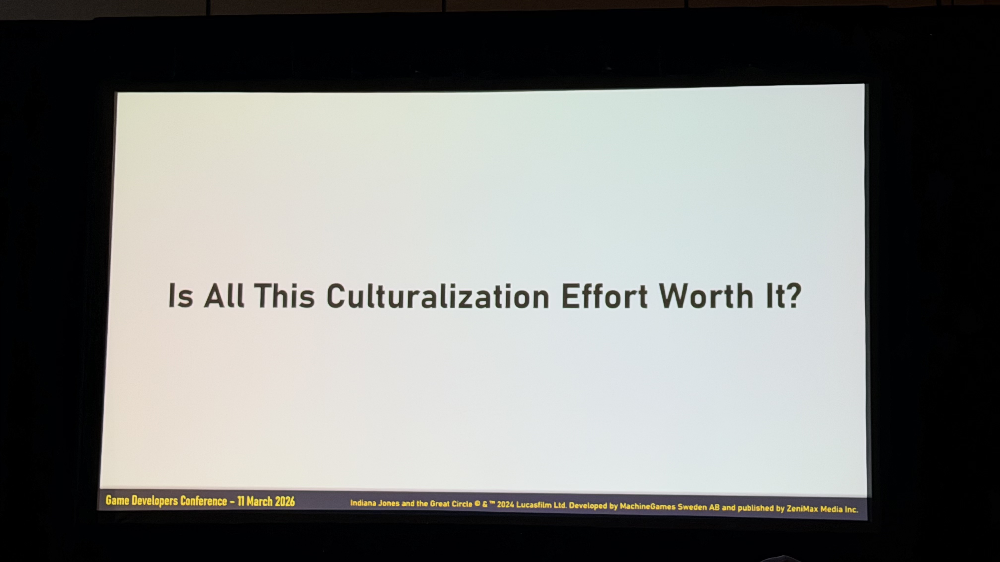

Edwards はゲームの高評価レビュースコアとともに、複数のレビューを次々と引用していきました。

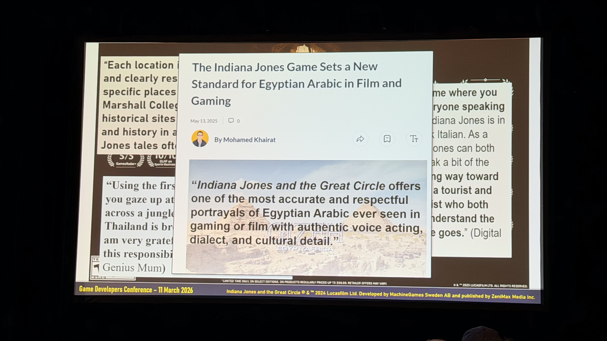

> *"Each location is meticulously detailed and clearly researched, recreating specific places from the films – like Marshall College – and actual historical sites alike, balancing fiction and history…"*
> — **GameSpot**

> *"This isn't the kind of game where you go to Egypt and find everyone speaking perfect English. When Indiana Jones is in Italy, the Blackshirts speak Italian…"*
>（「エジプトに行ったら全員が完璧な英語を話す、というタイプのゲームではない。イタリアにいるとき、黒シャツ隊（Blackshirts：ムッソリーニのファシスト民兵組織）はイタリア語を話す……」）
> — **Digital Trends**

> *"Using the first-person perspective as you gaze up at the Great Pyramid or across a jungle-framed river in Thailand is breathtaking…"*
>（「一人称視点で大ピラミッドを見上げたり、タイのジャングルに囲まれた川を眺めたりする体験は息をのむほど……」）
> — **Evil Genius Mum**

そして Edwards が最も誇りに思うフィードバックが——エジプト国内メディアの記事です。

> *"offers one of the most accurate and respectful portrayals of Egyptian Arabic ever seen in gaming or film with authentic voice acting, dialect, and cultural detail."*
> — Mohamed Khairat（2025年5月13日、エジプト国内メディア）

ゲームが発売されて数ヶ月後、エジプト国内のメディアがエジプトレベルの表現を「ゲームや映画でこれまで見た中で最も正確で敬意に満ちたエジプトアラビア語の表現のひとつ」と評しました。

> **That's the work. That's what you do.（それが仕事だ。それがやるべきことだ。）**
> たとえほとんどのプレイヤーがその文化の出身でなくても——あなたが表現している文化の人たちは必ずわかる。彼らにはわかるのです。それが重要なことだ。特定の現実世界の文化を表現するなら、少なくともその一つの文化の人たちが「あなたたちは真剣にやったんだ」とわかる——それが仕事をする理由だ。（if you're going to represent a specific real world culture, then at least that one culture will know that you were serious about doing it right）

この言葉は、日本のゲームが海外で「日本文化の描写が正確だ」と評価されたときの喜びと同じものです。自分たちの文化が正しく、敬意を持って表現されていると感じること——それがカルチャライゼーションの最終的な成果です。

---

## まとめ

| テーマ | 具体的なアプローチ |
|:---|:---|
| **アレゴリー距離** | 現実とフィクションの「距離」を意識し、距離が近いほど精度を上げる |
| **マップ精度** | 1937年の境界線・ITC Serif Gothic フォント・航路を歴史考証 |
| **Orthodrome** | Great Circle の正式カートグラフィー用語。ゲームタイトルとして使用 |
| **ムッソリーニ** | 実在の歴史的人物は写真資料からの精確な再現。許諾の検討も必要 |
| **環境の真正性** | 最大4人のエジプト学者を同時起用。タイの水位問題も考古学者が指摘。バチカン関係者からも称賛 |
| **ヒエログリフ** | 壁の文字は実際に解読可能（sAww wai Xr rx sHAt sStA Hr-m-Axt） |
| **アーティファクト** | 猫のミイラ等、実在の文化財を参照しつつ法的リスクも考慮し複製は避ける。「Random Backfilling」を警告 |
| **地質学的整合性** | 17種のレリック鉱石が古代交易路で地域に届く可能性を地質学者と確認 |
| **プロセス** | カルチャライゼーションは最初から。早期修正は安い |
| **成果** | エジプト国内メディアが「ゲーム・映画史上最高水準のエジプトアラビア語表現」と評価 |

> **Everything was intentional. Everything was thought through. Even almost over-thought through.**
> すべては意図的だった。すべては考え抜かれた。考えすぎなくらいに。（over-thought through：「考え抜いた」を超えて「考えすぎた」領域まで到達したという、誇りとユーモアを込めた表現）

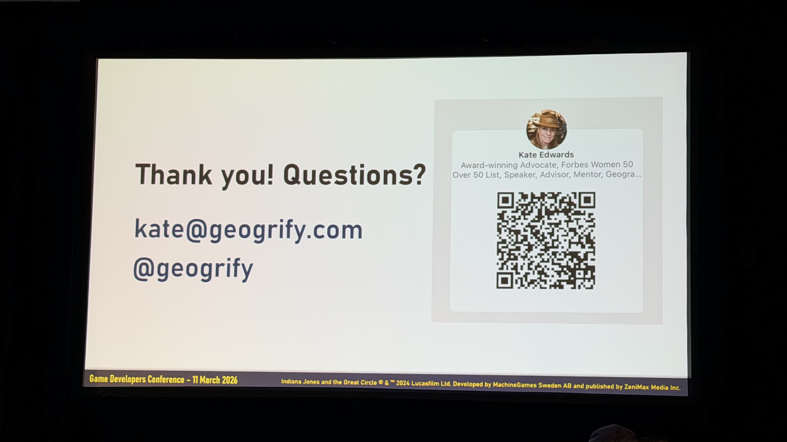
---

## 参考リンク

- [GDC 2026 公式スケジュール](https://schedule.gdconf.com/)
- [Kate Edwards — Geogrify](https://www.geogrify.com/)
- [Indiana Jones and the Great Circle — MachineGames](https://www.machinegames.com/games/indiana-jones-and-the-great-circle)
- [IGDA — International Game Developers Association](https://igda.org/)
